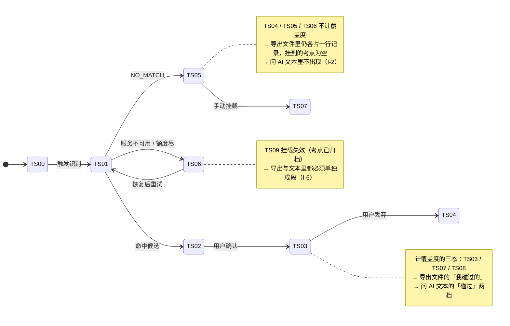

# M4 出口 · 域索引

> **基线**：`origin/v1` @ `73041df`，fetch 于 2026-09-02。
> **状态：活跃。** 出口条数增减、四条出口的前置条件矩阵变化、或「永不上锁」两条被改动，本文同一次改动内更新。
> **上一层**：[模块地图](../INDEX.md)

---

## 一、这一域在减法的哪一端

**端出差值。** 这一域既不维护被减数（骨架层），也不收减数（M1/M2），它一个字都不往库里写。

它做的是：把 `盲区 = 骨架层 − 行为层` 已经算出来的那个差值，搬到用户手上、或者搬到用户自己接的模型面前。
**整域只读** —— 域内没有任何一个动作会改变一条记录的状态（见 §五）。

由此推出这一域最硬的一条性质：**它没有任何理由失败。** 出口失败时可以少一份文件、少一段回答，
但不许动用户的数据（`导出与问AI` §十三 全表「数据留住了吗」一列必须全是 ✅）。

---

## 二、它服务于主流程的哪一步

**`J6 · 把它带走`**，唯一节点。

| 关系 | 说明 |
|---|---|
| 上游 | `J5` 看见盲区。用户点进 `J5` 之后的**第一个动作**就是本域 —— 这决定了本域的契约缺口比别处贵（§七） |
| 下游 | `J6 -.带着答案回来再学.-> J2`。用户拿模型的回答回去继续记，闭环不由本域承接 |
| 横切 `C2` 额度 | 只碰本域**一处** —— `U4.6` AI 代发。其余三条出口与额度无关（`I-4`） |
| 横切 `C3` 原图 | 在本域**只以否定形式出现**：原图不进导出文件、不进代发请求体、不进只读令牌的任何返回值 |
| 横切 `C1` 账号 | 四条出口都要账号；运行时唯一相关的情况是登录态中途过期，不是「未登录」 |

⚠️ `S-NODE` 上的「把这个考点带去问 AI」按新结构**整块归本域**，收在 `U4.4`。
它在 `看盲区` §3.2 只留一个入口行，行为与文本模板都不在那边定义。

---

## 三、它服务于哪一个关卡

**本域不产生任何一个关卡数字，这是有意的。**

关卡要的是「主动查看盲区的人数」，落点在 `J5`，不在 `J6`。导出次数、复制次数、代发次数
**都不是关卡指标**，也都不埋点（`导出与问AI` §十九：埋了它，下一步就是想办法把它做高，而做高它不会让任何一个人多看一次自己的盲区）。

本域服务关卡的方式只有一条：**不污染判据。**

| 如果 | 关卡会怎样 |
|---|---|
| 盲区诊断或导出进了付费墙 | 「点进去的比例」里混进支付转化率，判据不是变差是**变得没有意义**（`商业化与额度设计` §2.1） |
| 上锁之后再解锁 | 上锁容易解锁不可能 —— 收费那段时间的北极星数据不可重建，而关卡只能过一次（同上 §2.3） |

所以 §四 里 `U4.1`–`U4.5` 全部与付费状态无关，**这不是产品偏好，是两条不可逆决策**。

---

## 四、能力单元清单与下钻

| 单元 | 管什么 | 关键决策 |
|---|---|---|
| [`U4.1` 四条出口的性质](U4.1-四条出口的性质.md) | 四条出口各是什么、共用哪句话、谁要前置条件 | 前三条是用户自己带走、第四条是授权别人进来读；**导出与免费复制永不上锁**；出口 × 前置条件矩阵 |
| [`U4.2` 导出文件三格式](U4.2-导出文件三格式.md) | `md` / `csv` / `json` 怎么生成、怎么落地 | 无删减 无水印 不限次数；按考点节点分块不按字节；桌面「保存到哪」与移动「分享出去」不是同一句话 |
| [`U4.3` 导出字段清单](U4.3-导出字段清单.md) | 文件里有什么、为什么没有别的 | 🔴 记录正文不进导出；导出自检检的是「有没有洞」不是「洞里有没有装东西」；归档清单必须带（`I-6`） |
| [`U4.4` 复制给 AI](U4.4-复制给AI.md) | 免费路径，端上组装，零网络请求 | **永不移除** —— 它没有开关，因为它没有端点；零边际成本不计费；`S-NODE` 单考点入口收在这里 |
| [`U4.5` 问 AI 的文本模板](U4.5-问AI的文本模板.md) | 两条路径共用的那一段文字 | 🔴 逐槽位核过：12 个槽位没有一个能装下题目内容；用户手改之后产品的断言仍然成立 |
| [`U4.6` AI 代发提问](U4.6-AI代发提问.md) | 付费路径 | 🔴 额度为 0 时主入口是免费兜底不是购买；模型返回越界内容只标注不删改；成功才扣、失败不扣 |
| [`U4.7` 只读令牌](U4.7-只读令牌.md) | 让用户自己的 MCP 客户端进来读 | 四道锁冗余；明文只展示一次且真的拿不回来；签发前逐条列出它能读到什么与读不到什么 |

**七个单元共用的一句话在 `U4.1`**：带出去的东西里只有「有没有、几次、多久前」，外加考点名称与来源名称。
四条出口的内容边界是同一条，不是四条 —— 只要有一条比其它三条多带一类东西，那一条就是被绕过去的口子。

---

## 五、域级状态机

**本域是只读域：下面这张图上没有一条转移是由出口动作触发的。** 状态名取自 L2 总表 §四，本域只决定**读哪些态、读到之后放进输出的哪一段**。

**主轨四态在本域的作用只有一条**：`已落本地` / `待上传` / `已同步` 三态的数据**都可导**。
离线导出读的就是前两态，这是「你的数据是你的」的物理形态；一个断网就导不出的产品，说这句话时说的是「在我们的服务器上」。

---

## 六、前端行为意图 × 后端契约意图

| 出口 / 动作 | 前端行为意图 | 后端契约意图 | 状态 |
|---|---|---|---|
| 导出（小数据量） | 四步落地：选范围 → 选格式 → 生成 → 交给系统；交付前跑三条自检 | `GET /export?format=` —— 无删减、无水印、不限次数；**必须带完整归档清单**；响应里不得出现长文本字段 | ✅ 有契约（`技术架构与接口契约` §6.5） |
| 导出（大数据量） | 进度用「已完成/总数」两个整数；可取消；失败不交付半份 | 需要「发起 + 轮询」两个端点，按考点节点分块；失败要能区分「这一块」与「整个任务」 | 🚧 产品意图，无契约行 |
| **组装问 AI 的文本** | 🔴 端上生成，零网络请求。**没有端点就没有可以关掉的开关** | 🔴 **空** —— 按设计就不该有端点，但「它不该有端点」这句话本身也没写进契约 | 🔴 缺口（§七） |
| **AI 代发** | 先拿到模型名称与备案标识再发；流式；`done` 帧三条路径都要发出去 | 🔴 **空** —— `技术架构与接口契约` §6.7.1 引用了「代发端点」的内部扣减时机，而 §六 没有这一行 | 🔴 缺口（§七） |
| 额度预检 | 剩 0 时界面靠响应体决定兜底文案 | `POST /quota/precheck` —— 只读不扣减，剩 0 时响应体必须带手动入口提示 | ✅ 有契约（§6.7） |
| 额度扣减 | 界面明写「这次没算次数」 | **没有端点**，服务端内部动作：成功才扣、失败不扣、同一幂等键重试不重复扣 | ✅ 有契约（§6.7.1） |
| 签发 / 列出 / 吊销令牌 | 明文只展示一次；已吊销行不从列表消失；最后使用时间常驻 | `POST /tokens/readonly` / `GET /tokens` / `DELETE /tokens/{id}` —— 立即生效，不是软标记 | ✅ 有契约（§6.5） |
| MCP 只读访问 | 签发前逐条列出「能读到什么」与「读不到什么」 | 四道锁；只注册 5 个 tool，**不是禁用是不注册**；`/billing/**` 与 `/quota/**` 一律 403 | ✅ 有契约（§6.5 / §6.7.3） |

---

## 七、这一域碰到的边界 + 缺口登记

### 边界在这一域的形态

| 红线 | 在这一域怎么落 |
|---|---|
| 不判断对错 | 出口只搬运「有没有 / 几次 / 多久前」；代发的回答是模型说的，产品不加工、不评分、不排成计划、不落库 |
| 不做学科教研 | 学科判断发生在用户自己的模型里，产品既不在场也不知道结果 |
| **不存题干与机构内容** | 🔴 本域是这条红线**最容易破**的地方：界面上不写题干很容易，「顺手把记录正文也导出去」看起来完全合理。落点在 `U4.3` 与 `U4.5` |
| 不生成标签文本 | 出口带出去的考点名一律来自骨架闭集，产品没有任何路径能往这一类值里写自由文本 |
| 原图不上云不共享 | 原图不进导出文件、不进代发请求体、不进任何 tool 返回值；文件里连张数与尺寸都没有 |
| 没有第四种反馈形态 | 不做「后台导完通知你」、不做令牌到期提醒、不做异常使用告警 —— 三条都需要一套提醒机制 |

### 缺口登记（只登记，不裁定）

🔴 **第一条排在最前，理由不是它难，是它正接在北极星落点的正下游。**

| # | 缺口 | 缺的是哪一半 | 该谁定 |
|---|---|---|---|
| 🔴 **1** | **免费复制路径在 `技术架构与接口契约` §六 没有对应行** | 产品侧已定：端上组装、零网络请求、永不移除。**契约侧空白** —— 「这条路径按设计不该有端点」这句话没有任何一行契约承载，于是它是一条靠记忆传递的约定 | **技术同事**。产品补出来的就是第二份契约 |
| 🔴 **2** | **付费代发路径在 `技术架构与接口契约` §六 没有对应行** | 产品侧已定：发什么、什么时候扣、失败怎么办、六档错误要能区分。**契约侧空白** —— §6.7.1 已经引用了「代发端点」的内部扣减时机，而 §六 通读没有这一行 | 同上 |
| 3 | 导出的分块阈值与单文件大小上限（🚧 未实测） | 缺一个实测数：多大的量会让端上拼文件卡住、多大的文件会让 Web 端撑不住 | 技术侧按实测给 |
| 4 | 「很久没碰」的天数阈值与「最近的节奏」统计窗口（🚧） | 缺的是产品对「多久前」的一次分档口径，不该由实现顺手定 | **产品**，未定 |
| 5 | 记录正文要不要进导出，以及「导出我的全部数据」这句文案怎么改 | 产品裁定是不进；剩下的是那句「全部」怎么改，改哪一边要拍板 | **产品**，本域不改另一份规格的文案 |
| 6 | 模型返回越界内容时要不要做输出侧的词表闸 | `R-91` 未决：输出侧自检今天缺席，是补一道闸还是书面承认只靠数据面守 | **需人裁定**，本域不替它裁 |
| 7 | AI 代发的回答存不存 | 存了要回答「它算不算学习内容」；不存则换设备就没了 | **未定**，两条后果都要认 |
| 8 | 只读令牌的个数上限、名称长度上限、有效期（🚧） | 三个数都没有真源 | 技术侧 |
| 9 | 桌面壳算不算「Web 界面」 | 契约写死「在 Web 界面手动签发」，而桌面壳内嵌的就是同一份 web 产物 | **放宽它是安全边界的变更，产品不自行放宽** |
| 10 | 导出临时文件保留多久（🚧 占位 30 分钟） | 太短「再存一次」失效，太长一份含全部数据的文件在临时目录躺着 | 技术侧 |

上述 1–10 与 `导出与问AI` §二十一 的 `X-1`–`X-11` 同源，本节是按「缺哪一半 / 该谁定」重排，**不是第二处登记**。
