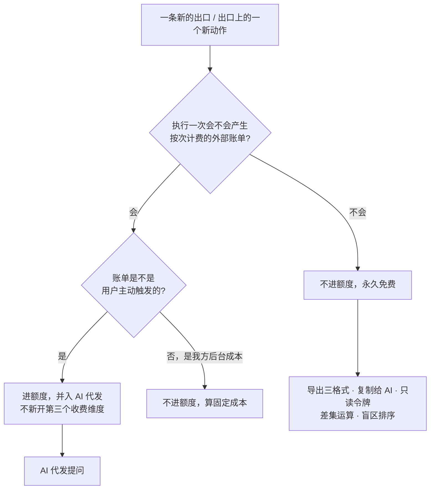
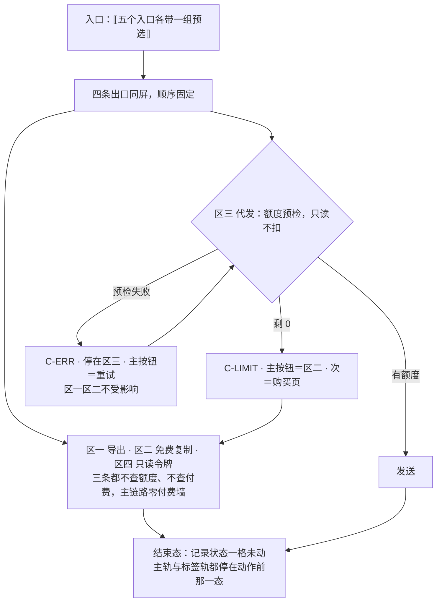

# U4.1 · 四条出口的性质

> **基线**：`origin/v1` @ `73041df`，fetch 于 2026-09-02。
> **状态：活跃。** 出口条数增减、前置条件矩阵任何一格变化、或「永不上锁」两条被改动，本文同一次改动内更新。
> **上一层**：[M4 出口 · 域索引](INDEX.md)

---

## 一、这个子能力是什么、不是什么

**是**：把「用户怎么把差值带出去」拆成四条性质完全不同的通道，并给出每一条的前置条件、内容边界与上锁资格。

**不是**：
- 不是一个导出按钮的四种样式 —— 四条出口的**性质不同**，不是同一件事的四个入口
- 不是屏幕布局说明（那在 `导出与问AI` §二）
- 不是四条出口各自的内部逻辑（那在本域其余六个单元，清单见域索引 §四）

**它要回答的只有三个问题**：这四条各是什么、它们共用哪句话、哪几条永远不许上锁。

---

## 二、详细产品逻辑

### 2.1 三条 + 一条，分界不在功能大小，在「谁在场」

| 出口 | 是什么 | 谁在场 |
|---|---|---|
| 导出文件 | 把我的数据整份拿走 | 用户自己，一次性 |
| 复制给 AI | 生成一段文字，用户自己粘到任何 AI 里 | 用户自己，一次性 |
| AI 代发 | 产品替用户把这段文字发给模型并把回答带回来 | 用户自己，一次性 |
| **只读令牌** | 签发一串只能读的凭证，让用户自己的客户端直接读他的盲区 | 🔴 **用户不在场，且持续有效** |

前三条是**用户自己把数据带出去**；第四条是**用户授权另一个程序进来读**（见 `导出与问AI` §1.2）。
所以第四条唯一多出来的产品要求是**可撤销**与**可见**：令牌列表常驻、最后使用时间常驻、吊销一步到位。
只读令牌那一单元的全部内容都是这两个词的展开。

### 2.2 四条出口共用同一句话

**带出去的东西里只有三件事：有没有、几次、多久前。** 外加两类名字：**考点名称**（来自骨架闭集）与**来源名称**（用户自己填的）。

| 出口 | 这句话的载体 | 它在哪被说给用户听 |
|---|---|---|
| 导出文件 | 文件内容 | 文件头的元信息块 + 导出按钮旁一行小字 |
| 复制给 AI | 预览框文本 | 预览框上方一行小字 + 文本自身的说明段 |
| AI 代发 | 发出去的请求体 | 与「复制给 AI」同一段文本，**逐字一致** |
| 只读令牌 | 5 个 tool 的返回值 | 签发页的「这个令牌能读到什么」清单 |

🔴 **内容边界是同一条，不是四条。** 只要有一条比其它三条多带了一类东西，那一条就是被绕过去的那个口子。
这也是为什么免费复制与付费代发**必须共用一个模板**：两条路径的文本一旦不同，内容边界就要核两遍，而核两遍的东西迟早只核一遍。

### 2.3 出口 × 前置条件矩阵

| 出口 | 已登录·免费 | 已登录·付费 | 无骨架 | 完全离线 |
|---|---|---|---|---|
| 导出文件（这台设备上的数据） | ✅ | ✅ | ⚠️ 只能导记录，导不出盲区 | ✅ **必须可用** |
| 导出文件（云端数据） | ✅ | ✅ | 同上 | ❌ 本机无缓存时受限 |
| 复制给 AI | ✅ | ✅ | ❌ 整区隐藏 | ✅ 本机数据可用 |
| AI 代发 | ✅ 额度内 | ✅ 额度内 | ❌ | ❌ |
| 只读令牌 | ✅ | ✅ | 不相关 | ❌ 签发与吊销都是服务端的写 |

**矩阵里没有「未登录」这一列。** 未登录不能记、不能看盲区、不能导出 —— 不是把导出关掉了，
是那时候一条数据都还没有（`用户价值与主流程` §2.1 `J1`）。运行时唯一与登录有关的情况是**登录态中途过期**。

🔴 **「已登录·免费」与「已登录·付费」两列，除了 AI 代发那一行，逐格相同。**
免费用户能完整走通「记录 → 看盲区 → 导出」，这条主链路上一个付费墙都没有。

### 2.4 哪两条永不上锁 —— 这是不可逆决策，不是产品偏好

**盲区诊断与导出，永不上锁。** 见 `商业化与额度设计` §二（该节自称全文最重要的一节）。

| 决策 | 结论 | 为什么不可逆 |
|---|---|---|
| 盲区诊断是否可进付费墙 | **永不** | 上锁之后北极星从「有多少人想看」变成「有多少人肯为看付钱」，关卡判据里混进支付转化率 —— 判据不是变差，是变得没有意义 |
| 导出是否可进付费墙 | **永不** | 「不删减、无水印、不限次数」这几个字里没有留下任何可以插进一道计费的位置。导出一旦收费，「你的数据是你的」就是空话 |

**为什么是「不可逆」而不是「暂不」**：上锁容易，解锁不可能。
一个从第一天就收费的能力后来免费叫「降价」，但**在它收费的那段时间里北极星已经被记错了，而那段数据不可重建** —— 关卡只能过一次。

本域范围内，`I-4` 就是这条决策的落点：**额度只碰外部模型调用，不阻断记录、不锁盲区、不锁导出、不锁免费复制。**

### 2.5 一个新出口该不该计费：判定只有一步



判据来自 `商业化与额度设计` §三：**收费的共同点不是「用户觉得值钱」，是「每执行一次，我方会收到一张按次计费的外部账单」。**
本域四条出口里只有 AI 代发满足这个条件，其余三条边际成本近似为零。

**这条原则的代价要认**：产品最有价值的部分永远免费，收费的是最没有差异化的部分。这个代价被接受，理由只有一条 ——
商业模型必须服从北极星指标，不能反过来。

### 2.6 四条出口在版面上的顺序，是产品判断不是排版偏好

| 顺序 | 为什么在这个位置 |
|---|---|
| 导出在最上 | 它是唯一一条对所有人、所有状态都成立的出口。放在第一屏是「你的数据是你的」在版面上的落点 |
| 免费复制紧随其后 | 它必须在付费路径**之上**。放在下面就变成了「付费不成再看看这个」 |
| AI 代发在免费复制之下 | 🔴 **付费增强不许挡在免费路径前面。** 额度耗尽时用户往上滚一屏就是完整可用的免费路径 |
| 只读令牌在最下 | 面向少数会配客户端的用户，且它是常驻管理界面不是一次性动作 |

⚠️ **不做吸底主按钮**：四条出口各有各的动作，一个吸底按钮会让用户读不出它属于哪一条 ——
而「导出」和「发给 AI」被误点的代价完全不同（一个不可撤销地花钱）。

---

## 三、前端行为意图 × 后端契约意图

| 事项 | 前端行为意图 | 后端契约意图 |
|---|---|---|
| 四条出口的入口可见性 | 四条常驻同一屏，顺序固定；只读令牌区在不支持签发的端上降级为只读列表，**不整区隐藏** | 无端点 —— 可见性完全由端决定 |
| 免费 / 付费的区分 | 🔴 只有 AI 代发一条读额度；其余三条不查额度、不因额度改变任何一格 | `GET /quota` 只读；**其余出口的端点不得接受、也不得返回任何额度字段** |
| 内容边界的一致性 | 四条出口的内容由同一个口径产出；免费复制与付费代发共用同一段文本 | 🔴 导出响应、代发请求体、MCP tool 返回值**三处的字段集合必须同源**；任何一处新增一类字段都是内容边界变更 |
| 登录态中途过期 | 受限态不是弹窗；免费复制始终在受限提示的上方可用 | 令牌续期端点先行；续期失败才按登录态过期处置 |
| 无骨架 | 导出仍可导（只有记录）；问 AI 两条路径整区隐藏 | 骨架为空要能被区分出来，不能与「请求失败」共用一个错误 |
| 离线 | 导出与免费复制走本机数据，**不显示错误色、不显示重试按钮** —— 它们没有失败 | 不涉及 |

---

## 四、边界与红线在这里的具体形态

| 边界 | 在这一单元的形态 |
|---|---|
| 不判断对错 | 四条出口搬运的只有「有没有 / 几次 / 多久前」加两类名字。矩阵里没有一格的条件是「学得好不好」 |
| **不存题干与机构内容** | 内容边界是**同一条**这件事，本身就是这条红线的守法：四条各有一条边界等于四个可以各自放宽的口子 |
| 原图不上云不共享 | 四条出口无一携带原图。只读令牌的「读不到什么」清单里明写这一项 |
| 没有第四种反馈形态 | 四条出口都不产生提醒；令牌到期只在列表行上显示状态，用户不打开就不会看到 |
| `I-4` 额度只碰外部模型调用 | 矩阵里除 AI 代发外没有一格出现额度条件；这是 `I-4` 在本域的可验证形态 |

🔴 **一条可断言的检查**：把额度设为 0，免费用户仍然能完整拿到导出文件与那段可复制的文字，
且屏幕上不出现次数、剩余、限制、升级相关的任何字样。这一条不过，`I-4` 就是坏的。

---

## 五、缺口登记

| # | 缺口 | 缺的是哪一半 | 该谁定 |
|---|---|---|---|
| 1 | 🔴 免费复制与付费代发两条路径**都没有契约行** | 产品侧四条出口的性质、前置条件、内容边界都已定；契约侧这两条是空的 | 技术同事。见域索引 §七 第 1、2 条 |
| 2 | 桌面壳算不算「Web 界面」 | 只读令牌的契约写死「在 Web 界面手动签发」，而桌面壳内嵌的是同一份 web 产物。矩阵里「只读令牌 × 桌面壳」这一格因此没有答案 | **放宽它是安全边界的变更，产品不自行放宽** |
| 3 | 小程序端本屏整屏不提供 | 这是已裁定的结论（承诺的执行权不在我们手上时，不做好过做一个做不到承诺的版本），但矩阵里没有「小程序」这一列 —— 端矩阵在 `M6`，本域不重画 | 无缺口，仅提示不要在本域补一列 |

---

## 六、线框

> 记号与屏宽照 `线框与交互规格约定` §三（40 个半角字符），组件只引锚不抄规格。
> 本单元只画**四条出口在同一屏上的排布与上锁资格**；单条出口内部的形态在本域其余单元（清单见域索引 §四）。

### 6.1 常态整屏

```
┌────────────────────────────────────────┐
│ ⟦返回⟧ ⟦屏标题⟧         ← P-NAV        │ ※1
│ ⟦范围·全部/科目/这一个考点⟧ ← C-PICK   │ ※1
│ ⟦离线细条⟧              ← C-OFFLINE    │
├────────────────────────────────────────┤
│ 区一 · 导出文件                   ※2   │
│  ⟦格式三选一⟧           ← C-PICK       │
│  (        导出        ) ← C-BTN 主     │
│  ⟦边界小字 → 导出与问AI §2.4⟧          │
├────────────────────────────────────────┤
│ 区二 · 复制给 AI                  ※2   │
│  ⟦边界小字 → 导出与问AI §2.4⟧          │
│  ▢ ⟦模板文本·可编辑⟧    ← C-INPUT      │
│  [        复制        ] ← C-BTN 次     │
├────────────────────────────────────────┤
│ 区三 · 让 AI 直接回答             ※3   │
│  ⟦剩余次数·未回时不写 0⟧               │
│  [        发送        ] ← C-BTN 次     │
├────────────────────────────────────────┤
│ 区四 · 只读令牌  ⟦令牌行·C-LIST⟧  ※4   │
│  [    签发一个新的    ] ← C-BTN 次     │
└────────────────────────────────────────┘
```

※1 顶栏与范围选择器固定不随滚动，范围一改四个区一起重算；「这一个考点」一项只在从考点详情带标识进来时渲染。离线细条在线时**整条不渲染**
※2 🔴 **永不上锁的就是这两区。** 判据不是画了什么，是**数不到**：这两区里没有一个额度槽位、没有一处锁形、没有一个灰按钮、没有一句额度提示（`I-4`）。「上次导出」只显示时间不显示次数 —— 显示次数会把导出做成一个可比较的数字
※3 全屏唯一带额度的一区，且版面上它**必须在区二之下**
※4 令牌与额度无关；这一区常驻，任何端上都不整区隐藏

### 6.2 其余各态：只画变化区

```
│ 骨架 C-SKEL                            │
│  区一 ( 导出 ) 禁用  ※5                │
│  区二 ▢ ··· ···      区四 ··· ···      │
├────────────────────────────────────────┤
│ 空态 C-EMPTY（范围内 0 记录 0 考点）   │
│  区一 ( 导出 ) 仍可点 → 只含元信息     │
│  区二/区三 隐藏  ⟦为什么空 + 去记一条⟧ │
├────────────────────────────────────────┤
│ 错误态 C-ERR（拉取失败且无缓存）       │
│  区一禁用 区二/三隐藏 区四 ( 再试一次 )│
├────────────────────────────────────────┤
│ 陈旧数据态（失败但有缓存）             │
│  ⟦这是刚才的数据⟧ 区一/二同常态 三禁用 │ ※5
├────────────────────────────────────────┤
│ 受限态 C-LIMIT · 缺额度                │
│  区一/区二 ⟦同常态⟧，一格不变  ※6      │
│  区三 ⟦缺什么 + 还剩 0 次⟧             │
│   (  回到上面那段文字复制  ) ← 主  ※7  │
│   ‹ 次数怎么加 › → 模块地图 §三 U7.3   │
├────────────────────────────────────────┤
│ 受限态 C-LIMIT · 缺登录（登录态过期）  │
│   ( 去登录 )            ← C-BTN 主 ※8  │
```

※5 🔴 区一的禁用只有两种成因：**加载中、范围内没有数据**，没有第三种。区三在陈旧态下禁用是「不拿旧数据发给模型」，是数据新鲜度判断不是上锁
※6 🔴 受限态**永远不是弹窗**，区一区二始终在它上方原样可用
※7 🔴 主按钮是免费兜底那一条（区二），付费入口只能是文本按钮
※8 缺登录这一档**没有免费兜底**，主按钮就是去登录 —— `C-LIMIT` 明写「约束的是付费墙，不是登录门」

### 6.3 红线自查十条，逐张数过

| # | 数这一样 | 本单元 |
|---|---|---|
| 1–4 | 正确率 / 讲解 / 提醒 / 打卡 | 0：四个区的槽位没有一个是评价或提醒 |
| 5–6 | 进度环、百分比、倒计时紧迫感 | 0：本单元不画进度；受限文案里不出现解锁、升级、限时 |
| 7–8 | 能装下题干的格子、置信度 | 区二的预览框是用户自己的框，产品生成的那一版逐槽位核过且一个字不回存；置信度 0 |
| 9–10 | 原图入口 / 三处必须出现的东西 | 🔴 0，本域原图只以否定形式出现；三处落在 `模块地图` §三登记的 `U8.3` / `U8.4`，本域不重画也不弱化 |

---

## 七、交互规格

### 7.1 必答五项

| # | 必答 | 本单元的答案 |
|---|---|---|
| 1 | **入口** | 五个：设置屏的带走数据入口、盲区总览的出口入口、考点详情的单考点入口、注销前的先导出提示、深链与返回栈。前四个各带一组预选（范围/格式/落地滚动位置/焦点，`导出与问AI` §2.3），深链沿用上次的选择（`P-NAV`） |
| 2 | **结束状态** | 🔴 **本域只读，四条出口没有一条会改记录的状态**：主轨仍停在动作前的 `已落本地` / `待上传` / `已同步`，标签轨仍停在原来的 `TS-00`–`TS-09`。本单元的终态是**任务态**（`导出与问AI` §4.2 / §4.3 / §4.4 已登记，与记录状态是两条不相干的轨） |
| 3 | **失败落点** | 失败只发生在区三与区四：各自停在本区，主按钮＝再试一次。🔴 **区一区二在任何失败下都停在常态并保持可用** —— 它们没有失败，也就没有落点 |
| 4 | **空态** | 一种成因：范围内 0 条记录且 0 个考点。区一仍可导出（只含元信息的文件），区二区三整区隐藏，区四不受影响，立刻能做的动作是去记一条 |
| 5 | **错误态** | 可重试（网络、超时、服务端临时问题）给重试；有缓存时是陈旧数据态不是错误态；不可重试的只有一类 —— 范围指向的考点已归档，那不是错误，**照导，文件里标出来** |

### 7.2 受限态（按需追加项）

| 档 | 缺什么 | 主按钮 | 付费入口 |
|---|---|---|---|
| 缺额度 | 区三剩余次数为 0 | 🔴 **免费复制那一区**（本域另一个单元，清单见域索引 §四） | 文本按钮去购买页 |
| 缺登录 | 已登录后登录态过期 | 去登录，这一档没有免费兜底 | 无 |
| 缺骨架 | 范围内考点表还没建好 | 去记一条（不给等待提示） | 无 |

🔴 **三档里没有一档会让区一或区二进受限态。** 出现了就是 `I-4` 坏了，不是文案问题。⚠️ **本单元不写任何端点**：免费复制与付费代发两条路径在契约表里都**没有行**，一律标 `[契约缺]` —— 界面需要后端能区分的只有四档：缺骨架 / 缺额度 / 缺登录 / 请求失败。

### 7.3 交互流程


