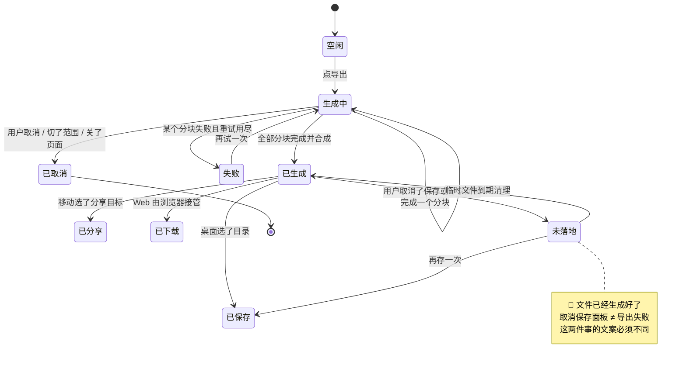
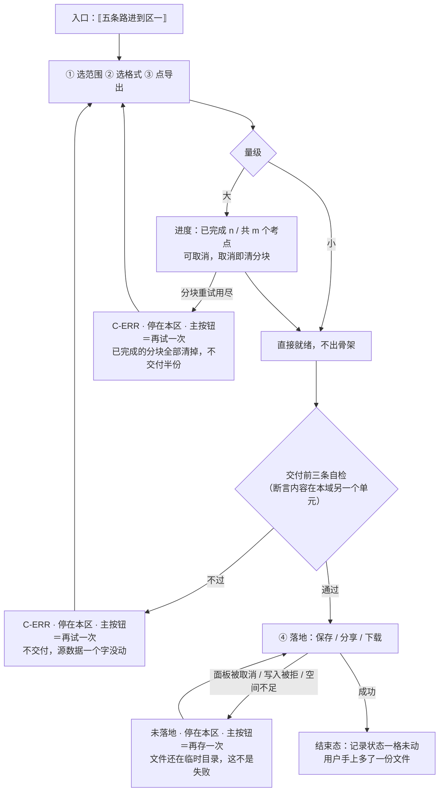

# U4.2 · 导出文件三格式

> **基线**：`origin/v1` @ `73041df`，fetch 于 2026-09-02。
> **状态：活跃。** 格式增减、分块口径变化、或落地方式在某个端上改变，本文同一次改动内更新。
> **上一层**：[M4 出口 · 域索引](INDEX.md)

---

## 一、这个子能力是什么、不是什么

**是**：把范围内的数据生成一个用户手上的文件，三种格式各自面向一类读者，并把「生成 → 落地」这条路走完。

**不是**：
- 不是「文件里有什么」（那是本域另一个单元，清单见域索引 §四；本单元只管**怎么生成、怎么落地**）
- 不是导出的技术实现（编码、换行、转义的具体规则在 `导出与问AI` §6.5 / §6.11）
- 不是一个可以被付费状态改变的能力 —— 本单元的每一步都与档位无关

---

## 二、详细产品逻辑

### 2.1 三种格式，没有推荐项

| 格式 | 给谁用 | 产物形态 |
|---|---|---|
| `Markdown` | 人读 / 直接粘给 AI | 单文件 |
| `CSV` | 表格软件 | **一个压缩包**，内含考点、记录、元信息三张表 |
| `JSON` | 自己写脚本 | 单文件 |

⚠️ **界面上不许有「推荐」标记** —— 三种格式没有优劣，只有面向的读者不同。

🔴 **`CSV` 必须是压缩包，不是一个文件。** 一个 CSV 文件只能装一张表，而导出必须同时给出考点、记录与元信息；
把三张表塞进一个文件会让程序再也读不回来 —— **那样它就不是 CSV 了**。这是格式定义的约束，不是打包偏好。

三种格式的编码与换行差异是踩过的坑（`导出与问AI` §6.5）：`CSV` 带 BOM 是为了让简中系统上的表格软件不猜编码，
`JSON` 与 `Markdown` 不带 BOM 是因为带了会让解析器与渲染器在第一个字符上出问题。**这三格不是风格偏好。**

### 2.2 「不删减、无水印、不限次数」的口径

| 说法 | 口径 |
|---|---|
| 不限次数 | 字面意思。**没有上限也没有下限**，界面上永不出现「今天已导出 N 次」。上次导出只显示时间，**不显示次数** —— 显示次数会把导出做成一个可比较的数字，而它不是本产品要提高的任何一个数 |
| 无水印 | 文件里不含任何产品标识以外的东西。元信息块里的产品名不是水印 |
| 不删减 | 🔴 **口径是「不因付费与否而少给」**，免费档与付费档拿到的字段完全一致。**它不是「把库里每一列都倒出来」** —— 这一点在字段清单那一单元有一个具体的、有争议的落点 |
| 不限条数 | 一条记录的新用户与五千条记录的老用户，拿到的字段清单完全一致，没有任何一条数据被省略 |

### 2.3 四步，一步都不能加

| 步 | 用户做什么 | 不允许发生什么 |
|---|---|---|
| ① 选范围 | 全部 / 某个科目 / 这一个考点 | 不允许弹「确定要换范围吗」 |
| ② 选格式 | 三选一 | 不允许有「推荐」标记 |
| ③ 生成 | 点导出 | 🔴 **不允许要求登录、不允许要求邮箱、不允许发到邮件、不允许排队审核** |
| ④ 落地 | 交给系统 | 不允许在这一步再问一次「要不要升级」 |

🔴 **这四步里没有任何一步能被付费状态改变。**

⚠️ **范围与格式的性质不同，不能互相覆盖**：范围是这次动作带来的信息（从考点详情进来就是这一个考点），
格式是用户的长期偏好（上次选了什么这次还是什么）。

### 2.4 导出任务状态机

**状态名取自 `导出与问AI` §4.2。** 它是一次导出动作的任务态，**与 L2 总表 §四 的记录状态是两条不相干的轨** ——
本域是只读域，导出任务的任何一态都不会改变一条记录的状态。



**这张图上每一态的「数据留住了吗」都是 ✅。** 出口层的任何一次失败都不该动用户的数据，
失败的只能是这次出口动作本身 —— 这一列出现一个 ❌，那一行就是必须先修掉的设计，不是一条待办。

### 2.5 大数据量：分块与进度

| 事 | 规则 | 为什么 |
|---|---|---|
| 分块单位 | **按考点节点分块，不按字节** | 字节分块会把一行劈成两半；节点分块的每一块都是自洽的 |
| 进度怎么表达 | 「已完成 / 总数」**两个可数的整数**，不是百分比条 | 百分比在最后一块很大时会长时间停在 97%，而两个整数在任何时刻都是诚实的 |
| 取消 | 立即停止，已完成的分块**立即删除** | 不留半份文件 |
| 失败重试 | 单块自动重试有限次；仍失败则整个任务失败 | **不交付半份文件** |
| 生成中骨架版本更新 | 用开始时的版本生成完，不提示 | 文件必须自洽 |
| 🔴 不做的事 | 不做「后台继续导出，完了通知你」 | 那需要一套通知机制，而本产品不做提醒 |

🚧 **触发分块的阈值与单文件大小上限，本域不定。**
产品能给的只是「超过一屏可滚完的量级就要有进度」这句话；**具体条数与字节数需要实测**，原样登记在 §五。
在它定下来之前，进度条的触发点只能拍脑袋 —— **这里不许自己拍一个数顶上**。

### 2.6 桌面「保存到哪」与移动「分享出去」

| | 桌面 | 移动 | Web | 小程序 |
|---|---|---|---|---|
| 落地方式 | 系统保存对话框，用户自己选目录 | 系统分享面板 | 浏览器下载 | **不提供** |
| 用户能不能取消 | 能 → 未落地 | 能 → 未落地 | 基本不能 | —— |
| 成功之后 | 可以告诉他文件在哪 | **只能说「导出好了」** | —— | —— |
| 文件名 | 产品给默认名，用户可改 | 产品给默认名，用户一般改不了 | 产品给默认名 | —— |

🔴 **移动端没有「保存到哪」这个概念，所以不能照搬桌面的文案。**
桌面能说「已保存到某个目录」，移动只能说「导出好了」—— 说「已保存」而用户其实点的是「发给某个聊天工具」，那句话就是假的。
**这不是文案润色，是一句话在一个端上为真、在另一个端上为假。**

**小程序端整屏不提供导出**，理由与原图通道的裁定同形：**承诺的执行权不在我们手上时，不做好过做一个做不到承诺的版本。**
不在小程序上做一个弱化版的导出。

### 2.7 离线必须可用

| 出口路径 | 完全离线 |
|---|---|
| 导出本机数据 | 🔴 **必须可用，无任何降级** |
| 导出云端数据 | 本机有缓存则可用并标明「这是刚才的数据」；无缓存则受限 |

🔴 **离线时导出按钮上不加「离线」字样，也不显示错误色与重试按钮。** 它没有失败，不需要重试。
一个断网就导不出数据的产品，说「你的数据是你的」时说的是「在我们的服务器上」。

---

## 三、前端行为意图 × 后端契约意图

| 事项 | 前端行为意图 | 后端契约意图 |
|---|---|---|
| 小数据量导出 | 一次拿到整份文件，200ms 内不出任何加载态（避免闪烁） | `GET /export?format=` —— 已有契约：无删减、无水印、不限次数，必须带完整归档清单 |
| 大数据量导出 | 进度用两个整数；可取消；取消即清分块 | 🚧 需要「发起 + 轮询」两个端点：返回任务标识与分块总数；进度必须是两个整数；**失败要能区分「这一块失败」与「整个任务失败」** —— 少这一档界面就只能说「没成」 |
| 分块单位 | 端上按块合并 | 🔴 分块单位是**考点节点**，不是字节 |
| 生成中骨架更新 | 无提示 | 任务按发起时的骨架版本锁定，中途更新不影响本次 |
| 离线导出 | 读本机数据在端上直接拼文件 | **无请求。** 这条路径不经过任何端点，也不该被加上一个端点 |
| 落地 | 交给系统（保存对话框 / 分享面板 / 浏览器下载）；未落地不是失败 | 不涉及 —— 落地全在端上 |
| 交付前自检 | 三条断言不过就不交付（断言内容属字段清单那一单元） | 服务端不依赖这道自检；它是**客户端的最后一道**，不是替代 |

---

## 四、边界与红线在这里的具体形态

| 边界 | 在这一单元的形态 |
|---|---|
| `I-4` 不锁导出 | 状态机里区分导出可用性的只有两件事：**加载中、没有数据**。没有任何一态是「因为没登录」或「因为没付费」 |
| 不判断对错 | 导出是一次搬运，文件里不产生任何评价性的数字。「上次导出」只显示时间不显示次数，也属于这条 |
| 没有第四种反馈形态 | 🔴 不做「后台导完通知你」。这条约束直接决定了大数据量必须在前台带进度做完，而不是转成一个后台任务 |
| 原图不上云不共享 | 导出产物里没有任何图片相关的东西 —— 这一条的具体清单属字段清单那一单元 |
| 空数据也导 | 范围内一条都没有时**仍然导出成功**，得到一份只有元信息的文件。这也是「你的数据是你的」的一部分 |

---

## 五、缺口登记

| # | 缺口 | 缺的是哪一半 | 该谁定 |
|---|---|---|---|
| 1 | **分块阈值与单文件大小上限**（🚧 未实测） | 产品侧已定：超过某个量级就要有进度、进度用两个整数、按节点分块。**缺的是那个量级的数** —— 需要实测多大的数据量会让端上拼文件卡住 | 技术侧按实测给。与「整棵骨架树一次返回的上限」是同一类问题 |
| ✅ 2 | ~~大数据量导出的两个端点没有契约行~~ | **已闭合（2026-09-03）**：`接口契约：签名与错误码全集` §6.3「发起 + 轮询」，产品侧给的四条语义要求逐条落进去了 | 已补 |
| 3 | 导出临时文件保留多久（🚧 占位一个数） | 太短，用户取消保存后回来就「再存一次」失效；太长，一份含全部数据的文件在临时目录里躺着。**两头的代价都清楚，中间那个数没定** | 技术侧 |
| 4 | Web 端单次可承载的文件大小 | 端相关，未测。它决定什么时候必须降级成分段下载 | 技术侧，端矩阵在 `M6` |

---

## 六、线框

> 记号与屏宽照 `线框与交互规格约定` §三（40 个半角字符），组件只引锚不抄规格。
> 本单元只画**生成与落地**这一区；文件里有什么在本域另一个单元（清单见域索引 §四）。

### 6.1 常态整屏

```
┌────────────────────────────────────────┐
│ ⟦返回⟧ ⟦屏标题⟧         ← P-NAV        │
│ ⟦范围·全部/科目/这一个考点⟧ ← C-PICK   │ ※1
│ ⟦离线细条⟧              ← C-OFFLINE    │ ※2
├────────────────────────────────────────┤
│ 区一 · 导出文件                        │
│  ◉ ⟦md·给人读⟧                         │ ※3
│  ○ ⟦csv·给表格软件·产物是压缩包⟧       │
│  ○ ⟦json·给自己写脚本⟧  ← C-PICK 单选  │
│  ⟦所选格式的一行说明⟧                  │
│  (        导出        ) ← C-BTN 主     │ ※4
│  ⟦边界小字⟧ ⟦上次导出·只有时间⟧        │
├────────────────────────────────────────┤
│ ⟦区二/三/四·不重画→导出与问AI §2.1⟧    │
└────────────────────────────────────────┘
```

※1 范围一改，正在生成的任务静默作废并按新范围重来
※2 🔴 离线时这一区**完全正常**：按钮上不加离线字样，不出错误色、不出重试按钮 —— 它没有失败，不需要重试
※3 🔴 三种格式**没有推荐标记**，只有面向的读者不同
※4 🔴 这个按钮**永不因为付费状态改变**；它的禁用成因只有两个，见 ※5

### 6.2 其余各态：只画变化区

```
│ 生成中（大数据量）                     │
│  ( 导出 ) 本态不可重复点击  ※5         │
│  ⟦进度·已完成 {n} / 共 {m} 个考点⟧  ※6 │
│  [       取消       ]   ← C-BTN 次 ※7  │
├────────────────────────────────────────┤
│ 骨架 C-SKEL：形状不变 ( 导出 ) 禁用 ※8 │
├────────────────────────────────────────┤
│ 空态 C-EMPTY（范围内 0 记录 0 考点）   │
│  ⟦为什么空⟧ ( 导出 ) 仍可点 ※9         │
│  [ 去记一条 ]           ← C-BTN 次     │
├────────────────────────────────────────┤
│ 错误态 C-ERR                           │
│ ⟦哪一步没成·三句⟧( 再试一次 )[缩小范围]│ ※10
├────────────────────────────────────────┤
│ 未落地（面板被取消）——🔴 不是失败      │
│ ⟦文件已经好了⟧( 再存一次 ) ← 主   ※11  │
├────────────────────────────────────────┤
│ 陈旧：⟦这是刚才的数据⟧( 导出 )照常可点 │
├────────────────────────────────────────┤
│ 受限态 C-LIMIT · 缺数据 / 缺骨架       │
│  ⟦缺什么·两句不共用一句⟧               │
│  ( 照样导出这台设备上有的 ) ← 主  ※12  │
│  [ 去记一条 ]                          │
```

※5 禁用成因**只有两个**：正在生成、范围内没有数据。没有第三个
※6 🔴 **两个可数的整数，不是百分比、不是进度环**；且它是**文件生成进度**，与学习进度、覆盖度没有任何关系 —— 混在一屏上就是把「导了几块」读成「学了多少」
※7 取消后已完成的分块立即删除，不留半份文件；取消不给提示（是用户自己取消的）　※8 请求在阈值内回来就不出骨架
※9 🔴 空范围**照样导出成功**，得到一份只有元信息的文件 —— 空不是禁用理由
※10 不可重试那一档给的是换一条路，不是重试　※11 🔴 **取消保存/分享面板 ≠ 导出失败**，两件事的槽位必须不同
※12 🔴 这两档里**一个付费入口都没有** —— 导出永不上锁，主按钮永远是那条免费能走通的路（`I-4`、`C-LIMIT`），也不给等待提示

### 6.3 红线自查十条，逐张数过

| # | 数这一样 | 本单元 |
|---|---|---|
| 1–4 | 正确率 / 讲解 / 提醒 / 打卡 | 0 |
| 5 | **进度环 / 百分比 / 完成度条** | 🔴 0：进度是「已完成 {n} / 共 {m} 个考点」两个整数，且是文件生成进度 |
| 6–8 | 倒计时紧迫感、能装下题干的格子、置信度 | 0：本区只有格式单选与按钮，没有输入框；临时文件保留时长不上屏成倒计时 |
| 9–10 | 原图入口 / 三处必须出现的东西 | 🔴 0，产物里没有任何图片相关的东西；三处落在 `模块地图` §三登记的 `U8.3` / `U8.4`，本单元不重画也不弱化 |

---

## 七、交互规格

### 7.1 必答五项

| # | 必答 | 本单元的答案 |
|---|---|---|
| 1 | **入口** | 四步的起点只有一个按钮，但进到这一区有五条路：设置屏的带走数据入口、盲区总览的出口入口、考点详情的单考点入口、注销前的先导出提示、深链与返回栈。预选与落地滚动位置见 `导出与问AI` §2.3，登录后回跳沿用 `P-NAV` |
| 2 | **结束状态** | 🔴 **一条记录的状态一格未动**：主轨仍是动作前的 `已落本地` / `待上传` / `已同步`，标签轨仍是原来的 `TS-00`–`TS-09`。终态是**导出任务态**（`导出与问AI` §4.2 已登记，与记录状态两条不相干的轨），且它每一态的「数据留住了吗」都是 ✅ |
| 3 | **失败落点** | 生成失败 → 停在本区，主按钮＝再试一次、次＝缩小范围；落地失败（写入被拒 / 空间不足 / 面板被取消）→ 停在本区，**文件还在临时目录**，主按钮＝再存一次；浏览器拦下载 → 停在本区，给一个显式的手动下载落点。三条都不是「给个提示然后没了」 |
| 4 | **空态** | 两种成因两张态：①范围内 0 记录 0 考点 → 仍可导出一份只含元信息的文件，次动作去记一条；②所选科目考点表还没建好 → 照样导记录，**不给等待提示、不给预计时间** |
| 5 | **错误态** | 可重试：生成失败、生成超时、分块重试用尽（🔴 不交付半份文件）。不可重试：这一次的量在这个端上撑不住 → 换一条路（缩小范围 / 换个端）。有缓存时是陈旧数据态不是错误态 |

### 7.2 受限态（按需追加项）

| 档 | 缺什么 | 主按钮 | 付费入口 |
|---|---|---|---|
| 缺数据 | 离线且云端数据无本机缓存 | 导出这台设备上已有的那部分 | 🔴 无 |
| 缺骨架 | 范围内考点表还没建好 | 照样导出（只有记录） | 🔴 无 |
| 缺登录 | 已登录后登录态过期 | 去登录（这一档没有免费兜底） | 🔴 无 |

🔴 **导出这一区永远不会出现付费入口，也永远不会因为付费状态改变任何一步。** 出现了就是 `I-4` 坏了。⚠️ **本单元不写任何端点**：大数据量导出的「发起 + 轮询」契约**已于 2026-09-03 补齐**（`接口契约：签名与错误码全集` §6.3）—— 界面需要后端能区分的是两档：**这一块失败**与**整个任务失败**，少这一档界面就只能说「没成」。

### 7.3 交互流程


