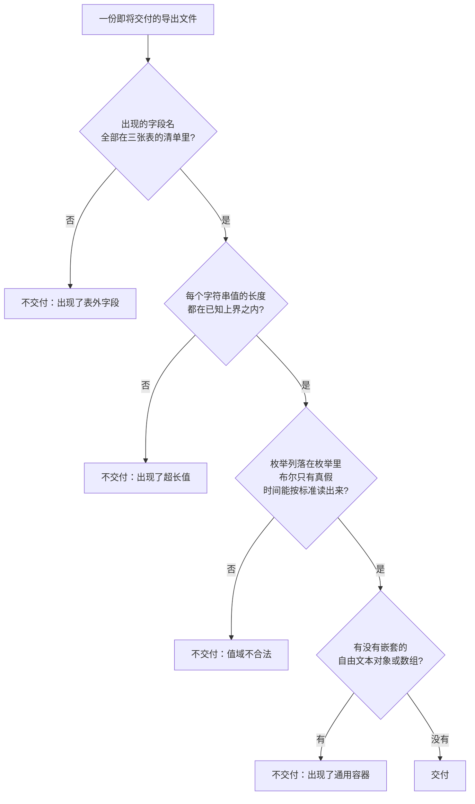

# U4.3 · 导出字段清单

> **基线**：`origin/v1` @ `73041df`，fetch 于 2026-09-02。
> **状态：活跃。** 导出携带的字段集合增删、归档呈现方式变化、或自检三条断言变化，本文同一次改动内更新。
> **上一层**：[M4 出口 · 域索引](INDEX.md)

---

## 一、这个子能力是什么、不是什么

**是**：定死导出文件里**有什么、没有什么**，以及交付之前前端凭什么断定这份文件是干净的。

**不是**：
- 不是字段类型、索引与建表约束（那在 `技术架构与接口契约` §5.1 / §5.2）
- 不是三种格式各自的编码与转义（那在 `导出与问AI` §6.5 / §6.11）
- 不是「文件怎么生成、怎么落地」（那是本域另一个单元，清单见域索引 §四）

🔴 **这是本域最要紧的一个单元**：界面上不写题干很容易做到，
而「顺手把记录正文也导出去」看起来完全合理 —— **导出文件是不存题干这条红线最容易破的地方。**

---

## 二、详细产品逻辑

### 2.1 导出携带的三组东西

三种格式的内容完全相同，只是包装不同（逐字段清单见 `导出与问AI` §6.1–§6.3）：

| 组 | 它承载「有没有 / 几次 / 多久前」的哪一件 | 值的性质 |
|---|---|---|
| **元信息块** | 都不承载 —— 它承载的是「这份文件是谁、什么时候、按哪一版骨架导的」 | 常量、枚举、整数、时间戳，外加一句固定的边界声明 |
| **考点表**（一行一个考点） | 有没有（碰没碰过）+ 几次（碰过几次）+ 多久前（最近一次） | 闭集的考点名与章节路径、科目、整数统计、时间戳、布尔、来源名称集合 |
| **记录表**（一行一条记录） | 多久前（发生时刻）+ 这条挂到了哪些考点 | 时间戳、来源名称、采集方式枚举、考点标识与闭集名字、标签来源枚举 |

**数据来源是六张表，六张表之外的任何字段进导出，都要先回答「它从哪来」。**

🔴 **三张表里没有一列是长文本。** 考点表里最长的字符列是来源名称集合，它由若干个来源名拼成 ——
一句「某机构某某强化课」放得下，一道题的题干放不下。

**不导出的还有账号内部标识**（用户标识、客户端令牌、手机号的任何形态、令牌指纹）：
导出是给用户自己看的，账号内部标识对他没有意义，而它们是可以被拿去关联的。

### 2.2 🔴 为什么记录正文不进导出文件

**这是本单元的核心。它是「不存题干与机构内容」这条红线在出口侧的落点。**

| 问 | 答 |
|---|---|
| 它是用户自己的东西吗 | 是。它是用户自己记下来的一句话摘要 |
| 那为什么不给他 | 🔴 **因为它是全库唯一一个用户有可能把题干抄进去的字段。** 它进了导出文件，导出文件就有了一个「题干形状」的列 —— 而这份文件会被用户粘给 AI、发到群里、存到网盘 |
| 「导出不删减」不是承诺吗 | 「不删减」的口径是**不因付费与否而少给**。免费用户与付费用户拿到的字段完全一致。**它不是「把库里每一列都倒出来」** |
| 用户想看自己记过什么怎么办 | 在时间线里看。那是他自己账号内的浏览，**不产生一份可传播的文件** |
| 这一条谁定的 | 它是内容边界那一句（只含来源名称、时间、考点标签与统计）的直接展开 —— 那一句里没有「记录正文」 |
| 还有争议吗 | 有。它与设置屏「导出我的全部数据」这句文案里的「全部」有张力。**登记为缺口，本单元不裁定那句文案怎么改** |

**关键分辨**：不进导出的理由**不是**「我们判断它可能含题干」—— 那需要读内容，而产品不读内容。
理由是**这一列有一个足够大的洞**，而一个能装下题干的洞在一份会被传播的文件里，就等于这条红线已经破了。

**原图同理，且更硬**：原图只存在用户自己的机器上，
**不进导出文件、不进代发的请求体、不进只读令牌的任何返回值**。
导出文件里连一个图片文件名、一个尺寸、一个张数都没有 —— 张数是本机界面上的显示，不是可导出的数据。

### 2.3 归档清单必须带，而且不能做成一个可选附录

**`I-6`：归档节点同时退分子与分母，且永远可找回，归档计数常驻可见。** 它在导出侧的落法是唯一的：

| 做法 | 结果 |
|---|---|
| ❌ 单独一节「已归档」 | 它是一个可以被下游读取程序**漏读**的可选块；漏读之后覆盖率看起来就是满的 |
| ✅ 归档做成考点表里的两列 | 归档节点**占用与普通节点完全一样的一行**，任何读这张表的人都必然读到它 |

元信息块里的归档计数是这两列的计数，**两处必须对得上 —— 对不上就是导出实现坏了**，这是一条可断言的检查。

**违反它的代价**：覆盖度会随归档虚涨。「把空白全归档」这个动作如果在导出里也能刷出一个好看的局面，
那导出就成了同谋 —— 而覆盖度是这个产品唯一的产出。

### 2.4 交付前的三条自检，以及第 3 条到底检什么

**文件交给系统之前，前端跑三条断言，任何一条不过就不交付**（不交付 ≠ 丢数据：源数据一个字没动）。

| # | 断言 | 为什么由前端做 |
|---|---|---|
| 1 | 元信息块存在，且它的版本标识有值 | 缺了它，这份文件将来没人能确定是哪一版导的 |
| 2 | 归档清单存在，哪怕是 0 条 | `I-6`：归档跟着覆盖度一起藏掉，导出就成了同谋 |
| 3 | 🔴 **没有任何字段名或字段值属于「题干形状」** | 这是红线在客户端的**最后一道** |

**第 3 条不能用关键词黑名单** —— 题干里出现什么词是不可枚举的。检的是**形状**：

🔴 **这四条检的是「有没有一个足够大的洞」，不是「洞里有没有装东西」。**
一个两百字上限的列今天装的是摘要，明天就可能装题干 —— 所以判据是**不许有这个洞**，
而不是「这次导的这批数据里没有题干」。后者每导一次都要重新判断一次，而且判断它就要读内容。

**这道自检要挡的具体场景**：有人在服务端加了一个返回长文本的字段。
此时前端**不交付文件**，用户看到的是「这次没导成」，而不是拿到一份含题干的文件。

### 2.5 结构上的两条封口

| 封口 | 内容 |
|---|---|
| 顶层结构不许长第四个键 | 新增一个顶层键等于新增一类被带出去的东西，**那是内容边界的变更**，要先过红线自查，不是加个字段那么简单 |
| 🔴 不允许通用容器键 | 任意深度的自由文本对象，以及 `extra` / `raw` / `payload` / `content` 这类容器 —— **一个通用容器键就是一个能装下题干的洞** |

**加字段不升版本、改含义或删字段才升版本**：消费方按「未知字段忽略」写；
而改含义会让老的消费方读出**错误的结论**，错误结论比读不出更糟。

---

## 三、前端行为意图 × 后端契约意图

| 事项 | 前端行为意图 | 后端契约意图 |
|---|---|---|
| 携带的字段集合 | 三种格式的字段集合完全一致，只是包装不同 | 🔴 响应里**不得出现记录正文，也不得出现任何长文本字段**；免费档与付费档返回同一个集合 |
| 归档 | 归档节点与普通节点占同一种行；元信息里的归档计数与行数一致 | 🔴 **必须带完整归档清单**，且它不是一个可选块 |
| 账号内部标识 | 不渲染、不写进文件 | 响应里不返回账号内部标识 |
| 交付前自检 | 三条断言，任何一条不过就不交付并提示未生成 | 服务端**不依赖**这道自检 —— 它是最后一道，不是唯一一道 |
| 版本演进 | 按「未知字段忽略」消费 | 加字段不升版本；改含义 / 删字段 / 改类型必须升版本 |
| 空数据 | 仍然交付一份只有元信息的文件 | 空范围要能正常返回，不能与错误共用一条路径 |
| 时间 | 文件里只写绝对时间，**相对时间不进文件** | 时间一律带时区偏移返回 —— 相对时间在文件被打开的那一刻就过期了 |

---

## 四、边界与红线在这里的具体形态

| 边界 | 在这一单元的形态 |
|---|---|
| **不存题干与机构内容** 🔴 | 本单元整节都是这条红线：不导记录正文（§2.2）、四条形状判定（§2.4）、不许长第四个顶层键与通用容器（§2.5） |
| 不生成标签文本 | 考点名一律来自骨架闭集，产品没有任何路径能往这一类值里写自由文本 |
| 只记来源名称与时间 | 来源列记的是**名字**不是内容，它有明确的长度上界；这也是文件里唯一的自由文本来源 |
| 原图不上云不共享 | 文件里没有文件名、没有路径、没有张数、没有尺寸、没有任何图片编码 |
| 不判断对错 | 文件里没有正确率、得分、排名、掌握度这一类的任何一个数；记录时间线那张表里**没有「我记了什么」这一列** |
| `I-6` 归档 | 归档做成考点表的一列而不是附录；元信息计数与行数必须对得上 |

🔴 **两条可断言的检查**：
① 某条记录的正文写满了字符上限，导出后文件里**没有任何字段的值等于它**，记录那部分也没有对应的键；
② 用户有 N 个归档考点，则元信息里的归档计数等于 N，且考点表里归档为真的行**正好 N 行**。两处对不上即为失败。

---

## 五、缺口登记

| # | 缺口 | 缺的是哪一半 | 该谁定 |
|---|---|---|---|
| 1 | **记录正文要不要进导出，以及「导出我的全部数据」这句文案怎么改** | 产品裁定是**不进**（§2.2 已定）。**缺的是那句「全部」怎么处理** —— 改文案还是改口径，本单元不改另一份规格的文案 | **产品拍板**。它同时挡住用户问「我的笔记为什么没导出来」时的答复口径 |
| 2 | 自检第 2 条里「单值长度的合理上界」（🚧） | 来源名称的上界有真源；**章节路径的上界没有** —— 自检要用一个数，而这个数没定 | 技术侧。定不下来时自检只能退化成「只检字段名白名单」，那会让形状判定弱一档 |
| 3 | 元信息里的版本标识取值形态（🚧） | 形状已定，具体取值串未定稿 | 技术侧 |
