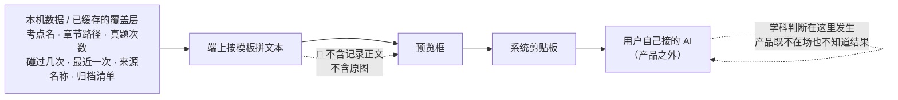
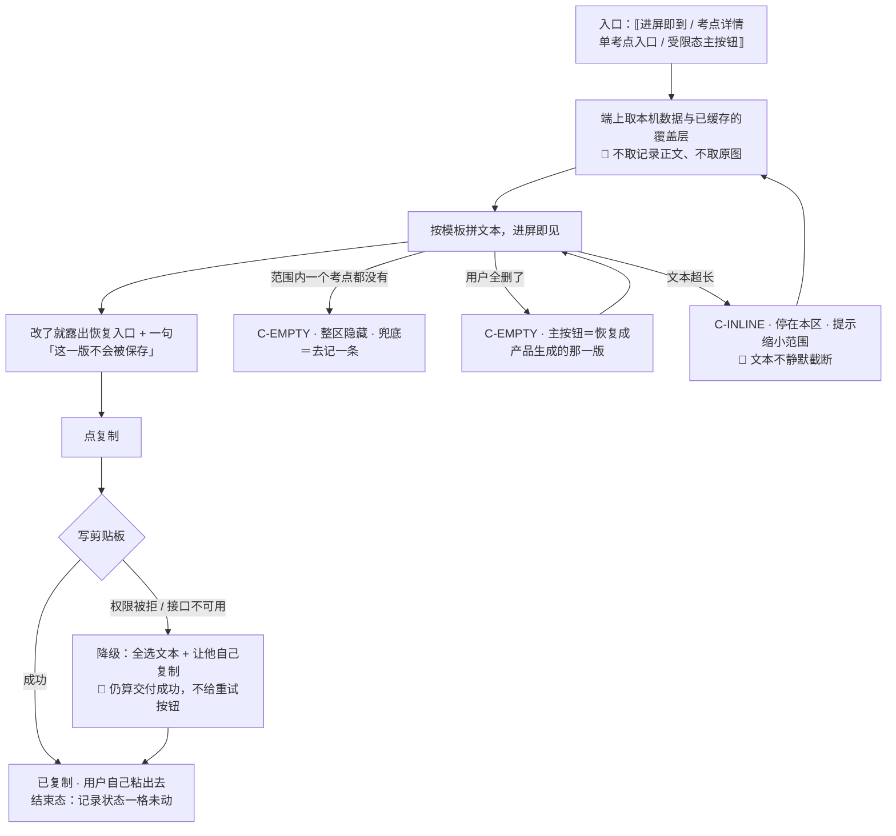

# U4.4 · 复制给 AI

> **基线**：`origin/v1` @ `73041df`，fetch 于 2026-09-02。
> **状态：活跃。** 免费路径的实现形态变化（尤其是它一旦出现任何端点）、或单考点入口的行为变化，本文同一次改动内更新。
> **上一层**：[M4 出口 · 域索引](INDEX.md)

---

## 一、这个子能力是什么、不是什么

**是**：在端上把范围内的数据拼成一段文字，让用户自己粘到他自己接的任何 AI 里。**免费路径。**

**不是**：
- 不是 AI 代发的降级版 —— 反过来，**代发是它的付费增强版**，代发做的唯一一件事是把「复制出去自己粘」变成「点一下直接发」
- 不是那段文字长什么样（模板另有一个单元，清单见域索引 §四；两条路径共用同一个模板）
- 不是一个可以被移除、被折叠、被挪到付费路径下方的东西

🔴 **永不移除。** 这不是一句承诺的措辞，它有一个实现上的形态：**这条路径没有一个可以被关掉的开关，因为它没有一个开关**。

---

## 二、详细产品逻辑

### 2.1 三步，其中第一步不需要用户做任何事

| 步 | 用户做什么 | 产品做什么 |
|---|---|---|
| ① 看 | 进屏即见预览框里**已经生成好的文本** | 端上按模板拼好 |
| ② 改（可选） | 直接在预览框里编辑 | 露出「恢复成产品生成的那一版」的入口 |
| ③ 复制 | 点复制 | 写系统剪贴板；失败则降级 |

🔴 **第一步不需要点「生成」。** 一个「生成」按钮会让用户以为这一步要花钱 ——
而这条路径全程零网络请求、零额度，也不再单独检查一次登录（登录是进产品的门槛，不是这一步的门槛）。

### 2.2 「永不移除」的实现形态：没有端点



| 性质 | 后果 |
|---|---|
| 零网络请求 | 服务端**不知道**用户复制过；离线时它照常可用；服务端宕机不影响它 |
| 零额度 | 组装上下文是零边际成本的，它不该计费。**计费的只有「我方替你付了那次调用」** |
| 没有端点 | 没有一个可以被关掉的开关，也没有一个可以被加上限流的位置 |

**为什么它必须免费**：如果代发上线时顺手把复制入口撤了，那就等于把「能问 AI」这件事整体锁进了付费墙。
判定规则只有一条 —— 这个动作会不会让我收到一张按次的外部账单？不会，永久免费。

### 2.3 用户改了预览框，不保存

| 问 | 答 |
|---|---|
| 改的文本存哪 | 🔴 **哪儿都不存。** 不进本机库、不进云端、不进任何缓存 |
| 换范围再换回来 / 退出再进来 | **都不在**，每次都是产品生成的那一版 |
| 为什么不存 | 三条：①存下来就要回答「它算不算用户的学习内容」；②它是一个**用户可以往里写任何东西**的自由文本框 —— 存了它，库里就有了一个能装题干的洞，而那正是明令不建的东西；③不存，产品对「产品生成的那一版里没有题干」这个断言才是**恒真**的 |
| 用户改了很多不想丢 | 他已经复制出去了。**这个框的用途是「改一下再复制」，不是「起草并保管」** |
| 界面上说清了吗 | 说清 —— 改过之后必须有一句话告诉他这一版不会被保存，离开就没了 |

⚠️ **「恢复成生成的那一版」不做二次确认**：用户随时可以再改一遍，多一次浮层的成本高于误点的成本。
但**切换范围会重新生成**，那一步要问一次 —— 因为切范围的目的不是丢改动，丢改动是它的副作用。

### 2.4 复制的降级链：降级了仍然算交付成功

| 端 | 首选 | 降级 |
|---|---|---|
| 桌面 / 移动 | 系统剪贴板 | 选中文本并提示用户自己复制（移动端另有分享面板一条） |
| Web | 剪贴板接口 | 旧接口 → 全选并提示手动复制 |

🔴 **降级到「全选 + 提示手动复制」时，产品仍然算成功交付了这条出口。**
免费路径的承诺是「这段文字用户能拿到」，不是「一定要通过剪贴板接口拿到」。

**预览框为空时**（用户全删了）复制不可用，但**恢复入口必须露出来** —— 空态不是死路。

### 2.5 单考点入口：「把这个考点带去问 AI」

**这个入口挂在考点详情屏上，但它的行为整块属于本单元。**

| 事 | 规则 | 为什么 |
|---|---|---|
| 带过去什么 | 🔴 **只带一个考点标识，不带任何已经渲染好的文本** | 两处各拼一次文本就是两份模板，而**两份模板迟早只核一份** |
| 落地在哪 | 落到免费复制这一区，范围显示为「这一个考点」 | 单考点的动作意图就是问，不是导 |
| 格式呢 | **不预选、不改格式** | 范围是这次动作带来的信息，格式是用户的长期偏好，**两者不能互相覆盖** |
| 返回 | 回到考点详情并保持位置；范围**不重置** | 用户可能还要再问一次 |
| 导出还能用吗 | 能，范围同样是这一个考点 —— **导出一个考点是合法的**，文件里就一行 | 出口之间不互相排斥 |
| 埋点 | **不新增。** 从考点详情进来不重复打盲区打开事件，它已经在进那一屏时打过了 | 同一件事两处计数就是两个不一致的数 |
| 文本差异 | 单考点时只保留该考点所在的那一档；「我在这个考点上记过的」那段**只有时间与来源名称两列** | 🔴 第三列如果是「我记了什么」，它就是记录正文，而那正是被挡下的东西 |

⚠️ **规格真源把这个入口写在了两处**（考点详情的元素清单里一行、本域规格里一节）。
按新结构它**整块归本域**：考点详情那边只留一个入口，行为与文本都在这里定义，**不回指**。

---

## 三、前端行为意图 × 后端契约意图

| 事项 | 前端行为意图 | 后端契约意图 |
|---|---|---|
| **文本组装** | 🔴 端上生成，进屏即有，零网络请求 | ✅ **已有契约（2026-09-03）**：`接口契约：签名与错误码全集` §6.1 就是「这里不该有端点」那一行 —— 缺的从来不是端点，是这句话没有契约承载 |
| 取数 | 从本机数据与已缓存的覆盖层取：考点名、章节路径、真题次数、碰过几次、最近一次、来源名称、归档清单 | 这些数据的来源端点已有契约（骨架树 / 考点详情 / 盲区清单）；🔴 **考点详情端点没有讲解字段** |
| 记录正文 | 🔴 结构上就不取这个字段 | 取数端点不返回它 |
| 用户改动 | 不回存、不上传、不分析 | **没有接收改动的端点，也不该有** |
| 复制降级 | 降级路径全在端上，降级后仍算交付成功 | 不涉及 |
| 离线 | 完全正常，不显示错误色与重试按钮 | 不涉及 |
| 单考点入口 | 只传一个考点标识 | 不涉及 —— 文本不经过服务端 |
| 埋点 | 本单元**一个事件都不加** | 不涉及 |

🔴 **这一行「空」是本域两个最贵的缺口之一。** 它接在北极星落点的正下游：用户点进盲区清单之后，
下一个动作就是把上下文带出去问模型。**这条路径的契约已于 2026-09-03 补上**（`接口契约：签名与错误码全集` §6.1）—— 在那之前它是靠记忆传递的。

---

## 四、边界与红线在这里的具体形态

| 边界 | 在这一单元的形态 |
|---|---|
| `I-4` 额度只碰外部模型调用 | 本单元不查额度、不受额度影响、不因额度改变任何一格。额度耗尽时它是付费路径受限态里的主入口 |
| **不存题干与机构内容** | 预览框是用户可以往里写任何东西的自由文本框，**所以它一个字都不回存** —— 存了它，库里就有了一个能装题干的洞 |
| 不做学科教研 | 学科判断发生在用户自己的模型里。**产品既不在场，也不知道结果** —— 这条路径连一次网络请求都没有 |
| 原图不上云不共享 | 拼文本时不取任何图片相关的东西 |
| 没有第四种反馈形态 | 复制成功只给一次即时反馈，不做任何后续提示 |
| 不做行为分析 | 「预览框被编辑的比例」这类指标**不埋**。埋了它下一步就是想办法把它做高，而它说不清服务哪条判据 |

---

## 五、缺口登记

| # | 缺口 | 缺的是哪一半 | 该谁定 |
|---|---|---|---|
| ✅ 1 | ~~免费复制路径在接口契约里没有对应行~~ | **已闭合（2026-09-03）**：`接口契约：签名与错误码全集` §6.1。它要的本来就不是一个端点，是一行写明「这里不该有端点」的契约，补的正是这一行 | 已补 |
| 2 | 预览文本的长度上限、接近上限的提示阈值、每一档最多列几个考点（🚧） | 产品侧已定的是**行为**：超长时提示用户缩小范围，🔴 **文本不静默截断**；每档超量时在段尾写明还有多少个没列出来。**缺的是三个数** | **未定** —— 它取决于用户接的模型上下文，而那是用户的选择，产品只能给一个保守值 |
| 3 | 分档阈值：「很久没碰」的天数与「最近的节奏」的统计窗口（🚧） | 缺的是产品对「多久前」的一次分档口径 | **产品**，不该由实现顺手定。分档规则本身在模板那一单元 |

---

## 六、线框

> 记号与屏宽照 `线框与交互规格约定` §三（40 个半角字符），组件只引锚不抄规格。
> 本单元画**免费复制那一区**与**考点详情上的单考点入口**；那段文字长什么样在本域另一个单元（清单见域索引 §四）。

### 6.1 常态整屏

```
┌────────────────────────────────────────┐
│ ⟦返回⟧ ⟦屏标题⟧ ⟦范围选择器⟧ ← P-NAV   │
│ ⟦离线细条⟧              ← C-OFFLINE    │ ※1
├────────────────────────────────────────┤
│ ⟦区一 · 导出文件 —— 本单元不重画⟧      │
├────────────────────────────────────────┤
│ 区二 · 复制给 AI                  ※2   │
│  ⟦边界小字 → 导出与问AI §2.4⟧          │ ※2
│  ▢ ⟦模板文本·进屏即有·可编辑⟧          │
│    ⟦最多 12 行·区内滚动⟧ ← C-INPUT     │
│  ⟦字数计数⟧ (   复制   ) ← C-BTN 主    │ ※3
│  ‹ 恢复成产品生成的那一版 ›            │ ※4
│  ‹ 换成只发这一个考点 / 换成整个科目 › │
│  ⟦改过之后：这一版不会被保存⟧          │ ※4
├────────────────────────────────────────┤
│ ⟦区三 / 区四 —— 本单元不重画⟧          │
└────────────────────────────────────────┘
      ▲ 单考点入口在考点详情屏的末项：      ※5
        ‹ 把这个考点带去问 AI › → 落到区二
```

※1 离线时这一区**完全正常**：不出错误色、不出重试按钮，也不加任何离线字样
※2 🔴 这一区**必须在付费那一区之上**（放到下面就变成了「付费不成再看看这个」）；边界小字只给指针，一个字都不抄
※3 🔴 **进屏即见文本，没有「生成」按钮** —— 一个生成按钮会让用户以为这一步要花钱
※4 两处都只在用户改过之后才出现；恢复**不做二次确认**，但切范围要问一次（丢改动是它的副作用不是目的）
※5 🔴 **只带一个考点标识，不带任何已经渲染好的文本** —— 两处各拼一次就是两份模板。范围显示为「这一个考点」，格式不预选也不改；返回时范围不重置。那一屏见 `模块地图` §三登记的 `U3.4`

### 6.2 其余各态：只画变化区

```
│ 骨架 C-SKEL：▢ ··· ··· 形状同拼好后 ※6 │
├────────────────────────────────────────┤
│ 空态一 C-EMPTY：范围内一个考点都没有   │
│  ⟦区二整区隐藏，不显示空框⟧  ※7        │
├────────────────────────────────────────┤
│ 空态二 C-EMPTY：用户把预览框全删了     │
│  ⟦这一段是空的⟧ [ 复制 ] 禁用          │
│  ( 恢复成产品生成的那一版 ) ← 主   ※8  │
├────────────────────────────────────────┤
│ 剪贴板写不进去时的变化区（不是错误态） │
│ ⟦文字已选好，自己复制⟧不给重试与错误色 │ ※9
├────────────────────────────────────────┤
│ 陈旧：⟦这是刚才的数据⟧文本照拼照可复制 │ ※10
├────────────────────────────────────────┤
│ 受限态 C-LIMIT：本区自己永不进这一态   │
│  区二⟦同常态⟧一格不变 区三⟦剩 0 次⟧※11 │
│   ( 回到上面那段文字复制 ) ← 主   ※12  │
│   ‹ 次数怎么加 › → 模块地图 §三 U7.3   │
```

※6 端上拼文本通常在阈值内完成，**那就不出骨架**　※7 整区隐藏是因为这时候**没有可复制的东西**，不是能力被关掉了　※8 🔴 空态不是死路：恢复入口必须露出来，它就是那个立刻能做的动作
※9 🔴 **降级到「全选 + 自己复制」仍然算成功交付**。承诺是「这段文字用户能拿到」，不是「一定要通过剪贴板拿到」
※10 联网补算后静默重算；🔴 预览框被用户改过时**不重算**，保留他那一版　※11 🔴 `I-4`：额度、付费、登录过期都不改这一区的任何一格 —— 它没有开关，因为它没有端点
※12 🔴 **受限态的主按钮就是本单元这条路** —— 免费兜底那一条，付费入口只能是文本按钮

### 6.3 红线自查十条，逐张数过

| # | 数这一样 | 本单元 |
|---|---|---|
| 1–4 | 正确率 / 讲解 / 提醒 / 打卡 | 0：复制成功只给一次即时反馈，不做任何后续提示 |
| 5–6 | 进度环、百分比、倒计时紧迫感 | 0：本区没有任何进度呈现 |
| 7–8 | **能装下题干的格子**、置信度 | ⚠️ 预览框是一个用户能往里写任何东西的框，这是已定的结构：产品生成的那一版逐槽位核过，用户改的那一版**一个字都不回存**，所以它不是产品开的洞；置信度 0 |
| 9–10 | 原图入口 / 三处必须出现的东西 | 🔴 0：拼文本时不取任何图片相关的东西；三处落在 `模块地图` §三登记的 `U8.3` / `U8.4`，本单元不重画也不弱化 |

---

## 七、交互规格

### 7.1 必答五项

| # | 必答 | 本单元的答案 |
|---|---|---|
| 1 | **入口** | 三条：进本屏即落在这一区（不需要任何点击）；考点详情屏的单考点入口（落到本区，范围＝这一个考点）；付费那一区受限时的主按钮。深链与登录后回跳沿用 `P-NAV`，范围与格式各自沿用上次的选择 |
| 2 | **结束状态** | 🔴 **记录状态一格未动**：主轨仍是动作前的 `已落本地` / `待上传` / `已同步`，标签轨仍是原来的 `TS-00`–`TS-09`。本单元连一次网络请求都没有，服务端**不知道**用户复制过 |
| 3 | **失败落点** | 只有一处会失败：写剪贴板。落点是**停在本区、文本保持全选、给一句让他自己复制的话**，且这一步仍然算交付成功，不给重试按钮。返回键任何时候都能退出，预览框有未复制的改动时**不拦截**（改动本来就不保存） |
| 4 | **空态** | 两种成因两句不同的话：①范围内一个考点都没有 → 整区隐藏，兜底落到去记一条；②用户把框全删了 → 主按钮是恢复成产品生成的那一版 |
| 5 | **错误态** | 🔴 **本单元没有可重试的错误态** —— 零网络请求，没有能失败的请求。有缓存时是陈旧数据态；剪贴板不可用是降级不是错误 |

### 7.2 受限态（按需追加项）

| 档 | 本单元怎么变 | 它在这一态里的角色 |
|---|---|---|
| 缺额度 | 🔴 **一格不变** | **它就是主按钮**（`C-LIMIT`：受限态的主按钮永远是免费兜底那一条） |
| 缺登录 | 一格不变 —— 登录是进产品的门槛，不是这一步的门槛 | 受限块在付费那一区，本区始终在它上方可用 |
| 缺骨架 | 范围内没有考点 → 整区隐藏 | 兜底落到去记一条 |

🔴 **可断言的检查**：把额度设为 0，用户仍能在**同一屏、往上滚一屏之内**拿到这段文字，且这一区里数不到一个额度槽位、一处锁形、一个灰按钮。这一条不过，`I-4` 就是坏的。

### 7.3 交互流程



⚠️ **本单元不写任何端点** —— ✅ `[契约缺]` 已于 2026-09-03 闭合：`接口契约：签名与错误码全集` §6.1 就是那一行写明「这里不该有端点」的契约。
界面需要后端能区分的只有一档：**缺骨架**与**请求失败**要能分开（两句话不共用一句）；另外取数端点不返回记录正文。
