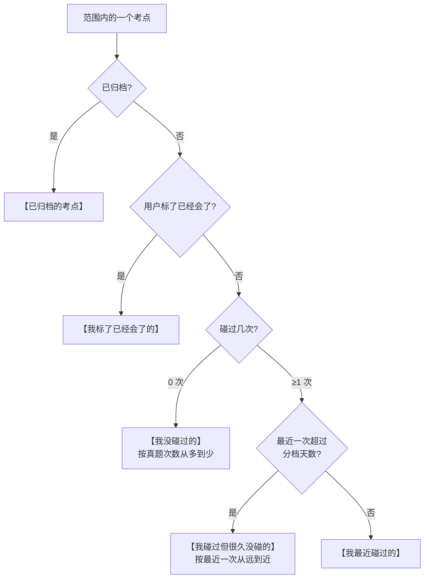
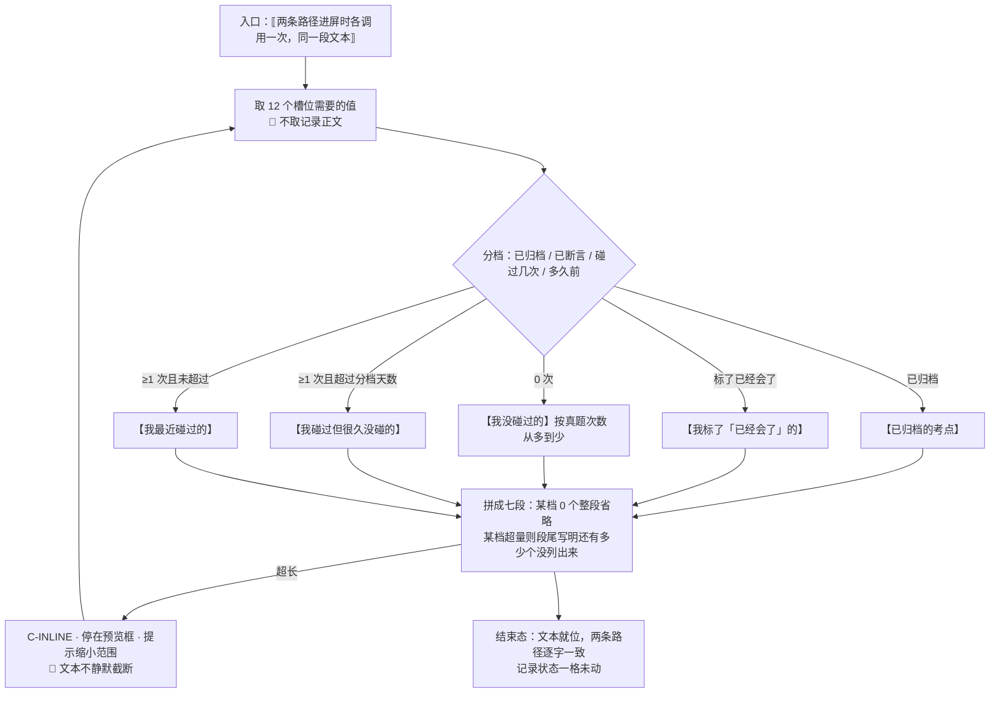

# U4.5 · 问 AI 的文本模板

> **基线**：`origin/v1` @ `73041df`，fetch 于 2026-09-02。
> **状态：活跃。** 模板增删一段、槽位增删一个、分档规则变化，本文同一次改动内更新。
> **上一层**：[M4 出口 · 域索引](INDEX.md)

---

## 一、这个子能力是什么、不是什么

**是**：把范围内的数据摊成一段用户能直接粘出去的文字，并**逐槽位证明这段文字里没有任何位置能放题目内容**。

**不是**：
- 不是提示词工程 —— 它不试图让模型答得更好，只把「有没有、几次、多久前」摆清楚
- 不是学科内容 —— 模板里没有一句是产品对某个考点的判断
- 不是两段文字。🔴 **免费复制与付费代发共用同一个模板，逐字一致**

**为什么必须是同一个**：两条路径的文本一旦不同，内容边界就要核两遍，**而核两遍的东西迟早只核一遍。**
共用模板是「代发只是把『复制出去自己粘』变成『点一下直接发』」这句话在产品上的落点。

---

## 二、详细产品逻辑

### 2.1 七段结构，每一段承载什么

模板原文在 `导出与问AI` §8.1，本节只写**每一段为什么在里面**（去掉它会怎样）。

| 段 | 承载哪一件 | 它必须说清什么 | 去掉它会怎样 |
|---|---|---|---|
| 抬头 | 都不承载 | 数据来自我自己的记录；要模型做的是**判断先补哪些** | 模型不知道这堆名词是什么，容易自行发挥成一份大纲 |
| **说明段** | 都不承载 | 🔴 **边界声明进正文** —— 这段文字里只有考点名称、碰过几次、最近一次多久前、来源名称，没有题目内容 | 边界只写在界面上，文本一离开界面就没人知道它的口径 |
| 我没碰过的 | **有没有**（＝没有）+ 骨架侧的真题次数 | 这是差集本身，是整个产品的产出 | 剩下的段落就只是一份流水账 |
| 我碰过但很久没碰的 | **几次** + **多久前** | 「碰过」和「碰过很久了」在用户那里是两件事 | 模型只能在「会」与「不会」之间二选一，而产品从不提供这个二分 |
| 我最近碰过的 | **几次** + **多久前** | 给模型一个「已经在做的事」的参照 | 建议会重复用户手上正在做的 |
| 我标了「已经会了」的 | **有没有**（用户自己的断言） | 🔴 措辞必须是**「我标了」而不是「我已掌握」** | 措辞一旦变成产品口吻，产品就在替用户判断对不对 |
| 已归档的考点 | **有没有**（退出分母的那一部分） | 🔴 `I-6` 在文本出口上的落点：归档节点必须单独成段 | 「把空白全归档」这个动作在文本出口上也能刷出一个好看的局面 |
| 我最近记东西的节奏 | **几次** | 这个人一周记三条还是三十条 | 模型会按一个它自己设想的强度给方案 |
| 这份数据 | 都不承载 | 可复现：两次粘贴的差异能被追溯到骨架版本还是我的记录 | 用户拿两版结果对不上时无从判断 |

⚠️ **某一档为 0 个时整段省略**（连标题一起），不写「共 0 个」—— 一个空标题会让人以为数据没拉全。

### 2.2 分档规则：产品对「多久前」的一次分档



🚧 **分档天数与节奏统计窗口这两个数，本单元不定。** 它们决定一个考点落在哪一档，
**而这是产品对「多久前」的一次分档，不该由实现顺手定** —— 两个数变了模板输出就变了，而用户会以为是自己的数据变了。
原样登记在 §五，**不许自己拍一个数顶上**。

**分档全部在端上算**，不需要服务端参与 —— 这是免费路径零网络请求的前提之一。

### 2.3 单考点变体

| | 全量 / 科目范围 | 这一个考点 |
|---|---|---|
| 抬头 | 请模型判断先补哪些 | 改成「想集中补一个考点」 |
| 分档 | 五档齐全 | **只保留该考点所在的那一档** |
| 节奏段 | 有 | 有 —— 它是这个人的节奏，与范围无关 |
| 我的相关记录 | 不列 | **只列时间与来源名称两列** |

🔴 **两列，没有第三列。** 第三列如果是「我记了什么」，它就是记录正文，而那正是被挡下的东西。

### 2.4 🔴 逐槽位核一遍：模板里没有任何位置能放题目内容

**这是本单元的核心。模板一共 12 个槽位，逐个核：**

| # | 槽位 | 值域 | 为什么放不进题干 |
|---|---|---|---|
| 1 | 科目 | 短枚举串 | 闭集 |
| 2 | **考点名** | 树上已存在的节点名 | 🔴 **闭集。** 产品没有任何路径能生成一个新的考点名 —— 模型只能从候选里选一个标识或返回「无匹配」，接口只收标识不收文本 |
| 3 | 章节路径 | 最多三层的节点名拼接 | 同上，且层级本身有硬约束 |
| 4 | 真题出现次数 | 整数 | 数字 |
| 5 | 碰过几次 | 整数 | 数字 |
| 6 | 最近一次多少天前 | 整数 | 数字 |
| 7 | **来源名称** | 用户自己填的自由文本，有明确长度上界 | 🔴 **本模板唯一的自由文本来源**，单独核，见下 |
| 8 | 五档各自的计数 | 整数 | 数字 |
| 9 | 节奏统计的三个数 | 整数 | 数字 |
| 10 | 导出时刻 | 时间戳 | 时间 |
| 11 | 骨架版本 | 版本串 | 常量式短串 |
| 12 | 各段固定文案 | 常量 | 写死在代码里 |

**第 7 号槽位单独核一遍：**

| 问 | 答 |
|---|---|
| 它是什么 | 记录上的来源名称，用户自己填的「我这次是从哪学的」 |
| 它能装下题干吗 | 上界是 64 个字。**一句「某机构某某强化课」放得下，一道行测题的题干放不下** —— 选这个长度时就已经算过（`技术架构与接口契约` §5.1） |
| 用户硬往里塞怎么办 | 塞得进 64 字的不是题干，是题干的一个片段。**产品不做内容检测（那需要读内容），产品做的是不给这个洞** |
| 那记录正文呢 | 🔴 **它根本不在模板里。** 记录正文既不进导出文件，也不进这段文字 |

🔴 **结论：12 个槽位里，11 个的值域是闭集、整数或时间，第 12 个是有 64 字上界的来源名称。没有任何一个位置能装下一道题。**
**这不是靠提示词兜住的，是结构上没有这个位置。**

**这条结论的可验证形态**：新增任何一个槽位之前，先回答「它的值域是什么」。
答不出闭集、整数、时间三选一，就说明它在往模板里开一个洞。

### 2.5 用户手改预览框之后，产品的责任边界不变

| 断言 | 说明 |
|---|---|
| 产品保证的是什么 | 🔴 **产品生成的那一版文本里没有题目内容。** 这个断言恒真，因为 §2.4 的 12 个槽位里没有能装下题干的位置 |
| 用户改了之后呢 | 改完的那一版是**用户自己写的文字**。他可以在里面写任何东西 —— 就像他可以在任何一个输入框里写任何东西 |
| 那产品是不是就没边界了 | 不是。**边界的位置没有变，变的是谁在说话。** 产品对「产品说了什么」负责，不对「用户在自己的设备上写了什么」负责 |
| 产品会读它吗 | ❌ 不读、不存、不分析、不上传 |
| 那付费代发呢 | 🔴 **代发会把用户改过的这一版原样发出去** —— 这是必须在界面上说清的一件事。**这也是产品能力边界唯一一处依赖用户自己的位置**，所以它要被写下来，不是被回避 |
| 会因此产生「产品提供了题干」这个事实吗 | 不会。产品提供的是一个可编辑的文本框和一条发送通道；这与「产品的库里有题干」「产品的工具能读到题干」是完全不同的两件事，**后两者才是红线，而它们都是结构上不成立的** |

⚠️ **这一段不许被简化成「用户自己负责」。** 它要说清的是「产品的断言在改动之后仍然成立」，
而不是「出了事不怪我们」—— **前者是一个可验证的技术事实，后者是一句免责声明，而免责声明不是边界。**

---

## 三、前端行为意图 × 后端契约意图

| 事项 | 前端行为意图 | 后端契约意图 |
|---|---|---|
| 模板生成 | 端上生成；免费复制与付费代发**共用同一段文本，逐字一致** | 服务端**不重拼一遍**：代发请求体里就是端上生成的那段文本 |
| 取数 | 只取模板 12 个槽位需要的值 | 🔴 取数端点不返回记录正文；考点详情端点**没有讲解字段** |
| 分档 | 全在端上算 | 无端点；分档阈值定下来之后**由服务端下发还是端上写死，属于契约缺口的一部分** |
| 归档段 | 归档节点必须单独成段，不能被并进别的档 | 取数要能区分归档节点，不能把它们过滤掉 |
| 超长 | 提示用户缩小范围；🔴 **不静默截断** | 若代发端点对长度有限制，**必须返回一个能与其它失败区分开的错误** —— 否则界面只能说「没成」 |
| 用户改动 | 原样使用，不做任何检测（检测需要读内容） | 请求体照收；🔴 **服务端不额外附加任何库里的字段** |

🔴 **不静默截断是硬要求。** 一段被悄悄截掉一半的文本，用户粘出去之后拿到的是一份基于残缺数据的回答，
而他不会知道数据是残缺的 —— **这比直接告诉他「太长了」糟得多。**

---

## 四、边界与红线在这里的具体形态

| 边界 | 在这一单元的形态 |
|---|---|
| **不存题干与机构内容** 🔴 | §2.4 的逐槽位核对就是这条红线的证明方式：**不是「这次生成的文本里没有题干」，是「没有一个位置能放」** |
| **不生成标签文本** | 考点名槽位的值只能是树上已存在的名字。这是闭集打标（`I-3`）在文本出口上的形态 |
| 不判断对错 | 模板里没有正确率、得分、掌握度、排名，也没有任何一句学习建议或复习提醒。「我标了已经会了」是**用户的断言**，措辞上必须区分 |
| 不做学科教研 | 模板只摆事实并请模型判断，产品自己不产出任何学科内容 |
| 只记来源名称与时间 | 唯一的自由文本槽位是来源名称，且它有长度上界 |
| `I-6` 归档 | 归档段必须在；它消失，模型看到的覆盖面就是被美化过的 |

---

## 五、缺口登记

| # | 缺口 | 缺的是哪一半 | 该谁定 |
|---|---|---|---|
| 1 | **分档天数与节奏统计窗口**（🚧） | 分档**规则**已定（§2.2 的判定树），**缺的是两个数**。它们是产品对「多久前」的一次分档口径 | **产品**，未定。不该由实现顺手定 |
| 2 | 预览文本长度上限、每档最多列几个考点（🚧） | 超长与超量时的**行为**已定（提示缩小范围、段尾写明还有多少个没列出来、不静默截断）。**缺的是数** | **未定** —— 它取决于用户接的模型上下文，产品只能给一个保守值 |
| 3 | 分档阈值定下来之后由谁持有 | 端上写死则改一次要发一次版；服务端下发则免费路径就有了一个网络依赖，**而零网络请求是它「没有开关」的前提** | **两条后果都要认，本单元不裁定** |
| 4 | 「不静默截断」在代发一侧的落法 | 免费路径可以只提示；代发路径若服务端也有长度限制，需要一个**可区分的错误档位**，而代发本身没有契约行 | 技术同事，与代发契约一并 |

---

## 六、线框

> 记号与屏宽照 `线框与交互规格约定` §三（40 个半角字符），组件只引锚不抄规格。
> 本单元的「常态」是**预览框里那一段文字的结构**：框里画槽位，逐字原文在 `导出与问AI` §8.1，一个字都不抄过来。

### 6.1 常态 · 模板结构（七段，槽位编号对应 §6.2）

```
┌─ 预览框内容（区内滚动，最多 12 行）────┐
│ ⟦抬头：我在准备{1}…请判断先补哪些⟧     │ ※1
│ 【说明】⟦12 边界声明·常量·逐字同源⟧    │ ※2
│ 【我没碰过的】共 ⟦8⟧ 个                │
│ - ⟦2⟧（章节 ⟦3⟧；近 5 年 ⟦4⟧ 次）      │
│ 【我碰过但很久没碰的】共 ⟦8⟧ 个        │
│ - ⟦2⟧（碰过 ⟦5⟧ 次，最近 ⟦6⟧ 天前；    │
│   来源 ⟦7⟧）  【我最近碰过的】共 ⟦8⟧ 个│ ※3
│ - ⟦2⟧（碰过 ⟦5⟧ 次，最近 ⟦6⟧ 天前）    │
│ 【我标了「已经会了」的】共 ⟦8⟧ 个 - ⟦2⟧│ ※4
│ 【已归档的考点】共 ⟦8⟧ 个 - ⟦2⟧        │ ※5
│ 【节奏】⟦9⟧ 【这份数据】⟦10⟧ ⟦11⟧      │
├────────────────────────────────────────┤
│ 单考点变体：抬头改「想集中补一个考点」 │ ※6
│ 只留该档 +【记过的】⟦8⟧ 条 - ⟦10⟧、⟦7⟧ │
└────────────────────────────────────────┘
```

※1 抬头说清**数据来自我自己的记录**、要模型做的是判断先补哪些；去掉它模型会自行发挥成一份大纲　※2 🔴 **边界声明进正文** —— 文本一离开界面，这一句是唯一还跟着走的口径
※3 唯一带自由文本的一行，见 §6.2 第 7 号　※4 🔴 措辞是**「我标了」不是「我已掌握」**：这是用户的断言不是产品的判断　※5 🔴 `I-6` 的落点，这一段消失模型看到的覆盖面就是被美化过的
※6 🔴 单考点那一段**两列：时间、来源名称，没有第三列**。第三列如果是「我记了什么」，它就是记录正文 —— 那正是被挡下的东西。某一档为 0 个时**整段省略**（连标题一起），不写「共 0 个」

### 6.2 每一个槽位装什么，以及为什么它装不下题干

| # | 槽位 | 这一格装什么 | 值域 | 🔴 装不下题干的结构性理由 |
|---|---|---|---|---|
| 1 | 科目 | 在准备哪一科 | 短枚举串 | 闭集，取值域是一张固定的枚举表 |
| 2 | 考点名 | 树上的一个节点名 | 闭集节点名 | 🔴 **产品没有任何路径能生成一个新的考点名** —— 打标只从候选里选标识或返回「无匹配」，接口只收标识不收文本 |
| 3 | 章节路径 | 由父级上溯拼出的路径 | 最多三层的节点名拼接 | 由第 2 号同源的名字拼成，层级有硬上限，长度封顶 |
| 4 / 5 / 6 | 真题出现次数 / 碰过几次 / 最近一次多少天前 | 骨架侧的「考了几次」＋行为层的「几次」「多久前」 | 整数 | 数值列装不下字符；第 6 号由时间戳与当前时间算出，不是取来的字符串 |
| 7 | **来源名称** | 用户填的「我这次是从哪学的」 | 🔴 **本模板唯一的自由文本**，上界 64 字 | 64 字**塞得进的不是题干，是题干的一个片段**；产品不做内容检测（那需要读内容），产品做的是不给这个洞 |
| 8 / 9 | 五档各自的计数 / 节奏统计三个数 | 每一档有几个；窗口天数、记了几条、涉及几个考点 | 整数 | 数值 |
| 10 | 导出时刻 | 端上时钟 | 时间戳 | 时间 |
| 11 | 骨架版本 | 被减数是哪一版 | 版本串 | 常量式短串 |
| 12 | 各段固定文案 | 抬头、说明段、七个段标题 | 常量 | 写死在代码里，运行时不可替换 |

🔴 **结论：12 个槽位里 11 个的值域是闭集、整数或时间，第 12 个是有 64 字上界的来源名称 —— 没有任何一个位置能装下一道题。这不是靠提示词兜住的，是结构上没有这个位置。**
🔴 **记录正文（全库唯一那个 200 字的洞）根本不在这张表上**：它既不进导出文件，也不进这段文字。新增任何一个槽位之前先回答「它的值域是什么」，答不出闭集/整数/时间三选一，就是在往模板里开一个洞。

### 6.3 其余各态：只画变化区

```
│ 骨架 C-SKEL：▢ ··· ··· 行数与拼好后同  │
├────────────────────────────────────────┤
│ 空态 C-EMPTY 三成因，三句话不共用      │
│  ①某档 0 个→整段省略 ②全 0→整区隐藏 ※7 │
│  ③某档超量 → 段尾写还有多少个没列出来  │
├────────────────────────────────────────┤
│ 错误态：🔴 本单元没有可重试的错误态 ※8 │
│  超长 → ⟦提示缩小范围⟧，文本仍然完整   │
│ 陈旧：⟦这是刚才的数据⟧ 文本照拼  ※9    │
├────────────────────────────────────────┤
│ 受限态 C-LIMIT · 额度为 0              │
│  模板文本一格不变；(  复制这一版  ) ←主│ ※10
│  ‹ 次数怎么加 › → 模块地图 §三 U7.3    │
```

※7 不写「共 0 个」—— 一个空标题会让人以为数据没拉全　※8 分档与拼文本全在端上算，没有能失败的请求；缺骨架落到空态不是错误态
※9 补算完成后静默重算；预览框被用户改过时**不重算**　🔴 超长时**不静默截断**：一段被悄悄截掉一半的文本，用户拿到的是基于残缺数据的回答，而他不会知道
※10 🔴 模板与额度、与付费状态完全无关；受限态的主按钮就是复制这同一段文本 —— 免费兜底那一条，付费入口只能是文本按钮

### 6.4 红线自查十条，逐张数过

| # | 数这一样 | 本单元 |
|---|---|---|
| 1–2 | 正确率 / 得分 / 排名 / 讲解 / 学习建议 | 🔴 0：七段里没有一段是评价；模板只摆事实并请模型判断，产品自己不产出一句学科内容 |
| 3–6 | 提醒 / 打卡 / 连续 N 天 / 进度环 / 百分比 / 倒计时 | 🔴 0：节奏段是「最近 N 天记了几条」不是连续天数；五档给的是各档**个数**不是比例，写成百分比就是在打分 |
| 7–8 | **能装下题干的格子**、置信度 | 🔴 0：§6.2 逐槽位核过，12 个槽位没有一个能放下题目内容；模板里没有置信度这个槽位 |
| 9–10 | 原图入口 / 三处必须出现的东西 | 🔴 0：模板不取任何图片相关的东西；三处落在 `模块地图` §三登记的 `U8.3` / `U8.4`，本单元不重画也不弱化 |

---

## 七、交互规格

### 7.1 必答五项

| # | 必答 | 本单元的答案 |
|---|---|---|
| 1 | **入口** | 本单元没有自己的可点元素 —— 它在**两条路径进屏时各被调用一次**：免费复制那一区进屏即拼；付费代发发送前用的是同一段文本，逐字一致。第三条入口是考点详情的单考点入口，它换的是变体不是模板 |
| 2 | **结束状态** | 🔴 **记录状态一格未动**：主轨仍是动作前的 `已落本地` / `待上传` / `已同步`，标签轨仍是原来的 `TS-00`–`TS-09`。分档只是读这些态，不写任何一态 |
| 3 | **失败落点** | 拼文本本身不会失败（全在端上）。唯一的落点是**超长**：停在预览框、文本完整不截断、给一句让他缩小范围的话，主动作是回范围选择器。代发一侧若服务端也有长度限制，落点相同，但它需要一个**可区分的错误档位** —— `[契约缺]` |
| 4 | **空态** | 三种成因三句不同的话：某一档 0 个 → 整段省略；所有档都 0 → 整区隐藏；某一档超量 → 段尾写明还有多少个没列出来并指向导出 |
| 5 | **错误态** | 🔴 **没有可重试的错误态**。有缓存时是陈旧数据态；缺骨架是空态。这是零网络请求的直接后果 |

### 7.2 受限态（按需追加项）

| 档 | 模板怎么变 | 主按钮 | 付费入口 |
|---|---|---|---|
| 缺额度 | 🔴 **一格不变**，同一段文本 | 复制这一版（免费兜底那一条） | 只能是文本按钮 |
| 缺登录 / 缺骨架 | 一格不变 / 五档全为 0 时整区隐藏 | 受限块在付费那一区，本段文本始终在它上方可用；缺骨架兜底＝去记一条 | 无 |

### 7.3 交互流程



⚠️ **本单元不写任何端点。** 两处 `[契约缺]`：①免费复制路径在契约表里**没有行**，分档阈值定下来之后由端上写死还是服务端下发属于这条缺口的一部分；②付费代发路径在契约表里**没有行**，界面需要后端能把「文本超长」与其它失败**区分成两档**，否则界面只能说「没成」。
