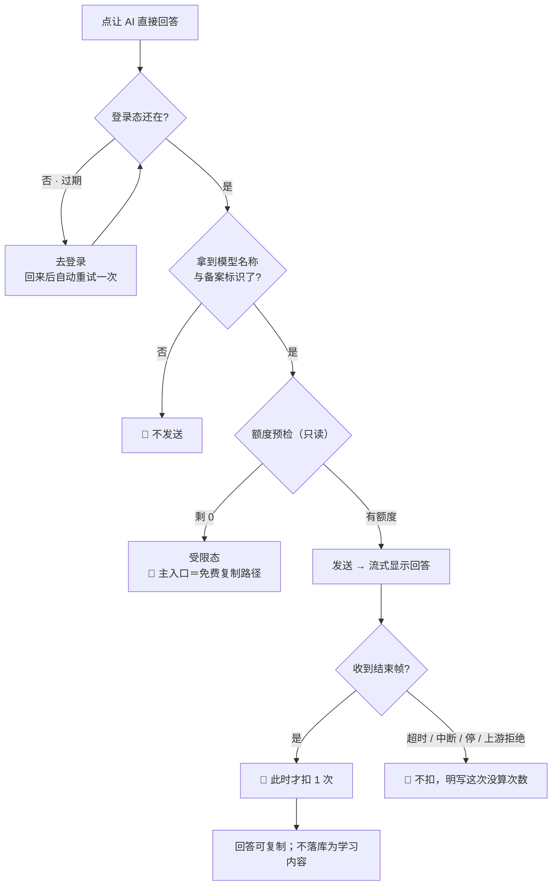
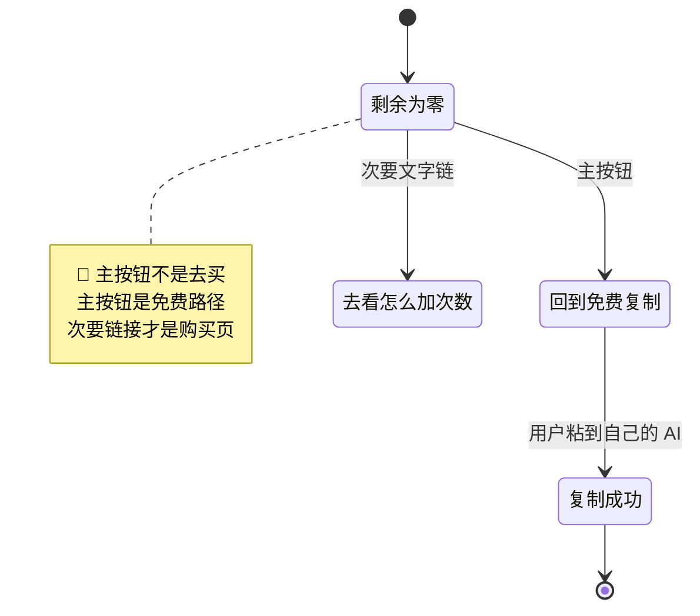
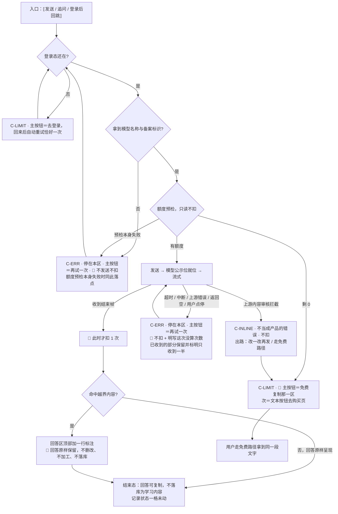

# U4.6 · AI 代发提问

> **基线**：`origin/v1` @ `73041df`，fetch 于 2026-09-02。
> **状态：活跃。** 扣减时机、失败不扣的清单、额度耗尽时的主入口、或越界内容的处置方式变化，本文同一次改动内更新。
> **上一层**：[M4 出口 · 域索引](INDEX.md)

---

## 一、这个子能力是什么、不是什么

**是**：产品替用户把那段文本发给外部模型，并把回答原样带回来。**付费路径，本域唯一计费的动作。**

**不是**：
- 不是一个新能力 —— 它是免费复制路径的**付费增强版**。上下文组装一样、答案质量一样，
  **唯一的差别是谁去调模型、谁付那次调用的钱**
- 不是产品在回答学科问题 —— 回答是模型给的，产品不加工、不校验、不背书
- 不是免费路径的替代品。🔴 **它上线不许把免费入口撤掉**，撤了就等于把「能问 AI」整体锁进付费墙

**为什么只有它计费**：只有它每执行一次会产生一张按次计费的外部账单。
组装上下文边际成本近似为零，**计费的只有「我方替你付了那次调用」**。

---

## 二、详细产品逻辑

### 2.1 主流程



### 2.2 发出去的是什么，扣的是什么

| 规则 | 内容 |
|---|---|
| 发出去的内容 | 🔴 **模板那段文本，一字不多。** 用户改过就发改过的那一版 |
| 服务端会不会补字段 | 🔴 **不会。** 服务端不额外附加任何库里的字段 —— 附加了就等于绕过工具清单开了第二条取数路径 |
| 额度预检 | **只读不扣减**；剩 0 时响应必须带手动入口提示，界面靠它决定兜底文案 |
| 扣减时机 | **服务端内部动作，没有可调用的端点** —— 有端点客户端就能只调不扣、或只扣不调 |
| 扣减条件 | 🔴 **调用成功之后才扣，失败不扣**；同一幂等键重试不重复扣 |
| 回答的归属 | 回答是模型给的，**产品不为其正确性背书** |
| 回答存哪 | 🚧 **未定**，见 §五 |

🔴 **失败不扣这条要写到界面上。** 一个会在失败时扣钱的产品，用户第二次就不敢点了 ——
**而那句「这次没算次数」是让他敢点第二次的唯一方式。** 用户主动停、首字超时、帧间隔超时、连接断开、
上游错误、上游返回空、上游内容审核拒绝，**七种情况一律不扣，一律明写。**

⚠️ **保留已收到的部分时不许伪装成完整回答** —— 必须有一句话说明回答只收到一半。

### 2.3 🔴 额度为 0：主入口必须是免费兜底



| 元素 | 视觉层级 | 它必须说清什么 |
|---|---|---|
| 免费兜底 | **主按钮** | 这个月的次数用完了，**上面那段文字可以直接复制，粘到你自己的 AI 里** |
| 去购买页 | 次要文字链 | 次数怎么加 |
| 🔴 不允许 | —— | 不允许浮层、不允许全屏遮罩、**不允许把免费路径那一区折叠起来** |

**这条的可断言验收很直接**：把额度设为 0，免费用户仍然能在**同一屏、往上滚一屏之内**完整拿到那段文字。
这就是 `I-4`（额度不锁免费复制）在运行时的形态 —— 也是版面顺序把免费路径放在付费路径**之上**的原因。

**受限态永远不是弹窗**，免费路径始终在它上方可用。

### 2.4 🔴 模型返回了越界内容，前端怎么办

**这是红线一（永不判断对错）的运行时防线。** 三层防线的现状必须先说清：

| 层 | 状态 | 做什么 |
|---|---|---|
| **数据面**（结构性） | ✅ **已成立** | 模型拿不到题干、拿不到标准答案 —— 工具全是只读与计算类，**没有一个副作用级工具**；库里根本没有能装下题干的列 |
| **提示词** | ⚠️ 有，但**不算防线** | 它「只是请求模型别做某事」 |
| **输出侧自检** | 🚧 **今天缺席** | 产品要求是加一道闸；**做不做未决，本单元不裁定** |

**命中越界内容时的处置（产品要求）：**

| 层次 | 做什么 | 不做什么 |
|---|---|---|
| 呈现 | 在回答区顶部加一行提示：这段回答里有超出这个产品范围的内容，它是模型说的，这个产品不判断对不对 | ❌ **不截断、不删改模型的输出** |
| 加工 | 原样保留 | ❌ 不二次加工成「先补哪些」的清单、❌ 不排成计划、❌ 不存成结构化的学科条目 |
| 计费 | 调用是成功的，正常扣 | ❌ 不因为命中而扣用户的额度作为「惩罚」 |

| 问 | 答 |
|---|---|
| 为什么不截断 | 截断等于产品在对模型的输出做内容裁决，**而「判断哪一句越界」本身就是一次学科判断**。产品能做的是标注来源，不是修改内容 |
| 为什么不静默 | 静默等于产品默认认领了这段话 |
| 为什么不落库 | 🔴 **存了就等于产品自己做了教研。** 答案落库 → 库里出现学科内容；再往前一步「按答案质量给考点排序」只差一条查询，那就是在判断对错 |

**这道闸做不做未决**（`R-91`），原样登记在 §五。**不做闸，那一行提示就永远不会出现；做闸，又要定「命中什么算越界」而那本身是一次学科判断。**

### 2.5 界面上必须说清的三件事

**这里只写「必须说清哪三件」，逐字文案在 `导出与问AI` §9.5。**

| 位置 | 它必须说清什么 | 为什么 |
|---|---|---|
| 发送按钮附近 | **发出去的是哪一版** —— 会把上面那段文字原样发出去，用户改过就是改过的那一版 | 这是产品能力边界唯一一处依赖用户自己的位置，必须让他知道 |
| 回答区顶部 | **这次用的是哪个模型** —— 名称与备案标识 | 公示位从可选变成必需：代发让这条义务从「后台用了模型」变成「用户直接读到模型输出」 |
| 回答区底部 | **这段话是谁说的** —— 这是你接的模型给的回答 | 不标注就等于产品在做教研 |

🔴 **回答区与产品自身的输出必须在视觉上可区分。**
一个和产品其它文字长得一样的回答区，等于产品把模型说的话认领成了自己的话。

🔴 **拿不到模型名称与备案标识就不发。** 这是硬前置，不是降级项。

### 2.6 追问：上下文的形状在第一轮就固定

| 规则 | 内容 |
|---|---|
| 什么时候出现 | 首轮完成之后 |
| 带什么上下文 | 模板那段文本 + 上一轮的问答 |
| 🔴 不重新读库 | 追问**不会**因为「用户在别的屏改了数据」而带上新的字段 —— **上下文的形状在第一轮就固定了** |
| 计费 | 每一轮独立计一次，口径与首轮相同：成功才扣 |
| 追问框里的内容 | 自由文本，**和预览框一样不回存** |
| 轮数上限、上下文过期时间 | 🚧 未定，见 §五 |

**答案不落库的代价是真实的**：用户刷新页面答案就没了，要留就自己复制走。
这与「不碰内容」是同一条线，是有意付出的代价，不是一个待修的缺陷。

---

## 三、前端行为意图 × 后端契约意图

| 事项 | 前端行为意图 | 后端契约意图 |
|---|---|---|
| **代发本身** | 先拿到模型名称与备案标识再发；流式呈现；随时可停 | 🔴 **空 —— 缺口。** 语义要求已给：①先返回模型名称与备案标识再返回首帧；②**结束帧一定要发出去**（成功 / 失败 / 上游断流三条路径都要走到，漏发的表现是界面永远转圈）；③错误要能区分六档 —— **未登录 / 额度耗尽 / 上游超时 / 上游错误 / 上游拦截 / 返回空**，少一档界面就只能说「没成」 |
| 请求体 | 只放模板那段文本 | 🔴 服务端**不额外附加任何库里的字段** |
| 工具清单 | 不涉及 | 🔴 **不许有任何能读到题干、答案、解析的工具**；副作用级工具一个都没有。加工具的人必须先回答「它读的是哪张表的哪一列」 |
| 额度预检 | 剩 0 时按响应决定兜底文案 | 只读不扣减；剩 0 时响应体**必须带手动入口提示** |
| 额度扣减 | 界面明写这次算没算次数 | **没有端点**；成功才扣、失败不扣、同一幂等键重试不重复扣；并发下用条件更新而不是先读后写 |
| 登录态中途过期 | 受限态不是弹窗；重新登录后**回到原处、范围与文本原样保留、自动重试一次** | 令牌续期先行；续期失败才按过期处置 |
| 越界内容 | 顶部加一行标注，回答原样保留 | 🚧 输出侧闸做不做未决；🔴 无论做不做，**服务端都不得删改回答** |
| 回答的去向 | 可复制 | 🔴 只写一条调用流水（谁、什么时候、哪个模型、成功还是失败、花了多少）；**没有提示词，没有答案** |

---

## 四、边界与红线在这里的具体形态

| 边界 | 在这一单元的形态 |
|---|---|
| **不判断对错** 🔴 | §2.4 整节：不截断、不加工、不落库、不排序。**产品能做的是标注来源，不是修改内容** |
| **不做学科教研** | 回答里当然有学科内容，但那是模型说的不是产品说的。**这个区分只有在界面上成立才算数** —— 所以 §2.5 的三件事是必需项不是可选项 |
| **不存题干与机构内容** | 答案不落库不是省事，是**库里根本没有一个字段能装下一段模型答案**；数据面上模型也够不到题干 |
| `I-4` 额度只碰外部模型调用 | 额度耗尽时：记录照常成功、盲区照常可看、导出照常可导、免费复制是主入口。**本单元是本域唯一一处出现额度的地方** |
| 没有第四种反馈形态 | 流式回答不做任何提醒式播报；额度耗尽不做推送 |
| 不做行为分析 | 代发次数**不埋点** —— 它已经有一份权威记录（计费流水），再埋一次就是同一件事两处说法 |

🔴 **一条可断言的检查**：枚举代发能调用的全部工具，级别全部是只读或计算，副作用级一个都没有；
逐个检查它读的表与列，**没有任何一个读到能装下题干的列 —— 因为库里没有这样的列**。
这条边界不是由提示词守的，是由建表守的。

---

## 五、缺口登记

| # | 缺口 | 缺的是哪一半 | 该谁定 |
|---|---|---|---|
| 1 | 🔴 **付费代发路径在接口契约里没有对应行** | 产品侧已定：发什么、什么时候扣、失败怎么办、六档错误要能区分、结束帧必发。**契约侧空白** —— 额度那一节甚至已经引用了「代发端点」的内部扣减时机，而接口契约通读没有这一行 | **技术同事。** 产品补出来的就是第二份契约 |
| 2 | **回答存不存**（🚧） | 两条后果都清楚：存了要回答「它算不算学习内容」，**而且必须先确认它不构成题干存储**；不存则用户换设备就没了。**缺的是拍板** | **未定。** 它同时挡住追问的上下文从哪来 |
| 3 | **越界内容要不要做输出侧的词表闸**（🚧 `R-91`） | 输出侧自检**今天缺席**已是书面事实。缺的是二选一：补一道闸，还是书面承认这条边界只靠数据面守 | **需人裁定**，本单元不替它裁。不做闸，那一行提示就永远不会出现 |
| 4 | 代发的四个时间与两个长度（🚧） | 首字超时可以套全局请求超时；**帧间隔超时、整体超时、上下文过期、追问轮数上限、追问输入长度上限这五个套不上** —— 流式的时间尺度和一次性请求不是一回事 | 技术侧。⚠️ **首字超时与整体超时必须是两个数**，拿一次性请求的超时去套整体等于每次都超时 |

---

## 六、线框

> 记号与屏宽照 `线框与交互规格约定` §三（40 个半角字符），组件只引锚不抄规格。
> 本单元只画**付费代发那一区**；发出去的那段文字在本域另一个单元（清单见域索引 §四）。

### 6.1 常态整屏

```
┌────────────────────────────────────────┐
│ ⟦返回⟧ ⟦屏标题⟧ ⟦范围选择器⟧ ← P-NAV   │
├────────────────────────────────────────┤
│ ⟦区一 导出 · 区二 免费复制 —— 不重画⟧  │ ※1
├────────────────────────────────────────┤
│ 区三 · 让 AI 直接回答                  │
│  ⟦剩余次数·未回时不写 0⟧          ※2   │
│ ⟦发出去的是哪一版→§9.5⟧[发送]←C-BTN 次 │ ※3·4
│  ┌─ 回答区（区内滚动）──────────────┐  │
│  │⟦模型 + 备案标识⟧⟦流式回答原样⟧ │    │ ※5
│  │⟦这是你接的模型给的回答⟧        │    │ ※6
│  └────────────────────────────────┘    │
│  ‹复制回答›‹停› ▢⟦追问·首轮后⟧←C-INPUT │
└────────────────────────────────────────┘
```

※1 🔴 本区在版面上**必须在免费那一区之下**：额度耗尽时用户往上滚一屏就是完整可用的免费路径
※2 未拿到剩余次数时留空**不写 0**（写 0 会被读成「已经用完了」）　※3 🔴 必须说清**发出去的是哪一版**：用户改过就是他改过的那一版　※4 一屏最多一个主按钮，主按钮在区一　※5 🔴 **拿不到模型名称与备案标识就不发**，这是硬前置不是降级项；公示位**先于首帧**就位
※6 🔴 回答区与产品自身的输出**必须在视觉上可区分**（怎么区分由设计定，本层只定「必须可区分」）—— 长得一样就等于产品把模型说的话认领成了自己的话

### 6.2 其余各态：只画变化区

```
│ 骨架（等首字）[发送]禁用 ⟦模型名⟧就位  │
├────────────────────────────────────────┤
│ 🔴 模型返回了越界内容                  │
│ ⟦越界标注一行→§9.6⟧⟦回答原样不删改⟧※7·8│
│ 空态 C-EMPTY：范围内一个考点都没有 →   │
│  整区隐藏，不留一个点不动的发送键  ※9  │
│ 陈旧：⟦这是刚才的数据⟧[发送]禁用  ※10  │
├────────────────────────────────────────┤
│ 错误态 C-ERR（六档，每档一句不共用）※11│
│ ⟦哪一步没成⟧(再试一次)←主 ⟦没算次数⟧※12│
│ 已收到一半：⟦原样保留⟧+⟦只收到一半⟧※13 │
├────────────────────────────────────────┤
│ 🔴 受限态 C-LIMIT · 额度为 0           │
│ 区一/二⟦同常态⟧不变 区三⟦剩 0 次⟧ ※14  │
│  (  回到上面那段文字复制  ) ← 主  ※15  │
│  ‹次数怎么加›→模块地图§三U7.3；追问禁用│
├────────────────────────────────────────┤
│ 受限态 C-LIMIT · 登录态过期            │
│  ( 去登录 )            ← C-BTN 主 ※16  │
```

※7 标注加在**回答区顶部**，是一行提示不是弹窗，也不是必须确认才能继续看的遮罩。🚧 这道闸做不做未决（§五），**不做闸这一行就永远不会出现**；线框先把位置留出来　※8 🔴 **不截断、不删改、不二次加工、不排成计划、不落库成结构化的学科条目** —— 截断等于产品在对模型的输出做内容裁决，而「判断哪一句越界」本身就是一次学科判断；命中不额外扣额度
※9 没有可发的上下文时整区隐藏　※10 数据新鲜度判断不是上锁，区一区二同态下照常可用　※11 六档：未登录 / 额度耗尽 / 上游超时 / 上游错误 / 上游拦截 / 返回空，少一档界面就只能说「没成」—— `[契约缺]`
※12 🔴 **七种失败一律不扣、一律明写这句话**（一个会在失败时扣钱的产品，用户第二次就不敢点了）　※13 🔴 保留已收到的部分时**不许伪装成完整回答**　※14 🔴 受限态**永远不是弹窗、不是全屏遮罩**，且**不许把免费那一区折叠起来**
※15 🔴🔴 **主按钮是免费复制那一条，不是「去买额度」**，付费入口只能是文本按钮。主次一反，主链路上就立了一道付费墙 —— 这是本域最容易破的一格　※16 缺登录这一档**没有免费兜底**，主按钮就是去登录（`C-LIMIT`：约束的是付费墙，不是登录门）

### 6.3 红线自查十条，逐张数过

| # | 数这一样 | 本单元 |
|---|---|---|
| 1–2 | 正确率 / 得分 / 排名 / 讲解 / 学习建议 | 🔴 产品不对回答评分、不打星、不排序＝0。⚠️ 回答里可能有学科内容 —— 但那是**模型说的**，产品只标注来源不加工；§6.2 那一行标注就是这个区分在界面上的落点，缺了它这一条就破了 |
| 3–6 | 提醒 / 打卡 / 进度环 / 百分比 / 倒计时紧迫感 | 0：流式回答不做提醒式播报，额度耗尽不做推送；等待首字用骨架不用进度；受限文案里不出现解锁、升级、会员、无限、限时 |
| 7–8 | 能装下题干的格子、置信度 | ⚠️ 追问框是自由文本，**和预览框一样不回存**；请求体里只有那段模板文本，服务端不额外附加任何库里的字段。置信度 0 |
| 9–10 | 原图入口 / 三处必须出现的东西 | 🔴 0：原图不进代发请求体；三处落在 `模块地图` §三登记的 `U8.3` / `U8.4`，本单元不重画也不弱化 |

---

## 七、交互规格

### 7.1 必答五项

| # | 必答 | 本单元的答案 |
|---|---|---|
| 1 | **入口** | 两条：本区的发送按钮；首轮完成之后的追问框。第三条是登录后回跳 —— 🔴 **回到原处、范围与文本原样保留、自动重试恰好一次**，再失败回到受限态不循环（`C-LIMIT`、`P-NAV`） |
| 2 | **结束状态** | 🔴 **记录状态一格未动**：主轨仍是动作前的 `已落本地` / `待上传` / `已同步`，标签轨仍是原来的 `TS-00`–`TS-09`。回答**不落库为学习内容**，终态是会话态（`导出与问AI` §4.3 已登记，与记录状态两条不相干的轨） |
| 3 | **失败落点** | 七种失败全部停在本区，主按钮＝再试一次，且**每一种都带「这次没算次数」**；已收到一半的三种额外保留已收到的部分并标明只收到一半。拿不到模型名称与备案标识时**根本不发送**，落点同样在本区 |
| 4 | **空态** | 一种成因：范围内一个考点都没有 → 整区隐藏（没有可发的上下文时不显示一个点不动的按钮）。立刻能做的动作在区一区二 |
| 5 | **错误态** | 可重试：上游超时、上游错误、返回空、流式中断、首字超时、帧间隔超时。不可重试：上游内容审核拦截（**不当成产品的错误**，出路是改一改再发或走免费路径）。有缓存时是陈旧数据态，且本区在陈旧态下**禁用** |

### 7.2 受限态（按需追加项）

| 档 | 缺什么 | 主按钮 | 次入口 |
|---|---|---|---|
| **缺额度** | 剩余次数为 0 | 🔴 **免费复制那一区**（本域另一个单元，清单见域索引 §四） | 文本按钮去购买页 |
| 缺登录 | 已登录后登录态过期 | 去登录，这一档没有免费兜底 | 无 |
| 离线 | 端离线 | 先把那段文字复制下来（免费路径） | 无 |

🔴 **可断言的检查**：把额度设为 0，免费用户仍能在**同一屏、往上滚一屏之内**完整拿到那段文字；本区里主按钮是那条免费的路，购买入口是一个文本按钮。**主次一反即为不合格，不是文案问题。**

### 7.3 交互流程



⚠️ **本单元不写任何端点** —— `[契约缺]`：付费代发路径在契约表里**没有行**。界面对后端的要求只有三条：①模型名称与备案标识**先于首帧**返回；②**结束帧一定要发出去**（成功 / 失败 / 上游断流三条路径都要走到，漏发的表现是界面永远转圈）；③错误要能**区分成六档**，少一档界面就只能说「没成」。
