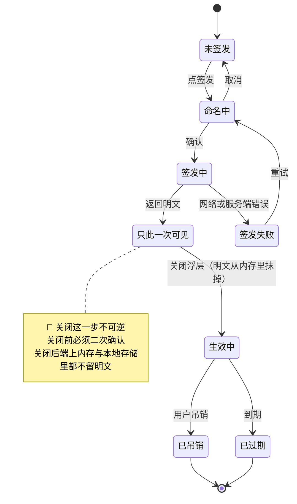
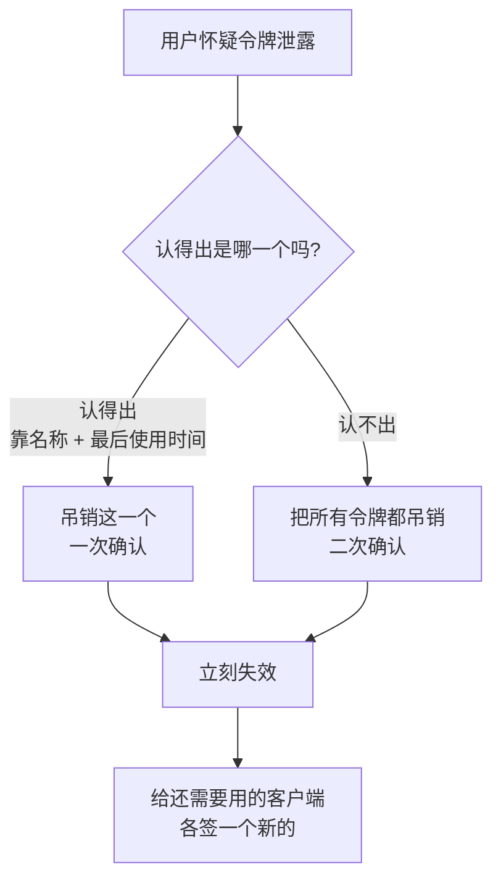
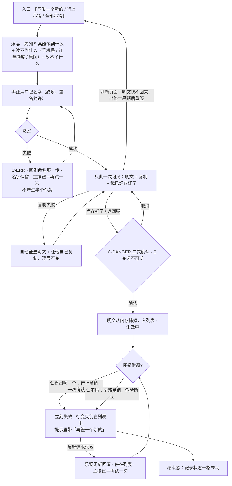

# U4.7 · 只读令牌

> **基线**：`origin/v1` @ `73041df`，fetch 于 2026-09-02。
> **状态：活跃。** 四道锁增减、可读清单条数变化、只展示一次这条规则变化，本文同一次改动内更新。
> **上一层**：[M4 出口 · 域索引](INDEX.md)

---

## 一、这个子能力是什么、不是什么

**是**：签发一串只能读的凭证，让用户自己的客户端直接读他的盲区。**第四条出口，性质与前三条不同。**

**不是**：
- 不是一条收入线 —— 它是**营销资产**，对它收费等于把一个营销资产改造成一条又小又贵的收入线
- 不是一个更方便的导出 —— 前三条是用户在场的、一次性的；**这一条是用户不在场的、持续的**
- 不是一个写入通道 —— 🔴 **写入类能力不是被禁用，是根本没有注册**

**性质不同带来的唯一两条额外要求**：**可撤销**与**可见**。本单元其余内容都是这两个词的展开。

---

## 二、详细产品逻辑

### 2.1 四道锁，冗余是有意的

**只读这件事不靠每个接口自觉，靠四道互相不重叠的锁**（`技术架构与接口契约` §6.5）：

| 锁 | 拦什么 | 它单独漏什么 |
|---|---|---|
| 1 · 令牌本身 | 只读写进凭证里，凭证一经签发不可提升 | 只标明身份，**不做拦截** |
| 2 · 方法过滤 | 只读凭证命中任何写方法 → 直接拒绝。**这是一行判断，不是一套权限模型** | 挡不住读方法的敏感路径 |
| 3 · 工具白名单 | 客户端一侧只注册 5 个只读工具 | 挡不住有人拿凭证**直接打接口**，绕开客户端 |
| 4 · 路径前缀黑名单 | 只读凭证命中支付与额度路径 → 直接拒绝，**不论方法** | —— |

🔴 **锁 4 不能省**：订单查询与额度查询都是读方法，**它们会原样穿过锁 2**；
锁 3 是客户端侧的白名单，挡不住直接打接口；锁 1 不做拦截。所以必须有一道**按路径而不是按方法**拦的锁。

**一道锁失效不该导致整条线失守** —— 这是冗余的全部理由。

**产品侧对应的一句话**：MCP 开放的是**读**，不是写入和采集。这条线划清楚，开放不会伤到商业模型。

### 2.2 签发前必须逐条列出「它能读到什么」

**5 条，与工具白名单一一对应，不多不少：** 我的考点树与覆盖情况 / 某一个考点的详情 / 我的盲区清单 / 我的时间线 / 我的导出文件。

**并列出「读不到什么」，同样在签发前：**

| 类别 | 具体 |
|---|---|
| 读不到 | 手机号；订单与剩余次数；**用户拍的原图** |
| 改不了 | 不能替你记一条、不能替你确认标签、不能替你标「已经会了」 |

🔴 **「不能替你记一条」的依据是「不注册，不是禁用」** —— 客户端上根本没有写入类能力这个东西。
「禁用」意味着它存在但被关着，而一个存在的开关总有一天会被打开。

⚠️ **这份清单必须排在名称输入框之前**：用户在给一串凭证起名字之前，就该知道它能读到什么。
把清单放在签发之后，等于让他先授权再了解。

### 2.3 只展示一次 —— 而且是真的拿不回来



> 状态名取自 `导出与问AI` §4.4。它是一串凭证的生命周期，与 L2 总表 §四 的记录状态是两条不相干的轨。

| 规则 | 内容 |
|---|---|
| 明文出现的唯一时机 | 签发响应，渲染在签发浮层里 |
| 明文的存续范围 | 🔴 只在这个浮层的内存里。**不写本地存储、不写地址栏、不写日志、不进埋点、不进错误上报** |
| 关闭浮层 | **不可逆**，关闭前二次确认 |
| 用户点了「存好了」但没复制过 | 仍然走二次确认 —— 端上知道他没点过复制也没选中过 |
| 刷新页面 | 明文没了，且**找不回来** |
| 找不回来之后 | 吊销它，再签一个新的。**这是唯一的路径，界面上直接这么写** |
| 为什么不能再看一次 | 服务端存的是它的指纹不是原值。🔴 **它不是「不给看」，是真的没有** |
| 不做的事 | 🔴 **不做倒计时自动关闭** —— 用户可能正在配置客户端；对读屏用户，一个会自己消失的不可恢复内容是灾难 |

**「真的没有」这件事必须在界面上说清一次**，否则用户会认为这是产品在为难他，
而下一次他就会去找一个「能重新查看密钥」的产品。

### 2.4 多个令牌的管理

| 事 | 规则 | 为什么 |
|---|---|---|
| 为什么允许多个 | 一台电脑一个、一个客户端一个 | **出事时能只吊销出事的那一个**，而不是把所有客户端一起打断 |
| 名称 | 必填 | 认不出是哪一个，可撤销就等于不可用 |
| 名称重复 | **允许，不做唯一校验** | 两台电脑都叫「电脑」是用户自己的事，**产品替他改名比重名更烦** |
| 排序 | 按创建时间倒序；已吊销与已过期沉到最下 | —— |
| 已吊销 / 已过期的行 | ⚠️ **不从列表里消失** | 用户吊销之后要能确认「它确实被吊销了」；**列表里凭空少一行，和「我是不是吊销错了那个」是同一种不确定** |
| 最后使用时间 | **常驻** | 这是用户判断「哪一个在被别人用」的**唯一线索** |
| 到期 | 自动失效，**不自动续期、不发到期提醒** | 本产品不做提醒 |
| 到期前 | 列表行上显示还有多久过期 | 🔴 **这是状态显示，不是提醒** —— 用户不打开这一屏就不会看到它 |
| 个数上限、名称长度、有效期 | 🚧 未定，见 §五 | —— |

### 2.5 泄露之后：三十秒把它变成一串废字符



| 步骤 | 界面要给什么 | 为什么 |
|---|---|---|
| 认出是哪一个 | 最后使用时间必须常驻 | 唯一线索 |
| 认不出来 | 一个「全部吊销」的动作 | **想不清楚的时候要有一个一定安全的动作** |
| 吊销之后 | 一句确定的话：配了它的地方现在开始读不到任何东西 | 用户需要的是一句确认，**而不是一个消失的列表行** |
| 重新签发 | 吊销成功的提示里带「再签一个新的」 | 吊销的目的通常不是停用，是换一个 |
| 🔴 不做的事 | **不做「检测到异常使用」的告警** | 那需要一套行为分析，而本产品不做行为分析 |

**吊销必须是即时生效的硬失效，不是软标记** —— 一个「稍后生效」的吊销在泄露场景下等于没有吊销。

### 2.6 端的差异只影响签发，不影响查看

| 能力 | 规则 |
|---|---|
| 查看列表 | 各端都有；**这一区常驻，不整区隐藏** |
| 签发 / 吊销 | 需要网络；离线时两者都不可用，列表退化为上次缓存并标明 |
| 在不支持签发的端上 | 只读列表 + 一行说明去哪里签发。**不做一个弱化版的签发** |
| 桌面壳能不能签发 | 🚧 **未定**，见 §五 |

---

## 三、前端行为意图 × 后端契约意图

| 事项 | 前端行为意图 | 后端契约意图 |
|---|---|---|
| 签发 | 先列出「能读到什么 / 读不到什么」，再让用户起名字 | 明文**只在这一次响应里出现**；权限一经签发**不可提升** |
| 明文处置 | 只在浮层内存里；关闭前二次确认；关闭后端上四处（内存、本地存储、日志、埋点）都不留 | 服务端存的是指纹不是原值 —— **重新查看这个功能在服务端是不可实现的，不是不提供** |
| 列出令牌 | 名称、创建时间、最后使用时间、状态四项常驻 | **必须返回最后使用时间**；已吊销与已过期的行**必须仍在列表里** |
| 吊销 | 一次确认；乐观更新，失败回滚并提示 | **立即生效，不是软标记** |
| 只读访问 | 界面上没有任何写入入口 | 🔴 四道锁；只注册 5 个只读工具，**不是禁用是不注册**；支付与额度路径一律拒绝，不论方法 |
| 读到的内容边界 | 「能读到什么」清单与工具白名单**一一对应，不多不少** | 🔴 工具返回值的字段集合与导出、与代发请求体**同源**；任何一处多带一类东西都是内容边界变更 |
| 到期 | 列表行上显示剩余时长 | 到期自动失效；**不发提醒、不自动续期** |
| 离线 | 列表只读并标明，签发与吊销都不可用 | 不涉及 |

---

## 四、边界与红线在这里的具体形态

| 边界 | 在这一单元的形态 |
|---|---|
| **不存题干与机构内容** | 5 个只读工具读到的东西与导出文件同源 —— 🔴 **有人想加一个「读题干」的工具，它注册不上，因为它要读的列不存在。这条边界不是由提示词守的，是由建表守的** |
| 原图不上云不共享 | 「读不到什么」里明写原图。这一条要在**签发前**说，不是出问题之后说 |
| 不给外部读到支付与额度 | 锁 4 专为这一条存在。订单和额度**既不是学习数据，也不是用户想通过 AI 助手读的东西** |
| 没有第四种反馈形态 | 🔴 三处否定：不发到期提醒、不做异常使用告警、不做倒计时自动关闭。**三条各自都很有道理，加起来就是一套提醒机制** |
| 不做行为分析 | 令牌数在列表里就是可数的，**不埋点**；「哪个令牌用得多」这类分析不做 |
| `I-4` | 令牌与额度无关：额度耗尽时签发、查看、吊销全部照常 |

---

## 五、缺口登记

| # | 缺口 | 缺的是哪一半 | 该谁定 |
|---|---|---|---|
| 1 | **令牌的个数上限、名称长度上限、有效期**（🚧） | 三个数都没有真源。产品侧已定的是**行为**：达到上限时提示先吊销一个再签；到期自动失效且不提醒 | 技术侧。它同时挡住列表里「还有多久过期」这句话能不能写 |
| 2 | **桌面壳算不算「Web 界面」** | 契约写死「在 Web 界面手动签发」，而桌面壳内嵌的就是同一份 web 产物。**这句话没有回答这个问题** | 🔴 **放宽它是安全边界的变更，产品不自行放宽。** 它挡住桌面壳上签发按钮到底是可点还是禁用 |
| ✅ 3 | ~~「全部吊销」是不是一个独立能力~~ | **已闭合（2026-09-03）**：是独立能力，`接口契约：签名与错误码全集` §6.6 `POST /tokens/revoke-all` | 已补。选批量动作而不是端上循环，理由正是两者失败语义不同 |

---

## 六、线框

> 记号与屏宽照 `线框与交互规格约定` §三（40 个半角字符），组件只引锚不抄规格。四道锁在服务端，**界面上的落点只有两处**：签发前那份 5 条清单（锁 3），以及「读不到什么」里明写的订单与剩余次数（锁 4）；锁 1 与锁 2 用户侧不可见，界面上**没有任何写入入口**（不注册，不是禁用）。

### 6.1 常态整屏

```
┌────────────────────────────────────────┐
│ ⟦返回⟧ ⟦屏标题⟧ ⟦范围选择器⟧ ← P-NAV   │ ※1
├────────────────────────────────────────┤
│ ⟦区一/二/三 不重画⟧ 区四 · 只读令牌 ※2 │
│ ⟦它能读到什么·5 条·与白名单一一对应⟧   │ ※3
│ ┌─ 令牌列表 ──────────── C-LIST ────┐  │
│ │⟦名称⟧⟦创建⟧⟦最后使用⟧[ 吊销 ]  │     │ ※4·5
│ │⟦还有多久过期⟧⟦已吊销/已过期行·  │    │ ※6
│ │ 灰显·仍在列表⟧                   │   │
│ └─────────────────────────────────┘    │
│ [ 签发一个新的 ] ⟨ 把所有令牌都吊销 ⟩  │ ※7
└────────────────────────────────────────┘
```

※1 范围选择器不影响本区（令牌是账号级的）　※2 🔴 **这一区常驻，任何端上都不整区隐藏**；端的差异只影响签发，不影响查看　※3 🔴 这份清单必须排在名称输入框**之前**（§6.2）：先知道它能读到什么，再决定要不要签　※4·5 🔴 **最后使用时间常驻**，这是用户判断「哪一个在被别人用」的唯一线索；「还有多久过期」是**状态显示不是提醒**，用户不打开这一屏就不会看到它，不发到期提醒、不自动续期
※6 ⚠️ 已吊销与已过期的行**不从列表里消失**，沉到最下 —— 凭空少一行，和「我是不是吊销错了那个」是同一种不确定　※7 ⟨全部吊销⟩ 是认不出是哪一个时的安全动作：**想不清楚的时候要有一个一定安全的动作**，走 `C-DANGER`

### 6.2 两个浮层：签发（清单在前）与明文（只此一次）

```
┌─ 签发浮层 C-SHEET ─────────────────────┐
│⟦能读到⟧1⟦考点树与覆盖⟧2⟦考点详情⟧3⟦盲  │ ※8
│ 区清单⟧4⟦时间线⟧5⟦我的导出文件⟧        │
│⟦读不到⟧⟦手机号⟧⟦订单与剩余次数⟧⟦原图⟧  │ ※9
│⟦改不了：记一条/确认标签/标已经会了⟧    │ ※10
│▢⟦起个名字·必填⟧←C-INPUT ( 签发 )[取消] │ ※11
├─ 明文浮层：只此一次可见 ───────────────┤
│⟦令牌明文·可选中⟧⟦只显示这一次；存的是  │ ※12·13
│ 指纹不是它本身⟧( 复制 )[ 我已经存好了 ]│ ※14
│关闭前 C-DANGER：⟦不会再显示，存好了吗⟧ │ ※15
└────────────────────────────────────────┘
```

※8·9 🔴 5 条，**与工具白名单一一对应，不多不少**（多一条就是清单在替产品做承诺）；原图那一条要在**签发前**说 —— 本域原图只以否定形式出现，这是唯一出现它的一格，**不许折叠**　※10 🔴 依据是**不注册不是禁用**：客户端上根本没有写入类能力这个东西　※11 名称必填（认不出是哪一个，可撤销就等于不可用）；**重名允许，不做唯一校验**　※12·13 🔴 明文只在这个浮层的内存里：不写本地存储、不写地址栏、不写日志、不进埋点、不进错误上报；「真的没有」必须在界面上说清一次，否则用户会以为这是产品在为难他　※14 用户没点过复制也没选中过时**仍可点**，但一样走二次确认
※15 🔴 **不做倒计时自动关闭** —— 用户可能正在配置客户端；一个会自己消失的不可恢复内容对读屏用户是灾难。这与红线第 6 条不冲突：那里禁的是倒计时式紧迫感，这里是**明确拒绝**做倒计时

### 6.3 其余各态：只画变化区

```
│ 骨架 C-SKEL：⟦列表行形状⟧ ··· ···      │
│ 空态 C-EMPTY（一个令牌都没有）         │
│ ⟦你还没签过⟧( 签发一个新的 ) ← 主 ※16  │
│ 错误态 C-ERR（签发失败 / 列表拉不到）  │
│ ⟦哪一步没成⟧( 再试一次 ) ← 主     ※17  │
│ 陈旧：⟦这是刚才的数据⟧列表只读，不可签 │
├────────────────────────────────────────┤
│ 受限态 C-LIMIT · 三档，主按钮都免费    │
│ ①端不支持签发：只读 + ⟦去网页版签⟧※18  │
│ ②到上限：[签发]禁用 ( 先吊销一个再签 ) │
│ ③离线：⟦签发吊销都做不了⟧退化为缓存※19 │
```

※16 空态给的是一个立刻能做的动作，不是「去别处看看」　※17 🔴 签发失败**不产生半个令牌**；重试回到命名那一步，名字保留　※18 🔴 **不做一个弱化版的签发**；查看能力在任何端上都不减　※19 🔴 三档受限态里**一个付费入口都没有** —— 令牌与额度无关（`I-4`），主按钮永远是那条不花钱能走通的路

### 6.4 红线自查十条，逐张数过

| # | 数这一样 | 本单元 |
|---|---|---|
| 1–4 | 正确率 / 讲解 / **提醒 / 到期提醒 / 告警** / 打卡徽章 | 🔴 0，且提醒那一条是三处否定：不发到期提醒、不做异常使用告警、不做倒计时自动关闭。三条各自都很有道理，加起来就是一套提醒机制 |
| 5–8 | 进度环 / 百分比 / 倒计时、能装下题干的格子、置信度 | 0：「还有多久过期」是状态显示，不打开这一屏就看不到；唯一的输入框是令牌名称，有长度上界 |
| 9–10 | **原图入口** / 三处必须出现的东西 | 🔴 0，且是**反向出现**：签发前的「读不到什么」里明写原图，这一格不许被折叠；三处落在 `模块地图` §三登记的 `U8.3` / `U8.4` |

---

## 七、交互规格

### 7.1 必答五项

| # | 必答 | 本单元的答案 |
|---|---|---|
| 1 | **入口** | 三条：本区的「签发一个新的」；列表行上的吊销；泄露路径的「全部吊销」。第四条是深链与返回栈 —— 明文浮层**不进返回栈**，刷新页面明文就没了且找不回来（`P-NAV`） |
| 2 | **结束状态** | 🔴 **记录状态一格未动**：主轨仍是动作前的 `已落本地` / `待上传` / `已同步`，标签轨仍是原来的 `TS-00`–`TS-09`。终态是令牌的生命周期态（`导出与问AI` §4.4 已登记，与记录状态两条不相干的轨） |
| 3 | **失败落点** | 签发失败 → 回到命名那一步、名字保留，主按钮＝再试一次，**不产生半个令牌**；吊销失败 → 乐观更新回滚，停在列表，主按钮＝再试一次；复制明文失败 → **自动全选明文** + 一句让他自己复制的话，浮层不关。三条都不落到「知道了」 |
| 4 | **空态** | 一种成因：一个令牌都没有 → 一句「你还没签过」+ 主按钮是签发。⚠️ **已吊销与已过期不构成空态** —— 它们仍在列表里 |
| 5 | **错误态** | 可重试：签发失败、列表拉不到、吊销失败。不可重试的只有一类 —— **明文已经关掉再也拿不回来**，它的出路不是重试而是**吊销后重签**，界面上直接这么写 |

### 7.2 受限态（按需追加项）

| 档 | 缺什么 | 主按钮 | 付费入口 |
|---|---|---|---|
| 端不支持签发 / 个数到上限 | 这个端没有签发能力；或名额用完 | 查看列表（能力不减）+ 说明去哪里签；先吊销一个再签 | 🔴 无 |
| 离线 / 缺登录 | 签发与吊销都要网；或登录态过期 | 看上次缓存的列表 / 去登录（这一档没有免费兜底） | 🔴 无 |

🔴 **令牌与额度无关**：额度耗尽时签发、查看、吊销全部照常。本区出现任何一个付费入口即为 `I-4` 坏了。

### 7.3 交互流程



⚠️ **本单元不写任何端点。** 签发、列出、吊销、只读访问四件事**已有契约**（`技术架构与接口契约` §6.5，本层只引不抄）。✅ 一处 `[契约缺]` 已于 2026-09-03 闭合：**「全部吊销」是 `接口契约：签名与错误码全集` §6.6 `POST /tokens/revoke-all`** —— 定成一次批量动作而不是端上逐个循环，正因为两者失败语义不同，而界面在这一步必须给出一句确定的话。
