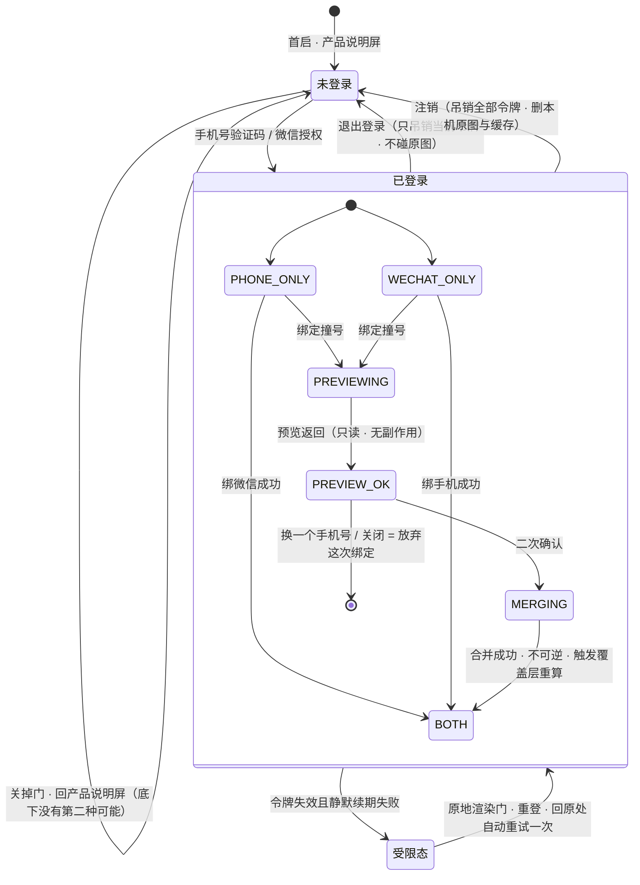

# M5 · 账号

> **基线**：`origin/v1` @ `73041df`，fetch 于 2026-09-02。
> **状态：活跃。** 登录通道增删、「没有本机模式」这条裁定被推翻、合并选边口径落定、注销删除时点定稿，本文同一次改动内更新。
> **上一层**：[模块地图](../INDEX.md)

---

## 一、这一域在减法的哪一端

**支撑 —— 它决定记录归谁**（`模块地图` §二、`用户价值与主流程` §四）。本域既不收减数也不端出差值，
它管的是**减法的主语**。

2026-09-02 裁定「没有本机模式」之后，这句话的分量变了。登录是记录的前置：不登录不能记、不能看盲区、
不能打标、不能导出（`登录与账号` §1.1）。于是本域从一个「支撑模块」变成**两端共同的闸** ——
减数收不到（`J2` 到不了），差值也端不出去（`J5` `J6` 到不了）。

**但它仍然不在减法的任何一端。** 判据是 `产品总纲` §2.1 那句话：一个功能先问它在减法的哪一端。
本域答不出「哪一端」，它答的是另一个问题 —— **没有它，减法没有主语**。
这两件事不许混：**账号是必要条件，不是那个数的驱动**（§三）。

⚠️ 一处现状与本域的产品形态直接冲突，本域只登记不裁定：行为层的三个实体
（`Touch` / `RecordTag` / `UserAssertion`）**一个 `userId` 字段都没有**，不是可空，是不存在
（`后端系统设计与组件接入` §8.1 §8.5）。「记录归谁」这件事在库里目前没有落点 ——
合并搬不动记录、鉴权挡不住数据，这两处症状是同一件事的两个投影。登记在 §7.3，**该技术侧定**。

---

## 二、它服务于主流程的哪一步

**`J1` 登录。** 外加横切 `C1 账号` 在任何一处令牌失效时的出现（`用户价值与主流程` §5.1）。

四处分界要说死：

| 分界 | 归属与依据 |
|---|---|
| 首启那一屏产品说明 | 属 `J0`，归 M0（单元归属见 `模块地图` §三）。本域只管那一屏底部按下之后的那扇门 |
| 「门底下那一屏」是什么 | **由本域定义**：未登录时只剩产品说明屏，因为内容地址全部需要账号（`登录与账号` §1.2）。那一屏的内容归 M0 |
| 登录成功之后进哪一屏 | **不是一个待决问题**：门原地收起、地址不变，用户回到他本来要去的那一屏（`登录与账号` §1.2、`L-4` 已作废） |
| 「记录归谁」在库里怎么落 | 不属本域，也不属产品层。登记见 §7.3 |

⚠️ **`J1` 在裁定前后是两个不同的节点。** 裁定前它是「某个能力临到头上才弹出来的一步」，
裁定后它是进产品的第一步。这一条改的是 `J0`→`J1`→`J2` 整条线，展开在 `U5.1`。

---

## 三、它服务于哪一个关卡

**阶段 3 的判据：累计 ≥50 个陌生注册，且有持续性**（`实施路径` 阶段 3 的验收）。

本域是 `signup_created` 的**唯一生产者**。界面上不存在「注册」这个动作 —— 注册即登录，
号码没见过就建号、见过就登进去（`后端系统设计与组件接入` §1.7）。所以这条判据只能靠服务端把
**建号那一支**单独数出来，**不能只统计登录成功次数**，那个数里混着老用户。
这不是埋点偏好，是**判据能不能被算出来**的问题（`R-55`）。

**阶段 0 的那两个数，本域一个都不产生**（`登录与账号` §十七）。这一节继承那一节的意思，一个字不软化：

- 登录三屏写得再细，**主动查看盲区的人数不动一格**
- 裁定之后本域成了阶段 0 那两个数**能不能被产生出来**的物理前提 —— 不登录不能记，就没有 `record_created`。
  **前提不是产出**：这一条不许反过来当成「本域有进展」的理由
- 本域正好是 `思考模式与选择框架` §盲区二 点名的那一类工作：能做、做起来舒服、不需要面对任何一个真实用户

关卡由人判定，`pass` / `fail`，**不是可调目标**。同一关卡失败三次就是失败。

---

## 四、能力单元清单与下钻

| 单元 | 管什么 | 这一份文档独有的决策 |
|---|---|---|
| [`U5.1` 登录门与没有本机模式](U5.1-登录门与没有本机模式.md) | 未登录看得到什么 | 🔴 门上**没有「继续用」这个出口**；受限态的「缺登录」只剩一种成因，且这一档**没有免费兜底** |
| [`U5.2` 手机号验证码登录](U5.2-手机号验证码登录.md) | 主通道，也是唯一的跨端锚点 | 四道闸的顺序；四种终态四句不同的话；注册即登录而界面上没有「注册」 |
| [`U5.3` 微信授权登录](U5.3-微信授权登录.md) | 副通道 | 🔴 **微信不是跨端锚点**；三条入口一个按钮；拿不到 unionid 拒绝降级建号 |
| [`U5.4` 账号合并](U5.4-账号合并.md) | 两个通道撞上同一个人 | 🔴 **唯一一处刻意不给退路的地方**；预览只读、只给计数不给内容；**用哪个通道登录就登进哪个账号** |
| [`U5.5` 注销与把数据带走](U5.5-注销与把数据带走.md) | 删账号 | 第一个浮层的主按钮是导出；响应必须带导出入口提示；删除时点待律师稿 |
| [`U5.6` 退出登录](U5.6-退出登录.md) | 只是登出 | 🔴 **不碰原图**；未上传的先拦一次；它与注销的差别就是这一单元的全部内容 |

**域内共享、单元文档不各自复述的五件事：**

1. **三屏**：`S-LOGIN`（门）、`S-ACC`（账号屏）、`S-MERGE`（合并，它也是门不是路由）。
2. **只有两种态，没有第三种**：未登录（只看得到产品说明与登录门）、已登录（全部功能）。
   未登录**不是一种可停留的形态**，它是进门前的那一步（`登录与账号` §1.1、`用户侧功能规格 · 总纲` §四）。
3. **门不是一条路由**：`/login` 这个地址不存在；未登录访问任何 `route id` 都是**原地渲染**，地址不变；
   登录完不做导航、不改历史（`多端选型与端矩阵` §4.6.2 已冻结）。
4. **只碰四样系统能力**：短信自动填充、剪贴板（仅用户主动点粘贴时）、网络状态、系统时间。
   明确不用的五样：通讯录、生物识别、推送、定位、**相机与相册** —— 最后一样同时是原图红线在本域的落点（§7.1）。
5. **错误码底座**在 `用户侧功能规格 · 总纲` §三，三屏特有的补充在 `登录与账号` §八。
   两处都没有的一律走总纲的未知错误行；单元文档不各自抄一份。

---

## 五、域级状态机

**本域不产生、也不改变主轨四态与 `TS-00`–`TS-09` 中的任何一态** —— 那两条轨描述的是**一条记录**的状态
（`模块地图` §四），而本域处理的是身份。所以本图用身份态，态名取自
`登录与账号` §2.4 §4.3 §5.3，**一个都不新起**。本域与主轨唯一的交点写在图下。

**四条读图规则：**

| # | 规则 |
|---|---|
| 1 | **「未登录」没有指向任何内容态的箭头。** 门上没有「继续用」这个出口 —— 这是 `U5.1` 的全部内容 |
| 2 | **`受限态` 在本域只有一种成因**：已登录之后令牌失效且续期失败。「从没登录」不进受限态，它直接就是未登录 |
| 3 | **`PREVIEW_OK` 没有指向「以后再说」的箭头。** 关闭与换号都是**放弃这次绑定**，差别在于放弃之后没有任何一份数据处在「将来要并」的悬置状态 |
| 4 | **`MERGING` 是全域唯一允许禁用关闭按钮的时刻。** 其余任何态下关闭按钮永不禁用 |

**与主轨的唯一交点：**

| 交点 | 说明 |
|---|---|
| 退出登录 × `待上传` | 退出会清掉**已同步**的记录缓存；处在 `待上传` 的记录服务端没有副本，清掉就是丢。所以退出前**先拦一次** —— `I-1` 防不到这条路径（见 `U5.6`） |

---

## 六、前端行为意图 × 后端契约意图

**域级的九条**，单元级的成对表在各自文档 §三。端点名一律是引用，契约以 `技术架构与接口契约` 为准。

| 动作 | 前端行为意图 | 后端契约意图 |
|---|---|---|
| **渲染登录门** | 未登录访问任何 `route id` 时**原地渲染**，不发首屏请求、元素全部本地渲染、地址不变；关闭按钮在任何状态下都在 | **不涉及后端。** 门没有加载态与空态，是因为它没有一次可以失败的往返 |
| **发验证码** | 本端按次数提前挡一道人机验证；发出后一切数字（重发间隔、码位数）都从响应取，**前端不自己算、不硬编码** | `/auth/sms/send` 失败时必须能区分**频控 / 需人机验证 / 通道故障 / 通道未开通**四档 —— 四档界面表现完全不同，混成一档界面就只能说一句含糊的话 |
| **校验并登录** | 未勾协议**不发请求**；成功即收起门并回原处重试来处那一步 | `/auth/sms/verify` 失败要能区分**码错 / 已过期 / 已用过 / 已作废 / 已锁定**五档；成功要能区分**建号 / 直接登录**（§三 的判据靠它） |
| **微信授权** | 跳走前落盘门的状态；用户取消**不报错**；本端不支持就不渲染入口，不做灰按钮 | `state` **由服务端生成并核销**；失败要能区分 state 失效 / code 无效 / 拿不到 unionid / 通道未开通四档；拿不到 unionid **拒绝降级建号** |
| **绑定手机 / 微信** | 与登录复用同一套输入组件与同一套异常映射，**不写第二份校验**；绑定有「以后再说」，登录没有 | 撞号必须是**可区分的一档**，不能混进通用 4xx —— 它是唯一一个要转屏的失败 |
| **合并预览** | 数字未回时骨架占位，**永不显示 0**；不可逆声明先于数字上屏 | **只读、无副作用**；返回条数、最早、最近、覆盖前后值与一次性凭证；覆盖前后值缺失要能被识别为「没有这个字段」，不是 0 |
| **合并确认** | 二次确认之后才发；执行中禁用关闭；中断后可重试 | 必须带预览的一次性凭证；**不可逆**、**幂等**、写合并日志；失败要能区分凭证失效 / 目标账号不存在 / 服务端错误三档 |
| **令牌续期与失效** | 先静默续期并自动重试原请求一次，用户无感；续不上才原地渲染门 | 任何未授权响应都要让前端能区分**「从没登录」与「登录过期」** —— 两者门上说的不是一句话 |
| **退出与注销** | 退出前查本地队列，有未传的先拦一次；注销走打字确认，并在用户决定之前给一次导出 | 退出只吊销当前令牌；注销吊销全部令牌，**响应里必须带导出入口提示**；两者都要**立即生效** —— 这条要求本身排除了 JWT（`后端系统设计与组件接入` §1.9） |

🔴 **额度在这张表里一次都不出现。** 短信验证码是按次外部账单，但它由**频控与人机验证**管住，
不由额度管住 —— 对它计费等于对注册计费（`商业化与额度设计` §3.2、`R-43`）。
本域与 `I-4` 的关系只有这一句：**频控解决薅羊毛，额度解决成本分摊，两者不能互相替代。**

---

## 七、这一域碰到的边界 + 缺口登记

### 7.1 红线在本域的形态

| 红线 | 在本域长什么样 |
|---|---|
| **不判断对错** | 三屏出现的数字只有：记录条数、覆盖考点个数、剩余次数、倒计时、设备台数、时间点。**没有一个是评价** |
| **不存题干与机构内容** | 全域**可输入元素只有三个**：手机号、验证码、注销时要打的那两个字，三个都有字符白名单与位数上限。设备名是服务端按端类型生成的枚举，不是自由文本 —— 一旦允许改名就多一个自由文本字段 |
| **不生成标签文本 / 闭集打标** | ➖ 不涉及。三屏不产生任何标签 |
| **原图不上云** | 三屏没有任何图片入口，`S-ACC` 上没有上传原图的位置。**跨端同步的是记录，不含原图。**「退出不碰原图、只有注销才删原图」是这条红线在本域最容易被实现踩掉的一格（`U5.6`） |
| **没有第四种反馈形态** | 只绑了微信时给的是**一行弱提示条**，不弹窗、不拦路、不每次都提；登录流程**不申请推送权限**；合并完成的提示只出现一次，离开再进不再显示 |
| **不做提醒与激励** | 无连续天数、无奖章、无未读计数。多设备同时在线**不拦、不提示、不踢人** |

### 7.2 缺口登记 —— 只登记，不裁定

**编号 `L-x` 全部取自 `登录与账号` §十八，本域不改写、不合并。**
`L-4` `L-16` 已在真源里由用户裁定作废（不存在本机模式，登录前不产生数据），编号保留不复用。

⚠️ **本域自有、真源侧没有 `L-x` 的缺口用 `M5-G<k>`**（`模块地图` §一 第 4 条：新号带域前缀）。
2026-09-03 补：这六条此前在单元文档里写成没有编号的 ⚠️ 段落或没有编号的表行 ——
**没有编号也没有 ⚪，任何缺口扫描都数不到它们**，而其中 `M5-G1` 正是「合并搬不动记录」的根因。

| 缺口 | 缺的是哪一半 | 该谁定 |
|---|---|---|
| `L-1` Apple 登录做不做 | 产品定不了：**由移动端上不上架决定**，不由登录设计决定 | 由人拍板 |
| `L-2` 封禁状态存不存在 | 产品缺：界面已画，但「什么情况下封一个账号」从没定过。定不下来就把那半个界面一起删掉，不留半个 | 由人拍板 |
| `L-3` 注销的删除时点（立即硬删 vs 软删 T+N） | 属用户协议不属架构 | **待 `L-A5` 律师稿** |
| `L-5` 退出登录拦截的形态 | 产品缺：拦这件事已成立，**拦成什么样**（强制先传 / 可跳过 / 只显示条数）没人定过 | 由人拍板 |
| `L-6` 验证码位数与短信模板文案 | 外部流程缺：签名与模板报备需主体资质，尚未报备 | 待报备 |
| `L-7` 非中国大陆号码 / 国际区号 | 产品缺：改一处要连着改短信模板、频控口径、「日」的时区三处 | 由人拍板 |
| `L-8` 协议版本更新后的重新同意流程与端点 | 两半都缺：端点是规格新提出的，协议正文也还在律师稿里 | 🚧 待技术定稿 + 待律师稿 |
| `L-9` 设备名从哪来、能不能改 | 技术缺：契约里只有标签字段，没定由谁生成、能不能改。**能改就多一个自由文本字段** | 🚧 待技术定稿 |
| `L-10` 合并预览在数据量极大时的降级口径 | 产品缺：超时的界面有了，超时之后**给什么**没定。给一个不精确的数字比不给更危险 —— 合并不可逆 | 由人拍板 |
| `L-11` 两个通道时能不能解绑其中一个 | 契约缺：没有解绑端点，且「只剩一个通道还能不能解绑」必须先答 —— 解到零个通道等于用户把自己锁在外面 | 由人拍板 |
| `L-12` 「快捷再登录」（生物识别）做不做 | 不挡任何事。登记是为了它可数：**它属于能做、做起来舒服的那一类** | 由人拍板 |
| `L-13` 多语言做不做 | 产品缺：现状「界面仍为中文」是一个默认值，不是一个决定 | 由人拍板 |
| `L-14` PC 扫码登录做不做 | 外部流程缺：需开放平台的网站应用审核。桌面壳现在根本不渲染微信入口 | 由人拍板 |
| `L-15` 小程序的一键手机号用不用 | 产品缺：它能一步拿到两条身份，但它是**按次外部账单**，必须同样受频控与人机验证管 | 由人拍板 |
| `FG-4` 首次运行明示同意在新形态下的具体形态 | 法务口径缺：主体从本机模式换成产品说明屏（`用户价值与主流程` §六） | **需法务口径，产品定不了** |
| ✅ `M5-G1` **行为层三个实体没有 `userId`** | 技术缺：`Touch` / `RecordTag` / `UserAssertion` 一个 `userId` 都没有，采集端点不经会话解析。**与「不登录不能记」的裁定直接冲突**，也是 `U5.4` 合并可迁移条数恒为 0 的根因（§7.3 同一条） | **已闭合 2026-09-03**：`接口契约:签名与错误码全集` §九·待办 2 —— 三个实体都加 `userId`，加的方式受同文 §11.2 约束（`kaodian-domain/pom.xml` 里出现 `kaodian-auth` 即违规，可 grep） |
| ⚪ `M5-G2` 已登录用户在受限态下关掉登录门之后停在哪 | 产品缺：那一屏此时既没有内容也没有门，能不能做事、多久之后重新弹门，两份真源都没写。牵动的是「用户会不会以为产品坏了」 | 由人拍板 |
| ⚪ `M5-G3` 频控的「日」与用户看到的「今天」不是同一个时区键（`R-81`） | 口径缺：受限态文案要给「明天再试」这类跨日说法，两个键在跨零点时给出不同答案。牵动的是「用户会不会觉得产品在骗他」 | 由人拍板，待 `R-81` 落笔 |
| ✅ `M5-G4` 两条身份同时命中两个账号时登进哪一边 | 鉴权设计缺：旧规则的理由（微信必然更晚建）已随取消分期失效，新理由没人写。产品口径只覆盖常规路径 | **已闭合 2026-09-03**：`接口契约:签名与错误码全集` §九·待办 6 —— 产品口径「用哪个通道登录就登进哪个账号」原样成立，技术侧只补它没覆盖的那一格：**登进「发起边」**。🔴 新规则不依赖谁先建号 |
| ⚪ `M5-G5` 别的设备上的原图在注销后仍然在 | 文案缺：原图从不上云，**没有一处能统一删它**。方向与红线一致（不上云是保护不是遗漏），但要在文案里说清 —— 谁来说、在哪一步说没人定过 | 由人拍板，与 `L-3` 一起 |
| ⚪ `M5-G6` 「注册流水注销后不删」与「注销即删除」的用户口径打架 | 两句话同时对用户说时会撞（`后端系统设计与组件接入` §8.2：只追加、注销不删，为的是阶段 3 的判据仍算得出来） | 律师稿 + 产品口径一起答 |

### 7.3 继承自 KUBI-72 的两条技术侧待办 —— ✅ 两条均已由技术侧答复（2026-09-03）

| 待办 | 事实 | 为什么与本域相关 | 技术侧裁定 |
|---|---|---|---|
| ✅ **行为层三个实体没有 `userId`** | `Touch` / `RecordTag` / `UserAssertion` 一个 `userId` 都没有，不是可空是不存在；采集端点不经会话解析（`后端系统设计与组件接入` §8.1 §8.5） | 旧形态下这是「将来要补的租户隔离」，**裁定之后它与产品形态直接冲突** —— 「不登录不能记」，而现状等于未登录也能写进来、写进来的记录不归任何人。它同时是「合并搬不动记录」的根因（`U5.4`） | `接口契约:签名与错误码全集` §九·待办 2：**三个都加**，加的方式受同文 §11.2 约束（`app` 从鉴权上下文取出 `userId` 显式传给 `domain`，`domain` 不依赖 `kaodian-auth`）。同一条在 §7.2 登记为 `M5-G1` |
| ✅ **`user_identity` 留位论证的时序前提已变** | 「多态 identity 表让**阶段 2 后**接微信变成插入一行数据」这条论证，前提是「阶段 2 只做手机号、微信在阶段 2 后」（`技术架构与接口契约` §7.2） | 取消功能分期后微信同属完整 App，谁先建号由用户实际路径决定。**结论（用多态 identity 表）本域不动，变的是它的理由** | `接口契约:签名与错误码全集` §九·待办 7：**结论不动，理由重写** —— 新理由是「账号的锚点必须是 `app_user.id`，不能是任何一条凭证」。🔴 它不依赖分期，所以不会再失效一次。连带的合并选边规则见同文 §九·待办 6，本域登记为 `M5-G4` |

⚠️ **这两条当初不许由本层顺手补上，现在也不是本层补的。** 关掉它们的是技术侧写下的裁定原文（上表末列逐条指到章节），不是一个看似合理的推断 —— 判据没变：**一个推断不能关闭一个 ⚪，一条别人写下的裁定才能。**
