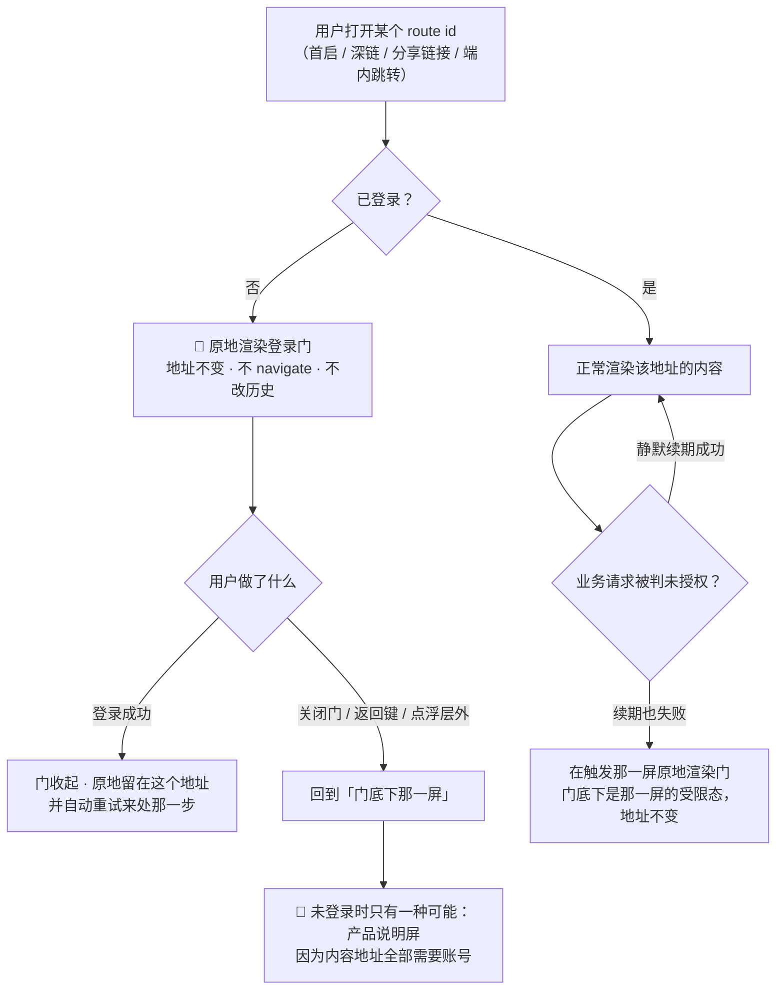
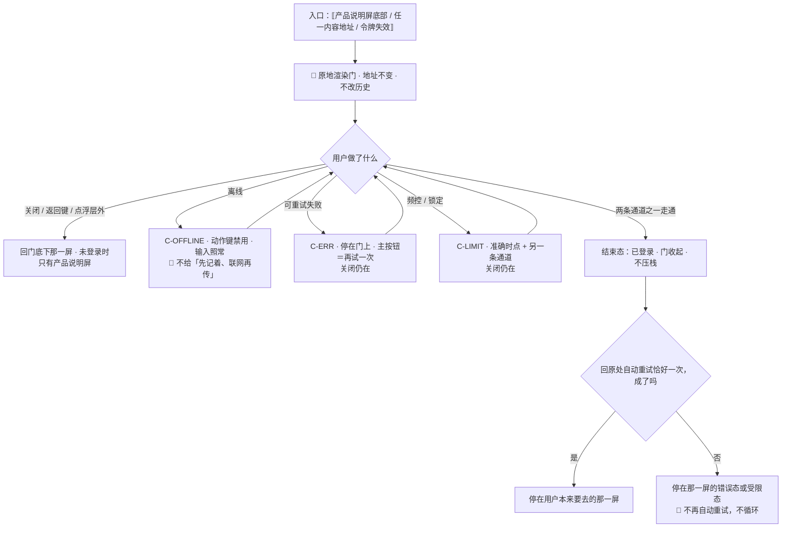

# U5.1 · 登录门与没有本机模式

> **基线**：`origin/v1` @ `73041df`，fetch 于 2026-09-02。
> **状态：活跃。** 「没有本机模式」这条裁定被推翻、门与路由的关系变化、受限态成因增减，本文同一次改动内更新。
> **上一层**：[M5 · 账号](INDEX.md)

---

## 一、这个子能力是什么、不是什么

**它是「未登录时，任何一个内容地址渲染出来的那扇门」。** 不是一个页面，不是一次跳转，也不是一个可以停留的形态。

- **它不是一条路由。** `/login` 这个地址不存在（`多端选型与端矩阵` §4.6.2 已冻结）。
  门只有里外、没有历史 —— 做成路由的话，登录完按一下后退就回到登录页，再点一次又登进去，一个不存在的往返。
- **它不是「某个能力临到头上才弹出来的一步」。** 它是进产品的第一步。
- **它不是一个可以绕过去的关口。** 🔴 **门上没有「继续用」这个出口**（2026-09-02 用户裁定）。

**这一单元独有的三个决策**：裁定本身的产品后果（§2.1–§2.2）、门与地址的关系（§2.3）、
受限态里「缺登录」这一档为什么没有兜底（§2.5）。

---

## 二、详细产品逻辑

### 2.1 裁定：登录从「出口」变成「入口」

**产品只有两种态，没有第三种**（`登录与账号` §1.1）：

| 态 | 能做什么 | 是不是一种可停留的形态 |
|---|---|---|
| **未登录** | 只看得到产品说明与登录门。**不能记、不能看盲区、不能打标、不能导出** | ❌ 不是。它是进门前的那一步，不是一种用法 |
| **已登录** | 全部功能 | ✅ 唯一的正常形态 |

**不登录不能记；能记的一定已登录。**

🚫 原红线「不允许把本机模式做成体验版」**已作废**，而且**这里不接一条新的红线**。
作废的理由不是「这条红线不重要」，是**它保护的对象已经不存在** ——
那条红线保护的是「不登录也能完整地用」，而这件事被裁定掉了。没有被保护的对象，就没有这条红线。

### 2.2 这条裁定改的是 `J0`→`J1`→`J2` 整条线

**它不是「删掉一个入口」，是把三个节点的性质各改了一次。**

| 节点 | 裁定前 | 裁定后 | 由此产生的产品后果 |
|---|---|---|---|
| `J0` 头一次打开 | 读一屏说明，然后可以直接开始用 | 读一屏说明，**底部按钮是登录入口，没有跳过** | 产品说明屏成了**未登录唯一能停留的地方**；它同时是「门底下那一屏」的唯一候选（§2.3） |
| `J1` 登录 | 一个出口：想跨设备再登 | **一个入口**：不登录走不到下一步 | 「这个能力需要账号」这类按能力写的话不再触发登录；触发登录的只剩令牌失效（§2.5） |
| `J2` 记一笔 | 未登录也能记，登录后再上传 | **未登录记不了** | **登录前不产生任何数据** —— 「登录前攒下的数据怎么办」这个问题连同它的界面一起消失 |

**三条连带结论，每一条都是产品判断，不是实现细节：**

1. **`S-MERGE` 只剩一支。** 合并从来只有「微信号与手机号是同一个人的两个账号」这一支，
   从来没有「本机数据并入账号」那一支 —— 所以裁定**不影响合并**（`登录与账号` §十八 变更记录）。
2. **权限申请时点不变。** 相机 / 相册仍在第一次用到时申请，只是它现在必然发生在登录之后。
3. **原图仍然只存在用户自己的机器上。** 取消本机模式**不改变这一条** ——
   本机模式没了，不等于「本机」这个概念没了。这两件事被混起来的风险最高，写在这里挡一次。

### 2.3 门与地址：原地渲染，以及「门底下那一屏」



**四条不许违反的约定：**

| # | 约定 | 为什么 |
|---|---|---|
| 1 | 分享出去的链接是**内容地址**，不是登录地址 | 别人打开时在同一个地址上看到门。深链指向的永远是内容，门只是它在未登录时的渲染结果 |
| 2 | 登录成功后**不做导航、不改历史** | 否则登录完按返回会回到门，用户以为自己被登出了 |
| 3 | 返回键、关闭、点浮层外部**三者行为一致**，且不留半截状态 | 三个动作在用户心里是同一件事，行为不一致就等于产品在三个地方给了三个答案 |
| 4 | **`S-MERGE` 同样是门**，不是路由 | 它是一次必须当场答的问题，不是一个位置（`登录与账号` §1.2） |

### 2.4 退出口只剩一个，所以它永不禁用

原来的「先不登录，继续用」随本机模式一并取消，于是**「不把用户堵在门里」这件事全部压在关闭按钮上**。

- 关闭按钮在**任何状态**下都不得禁用、不得隐藏 —— 包括锁定、错误、离线
- 门的状态机里，**每一个态都有一条回到「关掉」的路**，没有任何一个态把用户堵死
- 人机验证失败**不消耗发送次数** —— 那不是用户的错，把它算成一次尝试等于用一次系统故障惩罚用户

### 2.5 受限态里的「缺登录」只剩一种成因，而这一档没有免费兜底

**这是本单元最容易被实现和设计同时误解的一格。**

| 受限的成因 | 什么时候出现 | 有没有免费兜底 |
|---|---|---|
| **缺登录 · 从没登录** | 不存在这一档 —— 从没登录的人看到的是门，不是受限态 | —— |
| **缺登录 · 已登录后令牌失效** | 静默续期失败之后 | 🔴 **没有。** 唯一的出路是重新登录 |
| **缺额度** | 外部模型调用用完了 | ✅ **有。** 记录照常、盲区不锁、导出不锁、免费复制永不移除（`I-4`） |

**为什么这一档没有兜底，而额度那一档有：** 额度限制的是**产品替用户花的钱**，
所以它必须留一条零边际成本的路；登录限制的是**这些记录归谁**，它没有「不知道归谁的降级版本」可给。
一个不知道归谁的记录，进不了任何一个人的减数 —— 兜底给出去的不是一个弱化的功能，是一份没有主语的数据。

⚠️ **这两档的文案必须能被用户区分开。** 「从没登录」与「登录过期」也必须是两句话 ——
副标题是这扇门唯一在说人话的地方，而 Web 端因为存储更容易被清掉，「登录过期」会比别的端更频繁地出现，
所以那句话必须写得**不像故障**。

### 2.6 未登录 + 离线：只能等联网，不给第二条路

门在离线时能打开、输入框能照常输入，但发码与登录都必须联网，这件事要在门上**直说**，
不能让用户点了才发现。

🔴 **不给「先记着、联网再传」这条出路** —— 因为登录前根本不产生数据。
已登录之后的离线可用性**一个字都没变**：本地先落盘、联网后同步，`I-1` 不动。
**变的只有未登录那一端。**

---

## 三、前端行为意图 × 后端契约意图

| 场景 | 前端行为意图 | 后端契约意图 |
|---|---|---|
| 未登录访问任一内容地址 | 路由守卫原地渲染门，地址不变；门不发首屏请求，元素全部本地渲染 | **不涉及后端。** 门没有加载态与空态，是因为它没有一次可以失败的往返 |
| 门的副标题该说哪一句 | 由入口决定：主动进入用通用句，令牌失效用另一句 | 未授权响应必须让前端能区分**「从没登录」与「登录过期」** —— 区分不出来，副标题就写不出来 |
| 登录成功 | 收起门、留在原地址、**自动重试来处那一步一次** | 登录端点只负责签发；「回原处重试」是前端责任，后端不需要知道来处 |
| 关闭门 | 回「门底下那一屏」；未登录时那一屏只有产品说明屏 | 不涉及 |
| 深链参数非法 | **忽略非法参数**，按该地址的默认视图渲染，不报错 | 不涉及 —— 非法参数不该产生一次服务端往返 |
| 该地址在本端不存在 | 明确转场到有它的端，**不是 404** | 不涉及 |
| 离线 | 门可开、可输入，动作按钮禁用，**不发请求** | 不涉及 |

🔴 **这张表里没有任何一行叫「未登录时的降级接口」。** 采集、打标、查询、导出在新形态下**全部是登录后接口**
（`技术架构与接口契约` §六 的加注）。一个「未登录也能调」的降级端点会当场把这条裁定作废掉。

---

## 四、边界与红线在这里的具体形态

| 红线 | 在本单元的形态 |
|---|---|
| **不判断对错** | 门上没有任何评价性内容。频控与锁定的提示给的是**准确时点**，不是含糊的「稍后」—— 含糊的说法只惩罚真实用户，刷子不会因为文案含糊而少刷 |
| **不存题干** | 全屏**只有两个可输入元素**：手机号、验证码，各自有位数上限与字符白名单。**不留、也不会留第三个输入框** |
| **原图不上云** | 门上没有任何图片入口；登录流程不申请相机与相册权限。这一条同时是原图红线在本单元的落点 |
| **没有第四种反馈形态** | 门上没有小红点、气泡引导、未读计数、推送提醒。登录流程**不申请推送权限** |
| **不做提醒与激励** | 通读门上全部文案，不出现「体验版」「免费额度」「登录解锁更多」以及任何条数上限提示 —— 这三类话术全部预设了一个「不登录也能用一点」的形态，而那个形态不存在 |

---

## 五、缺口登记

**只登记，不裁定。** 编号取自 `登录与账号` §十八 与 `用户价值与主流程` §六。

| 缺口 | 缺的是哪一半 | 该谁定 |
|---|---|---|
| `FG-4` 首次运行明示同意在新形态下的具体形态 | 法务口径缺：明示同意的主体从本机模式换成了产品说明屏，新形态下怎么给、给在哪一步没人定 | **需法务口径，产品定不了** |
| `L-8` 协议版本更新后的重新同意流程与端点 | 两半都缺：端点是规格新提出的（🚧 待技术定稿），协议正文在律师稿里。**没有版本号就只能每次都不勾**，那是一个更差但能跑的兜底 | 🚧 待技术定稿 + 待律师稿 |
| `L-13` 多语言做不做 | 产品缺：现状「界面仍为中文」是一个默认值，不是一个决定 | 由人拍板 |
| ✅ `M5-G1` **行为层三个实体没有 `userId`** | 技术缺，且**与本单元的裁定直接冲突**：裁定说「能记的一定已登录」，而现状是采集端点不经会话解析、行为层没有归属字段，等于未登录也能写进来（`后端系统设计与组件接入` §8.1） | **已闭合 2026-09-03**，裁定原文见域索引 §7.3（三个都加 `userId`）。本行不复述，改一处就在那一处改 |

⚪ **`M5-G2` · 一处本单元观察到、真源未登记的空白**（`模块地图` §一 第 4 条：新号带域前缀；本行同时登记在域索引 §7.2）：裁定之后，「门底下那一屏」在**未登录**时只有一种可能，
这一格是清楚的；但**已登录用户在受限态下关掉门**之后停在那一屏的受限态里，
而那一屏此时既没有内容也没有门 —— 它能不能做任何事、多久之后重新弹门，两份真源都没写。
本单元不替它拍板，只指出：这一格牵动的是「用户会不会以为产品坏了」，不只是一个交互细节。

---

## 六、线框

> 记号与屏宽照 `线框与交互规格约定` §三（40 个半角字符），组件只引锚不抄规格。
> 本单元只画**门这个容器**与它底下那一屏；门里两条通道各自的输入区在本域另外两份单元（清单见域索引 §四）。

### 6.1 常态整屏 —— 未登录访问任一内容地址，门原地渲染

```
┌────────────────────────────────────────┐
│ ‹ × 关闭 ›          ← C-BTN 文本   ※1  │
├────────────────────────────────────────┤
│ ① 说明区                               │
│  ⟦标题 → 登录与账号 §2.3⟧              │
│  ⟦副标题 · 按入口两句 → §2.5⟧      ※2  │
├────────────────────────────────────────┤
│ ② 输入区  ⟦手机号 · 验证码⟧        ※3  │
│  ⟦页内提示位 · 常驻占位⟧ ← C-INLINE    │
├────────────────────────────────────────┤
│ ③ 动作区                               │
│  (        ⟦主按钮⟧        ) ← C-BTN 主 │
│  ⟦协议勾选行 · 默认不勾⟧               │
├────────────────────────────────────────┤
│ ④ 其他通道区 ⟦或者⟧⟦微信入口⟧      ※4  │
├────────────────────────────────────────┤
│ 🔴 这一屏没有贴底出口区            ※5  │
└────────────────────────────────────────┘
      ↓ 关闭 / 返回键 / 点浮层外（同一件事）
┌────────────────────────────────────────┐
│ ⟦产品说明屏⟧ ← 未登录时唯一的底    ※6  │
└────────────────────────────────────────┘
```

※1 🔴 **关闭在任何态下都不禁用、不隐藏**，含锁定、错误、离线 —— 它是这一屏唯一的退出口（`P-NAV` 反例 1：「登录屏没有返回，用户被堵在那里」是红线）。返回键、关闭、点浮层外三者行为一致，不留半截状态
※2 两句不许压成一句：「从没登录」与「登录过期」（§2.5）　※3 全屏只有两个可输入元素，不留第三个
※4 本端不支持或通道未开通时**整行不渲染**，不做灰按钮　※5 🔴 没有「继续用」「先逛逛」「跳过」「游客模式」—— 它保护的对象已不存在（§2.1），不是把那一行换个说法
※6 见 `模块地图` §三登记的 `U0.1`。门收起后地址不变，**不 navigate、不改历史、不压栈**（`P-NAV`）

### 6.2 其余各态：只画变化区

```
│ 骨架 C-SKEL：⟦不存在⟧              ※7  │
│ 空态 C-EMPTY：⟦不存在⟧             ※7  │
├────────────────────────────────────────┤
│ 错误态 C-ERR · ② 整区替换          ※8  │
│  ⟦哪一步没成 → 登录与账号 §八⟧         │
│  ( 再试一次 )   ‹ × 关闭 › 仍在        │
│  ①③④ ⟦同常态⟧                          │
├────────────────────────────────────────┤
│ 🔴 受限态 C-LIMIT · 登录态过期     ※9  │
│  ⟦副标题换成过期那一句⟧                │
│  (   去登录   ) ← 主 · 无免费兜底      │
│  ②③④ 与 ‹ × 关闭 › ⟦同常态⟧            │
├────────────────────────────────────────┤
│ 离线 C-OFFLINE 细条 · ③ 动作键禁用 ※10 │
│  ⟦这一步必须联网⟧ 输入框照常可输       │
```

※7 门不发首屏请求、元素全部本地渲染，**没有一次可以失败的往返**，所以它没有加载态；门永远有内容，所以它没有空态（`登录与账号` §1.3）。这是答案，不是留空
※8 🔴 错误态下 ② 被替换，但 `‹ × 关闭 ›` 不动 —— 每一个态都有回到「关掉」的路（§2.4）
※9 缺登录**只剩「已登录后令牌失效」这一种成因**；从没登录的人看到的是门，不是受限态（§2.5）
※10 🔴 不给「先记着、联网再传」这条出路 —— 登录前不产生数据（§2.6）

### 6.3 红线自查十条，逐张数过

| # | 数这一样 | 本单元 |
|---|---|---|
| 1–2 | 正确率 / 得分 / 排名 / 讲解 / 学习建议 | 0：门上没有任何评价性内容；频控与锁定给的是**准确时点**，不是含糊的「稍后」 |
| 3–6 | 提醒 / 打卡 / 进度环 / 百分比 / 倒计时紧迫感 | 0：没有小红点、气泡引导、未读计数；不申请推送权限。⚠️ 验证码等待秒数是**能力约束**（`全局组件与交互模式库` §0.5 第 2 条已豁免），但文案里不出现「限时」「马上过期」；🔴 也不出现「体验版」「免费额度」「登录解锁更多」—— 这三类话术全预设了一个不存在的形态 |
| 7–8 | 能装下题干的格子、置信度 | 0：两个可输入元素各有位数上限与字符白名单；本屏不产生标签，置信度 0 |
| 9–10 | 原图入口 / 三处必须出现的东西 | 0：门上没有任何图片入口，登录流程不申请相机与相册权限。三处落在 `模块地图` §三登记的 `U8.3` / `U8.4`，本单元不重画也不弱化 |

---

## 七、交互规格

### 7.1 必答五项

| # | 必答 | 本单元的答案 |
|---|---|---|
| 1 | **入口** | 三条，**全部要能返回**：产品说明屏底部的登录入口；未登录访问任一内容地址（含深链、分享链接、端内跳转）；令牌失效后的任一请求。🔴 三条都是**原地渲染**，地址不变、不 navigate、不改历史 —— `/login` 这个地址不存在 |
| 2 | **结束状态** | 身份态「已登录」（态名取自 `登录与账号` §2.4）。🔴 **它与主轨四态、`TS-00`–`TS-09` 是两条不相干的轨**（真源 `模块地图` §四）—— 门不产生、也不改变任何一条记录的状态。第二个终态是「关掉门 · 回产品说明屏」，它是正常出口不是失败 |
| 3 | **失败落点** | 一律停在门上，`‹ × 关闭 ›` 永不禁用。可重试失败 → `C-ERR`，主按钮＝再试一次；频控 / 锁定 → `C-LIMIT`，给准确时点 + 另一条通道；离线 → 动作键禁用、输入框照常可输。**没有任何一个态把用户堵死** |
| 4 | **空态** | **成因为零，这一屏不存在空态** —— 门永远有内容（`登录与账号` §1.3）。它不是「答不出」，是这一屏没有一次会返回零结果的往返 |
| 5 | **错误态** | 可重试：通道故障、超时、验证组件加载不出来。不可重试：账号被锁定（出路是等到时点或换另一条通道）、本端通道未开通（出路是换另一条通道）。**没有陈旧数据态** —— 门不缓存任何服务端数据 |

### 7.2 受限态（按需追加项）

| 档 | 什么时候出现 | 主按钮 | 次入口 |
|---|---|---|---|
| **缺登录 · 从没登录** | 🔴 **不存在这一档** —— 看到的是门 | —— | —— |
| **缺登录 · 令牌失效** | 静默续期失败之后 | 🔴 去登录，**这一档没有免费兜底** | 无 |
| 频控 / 锁定 | 发码或校验被挡 | 等到准确时点 | 换另一条通道（仅本端真有那个入口时才给） |

🔴 **可断言的检查**：`C-LIMIT` 的「主按钮永远是免费兜底」约束的是**付费墙，不是登录门**。清掉令牌后打开任一内容地址，出现的必须是**门**；已登录后把令牌置失效再触发一次业务请求，出现的必须是**受限态**且主按钮就是去登录。**两者出现的位置一反即为不合格，不是文案问题。**

### 7.3 交互流程



⚠️ **本单元不写任何端点。** 门本身不涉及后端，界面对后端的要求只有一条：未授权响应要能区分**「从没登录」与「登录过期」**两档 —— 区分不出来，副标题就写不出来。这一条已在契约里，**本节没有 `[契约缺]`**。
