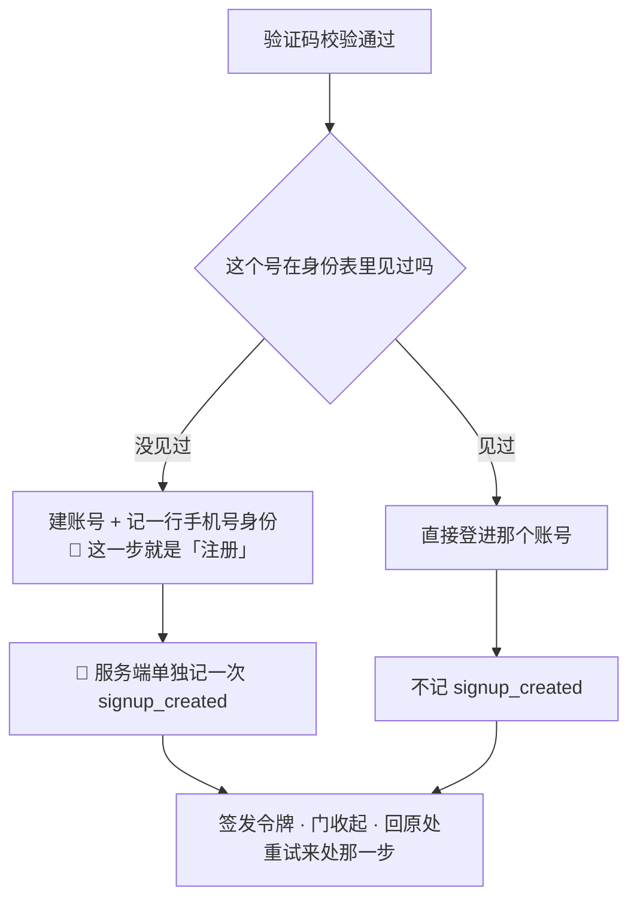
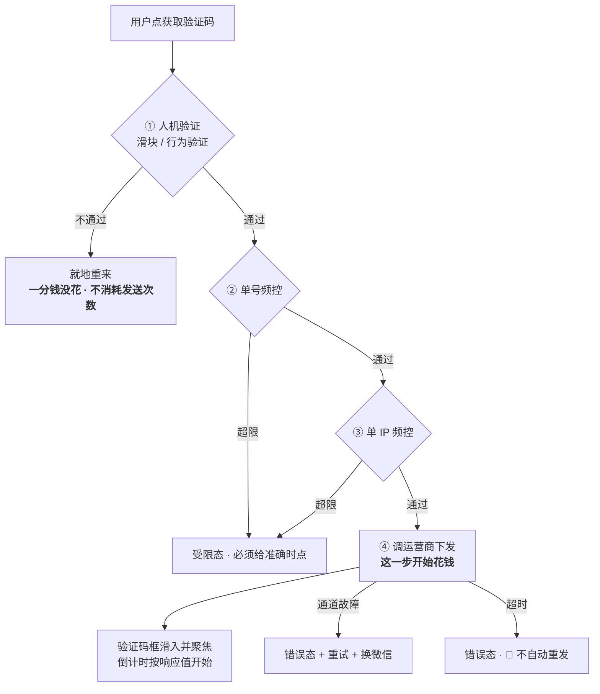
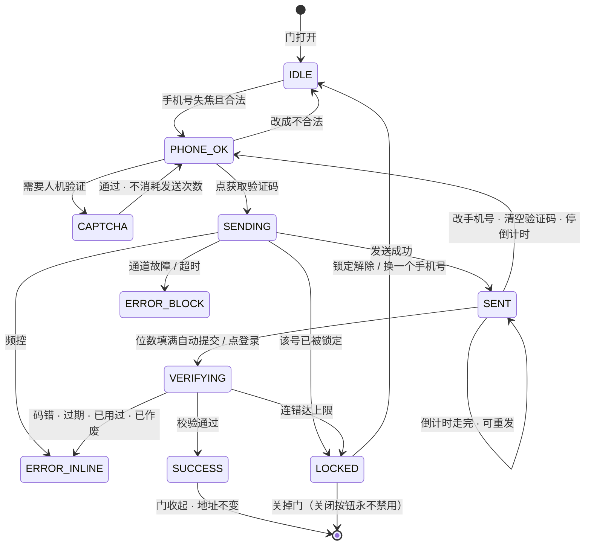

# U5.2 · 手机号验证码登录

> **基线**：`origin/v1` @ `73041df`，fetch 于 2026-09-02。
> **状态：活跃。** 四道闸的顺序变化、验证码四种终态合并或增删、「注册即登录」被推翻、频控口径的真源变化，本文同一次改动内更新。
> **上一层**：[M5 · 账号](INDEX.md)

---

## 一、这个子能力是什么、不是什么

**它是主通道，也是这个产品里唯一的跨端锚点。**

采集在一个端、复盘在另一个端，如果两端不是同一个账号，`盲区 = 骨架层 − 行为层` 会算出一个偏大的差集
（`后端系统设计与组件接入` §1.6）。手机号是那个把两端钉在一起的东西 —— 微信不是（见 `模块地图` §三 登记的 `U5.3`）。

- **它不是「注册」。** 契约里没有注册端点，以后也不会有。校验通过的那一刻，**号码没见过就建号、见过就登进去**。
- **它没有密码。** 没有注册按钮、没有忘记密码、没有邮箱。理由不是少一个页面，
  是**少一个「我到底注册过没有」的犹豫** —— 而这个犹豫恰好发生在用户离开成本最低的那一秒。
- **它不是免费的。** 每一条短信都是真金白银的外部账单，而且它是整条链路上
  **唯一一处「还没有账号的人就能让你花钱」的地方**（§2.2）。

**这一单元独有的三个决策**：注册即登录的埋点后果（§2.1）、四道闸的顺序（§2.2）、
四种终态必须是四句不同的话（§2.4）。

---

## 二、详细产品逻辑

### 2.1 注册即登录：界面上没有它，判据却要数它

🔴 **界面上没有「注册」二字，但服务端必须能把「建号」这一支单独数出来。**
阶段 3 的判据是「累计陌生注册数」，只统计登录成功次数的话，那个数里混着老用户
（`后端系统设计与组件接入` §1.7、`R-55`）。

**这不是埋点偏好，是判据能不能被算出来的问题。** 本单元是全域唯一产生这个数的地方（域索引 §三）。

### 2.2 发码的四道闸：顺序就是它的全部

**人机验证必须在第 ① 道，不能挪到校验那一步。** 纯计数频控挡不住换 IP 刷短信费 ——
换一批 IP、换一批号，两条计数都不触发，而钱已经花掉了。**拦要拦在花钱那一步之前**
（`后端系统设计与组件接入` §1.8、`技术架构与接口契约` §6.1）。

**产品侧对这道闸的三条要求：**

| # | 要求 | 为什么 |
|---|---|---|
| 1 | 人机验证按**本端计次**提前挡一道，但**服务端说了算** —— 服务端要求时前端必须听 | 前端只是提前挡，不是判定者 |
| 2 | 人机验证失败**不消耗发送次数**（服务端与本端计数都不增加） | 那不是用户的错 |
| 3 | 验证组件加载不出来时**不能把用户卡死**：给重试与换通道两条路 | 它是第三方脚本，不能让它决定用户能不能登录。Web 端还要考虑它被拦截插件屏蔽 |

🔴 **额度不管这件事。** 短信是按次外部账单，但对它计费等于对注册计费 ——
**频控解决薅羊毛，额度解决成本分摊，两者不能互相替代**（`商业化与额度设计` §3.2、`R-43`）。

### 2.3 发码频次与次数：一个数都不由前端算

| 项 | 口径 | 前端做错会怎样 |
|---|---|---|
| 重发间隔 | **服务端返回值为准** | 前端自己算的倒计时，杀进程重进就归零，等于没有频控 |
| 倒计时跨进程 | 存终点时刻，回前台**按墙钟重算**剩余 | 从暂停处继续倒，等于送用户一段免费时间 |
| 验证码位数 | **按响应里的位数渲染格子** | 写死位数，短信模板一改界面就错 |
| 频控与锁定的时点 | 响应里带**准确时点** | 给一句含糊的「稍后」只惩罚真实用户 |
| 发码超时 | 🔴 **不自动重试** | 请求可能已经到了服务端并真发了短信。自动重试 = 双倍账单 + 双倍频控消耗 |
| 同号重发 | 新码发出，**旧码立即作废** | 不作废就出现两条同时有效的码 |

⚠️ **一处口径分叉要记住**：频控的「日」与用户看到的「今天」**不是同一个键**（`R-81`）。
本单元不裁定它取哪个，只指出：两处用同一个词、指两件事，是最容易在跨零点时暴露的一类缺陷。

### 2.4 四种终态，四句不同的话

**这是从后端抄下来的一条约束，界面上不许把它压扁**（`后端系统设计与组件接入` §1.8）：

| 终态 | 这句话必须说清哪件事 | 说成同一句的后果 |
|---|---|---|
| 输错 | 还能试几次 → 用户继续重输 | —— |
| 已过期 | 这条码不能用了，**要重发** | 用户拿着过期的码反复输，把自己输到锁定 |
| 已作废（同号发了新的） | 有一条更新的码，**用新的那条** | 同上 |
| 频控 / 锁定 | 到**哪个时点**才能再试 | 含糊的说法只惩罚真实用户 |

**四句话对应四个不同的用户动作**，合并成一句就等于让用户在四种处境里做同一件不对的事。

**输入侧的两条配套约束：**
- 输错时**清空验证码框、保持聚焦、手机号不清空** —— 手机号在异常里被清空，是这一屏最容易犯也最招人烦的错
- 手机号**失焦时**才校验，输入过程中不报错；只做位数与首位判断，**不做运营商号段校验**（号段会变，判错的代价比放过大）

### 2.5 状态转移

**态名取自 `登录与账号` §2.4，一个都不新起。**

**两条线不能动：**
1. `CAPTCHA --> PHONE_OK` 标着「不消耗发送次数」
2. **每一个态都有回到关掉的路**，包括 `LOCKED` —— 没有任何一个态把用户堵死

⚠️ `SENDING` 期间**不禁用**手机号框、关闭按钮、微信入口。转圈期间把整屏锁住，用户唯一能做的就是等。
`VERIFYING` 期间允许关掉门，请求照常跑完：成功给一条提示，失败什么都不弹。

### 2.6 协议勾选

| 规则 | 说明 |
|---|---|
| 默认状态 | **不勾选**。不做「继续即代表同意」的隐式勾选 |
| 未勾就提交 | 页内提示 + 协议行动一下，🔴 **不发请求**。动效不是唯一提示 —— 对读屏器用户等于没有 |
| 勾选后 | 本机记住，同一账号下次不再要求重勾，**直到协议版本变化** |
| 协议正文拉不到 | 给错误与重试，🔴 **不允许「拉不到就当同意」** |

---

## 三、前端行为意图 × 后端契约意图

| 场景 | 前端行为意图 | 后端契约意图 |
|---|---|---|
| 手机号校验 | 失焦才校验；只判位数与首位；粘贴时先剥格式再截断 | 不涉及 —— 这一步不产生请求 |
| 发验证码 | 本端提前挡人机验证；发出后倒计时与格子数**全部从响应取** | `/auth/sms/send` 失败要能区分**频控 / 需人机验证 / 通道故障 / 通道未开通**四档；成功要带**重发间隔**与**验证码位数** |
| 频控与锁定 | 受限态里给出准确时点，并给另一条通道 | 频控 / 锁定类响应必须带**准确时点**，不是「稍后」 |
| 校验并登录 | 未勾协议不发请求；填满自动提交，主按钮也留着 | `/auth/sms/verify` 失败要能区分**码错 / 已过期 / 已用过 / 已作废 / 已锁定**五档；码错带**剩余次数**，锁定带**解锁时点** |
| 建号与登录的区分 | 前端**不需要知道**是哪一支 —— 界面上没有「注册」 | 🔴 成功响应要能让服务端把**建号那一支**单独记一次；这是阶段 3 判据的唯一来源 |
| 短信通道未开通 | 受限态 + 引导换通道 | **由服务端决定**；前端不因为环境不同而改行为 |
| 协议版本 | 版本变了把勾选回到未勾，并说明一次 | 需要给出**当前版本号**与正文地址；🚧 端点待技术定稿（`L-8`）。**拉不到时不许当作已同意** |

🔴 **界面上出现的每一个数字都必须在某个响应里有对应字段。前端不算、不猜、不兜底成 0。**

---

## 四、边界与红线在这里的具体形态

| 红线 | 在本单元的形态 |
|---|---|
| **不判断对错** | 本屏的数字只有：剩余次数、倒计时、时点。没有一个是评价 |
| **不存题干** | 两个可输入元素，各有字符白名单与位数上限。**不留第三个输入框** |
| **不做学科教研** | ➖ 不涉及 —— 这一屏只处理身份 |
| **没有第四种反馈形态** | 短信自动填充失败时**不提示**：一个没成功的便利不该变成一条错误。剪贴板只在用户主动点粘贴时读，读不到才提示一次 |
| **不做提醒与激励** | 不申请推送权限；倒计时不逐秒播报（读屏器要节流），最后几秒不再播报 |
| **只埋判据要的数** | 本单元只产生 `signup_created` 一个事件。**发码次数、发码失败率、登录漏斗、通道占比一概不埋** —— 它们是运维指标或行为分析，服务不了任何一条已定判据 |

---

## 五、缺口登记

| 缺口 | 缺的是哪一半 | 该谁定 |
|---|---|---|
| `L-6` 验证码位数与短信模板文案 | 外部流程缺：签名与模板报备需主体资质，尚未报备。**所以本单元写成「按响应位数渲染」** —— 定不下来也不挡实现 | 待报备 |
| `L-7` 非中国大陆号码 / 国际区号支持不支持 | 产品缺：短信模板、频控口径、「日」的时区三处都按大陆号设计，改一处要连着改三处。**现在按不支持写** | 由人拍板 |
| `L-8` 协议版本更新后的重新同意流程与端点 | 两半都缺 | 🚧 待技术定稿 + 待律师稿 |
| `L-2` 封禁状态存不存在 | 产品缺：界面已画，但「什么情况下封一个账号」从没定过。**定不下来就把那半个界面一起删掉**，不留半个 | 由人拍板 |
| `L-12` 「快捷再登录」（生物识别）做不做 | 不挡任何事。本产品没有密码，生物识别没有可解锁的对象；真做是一个新的安全面 | 由人拍板 |

⚠️ **一处本单元观察到、真源未登记的空白**：频控的「日」与用户看到的「今天」用的不是同一个时区键（`R-81`），
而受限态的文案里要给「明天再试」这类跨日说法。两个键在跨零点时会给出不同的答案。
本单元不替它拍板，只指出：这一格牵动的是**用户会不会觉得产品在骗他**，不只是一个配置项。
