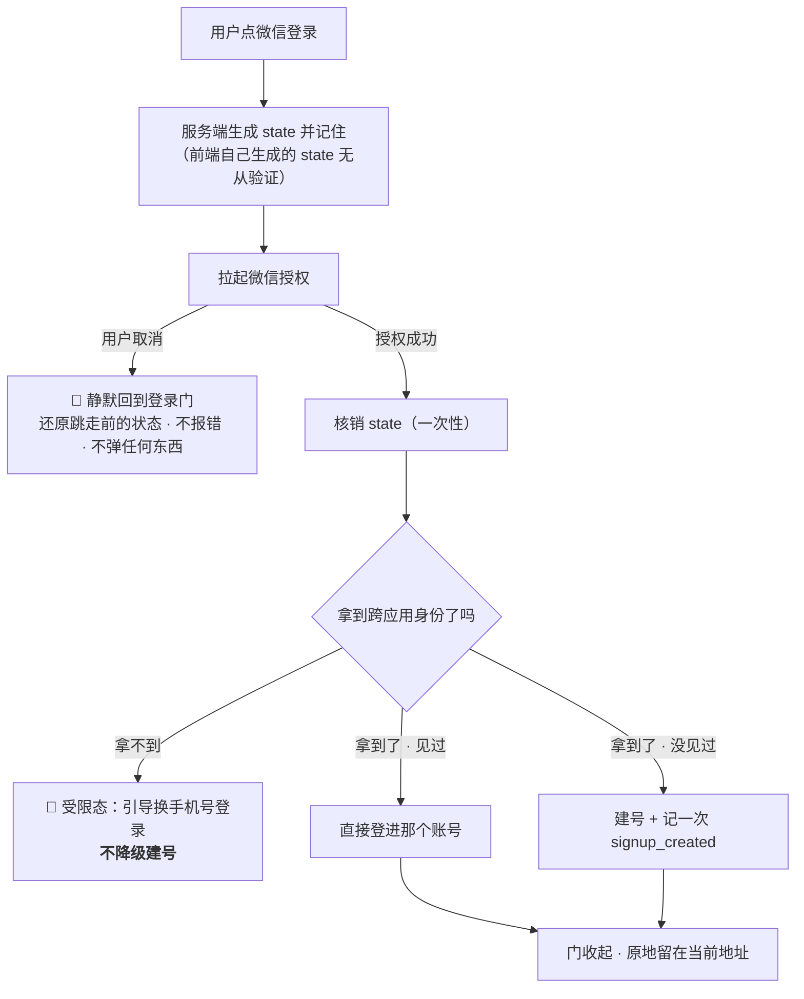

# U5.3 · 微信授权登录

> **基线**：`origin/v1` @ `73041df`，fetch 于 2026-09-02。
> **状态：活跃。** 微信入口数量变化、「微信不是跨端锚点」这条结论被推翻、拿不到 unionid 时的处置变化，本文同一次改动内更新。
> **上一层**：[M5 · 账号](INDEX.md)

---

## 一、这个子能力是什么、不是什么

**它是副通道：一条更快进门的路，不是另一份身份。**

微信通道**不带任何前提，它就是有的**（2026-09-02 用户裁定：按完整 App 做）。
界面上唯一会让它不出现的是两种运行时事实：本端不支持微信，或通道尚未配置开通（§2.6）。

- 🔴 **它不是跨端锚点。** 这是本单元的核心结论，展开在 §2.2。
- **它不是一条通道，是三条。** 小程序、已认证服务号 H5、PC 扫码 —— 三个不同的应用、三套凭据、三笔认证费
  （`后端系统设计与组件接入` §6.1）。产品侧只关心一件事：**这三条在界面上是同一个按钮**，分支在服务端。
- **它不带来任何画像。** 昵称与头像服务端**一概丢弃**，库里没有的东西界面上显示不出来 ——
  只绑了微信时，账号屏上给出的是**绑定这个事实本身**，不是一个名字。

**这一单元独有的两个决策**：为什么它当不了锚点（§2.2）、拿不到 unionid 时为什么宁可拒绝也不建号（§2.3）。

---

## 二、详细产品逻辑

### 2.1 三条入口，一个按钮

| 入口 | 哪个端会走到 | 产品侧要额外承担什么 |
|---|---|---|
| 小程序 | 微信小程序 | 无跳转，端内直接拿到凭据 |
| 已认证服务号 H5 | 微信内打开的 H5 | **整页跳走再跳回** —— 门所在的页面被卸载了，还原责任在 §2.5 |
| PC 扫码 | Web 桌面浏览器 | 🚧 需开放平台的网站应用审核，审核通过前**不在界面上出现**（`L-14`） |

**用户看到的永远是同一个按钮。** 端差异是能力差异，不是文案差异 ——
文案照着能力写，不反过来（`多端选型与端矩阵` §五 同一条规矩）。

### 2.2 🔴 为什么微信不是跨端锚点

**先把两个「锚点」拆开，它们常被混为一谈：**

| 说的是什么 | 是什么 | 归谁 |
|---|---|---|
| **库里的账号锚点** | 账号标识本身。手机号和微信各自只是身份表里的一行（`技术架构与接口契约` §7.1） | 技术侧 |
| **产品侧的跨端锚点** | **用户换一台设备时，他手上那个能把记录取回来的东西** | 本单元说的是这个 |

**微信当不了第二种，四条理由，每一条单独成立：**

| # | 理由 | 后果 |
|---|---|---|
| 1 | **微信登录之后的账号形态是「已登录 · 未绑手机」** | 这个人此刻只有一条身份。他换个入口进来就可能又多一个账号 —— 而两个账号意味着行为层被拆两半，差集偏大 |
| 2 | **它在某些端上根本不存在** | 桌面壳不渲染微信入口，微信外的 H5 也不渲染。**一个在部分端上不存在的通道，定义上就当不了「跨端」的那个东西** |
| 3 | **它的跨端识别依赖一次外部控制台配置** | 拿不到 unionid 时这个人就认不出来。锚点不能依赖一个「某天会被补上」的开关（§2.3） |
| 4 | **微信会被借用登录** | 这也是自动合并被禁止的理由之一：把两个人的记录并到一起，会让覆盖度彻底失真，而那个指标就是整个产品 |

**所以产品侧的处置只有一条：** 只绑了微信时，账号屏顶部给**一行弱提示**说明绑手机号的好处。
🔴 **不弹窗、不拦路、不每次都提** —— 它是一条建议，不是一道关口。补绑是最顺的那条路径，
它比事后走合并便宜得多，而合并是不可逆的、要二次确认的、会出错的那一条。

### 2.3 拿不到 unionid：拒绝降级建号

**为什么宁可拒绝也不建号：** 拿不到跨应用身份的唯一原因是应用没绑到开放平台，而这是一次控制台配置，
**它会在某天被补上**。补上之后同一个人再登录，就会被当成一个新人 ——
**用户什么都没做错，记录却被拆成两半**（`后端系统设计与组件接入` §6.3 §6.4）。

**这一档是配置没做对，不是微信出了问题。** 两者对用户的意义完全不同：
前者用户等多久都不会好，后者过一会儿就好了。所以它必须是**可区分的一档**，不能混进通用的服务错误。

⚠️ **同一个人从任何一个微信入口进来都必须被认出是同一个人。** 认不出时宁可拒绝，
也不许建第二个账号 —— 这是产品对这条通道的唯一硬要求，**怎么实现由技术侧定**。

### 2.4 授权之后的账号形态

| 规则 | 说明 |
|---|---|
| 账号形态 | 「已登录 · 未绑手机」。它是一个完整可用的账号，**只是还不是跨端锚点** |
| 弱提示 | 账号屏顶部一行，可点进去补绑。**不弹窗、不拦路、不每次都提** |
| 昵称与头像 | 服务端**一概丢弃**。账号屏上不显示微信昵称与头像 |
| 取消授权 | 静默回门，**不报错** —— 用户取消不是错误 |
| 绑定撞号 | 这个微信已属于另一个账号时转合并（见 `模块地图` §三 登记的 `U5.4`） |

### 2.5 H5 整页跳转的还原责任

**这条是 H5 独有的**，小程序与 App 都没有：整页跳走意味着门所在的那个页面被卸载了。

| 要还原什么 | 还原不了时 |
|---|---|
| 门是从哪个 `route id` 上打开的 | 回首页，门不再自动打开 |
| 副标题该说哪一句 | 用通用句 |
| 已输入的手机号 | 空着，**不报错** |
| 「登录成功后要自动重试的那一步」 | **不自动重试**，用户手动再点一次 |

🔴 **还原失败不许表现为一次错误。** 用户刚授权完，看到一条错误提示只会以为登录失败了 ——
**而他其实已经登录成功了**。这一格是本单元最容易被实现写反的地方。

⚠️ 跳走前**状态必须已经落盘**，否则「慢」和「丢」是同一件事。授权返回时 App 已被系统回收也走同一套还原。

### 2.6 入口什么时候不渲染

| 运行时事实 | 界面 | 为什么不做灰按钮 |
|---|---|---|
| 本端不支持微信（未安装 / 版本过低 / 微信外的 H5 / 桌面壳） | **不渲染** | 一个灰按钮会让用户以为「我这儿坏了」 |
| 通道尚未配置开通 | **不渲染** | 同上。服务端要回一个「端点存在、只是没开」的档，**不是 404** |

🔴 **凡是别处的文案里出现「换微信登录」这条退路，前提是本端真的有微信入口。**
端不支持时那句话要换成另一条退路 —— 否则产品在指一条不存在的路。

---

## 三、前端行为意图 × 后端契约意图

| 场景 | 前端行为意图 | 后端契约意图 |
|---|---|---|
| 取授权地址 | 不自己生成 `state`；拿到后按入口决定是跳转还是原地 | `state` **由服务端生成并记住** —— 前端自己生成的无从验证；响应要带入口标识 |
| 跳走前 | **先落盘门的状态**再拉起授权 | 不涉及 |
| 用户取消 | 静默回门并还原，**不报错、不弹任何东西** | 不产生请求 |
| 授权回跳 | 用一次性凭据换令牌；回跳页被手动刷新时视为过期，让用户重来一次 | `state` 与授权码都是**一次性**的；重复提交要能被识别为过期，而不是未知错误 |
| 拿不到跨应用身份 | 受限态 + 引导换手机号，**不建号** | 必须是**可区分的一档**，且语义是「配置没做对」不是「微信挂了」 |
| 通道未开通 | 入口不渲染 | 端点存在，返回「未开通」这一档，**不是 404** |
| 凭据配错 | 错误态 + 引导换通道 | 服务端记一个**可告警的事实**，**不静默降级** |
| 绑定微信 | 与登录同一条链路，撞号转合并 | 撞号必须是可区分的一档，不能混进通用 4xx |
| 昵称头像 | 不取、不显示、不存 | **一概丢弃**。这是「不碰内容」在身份侧的延伸：产品只需要认出是同一个人，不需要知道他是谁 |

---

## 四、边界与红线在这里的具体形态

| 红线 | 在本单元的形态 |
|---|---|
| **不判断对错** | 本单元不产生任何数字，也不产生任何评价 |
| **不存题干与机构内容** | 微信通道**一个可输入元素都没有** —— 它是全域离题干最远的一条路径 |
| **不做学科教研** | ➖ 不涉及 |
| **原图不上云** | 微信授权不触碰任何图片；小程序端根本没有原图，账号屏上不出现任何原图字样 |
| **没有第四种反馈形态** | 只绑微信时给的是**一行弱提示**，不是弹窗、不是小红点、不是每次都提 |
| **不做提醒与激励** | 不申请推送权限；用户取消授权不追问、不二次引导 |
| **只埋判据要的数** | 微信走建号分支时同样记 `signup_created`。**通道占比不埋** —— 它很想被知道，但服务不了任何一条已定判据 |

---

## 五、缺口登记

| 缺口 | 缺的是哪一半 | 该谁定 |
|---|---|---|
| `L-14` PC 扫码登录做不做 | 外部流程缺：需开放平台的网站应用审核（一笔额外费用）。桌面壳现在根本不渲染微信入口，桌面用户走手机号即可 | 由人拍板 |
| `L-15` 小程序的一键手机号用不用 | 产品缺：它能在同一次交互里给出两条身份，让「账号被拆两半」根本没有发生的机会；但它是**按次外部账单**，必须同样受频控与人机验证管 | 由人拍板 |
| `L-1` Apple 登录做不做 | 由上架决定，不由登录设计决定。设计上要预留第四个通道的位置，但**现在不画** | 由人拍板 |
| `L-11` 两个通道时能不能解绑其中一个 | 契约缺：没有解绑端点。**现在按「不提供解绑」写**，入口不渲染 | 由人拍板 |

⚠️ **一处本单元观察到、真源已登记但结论会回弹的地方**：微信通道的真实前置是 ICP 备案与已认证服务号，
不是任何一个阶段（`技术架构与接口契约` §7.2 的加注）。**备案没下来这条通道就打不通** ——
这是客观依赖，不是功能裁剪。本单元不排它的先后，只指出：`U5.2` 的主通道地位在备案期间是**唯一可用通道**，
而这一点会同时放大 `L-6` 短信模板报备那条缺口的后果。
