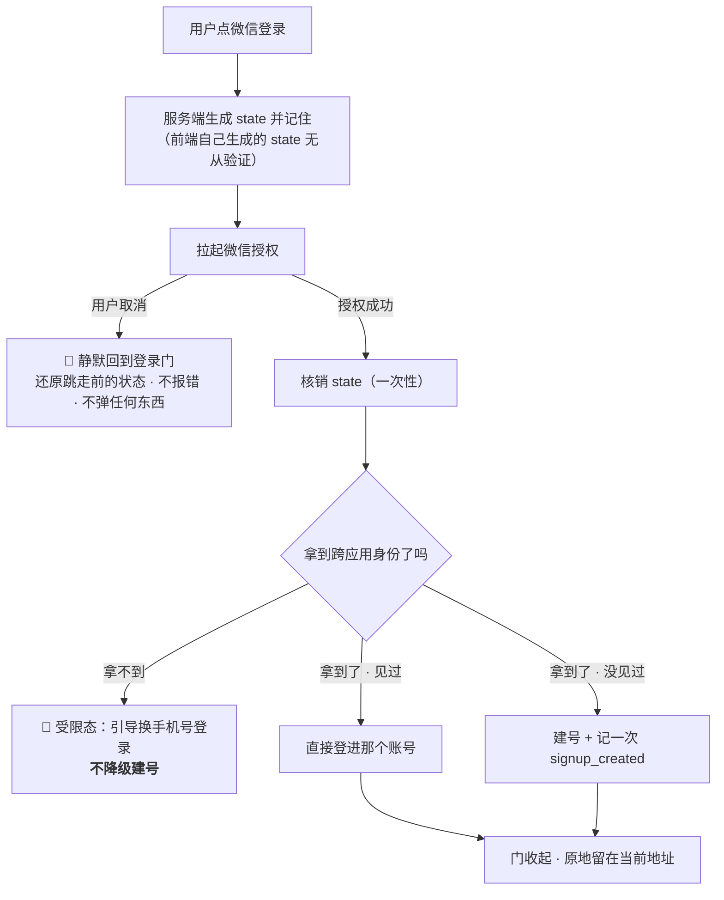
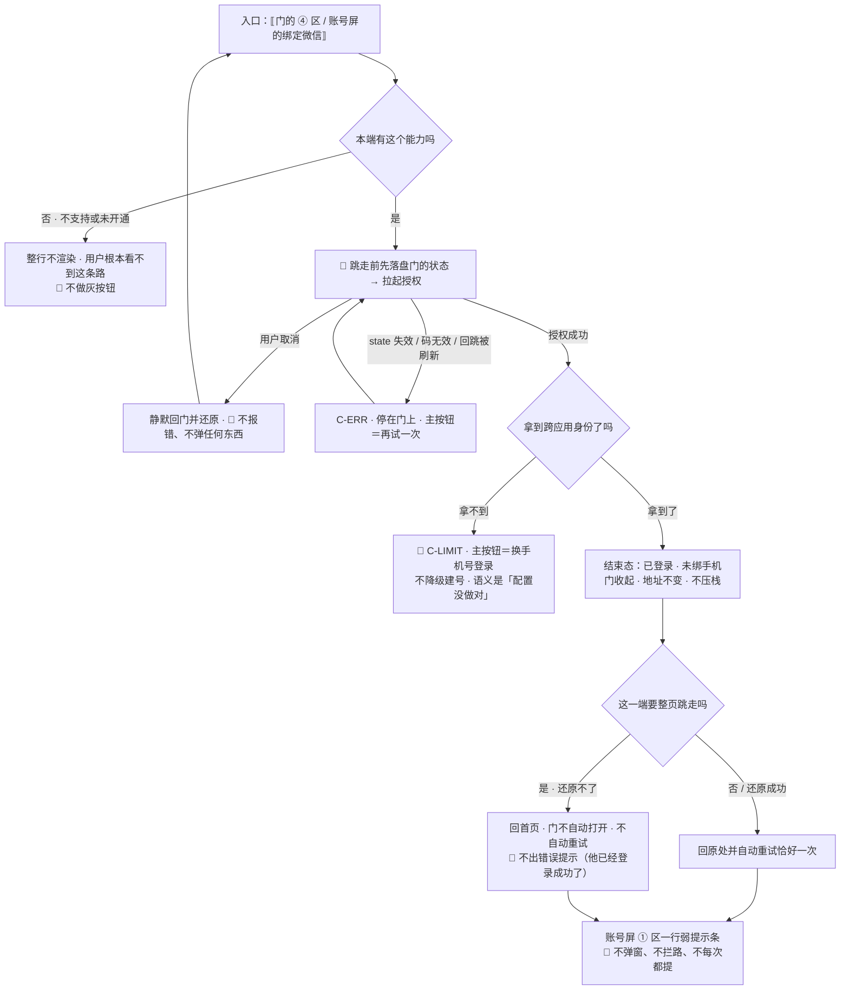

# U5.3 · 微信授权登录

> **基线**：`origin/v1` @ `73041df`，fetch 于 2026-09-02。
> **状态：活跃。** 微信入口数量变化、「微信不是跨端锚点」这条结论被推翻、拿不到 unionid 时的处置变化，本文同一次改动内更新。
> **上一层**：[M5 · 账号](INDEX.md)

---

## 一、这个子能力是什么、不是什么

**它是副通道：一条更快进门的路，不是另一份身份。**

微信通道**不带任何前提，它就是有的**（2026-09-02 用户裁定：按完整 App 做）。
界面上唯一会让它不出现的是两种运行时事实：本端不支持微信，或通道尚未配置开通（§2.6）。

- 🔴 **它不是跨端锚点。** 这是本单元的核心结论，展开在 §2.2。
- **它不是一条通道，是三条。** 小程序、已认证服务号 H5、PC 扫码 —— 三个不同的应用、三套凭据、三笔认证费
  （`后端系统设计与组件接入` §6.1）。产品侧只关心一件事：**这三条在界面上是同一个按钮**，分支在服务端。
- **它不带来任何画像。** 昵称与头像服务端**一概丢弃**，库里没有的东西界面上显示不出来 ——
  只绑了微信时，账号屏上给出的是**绑定这个事实本身**，不是一个名字。

**这一单元独有的两个决策**：为什么它当不了锚点（§2.2）、拿不到 unionid 时为什么宁可拒绝也不建号（§2.3）。

---

## 二、详细产品逻辑

### 2.1 三条入口，一个按钮

| 入口 | 哪个端会走到 | 产品侧要额外承担什么 |
|---|---|---|
| 小程序 | 微信小程序 | 无跳转，端内直接拿到凭据 |
| 已认证服务号 H5 | 微信内打开的 H5 | **整页跳走再跳回** —— 门所在的页面被卸载了，还原责任在 §2.5 |
| PC 扫码 | Web 桌面浏览器 | 🚧 需开放平台的网站应用审核，审核通过前**不在界面上出现**（`L-14`） |

**用户看到的永远是同一个按钮。** 端差异是能力差异，不是文案差异 ——
文案照着能力写，不反过来（`多端选型与端矩阵` §五 同一条规矩）。

### 2.2 🔴 为什么微信不是跨端锚点

**先把两个「锚点」拆开，它们常被混为一谈：**

| 说的是什么 | 是什么 | 归谁 |
|---|---|---|
| **库里的账号锚点** | 账号标识本身。手机号和微信各自只是身份表里的一行（`技术架构与接口契约` §7.1） | 技术侧 |
| **产品侧的跨端锚点** | **用户换一台设备时，他手上那个能把记录取回来的东西** | 本单元说的是这个 |

**微信当不了第二种，四条理由，每一条单独成立：**

| # | 理由 | 后果 |
|---|---|---|
| 1 | **微信登录之后的账号形态是「已登录 · 未绑手机」** | 这个人此刻只有一条身份。他换个入口进来就可能又多一个账号 —— 而两个账号意味着行为层被拆两半，差集偏大 |
| 2 | **它在某些端上根本不存在** | 桌面壳不渲染微信入口，微信外的 H5 也不渲染。**一个在部分端上不存在的通道，定义上就当不了「跨端」的那个东西** |
| 3 | **它的跨端识别依赖一次外部控制台配置** | 拿不到 unionid 时这个人就认不出来。锚点不能依赖一个「某天会被补上」的开关（§2.3） |
| 4 | **微信会被借用登录** | 这也是自动合并被禁止的理由之一：把两个人的记录并到一起，会让覆盖度彻底失真，而那个指标就是整个产品 |

**所以产品侧的处置只有一条：** 只绑了微信时，账号屏顶部给**一行弱提示**说明绑手机号的好处。
🔴 **不弹窗、不拦路、不每次都提** —— 它是一条建议，不是一道关口。补绑是最顺的那条路径，
它比事后走合并便宜得多，而合并是不可逆的、要二次确认的、会出错的那一条。

### 2.3 拿不到 unionid：拒绝降级建号



**为什么宁可拒绝也不建号：** 拿不到跨应用身份的唯一原因是应用没绑到开放平台，而这是一次控制台配置，
**它会在某天被补上**。补上之后同一个人再登录，就会被当成一个新人 ——
**用户什么都没做错，记录却被拆成两半**（`后端系统设计与组件接入` §6.3 §6.4）。

**这一档是配置没做对，不是微信出了问题。** 两者对用户的意义完全不同：
前者用户等多久都不会好，后者过一会儿就好了。所以它必须是**可区分的一档**，不能混进通用的服务错误。

⚠️ **同一个人从任何一个微信入口进来都必须被认出是同一个人。** 认不出时宁可拒绝，
也不许建第二个账号 —— 这是产品对这条通道的唯一硬要求，**怎么实现由技术侧定**。

### 2.4 授权之后的账号形态

| 规则 | 说明 |
|---|---|
| 账号形态 | 「已登录 · 未绑手机」。它是一个完整可用的账号，**只是还不是跨端锚点** |
| 弱提示 | 账号屏顶部一行，可点进去补绑。**不弹窗、不拦路、不每次都提** |
| 昵称与头像 | 服务端**一概丢弃**。账号屏上不显示微信昵称与头像 |
| 取消授权 | 静默回门，**不报错** —— 用户取消不是错误 |
| 绑定撞号 | 这个微信已属于另一个账号时转合并（见 `模块地图` §三 登记的 `U5.4`） |

### 2.5 H5 整页跳转的还原责任

**这条是 H5 独有的**，小程序与 App 都没有：整页跳走意味着门所在的那个页面被卸载了。

| 要还原什么 | 还原不了时 |
|---|---|
| 门是从哪个 `route id` 上打开的 | 回首页，门不再自动打开 |
| 副标题该说哪一句 | 用通用句 |
| 已输入的手机号 | 空着，**不报错** |
| 「登录成功后要自动重试的那一步」 | **不自动重试**，用户手动再点一次 |

🔴 **还原失败不许表现为一次错误。** 用户刚授权完，看到一条错误提示只会以为登录失败了 ——
**而他其实已经登录成功了**。这一格是本单元最容易被实现写反的地方。

⚠️ 跳走前**状态必须已经落盘**，否则「慢」和「丢」是同一件事。授权返回时 App 已被系统回收也走同一套还原。

### 2.6 入口什么时候不渲染

| 运行时事实 | 界面 | 为什么不做灰按钮 |
|---|---|---|
| 本端不支持微信（未安装 / 版本过低 / 微信外的 H5 / 桌面壳） | **不渲染** | 一个灰按钮会让用户以为「我这儿坏了」 |
| 通道尚未配置开通 | **不渲染** | 同上。服务端要回一个「端点存在、只是没开」的档，**不是 404** |

🔴 **凡是别处的文案里出现「换微信登录」这条退路，前提是本端真的有微信入口。**
端不支持时那句话要换成另一条退路 —— 否则产品在指一条不存在的路。

---

## 三、前端行为意图 × 后端契约意图

| 场景 | 前端行为意图 | 后端契约意图 |
|---|---|---|
| 取授权地址 | 不自己生成 `state`；拿到后按入口决定是跳转还是原地 | `state` **由服务端生成并记住** —— 前端自己生成的无从验证；响应要带入口标识 |
| 跳走前 | **先落盘门的状态**再拉起授权 | 不涉及 |
| 用户取消 | 静默回门并还原，**不报错、不弹任何东西** | 不产生请求 |
| 授权回跳 | 用一次性凭据换令牌；回跳页被手动刷新时视为过期，让用户重来一次 | `state` 与授权码都是**一次性**的；重复提交要能被识别为过期，而不是未知错误 |
| 拿不到跨应用身份 | 受限态 + 引导换手机号，**不建号** | 必须是**可区分的一档**，且语义是「配置没做对」不是「微信挂了」 |
| 通道未开通 | 入口不渲染 | 端点存在，返回「未开通」这一档，**不是 404** |
| 凭据配错 | 错误态 + 引导换通道 | 服务端记一个**可告警的事实**，**不静默降级** |
| 绑定微信 | 与登录同一条链路，撞号转合并 | 撞号必须是可区分的一档，不能混进通用 4xx |
| 昵称头像 | 不取、不显示、不存 | **一概丢弃**。这是「不碰内容」在身份侧的延伸：产品只需要认出是同一个人，不需要知道他是谁 |

---

## 四、边界与红线在这里的具体形态

| 红线 | 在本单元的形态 |
|---|---|
| **不判断对错** | 本单元不产生任何数字，也不产生任何评价 |
| **不存题干与机构内容** | 微信通道**一个可输入元素都没有** —— 它是全域离题干最远的一条路径 |
| **不做学科教研** | ➖ 不涉及 |
| **原图不上云** | 微信授权不触碰任何图片；小程序端根本没有原图，账号屏上不出现任何原图字样 |
| **没有第四种反馈形态** | 只绑微信时给的是**一行弱提示**，不是弹窗、不是小红点、不是每次都提 |
| **不做提醒与激励** | 不申请推送权限；用户取消授权不追问、不二次引导 |
| **只埋判据要的数** | 微信走建号分支时同样记 `signup_created`。**通道占比不埋** —— 它很想被知道，但服务不了任何一条已定判据 |

---

## 五、缺口登记

| 缺口 | 缺的是哪一半 | 该谁定 |
|---|---|---|
| `L-14` PC 扫码登录做不做 | 外部流程缺：需开放平台的网站应用审核（一笔额外费用）。桌面壳现在根本不渲染微信入口，桌面用户走手机号即可 | 由人拍板 |
| `L-15` 小程序的一键手机号用不用 | 产品缺：它能在同一次交互里给出两条身份，让「账号被拆两半」根本没有发生的机会；但它是**按次外部账单**，必须同样受频控与人机验证管 | 由人拍板 |
| `L-1` Apple 登录做不做 | 由上架决定，不由登录设计决定。设计上要预留第四个通道的位置，但**现在不画** | 由人拍板 |
| `L-11` 两个通道时能不能解绑其中一个 | 契约缺：没有解绑端点。**现在按「不提供解绑」写**，入口不渲染 | 由人拍板 |

⚠️ **一处本单元观察到、真源已登记但结论会回弹的地方**：微信通道的真实前置是 ICP 备案与已认证服务号，
不是任何一个阶段（`技术架构与接口契约` §7.2 的加注）。**备案没下来这条通道就打不通** ——
这是客观依赖，不是功能裁剪。本单元不排它的先后，只指出：备案期间**手机号是唯一可用通道**，
而这一点会同时放大 `L-6` 短信模板报备那条缺口的后果。

---

## 六、线框

> 记号与屏宽照 `线框与交互规格约定` §三（40 个半角字符），组件只引锚不抄规格。
> 本单元画两处：门上的**其他通道区**，以及「微信不是跨端锚点」在**账号屏**上的那一格后果。
> 门这个容器与手机号输入区各自在本域另外两份单元（清单见域索引 §四）。

### 6.1 常态整屏

```
┌─ 门 · 未登录 ──────────────────────────┐
│ ‹ × 关闭 ›     ← 永不禁用          ※1  │
│ ⟦标题 · 副标题⟧                        │
│ ② ③ ⟦手机号输入区与动作区⟧ 见域索引 §四│
├────────────────────────────────────────┤
│ ④ 其他通道区                           │
│  ⟦分隔线 · 或者⟧                       │
│  [ 微信登录 ]  ← C-BTN 次 · 一个   ※2  │
│  🔴 不渲染的两种运行时事实见 ※3        │
└────────────────────────────────────────┘
┌─ 账号屏 · 只绑了微信 ──────────────────┐
│ ‹ ← 返回 ›  ⟦屏标题⟧      ← P-NAV      │
│ ① 身份区                               │
│  ⟦已绑定微信 · 这个事实本身⟧       ※4  │
│  ⟦弱提示条 → 登录与账号 §4.2⟧      ※5  │
│ ② ⟦绑定手机号 ›⟧                       │
│ ③④⑤⑥ ⟦同域内账号屏常态⟧                │
└────────────────────────────────────────┘
```

※1 授权要整页跳走的端，🔴 **跳走前门的状态必须已经落盘**，否则「慢」和「丢」是同一件事（§2.5）　※2 🔴 **三条入口在界面上是同一个按钮**，分支在服务端；用户看到的不是三种说法（§2.1）
※3 本端不支持微信、或通道尚未配置开通 → **整行不渲染**，不做灰按钮 —— 灰按钮会让用户以为「我这儿坏了」（§2.6）
※4 🔴 **昵称与头像一概不取、不显示、不存** —— 库里没有的东西界面上显示不出来（§2.4）
※5 🔴 **一行弱提示条，不弹窗、不拦路、不每次都提**。这是「微信不是跨端锚点」在界面上的**全部**处置 —— 它是一条建议，不是一道关口（§2.2）

### 6.2 其余各态：只画变化区

```
│ 骨架 C-SKEL · 授权回跳换令牌那一段  ※6 │
│  ⟦··· 占位⟧  ‹ × 关闭 › 仍在           │
├────────────────────────────────────────┤
│ 空态 C-EMPTY：⟦不存在⟧             ※7  │
├────────────────────────────────────────┤
│ 错误态 C-ERR · ④ 区就地替换            │
│  ⟦哪一步没成 → 登录与账号 §八⟧         │
│  ( 再试一次 )  ‹ 换手机号登录 ›   ※8   │
├────────────────────────────────────────┤
│ 🔴 受限态 C-LIMIT · 拿不到跨应用身份 ※9│
│  ⟦这一条通道现在认不出你是谁⟧          │
│  (  换手机号登录  ) ← 主 · 唯一出路    │
│  🔴 这一档不建号，也不给「先建一个」   │
├────────────────────────────────────────┤
│ 受限态 · 通道未开通 → ④ 整区不渲染 ※3  │
├────────────────────────────────────────┤
│ 离线 C-OFFLINE 细条 · [微信登录] 禁用  │
├────────────────────────────────────────┤
│ H5 还原失败 · ⟦回首页 · 门不自动打开⟧  │
│  🔴 不出任何错误提示             ※10   │
```

※6 授权页本身在微信里，不是本产品的屏；本产品只在**回跳换令牌**这一段出骨架
※7 微信通道**一个可输入元素都没有**，也不返回任何列表 —— 没有会返回零结果的往返
※8 用户**取消授权不是错误**：静默回门、还原跳走前的状态，不报错、不弹任何东西（§2.3）。🔴 上面这几档只替换 ④ 区，门的 `‹ × 关闭 ›` 一格未动
※9 🔴 这一档的语义是**「配置没做对」不是「微信挂了」** —— 前者用户等多久都不会好。宁可拒绝也不降级建号，否则配置补上之后同一个人会被当成新人，记录被拆两半（§2.3）
※10 🔴 **还原失败不许表现为一次错误** —— 用户此刻**已经登录成功了**，一条错误提示只会让他以为登录失败。这是本单元最容易被实现写反的一格（§2.5）

### 6.3 红线自查十条，逐张数过

| # | 数这一样 | 本单元 |
|---|---|---|
| 1–2 | 正确率 / 得分 / 排名 / 讲解 / 学习建议 | 0：本单元不产生任何数字，也不产生任何评价 |
| 3–6 | 提醒 / 打卡 / 进度环 / 百分比 / 倒计时紧迫感 | 0：弱提示条**不是**小红点、不是气泡引导、不是每次弹一遍；不申请推送权限；取消授权不追问、不二次引导 |
| 7–8 | 能装下题干的格子、置信度 | 0：这条通道**一个可输入元素都没有** —— 它是全域离题干最远的一条路径；置信度 0 |
| 9–10 | 原图入口 / 三处必须出现的东西 | 0：授权不触碰任何图片，账号屏上不出现任何原图字样。三处落在 `模块地图` §三登记的 `U8.3` / `U8.4`，本单元不重画也不弱化 |

---

## 七、交互规格

### 7.1 必答五项

| # | 必答 | 本单元的答案 |
|---|---|---|
| 1 | **入口** | 门上的 ④ 其他通道区一个按钮（三条通道同一个按钮，分支在服务端）；账号屏 ② 的「绑定微信」走同一条链路。🔴 两处都**只在本端真有这个能力时渲染**，否则整行不出现 |
| 2 | **结束状态** | 身份态「已登录 · 未绑手机」（`登录与账号` §3.3）——**它是一个完整可用的账号，只是还不是跨端锚点**。🔴 身份态与主轨四态、`TS-00`–`TS-09` 是**两条不相干的轨**（真源 `模块地图` §四）。撞号时转合并（见 `模块地图` §三登记的 `U5.4`） |
| 3 | **失败落点** | 用户取消 → 静默回门并还原，**不是失败**；state 失效 / 授权码无效 / 回跳页被刷新 → 错误态，主按钮＝再试一次；凭据配错 → 错误态 + 换手机号，服务端另记一个**可告警的事实**，不静默降级；拿不到跨应用身份 → 受限态，唯一出路是换手机号 |
| 4 | **空态** | **成因为零，这一屏不存在空态** —— 通道要么整行不渲染，要么就有一个按钮，中间没有第三种 |
| 5 | **错误态** | 可重试：state 失效、授权码无效、回跳超时。不可重试：拿不到跨应用身份（换通道）、通道未开通（入口根本不渲染）、本端不支持（同上）。**没有陈旧数据态** —— 本单元不缓存任何服务端数据 |

### 7.2 受限态（按需追加项）

| 档 | 什么时候出现 | 主按钮 | 次入口 |
|---|---|---|---|
| 拿不到跨应用身份 | 应用没绑到开放平台 | 🔴 换手机号登录，**不建号** | 无 |
| 通道未开通 | 服务端说这一档 | 整行不渲染，用户看不到这条路 | 无 |
| 本端不支持微信 | 未安装 / 版本过低 / 微信外 H5 / 桌面壳 | 同上 | 无 |

🔴 **可断言的检查**：把跨应用身份关掉再走一次授权，**身份表里不许多出一个账号**；把通道置为未开通，门上**不许出现一个灰掉的微信按钮**。任一条不成立即为不合格。

### 7.3 交互流程



⚠️ **本单元不写任何端点。** ✅ 原 `[契约缺]` 一处**已于 2026-09-03 闭合**：`接口契约：签名与错误码全集` §7.2 `POST /auth/wechat/phone-login`（`L-15`）。界面需要后端能区分两档：**这次是否是一笔按次外部账单** —— 是的话它必须与手机号通道同受频控与人机验证管，否则频控口径在两条路上不一致。
