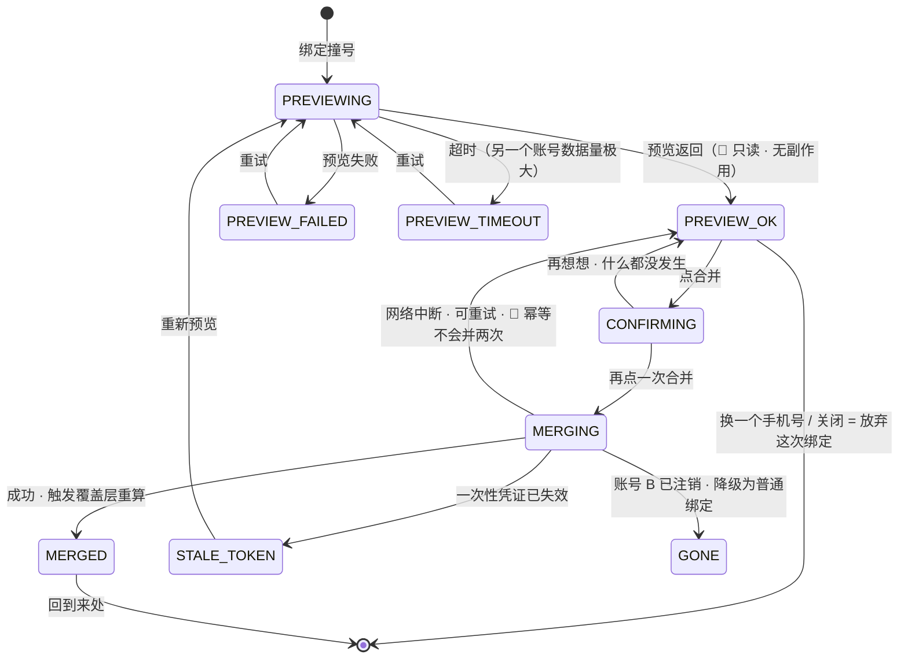
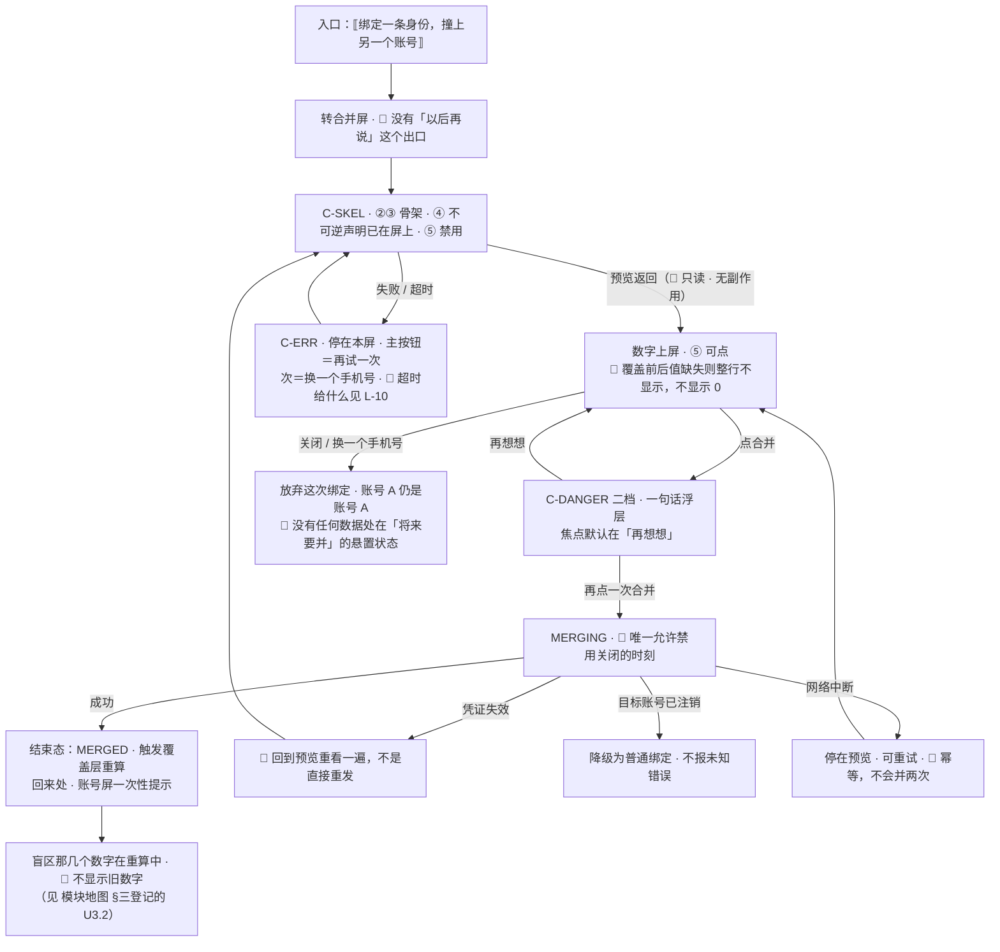

# U5.4 · 账号合并

> **基线**：`origin/v1` @ `73041df`，fetch 于 2026-09-02。
> **状态：活跃。** 「不给以后再说」这条被推翻、预览的只读性质变化、选边口径落定、不可逆性变化，本文同一次改动内更新。
> **上一层**：[M5 · 账号](INDEX.md)

---

## 一、这个子能力是什么、不是什么

**它是这个产品里唯一一处刻意不给退路的地方。**

**触发条件只有一种**：已登录的账号 A 去绑一条身份（手机号或微信），而这条身份已经属于账号 B。

- **它不是一个可以推迟的决定。** 界面上**没有「以后再说」这个出口**。
- **它不是自动的。** 自动合并可能把两个人的记录并到一起 —— 手机号会被运营商回收、微信会被借用登录。
- **它不是可逆的。** 没有拆分、没有回滚。
- **它不是一个数据挑选界面。** 预览只给计数，不给内容，也不让用户挑哪些记录并过来。

**这一单元独有的三个决策**：为什么这里反过来不给退路（§2.1）、预览为什么只给计数（§2.3）、
撞上两个账号时登进哪一个（§2.5）。

---

## 二、详细产品逻辑

### 2.1 为什么这里反过来不给退路

**产品在别处一律降低摩擦，这里不。**

「以后再说」的代价不是多一次点击，是**从这一刻起这个人的记录永久分成两份，而他自己不知道**。
等他发现的时候，看到的是一个偏大的差集 —— **而一次误报足以让他不再相信后面所有的差集**。

这是一次成本对比，不是一次风格选择：

| 选项 | 用户当场付出 | 用户之后付出 |
|---|---|---|
| 当场答一次（现在这样） | 多看一屏、多点一次 | 无 |
| 给「以后再说」 | 少一次点击 | 一份被拆两半、且**他不知道被拆过**的覆盖度 |

**放弃绑定与推迟决定不是一回事。** 关闭与「换一个手机号」都是**放弃这次绑定** ——
放弃之后账号 A 仍然是账号 A，**没有任何一份数据处在「将来要并」的悬置状态**。
悬置状态才是真正的代价，不是那一次点击。

### 2.2 两步：只读的预览，不可逆的确认



**四条不许违反的约束：**

| # | 约束 | 为什么 |
|---|---|---|
| 1 | **预览只读、无副作用** | 用户还没决定。一个有副作用的预览等于替他决定了一半 |
| 2 | **确认必须带预览发出的一次性凭证** | 凭证把「用户看到的那份数据」与「真正被合并的那份数据」钉在一起；数据变了凭证失效，用户重看一遍 |
| 3 | **不可逆声明独立成行、独立成段，且预览未回时它就已经在屏幕上** | 不可逆声明和数字混排，用户读的是数字 |
| 4 | **执行必须幂等** | 超时后用户会重试。重试并两次，用户的覆盖度会凭空翻倍 —— 那正是这个产品唯一的产出 |

⚠️ **合并执行中是全域唯一允许禁用关闭按钮的时刻。** 其余任何状态下关闭永不禁用。

### 2.3 预览这一屏上有什么、没有什么

| 有 | 为什么它够用 |
|---|---|
| 另一个账号里的**记录条数** | 「有没有、几次」 |
| **最早**与**最近**的时间 | 「多久前」。用绝对日期 —— 绝对日期不会因为看的时间不同而变 |
| 覆盖考点数的**前值与后值** | 用户唯一真正关心的后果：合并之后我的差集会变成什么样 |

| 没有 | 为什么不给 |
|---|---|
| 会并进来哪些记录的**清单** | 一条记录的摘要展开到极限就会开始接近内容，**而这个产品不碰内容** |
| **挑选**哪些记录并过来 | 挑选界面本身就是一次「按覆盖度调数据」的入口 —— 那等于产品发了一把改自己指标的钥匙 |
| 任何**对比、评价、形容词** | 只回答有没有、几次、多久前 |

🔴 **覆盖前后值拿不到时，那一行整行不显示，不显示 0。**
显示 0 会让用户以为合并会让覆盖度归零 —— 而他正要做一个不可逆的决定。
所以后端必须能让前端识别出「没有这个字段」，与「值是 0」是两件事。

### 2.4 撞上两个账号时登进哪一个

🔴 **产品口径（2026-09-02）：用哪个通道登录就登进哪个账号，不替用户选。**
（`用户价值与主流程` §5.1）

**这条口径覆盖的是常规路径**：用户用手机号登录就登进手机号那个账号，用微信登录就登进微信那个账号。
撞上另一条身份时**不自动合并**，走绑定 → 预览 → 确认这条路，由用户显式发起。

⚠️ **旧的那条选边理由已经失效，本单元不继承它。**
原来的规则依据是「微信登录必然更晚建号、更可能是个刚建的空号」，
而那条推理的前提是分期（手机号先、微信后）—— **2026-09-02 取消功能分期后，两条通道同属完整 App，
谁先建号由用户实际走的路径决定**（`后端系统设计与组件接入` §6.4 的加注）。
**前提没了，结论就不能继续引用。** 本单元既不继承旧理由，也不新拍一个替代规则。

**还剩一种情形，产品口径答不了，登记在 §五：** 一次登录里两条身份**同时**命中两个不同的账号
（例如同一次交互既给出微信身份又给出手机号）。此时「用哪个通道登录」本身没有唯一答案。
**选边规则属鉴权设计，由技术侧定**；产品只给一条硬约束：**无论登进哪一边，都不许自动合并**，
必须走用户显式发起的那条路。

### 2.5 明确不做的五件事

| 不做 | 为什么 |
|---|---|
| 自动合并 | 用户会失去对「我的数据在哪个账号里」的控制；而且手机号会被回收、微信会被借用，**自动合并可能把两个人的记录并到一起** |
| 拆分 / 回滚 | 拆分需要保留合并前快照 = 一份重复数据，而且**拆错比合错更难解释** |
| 让用户挑哪些记录 | 挑选界面就是一次「按覆盖度调数据」的入口 |
| 预览里展开记录内容 | 记录摘要展开到极限会开始接近内容 |
| 「以后再说」 | §2.1 |

### 2.6 合并之后

- **时间戳与来源名称原样保留**，不重排、不改写 —— 合并改的是归属，不是历史
- **触发覆盖层重算**。重算未完成时盲区屏显示重算中，🔴 **不显示旧数字**
- 重算期间用户**可以正常记录、正常导出**，只有盲区那几个数字处在重算中
- 回到账号屏时给一次提示说明并进来了多少条，**下次进入不再显示** —— 它是一次告知，不是一个状态

---

## 三、前端行为意图 × 后端契约意图

| 场景 | 前端行为意图 | 后端契约意图 |
|---|---|---|
| 绑定撞号 | 转合并屏，**不给「以后再说」这个出口** | 撞号必须是**可区分的一档**，不能混进通用 4xx —— 它是唯一一个要转屏的失败 |
| 预览 | 骨架立即出（它必然要跨网络）；数字未回时主按钮禁用，不可逆声明已在屏幕上 | **只读、无副作用**；返回条数、最早、最近、覆盖前后值与**一次性凭证** |
| 覆盖前后值缺失 | **整行不显示，不显示 0** | 必须能被识别为「没有这个字段」，而不是值为 0 |
| 二次确认 | 只有一句话的确认；「再想想」回到预览，**什么都没发生** | 不涉及 —— 二次确认不产生请求 |
| 执行 | 执行中禁用关闭与换号；中断后可重试 | 必须带预览的一次性凭证；**不可逆**、**幂等**、写合并留痕；失败要能区分**凭证失效 / 目标账号不存在 / 服务端错误**三档 |
| 凭证失效 | 让用户重新看一遍那份数据，而不是硬着头皮确认 | 凭证一次性且有期限；数据变了即失效 |
| 目标账号已注销 | 降级为**普通绑定**，不报未知错误 | 目标不存在要能被单独识别 |
| 两台设备同时发起 | 后到的那台走凭证失效 → 重新预览（此时通常已合并完） | **幂等，不会并两次** |
| 合并成功 | 触发覆盖层重算；重算中盲区不显示旧数字 | 返回并进来的条数，供那一次性提示使用 |

🔴 **界面上出现的每一个数字都必须在某个响应里有对应字段。前端不算、不猜、不兜底成 0。**

---

## 四、边界与红线在这里的具体形态

| 红线 | 在本单元的形态 |
|---|---|
| **不判断对错** | 合并屏上的数字只有：条数、最早时间、最近时间、覆盖前后值。**没有对比、没有评价、没有任何形容词** |
| **不存题干与机构内容** | 🔴 预览**只给计数，不给内容**。这是「不碰内容」在本单元最硬的一格 —— 展开记录摘要就是一条通往内容的斜坡 |
| **闭集打标** | ➖ 不涉及。合并不改任何一条记录的标签，只改它归谁 |
| **原图不上云** | 合并**不搬原图**：原图只在用户自己的机器上，账号里从来没有它的副本。两个账号在两台设备上，各自的原图各自留着 |
| **归档节点的处理** | 合并后的覆盖度重算走的是同一套重算（`I-6`），归档节点同时退分子与分母，不因为合并而虚涨 |
| **没有第四种反馈形态** | 合并完成的提示只出现一次，离开再进不再显示；没有小红点、没有未读计数 |
| **只埋判据要的数** | 🔴 **合并发生次数、合并放弃次数一概不埋。** 它很想被知道，但服务不了任何一条已定判据 —— 想清楚它服务哪条判据之前不加 |

---

## 五、缺口登记

| 缺口 | 缺的是哪一半 | 该谁定 |
|---|---|---|
| `L-10` 合并预览在数据量极大时的降级口径 | 产品缺：超时的界面有了，超时之后**给什么**没定 —— 给一个不精确的条数，还是干脆不给数字让用户决定。**给不精确的数字比不给更危险**，因为合并不可逆 | 由人拍板 |
| `L-11` 两个通道时能不能解绑其中一个 | 契约缺：没有解绑端点，且「只剩一个通道还能不能解绑」必须先答 —— 解到零个通道等于用户把自己锁在外面。**现在按不提供解绑写** | 由人拍板 |
| ✅ `M5-G4` **两条身份同时命中两个账号时登进哪一边** | 鉴权设计缺：旧规则的理由（微信必然更晚建）**已随取消分期失效**，新理由没人写。产品口径只覆盖常规路径（§2.4） | **已闭合 2026-09-03**，裁定原文见域索引 §7.2（登进「发起边」）。产品口径 §2.4 一个字不改 |
| ✅ `M5-G1` **行为层三个实体没有 `userId`** | 技术缺，且它**正好打在本单元的心脏上**：没有「A 的记录」这个概念，合并时无处可搬，可迁移条数在现状下恒为 0（`后端系统设计与组件接入` §8.1 §8.5） | **已闭合 2026-09-03**，裁定原文见域索引 §7.3。🔴 **闭的是「该不该加」，不是「已经加了」** —— 加上之前可迁移条数仍恒为 0 |

⚠️ **最后一条要说破：本单元的预览屏在现状下拿到的数字必然是 0。**
这不是一个界面缺陷，是数据层还没有「记录归谁」这个概念。
**本单元不替它设计补法**，只指出：在它补上之前，这一屏的验收做不了 ——
拿一个恒为 0 的预览去验「合并搬了多少条」，验的是界面不是行为。

---

## 六、线框

> 记号与屏宽照 `线框与交互规格约定` §三（40 个半角字符），组件只引锚不抄规格。
> 合并屏**是门不是路由**，所以它没有面包屑、没有上一屏。发起绑定的那两处入口在本域另外两份单元（清单见域索引 §四）。

### 6.1 常态整屏 —— 第一步 · 预览（占满，不是小浮层）

```
┌────────────────────────────────────────┐
│ ‹ × 关闭 › = 放弃这次绑定          ※1  │
├────────────────────────────────────────┤
│ ① ⟦标题 → 登录与账号 §5.1⟧             │
│ ② ⟦另一个账号里有 {n} 条记录⟧       ※2 │
│    ⟦最早 {绝对日期} · 最近 {绝对日期}⟧ │
│ ③ ⟦碰过的考点从 {a} 个变成 {b} 个⟧  ※3 │
│                                        │
│ ④ 🔴 ⟦不可逆声明 · 独立成行成段⟧    ※4 │
│                                        │
│ ⑤ ⟨      合 并      ⟩ ← C-DANGER 二档  │
│ ⑥ [ 换一个手机号 ] ← 次 = 放弃这次绑定 │
│ 🔴 这里没有「以后再说」            ※5  │
└────────────────────────────────────────┘
        ↓ 点⑤（第二步 · 只有一句话的浮层）
┌────────────────────────────────────────┐
│ ⟦确认那一句 → 登录与账号 §5.1⟧ ←C-SHEET│
│ ⟨ 合并 ⟩  ( 再想想 ) ← 主·焦点在这 ※6  │
└────────────────────────────────────────┘
```

※1 关闭与 ⑥ 都是**放弃这次绑定**，不是推迟 —— 放弃之后没有任何一份数据处在「将来要并」的悬置状态（§2.1）　※2 🔴 **只给计数，不给清单** —— 一条记录的摘要展开到极限就会开始接近内容（§2.3）
※3 🔴 **覆盖前后值拿不到时整行不显示，不显示 0**（§2.3）；这一行是用户唯一真正关心的后果
※4 🔴 不可逆声明**独立成行、独立成段**，且**预览未回时它就已经在屏幕上** —— 与数字混排，用户读的是数字（§2.2）
※5 🔴 这一屏上**没有任何替用户选边的元素**：没有「推荐合并到 X」、没有「哪个账号更完整」、没有默认选中的一边。用哪个通道登录就登进哪个账号，这一屏只问「并不并」（§2.4）
※6 `C-DANGER` 二档：焦点默认落在**退路**上，不是危险动作上。🔴 **退路同时是这张浮层的主按钮** —— 焦点落退路、层级却把危险动作抬成主，是两个信号说两件事；主按钮的定义是「这一屏最该做的那一件」，在一张危险确认浮层上产品的默认建议就是不做（`线框与交互规格约定` §3.5，本域退出浮层用的是同一个定法，清单见域索引 §四）。⚠️ 第一步那一屏没有主按钮：⑤ 是危险动作、⑥ 与关闭都是放弃这次绑定，**一屏零个主按钮是允许的**，两个才不允许

### 6.2 其余各态：只画变化区

```
│ 骨架 C-SKEL · PREVIEWING           ※7  │
│ ② ③ ⟦··· 占位⟧   ④ 已在屏上            │
│ ⑤ 禁用   ‹ × 关闭 › ⑥ 仍可点           │
├────────────────────────────────────────┤
│ 空态 C-EMPTY：⟦不存在⟧             ※8  │
├────────────────────────────────────────┤
│ 错误态 C-ERR · ②③ 整块替换             │
│  ⟦现在算不出来 / 那个账号记录有点多⟧   │
│  ( 再试一次 )  [ 换一个手机号 ]   ※9   │
├────────────────────────────────────────┤
│ 错误态 · 凭证失效 → ⟦重新看一遍⟧  ※10  │
│ 错误态 · 目标账号已注销 → [ 直接绑定 ] │
├────────────────────────────────────────┤
│ 受限态 C-LIMIT · 令牌失效 → 原地渲染门 │
│  ⟦回来后重新预览，不接着上一份数据⟧※10 │
├────────────────────────────────────────┤
│ MERGING · 🔴 全域唯一允许禁用关闭的时刻│
│ ⑤ 转圈 · ‹ × 关闭 › 与 ⑥ 禁用      ※11 │
├────────────────────────────────────────┤
│ 离线 C-OFFLINE 细条 · ⑤ 禁用 · ⑥ 仍可点│
```

※7 数字未回时**主按钮禁用**，但不可逆声明已经在屏上　※8 走到这一屏说明另一个账号确实存在（`登录与账号` §1.3）
※9 超时之后**给什么**是已登记的缺口（`L-10`），本层不拍板：🔴 **不许自己兜一个不精确的条数上去** —— 合并不可逆，一个不精确的数字比不给更危险
※10 凭证失效不是「再点一次」，是**让用户把那份数据重新看一遍** —— 凭证把「他看到的那份」与「真正被合并的那份」钉在一起（§2.2）
※11 结束后立即解除禁用；🔴 中断可重试，**幂等，不会并两次**（§2.2 约束 4）

### 6.3 红线自查十条，逐张数过

| # | 数这一样 | 本单元 |
|---|---|---|
| 1–2 | 正确率 / 得分 / 排名 / 讲解 / 学习建议 | 0：屏上的数字只有条数、最早时间、最近时间、覆盖前后值，**没有对比、没有评价、没有任何形容词**，也没有「哪个账号更好」这类替用户选边的表述 |
| 3–6 | 提醒 / 打卡 / 进度环 / 百分比 / 倒计时紧迫感 | 0：覆盖度写成「从 {a} 个变成 {b} 个」，🔴 **不是进度环也不是百分比** —— 换控件不换口径等于没修；合并完成的提示只出现一次，离开再进不再显示 |
| 7–8 | 能装下题干的格子、置信度 | 0：🔴 预览**只给计数不给内容**，不展开记录摘要、不给清单、不让挑；本屏无输入元素；置信度 0 |
| 9–10 | 原图入口 / 三处必须出现的东西 | 0：🔴 合并**不搬原图**，屏上没有任何原图入口 —— 两个账号在两台设备上，各自的原图各自留着。三处落在 `模块地图` §三登记的 `U8.3` / `U8.4`，本单元不重画也不弱化 |

---

## 七、交互规格

### 7.1 必答五项

| # | 必答 | 本单元的答案 |
|---|---|---|
| 1 | **入口** | **只有一条**：已登录账号 A 去绑一条身份，而这条身份已属于账号 B。两处发起绑定的位置在本域另外两份单元（清单见域索引 §四）。🔴 撞号是**唯一一个要转屏的失败**，不能混进通用 4xx |
| 2 | **结束状态** | 身份态 `MERGED`（`登录与账号` §5.3）→ 回到来处，账号屏进 `MERGED_ONCE` 一次性提示。🔴 **身份态与主轨四态、`TS-00`–`TS-09` 是两条不相干的轨**（真源 `模块地图` §四）：合并改的是记录**归谁**，一条记录的主轨态与标签态**一格未动**，时间戳与来源名原样保留。另一个终态是「放弃这次绑定」—— 账号 A 仍是账号 A |
| 3 | **失败落点** | 预览失败 / 超时 → 停在本屏，主按钮＝再试一次，次按钮＝换一个手机号；凭证失效 → 回到预览重看一遍；目标账号已注销 → 降级为**普通绑定**，不报未知错误；网络中断 → 停在预览，可重试且**幂等**。🔴 每一档都留着「放弃这次绑定」这条路 |
| 4 | **空态** | **成因为零，这一屏不存在空态** —— 走到这一屏说明另一个账号确实存在（`登录与账号` §1.3）。⚠️ 「条数为 0」不是空态，它是 §五 登记的那条技术缺口的投影，本层不替它设计界面 |
| 5 | **错误态** | 可重试：预览失败、预览超时、执行中网络中断、凭证失效（重新预览）。不可重试：目标账号已注销（出路是直接绑定）。**没有陈旧数据态** —— 🔴 预览数据一旦过期就是凭证失效，必须重看，**不许拿一份旧数字让用户确认一次不可逆操作** |

### 7.2 受限态（按需追加项）

| 档 | 什么时候出现 | 主按钮 | 次入口 |
|---|---|---|---|
| 令牌失效 | 静默续期失败 | 去登录（这一档没有免费兜底） | 无 —— 回来后**重新预览**，不接着上一份数据 |
| 离线 | 端离线 | ⑤ 禁用并说清要联网 | ⑥ 换一个手机号仍可点 |

🔴 **可断言的检查**：把预览响应里的覆盖前后值字段整个去掉，③ 那一行必须**整行消失**而不是显示 `0 → 0`；连点两次确认，账号里并进来的条数必须与点一次相同（幂等）。任一条不成立即为不合格。

### 7.3 交互流程



⚠️ **本单元不写任何端点。** 预览与执行两条都在契约表里，**本节没有 `[契约缺]`**。界面对后端的要求只有三条：①预览**只读无副作用**并带一次性凭证；②覆盖前后值缺失要能被识别为**「没有这个字段」而不是 0**；③执行失败要能区分**凭证失效 / 目标账号不存在 / 服务端错误**三档 —— 少一档界面就只能说「没成」。
