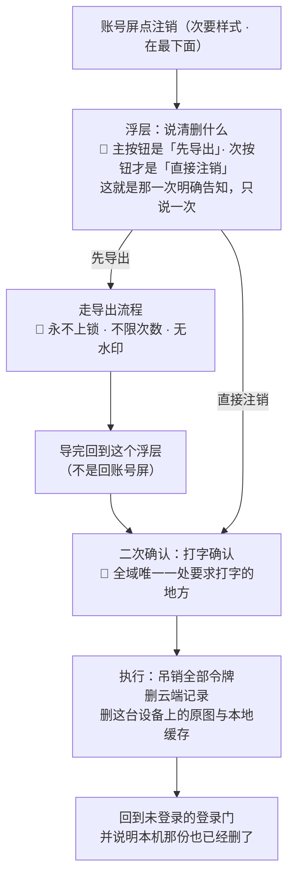

# U5.5 · 注销与把数据带走

> **基线**：`origin/v1` @ `73041df`，fetch 于 2026-09-02。
> **状态：活跃。** 删除时点由律师稿定下来、导出入口的位置或禁用条件变化、删除范围增减，本文同一次改动内更新。
> **上一层**：[M5 · 账号](INDEX.md)

---

## 一、这个子能力是什么、不是什么

**它是「把账号删掉」，同时是「把数据带走」这条承诺被兑现的最后一次机会。**

`产品总纲` §三 把「把清单带走的能力」列为用户拿到的三样东西之一，并写明**它是承诺不是功能**。
注销是这条承诺唯一一次会被真正检验的时刻 —— 一个记录工具如果在用户要走的时候扣着他的记录，
前面所有的承诺都不成立。

- **它不是退出登录。** 退出只解除这台设备与账号的连接；注销删的是账号本身。
  两者在「原图」这一格上完全相反（差别见 `模块地图` §三 登记的 `U5.6`）。
- **它不是一个数据清理工具。** 用户不能靠它清掉某一部分数据 —— 它只有全有和全无。
- **它不是一个主动作。** 界面上它是次要样式、在最下面，**不是红色大按钮** ——
  它是一个正当但不可逆的操作，不该长得像一个主动作。

**这一单元独有的两个决策**：导出入口为什么出现两次（§2.2）、删除时点未定时界面怎么写（§2.4）。

---

## 二、详细产品逻辑

### 2.1 六步，顺序本身是设计

**顺序上的三处刻意安排：**

| 安排 | 为什么 |
|---|---|
| 明确告知**排在用户决定之前** | 告知放在决定之后，就只是一次事后通报，用户没有机会改变主意 |
| 导出完**回到浮层**，不是回账号屏 | 回账号屏等于把用户扔回起点，他得重新找一遍这个入口 |
| 打字确认排在**最后** | 打字是一道成本闸，它挡的是误触；挡在导出之前会让人以为导出也不可逆 |

### 2.2 导出入口出现两次，这不是重复

| 出现位置 | 性质 |
|---|---|
| 注销浮层的**主按钮** | 用户还能选。这一次是**给他机会** |
| 注销响应里**必须带导出入口提示** | 用户已经选完了。这一次是**兜底** —— 万一他没走那条路 |

🔴 **两处都是硬要求，不是一处的两种写法。** 账号屏上的导出条目**在任何登录态下都在，且永不禁用**
（`用户侧功能规格 · 总纲` §四：导出永远不限次数、不加水印、不因未付费而删减）。
这一格是承诺，不是策略 —— **它不因为用户正在注销而收紧一格**。

### 2.3 删除范围

| | 注销时 | 依据 |
|---|---|---|
| 全部令牌（所有设备） | **吊销**，且要**立即生效** | 「立即失效」这条要求本身排除了 JWT（`后端系统设计与组件接入` §1.9） |
| 云端的记录与行为层 | **删** | 注销即删除 |
| 本机的记录缓存 | **删** | —— |
| **这台设备上的原图** | 🔴 **删** | 注销是唯一会删原图的动作。第 2 步已明确告知过一次，所以第 6 步**不再给「要不要也删掉」的二选一** |
| 别的设备上的原图 | ⚠️ 这台设备删不掉别台设备上的东西 —— 原图从不上云，也就没有一处能统一删它 | 见 §五 的观察 |

**与退出登录的差别只有一句话，但它是本域最容易被实现写反的一句**：
**退出不碰原图，注销才删原图。** 展开在 `模块地图` §三 登记的 `U5.6`。

### 2.4 ⚠️ 删除时点未定 —— 原样登记，不裁定

**「立即硬删」还是「软删 T+N 再硬删」是一个未决项**，它属用户协议不属架构，**待律师稿**（`L-3`）。
`技术架构与接口契约` §6.1 与 `后端系统设计与组件接入` §1.9 都已登记，两处都写明**架构文档不能顺手把它改宽**。

**界面文案取决于它：**

| 删除时点口径 | 浮层里必须说清的那件事 |
|---|---|
| 立即硬删 | 删掉就是删掉 |
| 软删 T+N | 必须说清**多少天内还能找回** |

🔴 **在它定下来之前，界面按「立即删除」写，并且不显示任何「找回」入口。**
理由是两种写错的代价不对称：**写了「可找回」而实际是硬删，是产品在骗人；
反过来只是少给一个入口。**

**本单元不替它拍板，也不按「行业惯例是软删」把它推向任何一边。** 一个看似合理的推断不能关闭一个 ⚪。

### 2.5 注销之后再用同一个号登录

**这一条必须在删除时点定下来之前就写清楚，因为它是用户最可能立刻做的事。**

| 删除时点口径 | 会发生什么 | 界面上必须说清的一件事 |
|---|---|---|
| 立即硬删（**当前实现口径**） | 这个号在身份表里已经不存在 → **走建号分支**，一个全新的空账号，并记一次 `signup_created` | 之前的记录已经删掉了，现在是一个新账号 —— 否则用户会以为产品把他的数据弄丢了 |
| 软删 T+N | 🚧 **未定**：是恢复旧账号，还是建新号并让旧账号继续等硬删 | **文案写不出来**（`L-3`） |

⚠️ 一处口径要留意：走建号分支意味着注销后立刻回来的老用户会**被计成一次陌生注册**。
本单元只指出这个事实，不改判据、不加过滤规则 —— 改判据是人的事。

### 2.6 离线与执行中

| 情况 | 行为 |
|---|---|
| 完全离线 | 注销入口**禁用**，并说清它要联网 —— 与退出登录相反（退出允许本地进行） |
| 执行中 | 全屏只读，入口禁用；重复点击**幂等**，不产生第二次注销 |
| 结果未知（中途断网） | 恢复后**先刷新账号状态**再决定，不盲目重发 |

---

## 三、前端行为意图 × 后端契约意图

| 场景 | 前端行为意图 | 后端契约意图 |
|---|---|---|
| 打开注销浮层 | 主按钮是导出，次按钮才是直接注销；这一次说清删什么，**只说一次** | 不涉及 |
| 导出 | 走完整导出流程，**永不上锁、不限次数、无水印**；导完回到浮层 | 导出接口不带任何与付费或注销相关的限制条件 |
| 二次确认 | 打字确认；不打就不可点 | 不涉及 —— 确认不产生请求 |
| 执行注销 | 执行中全屏只读；重复点不产生第二次 | **响应里必须带导出入口提示**；吊销**全部**令牌且立即生效；**幂等** |
| 本机清理 | 收到成功响应后删本机原图与本地缓存，并在回到门时说明一次 | **不涉及后端** —— 原图从来没有服务端副本，服务端删不了它 |
| 旧令牌仍被使用 | 受限态 → 原地渲染门，说清这个账号已经注销 | 注销后旧令牌必须**立即**被拒，不等自然过期 |
| 注销后同号登录 | 走正常登录流程，并说明这是一个新账号 | 走建号分支，并记一次 `signup_created` |
| 离线 | 入口禁用，**不发请求** | 不涉及 |

---

## 四、边界与红线在这里的具体形态

| 红线 | 在本单元的形态 |
|---|---|
| **不判断对错** | 注销流程里不出现任何挽留式的评价、不出现「你已经记了多少天」这类话术 —— 挽留的本质是替用户判断他不该走 |
| **不存题干** | 本单元贡献了全域第三个可输入元素：打字确认框。它**只接受一个固定词**（那个词在 `登录与账号` §6.1），不是自由文本 |
| **原图不上云** | 🔴 注销删的是**这台设备上的**原图 —— 服务端从来没有它的副本，所以「删原图」这件事只能发生在本机。这既是红线的落点，也是 §五 那条观察的来源 |
| **导出永不上锁** | 账号屏的导出条目**永不禁用**；注销第一步的主按钮就是导出，**这个入口保持不变、永不禁用** |
| **没有第四种反馈形态** | 注销完成只回到门并说明一次，不做任何后续提醒、不留待办、不发消息 |
| **不做提醒与激励** | 没有「确定不再想想吗」这类二次挽留（打字确认是防误触，不是挽留） |

---

## 五、缺口登记

| 缺口 | 缺的是哪一半 | 该谁定 |
|---|---|---|
| `L-3` 注销的删除时点（立即硬删 vs 软删 T+N） | 属用户协议不属架构。**它同时挡住 §2.4 的浮层文案与 §2.5 的同号登录文案** —— 定了软删要同时改这两处 | **待 `L-A5` 律师稿** |
| `FG-4` 首次运行明示同意在新形态下的具体形态 | 法务口径缺。它与本单元同源：同意与撤回同意是一件事的两端 | **需法务口径，产品定不了** |
| `L-2` 封禁状态存不存在 | 产品缺：封禁与注销都会让一个账号不可用，但两者对用户说的不是一句话。封禁没定，这一格就只有一半 | 由人拍板 |

⚠️ **两处本单元观察到、真源未登记的空白：**

1. **别的设备上的原图。** 注销只删「这台设备上的」原图，因为原图从不上云，**没有一处能统一删它**。
   一个在两台设备上都用过的用户注销之后，另一台上的原图仍然在。
   本单元不替它拍板，只指出：这一格牵动的是**用户以为自己删干净了**，而这与红线本身的方向一致
   （原图不上云是保护，不是遗漏）—— 但它需要在文案里被说清，而现在没人定过谁来说、在哪一步说。
2. **注册流水在注销后不删**（`后端系统设计与组件接入` §8.2 写着它只追加、注销不删）。
   这是为了让阶段 3 的判据仍然算得出来 —— 一个被删掉的注册记录会让「累计陌生注册数」凭空变小。
   本单元不裁定它与「注销即删除」这句用户口径之间的关系，只指出：**这两句话同时对用户说时会打架**，
   该由律师稿与产品口径一起答，不由本层答。
