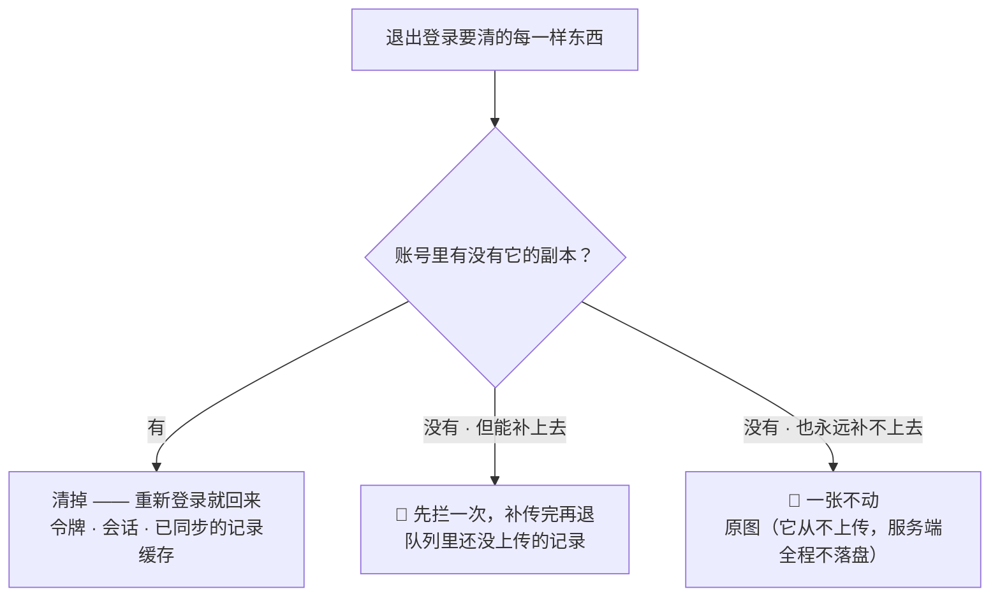
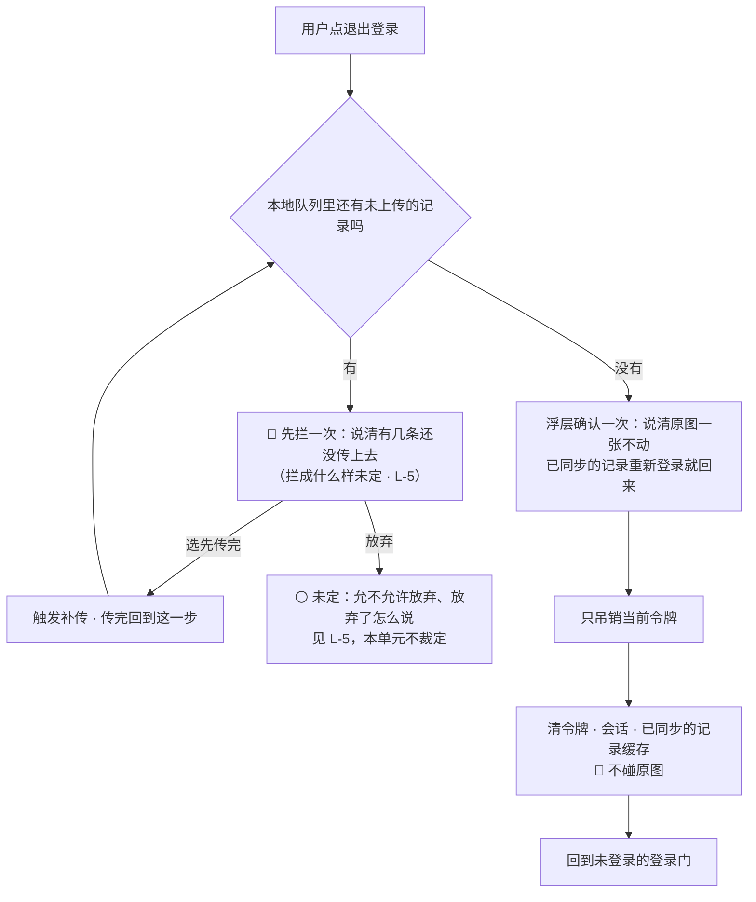
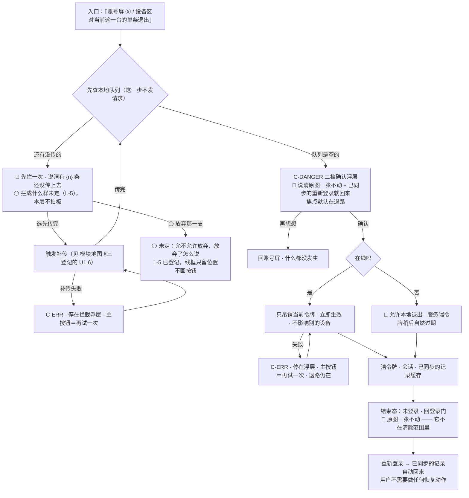

# U5.6 · 退出登录

> **基线**：`origin/v1` @ `73041df`，fetch 于 2026-09-02。
> **状态：活跃。** 清除范围那张表增删任何一行、「未上传先拦一次」被推翻、单条设备退出的语义变化，本文同一次改动内更新。
> **上一层**：[M5 · 账号](INDEX.md)

---

## 一、这个子能力是什么、不是什么

**它只做一件事：解除这台设备与这个账号的连接。**

- **它不是注销。** 账号还在、云端记录还在、别的设备还在线。两者的逐格差别在 §2.4，
  那张表就是这一单元存在的全部理由。
- **它不是数据清理。** 🔴 **它不碰原图。**
- **它不是一个无害动作。** 它是**唯一一条不经过采集层就能毁掉一条记录的路径** ——
  「记录动作本身永不失败」（`I-1`）防不到这里（§2.3）。

**这一单元独有的两个决策**：清一样东西之前先问什么（§2.2）、为什么那一次拦截不是可选项（§2.3）。

---

## 二、详细产品逻辑

### 2.1 清除范围：这张表是唯一真源

**2026-09-02 定，`设置与原图` §4.3 引用它，不另立说法**（`登录与账号` §4.7）。

| | 退出登录时 | 为什么 |
|---|---|---|
| 令牌与会话 | **清** | 退出就是解除这台设备与账号的连接 |
| 已同步过的记录缓存 | **清** | 它们在账号里，重新登录就回来，**清掉不丢东西** |
| 队列里还没上传的记录 | **先拦一次，传完再退** | 服务端没有副本，清掉就是丢（§2.3） |
| **原图** | 🔴 **一张不动** | 原图从不上传，账号里没有副本，**清掉就是永久毁掉用户自己的图**。只有注销才删原图 |

### 2.2 判据只有一句话：清它之前，先问账号里有没有它的副本

**这四行不是四条独立规定，是同一条判据的四次应用：**



**为什么原图落在最右边那一格**：原图的红线是「内联一次即弃、服务端全程不落盘、不上云不同步不共享」（`I-5`）。
这条红线的**必然代价**就是：账号里永远没有原图的副本。
**保护它的那条红线，同时让它成为退出登录时最脆弱的东西** —— 这一点必须被实现看见，
否则「顺手把本地数据清干净」这个看起来很合理的动作，会当场把红线的代价兑现成一次数据毁灭。

⚠️ **「清掉本地缓存」与「清掉原图」在实现上常常是同一个目录、同一次清理。** 产品口径在这里必须分得很硬：
**它们不是同一类东西**，一个有副本，一个没有。

### 2.3 那一次拦截不是可选项



**它为什么必须存在：** 离线队列在设备本地，而退出登录会清掉本地那份缓存。
如果队列里还有没上传的记录，它们就在**用户完全不知情的情况下消失了**
（`后端系统设计与组件接入` §1.9）。

🔴 **`I-1`（`模块地图` §五）守的是采集链路，退出登录不经过采集层 —— 它从背后把已经落地的记录清掉，所以 `I-1` 不覆盖此处。**
**这是全产品唯一一条这样的路径**，它需要一条自己的防线。

⚠️ **确认浮层要说清的是「什么不会没」，不是「你确定吗」。** 用户在这一刻最怕的两件事是
「我的图会不会被删」和「我记的东西会不会没」—— 两件都要在动手之前被回答一次。

### 2.4 退出 × 注销：本单元的核心

| | 退出登录 | 注销账号 |
|---|---|---|
| 账号本身 | **还在** | **删掉** |
| 云端记录与行为层 | **一条不动** | **删** |
| 令牌 | 只吊销**当前这一台** | 吊销**全部** |
| 别的设备 | **仍然在线** | 一起下线 |
| 本机已同步的记录缓存 | 清（重新登录就回来） | 清（回不来了） |
| 本机未上传的记录 | **先拦一次** | 随账号一起没了 —— 但注销前给过一次导出 |
| **本机原图** | 🔴 **一张不动** | 🔴 **删**（第一步浮层已明确告知过一次） |
| 可逆性 | **可逆**：重新登录即恢复 | **不可逆** |
| 界面上的位置 | 账号屏的常规条目 | 最下面、次要样式、**不是红色大按钮** |
| 确认强度 | 浮层确认一次（有未传记录时先拦一次） | 明确告知 + 导出机会 + **打字确认** |
| 离线时 | ⚠️ **允许本地退出，但先拦一次** —— 离线时队列一定还没传完 | ❌ 入口禁用，它必须联网 |

**一句话记住它：退出解除的是连接，注销删除的是账号；前者不碰原图，后者才删原图。**

### 2.5 「退出这台」与「退出登录」是同一件事

| 规则 | 说明 |
|---|---|
| 设备列表里的单条退出 | 每一行可单独退出，**立即生效** —— 被退的那台设备下一个请求就被拒，不等令牌自然过期 |
| 退出**当前**这一台 | 与账号屏上的退出登录是同一件事，**走同一段拦截逻辑** —— 两个入口一套行为，否则用户从哪个入口走会得到不同结果 |
| 多设备同时在线 | **正常，不拦、不提示、不踢人**。不做「把别的设备踢下线」的默认动作 |
| 设备列表拉不到 | 该区块单独错误 + 重试，**不影响账号屏其余部分** —— 退出登录与导出必须照常可用 |

⚠️ **在别的设备上退出这一台，拦不到这一台的本地队列。** 拦截发生在被退的那台设备上，
而那台设备此刻可能不在线。这一格的后果与 `L-5` 同源，一并登记在 §五。

---

## 三、前端行为意图 × 后端契约意图

| 场景 | 前端行为意图 | 后端契约意图 |
|---|---|---|
| 点退出登录 | **先查本地队列**，有未传的先拦一次；队列为空才给确认浮层 | **不涉及后端** —— 队列在本机，这一步没有请求 |
| 确认退出 | 清令牌、会话、已同步的记录缓存；🔴 **不碰原图**；回到未登录的登录门 | 只吊销**当前**令牌，**立即生效**；不影响别的设备 |
| 单条设备退出 | 立即从列表移除，不等下一次刷新 | 单条吊销**立即生效**，不等自然过期 —— 这条要求本身排除了 JWT（`后端系统设计与组件接入` §1.9） |
| 设备列表 | 拉不到时该区块单独错误 + 重试；只有一台时直说，不画插画 | 要带设备标签与最近使用时间；分页用游标，前端不猜总数 |
| 离线退出 | **允许本地退出**，但因为离线时队列必然还没传完，所以拦截照做 | 本地会话已清，服务端令牌稍后自然过期；**无需补偿** |
| 退出后再登录 | 已同步的记录**自动回来**，用户不需要做任何恢复动作 | 记录归账号不归设备 —— 这一条正是「清掉不丢东西」的前提 |

🔴 **这张表里没有任何一行会让服务端接触原图。** 服务端从来没有原图的副本，
所以「退出时要不要删原图」在契约层根本不是一个问题 —— 它只在客户端存在，而答案是不删。

---

## 四、边界与红线在这里的具体形态

| 红线 | 在本单元的形态 |
|---|---|
| **原图不上云** | 🔴 本单元是这条红线**代价最集中**的地方：正因为原图没有服务端副本，退出时清它就是永久毁掉。红线在这里的形态不是「别上传」，是**「别清掉」** |
| **不判断对错** | 退出流程里没有挽留、没有「你已经连续记了多少天」这类话术 |
| **不存题干** | ➖ 本单元没有任何输入元素 |
| **归档不是删除** | 与原图的到期归档同源：产品从不主动毁掉用户的东西。退出登录同样不毁 —— 它只解除连接 |
| **没有第四种反馈形态** | 拦截是一次**当场的浮层**，不是一个待办、不是小红点、不是稍后提醒。退出之后不再追问、不发任何消息 |
| **不做提醒与激励** | 多设备同时在线不提示、不告警、不诱导用户去清理别的设备 |

---

## 五、缺口登记

| 缺口 | 缺的是哪一半 | 该谁定 |
|---|---|---|
| `L-5` 退出登录拦截的形态 | 产品缺：「有未上传记录时先拦一次」这条已成立，但**拦成什么样**（强制先传 / 提示可跳过 / 只显示条数）没人定过。它直接决定 §2.3 那张图里「放弃」那一支存不存在 | 由人拍板 |
| `L-9` 设备名从哪来、能不能改 | 技术缺：契约里只有设备标签，没定由谁生成、能不能被用户改。**能改就多一个自由文本字段，而自由文本字段是红线要盯的东西** | 🚧 待技术定稿 |
| `L-11` 两个通道时能不能解绑其中一个 | 契约缺。它与本单元相邻：解绑与退出都会让用户「少一条进来的路」，而解到零个通道等于把自己锁在外面 | 由人拍板 |

⚠️ **一处本单元观察到、真源未登记的空白**：在设备 A 上对设备 B 点「退出这台」时，
**拦截拦不到设备 B 的本地队列** —— 拦截逻辑跑在被退的那台设备上，而那台此刻可能不在线。
于是设备 B 上未上传的记录会在它下次启动时面对一个已失效的令牌。
本单元不替它拍板，只指出：这一格与 `L-5` 同源 ——
**「拦成什么样」定不下来，「拦不到的时候怎么办」也就无从定**，两者要一起答。

---

## 六、线框

> 记号与屏宽照 `线框与交互规格约定` §三（40 个半角字符），组件只引锚不抄规格。
> 本单元画**退出这一条链路**与它在设备区的第二个入口；账号屏其余区块与注销在别处（清单见域索引 §四）。

### 6.1 常态整屏

```
┌─ 账号屏 ───────────────────────────────┐
│ ‹ ← 返回 ›  ⟦屏标题⟧      ← P-NAV      │
│ ①② ⟦身份区 · 绑定区⟧                   │
├────────────────────────────────────────┤
│ ③ 设备区 ⟦当前设备（本机）⟧            │
│  ⟦其他设备 · 最近使用时间⟧ ‹退出这台›※1│
├────────────────────────────────────────┤
│ ④ [ ⟦导出我的全部数据⟧ › ] 🔴 永不禁用 │
│ ⑤ [ ⟦退出登录⟧ ] ← 次 ※2  ⑥ ‹⟦注销⟧›   │
└────────────────────────────────────────┘
        ↓ 点⑤（先查本地队列，这一步不发请求）
┌─ 队列里还有没传的 · 先拦一次 ──────────┐
│ 🔴 ⟦有 {n} 条还没传上去⟧          ※3   │
│ ( 先传完 ) ← 主  ⚪ ⟦放弃那一支未定⟧※4 │
│ ‹ × 关闭 › ← 永不禁用                  │
└────────────────────────────────────────┘
        ↓ 队列是空的
┌─ 确认浮层 ← C-DANGER 二档 ─────────────┐
│ 🔴 ⟦这台设备上的原图一张不动⟧      ※5  │
│ ⟦已同步的记录重新登录就回来⟧       ※6  │
│ [ 退出登录 ]  ( 再想想 ) ← 焦点在退路   │ ※7
└────────────────────────────────────────┘
        ↓ 确认 → 只吊销当前令牌 → 回未登录的登录门（‹ × 关闭 › 见域索引 §四）
```

※1 设备列表里的单条退出与 ⑤ **走同一段拦截逻辑** —— 两个入口一套行为，否则用户从哪个入口走会得到不同结果（§2.5）　※2 ⑤ 是**常规条目**，不是危险样式：退出可逆，重新登录即恢复（§2.4）
※3 🔴 这一次拦截**不是可选项**：退出会清掉本机那份缓存，队列里没传的记录会在用户完全不知情的情况下消失（§2.3）
※4 ⚪ **拦成什么样（强制先传 / 可跳过 / 只显示条数）是已登记的缺口**（`L-5`，本层不拍板）：线框只把这一支的**位置**留出来，🔴 **不替它把按钮定下来**，也不默认它存在
※5 🔴🔴 **这一行是本单元的心脏，不可弱化、不可折叠、不可挪进副文本**：原图从不上传，账号里没有副本，**清掉就是永久毁掉用户自己的图**。确认浮层要说清的是「**什么不会没**」，不是「你确定吗」（§2.3；这两格的真源原文在 `登录与账号` §4.7，本层只给槽位与指针）
※6 `C-DANGER` 二档强制内容的两半：**会失去什么 + 不会失去什么**，两半都要写　※7 焦点默认落在**退路**上；🔴 退出不删原图，所以主按钮的后果里**不出现任何图片字样**

### 6.2 其余各态：只画变化区

```
│ 骨架 · ③ 未回 ⟦···⟧ 🔴 ④⑤ 已可点  ※8   │
│ 空态 · ③ ⟦只有这一台⟧ 🔴 不画插画  ※9  │
├────────────────────────────────────────┤
│ 错误态 C-ERR · ③ 区块单独错误          │
│  ⟦设备列表拉不到⟧ ( 再试一次 )    ※10  │
│  ④⑤⑥ ⟦同常态⟧ 照常可用                 │
├────────────────────────────────────────┤
│ 陈旧态 ③ ⟦刚才的列表⟧ 单条退出禁用※11  │
├────────────────────────────────────────┤
│ 受限态 C-LIMIT · 离线              ※12 │
│  🔴 ⑤ 仍可点 —— 允许本地退出，拦截照做 │
│  ③ 单条退出禁用（它要联网）            │
├────────────────────────────────────────┤
│ 受限态 · 令牌失效 → 原地渲染门         │
```

※8 🔴 设备区是**独立区块**：它的加载、空、错误都不许挡住 ④ 与 ⑤ —— 退出登录与导出必须照常可用（§2.5）　※9 只有一台时**直说**，不画空插画（`C-EMPTY` 不用于这一区）
※10 该区块单独错误 + 重试，**不影响账号屏其余部分**　※11 陈旧列表上的「退出这台」若仍可点，用户会以为退掉了一台其实已经不在的设备
※12 🔴 离线时**允许本地退出**（与注销相反），但正因为离线时队列必然还没传完，**拦截照做**（§2.4）

### 6.3 红线自查十条，逐张数过

| # | 数这一样 | 本单元 |
|---|---|---|
| 1–2 | 正确率 / 得分 / 排名 / 讲解 / 学习建议 | 0：退出流程里没有挽留、没有「你已经连续记了多少天」这类话术 |
| 3–6 | 提醒 / 打卡 / 进度环 / 百分比 / 倒计时紧迫感 | 0：拦截是一次**当场的浮层**，不是待办、不是小红点、不是稍后提醒；补传进度不做百分比；多设备同时在线不拦、不提示、不踢人 |
| 7–8 | 能装下题干的格子、置信度 | 0：本单元**没有任何输入元素**；设备名是服务端按端类型生成的枚举，不是自由文本（能不能改未定，`L-9`）；置信度 0 |
| 9–10 | 原图入口 / 三处必须出现的东西 | 🔴 0：屏上没有原图的分享 / 导出 / 同步入口，退出**一张不动**。三处落在 `模块地图` §三登记的 `U8.3` / `U8.4`，本单元不重画也不弱化 —— ⚠️ ※5 与它们同源：那三处保护的是用户对自己原图的掌控，退出这一步的形态是**「先说清它不会没」** |

---

## 七、交互规格

### 7.1 必答五项

| # | 必答 | 本单元的答案 |
|---|---|---|
| 1 | **入口** | 两条，**走同一段拦截逻辑**：账号屏 ⑤ 的退出条目；设备区里对**当前这一台**的单条退出。🔴 对**别的设备**的单条退出是第三条，但它拦不到那台设备的本地队列（§2.5，与 `L-5` 同源） |
| 2 | **结束状态** | 身份态回到「未登录」，只吊销当前令牌，落在未登录的登录门上。🔴 **身份态与主轨四态、`TS-00`–`TS-09` 是两条不相干的轨**（真源 `模块地图` §四）：已同步的记录**两条轨都一格未动**，它们在账号里，重新登录就回来；处在**待上传**的记录服务端没有副本 —— 这正是拦那一次的全部理由 |
| 3 | **失败落点** | 吊销请求失败 → 停在确认浮层，主按钮＝再试一次，退路仍在；离线 → 🔴 **允许本地退出**，本地会话已清、服务端令牌稍后自然过期，无需补偿；补传失败 → 停在拦截浮层，下一步是再传一次或按 `L-5` 定下来的那一支走 |
| 4 | **空态** | 一种成因，且只在设备区：**只有当前这一台**（`C-EMPTY` 不用于这一区，直说一句、不画插画）。立刻能做的动作是 ④⑤，它们在空态下照常可用 |
| 5 | **错误态** | 可重试：设备列表拉不到、单条吊销失败、补传失败。不可重试：无 —— 退出本身在离线时也能在本地完成。**有缓存时是陈旧数据态**：设备列表用上一次的，🔴 但陈旧态下**单条退出禁用**，退出登录与导出不受影响 |

### 7.2 受限态（按需追加项）

| 档 | 什么时候出现 | 主按钮 | 次入口 |
|---|---|---|---|
| 离线 | 端离线 | 🔴 退出登录**仍可点**（本地退出），拦截照做 | ③ 单条退出禁用并说清它要联网 |
| 令牌失效 | 静默续期失败 | 去登录（这一档没有免费兜底） | 无 —— ⚠️ 此时本地队列仍在，🔴 **失效不等于退出，不许顺手清缓存** |

🔴 **可断言的检查**：队列里留一条未上传的记录再点退出，**必须先被拦一次**；退出完成后到本机原图目录里数一遍，🔴 **张数与退出前完全一致**。任一条不成立即为红线命中，不是交互瑕疵。

### 7.3 交互流程



⚠️ **本单元不写任何端点。** 退出、设备列表、单条吊销三条都在契约表里，**本节没有 `[契约缺]`**。界面对后端的要求只有两条：①退出**只吊销当前令牌**且立即生效，不影响别的设备；②设备列表要带设备标签与最近使用时间，分页用游标、前端不猜总数。🔴 **这两条里没有任何一条会让服务端接触原图** —— 「退出时要不要删原图」在契约层根本不是一个问题，它只在客户端存在，而答案是不删。
