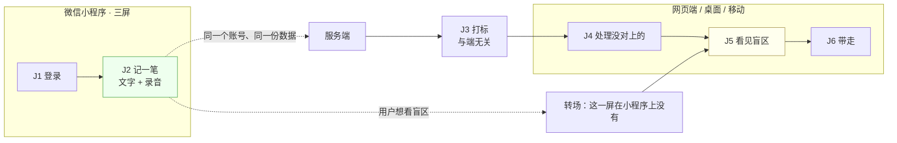
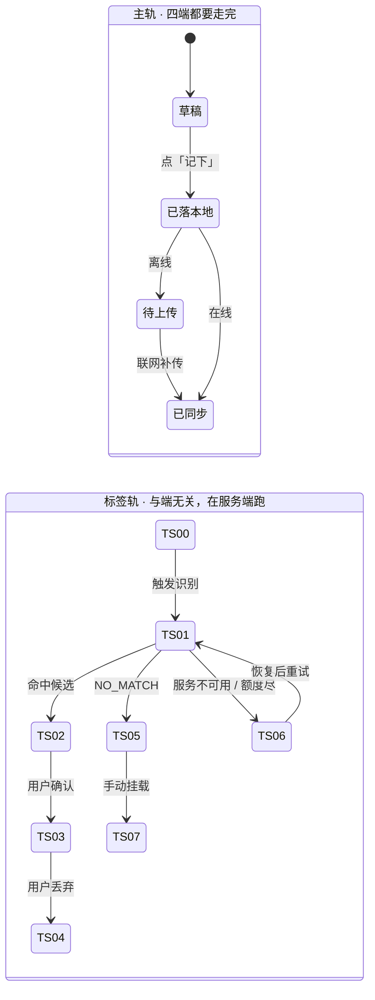

# M6 端与形态 · 域索引

> **基线**：`origin/v1` @ `73041df`，fetch 于 2026-09-02。
> **状态：活跃。** 端的增删、任何一屏的端能力格变化、跨端一致性的「允许不一致清单」增删、无障碍下限改一个数，本文同一次改动内更新。
> **上一层**：[模块地图](../INDEX.md)

---

## 一、这一域在减法的哪一端

**两端都不在 —— 它是支撑。** 这一域不维护被减数（骨架层），不收减数，也不做减法本身。
它决定的是**同一条减法在四个端上还成不成立**：同一条记录在哪个端记得下来、同一个盲区数字在哪个端看得见、
同一句话在哪个端会不会变成第二个版本。

只有一处例外要点名：**微信小程序只落在「收减数」那一端**。它承接采集，不承接减法与出口
（`多端选型与端矩阵` §3.6、`无障碍与多端适配` §二）。这一条决定了本域对北极星的作用是**间接的、且方向单一**——
详见 §二。

由此推出本域最硬的一条性质：**它没有自己的功能，只有自己的失败模式。**
本域出错的表现不是「某个功能坏了」，而是「同一件事在两个端上是两件事」。

---

## 二、它服务于主流程的哪一步

**`J0`–`J6` 全部**，加三条横切 `C1` `C2` `C3`。本域是唯一一个填不出「哪一个节点」的域，因为它的对象是节点的**载体**。

| 节点 | 本域在这一步管什么 |
|---|---|
| `J0` `J1` | 登录门在四个端都要能渲染；`S-LOGIN` 不是路由，返回键要退出门而不是退出应用 |
| `J2` | 🔴 **四个端都必须能走完**。这是本域唯一不许有缺格的一行 —— 小程序被裁成三屏，留下的正是采集 |
| `J3` | 与端无关：识别与打标在服务端跑，端上只负责把状态显示成同一个样子 |
| `J4` | 三个端有 `S-TAG`，小程序转场网页端 |
| `J5` | 🌟 北极星落点。桌面/移动/Web 三端完整，小程序不提供 |
| `J6` | 三端完整，小程序不提供；桌面说「保存到哪」、移动只能说「导出好了」，这不是文案偏好是端事实 |

### 小程序这个定位对 `J2 → J5` 那条线意味着什么

**它把主旅程剪成两段，剪口在 `J4` 之前。**

三条后果，逐条：

1. **小程序端不产生北极星那个数。** 那个数的落点是 `J5`，而 `J5` 在这个端上不存在。
   小程序做的是**把减数收得更全**——它抬高的是每条减法的输入质量，不是「主动查看盲区的人数」本身。
2. **转场必须是一次明确的转场，不是一个更弱的同名屏**（`多端选型与端矩阵` §4.6.4）。
   在小程序里做一个「简版盲区」，会让同一个 route id 在两个端指向两件事，而北极星统计的是同一个动作。
3. **`J3` 不因为端而分叉。** 小程序记下的一条记录，走的是同一条打标管线、落的是同一批 `TS-xx` 状态。
   端只决定它在哪儿被看见，不决定它是什么。

---

## 三、它服务于哪一个关卡

**本域不产生任何一个关卡数字。**

关卡要的是「自用两周、每天记两个数」（`实施路径` §阶段0）。
**一个端在关卡没过之前多装一台机器，那个数不动。** 多一个端不会让任何一个人多记一笔，也不会让任何一个人多看一次自己的盲区 ——
它只让已经在记的那个人换个地方记。

这不是本域的猜测，是两份真源的自述：`多端选型与端矩阵` 开篇写「这份文档对阶段 0 的贡献是零」，
`壳技术方案：Tauri 2 包现有 Web 工程` §九末尾写「本文描述的一切，加起来对阶段 0 的贡献是零」。
**本域把这两句原样接过来，不替它们找阶段理由。**

本域服务关卡的方式只有一条：**不制造假的完成感。**

| 如果 | 关卡会怎样 |
|---|---|
| 把「端数」当进展 | 端数可量化、做起来舒服、不需要面对任何一个真实用户 —— 正是 `思考模式与选择框架` §盲区二 点名的那类工作 |
| 让某个端上「能看到但按不动」 | 用户在那个端上记的那一笔实际没落地，`I-1` 在那个端上是坏的，而关卡数据来自用户自己记的两个数 |

---

## 四、能力单元清单与下钻

| 单元 | 管什么 | 关键决策 |
|---|---|---|
| [`U6.1` 端的清单与各自定位](U6.1-端的清单与各自定位.md) | 有哪几个端、各自是什么、现在到哪一步 | 「端」的判据只有一条：一条自己的构建链或一次自己的分发；**小程序只做采集入口**；桌面/iOS/Android 的现状如实写，不粉饰也不提议砍谁 |
| [`U6.2` 屏与端的能力矩阵](U6.2-屏与端的能力矩阵.md) | 十三屏 × 四端，每一格取什么值 | 每一格只有三种取值；🔴 **每个缺失格子必须有降级路径**，没有降级路径的登记成缺口；三格之外没有第四格 |
| [`U6.3` 响应式与跨端一致性](U6.3-响应式与跨端一致性.md) | 布局分档与「同一句话不能有两个版本」 | 🔴 **面向用户的字符串一处词表、多处消费**；必须一致的四样与允许不一致的四样，清单之外的差异一律算缺陷 |
| [`U6.4` 无障碍下限](U6.4-无障碍下限.md) | 焦点、朗读、播报节流、颜色载体、键盘可达 | 下限是下限不是加分项；🔴 **颜色不作为唯一信息载体**；十态各有独立文字与独立图形 |

**四个单元共用的一句话**：**端只改变「怎么做到」，不改变「做到了什么」。**
交互手法、布局、系统级组件、端事实可以不同；文案、状态、错误表现、数据结果不许不同（`U6.3`）。
一个差异要落在前一类还是后一类，判据在 `U6.3` 的两张清单里，不在各端各自的手感里。

---

## 五、域级状态机

**本域不拥有任何一个状态，也不触发任何一次转移。** 下图的状态名全部取自 L2 总表 §四，
本域只回答一件事：**同一条轨在四个端上跑的是不是同一份。**

三条读法，它们就是本域全部的状态责任：

1. **`已落本地` 的「本地」在四个端是四种介质**（真实文件系统 / 应用私有目录 / 浏览器本地数据库 / 微信本地存储），
   持久性强弱各不相同（`U6.2` §五 的落点、`无障碍与多端适配` §五）。**介质可以不同，状态名必须相同。**
2. **`待上传` 这一态在小程序上同样存在。** 它承接 `J2`，就必须承接 `J2` 的全部失败落点 —— `I-1` 不因为端小而打折。
3. **`TS-00`–`TS-09` 十个态的徽标文字在所有端、所有尺寸形态里逐字相同**（L2 总表 §四 约定 2），
   且每个态另有独立图形（`U6.4`）。**某端把「没对上」显示成别的说法，是缺陷不是本地化。**

---

## 六、前端行为意图 × 后端契约意图

| 事项 | 前端行为意图 | 后端契约意图 | 状态 |
|---|---|---|---|
| **端标识** | 端不把自己是谁写进请求；界面差异全部由端自己决定 | 🔴 **`/api/*` 在任何端返回同一份语义**（`无障碍与多端适配` §6.1）。后端不得按端分叉响应，也不得要求端自报形态 | ✅ 已定，属既有契约的性质 |
| **面向用户的字符串** | 各端**现读**同一份词表，不抄副本；读不出来时报错退出，不静默降级 | 构建期资产，非端点。要求是「只有一处定义」这件事本身可被检查（`多端选型与端矩阵` §4.5） | ✅ 已定 |
| **路由 / route id** | 端与端之间对齐的是 id 不是路径字符串；小程序实现子集，子集外解析成一次明确转场 | 一份路由表单一来源，各端现读。🔴 URL 里只允许不透明 id 与固定枚举值（`多端选型与端矩阵` §4.6.3） | ✅ 已定 |
| **错误码 → 界面文案** | 同一个错误码在四个端映射到同一句话 | 同一份错误码语义，不为某个端加专用码 | ✅ 已定 |
| **导出结果** | 交付形态随端（保存对话框 / 分享面板 / 浏览器下载） | 🔴 同一份导出**字节级一致**，字段清单跨端相同（`无障碍与多端适配` §6.1） | ✅ 已定 |
| **骨架树按层取** | 小程序只渲染第 1 层 + 当前展开路径（手风琴），**这个差异不抹平** | 🚧 **产品意图，无契约行** —— 「按层取子树」这个能力是否成立、怎么表达，没有对应契约 | 🚧 缺口（§七 `M6-G3`） |
| **端上定时器** | 壳里可以说「到点就处理」，浏览器里不许用同一句话；移动端拿不到保证时前台启动扫一次，界面不承诺自动处理 | 🔴 **后端不得依赖任何端上定时器**：到期语义必须在服务端与端上各自成立，不靠端替它跑 | ✅ 已定（`壳技术方案：Tauri 2 包现有 Web 工程` §五） |
| **`S-BILL` 支付通道** | 受限态的主入口是免费兜底；档位与额度由服务端返回，前端不硬编码 | 🚧 **桌面壳与 Web 的支付通道待定**（`无障碍与多端适配` §二 `S-BILL` 行），iOS 走 Apple 内购、小程序走微信虚拟支付 | 🚧 缺口（§七 `M6-G2`） |
| **无障碍** | 焦点链、播报节流、颜色之外的载体全部由端实现 | **无端点**。唯一的后端面是：状态与错误必须**可被表述成一句完整的话**，不能只给一个码让端去编 | ✅ 已定 |

---

## 七、这一域碰到的边界 + 缺口登记

### 边界在这一域的形态

| 红线 | 在这一域怎么落 |
|---|---|
| 不判断对错 | 端的差异里没有一格的条件是「学得好不好」；无障碍朗读把每个数字还原成有没有 / 几次 / 多久前 |
| 不做学科教研 | 本域不碰内容，只碰载体 |
| 不存题干与机构内容 | 🔴 **URL 是本产品最容易泄漏内容的一处**，而它没有数据库那种「不留预留位」的物理保护。落点在 `U6.1` 的路由约定 |
| 不生成标签文本 | 十态徽标文字在词表里定死，端不许各自意译 |
| **原图不上云不同步不共享** | 🔴 本域是这条红线的**逐端可行性检查**所在：小程序端物理上兑现不了，处置是**不开原图通道**，不是把承诺降级 |
| 没有第四种反馈形态 | 🔴 端能力最容易长出第四种：原生通知、托盘角标、小红点、未读计数。托盘图标已裁定「用，但不显示任何数据」，五条不许有 |

🔴 **一条可断言的检查**：任何一个端上，如果一句承诺（原图只在本机 / 到点就处理 / 不限次数导出）
**兑现不了却照样写在界面上**，那个端就在说假话。处置只有两条：屏蔽入口，或如实写出它做不到 ——
**不许用第三条：把其余端的承诺一起降级成「看情况」。**

### 缺口登记（只登记，不裁定）

🔴 **第一条是结构性的，排在最前。**

| # | 缺口 | 缺的是哪一半 | 该谁定 |
|---|---|---|---|
| 🔴 **`M6-G1`** | **声明的唯一真源把内容派回了叶子。** `无障碍与多端适配` 开篇（`:7`）自称「逐屏规格与本文冲突时，以本文为准」，但它的 §二 能力矩阵有四格把内容派回各屏规格：`S-BLIND`（`:87`，转场理由回指 `看盲区` §九）、`S-EXP`（`:90`，回指 `导出与问AI` §十五）、`S-ACC`（`:92`，回指 `登录与账号` §十一）、`S-SET`（`:95`，回指 `设置与原图` §10.1）。**一份声明自己是仲裁者的文档，把仲裁内容存在被仲裁方那里** —— 冲突时按哪一份读没有答案 | 缺的是「真源到底在哪」这半。**按新结构，端矩阵的真源就在 `U6.2`**；本条登记的是它与 `无障碍与多端适配` `:7` 那句自述的关系尚未被人裁定 | **产品裁定人**。本域不改另一份规格的正文 |
| `M6-G2` | **`S-BILL` 的支付通道 🚧 待定**（`无障碍与多端适配` `:94`）：桌面壳与 Web 两格都是「完整。支付通道 🚧 待定」 | 缺的是后端契约那半。产品侧已定的是「受限态主入口必须是免费兜底」；「用哪条通道」没有真源 | 技术同事 + 主体资质，产品不拍 |
| `M6-G3` | **桌面壳多窗口 🚧 未定**（`无障碍与多端适配` `:110`）：当前无多窗口需求，任何「新开一个窗口放详情」的提议要先回答它服务哪个已成立的需求 | 缺的是需求那半，不是技术那半。原样登记，不自行判「不做」 | **产品**，未定 |
| `M6-G4` | 小程序端骨架树「按层取子树」没有契约行 | 产品意图已定（手风琴、只渲染第 1 层 + 当前路径、不抹平）；契约侧空白 | 技术同事 |
| `M6-G5` | Windows 端十三屏行为全部未验 | 缺一次实测，不缺选型（`多端选型与端矩阵` §3.3.2）。快捷键、焦点链、读屏器组合全部悬空 | 技术侧，需一台机器 |
| `M6-G6` | 移动端后台定时器能不能真跑未验 | 缺一次实机验证。当前按「拿不到保证」写成不承诺；真跑通了要回来改 | 技术侧 |
| `M6-G7` | iPad 落哪个断点、树多大切虚拟滚动、小程序包体与首屏，三个实测数缺席 | 缺的是数，不是口径。**不许自己拍一个数顶上** | 技术侧按实测给 |
| `M6-G8` | 读屏器 × 中文输入法的实机验证缺位 | `无障碍与多端适配` §十二 那八条是「已知风险 + 规避」，不是实测结论 | 技术侧 + 测试 |
| `M6-G9` | 桌面壳算不算「Web 界面」（只读令牌签发） | 契约写死「在 Web 界面手动签发」，而桌面壳内嵌的是同一份 web 产物，矩阵里那一格因此没有答案 | **放宽它是安全边界的变更，产品不自行放宽** |
| `M6-G10` | 小程序端有没有 `S-TAG`，两份规格结论相反 | `打标与未分类` §10 给小程序写了 `S-TAG` 的布局与键盘方案；`多端选型与端矩阵` 与 `看盲区` 限定小程序只三屏。`U6.2` 取「不提供」并在那里登记，本条只记它未被裁定 | **产品裁定人** |

`M6-G5`–`M6-G8` 与 `无障碍与多端适配` §十六 的六条缺口同源，本节按「缺哪一半 / 该谁定」重排，**不是第二处登记**。
