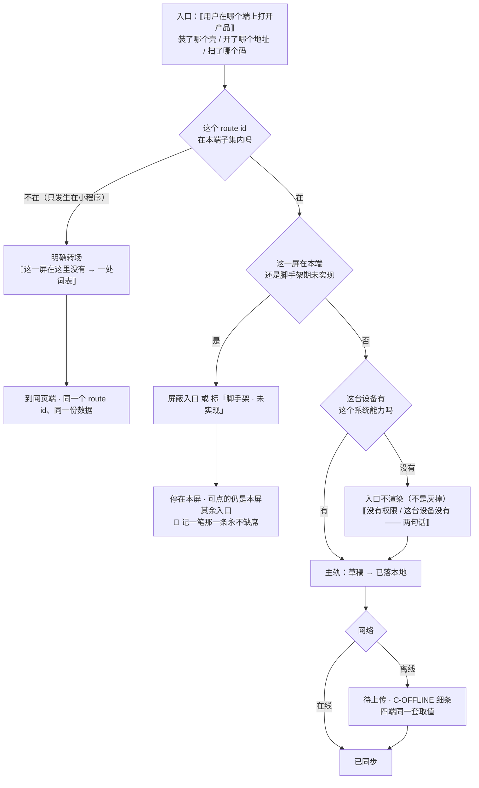

# U6.1 · 端的清单与各自定位

> **基线**：`origin/v1` @ `73041df`，fetch 于 2026-09-02。
> **状态：活跃。** 端的增删、任何一个端的现状档位变化（未开工 / 未验 / 已跑通）、或小程序承接范围变化，本文同一次改动内更新。
> **上一层**：[M6 端与形态 · 域索引](INDEX.md)

---

## 一、这个子能力是什么、不是什么

**是**：把「这个产品有几个端、每个端在主旅程上负责哪一段、每个端现在实际到了哪一步」写成一份不会被记错的清单，
并说清**微信小程序只做采集入口**这一条裁定的理由与代价。

**不是**：
- 不是技术选型 —— 用什么栈、为什么否掉别的框架，在 `多端选型与端矩阵`，**已冻结，本文不重新裁定**
- 不是排期 —— 端的开工顺序在 `执行清单`，本文不涉及
- 不是能力矩阵 —— 哪一屏在哪个端有、缺格怎么降级，在本域另一单元（清单见域索引 §四）

**它要回答的只有三个问题**：有哪几个端、每个端凭什么算一个端、每个端现在到底能不能跑。

---

## 二、详细产品逻辑

### 2.1 「端」的判据只有一条

**一个形态要成为「端」，判据是：它需要一条自己的构建链或一次自己的分发。光是长得不一样不算**
（`多端选型与端矩阵` §一）。

这条判据的产品价值在于它挡掉了一类提案：「Pad 版」「大屏版」「深色版」都不是端，它们是同一份界面的不同断点或不同主题。
**为一组断点单开一个端，买到的只有一组断点，付出的是一条要长期维护的构建链。**

### 2.2 「四端」与「六端」说的是同一件事

本域按**用户侧视角**粗分成四个端；`多端选型与端矩阵` 按**构建链视角**细分成六个。两者不矛盾：

| 用户侧的「四端」 | 构建链视角的细分 | 为什么这样分 |
|---|---|---|
| 桌面壳 | macOS + Windows | 用户不区分，两者同栈同产物；差异只在系统事实 |
| 移动 App | iOS + Android | 同上；但**系统事实分叉**（安全区、后台限制、存储分区、相册授权模型），所以逐端适配时要分列 |
| Web / H5 | Web / H5（Pad 是它的断点） | 主形态 |
| 微信小程序 | 微信小程序 | 唯一的原生端 |

**本单元凡出现「四个端」，指的都是前者。** 能力矩阵按四端画，逐端事实按六端写 —— 这不是两套口径，是同一套的两个粒度。

### 2.3 逐端定位与现状 —— 如实写，不粉饰

| 端 | 它在旅程上的定位 | 现状（真源自述） |
|---|---|---|
| **Web / H5** | **主形态**。十四屏全在这里，其余三个端都是它的再分发 | ✅ 已在跑 |
| **桌面壳（macOS）** | 唯一能兑现「到点就处理，不用你打开」和「存储无配额」的端 —— 这两条是它存在的**全部**理由 | ✅ 实测可装可开 |
| **桌面壳（Windows）** | 同 macOS，无独有定位 | ⚠️ **未验**。有栈、有顺序、缺一次实测。「未验」与「不做」是两个词，Linux 才是「不做」（`多端选型与端矩阵` §3.3.2、§一） |
| **移动 App · iOS** | 采集场景离用户最近的一个端 | ⚠️ 模拟器上能打开首页；**没有真机、没有后端接入、没有原图通道** |
| **移动 App · Android** | 同 iOS | ⚠️ 代码侧已验，环境卡住 |
| **微信小程序** | **只做采集入口**，见 §2.5 | 未开工。真实前置是主体认证链与备案，这是客观依赖 |

> 📌 **首发口径（2026-09-04 15:10 用户指令）**：**首发形态为 iOS**，每模块交 iPhone + iPad 两档。
> 本表（及 §2.2）里「Web / H5 = 主形态」的表述**以该指令为准**，**主形态定位待首发后重估**。
> 这一行只记录口径与它的时点，不重定端的定位 —— 端的定位改不改、怎么改，等首发之后另起一次裁定
> （产品经理裁定于 2026-09-05，`KUBI-79`）。

### 2.4 桌面 / iOS / Android 的现状，三份文档说得不一样 —— 按最严的那份写

**这一条必须原样写出来，因为它是「移动端到底能不能跑」这个问题的全部答案：**

| 出处 | 自述 |
|---|---|
| `多端选型与端矩阵` §3.4 / §3.5 | iOS 模拟器跑通、Android 代码侧已验 |
| `壳技术方案：Tauri 2 包现有 Web 工程` 卷首 | 「macOS/iOS/Android 三端已按它落地并验证」 |
| `文档规范与目录` §2.6 `E4` | 壳**没有补 `[lib]` 目标**，该项已被裁定为**不处理**；代价原文写着：`shell/` 仍然只有桌面，**iOS / Android 编不出来** |

**这三句不是互相打架，是三个不同时点的三种口径**，而产品侧只能按最严的那一份说话：

> 🔴 **移动端现在能跑的东西只有「模拟器上能打开首页」。**
> 凡涉及移动端的产品行为，一律按「未验」标注，**不按「已跑通」描述**（`无障碍与多端适配` §一 第 1 条）。

**这一条不导出任何提议。** 本单元不提议补 `[lib]`、不提议砍掉移动端、也不提议调整顺序 ——
`E4` 已被裁定为「不处理」，而「裁定为不处理」的意思是**接受代价**，不是代价消失了。
产品这一层要做的只有一件事：**别让界面上出现移动端兑现不了的承诺。**
`多端选型与端矩阵` §五 那条硬规矩就是这个意思：移动端脚手架阶段，不得出现「能看到但按不动」的承诺 ——
要么屏蔽入口，要么标「脚手架 · 未实现」。

### 2.5 微信小程序只做采集入口 —— 为什么

**范围：文字采集 + 录音采集 + 历史列表，三屏。不做拍照、不做图片上传、不落任何原图字节。**

理由是**技术可行性，不是产品偏好**（`多端选型与端矩阵` §3.6.1）：

| 步骤 | 事实 |
|---|---|
| 承诺是什么 | 原图只存在你自己的机器上，留存期到了转留存区 |
| 在这个端上成不成立 | ❌ 不成立。本地存储上限约 10MB，图片临时文件由微信按自己的策略管理与清理 —— **这条承诺的执行权不在我们手上** |
| 兑现不了有两种处置 | ① 在这个端上把承诺降级成「我们保证不了它待多久」；② 在这个端上不提供这个能力 |
| 取哪一条 | **取 ②。** ① 会把**其余三端那条承诺一起变成「看情况」** —— 用户不按端记忆承诺，只会记住这个产品对原图的说法是有条件的 |

于是拍照没了；拍照没了，采集就只剩文字与录音；而盲区、考点详情、打标、导出、问 AI 这五类屏
**没有一类的价值能在一个只能记两种东西的端上成立** —— 它们要么依赖原图链路，要么依赖用户在这个端上停留足够久去读一张表。
**剩下的正好是三屏：一屏采集、一屏历史、一屏设置。**

🔴 **这个端上不出现「原图只存在这台设备」这句话** —— 这个端上没有原图，这句话没有主语。
不许在这里写一个「留存」的空壳，也不许因为这个端弱就在这个端上加「备份到云」的口子：
**弱是端的事实，加口子是破红线，两件事不能拿来交换。**

### 2.6 这个定位对 `J2 → J5` 那条线意味着什么

**它把主旅程剪成两段，剪口在 `J4` 之前**（图见域索引 §二）。三条产品后果：

| # | 后果 | 展开 |
|---|---|---|
| 1 | **小程序端不产生北极星那个数** | 那个数的落点是 `J5`，`J5` 在这个端上不存在。它抬高的是减数的完整度，不是「主动查看盲区的人数」 |
| 2 | **转场是一次明确的转场，不是一个更弱的同名屏** | 🔴 不许在小程序上给某个 route id 做一个功能更弱的同名屏 —— 那会让同一个地址在两个端指向两件事，而北极星统计的是同一个动作 |
| 3 | **`J3` 不因为端而分叉** | 小程序记下的一条记录走同一条打标管线、落同一批 `TS-xx` 状态。端只决定它在哪儿被看见，不决定它是什么 |

**「不提供」与「显示入口但点了提示去别处」是两回事。** 后者是第四格，本域不承认它 ——
唯一允许的转场是：某个 route id 不在这个端的子集内时，解析成一句「这一屏在这里没有，去网页端」（`多端选型与端矩阵` §4.6.4）。

### 2.7 端不改变地址，也不改变地址里能放什么

| 约定 | 内容 |
|---|---|
| 对齐的是 id | 端与端之间对齐的是 **route id**，不是路径字符串。小程序实现的是 id 的一个子集 |
| 登录不是位置 | 门只有里外，没有历史。未登录访问任何 route id，渲染的是门，地址不变 |
| 🔴 URL 红线 | URL 会进浏览器历史、进访问日志、进分享出去的那条链接、进截图。**它只允许出现不透明 id 与固定枚举值**；不得出现任何用户输入的原文、来源课程名、机构名（`多端选型与端矩阵` §4.6.3） |

**URL 红线为什么归在本单元**：它是「不存题干」这条红线在**多端**上的落点 ——
一个端多一种地址形态，就多一处可以把内容漏出去的地方，而 URL 没有数据库那种「不留预留位」的物理保护。

---

## 三、前端行为意图 × 后端契约意图

| 事项 | 前端行为意图 | 后端契约意图 |
|---|---|---|
| 端的身份 | 端不把自己是谁写进请求；界面差异由端自行决定 | 🔴 **不按端分叉响应**，也不要求端自报形态。一个端的存在对契约应当不可见 |
| 界面来源 | 桌面与移动共用同一份 Web 产物，**壳里不改一个按钮** | 不涉及 —— 但这条约束的后果是契约的：三个端不可能出现「只在某端生效」的接口行为 |
| 小程序的接入 | 原生实现三屏，逻辑层复用与形态无关的纯函数，不复用界面 | 同一份 `/api/*` 契约，**不为小程序开专用端点**；登录走该端的原生授权，落到同一套账号语义 |
| 未在本端提供的屏 | 解析成一次明确转场，**不渲染更弱的同名屏** | 无端点 —— 转场是端内解析，不需要服务端参与，也不许服务端下发「这个端能看什么」的开关 |
| 移动端脚手架期 | 要么屏蔽入口，要么标「脚手架 · 未实现」，🔴 **不留能看到但按不动的承诺** | 不涉及 |
| 端上定时器 | 拿不到后台执行保证时，前台启动扫一次，界面不承诺任何「到期自动处理」 | 🔴 **后端不得依赖端上定时器**。到期语义必须自己成立 |

---

## 四、边界与红线在这里的具体形态

| 边界 | 在这一单元的形态 |
|---|---|
| **原图不上云不同步不共享** | 🔴 本单元是这条红线的**逐端可行性检查**：小程序端物理上兑现不了 → 不开原图通道，而不是把承诺降级。这是「宁可少一个入口，不可多一句有条件的承诺」 |
| 不存题干与机构内容 | 落在 §2.7 的 URL 红线：多一个端就多一种地址形态，而地址会进日志、进截图、进分享 |
| 没有第四种反馈形态 | 端能力最容易长出第四种。原生通知**零条**（到期是转留存区不是删除，不是损失事件）；托盘/菜单栏图标「用，但不显示任何数据」，五条不许有：数字、角标、未触达数量、悬停气泡、图标随状态变化 |
| 不判断对错 | 端的清单里没有一格的条件是「学得好不好」 |
| `I-1` 记录先落地 | 四个端都必须能走完 `J2`。**小程序被裁成三屏，留下的正是采集** —— 这不是巧合，是 `I-1` 在端选择上的直接后果 |

🔴 **一条可断言的检查**：在任何一个端上把网络断开，`J2` 仍然能走到 `已落本地`。
走不到的那个端，不是「功能少一点」，是这个端不成立。

---

## 五、缺口登记

| # | 缺口 | 缺的是哪一半 | 该谁定 |
|---|---|---|---|
| 1 | **移动端能不能真构建，三份文档三种说法** | 缺的是「以哪一份为准」的一次裁定。产品侧已按最严的一份（编不出来）写行为；三份文档的正文没有被统一 | **产品裁定人**，本单元不改另一份文档 |
| 2 | Windows 端十三屏行为全部未验 | 缺一次实测，不缺选型。快捷键、焦点链、读屏器组合全部悬空 | 技术侧，需一台机器 |
| 3 | 移动端后台定时器能不能真跑未验 | 缺一次实机验证。当前按「拿不到保证」写成不承诺 | 技术侧 |
| 4 | 桌面壳**多窗口 🚧 未定** | 缺的是**需求**那半，不是技术那半：任何「新开一个窗口放详情」的提议要先回答它服务哪个已成立的需求。原样登记，不自行判「不做」 | **产品**，未定 |
| 5 | 小程序端有没有 `S-TAG`，两份规格结论相反 | 一份给了它布局与键盘方案，另两份限定只三屏。能力矩阵取「不提供」 | **产品裁定人** |
| 6 | 桌面壳算不算「Web 界面」 | 只读令牌契约写死「在 Web 界面手动签发」，而桌面壳内嵌的是同一份 Web 产物 | **放宽它是安全边界的变更，产品不自行放宽** |

---

## 六、线框

> 记号表与红线自查十条见 [线框与交互规格约定](../线框与交互规格约定.md)。屏宽 40 个半角字符。
> **本单元没有内容区，也没有自己的屏。** 它画的是**四个端各自的外框差异** ——
> 有没有系统返回键、有没有全局热键、页面栈能压多深。内容区一律写 ⟦不属于本单元⟧（清单见域索引 §四）。

### 6.1 Web / H5（主形态，其余三张以它为差分基准）

```
┌────────────────────────────────────────┐
│ ⟦地址栏·不透明 id⟧                     │  ※1
├────────────────────────────────────────┤
│ ⟦内容区·不属于本单元⟧                  │
├────────────────────────────────────────┤
│ ‹ 返回 › = 浏览器返回键  ← P-NAV       │  ※2
└────────────────────────────────────────┘
```

※1 🔴 URL 红线（§2.7）：只允许不透明 id 与固定枚举值 —— 不放用户输入的原文、来源课程名、机构名
※2 没有「不可返回」的屏；门不是位置，未登录访问任何 route id 渲染的是门，**地址不变**。**没有全局热键**：浏览器里拿不到系统级键位 —— 这是外框事实，不是功能缺失

### 6.2 桌面壳（macOS。Windows ⚠️ 未验，不为它画一张独有外框）

```
┌ ⟦系统窗口·可缩放⟧ ─────────────────────┐
│ ⟦菜单栏·系统最小集，「编辑」必留⟧      │  ※4
├────────────────────────────────────────┤
│ ⟦内容区·同一份 Web 产物，壳里不改一格⟧ │
├────────────────────────────────────────┤
│ ‹ 返回 ›  ← P-NAV                      │  ※5
└────────────────────────────────────────┘
  ⟦全局热键·唤起采集屏⟧ ⟦菜单栏图标⟧      ※6
```

※4 不自定义菜单栏，不往菜单栏塞产品入口；※5 **无系统返回键**，屏内返回与系统组合键走同一逻辑，🔴 关窗口 ≠ 返回
※6 热键唤起的是**已有**采集屏，不新增界面，由用户按下才发生 → 🔴 不是第四种反馈形态；菜单栏图标「用，但不显示任何数据」，五条不许有：数字、角标、未触达数量、悬停气泡、图标随状态变化
※7 🔴 窗口边框上**没有拖拽入口** —— 拖一张图进来会绕过「用户同意留存原图的那一刻」

### 6.3 移动 App（iOS / Android。⚠️ 整张建立在「未验」之上，见 §2.4）

```
┌────────────────────────────────────────┐
│ ⟦安全区上沿·刘海屏同样成立⟧            │  ※8
├────────────────────────────────────────┤
│ ⟦内容区·不属于本单元⟧                  │
├────────────────────────────────────────┤
│ ⟦底部固定条·落在安全区内⟧              │  ※9
│ ⟦系统导航栏 / 指示条⟧                  │  ※10
└────────────────────────────────────────┘
```

※8 iOS 侧滑返回**优先于**任何应用内左滑；浮层打开时侧滑返回不生效
※9 软键盘遮挡时**整屏上推**，保证当前输入框与它下方的主按钮同时可见
※10 Android 系统返回键 = 关最内层浮层，不是退屏；🔴 物理返回键**不触发任何按钮**
※11 🔴 通知权限不声明 —— 不声明就永远不会弹，原生通知**零条**；无全局热键；后台定时器拿不到保证，外框上不出现任何「到期自动处理」的承诺
※12 ⚠️ 脚手架期：要么屏蔽入口，要么标「脚手架 · 未实现」，🔴 不留能看到但按不动的承诺

### 6.4 微信小程序（🔴 只做采集入口，三屏）

```
┌────────────────────────────────────────┐
│ ⟦微信导航条·右上角返回⟧                │  ※13
├────────────────────────────────────────┤
│ ⟦采集⟧   ⟦历史⟧   ⟦设置⟧               │  ※14
│ ▢ ⟦写⟧      🎤 ⟦说⟧                    │  ※15
│ ( ⟦记一条⟧ )  ← C-BTN 主               │
└────────────────────────────────────────┘
```

※13 右上角返回与自绘返回行为一致；🔴 **页面栈深度受限**，深层进入用重定向而不是不断压栈
※14 🔴 **这张框里数得出来的东西只有三样。** 盲区、考点详情、打标、导出与问 AI、设备列表与注销、原图管理，一样都不在这张框里，**也不在这张框里留一个点了提示去别处的入口**（§2.6 第 2 条）
※15 采集只有两个入口：写与说，🔴 **没有拍照，也不做一个弱化版拍照**；用原生按钮元素，不使用该端的加载遮罩 API
※16 🔴 这个端上**不出现原图字样** —— 没有原图通道，那句承诺在这里没有主语（§2.5）

### 6.5 红线第 10 条在本单元的落点

**三处必须出现且不可弱化的东西**（用户同意留存原图的那一刻 / 原图的到期倒计时 / 立即删除入口）
**不落在外框上**，落在原图那两屏 —— 见 `模块地图` §三登记的 `U8.3` 与 `U8.4`。逐端事实两条：
桌面壳 / 移动 App / Web **三处齐全不因端而弱化**（Web 另有专版说明，见本域另一单元）；
🔴 微信小程序上**三处没有主语** —— 不开原图通道，于是不出现这三处，**也不留一个空壳**。

---

## 七、交互规格

### 7.1 必答五项

| # | 项 | 本单元的答案 |
|---|---|---|
| 1 | **入口** | 🔴 **本单元没有屏，也没有「选择端」这个界面**。它的入口是用户在哪个端上打开产品这件事本身：装了哪个壳、开了哪个地址、扫了哪个码。端不把自己是谁写进请求，所以界面上没有一处让人选端。桌面壳独有一条非屏入口 —— 全局热键，唤起的是**已有**采集屏。深链与登录后回跳（`P-NAV`）解析到**同一个 route id**，不解析到端 |
| 2 | **结束状态** | 本单元**不拥有任何状态，也不触发任何转移**。可断言的终态只有一条：任何一个端上断开网络走一次记一笔，主轨必须走到 `已落本地`。🔴 走不到的那个端不是「功能少一点」，是这个端不成立（§四） |
| 3 | **失败落点** | 三档，每一档都停在有下一步的地方。① route id 不在本端子集内（只发生在小程序）→ 停在本端，落成一次**明确转场**，下一步是去网页端；② 这台设备没有某个系统能力（无摄像头 / 非安全上下文）→ 入口**不渲染**（不是灰掉），停在本屏，🔴 「没有权限」与「这台设备没有」是两句话；③ 脚手架期未实现 → 屏蔽入口或标「脚手架 · 未实现」，用户停在本屏，可点的仍是本屏其余入口 |
| 4 | **空态** | 🔴 **本单元没有空态，`C-EMPTY` 在这里一次都不用。** 唯一形似空态的是小程序上那次转场，而它不是空态：空态是「这里本该有东西，现在没有」，转场是「这里从来就没有这一屏」。用同一个组件会让用户以为等一等就有了 |
| 5 | **错误态** | 只有**不可重试**一档：转场与「入口不渲染」都不给重试按钮，因为没有可重试的东西。**没有可重试档** —— 本单元不发起任何请求，`C-ERR` 在这里不出现。端本身起不起得来是壳的事，不在产品层 |

**受限态**：不涉及 —— 端不受额度约束（`I-4`）。**离线态**：`C-OFFLINE` 细条在四个端都在，同一套取值；小程序同样有 `待上传` —— 它承接记一笔，就要承接记一笔的全部失败落点。

**[契约缺]**：本单元**不需要任何端点**，这正是它的产品结论 ——「一个端的存在对契约应当不可见」。
🔴 反过来读：出现按端分叉的响应、要求端自报形态的字段、或服务端下发「这个端能看什么」的开关，就是本单元被破坏了。

### 7.2 交互流程


