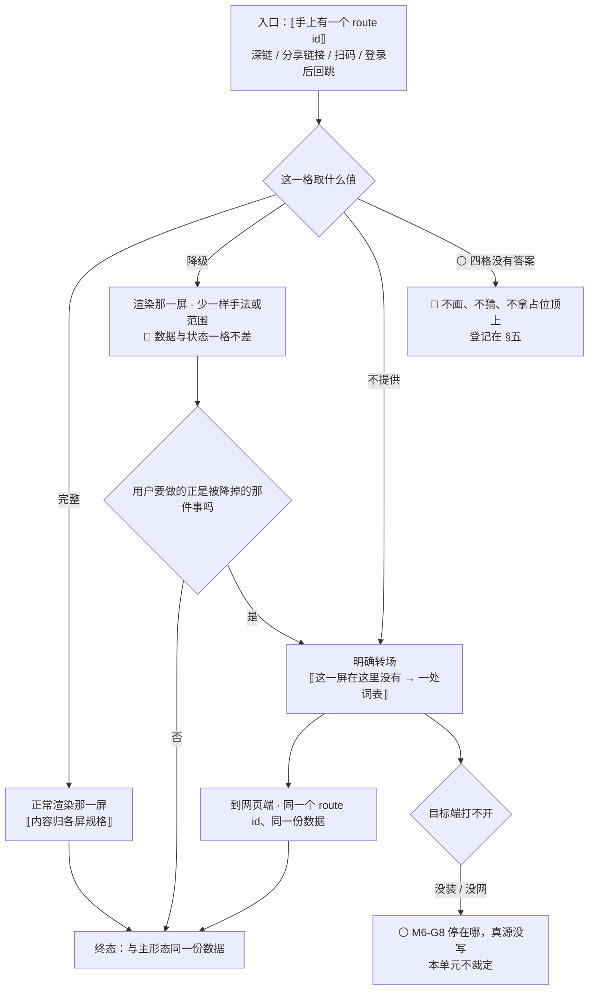

# U6.2 · 屏与端的能力矩阵

> **基线**：`origin/v1` @ `44320c9`，分支基线 `KUBI-76-S-ASK契约` @ `bcf9b62`，fetch 于 2026-09-03。
> **状态：活跃。** 矩阵改一格、任何一条降级路径变化、或某个端承接的屏数变化，本文同一次改动内更新。
> **上一层**：[M6 端与形态 · 域索引](INDEX.md)

---

## 一、这个子能力是什么、不是什么

**是**：十四屏 × 四端，逐格给出取值；并对**每一个不是「完整」的格子**给出它的降级路径。
⚠️ **2026-09-03 从十三屏变成十四屏**（新增 `S-ASK`，规格见 `模块地图` §三登记的 `U3.7`）。
`specs/` 侧十余处「十三屏」的表述**尚未跟上**，本单元是端矩阵的真源，按十四屏落；上游由产品改齐（`M3-G8`）。
按新结构，**端矩阵的真源在本单元**（这一条的由来见 §五 与域索引 §七 `M6-G1`）。

**不是**：
- 不是各屏的元素清单与界面长相 —— 那在各屏规格
- 不是端的技术选型与现状 —— 那在本域另一单元（清单见域索引 §四）
- 不是布局分档 —— 单列 / 双列在本域另一单元

**它要回答的只有两个问题**：这一屏在这个端上有没有；没有或弱的时候，用户从这里怎么走出去。

---

## 二、详细产品逻辑

### 2.1 每一格只有三种取值，三格之外没有第四格

| 取值 | 含义 |
|---|---|
| **完整** | 功能与主形态等价 |
| **降级** | 功能在，但弱于主形态，**并说明降的是什么** |
| **不提供** | 这个端没有这一屏或这一能力，**并说明为什么**，且**不在这个端做一个更弱的同名屏** |

🔴 **尤其没有「显示入口但点了提示去别处」这第四格** —— 那会让同一个地址在两个端指向两件事。
**唯一允许的转场是**：某个 route id 不在这个端的子集内时，解析成一次明确转场（`多端选型与端矩阵` §4.6.4）。
转场是**地址解析的结果**，不是一个假入口。

### 2.2 矩阵

**移动 App 一列的全部内容都建立在「未验」之上** —— 现状见本域另一单元，本表不重复。

| 屏 | 桌面壳（macOS / Windows） | 移动 App（iOS / Android） | Web / H5 | 微信小程序 |
|---|---|---|---|---|
| `S-HOME` 首页 | 完整。另有全局热键唤起采集屏 | 完整 | 完整 | **不提供** |
| `S-REC` 记一次 | 完整 | 完整 | 完整 | **降级** |
| `S-TL` 时间线 | 完整 | 完整 | 完整 | **降级** |
| `S-BLIND` 盲区总览 | 完整。多列 | 完整。单列 | 完整。宽屏多列 | **不提供** |
| `S-NODE` 考点详情 | 完整。右栏 | 完整。独立页 | 完整。独立页 | **不提供** |
| `S-TAG` 待补与手动挂载 | 完整。两栏 + 键盘选候选 | 完整。单栏覆盖层 | 完整。宽屏两栏 | **不提供** |
| `S-EXP` 导出与问 AI | 完整。保存对话框落地。⚠️ 令牌签发那一格悬空 | 完整。系统分享面板落地 | 完整。浏览器下载 | **不提供** |
| `S-LOGIN` 登录 | **降级**。微信登录不渲染 | 完整 | 完整 | 完整（原生） |
| `S-ACC` 账号 | 完整 | 完整 | 完整 | **降级** |
| `S-MERGE` 合并确认 | 完整 | 完整 | 完整 | **降级** |
| `S-BILL` 额度与购买 | ⚠️ 支付通道 🚧 待定 | 完整。iOS 走 Apple 内购 | ⚠️ 支付通道 🚧 待定 | **降级** |
| `S-SET` 设置 | 完整 | 完整 | 完整 | **降级** |
| `S-RAW` 原图管理 | 完整。无配额 | 完整。应用私有目录 | **降级**。存储弱 | **不提供** |
| `S-ASK` 问一下 | 完整 | 完整。⚠️ 发图那一格随本端原图通道 | **降级**。非安全上下文下发图入口不出现 | **不提供** |

### 2.3 缺格的降级路径 —— 一格一条，逐条闭环

**判据三条，缺一条就不算闭环：** ① 用户从这个格子出发有一条能走的路；② 那条路的终点是**同一份数据**；
③ 走过去这件事**在界面上说得出来**，不是靠用户猜。

| 格 | 降的是什么 / 为什么没有 | 降级路径 | 闭环 |
|---|---|---|---|
| `S-HOME` × 小程序 | 无独立首页 | 进入即历史列表 —— 三屏本身就是这个端的全部导航 | ✅ |
| `S-REC` × 小程序 | 只文字 + 录音，**不做拍照、不落任何原图字节** | 需要图片时引导到网页端 / 桌面端，**不在这个端补一个弱化版拍照** | ✅ |
| `S-TL` × 小程序 | 即三屏里的历史列表；无左滑删除（与系统返回手势冲突） | 删除走长按或行内按钮 —— 动作还在，手法换了（属「允许不一致」第 1 条） | ✅ |
| `S-BLIND` × 小程序 | 不在三屏内 | 明确转场网页端 | ✅ |
| `S-NODE` × 小程序 | 同上 | 同上 | ✅ |
| `S-TAG` × 小程序 | 同上 | 同上。⚠️ 另一份规格给这个端写了这一屏的布局与键盘方案，两边结论相反，见 §五 | ⚠️ 有冲突 |
| `S-EXP` × 小程序 | 不在三屏内 | 历史列表底部常驻一行，说清导出与问 AI 在网页版和桌面版上 | ✅ |
| `S-LOGIN` × 桌面壳 | 微信登录不渲染 | 手机号 + 验证码是主通道，在这个端上独立成立 —— 少的不是能力，是一条副通道 | ✅ |
| `S-ACC` × 小程序 | 只做身份与退出 | 设备列表与注销转网页端 | ✅ |
| `S-MERGE` × 小程序 | 撞号时不在本端合并 | 明确转场网页端，🔴 **不做弱化版合并** —— 合并不可逆，一个弱化版意味着用户在信息不全的情况下做不可逆决定 | ✅ |
| `S-SET` × 小程序 | 简化：无「原图管理」条目，「清空」不提图 | 这个端上没有原图，所以没有需要被降级的东西；文案跟着能力走，不反过来 | ✅ |
| `S-RAW` × 小程序 | 🔴 该端不开原图通道，整屏不存在 | **不需要降级路径**：这个端上不存在原图，也不出现原图字样 | ✅ |
| `S-RAW` × Web | 存储弱：按 origin 隔离、可被浏览器驱逐、用户清站点数据会一起清、隐私模式下不可用 | Web 专版常驻说明 + 一条可关闭提示。🔴 **必须点名「浏览器可能清理」**，只写「建议装桌面版」是推广不是告知 | ✅ |
| **`S-ASK` × 小程序** | 🔴 **整屏不存在。** 判据不是「这个端弱」，是**它的四个入口有三个在这个端上就不存在**（`S-BLIND` `S-NODE` `S-HOME` 全是「不提供」），而回答里的考点锚点终点也是 `S-NODE` —— **一个锚点全部指不回去的对话屏，等于把用户堵在半路**（§2.3 判据 ②③） | 明确转场网页端，与 `S-BLIND` `S-NODE` 同一条路 | ✅ |
| `S-ASK` × Web（非安全上下文） | 没有相机能力，且本端原图通道弱 | 发图入口**不出现**（不是灰掉）；打字与建议问法照常 —— 这一屏的主体本来就不是发图 | ✅ |
| `S-REC` × Web（非安全上下文） | 没有麦克风 / 相机能力 | 入口**不出现**（不是灰掉）；写与粘照常 —— `J2` 仍然走得通 | ✅ |
| `S-REC` × 桌面壳（无摄像头） | 相机入口不渲染 | 从相册选与手写照常；🔴 区分「没有相机权限」与「这台设备没有相机」两句话 | ✅ |
| `S-EXP` × Web（超大文件） | 全量在内存拼不动 | 分段降级 | ✅ |
| **`S-BILL` × 桌面壳 / Web** | **支付通道 🚧 待定** | 🔴 **没有降级路径** —— 通道没定，就没有「降到哪里」。登记成缺口，见 §五 | ❌ |
| **`S-BILL` × 小程序** | 微信虚拟支付；整屏压在备案与资质上 | 🔴 **降级路径不完整**：资质没到位时这一屏在这个端上是什么，没有答案。登记成缺口 | ❌ |
| **`S-EXP` 令牌签发 × 桌面壳** | 契约写死「在 Web 界面手动签发」，而这个端内嵌的就是同一份 Web 产物 | 🔴 **悬空** —— 既不是完整也不是不提供。**产品不自行放宽**，登记成缺口 | ❌ |

**三个 ❌ 就是本单元全部的缺口，`S-RAW` × 小程序那一格是它们的反面教材**：
它也是「不提供」，但它闭环 —— 因为这个端上**根本没有产生原图的入口**，没有东西需要被降级。
**一个格子缺不缺，看的不是它有没有屏，是它有没有把用户留在半路上。**

### 2.4 `J2` 那一行不许有缺格

矩阵里唯一一条**结构上不许出现「不提供」**的行是 `S-REC`。四个端都能走到 `已落本地`，这是 `I-1` 在端上的形态：

| 端 | `J2` 走得通吗 | 最弱情况下靠哪条入口 |
|---|---|---|
| 桌面壳 | ✅ | 手写 —— 不需要任何权限 |
| 移动 App | ✅（未验） | 手写 |
| Web | ✅ | 手写 —— 非安全上下文下麦克风与相机都没有，写与粘仍在 |
| 微信小程序 | ✅ | 文字采集 |

🔴 **「四个入口里至少有一个不需要任何权限」这条，在四个端上逐端成立。**
哪个端做不到，那个端就不能宣称自己承接 `J2`。

### 2.5 原图承诺在每个端成不成立 —— 这一列是红线的落点

**矩阵里 `S-RAW` 那一行不只是「有没有这一屏」，它是「原图只存在他自己的机器上」这条红线的逐端可行性表。**
概念层在 `设置与原图` 与 `原图存储：判据层与存储层`，跨端对照在 `无障碍与多端适配` §五，本单元只取产品结论：

| 端 | 承诺成立吗 | 界面上的处置 |
|---|---|---|
| 桌面壳 macOS | ✅ 成立 | 常驻说明；**不显示绝对路径、不给「在系统里显示」入口** |
| 桌面壳 Windows | ⚠️ 预期成立，待验 | 未验前不写死任何独有行为 |
| 移动 App | ✅ 成立，但卸载即删光、换机不保留 | 如实写这条端事实，不含糊成「安全保存」 |
| Web | ⚠️ 成立但弱 | Web 专版常驻说明 + 可关闭提示，🔴 必须点名「浏览器可能清理」 |
| 微信小程序 | 🔴 不成立 | **不开原图通道；没有这一屏；不出现原图字样** |

🔴 **不因为 Web 端弱就在 Web 端加「备份到云」的口子。** 弱是端的事实，加口子是破红线 —— **两件事不能拿来交换。**

---

## 三、前端行为意图 × 后端契约意图

| 事项 | 前端行为意图 | 后端契约意图 |
|---|---|---|
| 某一屏在本端不提供 | 由端自己解析 route id 子集，落成一次明确转场；**不渲染更弱的同名屏** | **无端点。** 🔴 不许服务端下发「这个端能看什么」的开关 —— 一个可下发的矩阵等于一个可以悄悄改的产品边界 |
| 降级提供 | 降的是手法或范围，不是数据；降级态在界面上说得出来 | 同一份 `/api/*` 语义。🔴 **不为降级端裁剪响应字段** —— 端少显示一样是端的事，不是契约的事 |
| `J2` 全端可达 | 四端都保留一条不需要任何权限的入口 | 写入语义与端无关：降级路径与正常路径落的是同一条记录 |
| 原图通道 | 不开原图通道的端上，采集入口里没有拍照这一项 | 🔴 该端不产生任何原图相关请求 —— 不是「请求了但被拒」，是**根本没有这条路径** |
| 骨架树在小程序 | 只渲染第 1 层 + 当前展开路径（手风琴），同一时间只展开一条 | 🚧 **产品意图，无契约行** —— 「按层取子树」这个能力没有对应契约（域索引 §七 `M6-G4`） |
| `S-BILL` 的端差异 | 受限态主入口是免费兜底；档位与额度由服务端返回，前端不硬编码 | 🚧 桌面壳与 Web 的支付通道**待定**；不同通道之间的价格一致性要有一处口径 |
| 令牌签发的端资格 | 不支持签发的端上降级为只读列表，**不整区隐藏** | 🔴 「哪个端能签发」是安全边界，必须在契约里说死，不由端自己解释 |

---

## 四、边界与红线在这里的具体形态

| 边界 | 在这一单元的形态 |
|---|---|
| **原图不上云不同步不共享** | 🔴 §2.5 整节。一个兑现不了承诺的端，处置是**不提供**，不是把承诺降级 —— 降级会污染其余三端 |
| 不存题干与机构内容 | 转场只搬 route id，不搬内容；一次转场不携带任何用户输入的原文 |
| 没有第四种反馈形态 | 🔴 「显示入口但点了提示去别处」这个第四格，本质是一种提醒机制 —— 它把一个不存在的能力做成一个会响的入口 |
| 不判断对错 | 矩阵里没有一格的取值依赖用户学得怎么样 |
| `I-1` 记录先落地 | §2.4 那一行。`S-REC` 是唯一不许出现「不提供」的行 |
| `I-4` 额度只碰外部模型调用 | `S-BILL` 在某个端上待定或不完整，**不许连带影响** `S-REC` / `S-BLIND` / `S-EXP` 三行的任何一格 |

🔴 **一条可断言的检查**：把矩阵里所有 `S-BILL` 的格子全部当作不可用，
`J2 → J3 → J5 → J6` 这条线在四个端上的取值**一格都不变**。变了，就说明付费墙已经渗进主链路。

---

## 五、缺口登记

| # | 缺口 | 缺的是哪一半 | 该谁定 |
|---|---|---|---|
| 🔴 1 | **`S-BILL` × 桌面壳 / Web：支付通道 🚧 待定** | 产品侧已定「受限态主入口必须是免费兜底」；**通道那一半空白**，因而这两格没有降级路径可写 | 技术同事 + 主体资质。**产品不拍通道** |
| 🔴 2 | **`S-BILL` × 小程序：整屏压在备案与资质上** | 缺的是「资质没到位时这一屏是什么」——不提供？降级？还是整屏不渲染？没有答案 | 同上 |
| 🔴 3 | **`S-EXP` 令牌签发 × 桌面壳：这一格悬空** | 契约写死「在 Web 界面手动签发」，而这个端内嵌的是同一份 Web 产物。既不是完整也不是不提供 | **放宽它是安全边界的变更，产品不自行放宽** |
| 4 | **`S-TAG` × 小程序：两份规格结论相反** | 一份给这个端写了这一屏的布局、树分层渲染与键盘方案；另两份限定这个端只三屏、这一屏转场。本矩阵取「不提供」，但两边正文没有被统一 | **产品裁定人**，本单元不改另一份规格 |
| 5 | **移动 App 整列建立在「未验」之上** | 缺的是实机验证，不是矩阵口径。整列的每一格现在都是「按 Web 同款推定」 | 技术侧 |
| 6 | 桌面壳**多窗口 🚧 未定** | 缺的是需求那半：任何「新开一个窗口放详情」的提议要先回答它服务哪个已成立的需求。原样登记，不自行判「不做」 | **产品**，未定 |
| 🔴 7 | **端矩阵的真源归属未被裁定** | `无障碍与多端适配` 自称冲突时以它为准，而它的矩阵有四格把内容派回各屏规格。**按新结构真源在本单元**，但那句自述没有被人改过 | **产品裁定人**。详见域索引 §七 `M6-G1` |
| `M6-G9` | **`S-ASK` 进矩阵之后，`specs/` 侧十余处「十三屏」没有跟上** | 缺的不是矩阵这一半（本单元已按十四屏落），缺的是上游那一半：`specs/INDEX.md:69`「十三屏,一屏不多」与屏幕表、`无障碍与多端适配` 的逐屏焦点表都还是十三。🔴 **本单元不改上游正文** | **产品**，同 `模块地图` §三登记的 `U3.7` 的 `M3-G8` |
| ⚪ `M6-G8` | **明确转场之后目标端打不开（没装 / 没网），用户停在哪** | 真源没有写明。§7.1 第 3 项与 §7.2 流程图末端的那个 ⚪ 就是这一条 —— 转场是本单元唯一会把用户交给另一个端的动作，交出去之后没有落点等于把人堵在原地（`线框与交互规格约定` §4.1「每一条失败边都必须落到一个有下一步的节点」）| **产品**，未定。本单元不裁定 |

---

## 六、线框

> 记号表与红线自查十条见 [线框与交互规格约定](../线框与交互规格约定.md)。
> 🔴 **本节不画 ASCII 屏，只用表。** 本单元不拥有任何一屏，它拥有的是**格子** ——
> 画一张屏就等于替那一屏的规格拍板，而各屏长什么样在各屏规格里。
> 面向用户的字符串一律 ⟦槽位⟧ + 真源指针（一处词表，见本域另一单元），组件只引锚。

### 6.1 「不提供」的七格：用户到了这一格看见什么

🔴 **先说清「怎么到的」**：这七格在本端**不渲染任何入口** —— 渲染了就是第四格（§2.1）。
用户到这里只有一条路：**他手上有一个 route id**（深链、别人分享的链接、扫码、登录后回跳），而它不在本端子集内。

| 格 | 怎么到这一格 | 这一格在界面上是什么 | 下一步能点什么 | 锚 |
|---|---|---|---|---|
| `S-HOME` × 小程序 | 该端启动 | **没有这一格**：进入即历史列表，三屏本身就是全部导航 | 历史列表逐行 | `C-LIST` |
| `S-BLIND` × 小程序 | route id 解析 | ⟦转场句·这一屏在这里没有 → 一处词表⟧ | ⟦去网页端⟧ | `C-EMPTY` **不用** |
| `S-NODE` × 小程序 | 同上 | 同上 | 同上 | 同上 |
| `S-TAG` × 小程序 | 同上 | 同上。⚠️ 两份规格结论相反，见 §五 第 4 条 | 同上 | 同上 |
| `S-EXP` × 小程序 | 同上 | 同上。另有历史列表底部一行 ⟦说明·导出与问 AI 在网页版和桌面版上⟧ | 同上 | —— |
| `S-RAW` × 小程序 | **到不了**：该端没有产生原图的入口 | 🔴 **整屏不存在，也不出现原图字样** | —— | —— |
| `S-ASK` × 小程序 | route id 解析 | 同 `S-BLIND` 那一格。🔴 **不做一个只能打字的弱化版对话框** —— 它每一句回答的落点都是「点进这个考点」，而那一屏在这个端上不存在 | ⟦去网页端⟧ | 同上 |

🔴 **底部那一行是说明不是按钮。** 一旦做成可点的，它就变成「显示入口但点了提示去别处」——
那正是 §2.1 判掉的第四格。**说明行陈述事实，入口承诺能力，两者不能互相假扮。**

### 6.2 「降级」的九格：界面上换掉了什么

| 格 | 降的是什么 | 界面上少了 / 换了什么 | 用户那个动作还在不在 |
|---|---|---|---|
| `S-REC` × 小程序 | 采集手段 | 只剩 ▢ ⟦写⟧ 与 🎤 ⟦说⟧ 两个入口；🔴 **没有拍照，也不做弱化版拍照** | 记一笔在 —— 这是唯一不许缺的一行 |
| `S-TL` × 小程序 | 删除的手法 | 无左滑（与系统返回手势冲突），删除改行内按钮或长按 | 删除在，手法换了 |
| `S-ACC` × 小程序 | 范围 | 只留身份与退出两行；设备列表与注销两行不渲染 | 那两件事转场网页端 |
| `S-MERGE` × 小程序 | 整屏 | 撞号时不在本端渲染合并；🔴 **不做弱化版合并** —— 合并不可逆，信息不全就按下去是最贵的一种降级 | 合并在网页端 |
| `S-SET` × 小程序 | 条目 | 无「原图管理」条目，清空那一条不提图 | 🔴 这个端没有原图，**没有需要被降级的东西**；文案跟着能力走 |
| `S-BILL` × 小程序 | ⚪ 见 §6.3 | ⚪ | ⚪ |
| `S-LOGIN` × 桌面壳 | 一条副通道 | 微信登录那一格**不渲染**（不是灰掉） | 手机号 + 验证码是主通道，在这个端上独立成立 |
| `S-RAW` × Web | 存储强度 | 专版常驻说明 + 一条可关闭提示，🔴 **必须点名「浏览器可能清理」** | 整屏在；🔴 不因为弱就加「备份到云」的口子 |

| `S-ASK` × Web | 一样手法：发图 | 非安全上下文下 📷 那一格**不出现**（不是灰掉）；打字与三条建议问法照常 | 问一下在 —— 🔴 这一屏的主体本来就不是发图 |

**另有三格是环境条件触发的，不在矩阵上但落在同一条判据里**：
`S-REC` × Web 非安全上下文（麦克风与相机入口**不出现**，写与粘照常）、
`S-REC` × 桌面壳无摄像头（相机入口不渲染，🔴 区分「没有相机权限」与「这台设备没有相机」两句话）、
`S-EXP` × Web 超大文件（分段降级）。**三格的处置都是「入口不渲染」，不是「灰掉再解释」。**

### 6.3 四个没有答案的格子：本节不画

| ⚪ 格 | 为什么不画 |
|---|---|
| `S-BILL` × 桌面壳 / Web（两格） | 支付通道 🚧 待定 → **没有「降到哪里」，也就没有界面形态** |
| `S-BILL` × 小程序 | 整屏压在备案与资质上；资质没到位时这一屏是什么，没有答案 |
| `S-EXP` 令牌签发 × 桌面壳 | 既不是完整也不是不提供。🔴 **放宽它是安全边界的变更，产品不自行放宽** |

🔴 **不许拿一张「敬请期待」把空白填上** —— 那是一个会响的入口承诺一个不存在的能力，
和第四格是同一件事。四格已在 §五 登记，本节只标 ⚪。

### 6.4 红线第 9 与第 10 条在本单元的落点

| 红线 | 数出来的结果 |
|---|---|
| 第 9 条 · 原图的分享 / 导出 / 同步入口 | 上面两张表里**一处都没有**；`S-RAW` × Web 那一格加的是**告知**，不是备份口子 |
| 第 10 条 · 三处必须出现的东西 | 三处落在原图那两屏（见 `模块地图` §三登记的 `U8.3` `U8.4`）。逐端：三端齐全不弱化；🔴 小程序**没有主语**，不出现这三处也不留空壳 |

---

## 七、交互规格

### 7.1 必答五项

| # | 项 | 本单元的答案 |
|---|---|---|
| 1 | **入口** | 🔴 **不是从某个入口点进来的。** 本端不渲染「不提供」那些屏的入口（渲染了就是第四格）。本单元被触达只有一类方式：**用户手上有一个 route id 而它不在本端子集内** —— 深链、别人分享的链接、扫码、登录后回跳（`P-NAV`）。降级格则是从本端**正常导航**进去的，用户不会先知道自己进的是降级格 |
| 2 | **结束状态** | 本单元**不拥有任何状态**。终态两条：① 转场后，用户在另一个端上看到**同一个 route id 的那一屏**，落的是同一份数据；② 降级格上，主轨四态与 `TS-00`–`TS-09` 的取值与主形态**一格不差** —— 降的是手法或范围，🔴 **不是数据** |
| 3 | **失败落点** | ① 转场的目标端打不开（没装 / 没网）→ ⚪ `M6-G8` **真源没有写明用户停在哪**，本节不裁定，已登记在 §五；② 降级格上用户要做的正是被降掉的那件事（要拍照 / 要合并）→ 停在本端，🔴 **不给弱化版**，下一步是同一条转场；③ §6.3 那四格 → **没有失败落点可写**，因为连正常落点都没有 —— 这就是缺口的形状 |
| 4 | **空态** | 🔴 **缺格不是空态，`C-EMPTY` 不用于转场那一格。** 空态是「这里本该有东西，现在没有」，转场是「这里从来就没有这一屏」；用同一个组件会让用户以为等一等就有了。降级格上那一屏自己的空态归那一屏的规格，不归本单元 |
| 5 | **错误态** | 本单元不发起任何请求，`C-ERR` 在这里不出现。唯一容易被错当成错误的是 `S-RAW` × Web：浏览器清掉了图 —— 🔴 **那是端事实不是错误态**，用专版常驻说明讲出来，必须点名「浏览器可能清理」 |

**受限态**：`S-BILL` 相关四格全部 ⚪。已定的只有一条：受限态主按钮永远是免费兜底（`C-LIMIT`、`C-BTN`）。
🔴 把矩阵里所有 `S-BILL` 格当作不可用，主链路四端取值**一格不变**（§四）。
**离线态**：与端矩阵正交 —— `C-OFFLINE` 细条在四端都在，取值与格子无关。

**[契约缺]**：🔴 **端矩阵不许有契约行** —— 一个可下发的矩阵等于一个可以悄悄改的产品边界。
唯一必须写进契约的是「哪个端能签发只读令牌」，而它现在 ⚪ 悬空（§五 第 3 条）；界面这一侧需要后端能区分的只有两档：**这个端能不能签发**。止于此。

### 7.2 交互流程

