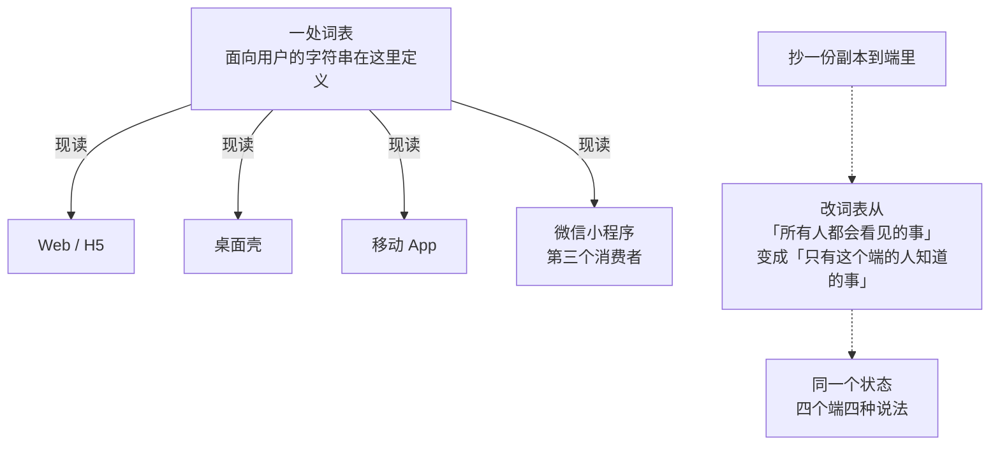
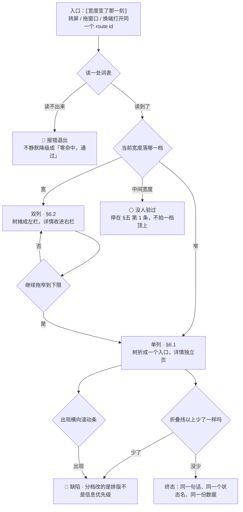

# U6.3 · 响应式与跨端一致性

> **基线**：`origin/v1` @ `73041df`，fetch 于 2026-09-02。
> **状态：活跃。** 布局分档增删、折叠优先级变化、「允许不一致清单」增删一条、或词表消费方增加，本文同一次改动内更新。
> **上一层**：[M6 端与形态 · 域索引](INDEX.md)

---

## 一、这个子能力是什么、不是什么

**是**：两件事。① 同一屏在不同宽度下**先折叠什么**；② 同一件事在不同端上**哪些必须一样、哪些允许不一样**，
以及靠什么机制保证那些「必须一样」的真的一样。

**不是**：
- 不是断点数值与视觉 —— 具体的断点、色板、间距、字号在实现与设计侧，本单元只给「每一档长什么样」
- 不是各屏的元素清单 —— 那在各屏规格
- 不是哪一屏在哪个端有 —— 那在本域另一单元（清单见域索引 §四）

**它要回答的只有两个问题**：宽度变了先牺牲什么；端换了什么绝对不许变。

---

## 二、详细产品逻辑

### 2.1 三档形态，不是三种屏

| 档 | 形态 | 谁落在这一档 |
|---|---|---|
| **单列** | 全部内容纵向堆叠，无左右分栏 | 移动 App、窄屏 Web、窗口缩到最小的桌面壳 |
| **双列** | 左导航 / 树 + 右详情 | 桌面壳默认、宽屏 Web |
| **三列** | 左树 + 中列表 + 右详情 | 🚧 超宽屏预留，**当前没有一屏真用三列**。不要为了对称硬造第三列 |

**档是宽度的函数，不是端的函数。** 桌面壳缩到最小就是单列，宽屏 Web 就是双列 ——
「桌面版 = 双列」这种说法一旦写进任何一份文档，窗口缩小时就没人知道该怎么办。

### 2.2 各屏在各档下先折叠什么

**这张表定的是信息优先级，不是排版。** 每一行的「折叠优先级」回答的都是同一个问题：宽度不够时**先牺牲谁**。

| 屏 | 单列 | 双列 | 先折叠什么 |
|---|---|---|---|
| `S-BLIND` | 摘要 → 先补这几个 → 出口，全部纵向 | 左树 + 右详情 | 先把「按章看全部」折成一个入口，详情变独立页 |
| `S-NODE` | 独立页，底部固定条三动作纵向 | 桌面壳里是右栏 | 200% 字体时底部三动作改可滚区 |
| `S-TAG` | 单栏，树选择器全屏覆盖 | 左记录卡 + 右候选 / 树，树**不做覆盖层做右栏** | 先折候选的章节路径，再折「看看丢掉的」入口 |
| `S-EXP` | 四个区纵向 | 同单列 —— **四个区的顺序是产品判断，不分栏** | 回答区区内独立滚动 |
| `S-HOME` | 主按钮 + 三快捷横排 | 同单列 | 三快捷放不下时换两行，**不做横滑** |

**`S-EXP` 那一行要单独说**：它在双列下仍然是单列，因为四条出口的顺序本身是一条产品判断
（免费路径必须在付费路径之上）。**分栏会把「上下」变成「左右」，而左右没有优先级。**

🔴 **一条不变量贯穿三档**：任何一屏在任何一档，**折叠线以上必须完整看到的那几样，不因分档而少一样**。
分档改变的是排版，不是信息优先级。

### 2.3 三种极端的降级

| 极端 | 降级 |
|---|---|
| **横屏（移动）** | 单列照常；采集的拍照与录音允许横屏，文字输入不强制横屏；安全区按横屏重算 |
| **平板** | 它不是端，是一组断点。**中间宽度落在哪一档没有人验过**，本单元不写死任何平板独有行为（缺口，见 §五） |
| **窗口缩到最小** | 双列退成单列，🔴 **不许出现横向滚动条**；左栏拖到下限自动切单列 |

**「不许出现横向滚动条」是行为不是审美**：横向滚动会把「折叠线以上」这个概念整个作废 ——
一样东西在屏幕外和被折叠起来，对用户是两回事，前者他不知道它存在。

### 2.4 🔴 面向用户的字符串：一处词表，多处消费

**这是防止同一个状态在四个端上冒出四种说法的唯一机制。**



四条规矩，缺一条这个机制就不成立（`多端选型与端矩阵` §4.5）：

| # | 规矩 | 为什么 |
|---|---|---|
| 1 | **只有一处定义** | 两处定义的第二处一定先过期，而最先过期的一定是最不常被读的那一处 |
| 2 | **各端现读，不抄副本** | 抄一份，「改词表」就从一件所有人都会看见的事，变成一件只有那个端的人知道的事 |
| 3 | **读不出来时报错退出** | 🔴 **不静默降级成「零命中，通过」** —— 一个静默通过的检查等于没有检查 |
| 4 | **新端是第三个消费者，规矩不变** | 一个端要接进来，接的是同一份词表，不是「先抄一份以后再统一」 |

**这条机制管的不只是措辞，还有边界。** 边界句、十态徽标文字、禁用原因、错误文案都在词表里 ——
一个端如果能有自己的一份，那个端就能有自己的一条边界。

### 2.5 必须一致的四样（不一致 = 缺陷）

| 维度 | 要求 |
|---|---|
| **文案** | 同一句话不许有两个版本。尤其：错误文案、空态文案、原图常驻说明、禁用原因、十态徽标文字 |
| **状态** | 同一条记录的标签状态、同一个订单的界面态、同一屏的四种态，在各端**同名同义**（状态名取自 L2 总表 §四） |
| **错误表现** | 同一个错误码映射到同一句界面文案；`/api/*` 在任何端返回同一份语义 |
| **数据结果** | 同一条记录、同一个盲区数字、同一份导出文件，**字节级一致** |

**「数据结果字节级一致」这条是四条里最硬的**：它意味着导出文件的字段清单跨端相同 ——
某个端少一列，那个端的用户拿到的就不是他的全部数据，而「你的数据是你的」这句话在那个端上就是空话。

### 2.6 允许不一致的四样

**不在这张清单里的差异，一律算缺陷。**

| # | 允许不一致的维度 | 不一致到哪为止 |
|---|---|---|
| 1 | **交互手法** | 同一动作，桌面用点击 + 键盘、移动用点击 + 手势、Web 用点击。**手法可不同，结果与文案必须同** |
| 2 | **布局** | 单列 / 双列 / 三列随宽度变；**信息优先级不变** |
| 3 | **系统级组件** | 保存对话框 / 分享面板 / 浏览器下载 / 系统选择器 —— 用系统原生的地方，形态随系统 |
| 4 | **系统的「端事实」** | 存储持久性、后台定时器能不能跑、有没有配额 —— 如实不同，但🔴 **界面必须把「不同」说出来，不许假装一致** |

**清单之外的差异，举三个都是缺陷的例子**：桌面壳与 Web 的错误文案不同；某个端的历史列表比别的端少一行；某个端把某个标签状态换了个说法。

### 2.7 两条跟着清单走的硬规矩

| # | 规矩 | 理由 |
|---|---|---|
| 1 | 🔴 **能兑现的端可以说「到点就处理，不用你打开」，兑现不了的端不许用同一句话** | 这对用户是**变好**的，不许为了统一而抹平。统一的代价是让能兑现的端也说得含糊 |
| 2 | 🔴 **脚手架阶段不得出现「能看到但按不动」的承诺** | 要么屏蔽入口，要么标「脚手架 · 未实现」。一个显示着承诺却没实现的界面是在说假话 |

**这两条合起来是同一条**：**一致性服从诚实，不是反过来。**
当「四端说法统一」与「这个端确实做不到」冲突时，永远保留后者，把差异如实说出来。

---

## 三、前端行为意图 × 后端契约意图

| 事项 | 前端行为意图 | 后端契约意图 |
|---|---|---|
| 布局分档 | 由宽度决定，不由端决定；每一档的折叠优先级固定 | **无端点。** 🔴 不许服务端下发布局或分档 —— 一个可下发的版式等于四个端可以各自漂移 |
| 面向用户的字符串 | 各端**现读**同一份词表；读不出来报错退出，不静默通过 | 构建期资产，非端点。契约侧的要求是：**错误码的语义足够窄**，窄到端不需要自己编一句话去解释它 |
| 状态名 | 十态徽标文字在所有端、所有尺寸形态里逐字相同；不做同义变体 | 状态只以码传递，🔴 **不下发展示文本** —— 下发了就等于词表有了第二处定义，而且是运行期的那处 |
| 错误码映射 | 一个码一句话，四端相同 | **不为某个端加专用错误码**；同一个失败在任何端返回同一个码 |
| 数据结果 | 导出与盲区数字不因端而变 | 🔴 同一份数据字节级一致；不为「弱端」裁剪字段 |
| 端事实的差异 | 界面把差异说出来（存储弱、定时器不保证、有配额） | 后端**不依赖任何端上定时器**；到期语义自己成立 |
| 骨架树的分档渲染 | 窄端只渲染当前一条路径（手风琴），**这个差异不抹平** —— 抹平会让宽端也退化 | 🚧 **产品意图，无契约行**：「按层取子树」没有对应契约（域索引 §七 `M6-G4`） |

---

## 四、边界与红线在这里的具体形态

| 边界 | 在这一单元的形态 |
|---|---|
| 不判断对错 | 词表是边界的执行装置之一：禁用词的检查依赖「只有一处定义」。多一份副本，就多一处扫不到的地方 |
| 不生成标签文本 | 十态徽标文字来自词表，端不许各自意译；意译等于在端上生成了标签文本 |
| 不存题干与机构内容 | 折叠与分档只改变什么被看见，不改变什么被存下来；没有任何一档会因为「空间够」而多显示一类内容 |
| 原图不上云不同步不共享 | 原图常驻说明属「必须一致」的文案，但**兑现不了的端用专版说明**——专版不是第二个版本，是把端事实说出来（§2.6 第 4 条） |
| 没有第四种反馈形态 | 🔴 「空间够了就多放点东西」是第四种反馈形态最常见的入口：宽屏上多一个提示条、多一个引导气泡。**宽度不是新增提醒的理由** |

🔴 **一条可断言的检查**：把任意两个端的同一屏并排，逐句对文案 —— 除「允许不一致清单」四类外，
出现任何一处措辞差异，就是缺陷。这条检查不需要工具，**但它需要词表只有一处**，否则无从对起。

---

## 五、缺口登记

| # | 缺口 | 缺的是哪一半 | 该谁定 |
|---|---|---|---|
| 1 | **平板的中间宽度落在哪一档，没有人验过** | 缺的是一个实测数。🔴 **不许自己拍一档顶上** —— 拍错了会让一整类设备落在为别的宽度设计的版式里 | 技术侧按实测给 |
| 2 | 树 / 长列表多大切虚拟滚动，没有实测数 | 缺的是数，不是口径。当前只能给「形态分档」，给不出阈值 | 技术侧 |
| 3 | 小程序端树渲染与包体、首屏时间没实测 | 手风琴这一条的体感边界悬空 | 技术侧 |
| 4 | 三列档**当前没有一屏真用** | 缺的不是实现，是**需求**：没有任何一屏需要三列。原样登记为预留，不自行判「删掉」，也不为了对称去造一个 | **产品**，未定 |
| 5 | 「按层取子树」没有契约行 | 产品意图已定；契约侧空白 | 技术同事 |

---

## 六、线框

> 记号表与红线自查十条见 [线框与交互规格约定](../线框与交互规格约定.md)。
> **本单元不画一屏，画的是同一屏在两种宽度下的区块重排。** 取 `S-BLIND` 作样本，因为它是三档差异最大的一屏。
> 🔴 **框里一个字的界面原文都没有** —— 面向用户的字符串一处词表、多处消费（§2.4），
> 线框摆的是槽位，原文向词表要；区块结构向各屏规格要（见 `模块地图` §三登记的 `U3.2` `U3.5`）。

### 6.1 窄（单列档 · 屏宽 40 个半角字符）

```
┌────────────────────────────────────────┐
│ ⟦科目切换器⟧  ← C-DISC                 │  ※1
├────────────────────────────────────────┤
│ ⟦摘要·共 {n} / 碰过 {a} / 没碰过 {b}⟧  │  ※2
│ ⟦归档计数 {c}⟧   ⟦未分类 {d} 条⟧       │  ※3
├────────────────────────────────────────┤
│ ⟦排序·按 {口径名} 排⟧  ← C-PICK        │  ※4
│ ⟦筛选段控⟧  ← C-DISC                   │
├────────────────────────────────────────┤
│ ⟦列表行·考点名 + 骨架事实 + 我的事实⟧  │  ※5
│ ⟦…⟧                                    │
│ ‹ ⟦看更多⟧ ›                           │
├────────────────────────────────────────┤
│ [ ⟦按章看全部⟧ ]  ← 折成一个入口       │  ※6
│ ‹ ⟦我已经会了⟧ ›                       │  ※7
└────────────────────────────────────────┘
```

※1 三档共用同一个切换器，位置固定在最上 —— **它是这一屏的口径开关，换位就是换口径的可发现性**
※2 🔴 三个数是「共几个 / 碰过几个 / 没碰过几个」，**不是一个百分比，也不是一个进度环**（红线第 5 条）
※3 归档计数**常驻可见**，不因为窄而折起来（`I-6`）；未分类那一行同理
※4 ⟦按 {口径名} 排⟧ 是**排序不是建议** —— 它说的是按什么排，不说该先做哪个（红线第 2 条）
※5 整行合读，一行装三件事；🔴 行里没有分数、没有星级、没有置信度（红线第 1、8 条）
※6 单列时「按章看全部」**折成一个入口**，树本身变独立页
※7 断言入口留在最下；🔴 它不是「完成度」，按下去不加任何分（红线第 4、5 条）

### 6.2 宽（双列档 · 这一张宽 64 个半角字符）

```
┌────────────────────────────────────────────────────────────────┐
│ ⟦科目切换器⟧  ← C-DISC                                         │
├────────────────────────────┬───────────────────────────────────┤
│ 左栏 · ⟦按章看全部·骨架树⟧ │ 右栏 · ⟦考点详情⟧                 │
│  ▸ ⟦第 1 层节点⟧           │  ⟦骨架事实⟧                       │
│  ▾ ⟦展开的那条路径⟧        │  ⟦我的事实⟧                       │
│    ⟦子节点⟧                │  ⟦记录列表逐行⟧                   │
│ ⟦归档计数 {c}⟧             │  ‹ ⟦我已经会了⟧ ›                 │
│ ⟦未分类 {d} 条⟧            │                                   │
└────────────────────────────┴───────────────────────────────────┘
```

※8 宽屏把「按章看全部」从一个入口**摊开成左栏**，详情从独立页**收进右栏** —— 这是排版换位，不是新增内容
※9 🔴 **宽屏上没有多出来的东西**：没有提示条、没有引导气泡、没有小红点。**宽度不是新增提醒的理由**（§四）
※10 🔴 拖到下限自动切回单列，**不许出现横向滚动条** —— 屏幕外和被折叠起来对用户是两回事

### 6.3 哪些区块允许换位、哪些不许

| 区块 | 允许换位吗 | 判据 |
|---|---|---|
| 左树 ⇄ 单列下的一个入口（※6 / ※8） | ✅ 允许 | 属「允许不一致」第 2 条：布局随宽度变，**信息优先级不变** |
| 详情：独立页 ⇄ 右栏 | ✅ 允许 | 同上 |
| 列表行内三件事的先后（考点名 → 骨架事实 → 我的事实） | 🔴 **不许** | 换序会改变这一行在说什么；它是朗读模板的顺序，两端不一致即缺陷 |
| 科目切换器的位置（※1） | 🔴 **不许** | 它是口径开关，藏起来等于让用户看不见自己在看哪个科目 |
| 摘要三个数的先后（※2） | 🔴 **不许** | 三个数守恒，顺序即口径 |
| 归档计数 / 未分类行（※3） | 🔴 **不许折叠**，位置可随分栏移动 | 常驻可见是已定的产品结论，不因窄而例外 |
| `S-EXP` 四条出口的上下顺序 | 🔴 **不许**，且不许分栏 | 免费路径必须在付费路径之上；**分栏会把「上下」变成「左右」，而左右没有优先级**（§2.2） |
| 折叠线以上必须完整看到的那几样 | 🔴 **不许少一样** | 一条不变量贯穿三档（§2.2）；`S-HOME` 是唯一有硬约束清单的那一屏 |

### 6.4 红线第 5 条特别数一遍

两张框里**没有**：进度环、百分比、完成度条、连续天数、徽章、小红点、未读计数、倒计时、置信度。
🔴 覆盖度在这里只以「共几个 / 碰过几个 / 没碰过几个」出现 —— **呈现成分数就是在打分，换控件不换口径等于没修。**

---

## 七、交互规格

### 7.1 必答五项

| # | 项 | 本单元的答案 |
|---|---|---|
| 1 | **入口** | 🔴 **没有「切换布局」这个入口。** 档是宽度的函数，不是用户的选项，也不是端的选项。它被触发于三类时刻：转屏、拖窗口改宽、换一个端打开同一个 route id。深链与登录后回跳（`P-NAV`）落在哪一档，同样只由当时的宽度决定 |
| 2 | **结束状态** | 本单元**不拥有任何状态**。终态两条：① 任一档下，折叠线以上必须完整看到的那几样**一样不少**；② 同一条记录在任意两端的主轨四态与 `TS-00`–`TS-09` 徽标文字**逐字相同**，同一份导出字节级一致 |
| 3 | **失败落点** | ① 词表读不出来 → 🔴 **报错退出，不静默降级成「零命中，通过」**；用户遇到的是启动失败，不是一个悄悄少了几句话的界面；② 中间宽度落在哪一档没人验过 → ⚪ 停在 §五 第 1 条，🔴 **不许自己拍一档顶上**；③ 双列拖到下限 → 自动退成单列，🔴 **不许出现横向滚动条** |
| 4 | **空态** | 空态的内容归各屏规格，本单元只加一条约束：**空态文案属「必须一致」的四样**，同一个成因在四个端**逐字同一句**。🔴 **多成因就是多张空态，窄屏也不许合并成一句** —— 宽度不是合并理由（`C-EMPTY`） |
| 5 | **错误态** | 同一个错误码在四端映射到同一句话；有缓存时是**陈旧数据态不是错误态**（`C-ERR`）。🔴 **反馈形态由错误的性质决定，不由宽度决定** —— 不许窄屏用 Toast、宽屏用页内提示（`C-TOAST` / `C-INLINE`） |

**受限态**：受限态的主按钮永远是免费兜底（`C-LIMIT`、`C-BTN`），🔴 **这条在任何一档都成立** —— 窄屏放不下不是把免费兜底折起来的理由。
**离线态**：`C-OFFLINE` 在三档里都是顶部一条细条。🔴 **不许因为窄就把它变成一个角标** —— 角标是第四种反馈形态。

**[契约缺]**：本单元**不需要、也不许有端点**：🔴 服务端不下发布局、不下发分档、不下发展示文本（下发了词表就有了第二处定义，而且是运行期那一处）。界面这一侧需要后端能区分的只有一样：**错误码窄到端不需要自己编一句话去解释它**。止于此。

### 7.2 交互流程


