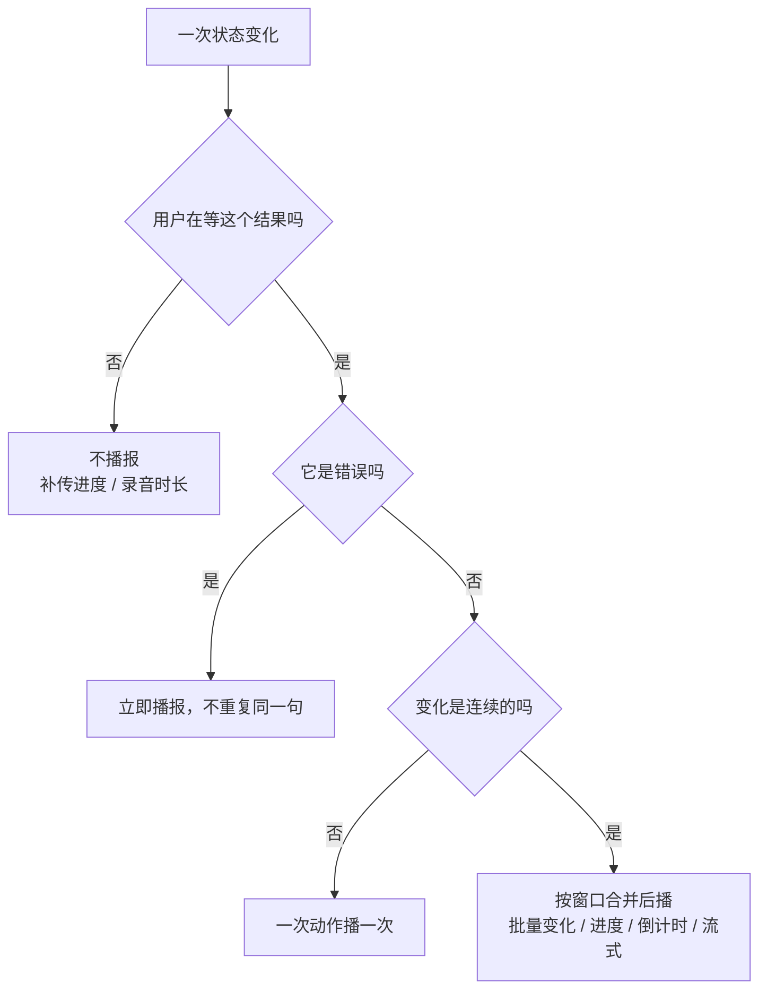
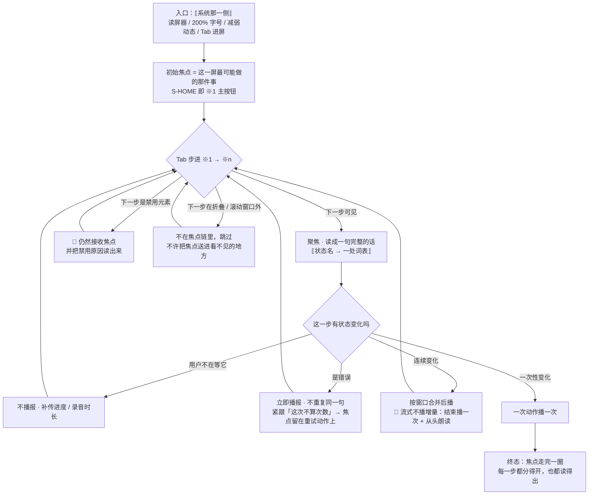

# U6.4 · 无障碍下限

> **基线**：`origin/v1` @ `73041df`，fetch 于 2026-09-02。
> **状态：活跃。** 下限总表改一条、播报节流规则变化、颜色载体表增删一行、或键盘不可达清单增删，本文同一次改动内更新。
> **上一层**：[M6 端与形态 · 域索引](INDEX.md)

---

## 一、这个子能力是什么、不是什么

**是**：把「能不能点到、能不能读到、会不会被动画打断」写成一份可检查的下限，
并说清四件在这个产品里特别容易做错的事：焦点去哪、数字怎么被读出来、状态变化什么时候播报、颜色之外靠什么区分。

**不是**：
- 不是视觉规格 —— 色板、间距、字号、圆角在设计侧。本单元出现的数值全部是**可访问性下限**与**时间阈值**，
  它们决定行为，不决定风格（`无障碍与多端适配` §十七 第 7 条对此有过一次自查）
- 不是各屏的逐元素朗读文本 —— 那在各屏规格的元素清单里
- 不是用户听到的原句 —— 本层只写「它必须说清哪件事」，不写它逐字怎么说

**它要回答的只有一个问题**：这一屏在什么条件下算「用不了」，而不是「难用」。

🔴 **下限是下限，不是加分项。** 任何一屏都不许以「这一屏简单」为由把它简化掉。

---

## 二、详细产品逻辑

### 2.1 下限总表

| # | 项 | 下限 | 可检查判据 |
|---|---|---|---|
| 1 | **最小点击热区** | 44×44 逻辑像素；列表条目整行是热区 | 任一可点元素的热区（含透明扩展）小于下限即不合格。缩略图、批量态圆点、文字链都算在内 |
| 2 | **文本对比度** | 正文与背景 ≥ 4.5:1；**次要入口不许降到这个值以下** | 逐屏用取色工具核一遍 |
| 3 | **动态字体放大** | 100%–200%，**不裁字、不缩字号、不横向溢出** | 系统字号拉到 200%，逐屏看：无截断、无重叠、无横向滚动 |
| 4 | **焦点可见性** | 键盘焦点必须有可见轮廓，**不能只靠颜色变化** | `Tab` 走一遍焦点链，每一步焦点清晰可见 |
| 5 | **动画可关闭** | 跟随系统「减弱动态效果」 | 打开该系统开关后，门的出现、滑入、抖动全部降级为直接出现 / 淡入或取消 |
| 6 | **超时可延长** | 不存在「必须在 N 秒内点完否则消失」的不可恢复内容 | 全产品唯一一处「只此一次可见」的内容（令牌明文）🔴 **不做倒计时自动关闭** |

**第 6 条要说清它为什么不是形式条款**：Toast 两秒消失不算违反 —— 它承载的信息在别处仍能拿到。
**判据是「消失之后还拿不拿得回来」，不是「停留多久」。**

### 2.2 200% 字体下的降级顺序

**三条，按顺序执行**：① 横向多栏 → 纵向单列；② 一行多格数字 → 每格独立一行、读成完整句子；
③ 底部固定条 → 动作纵向排，超过屏高三分之一改可滚动。

🔴 **禁止在 200% 下做的四件事**：缩字号；把数字与它的单位分到两行；把令牌明文换行断开；把常驻说明折叠成一个「展开查看」。

**第四条是红线的执行装置**：常驻说明里写的是原图去向这类边界事实。
**把它折起来，就等于在大字号用户那里把边界收起来了** —— 而大字号用户恰恰最需要它。

### 2.3 焦点

**三条原则，逐屏的焦点链按它们推导，不各自发明**：

| 原则 | 内容 |
|---|---|
| 进屏后落在哪 | 落在**这一屏用户最可能要做的那一件事**上：能记就落在记的入口，是详情就落在返回，是列表就落在第一行；空态时落在空态给出的那个动作 |
| 从别处推进来时 | 落在**用户来这里要看的那一段**，不让他从头 Tab 十几次 |
| 门与浮层 | 焦点被困在里面，关闭后回到触发它的元素 |

**四条通用规则（所有屏）**：

1. 焦点不许跳进不可见区域 —— 折叠的树节点、虚拟滚动窗口外的行不在焦点链里；
2. 浮层打开时焦点锁在浮层内，关闭后回到触发元素；
3. 骨架占位不可聚焦，但整个区域朗读一次「正在加载」这一件事；
4. 🔴 **禁用元素仍然接收焦点，并把禁用原因读出来** —— 跳过去的按钮等于没解释为什么不能点。

**两条容易被异步刷新破坏的**：点击后焦点不丢失，留在按钮上或移到结果区；
🔴 **轮询刷新不夺走焦点、不重建 DOM** —— 一次后台刷新把焦点打回页首，键盘用户就得重走一遍。

### 2.4 朗读：每个数字都要还原成一句完整的话

🔴 **总规则：屏幕上的每个数字都必须能被读成「有没有 / 几次 / 多久前」中的一句，不是一串孤立的数。**

| 场景 | 不合格 | 合格 |
|---|---|---|
| 首页两个计数 | 两个孤立数字连读 | 连成一句，说清各是什么 |
| 盲区摘要三个数 | 三个数连读 | 一句话说清总数、碰过多少、没碰过多少 |
| 列表行 | 名字 + 数字 + 状态词拼在一起 | 一句话说清考点名、骨架事实、我的事实，并给出进入方式 |
| 树节点 | 名字 + 分数形式 | 说清名字、层级、展开与否、这一层碰过多少 / 共多少 |
| 数字与单位 | 数字与单位分成两处读 | 连在一起读，也连在一起排（§2.2 第二条禁令） |

**三条通用规则**：

1. **手机号按打码形态朗读** —— 屏幕上不打码，朗读打码；
2. **状态要念出来，不靠视觉** —— 徽标文字本身就是朗读文本，附加态另有各自的说法；
3. 🔴 **危险操作在朗读文本里就带「不可撤销」，不等浮层才说** —— 读屏用户是在**听列表**，点下去才知道危险就晚了。

**另两条**：装饰性图标不朗读，承载信息的图标必须有文字替代；错误提示与它的控件要程序关联，不只是视觉上放在下面。

### 2.5 状态变化的播报与节流

**读屏器用户看不到徽标、颜色、细条的变化，所以变化必须播报；但播报不许每秒一次。**



| 变化 | 播报 | 节流 |
|---|---|---|
| 加载中 | 骨架区朗读一次 | 只一次 |
| 成功 | 礼貌播报 | 一条动作一次 |
| 错误 | 立即播报 | 不重复同一句 |
| 倒计时 | 变化时播报 | **每 10 秒一次，最后 3 秒不再播**（用户已经在等） |
| 批量状态变化 | 礼貌播报 | **2 秒窗口内合并成一条** |
| 删除进度 | 礼貌播报 | **每 10% 播一次** |
| 补传进度 | **不播报** | 焦点与计数已经表达；只在完成时播一次 |
| 录音 | 开始与结束各一句 | 时长不播报 —— 波形与计时是视觉的 |
| 流式返回 | 🔴 **不播报增量** | 每收到一段可选播一次，**最快 5 秒一次** |

🔴 **流式那一行是这一节最硬的一条：逐字播报会让读屏器完全不可用。**
所以流式容器在返回期间关闭实时播报，结束时播一次完成，并且**必须提供「从头朗读」**——
**那是读屏器用户读到完整回答的唯一路径。**

🔴 **「这次不算次数」要能被听见**：外部模型调用失败时，错误提示里紧跟这一句。
看得见的人从余量数字上能推出来，听的人推不出来。

### 2.6 🔴 颜色不作为唯一信息载体

**产品里所有靠颜色区分的地方，每一处都要有颜色之外的载体：图标 / 文字 / 位置 / 形状。**

| 处 | 区分什么 | 颜色之外的载体 |
|---|---|---|
| **打标徽标** | `TS-00`–`TS-09` 十态（状态名取自 L2 总表 §四） | 🔴 **每个状态有独立文字，且图形彼此不同**（脉动点 / 空心圆 / 实心勾 / 空心斜杠 / 空心横线 / 空心时钟 / 上行箭头 / 空心方框）。**文字是必须，形状是辅助** |
| 盲区列表行 | 碰过 / 没碰过 / 已归档 | 三句不同的话 + 实心 / 空心 / 方框形状 |
| 订单状态 | 四态与已关闭、已退款 | 状态文案本身 |
| 离线细条 | 离线 / 同步中 | 文字细条本身 |
| 危险操作 | 删除 / 清空 / 注销 | 「不可撤销」文字 + 多一次确认；**不靠红色**，红色只出现在确认按钮上 |
| 缓存态 / 重算态 | 数据是旧的 / 数字不可信 | 常驻文字，重算态另加占位块 |
| 排序与筛选 | 当前按什么排、选中了哪一项 | 口径名本身 + 选中标记 + 朗读「当前选中」 |
| 推荐 / 当前档位 | 哪个是推荐、哪个是你现在这个 | 文字标记 |
| 原图三种附加态 | 留存区 / 未挂载 / 损坏 | 分组标题 + 角标图形 + 一句说明 |
| 禁用条目 | 为什么不能点 | 降低不透明度 + 写明原因，**不只是变灰** |

**第一行值得单独讲：它是十态设计的直接约束。**
`TS-03` 与 `TS-07` 的徽标文字**完全一样**（来源不是状态，用户不需要知道是谁挂的），
而其余每一个态都必须与所有别的态**在文字上不同、在图形上不同**。
再叠上「状态名在所有尺寸形态里逐字相同」与「任何形态都不显示置信度」这两条约定（L2 总表 §四），
**十态徽标一共只剩三个可用的表达维度：文字、图形、位置。颜色只是第四个，而且是可以被拿掉的那个。**

**一条跨屏判据**：任何一处「去掉颜色就看不出区别」的，都不合格。**灰度截图下也要能分开。**

### 2.7 键盘可达性

**要求：桌面壳与 Web 上，十三屏的全部功能都能只用键盘完成。** 不能的必须逐条列出并给兜底：

| # | 动作 | 为什么不能 | 兜底 |
|---|---|---|---|
| 1 | 按住说话 | 语音是持续手势，没有键能「按住」 | 一个键按下开始、松开停止 |
| 2 | 拍照构图 | 取景是视觉动作 | 拍照按钮本身键盘可达，构图不可 |
| 3 | 双指缩放看大图 | 缩放是触控手势 | 大图本身键盘可达 —— **触控与键盘并存里唯一允许的例外** |
| 4 | 左滑删除 | 左滑是触控手势 | 桌面与 Web 上删除是行内按钮，键盘可达 |

**除这四条外，任何「只能靠拖拽或长按」的动作都是缺陷。**

**快捷键的两条约束**：

1. 🔴 **不许造出「界面上不存在的能力」的快捷键** —— 没有某个功能，就没有它的快捷键。
   一个快捷键会让人以为那个功能存在；
2. **输入框聚焦时，字母与数字快捷键一律失效** —— 否则中文输入法一开，选字就变成了执行动作。

### 2.8 读屏器与输入法的已知坑

**这些是已知风险 + 规避，不是实测结论**（实机验证缺位，见 §五）：

| 环境 | 现象 | 规避 |
|---|---|---|
| 系统 WebView 内的读屏器 | 实时区域比浏览器更爱整段重读，流式回答被读成反复的整段 | 流式期间关闭实时播报，只在结束时播一次 |
| 同上 | 语义元素可能被当成普通文本，按钮角色丢失 | 用语义按钮元素，不用可点的容器元素 |
| 移动端读屏器 | 系统 WebView 版本不一，焦点在浮层内外乱跑 | 浮层做焦点陷阱；该端未真机验证，列为待验 |
| 中文输入法 | 候选窗弹出会触发失焦，若此时校验会误报 | 🔴 **候选窗弹出不触发失焦校验**；搜索防抖取「打字停顿」量级，避免拼音没上屏就发请求 |
| 中文输入法 + 快捷键 | 输入法可能截获数字键选字 | 输入框聚焦时快捷键失效；检测不到输入法状态时**不主动抢键** |
| 验证码自动填充 | 移动端可由系统直填，桌面没有短信通道 | 优先系统级能力；🔴 **不做「产品自己读短信」的任何能力** |
| 剪贴板 | 部分浏览器需在用户手势内写；某些端的系统 API 自带提示 | 逐级降级；**系统已经提示过的就不再叠一层**（那会变成第四种反馈形态） |

---

## 三、前端行为意图 × 后端契约意图

| 事项 | 前端行为意图 | 后端契约意图 |
|---|---|---|
| 焦点与朗读 | 全部由端实现：焦点链、陷阱、朗读文本、播报节流 | **无端点** |
| 状态的可朗读性 | 每个状态在界面上都有一段独立文字，端不自己编 | 🔴 状态只以码传递，**不下发展示文本**；但契约必须保证**码足够窄** —— 一个含糊到端要自己编解释的码，等于把朗读文本推给了四个端各写一遍 |
| 错误的可朗读性 | 一个错误在界面上是一句能听懂的话，不是一个码 | 同一个失败在任何端返回同一个码；🔴 **不为某个端加专用码** |
| 数字的可朗读性 | 每个数字都要能被还原成有没有 / 几次 / 多久前 | 🔴 **响应里不出现无法还原成这三句的数**（比率、分数、等级、名次）——出现了就是端被迫去解释它 |
| 「这次不算次数」 | 失败提示里紧跟这一句，能被听见 | 失败不扣减这件事必须在响应里可判定，不靠端推断 |
| 禁用原因 | 禁用元素仍可聚焦并读出原因 | 受限 / 禁用的响应体必须带得出**为什么**，而不只是一个不允许 |
| 超时可延长 | 唯一一处只此一次可见的内容不做倒计时自动关闭 | 该内容的一次性由服务端保证（不可再取回），🔴 但**不许用一个服务端超时逼端把它关掉** |

---

## 四、边界与红线在这里的具体形态

| 边界 | 在这一单元的形态 |
|---|---|
| 不判断对错 | 朗读把每个数字还原成有没有 / 几次 / 多久前。🔴 **响应里不出现比率、分数、等级、名次** —— 它们连一句合规的朗读文本都写不出来，这是一条意外好用的检查 |
| 不生成标签文本 | 徽标文字与朗读文本同源于词表，端不许各自意译 |
| **不存题干与机构内容** | 🔴 缩略图**不描述图片内容** —— 描述等于把内容搬进了替代文本，而替代文本是一个能装下题干的字段 |
| 原图不上云不同步不共享 | 常驻说明**必须被朗读**，不许对读屏器隐藏；200% 字体下也不许把它折起来 |
| **没有第四种反馈形态** | 🔴 播报不是通知：它只在用户当下正在等的那件事上发生。**不许用实时播报做提醒** —— 那是一个只有读屏用户才会收到的推送 |
| `I-1` 记录先落地 | 键盘不可达清单四条里没有一条挡住「记一笔」：按住说话有键盘兜底，拍照构图不可但写与粘完全可达 |

🔴 **一条可断言的检查**：把整屏转成灰度，再关掉声音之外的一切 ——
十个标签状态仍然能被一一分开，且每一个都能被读成一句完整的话。做不到，`I-3` 与十态设计里必有一处只靠颜色活着。

---

## 五、缺口登记

| # | 缺口 | 缺的是哪一半 | 该谁定 |
|---|---|---|---|
| 1 | **读屏器 × 中文输入法的实机验证缺位** | §2.8 那七条是「已知风险 + 规避」，不是实测结论。缺的是实机那一半 | 技术侧 + 测试。移动端未真机、Windows 端未构建 |
| 2 | Windows 端的焦点链与快捷键全部未验 | 缺一次实测。未验前不写死任何该端独有的键盘行为 | 技术侧 |
| 3 | 三列档下的焦点顺序没有定义 | 三列档当前没有一屏真用（见本域另一单元）。**不预先为一个不存在的版式定焦点链** | **产品**，等三列档真出现 |
| 4 | 「从头朗读」用哪个入口触发，跨端是否一致 | 产品侧已定它**必须有**；触发方式在不同端上能不能一致，没有验过 | 技术侧 |
| 5 | 200% 字体下十三屏的逐屏走查没有跑过 | 缺的是一次人工走查，没有命令可跑 | 测试 |
| ⚪ `M6-G9` | **首页两个计数到底可不可点** | 两份规格结论相反：另一份把它们写成可点，而无障碍真源的焦点全表里根本没有它们。§6.1 ※8·※9 按真源画成不入焦点链，**但这不是裁定** —— 可点就必须进焦点链、必须有可读的动作名，两件事一起变 | **产品裁定人**。本单元按真源画，不裁定 |

---

## 六、线框

> 记号表与红线自查十条见 [线框与交互规格约定](../线框与交互规格约定.md)。屏宽 40 个半角字符。
> 🔴 **本节的 ※ 序号就是 `Tab` 焦点顺序**，不另造记号；注表给「这一格必须说清哪件事」，不给它逐字怎么说。
> 取 `S-HOME` 作样本：🔴 **※1 画在最下面，却是焦点第一站** —— 焦点顺序按「这一屏最可能做的那件事」排，朗读顺序按视觉自上而下，**两条顺序不同不是缺陷，把它们强行拉齐才是**。

### 6.1 焦点顺序与朗读顺序叠在 `S-HOME` 上（常态）

```
┌────────────────────────────────────────┐
│ ⟦顶条·离线 / 同步中⟧ ← C-OFFLINE       │  ※8
├────────────────────────────────────────┤
│ ⟦计数·今天记了 {n} 条⟧                 │  ※9
│ ⟦计数·今天有 {m} 次没记⟧               │  ※9
│ [ ⟦本来该记但懒了⟧ ]  ← C-BTN 次       │  ※5
├╌╌╌╌╌╌╌╌╌╌ 折叠线 ╌╌╌╌╌╌╌╌╌╌╌╌╌╌╌╌╌╌╌╌╌╌┤
│ ⟦最近 3 条·时间 / 来源 / 徽标⟧ ← C-CARD│  ※6
├────────────────────────────────────────┤
│ ‹ ⟦看盲区⟧ ›                           │  ※7
├────────────────────────────────────────┤
│ 🎤 📷 ✍️  ← C-BTN 快捷×3               │  ※2 ※3 ※4
│ (     ⟦记一条⟧     )  ← C-BTN 主       │  ※1
└────────────────────────────────────────┘
```

| ※ | 焦点这一步 | 朗读必须说清哪件事 |
|---|---|---|
| ※1 | 主按钮 · 进屏初始焦点 | 这是记一条的动作；🔴 **永不禁用**，任何态下都可点 |
| ※2–4 | 三个快捷入口 | 各是哪一种记法；图标承载信息，必须有文字替代 |
| ※5 · ※7 | 次按钮 · 进盲区 | 次按钮是一次计数不是一次评价；进盲区只说去哪里，🔴 不读任何「该先补哪个」的理由 |
| ※6 | 最近 3 条逐行 | 整卡合读：时间 + 来源或没写来源 + 徽标文字，**连成一句** |
| ※8 · ※9 | 顶条与两个计数（都不入焦点链） | 顶条说离线或正在同步几条，补传进度**不播报**、完成时播一次；🔴 两个计数**连成一句读**，数字与单位不分行也不分读。⚪ `M6-G9` 一处未裁定：另一份规格把两个计数写成可点，无障碍真源的焦点全表里没有它们 —— 本节按真源画，**不裁定**，已登记在 §五 |

### 6.2 200% 字体下的重排（只画变化区）

```
│ ⟦计数·今天记了 {n} 条⟧                 │  ※10
│ ⟦计数·今天有 {m} 次没记⟧               │
│ 🎤 ⟦说⟧                                │  ※11
│ (     ⟦记一条⟧     )                   │  ※12
```

※10 一行多格数字 → 每格独立一行读成完整句子；🔴 数字与它的单位不许分到两行
※11 横排三快捷 → 纵向各占一行（📷 ⟦拍⟧ 与 ✍️ ⟦写⟧ 同样）；🔴 不换成横滑 —— 横滑把入口移出屏幕，而屏幕外与折叠起来是两回事
※12 底部固定条超过屏高三分之一 → 改可滚动区，🔴 **焦点顺序不变**，※1–※7 一步不动；四件禁止的事一件不做：缩字号、数字与单位分行、令牌明文换行断开、把常驻说明折成「展开查看」

### 6.3 这张框上每一处颜色的第二载体

| 框上的位置 | 靠颜色区分什么 | 🔴 颜色之外的载体 |
|---|---|---|
| ※6 卡片徽标 | `TS-00`–`TS-09` 十态 | **徽标文字**（每态独立，`TS-03` 与 `TS-07` 同文是已定的例外）+ 图形彼此不同。**文字是必须，形状是辅助** |
| ※6 卡片行 | 碰过 / 没碰过 / 已归档 | 三句不同的话 + 实心 / 空心 / 方框 |
| ※8 顶条 · ※1 与 ※5 | 离线 / 同步中；主动作 / 次动作 | 文字细条本身 + 位置固定在顶；括号形状（`( )` 主、`[ ]` 次）+ 位置：主按钮固定在底 |
| 任一处禁用 / 危险动作 | 为什么不能点 / 这一步不可逆 | 降低不透明度 + 写明原因，仍然接收焦点并把原因读出来；「不可撤销」文字 + 多一次确认，**不靠红色**（`C-DANGER`） |

🔴 **一条数得出来的判据**：把这张框转成灰度，※1–※7 每一步仍能被一一分开，且每一步都能读成一句完整的话。

---

## 七、交互规格

### 7.1 必答五项

| # | 项 | 本单元的答案 |
|---|---|---|
| 1 | **入口** | 🔴 **没有屏，也没有开关。** 入口在**系统那一侧**：读屏器开着、系统字号拉到 200%、系统「减弱动态效果」开着 —— 三者由系统决定，产品不提供独立开关，也**不检测、不询问、不引导用户去打开**。另一类入口是键盘：桌面壳与 Web 上 `Tab` 进入任意一屏即进入该屏焦点链；从别处推进来时（`P-NAV` 深链、登录后回跳）焦点落在**用户来这里要看的那一段** |
| 2 | **结束状态** | 本单元**不拥有任何状态**。终态一条且可断言：焦点从 ※1 走到 ※n 再回到起点，中途没有一步落进不可见区域，每一步都能读成一句完整的话。这一条在主轨四态与 `TS-00`–`TS-09` 的任何取值下都成立 |
| 3 | **失败落点** | 三档，每一档都停在有下一步的地方。① 异步刷新把焦点打回页首 → 🔴 **不允许**：轮询刷新不夺走焦点、不重建 DOM，用户停在原来那一步；② 浮层关闭后焦点丢失 → 回到**触发它的那个元素**，不落页首；③ 流式返回被读屏器整段重读 → 返回期间关闭实时播报，结束时播一次，并**提供「从头朗读」** —— 那是读屏用户读到完整回答的唯一路径，缺了它这一屏对他是**用不了**，不是难用 |
| 4 | **空态** | 初始焦点落在**空态给出的那个动作**上，不落在那句说明上。骨架占位不可聚焦，但整区朗读一次「正在加载」这一件事。🔴 空态的说明句与动作**都必须可被朗读**，不许对读屏器隐藏（`C-EMPTY`、`C-SKEL`） |
| 5 | **错误态** | 立即播报、不重复同一句；错误提示与它的控件**程序关联**，不只是视觉上放在下面；可重试时焦点留在重试动作上（`C-ERR`）。🔴 **禁用元素仍然接收焦点并读出禁用原因** —— 跳过去的按钮等于没解释为什么不能点。🔴 外部模型调用失败时「这次不算次数」紧跟在错误提示里：看得见的人能从余量数字推出来，听的人推不出来 |

**受限态**：焦点**第一站是免费兜底按钮**，不是档位入口（`C-LIMIT`、`C-BTN`）。**离线态**：`C-OFFLINE` 细条不夺焦点，补传进度不播报、只在完成时播一次。**[契约缺]**：本单元**无端点**。契约那一侧只有一条且已定：状态与错误的码要**窄到端不需要自己编一句话去解释它** —— 含糊的码等于把朗读文本推给四个端各写一遍，那就是词表的第二处定义。界面需要后端能区分的只有这一样。

### 7.2 交互流程


