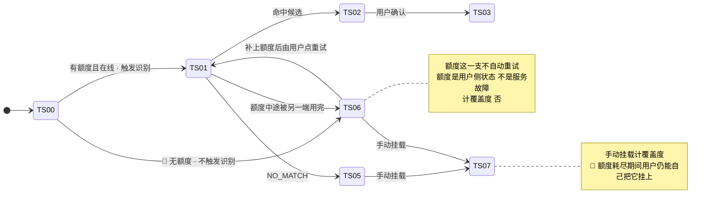

# M7 商业化 · 域索引

> **基线**：`origin/v1` @ `73041df`，fetch 于 2026-09-02。
> **状态：活跃。** 计费维度增减、两条「永不上锁」被改动、额度呈现位置增减、或订单态增减，本文同一次改动内更新。
> **上一层**：[模块地图](../INDEX.md)

---

## 一、这一域在减法的哪一端

**都不在。** 这一域既不维护被减数，也不收减数，也不做减法本身 ——
它只给**会产生按次外部账单的那两类动作**装一个计数器。

计费的判据只有一条，与「用户觉得值不值钱」无关：
**这个动作每执行一次，我方会不会收到一张按次的外部账单。**

| 这个动作会不会产生按次外部账单 | 结果 |
|---|---|
| 会 —— AI 录入（语音转写 / 拍照识别打标）、AI 代发提问 | **进额度**，并入现有两维，**不新开第三维** |
| 不会 —— 骨架树、覆盖度、盲区清单、导出、MCP 只读、手动记录、断言 | **永久免费** |

由此得到这一域最反直觉的性质，而且它必须被认下来：
**产品最有价值的部分永远免费，收费的是最没有差异化的部分 —— 调 API 谁都会**（`商业化与额度设计` §3.3）。
接受它的理由只有一条：**北极星是主动查看盲区的人数，商业模型服从指标，不能反过来。**

所以这是九个域里唯一一个**做得越少越对**的域。它的每一条规格都在回答「哪里不许出现付费入口」，
而不是「怎么让更多人付钱」。

---

## 二、它服务于主流程的哪一步

**`J3 · 它替你对到考点上` 与 `J6 · 把它带走`，只有这两个节点**（`用户价值与主流程` §四）。
理由是机械的：**全流程只有这两处调用外部模型。**

| 节点 | 本域在这一步出现的形态 |
|---|---|
| `J3` | 自动打标要调外部模型 → 计一次 `ai_capture`；额度耗尽时这一条不打标，**记录本身照常落地** |
| `J6` | AI 代发要调外部模型 → 计一次 `ai_ask`；额度耗尽时降级为免费复制路径，**免费路径永不移除** |
| `J2` | 🔴 **不出现。** 记录动作不经过额度（`I-1`） |
| `J5` | 🔴 **不出现。** 看盲区不调外部模型，也不上锁（`I-4`） |
| 横切 `C2` | 本域就是 `C2` 的全部内容。`C2` 只挂在 `J3` 与 `J6` 两处，不挂第三处 |

⚠️ **「服务于 `J3` `J6`」不等于「可以出现在 `J3` `J6` 的界面上」。**
本域在这两处的存在形态是**受限时的兜底**，不是常驻展示 —— 展示规则见 §四 `U7.1`、`U7.2`。

---

## 三、它服务于哪一个关卡

**本域不产生任何一个关卡数字。它服务关卡的方式只有一条：不污染判据。**

关卡由人判定，**pass / fail，不是可调目标**。数据卡在临界线上时，不许回来微调额度或价格再测一轮 ——
那正是 `商业化与额度设计` §十 点名的那类动作（「定价不是变量，付费意愿才是」）。

污染是怎么发生的，只有三步：

| 步 | 发生了什么 |
|---|---|
| 1 | 主链路上放了一个付费入口（哪怕只是一行只读余量） |
| 2 | 「点进去看盲区的比例」这个数里，混进了看到付费入口就退出的人 |
| 3 | 判据没达到时，出现了「是不是付费墙拦住了」这条解释路径 |

**关键在第 3 步的那个分叉。只要它存在，人就会走「再调一次额度重测」那一边** ——
于是这个验收再也不会失败，而**一次永远不会失败的验收等于没有验收**（`额度与购买` §1.1）。
所以要断的是第 1 步，不是第 3 步。

**2026-09-02 裁定给了一条物理隔离，它比纪律可靠：额度只计外部模型调用，记录动作不经过额度。**
于是「今天记了几条」不经过额度，「主动查看盲区的人数」也不经过（看盲区不调外部模型）。
**关卡数字与付费墙物理无关，不需要给验证期账号开后门，也不需要抬高免费额度** —— 那两条都是在调产品迁就关卡。
论证的完整形态在 `U7.2`，它是本域最核心的一节。

---

## 四、能力单元清单与下钻

| 单元 | 管什么 | 关键决策 |
|---|---|---|
| [`U7.1` 额度口径与三个呈现位置](U7.1-额度口径与三个呈现位置.md) | 额度是什么、算几次、在哪三处露面 | 🔴 **只计外部模型调用**；自然月重置、不结转不透支不卖加油包；三类能力两个池子、界面两行；**没有第四个呈现位置**；短信验证码是那条例外 |
| [`U7.2` 额度受限态](U7.2-额度受限态.md) | 用完了会怎样 | 🔴 **本域最核心的一节。** 记录照样成功、只是这一条进 `TS-06`；盲区与导出永不上锁；代发降级为免费复制；主按钮永远是免费兜底（`I-4`） |
| [`U7.3` 档位与购买](U7.3-档位与购买.md) | 买什么、买之前看到什么 | 单档、记多点；🔴 **档位与额度由服务端返回，前端不硬编码**；下单只收档位码，金额由服务端定；单档的代价是没有价格锚点 |
| [`U7.4` 支付流程](U7.4-支付流程.md) | 怎么付 | 三条路撞同一个幂等锚点；「确认中」不能就近归类；🔴 钱的事不做乐观展示；不挽留、不倒计时 |
| [`U7.5` Apple 内购](U7.5-Apple内购.md) | iOS 的特殊规格 | 两条约束（同价 / 只能选苹果价格档）可能同时无法满足，**不裁定牺牲哪一条**；🔴 不出现任何跨端价格比较 |
| [`U7.6` 订单状态机与历史](U7.6-订单状态机与历史.md) | 买完之后 | 后端四态 + 已退款；「支付成功但发货失败」必须独立一态；`autoRenew` 恒 false 不是可变字段；**退订入口不得晚于开通开关** |
| [`U7.7` 退款](U7.7-退款.md) | ⚪ 缺口 | 界面已画、后端从未定义；**支付页上写什么是产品的事**，律师稿替不了；**不裁定选哪种写法** |

**七个单元共用的两句话，写在这里不在单元里重复：**

1. **一个数字都不在本域。** 价格、额度次数、档位个数的真源全部在 `商业化与额度设计` §一，
   本域连「兜底默认值」都不写 —— 写死一次，改价就要发版。
2. **两条永不上锁是不可逆决策，不是产品偏好**（`商业化与额度设计` §二）：**盲区诊断**与**导出**。
   上锁容易解锁不可能 —— 收费那段时间里北极星已经被记错，而那段数据不可重建。

---

## 五、域级状态机

**本域没有自己的记录态。** 额度在 L2 总表 §四 的两条轨上只落一个点：**标签轨的 `TS-06`。**
状态名取自 L2 总表 §四，本域不新增、不改名。

**三条必须一起读的约定：**

| # | 约定 | 为什么 |
|---|---|---|
| 1 | **主轨四态与额度无关** | 「已落本地 / 待上传 / 已同步」三态的转移条件里没有一条含额度 —— 这是 `I-1` 在本域的形态 |
| 2 | **额度耗尽落 `TS-06` 不落 `TS-05`** | `TS-05` 是「认过了，确实对不上」；额度耗尽是**压根没看成**。两者的界面话术与能不能重试完全不同 |
| 3 | **`TS-06` 里额度这一支不自动重试** | 服务不可用会自己恢复，额度不会 —— 它要等用户补额度或换月，所以重试由用户触发 |

**订单态不在 L2 总表 §四。** 它是另一条与记录无关的轨（钱的轨），真源是 `额度与购买` §7.2 与
`后端系统设计与组件接入` §1.10，本域**只转录不新增**，收在 `U7.6`。

---

## 六、前端行为意图 × 后端契约意图

| 事项 | 前端行为意图 | 后端契约意图 | 状态 |
|---|---|---|---|
| 查余量 | 进 `S-BILL` / `S-SET` 必刷；拉不到时显示上次值并打标，**不显示 0** | `GET /quota` —— 两类的 `granted` / `used` / `remaining` + `periodYm`，只读 | ✅ 有契约（`技术架构与接口契约` §6.7） |
| 额度预检 | 剩 0 时靠响应体决定兜底文案；**耗尽必须能与网络错误区分** | `POST /quota/precheck` —— 🔴 只读不扣减，耗尽返回可识别的结论 | ✅ 有契约（§6.7） |
| 额度扣减 | 界面明写「这次不算次数」 | 🔴 **没有端点。** 只在 AI 端点内部、调用成功之后扣；条件更新，受影响 0 行即按耗尽回滚 | ✅ 有契约（§6.7.1 / §6.7.2） |
| 拉档位 | 按数组长度渲染，**不假设个数**；拉不到就不显示卡片 | `GET /billing/plans` —— 档位、价格、额度由服务端返回；必带 `autoRenew: false`；能区分 `purchasable` | ✅ 有契约（§6.6） |
| 查当前档位 | 拉不到就不标记「当前档位」，**不猜** | `GET /billing/subscription` —— 档位 + 到期时间 + `autoRenew` 恒 false | ✅ 有契约（§6.6） |
| 下单 | 确认页展示的价格与返回金额不一致时阻断并刷新，**不静默继续** | `POST /billing/orders` —— 🔴 只收档位码与通道，**不收金额**；同档位有未支付单则复用 | ✅ 有契约（§6.6） |
| 支付结果确认 | 支付结果只当「该去查单了」的信号，不当结论；轮询有上限，超限转「慢了」不转失败 | `GET /billing/orders/{outTradeNo}` —— 必须能区分待支付 / 确认中 / 已支付 / 已关闭 / 已退款五态 | ✅ 有契约（§6.6） |
| 支付回调 | 无界面 | 🔴 独立验签，不走应用鉴权链路；按交易号幂等；金额不符拒绝并告警 | ✅ 有契约（§6.6） |
| 本端可用支付通道 | 区三只显示这一端真的能用的通道 | 🚧 **空** —— 没有它，前端只能按端硬编码，而那是另一种硬编码 | 🚧 缺口（§七 `G-3`） |
| Apple 收据校验 | 校验失败要能与网络错误区分，否则文案分不出来 | 🚧 **空** —— 端点、`channel` 取值都未定稿 | 🚧 缺口（§七 `G-4`） |
| 主动关单 | 用户明确放弃时清掉待支付单，避免下次进来被复用逻辑拦住 | 🚧 **空**，**且不是必需项** —— 没有它就靠超时关闭 | 🚧 缺口（§七 `G-5`） |
| 开票 | 只在已到账的订单上给入口；未到账的入口禁用 | 🚧 **只占端点位，流程未定** | 🚧 缺口（§七 `G-2`） |
| **退款** | 订单列表里**已经画着已退款订单** | ⚪ **空 —— 从未定义。** 三种写法与各自后果在 `后端系统设计与组件接入` §1.11 | ⚪ 缺口（§七 `G-1`） |
| 支付与额度对 MCP 的暴露 | 无界面 | 🔴 `scope=readonly` 命中 `/billing/**` 或 `/quota/**` 一律 403，不论方法 | ✅ 有契约（§6.5 锁 4 / §6.7.3） |

---

## 七、这一域碰到的边界 + 缺口登记

### 边界在这一域的形态

| 边界 | 在这一域怎么落 |
|---|---|
| **不判断对错** 🔴 | 界面只答「有没有、几次、多久前」：档位是「有没有」，余量是「几次」，到期是「还有多久」。**不出现进度条、百分比、环形图** —— 那会把余量变成一个可以看着它变少的对象 |
| **不做学科教研** | 本域不产生任何学科内容；代发的回答是模型说的，不加工、不评分、不落库 |
| **不存题干与机构内容** | 计费流水只记「谁、什么时候、哪个模型、成功还是失败、花了多少」，**没有提示词、没有答案** |
| **原图不上云** | 额度耗尽时图片识别不发生，**原图仍留在本机** —— 受限态不构成任何一次上传 |
| **没有第四种反馈形态** 🔴 | 不做余量预警、不做「还剩几次」的角标、不做到期推送。`Q-11` 里两条约束正面冲突，**不裁定**，在裁定前一条提醒都没有 |
| **不做促销心理机制** 🔴 | 不倒计时、不限时、不「仅剩」、不挽留、不弹窗、不全屏。这些都是让某个数变好看的路径，而那个数不是北极星 |
| **不做付费漏斗埋点** 🔴 | 埋点事件只有既定的四个，本域一个不加。有了漏斗就会有人问「受限态转化率为什么这么低」，而提高它最快的办法就是把付费入口做成主按钮 —— 那一刻污染就成立了。要加先过 `Q-13` |

### 缺口登记（只登记，不裁定）

⚪ **第一条排在最前，理由不是它难，是它是本域唯一一处「界面已经画了、后端从来没有」的地方。**

| # | 缺口 | 缺的是哪一半 | 该谁定 |
|---|---|---|---|
| ⚪ **`G-1`** | **退款：整条路径** | 后端侧三种写法与后果已列出，**规则属于用户协议，架构定不了**，待律师稿。**产品要补的那半格律师稿替不了：按已用比例扣这一种必须事先写在支付页，而「支付页上写什么」是产品的事** | 律师稿 + **产品**。🔴 **本域不裁定选哪一种写法**。详见 `U7.7` |
| `G-2` | 发票：能开几次、能不能改抬头、开票主体是谁 | 端点只占位、流程未定，税务依赖合规轨 | 技术侧 + 合规轨 |
| `G-3` | 「这一端有哪些支付通道可用」没有查询接口 | 产品意图已定：区三只显示真的能用的通道。**契约侧空白** | 技术同事 |
| `G-4` | Apple 内购的收据校验端点与通道取值 | 整条 iOS 内购链路压在「是否上架 iOS」这个不可逆决定上（`Q-4`） | 技术侧；**上不上架需人裁定** |
| `G-5` | 主动关单端点 | 非必需项 —— 没有它就靠超时关闭，代价是用户放弃后下次进来仍会撞到旧单 | 技术侧 |
| `G-6` | 自然月边界用哪个时区 | 契约只定了周期标识一列，没定时区口径。前端一律以服务端返回为准，**但边界那一秒归哪个月写不出来** | 技术同事 |
| `G-7` | 注销与账号合并时，未消耗额度与会员期怎么算 | 合并预览目前返回的是记录条数与覆盖度变化，**没有额度与会员期**；注销的删除时点本身也未决 | 技术同事 + 需人裁定 |
| `G-8` | 会员到期提醒发不发 | 一份文档把「到期前提醒」列为缓解方向，另一份写着本产品不做提醒机制 —— **两条约束正面冲突** | **需人裁定**，本域不替它裁 |
| `G-9` | 订单历史保留多久、能翻多远 | 没人定过。分页大小可以先定，总量上限定不了 | 技术侧 |
| `G-10` | 用完付费档之后是什么 | 目前只有免费与一个付费档，撞顶的用户在受限态里没有第二条路；单档没有价格锚点也挂在这里 | **产品，但现在不定** —— 加不加第二档要等真实用量分布，不是现在猜 |
| `G-11` | 付费漏斗埋点要不要加 | 加之前必须回答「它服务哪一条关卡判据」。转化率不是北极星 | **需人裁定**；在裁定前一个都不加 |
| `G-12` | 用户协议里的额度与退款条款由谁定稿 | 确认页上那个必勾的协议**现在没有正文** | 律师稿 |
| `G-13` | **「钱收到了、权益没发」之后的人工兜底通道** | 客服形态、响应时效、联系方式**都没定**。说明区里那条「联系方式」现在指向空 | **需人裁定** —— 它属于维护者一侧的动作，落点是 `产品总纲` §五 列的**运营后台占位树**（`docs/ops-console/INDEX.md`），那棵树目前整体悬空 |

⚠️ `G-13` 还有一个更硬的形态，登记在 `U7.7`：**订单能显示「已退款」，前提是有人在某个后台执行了退款 ——
而那个后台当前不存在。** 界面态预设了一个尚未成立的运营动作，这是本域唯一一处「前端行为的上游不是后端契约，而是一个不存在的角色」。
