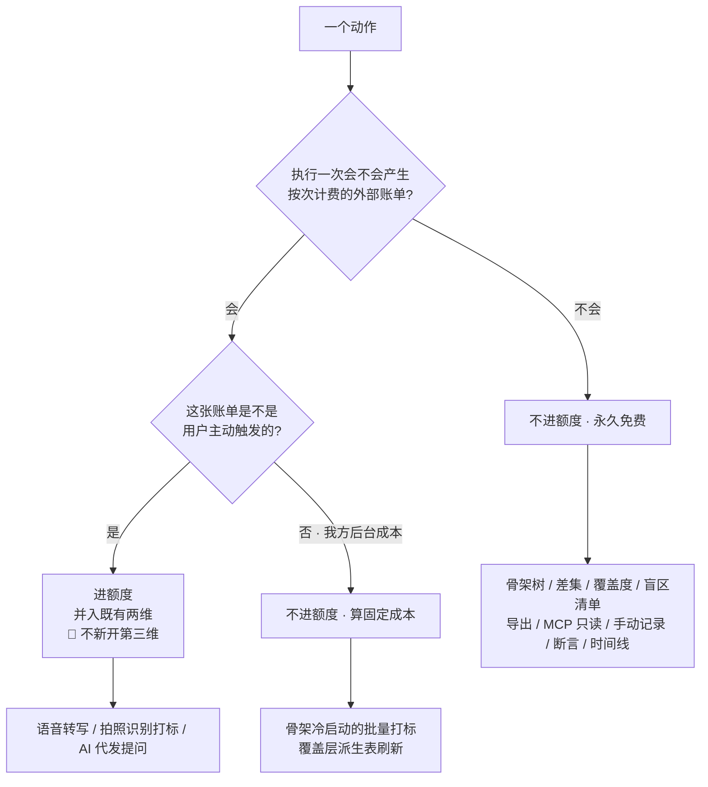

# U7.1 · 额度口径与三个呈现位置

> **基线**：`origin/v1` @ `73041df`，fetch 于 2026-09-02。
> **状态：活跃。** 计费维度增减、池子的划分方式变化、扣减时机变化、或额度呈现位置增减，本文同一次改动内更新。
> **上一层**：[M7 商业化 · 域索引](INDEX.md)

---

## 一、这个子能力是什么、不是什么

**是**：一个计数器。它对「每执行一次会产生一张按次外部账单」的动作计数，
并在**三个固定位置**把这个计数呈现出来。

**不是**：

- **不是准入。** 额度管的是「用得越多花得越多的能力」，不是「能不能开始用这个产品」。
  一个记录工具因为没钱就记不下来，它就不是记录工具了
- **不是按价值定价。** 产品最有价值的部分（骨架树、覆盖度、盲区清单、导出）边际成本近似为零，
  **对它们收费等于对自己唯一的差异化点设一道摩擦**
- **不是会员等级。** 界面上不出现等级、不出现特权列表、不出现「升级解锁」
- **不是一个可以被看着变少的东西。** 余量用「还剩几次」，**不用进度条、不用百分比、不用环形图**

🔴 **2026-09-02 裁定：额度只计外部模型调用，记录动作不经过额度。**
这不是一条体验优化，它是 `I-1`（记录先落地，识别在后）与 `I-4`（额度只碰外部模型调用）的直接后果 ——
不需要新机制，只需要不把额度装到错误的位置上。

🔴 **本文一个数字都不写。** 价格、每档的次数、档位个数的真源只有 `商业化与额度设计` §一 一处。

---

## 二、详细产品逻辑

### 2.1 判定规则：一个动作进不进额度

**每加一个功能都跑一遍这张图，答案是机械的，不需要判断力。**

**一句话版本：这个动作会不会让我收到一张按次的外部账单？会，进额度；不会，永久免费。**
（`商业化与额度设计` §3.1）

### 2.2 那条必须写下来的例外：短信验证码

**短信验证码是按次外部账单，而且是用户主动触发的，但它不进额度。**
因为对它计费等于对注册计费。

| | 归谁管 | 解决什么 |
|---|---|---|
| 短信验证码 | **频控与人机校验** | 薅羊毛 |
| AI 录入 / AI 代发 | **额度** | 成本分摊 |

🔴 **两者不能互相替代。** 这个例外不削弱规则，它划出规则的适用面：
**额度管的是「用得越多花得越多的能力」，不是「一次性的准入动作」。**（`商业化与额度设计` §3.2）

### 2.3 三类能力，两个池子，界面两行

**真源：`商业化与额度设计` §一 的权益表，与 `技术架构与接口契约` §5.5.2 的两个取值。**

| 池子 | 装的是哪几类能力 |
|---|---|
| **记录识别** | 语音转写 **+** 图片识别打标 |
| **问 AI** | AI 代发提问 |

| 规则 | 说明 |
|---|---|
| **两个池子互不借用** | 记录识别用完了，不能拿问 AI 的余量顶上，反之亦然 |
| **语音与图片共享同一个池子** | 它们是同一个计费类别，界面上**合并显示为一行**，不拆成两行 |
| 界面显示两行，不是三行 | 三类是**能力口径**，两个是**计费口径**，**界面跟计费口径走** |
| 不结转、不透支、不卖单次加油包 | 加油包会是第三个计费维度，而只允许两个。要更多次数只能升档 |

⚠️ **不要因为「三类能力」就在界面上做三行** —— 否则用户会以为语音和图片各有一份余量，
而当他把语音那份用完时，界面上的图片那份仍然显示有余，他会认为产品在骗人。

### 2.4 重置：自然月，前端一律不判

| 口径 | 规定 |
|---|---|
| 重置周期 | **自然月**，不按购买日滚动 —— 少一套按用户周期计算的逻辑 |
| 周期标识 | **服务端返回的周期字段**；界面显示它，不显示本地算出来的月份 |
| 🔴 前端怎么判周期 | **不判。** 前端不做任何本地月份计算 |
| 设备时间被改 | **无影响** —— 因为前端根本不参与判断 |
| 跨月零点前后的一次操作归到哪个月 | **由服务端裁定，前端不预测** |
| 重置时用户正开着购买屏 | 不做自动跳变；下一次刷新时更新 |
| 时区口径 | 🚧 **未裁定**，见 §五 |

**文案要说清的一件事：重置是一个自然月的事实，不是一个可以倒数的时刻。**
界面上不出现「即将重置」「本周期剩余时间」「距离下月还有几天」—— 那是倒计时的变体。

### 2.5 一次操作扣几次

**真源：`技术架构与接口契约` §6.7.1 的时序与 §6.7.2 的四条硬约束。**

| 情形 | 扣几次 | 为什么 |
|---|---|---|
| 一次成功的 AI 端点调用 | **1** | 扣减发生在端点内部、外部调用成功之后 |
| 连拍多张合并成一次识别调用 | **1** | 扣减挂在**端点调用**上，不挂在图片张数上。改成按张计属契约变更 |
| 🔴 调用失败 | **0** | 用户没有拿到任何东西，**扣他的额度是在为自己的故障收费** |
| 🔴 用户点重试（同一幂等键） | **0** | 幂等键唯一索引 |
| 🔴 离线队列补传重发同一条 | **0** | 没有这条，**一次断网重连就能把用户的额度扣光** |
| 识别成功但返回「没对上」 | **1** | 外部账单已经产生了。「没对上」是**有效结果**，不是失败 |
| 结果被用户丢弃 | **1，不退还** | 账单已产生；丢弃是用户的判断，不是我方的故障 |
| 两端并发用光 | **不会扣穿** | 条件更新，受影响行数为 0 即回滚并按耗尽处理 |

🔴 **因为失败根本不扣，所以不存在「退还」这个动作，也不存在「退还时机」。**
**界面上永远没有「额度退还中」「已退还一次」这样的态。**
用户看到的只有两种：调用成功后余量减一，或调用失败后余量原样不动。

⚠️ **这一条要在界面上被看见才算数：AI 调用失败的提示里必须紧跟一句「这次不算次数」。**
否则用户会自己脑补「失败也扣了」，**而这种脑补一旦形成，产品说什么都晚了** ——
一个会在失败时扣钱的产品，用户第二次就不敢点了。

### 2.6 额度在界面上出现的三个地方

| 位置 | 强度 | 什么时候出现 | 什么时候不出现 |
|---|---|---|---|
| **触发点受限态** | **被动** | 只在用户已经点了某个 AI 动作、且余量不足时 | 余量充足时**一个字都不显示** |
| **设置屏的那一行** | **常驻只读** | 已登录后常驻 | 没有不出现的情况 —— 进得到设置屏的一定已登录 |
| **额度与购买屏** | **主动进入** | 用户自己从设置屏或受限态的次要入口点进来 | **没有任何自动跳转到这一屏的路径** |

🔴 **没有第四个位置。** 新增任何一处额度展示，先回答它服务于哪一个关卡 —— 答不上来就是不该做。

🔴 **不做预警。** 「还剩三次」「快用完了」是**倒计时的变体**。
额度只有两种状态在界面上有意义：**够用（什么都不显示）** 与 **不够用（受限态）**。
中间那段「快不够了」的焦虑是为了推动购买而制造的，**产品不制造它**。

🔴 **主链路三屏（首页 / 盲区 / 时间线）一个字都不提额度，连只读展示都不行。**
最容易被当成「只是展示一下，又没挡住」放过去 —— 但**展示本身就改变行为**：
用户看到余量在掉就会开始省着用，而「省着用」会同时压低「记了几条」与「点进盲区几次」两个数，
**那正是关卡判据的两个输入**。论证见 `模块地图` §三 登记的 `U7.2`。

### 2.7 刷新、缓存，以及三种绝不能长得一样的状态

| 时机 | 行为 |
|---|---|
| 进入额度与购买屏 / 设置屏 | **必刷** |
| 一次 AI 调用**成功**返回 | **就地更新** —— 响应里带剩余量，不再单独发一次查询 |
| 一次 AI 调用**失败** | **不更新**，余量保持原值 |
| 订单到账 | 必刷 |
| 手动点刷新 | 必刷，有冷却 |
| 从后台回到前台 | 距上次刷新超过缓存有效期才刷 |
| 🔴 本地与服务端不一致 | **一律以服务端为准。** 本地缓存只用于「服务端拉不到时的降级展示」，**并且必须打上「这是刚才的数据」** |

🔴 **前端不做任何本地扣减推算。** 不允许「本地先减一，等服务端回来再对齐」—— 那是钱的乐观展示。

**三种状态在屏幕上不能长得一样，因为用户要做的事完全不同：**

| 情况 | 用户要做的事 | 🔴 不许怎么处理 |
|---|---|---|
| **余额为 0** | 走免费兜底，或去看档位 | —— |
| **余额未知**（请求失败） | 点刷新 | **不许当成 0** —— 那会让一次网络抖动变成一次假的付费墙；**也不许当成「有」** —— 前端不预判，把请求发出去让服务端裁定 |
| **登录态过期** | 重新登录 | 不许显示成「余额为 0」；它不是「从没登录过」，**那种态不存在** |

---

## 三、前端行为意图 × 后端契约意图

| 事项 | 前端行为意图 | 后端契约意图 |
|---|---|---|
| 查余量 | 必刷时机固定；拉不到显示上次值并打标；**从未拉到过就显示「没拉到」，不显示 0** | 返回两类各自的**已发放 / 已用 / 剩余**三个数与**周期标识** —— 缺已发放就做不出换算行，缺周期标识前端就要自己算月份（禁止） |
| 额度预检 | 剩 0 时靠响应体决定兜底文案 | 🔴 **只读不扣减**；**耗尽必须能与网络错误区分开** —— 否则 §2.7 那三种文案分不出来 |
| 额度扣减 | 界面明写这次算没算次数 | 🔴 **没有端点。** 有端点客户端就能只调不扣、或只扣不调。扣减只发生在 AI 端点内部、调用成功之后 |
| 幂等 | 重试复用同一幂等键；离线补传复用记录的客户端标识 | 幂等键唯一索引；同键重试返回上次结果且不再扣 |
| 并发 | 撞到耗尽就地转受限态 | 条件更新而不是先读后写；受影响 0 行即回滚并按耗尽处理 |
| 周期 | 一律显示服务端返回的周期标识 | 周期判断全在服务端；时区口径 🚧 见 §五 |
| 呈现位置 | 三处，且强度不同；主链路三屏零展示 | 不涉及 —— **这一条没有任何后端可以补救的余地，它只能靠前端不写** |

---

## 四、边界与红线在这里的具体形态

| 边界 | 在这一单元的形态 |
|---|---|
| **不判断对错** 🔴 | 余量是「几次」，到期是「还有多久」，档位是「有没有」。**三件事之外一个字都不多说**；不出现使用率、不出现「你这个月很省」这类评价 |
| `I-1` 记录先落地 | 额度的判定发生在**记录已经落库之后**。额度耗尽不回滚记录，只影响这一条打不打标 |
| `I-4` 额度只碰外部模型调用 | 本单元是 `I-4` 的定义处：进额度的只有语音转写、拍照识别打标、AI 代发三类，**其余全部永久免费** |
| **没有第四种反馈形态** 🔴 | 不做余量角标、不做「快用完了」气泡、不做重置提醒。预警就是提醒机制的变体 |
| **不做促销心理机制** | 不倒计时、不显示「距离下月重置还有几天」—— 它把「等下个月」包装成了一种损失 |
| **一个数字都不落在本层** | 价格、次数、档位个数全部指针到 `商业化与额度设计` §一。**连兜底默认值都不写** |

🔴 **一条可机械核对的检查**：对主链路三屏做全文本扫描，
扫不到「次数」「额度」「档位」「购买」「升级」任何一个词。

---

## 五、缺口登记

| # | 缺口 | 缺的是哪一半 | 该谁定 |
|---|---|---|---|
| 1 | **自然月边界用哪个时区**（🚧） | 契约只定了周期标识一列，没定时区口径。产品侧已定「前端一律以服务端为准」，**缺的是服务端那一半：跨月零点那一秒的扣减归哪个月** | **技术同事** |
| 2 | **用完付费档之后是什么**（🚧） | 目前只有免费与一个付费档。撞顶的用户在受限态里没有第二条路 | **产品，但现在不定** —— 加不加第二档要等真实用量分布；**现在猜一个数就是又一个没有依据的数字** |
| 3 | **注销与账号合并时，未消耗的额度与会员期怎么算**（🚧） | 界面侧只能写成事实陈述（「合并后按服务端的口径算」），**写不出承诺**，因为服务端口径不存在 | **技术同事**；注销的删除时点本身还压着一份律师稿 |
| 4 | **额度相关的埋点一个都没有**，这是刻意的 | 不是缺口，是拒绝。但「要不要加付费漏斗埋点」确实未裁定 —— 加之前必须回答它服务哪一条关卡判据 | **需人裁定**；在裁定前一个都不加 |

🔴 **上面四条一条都不由本单元裁定。** 拿不准边界时停下来问，不自行放宽。
