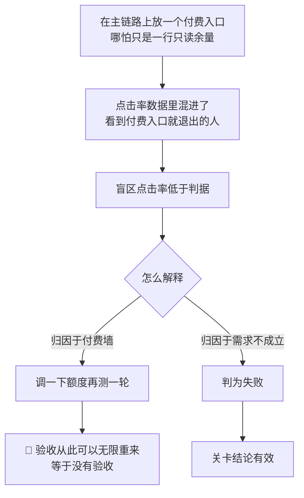
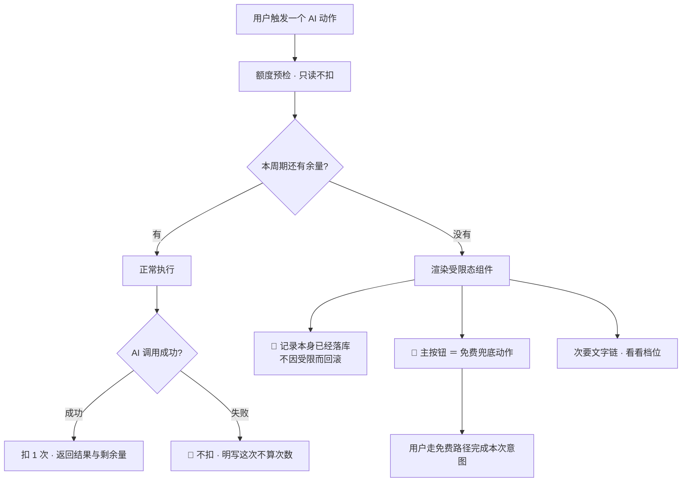
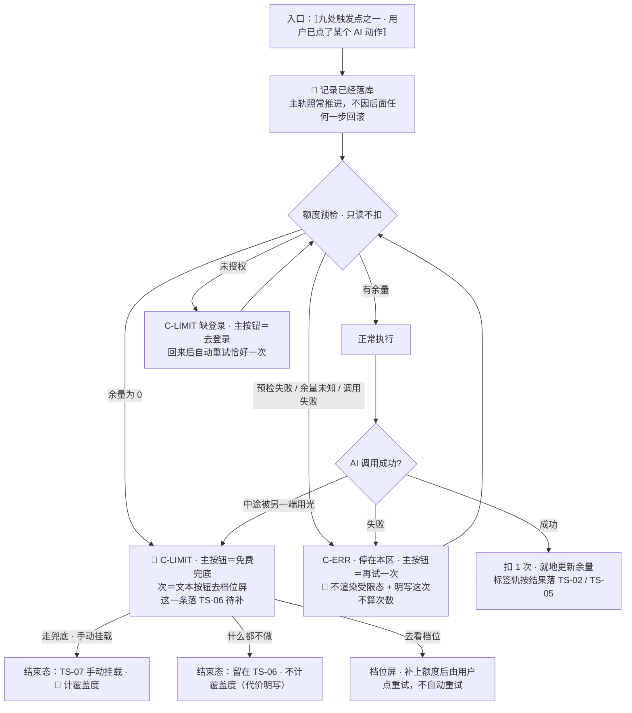

# U7.2 · 额度受限态

> **基线**：`origin/v1` @ `73041df`，fetch 于 2026-09-02。
> **状态：活跃。** 触发点增减、任意一处的免费兜底动作变化、主次关系的三条判据被改动，本文同一次改动内更新。
> **上一层**：[M7 商业化 · 域索引](INDEX.md)

---

## 一、这个子能力是什么、不是什么

**🔴 这是本域最核心的一节。** 前面所有的红线，最终都落在这一节「主按钮是哪个」那一列上。

**是**：一个组件。它在用户已经点了某个 AI 动作、而余量不足时就地渲染，告诉他两件事 ——
**这次的 AI 次数不够了**，以及**不用 AI 也能把这件事做完，路在这里**。

**不是**：

- **不是付费墙。** 付费墙拦住的是「你不付钱就做不了」；这里的每一个触发点都有一条不用付钱就能走完的路
- **不是弹窗，也不是全屏。** 浮层只用于不可逆或必须二选一的动作，**「额度不够」两者都不是**
- **不是失败提示。** 记录已经落库了，**失败的只有识别与转写这一步**
- **不是一次升级机会。** 组件内部没有任何「更醒目一点」的开关

---

## 二、详细产品逻辑

### 2.1 🔴 为什么这一节的分量比它看起来重：它拦的是关卡被污染

**如果受限态里的主按钮是「去买」，被破坏的不是体验，是关卡本身能不能被判定。**
污染只有三步：



**关键的一步是 `D`。只要那个分叉存在，人就会走左边** —— 这不是纪律问题，是结构问题。
**所以要断的是 `A`，不是 `D`。主链路上没有付费入口，`D` 就不存在。**（`额度与购买` §1.1）

### 2.2 🔴 额度与关卡数字物理隔离

**2026-09-02 裁定：额度计的是外部模型调用，不是记录动作**（`商业化与额度设计` §4.6 · §九）。
这条裁定的价值不在于它更宽松，
而在于它把「关卡数字不被付费墙污染」从**一条纪律**变成了**一个结构事实**：

| 关卡要的那个数 | 它经不经过额度 | 为什么 |
|---|---|---|
| 「今天记了几条」 | **不经过** | 记录动作不调外部模型。额度耗尽时记录照样落库，只是这一条不打标 |
| 「主动查看盲区的人数」 | **不经过** | 看盲区不调外部模型，是一次差集计算 |
| 「点进去看的比例」 | **不经过** | 同上，且盲区诊断永不上锁 |

**于是既不用给验证期账号开后门，也不用抬高免费额度 —— 那两条都是在调产品去迁就关卡。**

**代价是诚实的，必须写出来：** 额度耗尽期间记下的东西进未分类，**不计入覆盖度**（`I-2`）。
这不是一个待修的缺陷，是「匹配不上就丢弃，不硬归类」在额度这一侧的必然结果 ——
**归错会让覆盖度失真，而覆盖度是这个产品唯一的产出。**

### 2.3 三条不许被绕过的推论

| # | 推论 | 常见的绕法（**全部禁止**） |
|---|---|---|
| 1 | 主链路上**不出现付费入口**，包括入口的任何变体 | 角标、小红点、「升级可用」灰字、盲区列表底部的「解锁更多」卡片 |
| 2 | 受限态里**付费入口的视觉权重必须低于免费兜底** | 把「看看档位」做成主按钮；把免费兜底做成灰色次要按钮；把两个做成同等权重的并排双按钮 |
| 3 | 额度信息**不进入主链路三屏，连只读展示都不行** | 首页顶栏挂余量、盲区页顶部挂余额条、时间线卡片上标「AI」小标 |

⚠️ **推论 3 最容易被当成「只是展示一下，又没挡住」放过去。**
**展示本身就改变行为**：用户看到余量在掉就会开始省着用，
而「省着用」会同时压低「记了几条」与「点进盲区几次」—— **那正是关卡判据的两个输入。**

### 2.4 一个组件，若干个触发点

组件只接三个参数：① 受限的能力类别 ② 免费兜底动作 ③ 次要入口是否显示。
**组件内部没有任何「更醒目一点」的开关。**



### 2.5 逐处规格：每一个触发点写全

**「主按钮」这一列是本域最不能改的一列。逐处的真源见 `额度与购买` §8.2。**

| # | 触发点 | 能力类别 | 屏幕上是什么 | **主按钮（免费兜底）** | 次要入口 | 记录 / 数据留住了吗 |
|---|---|---|---|---|---|---|
| 1 | 录完一段语音，准备转写 | 语音转写 | 内嵌在**已经存在的**那张记录卡片下方 | **手动补一句** —— 打开文本输入，用户自己写 | 「看看档位」文字链 | ✅ 记录已落库；音频不留存，所以提示他手动补 |
| 2 | 拍照或选图后，准备识别 | 图片识别 | 同上，内嵌在该条记录卡片下 | **手动挂考点** —— 从骨架树里自己选 | 「看看档位」文字链 | ✅ 记录已落库；**原图仍在本机** |
| 3 | 批量补传时撞到额度 | 两类均可能 | 顶部一行细条，**不打断补传** | **先都记下来，回头手动挂** | 「看看档位」文字链 | ✅ 全部记录落库，只是没有标签 |
| 4 | 在待补队列里点「让 AI 试一次」 | 图片识别（闭集分类） | 该条目下方内嵌 | **从树里选** —— 手动挂载 | 「看看档位」文字链 | ✅ 条目仍在待补列表里，**不消失** |
| 5 | 在考点详情点「问 AI」 | AI 代发 | 上下文卡片**正常展开**，受限态在卡片底部 | **复制上下文，自己去问** | 「看看档位」文字链 | ✅ 上下文照常组装并可复制 |
| 6 | 在出口屏点「代我问 AI」 | AI 代发 | 同上，受限态在代发按钮位置 | **复制上下文，自己去问** | 「看看档位」文字链 | ✅ 上下文照常给 |
| 7 | 点「导出」 | 🔴 **不受额度管** | **不存在受限态** | —— | —— | 🔴 导出永远不限次数、无水印、不删减 |
| 8 | 首页 / 盲区 / 时间线 | 🔴 **不受额度管** | **不存在受限态，也不显示余量** | —— | —— | 🔴 主链路三屏一个字都不提额度 |
| 9 | AI 调用中途，余量被另一端用光 | 三类均可能 | 就地转为受限态 | 与该触发点的主按钮一致 | 「看看档位」文字链 | ✅ 记录留住；**未扣额度**（条件更新失败即回滚） |

**这张表里有两行是承诺不是功能**：第 7 行与第 8 行。
它们一旦有例外，前面六行的兜底就都不成立了 —— 一个扣着你记录与盲区的产品，
你不会把第二个月的学习也记进来。

### 2.6 额度耗尽这一条记录去哪了

**落 `TS-06`（待补），不落 `TS-05`（没对上）。** 两者在界面上是两句完全不同的话
（四种未分类成因的逐格差异，真源见 `打标与未分类` §六）：

| | 额度耗尽 | 认过了确实没对上 |
|---|---|---|
| 状态 | `TS-06` 待补 + 受限说明 | `TS-05` 没对上 |
| 发生了什么 | **压根没看成**，原因在账上 | 看过了，考点表里没有匹配的一条 |
| 会不会自动重试 | 🔴 **不会** —— 额度是用户侧状态，不是服务故障 | 不会 —— 认过了就是认过了 |
| 用户能做什么 | **手动挂载（主）** / 去看档位（次） | 手动挂载 / 就这样留着 |
| 计不计覆盖度 | 否 | 否 |

🔴 **两句话不许混成一句。** 混成一句会让用户对同一个界面产生多种预期，
而其中至少一种一定落空 —— 他会等一个永远不会自动到来的重试。

### 2.7 「主次不能反」的三条机械判据

**这三条可以被设计评审和代码评审机械核对，不需要判断力**（`额度与购买` §8.3）。

| # | 判据 | 违反的样子 |
|---|---|---|
| 1 | 受限态里**只有一个按钮控件**，它是免费兜底；付费入口必须是**文字链** | 两个并排按钮；付费入口做成描边按钮 |
| 2 | 付费入口的**字号不大于正文**，**颜色不使用主色** | 「看看档位」用主色加粗 |
| 3 | 受限态**不改变页面焦点**，键盘与读屏的默认落点也是免费兜底 | Tab 第一站落到「看看档位」 |

🔴 **第 3 条最容易被漏。** 视觉上主次分明、但焦点顺序把付费入口排在前面，
**对读屏用户来说主次就是反的** —— 而他读到的顺序就是这个产品的真实优先级。

⚠️ **「次要入口」指的是视觉权重与焦点顺序，不是可读性。**
把付费入口做成看不清的浅灰色，是另一种欺骗；它的对比度不许降到正文以下。

### 2.8 三种不做

| 不做 | 理由 |
|---|---|
| 不弹窗、不全屏、不遮罩 | 浮层只用于不可逆或必须二选一的动作；「额度不够」既不是不可逆，也不是二选一 |
| 不倒计时、不显示「距离下月重置还有几天」 | 倒计时是促销机制的变体，而且它把「等下个月」包装成了一种损失 |
| 不做「首次免费体验」「邀请得次数」 | 两者都是让某个数变好看的路径，**而不是让主动查看盲区的人变多** |

---

## 三、前端行为意图 × 后端契约意图

| 事项 | 前端行为意图 | 后端契约意图 |
|---|---|---|
| 预检 | 剩 0 时渲染受限态；**余量未知时不渲染受限态**，把请求正常发出去让服务端裁定 | 🔴 只读不扣减；**耗尽必须能与网络错误区分**，且响应体要带手动入口提示 —— 界面靠它决定兜底文案 |
| 记录落地 | 受限态内嵌在**已经存在的**记录卡片上，不是替代它 | 🔴 额度耗尽**不得让记录动作失败**：记录照常落库，只是不打标 |
| 中途耗尽 | 就地转受限态，主按钮与该触发点一致 | 条件更新受影响 0 行即回滚并按耗尽处理，**余量不出现负数** |
| 批量补传 | 顶部一行细条，**不打断补传**；已成功的不回滚 | 逐条独立判定；额度用尽后剩余条目照常落库并置 `TS-06` |
| 失败提示 | 明写「这次不算次数」 | 失败不扣、同键重试不重复扣 |
| 状态落点 | 受限说明与「服务不可用」是两套文案 | 额度这一支不进自动重试队列 —— **重试由用户触发，不由系统触发** |
| 主链路零展示 | 三屏一个字都不提额度 | **不涉及。** 🔴 这一条没有任何后端可以补救的余地，它只能靠前端不写 |

---

## 四、边界与红线在这里的具体形态

| 边界 | 在这一单元的形态 |
|---|---|
| `I-1` **记录先落地** 🔴 | 受限态出现时，记录**已经在时间线里了**。这是这一域与 `I-1` 唯一的接触面，也是它必须让步的地方 |
| `I-4` **额度只碰外部模型调用** 🔴 | 本单元是 `I-4` 的运行时形态：不阻断记录、不锁盲区、不锁导出、不锁免费复制。**四条缺一条这个不变量就不成立** |
| `I-2` **未分类不进行为层** | 额度耗尽期间记下的东西进未分类，**不计覆盖度**。代价明写，不含糊 |
| **不判断对错** | 受限态只说「这个月的次数用完了」，不评价用户用得多还是少 |
| **原图不上云** | 额度耗尽时图片识别根本没发生，**原图一次都没离开过本机** |
| **没有第四种反馈形态** 🔴 | 受限态是被动出现的，不是推送、不是提醒、不是角标。它只在用户已经点了那个动作之后才存在 |
| **不做促销心理机制** | 不弹窗、不倒计时、不限时、不挽留 —— 见 §2.8 |

🔴 **两条可断言的检查，机械可跑：**

1. 把两类余量都设为 0，走「记一条 → 看盲区 → 导出」，**三步全部走通，过程中没有任何一屏出现付费入口**。
2. 任取一个受限态，检查其中的控件：**只有一个按钮，且它是免费兜底**；Tab 第一站落在它上面。

---

## 五、缺口登记

| # | 缺口 | 缺的是哪一半 | 该谁定 |
|---|---|---|---|
| 1 | **撞顶之后的第二条路**（🚧） | 受限态的次要入口指向档位列表，而档位列表里只有一个付费档。**用满付费档的人在受限态里没有下一步** —— 界面还能说什么，现在写不出来 | **产品，但现在不定**：加不加第二档要等真实用量分布 |
| 2 | **受限态相关的埋点一个都没有** | 这是拒绝不是遗漏：有了漏斗就会有人问「受限态转化率为什么这么低」，**而提高它最快的办法就是把「看看档位」做成主按钮** —— 那一刻污染成立。但「要不要加」确实未裁定 | **需人裁定**；在裁定前一个都不加 |
| 3 | **小程序上图片识别相关的受限态不存在** | 不是本单元的选择：那个端不开原图通道，所以第 2、4 行的触发点在那里压根不会发生。**缺的是「那个端上用户想拍照记一笔时看到什么」** | 端矩阵那一侧；本单元不替它裁 |
| 4 | **额度耗尽期间的未分类条目，补上额度后怎么批量重认**（🚧） | 产品侧已定「不自动重试，由用户点」；**缺的是批量入口的形态** —— 一条一条点还是整批重来，没人定过 | **产品**，未定 |

---

## 六、线框

> 记号与屏宽照 `线框与交互规格约定` §三（40 个半角字符），组件只引锚不抄规格。
> 本单元画的是**同一个组件在若干个触发点上的落点**，不是若干个组件；逐处的兜底动作见 §2.5。

### 6.1 常态整屏 · 额度充足时的触发点所在屏

```
┌────────────────────────────────────────┐
│ ⟦顶条·离线/同步中⟧      ← C-OFFLINE    │
├────────────────────────────────────────┤
│ ⟦记录卡片·时间/来源/徽标取 TS 那张表⟧  │
│  ⟦AI 动作入口·随触发点变⟧        ※1    │
│ ⟦…同上，若干张⟧                        │
├────────────────────────────────────────┤
│ (  ⟦本屏主按钮·非本单元⟧  )      ※2    │
└────────────────────────────────────────┘
```

※1 🔴 **额度充足时整屏一个字都不提额度** —— 没有余量角标、没有「AI」小标、没有「还剩 N 次」　※2 本单元不占用这一屏的主按钮；受限态出现时也**不抢走它**（受限态是页内的一块，不是浮层）

### 6.2 🔴 受限态 · 缺额度（本单元的主体，只画变化区）

```
│ ⟦记录卡片·🔴 已经在时间线里了⟧   ※3    │
│  ⟦标签状态徽标 = TS-06 的徽标文字⟧※4   │
│ ┌ C-LIMIT ────────────────────────────┐│
│ │⟦缺什么一句·数字由服务端给⟧      ※5  ││
│ │( ⟦免费兜底·逐触发点见 §2.5⟧ )  ※6   ││
│ │‹⟦去看档位⟧›  ← 文本按钮，非按钮 ※7  ││
│ └─────────────────────────────────────┘│
├────────────────────────────────────────┤
│ 批量补传撞额度·顶部细条，不打断补传※8  │
│ ⟦记录都存下来了，只是没打标⟧           │
├────────────────────────────────────────┤
│ 🔴 盲区/导出/免费复制：永不上锁    ※9  │
│  ⟦没有额度提示⟧⟦没有锁标⟧⟦没有灰按钮⟧  │
```

※3 🔴 **记录动作没有失败** —— 卡片先有，受限态内嵌在它下面，**不是替代它、不是回滚它**（`I-1`）　※9 🔴 这一格画的就是「什么都没有」：`I-4` 的四条（不阻断记录、不锁盲区、不锁导出、不锁免费复制）缺一条这个不变量就不成立　※5 ≤25 个汉字；🔴 里面不出现解锁、升级、会员、专属、无限、立省、限时（`C-LIMIT` 文案模式）　※8 细条**不打断补传**，也不是浮层
※4 🔴 落 `TS-06` 待补，**不落 `TS-05` 没对上**：前者是压根没看成，后者是认过了确实对不上（§2.6）。徽标文字照抄 `模块地图` §4.3 那张表，不改写
※6 🔴🔴 **主按钮永远是免费兜底那一条**，且受限态里**只有这一个按钮控件**；焦点默认落在它上面，Tab 第一站不是「去看档位」　※7 付费入口的**视觉权重不得高于正文**（具体取值交设计，本层不给数值）；但**对比度不许降到正文以下** —— 看不清是另一种欺骗（§2.7）

### 6.3 其余各态：只画变化区

```
│ 骨架 C-SKEL · 预检途中                 │
│  ⟦AI 动作入口进加载态，占位不变⟧※10    │
├────────────────────────────────────────┤
│ 空态 C-EMPTY · 没有可发的上下文        │
│  ⟦为什么空⟧ + ⟦立刻能做的动作⟧         │
├────────────────────────────────────────┤
│ 错误态 C-ERR · 预检本身失败       ※11  │
│ ⟦哪一步没成⟧(再试一次)←主 ⟦不算次数⟧※12│
├────────────────────────────────────────┤
│ 陈旧数据态 · 余量未知                  │
│  🔴 ⟦不渲染受限态⟧，请求照常发出※13    │
├────────────────────────────────────────┤
│ 受限态 C-LIMIT · 缺登录（令牌失效）    │
│  ( ⟦去登录⟧ ) ←主，这一档无兜底        │
```

※10 加载中不改变元素占位，也不是禁用理由　※11 🔴 预检失败**不等于**额度耗尽，两句话不许混成一句　※12 🔴 失败根本不扣，所以**没有「额度退还中」这种态**，且这句话必须被看见才算数（真源 `额度与购买` §9.3）　※13 余量未知时**不许当成 0**（假的付费墙），**也不许当成「有」** —— 由服务端裁定

### 6.4 红线自查十条，逐张数过

| # | 数这一样 | 本单元 |
|---|---|---|
| 1–6 | 正确率 / 讲解 / 提醒 / 小红点 / 打卡 / 徽章 / 进度环 / 百分比 / 倒计时 / 限时 / 划线价 / 「仅剩」/「已有 X 人购买」 | 0 —— 受限态只说「这个月的次数用完了」，不评价用户，且**被动出现**不是推送不是角标；🔴 逐格数过：不写「距离下月重置还有几天」，不做「首次免费体验」「邀请得次数」，不挽留、不弹窗（§2.8） |
| 7–10 | 能装下题干的格子 / 置信度 / 原图分享导出同步 / 三处不可弱化 | 0 —— 兜底里的文本输入是用户自己写的一句话，**不长得像题目**；不显示置信度；🔴 额度耗尽时图片识别根本没发生，**原图一次都没离开过本机**；三处落在 `模块地图` §三登记的 `U8.3` / `U8.4`，不重画也不弱化 |

---

## 七、交互规格

### 7.1 必答五项

| # | 必答 | 本单元的答案 |
|---|---|---|
| 1 | **入口** | 九处，全部是**被动**的：用户先点了某个 AI 动作，预检才把这一块渲染出来（逐处见 §2.5）。🔴 **没有一处是主动弹出的**，也没有任何入口来自主链路三屏。第十条入口是登录后回跳 —— 回到原处、所选项原样保留、**自动重试恰好一次**（`P-NAV`、`C-LIMIT`） |
| 2 | **结束状态** | 主轨：**`已落本地` / `待上传` / `已同步` 照常推进**，🔴 一格都不因受限而回退。标签轨：这一条落 `TS-06` 待补；用户走兜底手动挂载后转 `TS-07`，**计覆盖度**；不挂就留在 `TS-06`，**不计覆盖度**（`I-2`，代价明写） |
| 3 | **失败落点** | 兜底动作本身失败 → 停在本区，主按钮＝再试一次，记录仍在。预检失败（区分不出耗尽与网络错误）→ 🔴 **不渲染受限态**，走错误态并明写「这次不算次数」。中途被另一端用光 → 就地转受限态，主按钮与该触发点一致，**未扣额度** |
| 4 | **空态** | 两种成因、两句话：① 没有可发的上下文（代发那两处）→ 整区隐藏，不留一个点不动的按钮；② 待补队列为空 → 「都处理完了」+ 一个继续往前的动作。🔴 **「额度为 0」不是空态**，它是受限态 |
| 5 | **错误态** | 可重试：预检超时 / 网络失败 / 兜底写入失败。不可重试：本单元没有。🔴 **额度这一支不进自动重试队列** —— 服务不可用会自己恢复，额度不会，重试由用户触发（`P-RETRY`：写动作不自动重试）。有缓存时是陈旧数据态，且陈旧**不上锁** |

### 7.2 受限态（按需追加项）

| 档 | 缺什么 | 主按钮 | 次入口 |
|---|---|---|---|
| **缺额度 · 记录识别** | 语音转写 / 图片识别余量为 0 | 🔴 手动补一句 / 手动挂考点 / 从树里选（逐处见 §2.5） | 文本按钮去档位屏 |
| **缺额度 · 问 AI** | 代发余量为 0 | 🔴 复制上下文，自己去问（本地生成，永远免费） | 文本按钮去档位屏 |
| 缺登录 | 已登录后令牌失效 | 去登录 —— 这一档**没有免费兜底**。🔴 **导出与盲区不存在受限态** | 无 |

🔴 **两条可断言的检查**：① 把两类余量都设为 0，走「记一条 → 看盲区 → 导出」，三步全部走通，**过程中没有任何一屏出现付费入口**；② 任取一个受限态，其中**只有一个按钮控件且它是免费兜底**，Tab 第一站落在它上面。

### 7.3 交互流程



⚠️ 本节不写端点路径。界面对后端只有四条要求：① 🔴 **额度耗尽不得让记录动作失败**；② 预检**只读不扣减**，且**耗尽必须能与网络错误区分**，否则界面只能说「没成」；③ 失败不扣、同键重试不重复扣；④ 条件更新受影响 0 行即回滚，**余量不出现负数**。
