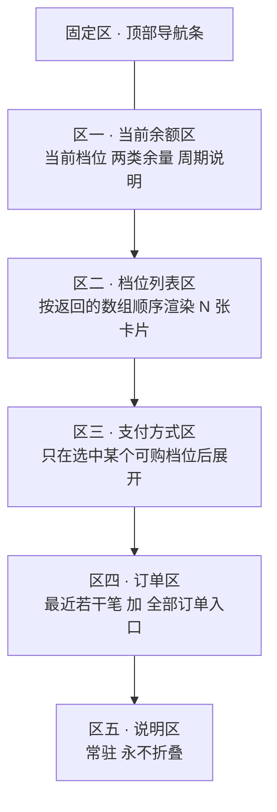
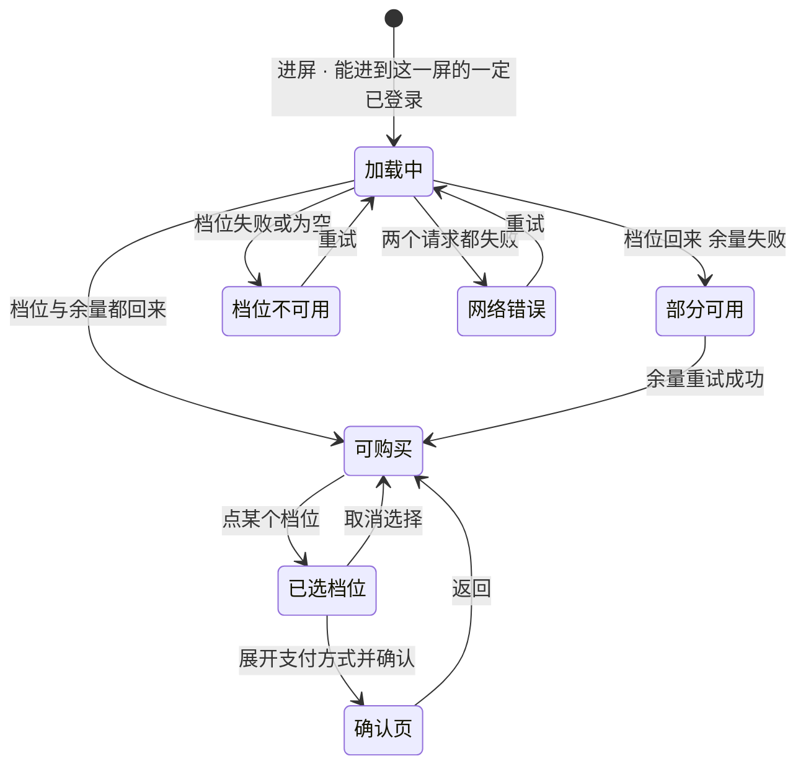

# U7.3 · 档位与购买

> **基线**：`origin/v1` @ `73041df`，fetch 于 2026-09-02。
> **状态：活跃。** 档位来源方式变化、卡片状态枚举增减、屏幕分区结构变化、或预选规则改动，本文同一次改动内更新。
> **上一层**：[M7 商业化 · 域索引](INDEX.md)

---

## 一、这个子能力是什么、不是什么

**是**：一屏信息。它把「现在有哪些档位、每一档包含什么、我现在在哪一档、我这个月还剩多少」
摊开给用户看，并在他自己决定之后把他交给支付流程。

**不是**：

- **不是落地页。** 没有任何自动跳转到这一屏的路径；深链带着档位码进来**也不预选**，
  否则它就会被当成一个推广落地页来用
- **不是一个漏斗。** 屏内没有倒计时、没有限时、没有「仅剩」、没有默认勾选、没有底部悬浮购买条
- **不是定价文档。** 🔴 **一个价格数字、一个额度次数都不在本层**，真源只有 `商业化与额度设计` §一 一处
- **不是档位个数的定义处。** 前端**不假设个数**，按服务端返回的数组长度渲染

**当前的形状是「单档、记多点」，而且这一档之上是空的。**
这是刻意的临时状态，不是「想清楚了」—— 在没有任何真实用量分布之前，
多定一档就是多猜一组数字，**而多猜的那组数字会被当成结论引用**（`商业化与额度设计` 导语）。

---

## 二、详细产品逻辑

### 2.1 🔴 档位、价格、额度全部由服务端返回，前端不硬编码

**理由只有一条：写死一次，改价就要发版**（`技术架构与接口契约` §6.6 · `额度与购买` §十八）。

| 禁止的形态 | 为什么它也算硬编码 |
|---|---|
| 兜底默认价格 | 拉不到时显示一个「大概是这个数」，用户会照着它做决定 |
| 本地缓存的上次价格 | 上次的价格不是这次的价格，而钱的事不做乐观展示 |
| 离线时的展示值 | 同上 —— 离线时**整块不显示**，不显示任何数字 |
| 埋点里带的价格 | 埋点是另一份副本，副本会独立过期 |
| 测试用的假数据进生产 | 这是最容易发生的一种 |
| 档位个数写死 | 加一档就要改前端，等于把「以后不重构」这句话作废 |
| 自己造一个「原价划线」 | 单档没有价格锚点是**认下来的代价**，不是前端可以补的洞（见 §2.6） |

🔴 **拉不到就不显示卡片。** 屏幕上出现一个价格数字的唯一合法来源，是这一次服务端返回的那一份。

### 2.2 这一屏的分区与它们各自的规矩

**一屏到底的单列滚动页**：没有横向 Tab、没有分步向导、**没有底部悬浮购买条**。

| 规则 | 为什么 |
|---|---|
| **没有底部悬浮购买条** | 悬浮条会把购买动作提升成全屏级别的主动作，与「付费入口是次要位置」冲突 |
| **区三默认收起** | 未选中档位时不渲染支付方式 —— 避免「还没决定买什么就先看到怎么付钱」 |
| **区五永不折叠** | 「导出永远免费、不限次数」与「不自动扣费、到期就停」两句是**承诺**，不是可折叠的补充说明 |
| **返回键任何时候可用** | 进到确认页后返回退回本屏，**不弹「确定放弃购买吗」** —— 那是挽留 |
| 🔴 **任何入口都不允许「进来就弹确认页」** | 这一屏的第一屏永远是**信息**，不是**决策** |

### 2.3 从不同入口进来时的预选规则

**「预选」只影响滚动位置与卡片的视觉焦点，不代表已选中，更不触发下单。**

| 入口 | 预选 | 落点 | 理由 |
|---|---|---|---|
| 设置屏的额度行 | **不预选** | 区一顶部 | 用户是来看余量的，不是来买的 |
| 受限态的「看看档位」 | **不预选** | 区二顶部 | **预选一个档位等于替用户做了决定**；但他是带着「看看档位」的意图来的，所以落点不停在区一 |
| 从确认页退回 | **保持上次选中的档位** | 该卡片位置 | 退回不等于放弃 |
| 登录态过期重登后回跳 | **保持重登前所选档位** | 该卡片位置 | 丢了就是让用户重选一遍 |
| 订单历史里点某笔未支付订单 | **预选该订单对应的档位** | 区二该卡片 | 这一次用户的意图是明确的 |
| 深链或外部唤起 | **不预选** | 区一顶部 | 带着档位码也不预选，**防止被当成推广落地页** |

### 2.4 屏幕状态枚举

| 态 | 屏幕上是什么 | 不允许 |
|---|---|---|
| 加载中 | 区一、区二各自骨架占位 | 不允许整屏转圈遮罩 |
| 部分可用 | 区二正常；区一显示上次余量并打上「这是刚才的数据」 | **不允许因为余量拉不到就禁用购买** |
| 档位不可用 | 区二整块错误态 + 重试 | 🔴 **不允许显示任何本地兜底价格** |
| 网络错误 | 整屏错误态 + 重试 | 不允许出现错误码原文或英文 |
| 已选档位 | 该卡片高亮，区三展开 | **不允许自动进确认页** |
| 确认页 | 档位 · 价格 · 包含次数 · 协议勾选 · 支付按钮 | 🔴 **不允许默认勾选协议** |

🔴 **枚举里没有「未登录」这一态。**（2026-09-02 裁定：没有本机模式。）
未登录只能停在产品说明与登录门那一屏，**根本进不到这里**；
唯一与登录有关的运行时情况是**登录态中途过期**。

### 2.5 档位卡片自身的状态

| 卡片态 | 触发条件 | 视觉 | 可点 |
|---|---|---|---|
| 可购买 | 服务端标为可购，且这一端有可用支付通道 | 正常 | ✅ |
| 当前档位 | 当前订阅的档位码命中本卡 | 加**文字**标记 | ✅（可续期） |
| 不可购买 | 服务端标为不可购 | 常态显示，但**没有购买按钮** | ❌ |
| 通道不可用 | 这一端所有支付通道均不可用 | 按钮置灰 + 一行说明 | ❌ |
| 已有进行中订单 | 同档位存在未终结的订单 | 按钮换成「继续上一笔」 | ✅ |

**两条不许省的规矩：**

- 🔴 **拉不到当前订阅就不标记「当前档位」，不猜。** 猜错的后果是用户以为自己已经买了
- 🔴 **推荐标记不能只靠颜色。** 颜色不作为唯一信息载体 —— 推荐档位必须同时有**文字**标记，
  且这个文字必须朗读得出来

### 2.6 单档的代价：没有价格锚点，而且不许自己造一个

**多档定价的作用之一是给用户一个内部参照系。只剩一档，这个参照系就没了** ——
用户判断「贵不贵」时只能拿外部产品比，**而拿谁比、那东西贵还是便宜，我方完全不可控**。

这是删掉上层档实实在在的代价，**不是顺带的小问题**，也不是前端能补的洞：

| 想到的补法 | 判定 |
|---|---|
| 加一个「原价划线」 | 🔴 **禁止。** 那是凭空造一个锚点，等于先有锚点再找理由 |
| 加一个卖不动的高档位当陪衬 | 🔴 **禁止。** 它同时是毛利最薄和风险敞口最大的一档 |
| **把额度换算成用量，用「用量」当锚点顶替「价格」锚点** | ✅ **唯一允许的缓解，而且很弱** —— 卡片上给一行日均换算，让用户拿自己的记录节奏去比 |

**真正的解只能是按真实用量分布决定加不加第二档，在那之前不造锚点。**

### 2.7 下单只收档位码

| 规则 | 说明 |
|---|---|
| 下单请求**不带金额** | 下单接口若接受金额，就等于把定价交给客户端 |
| 确认页展示的价格与下单返回的金额不一致 | **阻断**，退回档位列表并重新拉一次档位；**以服务端金额为准，不静默继续** |
| 所选档位已下架 | 该卡片消失 + 页内提示，下单被拒，未扣款 |
| 协议 | 默认不勾，**必勾才能支付**；未勾时不发请求 |
| 同档位已有未支付订单 | **复用，不新建** —— 不会出现两笔待支付 |

---

## 三、前端行为意图 × 后端契约意图

| 事项 | 前端行为意图 | 后端契约意图 |
|---|---|---|
| 拉档位 | 按数组长度渲染；**代码里搜不到档位个数**；拉不到就不显示卡片 | 返回**数组**而不是两个固定字段；档位、价格、额度全由服务端定；必带「不自动续费」这个恒定值；必须能区分**可购 / 不可购** |
| 价格格式 | 服务端以最小货币单位给整数，前端格式化；非整数或负数**不渲染该卡片** | 币种当前只有一种；**对所有通道返回同一个价**（分端差价本身就是一条指向外部支付的箭头） |
| 当前档位 | 命中才标记，拉不到**不猜** | 返回档位 + 到期时间；到期时间为空表示免费档，那一行整行不渲染 |
| 额度换算行 | 由前端把次数换算成日均用量 | 每档的两类次数必须随档位一起返回，缺任一项该行不显示 |
| 下单 | 只发档位码与通道 | 🔴 **不接受金额**；金额由服务端按档位定；同档位有未支付单则复用；返回订单号与调起参数 |
| 计费周期字段 | 缺失时只显示价格，不显示周期 | 🚧 **未定稿** —— 见 §五 |
| 推荐标记 | 有字段才显示，且必须是文字 | 🚧 **未定稿** —— 见 §五 |
| 本端可用通道 | 区三只显示这一端真的能用的 | 🚧 **空** —— 没有它前端只能按端硬编码，**而那是另一种硬编码** |

---

## 四、边界与红线在这里的具体形态

| 边界 | 在这一单元的形态 |
|---|---|
| **不判断对错** | 卡片上只有「有没有、几次、多久前」：档位有没有、包含几次、什么时候到期。**不出现「适合你」「大多数人选这个」** |
| **不引导至外部支付** 🔴 | 不出现任何跨端价格比较、不出现「网页版更便宜」、不做分端差价。**差价本身就是一条指向外部支付的箭头** |
| **没有第四种反馈形态** | 不做「档位涨价提醒」、不做到期前推送、不做未读角标 |
| **不做促销心理机制** 🔴 | 不限时、不折扣、不倒计时、不「仅剩」、不默认勾选、不弹挽留 |
| **不做积分 / 打卡 / 徽章** | 权益列表里不出现任何以「打开次数」为奖励对象的东西 |
| **一个数字都不落在本层** | 价格、次数、档位个数全部指针到 `商业化与额度设计` §一 |

🔴 **一条可机械核对的检查**：对本层文档与前端代码同时扫描，
**搜不到任何一个价格数字、额度次数或档位个数的字面量。**

---

## 五、缺口登记

| # | 缺口 | 缺的是哪一半 | 该谁定 |
|---|---|---|---|
| 1 | **档位的计费周期字段**（🚧） | 卡片上要显示「每{周期}」，**契约里没有这个字段**。缺失时只能退化成只显示价格 | **技术同事** |
| 2 | **推荐标记字段**（🚧） | 产品侧已定：必须是文字、必须朗读得出来、不能只靠颜色。**契约侧没有这个字段** | **技术同事** |
| 3 | **「这一端有哪些支付通道可用」没有查询接口**（🚧） | 产品侧已定：区三只显示真的能用的通道。**契约侧空白** —— 缺它前端只能按端硬编码 | **技术同事** |
| 4 | **用满这一档之后是什么**（🚧） | 撞顶的用户在受限态与本屏都没有下一步；**单档没有价格锚点也挂在这里** | **产品，但现在不定** —— 加档的依据是撞顶的人，不是「多一档能多赚」 |
| 5 | **确认页上那个必勾的协议没有正文** | 界面位置已定、勾选规则已定，**正文待律师稿**；退款条款最终也落在同一份稿子里 | 律师稿 |
| 6 | **匿名能不能拉到档位列表，与「没有本机模式」对不上** | 契约里那一格标着「匿名可访问」，而**没有一个未登录的用户走得到这一屏**。要么改成需登录，要么明确它只为一个不存在的界面留着 | **技术同事**；本单元只登记，不改契约 |
