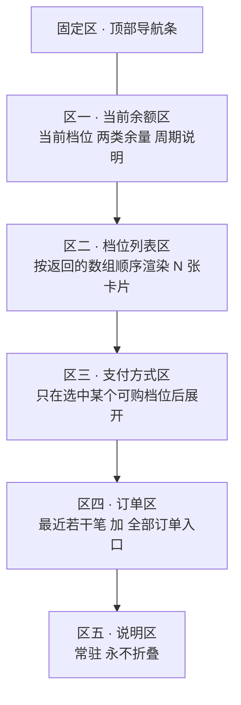
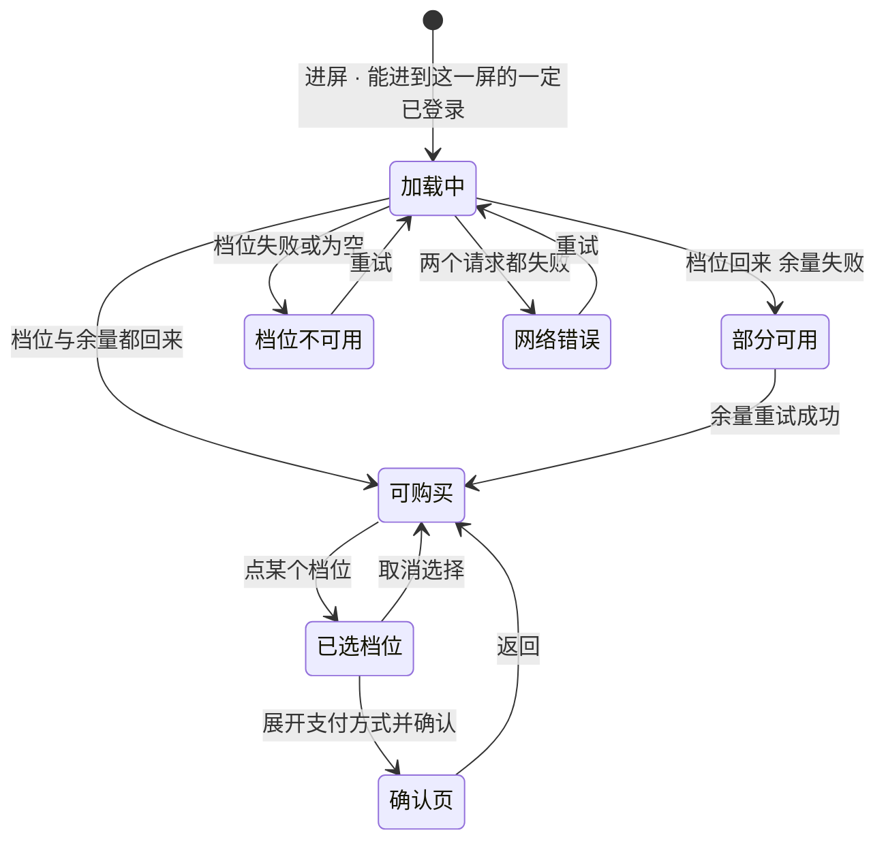
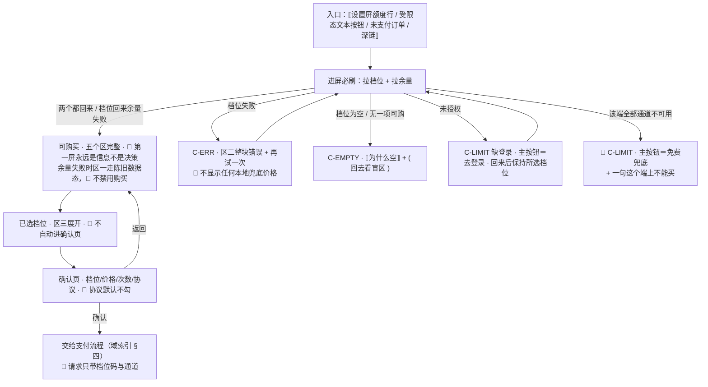

# U7.3 · 档位与购买

> **基线**：`origin/v1` @ `73041df`，fetch 于 2026-09-02。
> **状态：活跃。** 档位来源方式变化、卡片状态枚举增减、屏幕分区结构变化、或预选规则改动，本文同一次改动内更新。
> **上一层**：[M7 商业化 · 域索引](INDEX.md)

---

## 一、这个子能力是什么、不是什么

**是**：一屏信息。它把「现在有哪些档位、每一档包含什么、我现在在哪一档、我这个月还剩多少」
摊开给用户看，并在他自己决定之后把他交给支付流程。

**不是**：

- **不是落地页。** 没有任何自动跳转到这一屏的路径；深链带着档位码进来**也不预选**，
  否则它就会被当成一个推广落地页来用
- **不是一个漏斗。** 屏内没有倒计时、没有限时、没有「仅剩」、没有默认勾选、没有底部悬浮购买条
- **不是定价文档。** 🔴 **一个价格数字、一个额度次数都不在本层**，真源只有 `商业化与额度设计` §一 一处
- **不是档位个数的定义处。** 前端**不假设个数**，按服务端返回的数组长度渲染

**当前的形状是「单档、记多点」，而且这一档之上是空的。**
这是刻意的临时状态，不是「想清楚了」—— 在没有任何真实用量分布之前，
多定一档就是多猜一组数字，**而多猜的那组数字会被当成结论引用**（`商业化与额度设计` 导语）。

---

## 二、详细产品逻辑

### 2.1 🔴 档位、价格、额度全部由服务端返回，前端不硬编码

**理由只有一条：写死一次，改价就要发版**（`技术架构与接口契约` §6.6 · `额度与购买` §十八）。

| 禁止的形态 | 为什么它也算硬编码 |
|---|---|
| 兜底默认价格 | 拉不到时显示一个「大概是这个数」，用户会照着它做决定 |
| 本地缓存的上次价格 | 上次的价格不是这次的价格，而钱的事不做乐观展示 |
| 离线时的展示值 | 同上 —— 离线时**整块不显示**，不显示任何数字 |
| 埋点里带的价格 | 埋点是另一份副本，副本会独立过期 |
| 测试用的假数据进生产 | 这是最容易发生的一种 |
| 档位个数写死 | 加一档就要改前端，等于把「以后不重构」这句话作废 |
| 自己造一个「原价划线」 | 单档没有价格锚点是**认下来的代价**，不是前端可以补的洞（见 §2.6） |

🔴 **拉不到就不显示卡片。** 屏幕上出现一个价格数字的唯一合法来源，是这一次服务端返回的那一份。

### 2.2 这一屏的分区与它们各自的规矩

**一屏到底的单列滚动页**：没有横向 Tab、没有分步向导、**没有底部悬浮购买条**。



| 规则 | 为什么 |
|---|---|
| **没有底部悬浮购买条** | 悬浮条会把购买动作提升成全屏级别的主动作，与「付费入口是次要位置」冲突 |
| **区三默认收起** | 未选中档位时不渲染支付方式 —— 避免「还没决定买什么就先看到怎么付钱」 |
| **区五永不折叠** | 「导出永远免费、不限次数」与「不自动扣费、到期就停」两句是**承诺**，不是可折叠的补充说明 |
| **返回键任何时候可用** | 进到确认页后返回退回本屏，**不弹「确定放弃购买吗」** —— 那是挽留 |
| 🔴 **任何入口都不允许「进来就弹确认页」** | 这一屏的第一屏永远是**信息**，不是**决策** |

### 2.3 从不同入口进来时的预选规则

**「预选」只影响滚动位置与卡片的视觉焦点，不代表已选中，更不触发下单。**

| 入口 | 预选 | 落点 | 理由 |
|---|---|---|---|
| 设置屏的额度行 | **不预选** | 区一顶部 | 用户是来看余量的，不是来买的 |
| 受限态的「看看档位」 | **不预选** | 区二顶部 | **预选一个档位等于替用户做了决定**；但他是带着「看看档位」的意图来的，所以落点不停在区一 |
| 从确认页退回 | **保持上次选中的档位** | 该卡片位置 | 退回不等于放弃 |
| 登录态过期重登后回跳 | **保持重登前所选档位** | 该卡片位置 | 丢了就是让用户重选一遍 |
| 订单历史里点某笔未支付订单 | **预选该订单对应的档位** | 区二该卡片 | 这一次用户的意图是明确的 |
| 深链或外部唤起 | **不预选** | 区一顶部 | 带着档位码也不预选，**防止被当成推广落地页** |

### 2.4 屏幕状态枚举



| 态 | 屏幕上是什么 | 不允许 |
|---|---|---|
| 加载中 | 区一、区二各自骨架占位 | 不允许整屏转圈遮罩 |
| 部分可用 | 区二正常；区一显示上次余量并打上「这是刚才的数据」 | **不允许因为余量拉不到就禁用购买** |
| 档位不可用 | 区二整块错误态 + 重试 | 🔴 **不允许显示任何本地兜底价格** |
| 网络错误 | 整屏错误态 + 重试 | 不允许出现错误码原文或英文 |
| 已选档位 | 该卡片高亮，区三展开 | **不允许自动进确认页** |
| 确认页 | 档位 · 价格 · 包含次数 · 协议勾选 · 支付按钮 | 🔴 **不允许默认勾选协议** |

🔴 **枚举里没有「未登录」这一态。**（2026-09-02 裁定：没有本机模式。）
未登录只能停在产品说明与登录门那一屏，**根本进不到这里**；
唯一与登录有关的运行时情况是**登录态中途过期**。

### 2.5 档位卡片自身的状态

| 卡片态 | 触发条件 | 视觉 | 可点 |
|---|---|---|---|
| 可购买 | 服务端标为可购，且这一端有可用支付通道 | 正常 | ✅ |
| 当前档位 | 当前订阅的档位码命中本卡 | 加**文字**标记 | ✅（可续期） |
| 不可购买 | 服务端标为不可购 | 常态显示，但**没有购买按钮** | ❌ |
| 通道不可用 | 这一端所有支付通道均不可用 | 按钮置灰 + 一行说明 | ❌ |
| 已有进行中订单 | 同档位存在未终结的订单 | 按钮换成「继续上一笔」 | ✅ |

**两条不许省的规矩：**

- 🔴 **拉不到当前订阅就不标记「当前档位」，不猜。** 猜错的后果是用户以为自己已经买了
- 🔴 **推荐标记不能只靠颜色。** 颜色不作为唯一信息载体 —— 推荐档位必须同时有**文字**标记，
  且这个文字必须朗读得出来

### 2.6 单档的代价：没有价格锚点，而且不许自己造一个

**多档定价的作用之一是给用户一个内部参照系。只剩一档，这个参照系就没了** ——
用户判断「贵不贵」时只能拿外部产品比，**而拿谁比、那东西贵还是便宜，我方完全不可控**。

这是删掉上层档实实在在的代价，**不是顺带的小问题**，也不是前端能补的洞：

| 想到的补法 | 判定 |
|---|---|
| 加一个「原价划线」 | 🔴 **禁止。** 那是凭空造一个锚点，等于先有锚点再找理由 |
| 加一个卖不动的高档位当陪衬 | 🔴 **禁止。** 它同时是毛利最薄和风险敞口最大的一档 |
| **把额度换算成用量，用「用量」当锚点顶替「价格」锚点** | ✅ **唯一允许的缓解，而且很弱** —— 卡片上给一行日均换算，让用户拿自己的记录节奏去比 |

**真正的解只能是按真实用量分布决定加不加第二档，在那之前不造锚点。**

### 2.7 下单只收档位码

| 规则 | 说明 |
|---|---|
| 下单请求**不带金额** | 下单接口若接受金额，就等于把定价交给客户端 |
| 确认页展示的价格与下单返回的金额不一致 | **阻断**，退回档位列表并重新拉一次档位；**以服务端金额为准，不静默继续** |
| 所选档位已下架 | 该卡片消失 + 页内提示，下单被拒，未扣款 |
| 协议 | 默认不勾，**必勾才能支付**；未勾时不发请求 |
| 同档位已有未支付订单 | **复用，不新建** —— 不会出现两笔待支付 |

---

## 三、前端行为意图 × 后端契约意图

| 事项 | 前端行为意图 | 后端契约意图 |
|---|---|---|
| 拉档位 | 按数组长度渲染；**代码里搜不到档位个数**；拉不到就不显示卡片 | 返回**数组**而不是两个固定字段；档位、价格、额度全由服务端定；必带「不自动续费」这个恒定值；必须能区分**可购 / 不可购** |
| 价格格式 | 服务端以最小货币单位给整数，前端格式化；非整数或负数**不渲染该卡片** | 币种当前只有一种；**对所有通道返回同一个价**（分端差价本身就是一条指向外部支付的箭头） |
| 当前档位 | 命中才标记，拉不到**不猜** | 返回档位 + 到期时间；到期时间为空表示免费档，那一行整行不渲染 |
| 额度换算行 | 由前端把次数换算成日均用量 | 每档的两类次数必须随档位一起返回，缺任一项该行不显示 |
| 下单 | 只发档位码与通道 | 🔴 **不接受金额**；金额由服务端按档位定；同档位有未支付单则复用；返回订单号与调起参数 |
| 计费周期字段 | 缺失时只显示价格，不显示周期 | 🚧 **未定稿** —— 见 §五 |
| 推荐标记 | 有字段才显示，且必须是文字 | 🚧 **未定稿** —— 见 §五 |
| 本端可用通道 | 区三只显示这一端真的能用的 | ✅ **已补**（`接口契约：签名与错误码全集` §8.3 `GET /billing/channels`）；降级保留：拉不到就只能按端硬编码，**而那是另一种硬编码** |
| **已有进行中订单** | 同档位存在未终结订单时按钮换成「继续上一笔」 | ✅ **已补**（`接口契约：签名与错误码全集` §8.9）：`GET /billing/subscription` 返回 `pendingOrders`，每笔带 `planCode` 与 `state`。🔴 按钮按 `state` 分两支：`PENDING` 可点「继续上一笔」，`CONFIRMING` **禁用 + 说明「上一笔还在确认中」**（确认中不给重新支付）。**一笔都没有时整个字段不出现，不是空数组** |
| **区四 · 订单区** | 最近若干笔 + 「全部订单」入口 | ✅ **契约不缺行**：用已有的 `GET /billing/orders`（`技术架构与接口契约` §6.6 / 形状见 `接口契约：签名与错误码全集` §8.6），取 `limit=3`；「全部订单」是同一个端点不带 `limit`，通向 `U7.6` 那一屏。🔴 **不为区四新建「档位屏专用的订单摘要端点」** —— 建了订单列表就有第二个真源（`接口契约：签名与错误码全集` §8.10） |

---

## 四、边界与红线在这里的具体形态

| 边界 | 在这一单元的形态 |
|---|---|
| **不判断对错** | 卡片上只有「有没有、几次、多久前」：档位有没有、包含几次、什么时候到期。**不出现「适合你」「大多数人选这个」** |
| **不引导至外部支付** 🔴 | 不出现任何跨端价格比较、不出现「网页版更便宜」、不做分端差价。**差价本身就是一条指向外部支付的箭头** |
| **没有第四种反馈形态** | 不做「档位涨价提醒」、不做到期前推送、不做未读角标 |
| **不做促销心理机制** 🔴 | 不限时、不折扣、不倒计时、不「仅剩」、不默认勾选、不弹挽留 |
| **不做积分 / 打卡 / 徽章** | 权益列表里不出现任何以「打开次数」为奖励对象的东西 |
| **一个数字都不落在本层** | 价格、次数、档位个数全部指针到 `商业化与额度设计` §一 |

🔴 **一条可机械核对的检查**：对本层文档与前端代码同时扫描，
**搜不到任何一个价格数字、额度次数或档位个数的字面量。**

---

## 五、缺口登记

| # | 缺口 | 缺的是哪一半 | 该谁定 |
|---|---|---|---|
| 1 | **档位的计费周期字段**（🚧） | 卡片上要显示「每{周期}」，**契约里没有这个字段**。缺失时只能退化成只显示价格 | **技术同事** |
| 2 | **推荐标记字段**（🚧） | 产品侧已定：必须是文字、必须朗读得出来、不能只靠颜色。**契约侧没有这个字段** | **技术同事** |
| ✅ 3 | ~~「这一端有哪些支付通道可用」没有查询接口~~ | **已闭合（2026-09-03）**：`接口契约：签名与错误码全集` §8.3 `GET /billing/channels` | 已补 |
| 4 | **用满这一档之后是什么**（🚧） | 撞顶的用户在受限态与本屏都没有下一步；**单档没有价格锚点也挂在这里** | **产品，但现在不定** —— 加档的依据是撞顶的人，不是「多一档能多赚」 |
| 5 | **确认页上那个必勾的协议没有正文** | 界面位置已定、勾选规则已定，**正文待律师稿**；退款条款最终也落在同一份稿子里 | 律师稿 |
| 6 | **匿名能不能拉到档位列表，与「没有本机模式」对不上** | 契约里那一格标着「匿名可访问」，而**没有一个未登录的用户走得到这一屏**。要么改成需登录，要么明确它只为一个不存在的界面留着 | **技术同事**；本单元只登记，不改契约 |

---

## 六、线框

> 记号与屏宽照 `线框与交互规格约定` §三（40 个半角字符），组件只引锚不抄规格。
> 🔴 **框里没有一个价格、一个次数、一个档位个数。** 价格与额度一律写成槽位 `⟦档位·服务端返回⟧`；卡片按返回的数组长度渲染，**线框画几张不代表有几档**。

### 6.1 常态整屏（单列到底，五个区）

```
┌────────────────────────────────────────┐
│ ‹返回› ⟦屏标题⟧ ←P-NAV·固定区，不随滚动│
├────────────────────────────────────────┤
│ 区一 · 当前余额                        │
│  ⟦当前档位名·拉不到不渲染⟧             │
│  ⟦到期日⟧ ⟦两行余量⟧ ⟦周期标识⟧  ※1    │
├────────────────────────────────────────┤
│ 区二 · 档位列表（按数组顺序）     ※2   │
│  ┌──────────────────────────────────┐  │
│  │⟦档位名·服务端返回⟧               │  │
│  │⟦价格·服务端返回⟧⟦每{周期}⟧  ※3   │  │
│  │⟦两类次数·服务端返回⟧             │  │
│  │⟦日均换算行·前端算，缺则不显示⟧※4 │  │
│  │⟦当前档位·文字标记⟧  [ 选这个 ]※5 │  │
│  └──────────────────────────────────┘  │
│  ⟦…按数组长度继续向下排⟧         ※6    │
├────────────────────────────────────────┤
│ 区三 · 支付方式 ⟦默认收起⟧       ※7    │
├────────────────────────────────────────┤
│ 区四 · 订单 ⟦最近若干笔⟧ ‹全部订单›    │
├────────────────────────────────────────┤
│ 区五 · 说明 ⟦两句承诺⟧ 🔴 永不折叠※8   │
└────────────────────────────────────────┘
```

※1 余量写「还剩 {n} 次」，🔴 **不用进度条、不用百分比、不用环形图** —— 进度条会把余量变成一个可以看着它变少的对象　※2 🔴 **没有底部悬浮购买条**：悬浮条会把购买提升成全屏级别的主动作，与「付费入口是次要位置」冲突　※3 计费周期字段 ✅ 已补（`接口契约：签名与错误码全集` §8.2 `billingPeriod`）；仍保留降级：字段缺失时**只显示价格，不显示周期**，不自己编一个
※4 单档没有价格锚点，🔴 **唯一允许的缓解是这一行日均换算**；不许造原价划线、不许摆一个卖不动的陪衬档（§2.6）　※5 「选这个」是**次按钮**：本屏的主按钮位置留给免费路径，购买不是这一屏最该做的那一件事
※6 推荐标记字段 ✅ 已补（`接口契约：签名与错误码全集` §8.2 `badge`）；🔴 **必须是文字且朗读得出来，不能只靠颜色**　※7 未选中档位不渲染区三 —— 避免「还没决定买什么就先看到怎么付钱」；本端可用通道 ✅ 已补（`接口契约：签名与错误码全集` §8.3）　※8 两句承诺（导出永远免费不限次数 / 不自动扣费到期就停）是承诺不是补充说明；🔴 区五里**没有自动续费开关、没有默认勾选**

### 6.2 其余各态：只画变化区

```
│ 骨架 C-SKEL · 区一区二各自占位         │
│  ···  ···  🔴 不整屏转圈遮罩           │
├────────────────────────────────────────┤
│ 空态 C-EMPTY · 档位数组为空            │
│  ⟦为什么空⟧ ( ⟦回去看盲区⟧ ) ←主 ※9    │
├────────────────────────────────────────┤
│ 错误态 C-ERR · 档位没拉到 / 整屏失败   │
│  ⟦哪一步没成⟧ ( 再试一次 ) ←主 ※10     │
├────────────────────────────────────────┤
│ 陈旧数据态 · 档位回来、余量没回来      │
│  区二⟦同常态⟧ 区一⟦上次值⟧+⟦刚才的     │
│  数据⟧  🔴 不因余量拉不到禁用购买※11   │
├────────────────────────────────────────┤
│ 受限态 C-LIMIT · 这一端买不了     ※12  │
│  ( ⟦回去看盲区/继续用免费的⟧ ) ←主     │
│  ⟦这个端上不能买⟧  ← 一句事实，无入口  │
├────────────────────────────────────────┤
│ 受限态 C-LIMIT · 缺登录（令牌失效）    │
│  ( ⟦去登录⟧ ) ←主，这一档无兜底 ※13    │
```

※9 成因是「上游还没就绪」，🔴 只给一个当下就能做的事，**不给等待提示、不给「敬请期待」**
※10 🔴 **错误态里一个本地兜底价格都不显示**；不出现错误码原文与英文
※11 「拉不到」不是「没有」：余量未知不阻断购买，也不显示 0
※12 该端所有支付通道均不可用时，🔴 **只显示兜底 + 一句「这个端上不能买」**（`C-LIMIT` 多端差异）；卡片级的通道不可用是按钮置灰 + 一行说明，**灰按钮必须能说出原因**（§1.3）
※13 缺登录这一档**没有免费兜底**；🔴 枚举里**没有「未登录」这一态** —— 进得到这一屏的一定已登录

### 6.3 红线自查十条，逐张数过

| # | 数这一样 | 本单元 |
|---|---|---|
| 1–6 | 正确率 / 讲解 / 提醒 / 小红点 / 打卡 / 徽章 / 进度环 / 百分比 / 倒计时 / 限时 / 划线价 / 「仅剩」/「已有 X 人购买」/ 挽留 | 0 —— 卡片只答「有没有、几次、多久前」，不写「适合你」「大多数人选这个」，不做涨价提醒与到期推送；🔴 逐张数过：没有倒计时、没有限时优惠、没有原价划线、没有名额、没有已购人数；返回不弹「确定放弃购买吗」；协议默认不勾 |
| 7–10 | 能装下题干的格子 / 置信度 / 原图入口 / 三处不可弱化 | 0 —— 本屏唯一的输入是发票抬头（属本域另一个单元）；不显示置信度；不碰原图；三处落在 `模块地图` §三登记的 `U8.3` / `U8.4`，不重画也不弱化 |

---

## 七、交互规格

### 7.1 必答五项

| # | 必答 | 本单元的答案 |
|---|---|---|
| 1 | **入口** | 四条：① 设置屏的额度行；② 受限态的文本按钮；③ 订单历史里点某笔未支付订单；④ 深链或外部唤起。🔴 **没有任何自动跳转到这一屏的路径**，**任何入口都不允许「进来就弹确认页」**；深链带着档位码**也不预选**（防止被当成推广落地页）。预选与滚动落点逐入口见 §2.3；登录后回跳保持重登前所选档位（`P-NAV`） |
| 2 | **结束状态** | 本屏自身的终态有三个：**已选档位**（区三展开）、**返回**（不弹挽留）、**交给支付流程**。🔴 订单态是**另一条与记录不相干的轨**，真源在本域另一个单元（清单见域索引 §四）；🔴 **记录状态一格未动** —— 主轨四态与 `TS-00`–`TS-09` 都不因本屏发生转移 |
| 3 | **失败落点** | 档位拉不到 → 区二整块错误态 + 重试，🔴 **不显示任何本地兜底价格**。两个请求都失败 → 整屏错误态 + 重试。余量拉不到 → 区一陈旧数据态，**购买不受影响**。确认页价格与下单返回金额不一致 → **阻断，退回区二并重新拉档位**，不静默继续。所选档位已下架 → 该卡片消失 + 页内提示 |
| 4 | **空态** | 两种成因、两句话：① 档位数组为空；② 数组里没有一项可购。两种都只给「回去看盲区」这一个动作 —— 🔴 **盲区永不上锁，所以它能当降级出口**（`I-4`） |
| 5 | **错误态** | 可重试：档位超时 / 网络失败 → 主按钮＝再试一次。不可重试：档位已下架、金额不符 → 出路是重选，不是重试。🔴 **有缓存时是陈旧数据态不是错误态**；但**价格没有陈旧态** —— 上次的价格不是这次的价格，拉不到就不显示卡片 |

### 7.2 受限态（按需追加项）

| 档 | 缺什么 | 主按钮 | 次入口 |
|---|---|---|---|
| **这一端买不了** | 该端全部支付通道不可用 | 🔴 **免费兜底那一条**（回去看盲区 / 继续用免费能力） | 无 —— 不给任何指向别处付款的出口 |
| 缺登录 | 已登录后令牌失效 | 去登录 —— 这一档**没有免费兜底** | 无 |
| 缺额度 | —— | 🔴 **本屏不存在缺额度受限态**：用户正是带着余量不足的意图进来的 | —— |

🔴 **可断言的检查**：对本层文档与前端代码同时扫描，**搜不到任何一个价格数字、额度次数或档位个数的字面量**；断网进本屏，**屏幕上一个数字都不出现**。

### 7.3 交互流程



⚠️ 本节不写端点路径。界面对后端只有四条要求：① 返回**数组**而不是两个固定字段，且能区分**可购 / 不可购**；② 🔴 **下单不接受金额**，金额由服务端按档位定；③ 对所有通道**返回同一个价**（分端差价本身就是一条指向外部支付的箭头）；④ ✅ 三处 `[契约缺]` 已于 2026-09-03 全部闭合：计费周期字段与推荐标记字段 → §8.2（`billingPeriod` / `badge`），本端可用通道 → §8.3 `GET /billing/channels`。**降级规则保留**：缺哪一项就退化成不显示那一项，不自己编。
