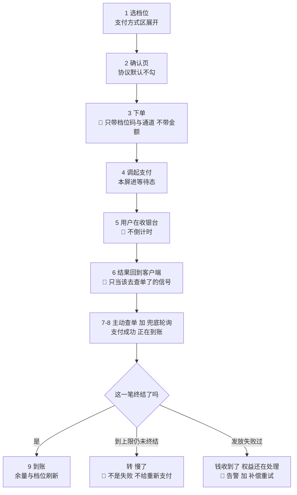
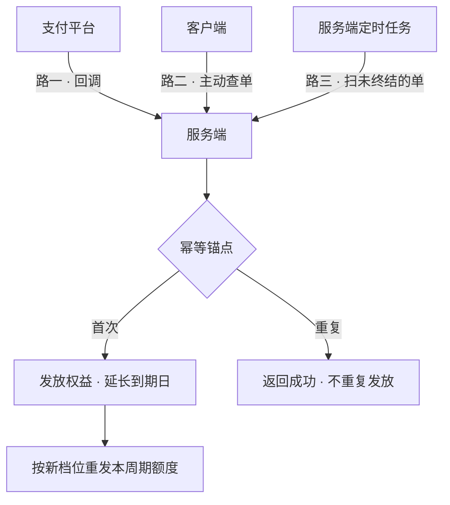
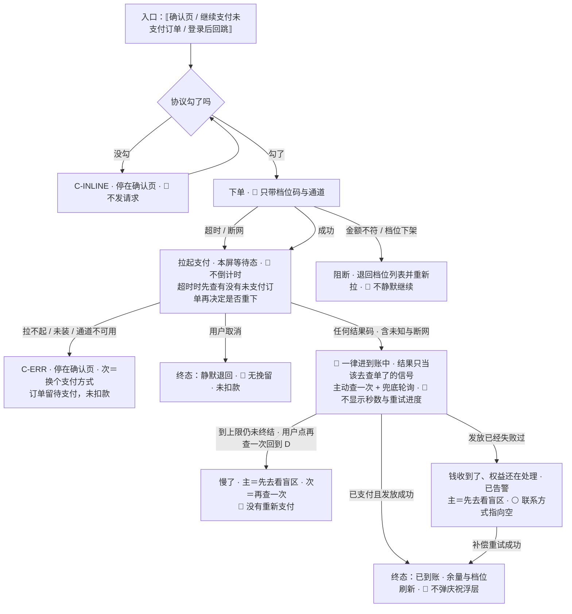

# U7.4 · 支付流程

> **基线**：`origin/v1` @ `73041df`，fetch 于 2026-09-02。
> **状态：活跃。** 步骤增减、幂等锚点变化、「确认中」的呈现方式变化、或偏离路径的处置改动，本文同一次改动内更新。
> **上一层**：[M7 商业化 · 域索引](INDEX.md)

---

## 一、这个子能力是什么、不是什么

**是**：从「用户点了某个档位」到「余量与档位刷新」之间那一段。
它的全部难点集中在一个事实上：**钱的状态由支付平台裁定，而客户端拿到的结果只是一个信号。**

**不是**：

- **不是一个转化流程。** 没有挽留、没有倒计时、没有「优惠即将过期」；用户取消就静默退回
- **不是一个乐观的流程。** 🔴 **钱的事一律以服务端查单为准**，本地不先行显示任何已购状态
- **不是记录动作。** 🔴 **下单不进离线写入队列** —— 一笔延后几小时才发出去的订单，用户早就忘了
- **不定义订单态。** 订单有哪些态、每个态用户能做什么在 `模块地图` §三 登记的 `U7.6`；本单元只写「怎么走到那些态」

---

## 二、详细产品逻辑

### 2.1 逐步骤

**九步与每步的失败落点，真源见 `额度与购买` §十。**



| 步 | 屏幕上是什么 | 偏离落到哪 |
|---|---|---|
| 1 选档位 | 卡片高亮，支付方式区展开 | 档位已下架 → 卡片消失 + 提示，下单被拒 |
| 2 确认页 | 档位 · 价格 · 包含次数 · 协议勾选（**默认不勾**） | 未勾协议 → 页内提示 + 协议行抖动一次，**不发请求** |
| 3 下单 | 支付按钮进等待态，**不禁用返回** | 超时 → 先查再决定是否重下；金额不符 → 阻断；重复提交 → 复用 |
| 4 拉起支付 | 本屏置为等待态 | 未安装支付客户端 / 无响应 / 通道不可用 → 页内提示 + 换通道 |
| 5 用户在收银台 | 保持等待态，**不倒计时** | 取消 → 静默返回；切后台 → 回来后进「到账中」并查单 |
| 6 结果回到客户端 | **一律转入「到账中」** | 未识别的结果码 → 按「结果未知」处置；断网 → 联网后查 |
| 7 主动查单 | 「支付成功，正在到账」 | 查单失败 → 按轮询节奏重试 |
| 8 轮询 | 同上，**不显示剩余秒数** | 到上限 → 转「慢了」，**不是失败** |
| 9 到账 | 短提示 + 余量与档位刷新 | 发放失败 → 转「钱收到了，权益还在处理」 |

🔴 **第 6 步写死：客户端拿到的支付结果只作为「该去查单了」的信号，不作为「已经成功了」的结论。**

### 2.2 三条路指向同一次发放

**幂等的两个锚点与它们的分工，真源见 `后端系统设计与组件接入` §1.10。**



**如果三条路各自发一次，用户付一次钱会拿到三份权益。** 幂等锚点有两个，分工不同：

| 锚点 | 防的是 |
|---|---|
| **订单号唯一** | **下单**幂等 —— 用户连点两次不产生两笔单 |
| **交易号唯一** | **回调**幂等 —— 重复通知、多路径到达不重复发放 |

还有一条不能省：**回调金额与订单金额不符 → 拒绝并告警，不发放。**
回调是外部输入，金额校验是最后一道。

🔴 **两条界面侧的约束：** 客户端**不能只等回调**（回调可能延迟或永远不到）；
**三条路都不改变界面文案** —— 用户不需要知道是哪条路让权益到的账。

### 2.3 🔴 「确认中」怎么呈现：它不能就近归到成功或失败

**「确认中」是一个独立的态。** 就近归类的两种错法后果都很重，而且不对称：

| 就近归到 | 后果 |
|---|---|
| 成功 | 没收到钱却发了权益 |
| **失败** | **用户明明扣了款，界面说没付上，他会再付一次** |

**第二种更糟，因为那是产品主动诱导用户重复付款**（`后端系统设计与组件接入` §1.10）。

**所以界面上不给「重新支付」按钮。这是本域唯一一条靠「不给按钮」来兑现的产品要求。**
给用户的是另外两个：

| 给什么 | 为什么成立 |
|---|---|
| **再查一次** | 有冷却，防止连点打穿服务端 |
| **先去看盲区** | 🔴 **它能当降级出口，正是因为盲区诊断永不上锁**（`I-4`）。红线在这里不是限制，是可用的出口 |

⚠️ **还有第三种错法，比前两种更隐蔽：把一笔已经失败过的发放也叫「正在到账」。**
那会让**失败永远不被发现** —— 它会一直穿着「正在到账」这件衣服，直到用户自己放弃。
所以「支付成功但发货失败」必须是独立一态，形态见 `模块地图` §三 登记的 `U7.6`。

### 2.4 到账慢了不是失败

| 项 | 规定 | 理由 |
|---|---|---|
| 触发查单 | 支付结果回到客户端后**立即查一次**，不等 | 回调可能已经到了，也可能永远不到 |
| 轮询节奏 | 固定间隔 | **固定间隔比退避更容易向用户解释** |
| 轮询上限 | 有上限；**到上限转「慢了」，不是转失败** | 钱已经付了，说「失败」就是在替服务端撒谎 |
| 上限之后 | 停止自动轮询，给「再查一次」+「先去看盲区」 | 用户不必守在这一屏 |
| 服务端定时补偿 | 独立于客户端，扫未终结的单 | **用户关掉应用也能到账** |
| 🔴 前端乐观展示 | **禁止** | 见 §2.6 |

**界面上不显示剩余秒数。** 显示秒数会把一次正常的等待包装成一次倒计时。

### 2.5 八条偏离路径

**八条与它们各自的钱的最终状态，真源见 `额度与购买` §10.3。**

| 偏离 | 处置 | 钱的最终状态 |
|---|---|---|
| **拉起失败** | 订单留在待支付，可换通道重来 | 未扣款 |
| **用户取消** | 静默退回，订单留在待支付。**无提示、无挽留** | 未扣款 |
| **支付成功但回调未到** | 主动查单 + 兜底轮询 + 服务端定时补偿 | 钱已付，**权益最终会到** |
| **重复下单** | 同档位复用未支付订单，不新建 | 最多一笔待支付 |
| **订单超时关闭** | 关单，可重新下单 | 未扣款 |
| **跨端下单、另一端支付** | 同一笔订单，任一端可继续付 | **只发放一次** |
| **已关闭后又完成支付** | 告警，不发放 | ⚪ **退还路径未定，见 `模块地图` §三 登记的 `U7.7`** |
| **同一订单付两次** | 幂等，不重复发放 | ⚪ **重复付款的退还路径未定，见 `模块地图` §三 登记的 `U7.7`** |

⚠️ **「无挽留」是刻意的：** 取消支付时不弹「再想想」「优惠即将过期」。**挽留是促销心理机制。**

⚠️ **最后两行是本单元与退款那一格的接缝**：钱已经在我方，而怎么退回去没有任何一处定义过。
本单元把它指过去，**不在这里补一个流程** —— 补出来的会被下游当成契约实现。

### 2.6 🔴 钱的事不做乐观展示

**四条禁止与它们各自的理由，真源见 `额度与购买` §14.3。**

| 禁止 | 理由 |
|---|---|
| 本地先把档位改成已购，等服务端确认 | 用户会以为买到了，而实际可能没扣款成功 |
| 本地先把余量加上，等服务端确认 | 同上，而且会导致他的**下一次 AI 调用意外失败** |
| 断网时把「到账中」显示成「已到账」 | **这是在替服务端撒谎** |
| 把「结果未知」显示成「支付失败」 | 归到失败会诱导用户再付一次 |

**唯一允许的本地展示是「上一次从服务端拿到的值」，且必须打上「这是刚才的数据」。**

### 2.7 断网，逐时点

| 断网时点 | 处置 | 钱的最终状态 |
|---|---|---|
| 下单请求发出前 | 不发请求，提示 + 重试 | 无订单 |
| 下单已发、响应未回 | 恢复后**先查有没有未支付订单，再决定是否重下** | 最多一笔待支付 |
| 拉起支付前 | 订单已建，停在待支付 | 未扣款 |
| 收银台内 | 由支付平台自己处理；回到我方后**一律进「到账中」** | 以服务端查单为准 |
| 支付完成、查单前 | 进「到账中」，联网后自动查 | 钱已付，权益最终到账 |
| 轮询过程中 | **轮询失败不计入上限**，联网后继续 | 同上 |
| 到账后、刷新余量前 | 余量显示「这是刚才的数据」 | 权益已发放 |

🔴 **这一屏不进离线写入队列。** 离线队列是给记录动作的；**下单不是记录动作，不能排队补传。**

---

## 三、前端行为意图 × 后端契约意图

| 事项 | 前端行为意图 | 后端契约意图 |
|---|---|---|
| 下单 | 只发档位码与通道；确认页价格与返回金额不一致就阻断 | 🔴 **不接受金额**；同档位有未支付单则复用；返回订单号与调起参数 |
| 拉起支付 | 拉不起来就换通道，订单留在待支付 | 不涉及 |
| 结果确认 | 支付结果只当信号；立即查一次；轮询有上限 | 单笔查询必须能区分五个态 —— **少一个态，界面映射就落不下来** |
| 回调 | 无界面 | 🔴 **不走应用鉴权链路，独立验签**；按交易号幂等；**金额不符拒绝并告警** |
| 定时补偿 | 无界面 | 扫未终结的单反查，**独立于客户端是否在线** |
| 发放 | 到账后必刷余量与档位 | 三条路撞同一个幂等锚点；发放同时延长到期日并按新档位重发本周期额度 |
| 重复提交 | 网络恢复后可能重发同一次下单 | 按档位码复用未支付订单，**不会出现两笔** |
| 主动关单 | 用户明确放弃时清掉待支付单 | 🚧 **空，且不是必需项** —— 没有它就靠超时关闭 |
| 已关闭后又支付 / 同一单付两次 | 界面只陈述事实，**不承诺退款时间** | ⚪ **空** —— 退还路径从未定义，见 `模块地图` §三 登记的 `U7.7` |

---

## 四、边界与红线在这里的具体形态

| 边界 | 在这一单元的形态 |
|---|---|
| **不引导至外部支付** 🔴 | 每一端自带完整支付路径；不出现二维码、跳转链接、「网页版更便宜」、客服话术暗示。**这条同时是平台规则与已定的形态结论** |
| **不做促销心理机制** 🔴 | 不挽留、不倒计时、不显示剩余秒数、不弹庆祝浮层 |
| **不弹窗** | 全屏浮层只用于不可逆或必须二选一的动作；支付流程里没有这样的动作 |
| **不判断对错** | 界面只陈述钱和权益的事实状态，不评价用户的选择 |
| **没有第四种反馈形态** | 到账用一次性的短提示，**不做推送、不做未读计数**；用户关掉应用照样到账，靠的是定时补偿不是通知 |
| `I-4` 盲区永不上锁 | 「先去看盲区」能当降级出口，**依赖的正是这条不变量** |

🔴 **两条可断言的检查：**

1. 抓包检查下单请求，**请求体里只有档位码与通道，不含金额**。
2. 枚举支付流程能到达的全部界面态，**没有任何一处出现「重新支付」按钮**。

---

## 五、缺口登记

| # | 缺口 | 缺的是哪一半 | 该谁定 |
|---|---|---|---|
| 1 | ⚪ **钱已在我方、但订单不该发放时的退还路径** | 「已关闭后又完成支付」与「同一订单付两次」两条，界面只能说「钱如果扣了会退回来」，**而这句承诺背后没有任何流程**。缺的是整条退款定义 | 见 `模块地图` §三 登记的 `U7.7`；**本单元不补** |
| 2 | **支付超时（订单自动关闭）的时长** | 以支付平台的收银台超时为准，**产品不另定** —— 但「以谁为准」这句话本身还没被确认过 | **技术同事** |
| 3 | **主动关单端点**（🚧） | 非必需项。没有它，用户明确放弃后下次进来仍会撞到那笔旧单并被要求「接着付」 | **技术同事** |
| 4 | **除微信之外的支付通道做不做**（🚧） | 契约里的通道取值只有微信两个；另一个常见通道从未出现在契约里，**而多端矩阵里有好几格等着它** | **技术同事 + 需人裁定** |
| 5 | **整屏能不能上线不由产品决定** | 备案、类目审核、商户号、对公账户 —— 每一条都在合规轨上。**本单元只登记这个依赖，不催、不重排** | 合规轨 |
| 6 | **「钱收到了、权益没发」之后找谁** | 补偿重试若最终仍失败，用户要找谁 —— **客服形态、响应时效、联系方式都没定**，说明区那条「联系方式」现在指向空 | **需人裁定**；落点是运营后台占位树，见 `模块地图` §三 登记的 `U7.7` |

---

## 六、线框

> 记号与屏宽照 `线框与交互规格约定` §三（40 个半角字符），组件只引锚不抄规格。本单元只画**确认页与其后那一段**；档位列表那一屏在本域另一个单元（清单见域索引 §四）。

### 6.1 常态整屏 · 确认页

```
┌────────────────────────────────────────┐
│ ‹返回› ⟦屏标题⟧  ←P-NAV·任何时候可用※1 │
├────────────────────────────────────────┤
│ ⟦所选档位名·服务端返回⟧                │
│ ⟦价格·服务端返回⟧⟦包含的两类次数⟧      │
│ ⟦支付通道·只列这一端真能用的⟧    ※2    │
│  ◉ ⟦通道一⟧   ○ ⟦通道二⟧               │
│ ○ ⟦协议勾选·🔴 默认不勾⟧         ※3    │
│ ⟦退款说明这一格：见域索引 §四⟧    ※4   │
├────────────────────────────────────────┤
│ (      ⟦去支付⟧      ) ← C-BTN 主 ※5   │
└────────────────────────────────────────┘
```

※1 🔴 返回任何时候可用，退回档位列表，**不弹「确定放弃购买吗」** —— 那是挽留　※2 本端可用通道 `[契约缺]`：拉不到就只能按端硬编码，**而那是另一种硬编码**　※3 🔴 默认不勾、必勾才能支付；未勾时**不发请求**（§五：协议正文待律师稿）　※4 ⚪ 退款说明现在**一个字都不写**，理由与该谁定见域索引 §四登记的那一格　※5 连点保护：首次点击立刻进加载态并**吞掉**后续点击，不排队、不计数（`C-BTN`）；加载中不改变按钮占位

### 6.2 支付途中、「确认中」与其余各态：只画变化区

```
│ 支付进行中·⟦正在支付⟧ 🔴 不倒计时※6    │
├────────────────────────────────────────┤
│ 到账中（后端「确认中」的一种说法）※7   │
│ ⟦支付成功，正在到账⟧🔴 不显示秒数与进度│
├────────────────────────────────────────┤
│ 🔴 慢了（到上限仍未终结·不是失败）※8   │
│ ⟦钱已经付了，到账慢了一点⟧             │
│ ( ⟦先去看盲区⟧ )←主 [再查一次]←次※9·10 │
│  🔴 ⟦这一格永远没有「重新支付」⟧ ※11   │
├────────────────────────────────────────┤
│ 🔴 钱收到了、权益还在处理        ※12   │
│ ⟦与「正在到账」是两句不同的话⟧         │
│(⟦先去看盲区⟧)[再查一次]‹⚪联系方式指空›│
├────────────────────────────────────────┤
│ 已到账·⟦短提示⟧+刷新 🔴 不弹庆祝 ※13   │
├────────────────────────────────────────┤
│ 骨架 C-SKEL·确认页按最终形状占位       │
│ 空态 C-EMPTY·🔴 本单元没有零结果这一支 │
│ 错误态 C-ERR·⟦哪一步没成⟧              │
│  [ 换个支付方式 ] ← 次           ※14   │
│ 陈旧 ⟦上次值⟧+⟦这是刚才的数据⟧   ※15   │
├────────────────────────────────────────┤
│ 受限态·缺登录 ( ⟦去登录⟧ )←主，无兜底  │
│ 受限态·这一端买不了              ※16   │
│  ( ⟦回去看盲区/继续用免费的⟧ ) ←主     │
```

※6 收银台期间本屏保持等待态；🔴 **不显示剩余秒数** —— 显示秒数会把一次正常的等待包装成一次倒计时　※7 🔴 客户端拿到的支付结果**只是「该去查单了」的信号**，不是结论　※8 到上限**转「慢了」不转失败**：钱已经付了，说「失败」就是替服务端撒谎　※9 🔴 主按钮是**免费那条路**，它能当降级出口正是因为**盲区永不上锁**（`I-4`）　※10 🔴 **支付相关不自动重试，只做「主动查一次结果」**（`P-RETRY`）—— 所以这里是一个用户点的次按钮，**不是「重试中 (2/3)」那种自动进度**；轮询期间界面不变化　※11 🔴 这是本域唯一一条靠「不给按钮」兑现的产品要求：给了它，用户会在已经扣款的情况下再付一次　※12 一笔已经失败过的发放**不许穿着「正在到账」这件衣服**，否则失败永远不被发现（⚪ 那条联系方式现在指向空，见域索引 §四）　※13 到账用一次性短提示，🔴 **不做推送、不做未读计数**　※14 拉起失败订单留在待支付，可换通道重来，未扣款　※15 🔴 **钱的事不做乐观展示**：唯一允许的本地展示是上一次从服务端拿到的值，且必须打上这一句　※16 🔴 主按钮是免费兜底；**不给任何指向别处付款的出口**，不出现二维码、跳转链接、「网页版更便宜」
### 6.3 红线自查十条，逐张数过

| # | 数这一样 | 本单元 |
|---|---|---|
| 1–10 | 正确率 / 讲解 / 提醒 / 角标 / 打卡 / 徽章 / 进度环 / 百分比 / 倒计时 / 限时 / 划线价 / 「仅剩」/「已有 X 人购买」 / 题干格子 / 置信度 / 原图入口 / 三处不可弱化 | **全部 0。** 界面只陈述钱和权益的事实状态；🔴 逐格数过：收银台不倒计时、到账中不显示剩余秒数、轮询不显示「重试中 (2/3)」、取消支付静默返回不挽留、不弹庆祝浮层、无划线价与名额与已购人数；本单元没有自由文本输入、不显示置信度、不碰原图；三处落在 `模块地图` §三登记的 `U8.3` / `U8.4`，不重画也不弱化 |

---

## 七、交互规格

### 7.1 必答五项

| # | 必答 | 本单元的答案 |
|---|---|---|
| 1 | **入口** | 两条：① 档位列表里选中某档后进确认页；② 从未支付订单点「继续支付」（跨端下的单在另一端也能接着付）。第三条是登录后回跳 —— 回到原处、**所选档位原样保留**、自动重试恰好一次（`P-NAV`）。🔴 **没有任何自动进确认页的路径** |
| 2 | **结束状态** | 用订单态说，而 🔴 **订单态是另一条与记录不相干的轨**（真源见域索引 §四指的那一份）：终态是**已到账** / **已关闭** / **已取消**；非终态是**待支付**与「确认中」的三种说法。🔴 **记录状态一格未动**：主轨四态与 `TS-00`–`TS-09` 都不因支付发生转移 |
| 3 | **失败落点** | 未勾协议 → 停在确认页，不发请求。下单超时 → **先查有没有未支付订单再决定是否重下**，最多一笔待支付。拉起失败 / 未装客户端 / 通道不可用 → 停在确认页，次按钮＝换个支付方式，未扣款。结果未知 / 断网 → 🔴 **一律进「到账中」**，不归成失败。轮询到上限 → 转「慢了」，主按钮＝先去看盲区 |
| 4 | **空态** | 🔴 **本单元没有空态**：支付流程不存在「零结果」这一支。相邻的空态（档位为空、订单为空）属于本域另外两个单元 |
| 5 | **错误态** | 可重试（**由用户点，不自动**）：拉起失败、通道不可用、下单网络失败。不可重试：金额不符（阻断并刷新档位）、档位已下架（重选）、已关闭后又支付（只陈述事实）。🔴 **支付相关一律不自动重试，只做「主动查一次结果」**（`P-RETRY`）；有缓存时余量走陈旧数据态，**订单状态没有陈旧态** —— 一律以服务端查单为准 |

### 7.2 受限态（按需追加项）

| 档 | 缺什么 | 主按钮 | 次入口 |
|---|---|---|---|
| **这一端买不了** | 该端全部支付通道不可用 | 🔴 **免费兜底那一条**（回去看盲区 / 继续用免费能力） | 无 |
| 缺登录 | 下单前令牌失效 | 去登录 —— 这一档**没有免费兜底**。🔴 **不存在缺额度受限态**：额度不阻断支付，支付也不阻断记录、盲区、导出（`I-4`） | 无 |

🔴 **两条可断言的检查**：① 抓包检查下单请求，**请求体里只有档位码与通道，不含金额**；② 枚举支付流程能到达的全部界面态，**没有任何一处出现「重新支付」按钮，也没有任何一处显示剩余秒数或自动重试进度**。

### 7.3 交互流程



⚠️ 本节不写端点路径。界面对后端只有四条要求：① 🔴 **下单不接受金额**，同档位有未支付单则复用；② 单笔查询**必须能区分五个态**，少一个态界面映射就落不下来；③ 回调独立验签、按交易号幂等、**金额不符拒绝并告警**；④ 定时补偿独立于客户端是否在线。`[契约缺]`：主动关单端点 —— 没有它，用户明确放弃后下次进来仍会撞到那笔旧单。
