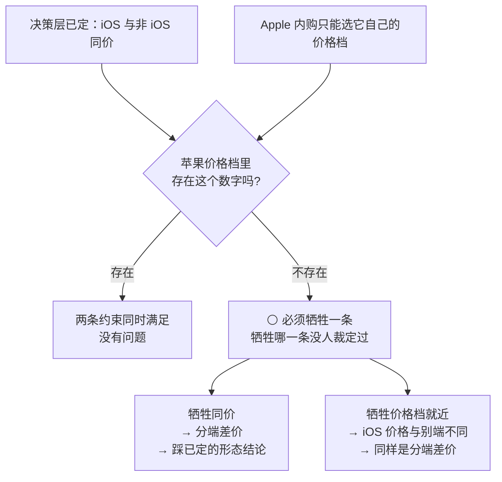

# U7.5 · Apple 内购

> **基线**：`origin/v1` @ `73041df`，fetch 于 2026-09-02。
> **状态：活跃。** 「是否上架 iOS」被裁定、跨端价格一致性被裁定、或内购流程差异表增减，本文同一次改动内更新。
> **上一层**：[M7 商业化 · 域索引](INDEX.md)

---

## 一、这个子能力是什么、不是什么

**是**：一份条件式规格 —— **「如果上架 iOS，界面必须怎么做」。**

**不是**：

- ⚪ **不是「我们要上架 iOS」。** 是否上架本身没定，**而且这个决定不可逆**（§2.5）
- **不是一条新的购买路径。** 用户看到的仍然是同一屏档位列表、同一套受限态；变的只有付钱那一段
- **不是分端定价。** 决策层已定 **iOS 与非 iOS 同价，不做分端差价**
- ⚪ **不是价格一致性的裁定处。** 两条约束可能同时无法满足，**本单元不裁定牺牲哪一条**

---

## 二、详细产品逻辑

### 2.1 四个事实，以及它们各自的后果

**四条事实的真源见 `额度与购买` §11.1；同价这条结论的真源见 `商业化与额度设计` §6.2 · §八。**

| 事实 | 后果 |
|---|---|
| iOS 上架后，虚拟内容必须走 Apple 内购 | 支付通道多一条，通道取值需新增 🚧 |
| **Apple 内购的价格只能从苹果自己的价格档里选** | **不保证存在与非 iOS 完全相同的那个数字** |
| Apple 抽成与其它通道抽成不同 | 分端毛利差。这是**渠道成本，不是可优化项**，数字在 `商业化与额度设计` §4.3 |
| 决策层已定「iOS 与非 iOS 同价，不做分端差价」 | **分端差价本身就是一条指向外部支付的箭头** —— 它同时踩平台规则与已定的形态结论 |

### 2.2 ⚪ 两条约束可能同时无法满足

🔴 **本单元不裁定，也不拿一个「就近取整」的规则顶上。**
一个看似合理的推断不能关闭一个 ⚪ —— 这一条登记在 §五。

### 2.3 在裁定之前，界面必须遵守的三条

**它们是裁定前的最小承诺，不是最终呈现方案。**

| # | 规则 | 说明 |
|---|---|---|
| 1 | **每一端只显示这一端自己拉到的价格** | 前端**不知道、也不查询**别端的价格。它没有能力做比较，这是最可靠的一种约束 |
| 2 | 🔴 **不出现任何跨端价格比较** | 不写「网页版更便宜」「其它设备上价格不同」「应用内价格含平台费」。**这既是不骗用户，也是红线：任何指向外部支付的暗示都禁止** |
| 3 | **如果本端价格与用户预期不同，只陈述事实，不解释、不比较、不道歉** | 一行小字说明这个价格是这台设备上的价格即可。🔴 **这句话不写原因 —— 写原因就滑向了「别处更便宜」** |

⚠️ **第 2 条与第 3 条不是同一条。** 第 2 条禁的是**比较**，第 3 条禁的是**归因**。
归因看起来比比较无害，但「因为苹果要抽成」这句话说完，用户下一句就是「那我去网页买」——
**产品自己把箭头画了出来。**

### 2.4 iOS 专有的流程差异

| 项 | 非 iOS | iOS 内购 |
|---|---|---|
| 下单 | 带档位码与通道 | 同上，通道为内购取值 🚧 |
| 拉起 | 唤起支付客户端 | **系统内购弹层，不可定制** —— 本域的界面规格在这一段全部失效 |
| 结果确认 | 主动查单 | **收据校验** 🚧 端点未定稿 |
| 校验失败 | —— | 只说「这笔没能确认，过一会儿再看订单」，**不说失败** |
| 上次未完成的事务 | —— | **进屏时自动接续，不需要用户操作**；只发放一次 |
| 退款 | ⚪ 见 `U7.7` | **由 Apple 侧发起，我方无入口** —— 同样落在 `U7.7` |
| 订阅管理 | 不存在（没有自动续费） | 系统设置里的订阅页 —— **没有自动续费，所以这一项不存在** |

**两条要点：**

- 🔴 **收据校验失败必须能与网络错误区分开。** 分不开，界面就只能说「没成」，
  而「没成」这三个字会让一个已经扣款的用户去再付一次
- **未完成事务的接续是静默的。** 用户上一次可能是崩溃退出、可能是切了账号，
  他不需要知道发生过什么，只需要**权益只到账一次**

### 2.5 ⚪ 这一节整节压在一个不可逆的决定上

**是否上架 iOS 本身没定，而且它不可逆。**

| 事实 | 后果 |
|---|---|
| 一旦注册开发者账号，**主体就定死了**（`多端选型与端矩阵` §七） | 域名实名主体、备案主体、小程序主体、签名主体**四者必须同一** |
| 四者错一个 | **整条重来** |

**所以这一步的正确顺序是：先把营业执照与经营范围核对出结论，再决定注册与否。**
在那之前，本单元的每一行都是「如果」，不是「将要」。

---

## 三、前端行为意图 × 后端契约意图

| 事项 | 前端行为意图 | 后端契约意图 |
|---|---|---|
| 价格来源 | 与其它端完全一样：拉这一端的档位列表，按返回值渲染，**不硬编码** | **对所有通道返回同一个价** —— 分端差价在契约层就不成立 |
| 跨端比较 | 🔴 **前端没有别端价格的来源，所以做不出比较** | 不提供任何「别端价格」字段。**这是用契约兜住红线，不靠前端自觉** |
| 通道取值 | 区三里多一个通道选项 | 🚧 **未定稿** —— 内购的通道取值还没有 |
| 结果确认 | 收据校验失败 → 只说「没能确认」，指向订单 | 🚧 **未定稿** —— 校验端点没有；🔴 **失败必须能与网络错误区分** |
| 未完成事务 | 进屏时自动接续，**不需要用户操作** | 幂等锚点与其它通道共用一套，**只发放一次** |
| 退款 | 界面上没有入口 | ⚪ **空** —— Apple 侧发起后我方怎么处置，见 `U7.7` |
| 订阅管理 | 不做，因为没有自动续费 | 契约里没有代扣字段，**结构上不可能出现自动续费扣款** |

---

## 四、边界与红线在这里的具体形态

| 边界 | 在这一单元的形态 |
|---|---|
| **不引导至外部支付** 🔴 | 这一域全部红线里，本单元是最容易破的一处：**分端价格差天然构成一条指向外部的箭头**，哪怕产品什么都不说。所以 §2.3 三条是硬规则，不是措辞建议 |
| **不判断对错** | 界面只陈述这一端的价格与这一笔的状态，不解释、不比较、不道歉 |
| **没有第四种反馈形态** | 未完成事务的接续是静默的，**不做通知、不做角标** |
| **不做促销心理机制** | 系统内购弹层不可定制，我方也不在它前后加任何倒计时或限时说明 |
| **缺口不自行裁定** 🔴 | 价格档对不上时牺牲哪一条约束、上不上架 iOS，**两条都不在本单元裁定** |

🔴 **一条可断言的检查**：在这一端做全屏文本扫描，
**扫不到任何一个别端的价格、也扫不到任何一句解释价格差的话。**

---

## 五、缺口登记

| # | 缺口 | 缺的是哪一半 | 该谁定 |
|---|---|---|---|
| 1 | ⚪ **苹果价格档命中不了同一数字时，牺牲哪一条约束** | 两条约束都是已定结论：同价是决策层定的，只能选苹果价格档是平台定的。**缺的是二选一的裁定** —— 界面规则只能写到「不骗用户」为止，写不出最终呈现 | **需人裁定**；🔴 本单元不裁定 |
| 2 | ⚪ **是否上架 iOS** | **不可逆**：注册开发者账号就把主体定死了，而四个主体必须同一。缺的是营业执照与经营范围的核对结论 | **需人裁定**；本单元整节压在它上面 |
| 3 | **内购的通道取值**（🚧） | 契约里的通道取值当前只有微信两个 | **技术同事** |
| 4 | **收据校验端点**（🚧） | 产品侧已定：失败必须能与网络错误区分、文案不说「失败」只说「没能确认」。**契约侧空白** | **技术同事** |
| 5 | **Apple 侧发起退款后我方怎么处置** | 与非 iOS 的退款是**同一个缺口**，不是第二个 —— 只是发起方不同 | 见 `U7.7`；本单元只指过去 |
