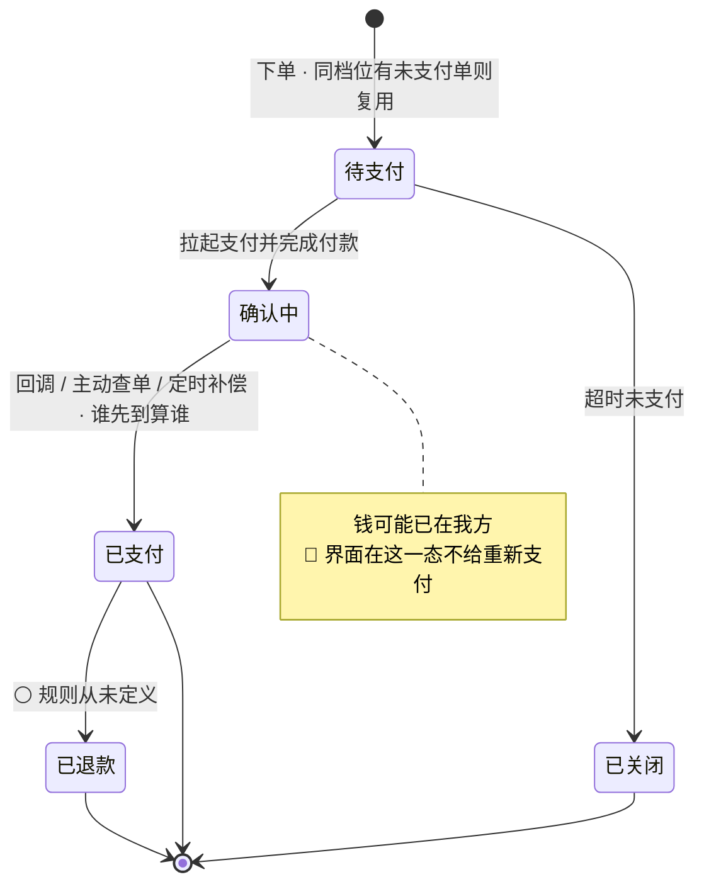
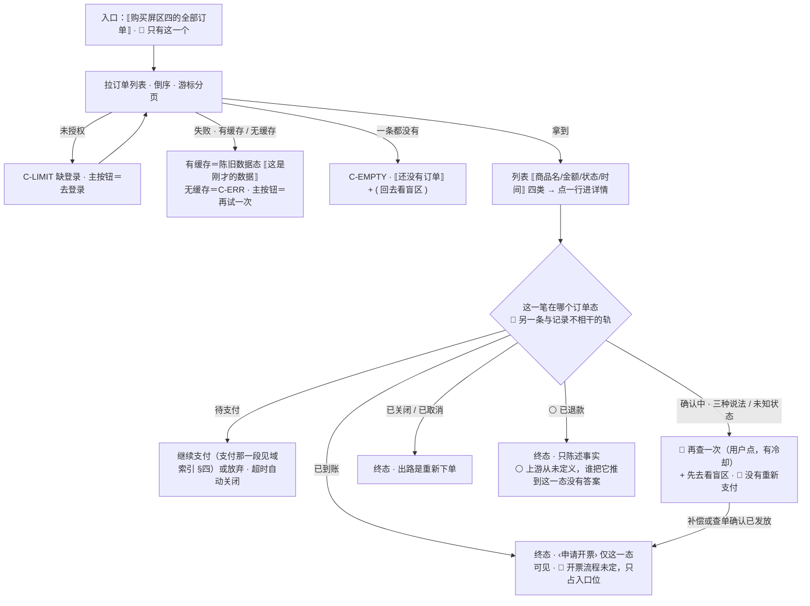

# U7.6 · 订单状态机与历史

> **基线**：`origin/v1` @ `73041df`，fetch 于 2026-09-02。
> **状态：活跃。** 订单态增减、界面态到后端态的映射变化、订单历史的字段与入口变化、或自动续费的开通条件被满足，本文同一次改动内更新。
> **上一层**：[M7 商业化 · 域索引](INDEX.md)

---

## 一、这个子能力是什么、不是什么

**是**：买完之后那一段 —— 这笔钱现在处在哪个状态、用户能对它做什么、他上哪儿去翻以前的单。

**不是**：

- **不是记录的状态。** 订单态是**另一条轨**，与一条记录在不在、挂没挂考点毫无关系。
  🔴 **它不在 L2 总表 §四 里，本单元只转录不新增** —— 真源是 `额度与购买` §7.2 与
  `后端系统设计与组件接入` §1.10
- **不是账单中心。** 订单历史只有四类信息，**不做消费统计、不做月度汇总、不做用量趋势** ——
  那些都是「看着它变多」的对象
- **不是自动续费管理。** 🔴 **没有自动续费**，所以也没有这块界面；`autoRenew` **恒为 false，不是一个可变字段**

---

## 二、详细产品逻辑

### 2.1 后端四态 + 已退款，界面态更多

**界面态比后端态多，因为后端的「确认中」在界面上要分成三种说法。**



| 界面态 | 后端态 | 用户看到的是什么意思 | 能做什么 | 不能做什么 | 系统会不会自动推进 |
|---|---|---|---|---|---|
| **待支付** | 待支付 | 还没付 | 继续支付 / 放弃 | —— | **是** —— 超时自动关闭 |
| **支付中** | 确认中 | 正在支付 | 只能等 | 返回不取消订单 | **是** —— 拉起后自动查单 |
| **已支付待发货** | 确认中 | 支付成功，正在到账 | 再查一次 / 先去看盲区 | 🔴 **没有「重新支付」** | **是** —— 轮询 + 定时补偿 |
| **支付成功但发货失败** | 确认中 | 钱收到了，权益还在处理 | 再查一次 / 先去看盲区 / 联系方式 | 🔴 **没有「重新支付」** | **是** —— 补偿重试 |
| **已到账** | 已支付 | 已到账 | 看详情 / 申请开票 | —— | 否 |
| **支付失败** | 待支付 | 没付上 | 重新拉起或换通道 | —— | 否 |
| **已取消** | 待支付 → 已关闭 | 已取消 | 重新下单 | —— | **是** —— 到期关闭 |
| **已关闭** | 已关闭 | 已关闭 | 重新下单 | 不能在这笔上继续付 | 否 |
| **已退款** | 已退款 | 这笔已经退了 | —— | **界面上没有发起退款的入口** | 否 · ⚪ 见 `模块地图` §三 登记的 `U7.7` |

⚠️ **「已退款」这一行是界面里唯一一个「后端从未定义过怎么进入」的态**，见 §五。

### 2.2 为什么「支付成功但发货失败」必须是独立一态

**它和「已支付待发货」在钱这一侧完全一样，在处置这一侧完全不同**（`额度与购买` §7.3）。

| | 已支付待发货 | 支付成功但发货失败 |
|---|---|---|
| 钱 | 已到我方 | 已到我方 |
| 权益 | 还没发，**预期会发** | 发放动作**已经失败过至少一次** |
| 是否告警 | 否 | **是** |
| 用户看到的话 | 支付成功，正在到账 | 钱收到了，权益还在处理 |
| 兜底通道 | 不需要 | **需要人工兜底，而人工兜底通道还没定** |

**两个态合并的后果是：一笔已经失败过的发放，会一直穿着「正在到账」这件衣服，直到用户自己放弃。**

「确认中」不能就近归类已经有两种错法 —— 归到成功是没收到钱就发权益，
归到失败是诱导重复付款。**这里是它的第三种错法：归到「正在处理」会让失败永远不被发现。**

### 2.3 订单历史

| 项 | 规定 |
|---|---|
| 入口 | 购买屏的订单区，**只有这一个入口**，不进设置屏一级菜单 |
| 屏幕 | 复用购买屏的样式，**是它的子页，不新开一个编号屏** |
| 列表信息 | 商品名 · 金额 · 状态 · 时间 —— **四类，与契约返回的字段一一对应，不多一类** |
| 排序 | 按创建时间倒序 |
| 分页 | 游标分页，不用页码；到底部自动加载，**不做「加载更多」按钮** |
| 详情 | 商品名 · 金额 · 状态 · 下单时间 · 支付时间 · 订单号 |
| 「确认中」的订单 | 详情里给「再查一次」+「先去看盲区」，🔴 **没有「重新支付」** |
| 订单号 | **完整显示不截断，允许换行，不允许省略号** —— 订单号被截断就没法用来找人；长按可复制 |
| 未知状态 | 显示「处理中」并**按「确认中」处置** —— 不猜成成功，也不猜成失败 |
| 空态 | 「还没有订单」+ 一个回去看盲区的出口 |
| 保留期限 | 🚧 **未定**，见 §五 |

**为什么只有四类信息：** 多一类就要回答「它服务于哪一个关卡」。
消费统计、月度汇总、用量趋势都答不上来，而且它们全都是「看着某个数变多」的对象 ——
那与「不做行为分析、不做成就感设计」是同一条边界。

### 2.4 发票

**只占入口位，流程不画。**

| 项 | 规定 |
|---|---|
| 入口位置 | 订单详情里，**仅已到账的订单可见** |
| 未到账的订单 | 入口禁用 + 一句「到账后才能开」 |
| 开票流程 | 🚧 **未定，不画** —— 契约里那个端点自己标着「只占端点位，不展开」 |
| 能开几次 / 能不能改抬头 / 开票主体 | 🚧 **未定**，见 §五 |
| 抬头输入 | 界面侧的**长度限制**可以先定；**字符集校验不定**，因为规则未定 |

🔴 **没有裁定过的流程一律不补。**
画一个看起来完整的开票流程，比留一个明写「未定」的入口更糟 —— **前者会被下游当成契约来实现。**

### 2.5 自动续费管理：现在没有，将来若有必须按这个顺序

**当前没有自动续费，所以没有这块界面。** `autoRenew` **恒为 false，不是一个可变字段**
（`技术架构与接口契约` §6.6）。开不了的原因不是产品选择，是平台资质门槛还差得远（`商业化与额度设计` §6.3）。

| 项 | 现在 | 将来若开通 |
|---|---|---|
| 开关 | **不存在** | 必须**显式勾选** |
| 默认勾选 | 🔴 **禁止** | 🔴 **仍然禁止** |
| 退订入口 | 不存在（**没有可退的东西**） | 🔴 **必须与开关同屏、同层级、同等视觉权重**，不许藏进二级菜单或用户协议 |
| 界面上的话 | 「不自动扣费，到期就停」—— **常驻在说明区，永不折叠** | 需重写，且**不得把「已开启自动续费」写成一种优惠** |
| 「连续包月更便宜」 | 🔴 **不出现** | 🔴 **仍然不出现** —— 那是用价格差把用户推向默认续费 |

🔴 **顺序写死：退订入口不得晚于开通开关存在。** 任何「先上开关、退订以后补」的安排一律拒绝。

**「不自动扣费、到期就停」是卖点，不是缺陷，但卖点成立的前提是明说** ——
它写在购买页上才算数，藏在用户协议第十几条里就不算。
国内订阅类产品最集中的投诉恰好是「自动续费难取消」，而这个约束正好落在用户不满的那一侧。

⚠️ **代价也要认**（`商业化与额度设计` §7.1）**：** 手动续费是「默认停止」，订阅制的核心机制是「默认继续」——
**每个月要用户重新做一次购买决策，那就是每个月一次流失机会。**
这条没有完整的缓解方案，而其中一个缓解方向（到期提醒）与「本产品不做提醒机制」正面冲突，
**登记为缺口，不裁定**（§五）。

### 2.6 会员期与额度的关系

| 情形 | 界面怎么显示 |
|---|---|
| 续费 | **延长到期日，不新建一份会员** |
| 到账 | 延长到期日的**同时按新档位重发本周期额度** |
| 会员到期当天 | 显示到期日 + 「到期就停，不会自动扣费」 |
| 会员已过期但当月额度尚未重置 | **按服务端返回显示，前端不自行推算** |
| 免费档 | **没有到期时间，那一行整行不渲染** —— 不显示「永久有效」这类话 |

---

## 三、前端行为意图 × 后端契约意图

| 事项 | 前端行为意图 | 后端契约意图 |
|---|---|---|
| 单笔查询 | 按界面态映射渲染；**未知状态按「确认中」处置** | 必须能区分**待支付 / 确认中 / 已支付 / 已关闭 / 已退款**五态 —— **少一态界面映射就落不下来** |
| 订单列表 | 四类信息、倒序、游标分页、自动加载 | 只返回商品名、金额、状态、时间四类；游标分页 |
| 订单详情 | 订单号完整不截断、可复制 | 详情比列表多下单时间、支付时间、订单号 |
| 「确认中」 | 🔴 **不给「重新支付」**，给「再查一次」+「先去看盲区」 | 三条路撞同一个幂等锚点，重复到达返回成功但不重复发放 |
| 发放失败 | 与「正在到账」用**两句不同的话** | 发放失败要**告警**并进补偿重试 —— 它和「还没发」在服务端也必须是两种情况 |
| 会员状态 | 到期时间为空即免费档，那一行不渲染 | 返回档位 + 到期时间 + `autoRenew` 恒 false |
| 续费 | 界面上不出现「新会员」这种说法 | **续费是延长到期日，不是新建一份订阅**；历史在订单里 |
| 开票 | 只在已到账订单上给入口 | 🚧 **只占端点位，流程未定** |
| 发票列表 | 依赖开票流程 | 🚧 **空** —— 流程不定就不做 |
| 自动续费 | 界面上没有开关、没有退订、没有「连续包月更便宜」 | **契约里没有代扣字段** —— 🔴 结构上不可能发生自动扣款失败这种事 |
| 保留期限 | 翻到底就没有更多 | 🚧 **未定** —— 界面写不出「只保留多久」这句话 |

---

## 四、边界与红线在这里的具体形态

| 边界 | 在这一单元的形态 |
|---|---|
| **不判断对错** | 订单只答「有没有、几次、多久前」：这笔有没有、买了几次、什么时候买的。**不做消费统计、不做用量趋势** |
| **没有第四种反馈形态** 🔴 | 不做到期提醒、不做订单角标、不做未读计数。到期提醒这条与另一份文档的缓解方向正面冲突，**登记不裁定** |
| **不做促销心理机制** | 不出现「连续包月更便宜」、不默认勾选、不把自动续费写成优惠 |
| **不做积分 / 打卡 / 徽章** | 订单历史里不出现任何以购买次数或连续月份为奖励对象的东西 |
| **一个数字都不落在本层** | 金额一律由服务端给、由前端格式化；本层不写任何一个具体金额 |
| **不引导至外部支付** | 订单详情里不出现任何「去别处处理这笔」的出口，包括退款 |

🔴 **两条可断言的检查：**

1. 枚举订单能到达的全部界面态，**没有任何一处出现「重新支付」按钮**。
2. 全屏扫描：**不存在自动续费开关、不存在默认勾选、不存在「连续包月更便宜」。**

---

## 五、缺口登记

| # | 缺口 | 缺的是哪一半 | 该谁定 |
|---|---|---|---|
| 1 | ⚪ **「已退款」这一态怎么进来** | 界面上这一态已经画好了，**而它的上游从未定义** —— 既没有后端规则，也没有一个能执行退款的角色。详见 `模块地图` §三 登记的 `U7.7` | 见 `模块地图` §三 登记的 `U7.7`；本单元只登记这一态是悬空的 |
| 2 | **发票：能开几次、能不能改抬头、开票主体是谁**（🚧） | 端点只占位，税务依赖合规轨。界面**只能写出入口位置，写不出流程**；抬头的字符集校验同样定不了 | **技术同事 + 合规轨** |
| 3 | **订单历史保留多久、能翻多远**（🚧） | 没人定过。分页大小可以先定，**总量上限定不了** —— 于是界面上说不出「只保留多久」 | **技术同事** |
| 4 | **会员到期提醒发不发、发几条** | 两条约束正面冲突：一份文档把「到期前提醒」列为缓解方向并给了条数上限，另一份写着本产品不做提醒机制。🔴 **本单元不裁定**；在裁定前界面上**一条到期提醒都没有** | **需人裁定** |
| 5 | **手动续费导致的流失没有完整缓解** | 三个缓解方向里，最有效的那个（年付）**没有价格**，而定价要等真实的月续费率数据；第二个（到期提醒）撞在第 4 条上；第三个（把「到期就停」写成卖点）已经在做，但它最弱 | **产品，但现在不定** —— 定价不是变量，付费意愿才是 |
| 6 | **注销与账号合并时，未消耗额度与会员期怎么算**（🚧） | 合并预览目前返回记录条数与覆盖度变化，**没有额度与会员期**；界面只能写成事实陈述，**写不出承诺** | **技术同事**；注销的删除时点还压着律师稿 |

---

## 六、线框

> 记号与屏宽照 `线框与交互规格约定` §三（40 个半角字符），组件只引锚不抄规格。
> 🔴 **本节里的状态名全是订单态，它是另一条与记录不相干的轨** —— 真源 `额度与购买` §7.2 与 `后端系统设计与组件接入` §1.10，本单元只转录不新增。**记录状态一律只用主轨四态 + `TS-00`–`TS-09`**，两套名字**任何一格都不许混用**。

### 6.1 常态整屏 · 订单历史（购买屏的子页，不新开编号屏）

```
┌────────────────────────────────────────┐
│ ‹返回› ⟦屏标题⟧            ← P-NAV     │
├────────────────────────────────────────┤
│ ⟦订单行·按创建时间倒序⟧          ※1    │
│  ⟦商品名⟧ ⟦金额·服务端给⟧              │
│  ⟦订单态文案⟧⟦相对时间⟧⟦整行可点⟧※2    │
├────────────────────────────────────────┤
│ ⟦…到底部自动加载下一页⟧          ※3    │
├────────────────────────────────────────┤
│ 订单详情 · 只画内容区                  │
│  ⟦商品名⟧⟦金额⟧⟦订单态文案⟧            │
│  ⟦下单时间⟧⟦支付时间⟧                  │
│  ⟦订单号·完整不截断，长按可复制⟧※4     │
│  ‹申请开票› ← 🔴 仅已到账可见     ※5   │
│  ⟦发票抬头输入·长度限制，字符集不校验⟧ │
└────────────────────────────────────────┘
```

※1 🔴 **只有四类信息**：商品名 · 金额 · 状态 · 时间。多一类就要回答「它服务于哪一个关卡」，而消费统计、月度汇总、用量趋势都答不上来，且它们全是「看着某个数变多」的对象　※2 状态文案取订单态那张表，🔴 **未知状态显示「处理中」并按「确认中」处置** —— 不猜成成功，也不猜成失败
※3 游标分页，🔴 **不做「加载更多」按钮**；保留期限 🚧 未定（§五），所以界面上说不出「只保留多久」　※4 🔴 完整显示、允许换行、**不允许省略号** —— 订单号被截断就没法用来找人　※5 未到账的订单入口**禁用 + 一句「到账后才能开」**（禁用元素必须能说出原因，§1.3）；开票流程 `[契约缺]`，🔴 **没有裁定过的流程一律不补**

### 6.2 「确认中」的三种说法与已退款：只画变化区

```
│ 支付中·⟦正在支付⟧只能等                │
│ 已支付待发货 · ⟦支付成功，正在到账⟧    │
│  ( ⟦先去看盲区⟧ ) ←主  [ 再查一次 ]※6  │
│  🔴 ⟦没有「重新支付」⟧                 │
├────────────────────────────────────────┤
│ 支付成功但发货失败·🔴 独立一态   ※7    │
│  ⟦钱收到了，权益还在处理⟧              │
│(⟦先去看盲区⟧)[再查一次]‹⚪联系方式指空›│
├────────────────────────────────────────┤
│ ⚪ 已退款⟦这笔已经退了⟧ 无发起入口※8   │
├────────────────────────────────────────┤
│ 区五 说明 · 自动续费这一区无任何控件※9 │
│  ⟦不自动扣费，到期就停⟧⟦导出永远免费⟧  │
│  🔴 ⟦没有开关⟧⟦没有默认勾选⟧⟦没有退订⟧ │
```

※6 🔴 **不给「重新支付」**：给了它，用户会在已经扣款的情况下再付一次。「再查一次」是**用户点的次按钮**，有冷却；🔴 支付相关不自动重试，界面上**不出现「重试中 (2/3)」这类自动进度**（`P-RETRY`）　※7 与「正在到账」是**两句不同的话**：一笔已经失败过的发放不许穿着「正在到账」这件衣服，否则失败永远不被发现
※8 ⚪ **这一态的上游从未定义**，形状见 `模块地图` §三 登记的 `U7.7`；本单元只登记它是悬空的　※9 🔴 **`autoRenew` 恒为 false，不是一个可变字段**；将来若开通，**退订入口不得晚于开通开关存在** —— 顺序不能反

### 6.3 其余各态与红线自查

```
│ 骨架 C-SKEL····  ··· 按最终形状占位※10 │
├────────────────────────────────────────┤
│ 空态 C-EMPTY·⟦还没有订单⟧              │
│  ( ⟦回去看盲区⟧ ) ←主                  │
├────────────────────────────────────────┤
│ 错误态 C-ERR·列表拉不到/游标失效 ※11   │
│  ⟦哪一步没成⟧ ( 再试一次 ) ←主         │
├────────────────────────────────────────┤
│ 陈旧⟦这是刚才的数据⟧🔴 不做乐观展示    │
├────────────────────────────────────────┤
│ 受限态·缺登录 ( ⟦去登录⟧ )←主，无兜底  │
```

※10 已有内容时刷新走「保留旧内容 + 局部指示」（`C-SKEL`）　※11 游标失效时回到第一页并说一句，🔴 不出现错误码原文与英文　※12 缺登录这一档**没有免费兜底**；🔴 **本屏不存在缺额度受限态** —— 订单历史与额度无关，看订单不上锁

| # | 红线自查 | 本单元 |
|---|---|---|
| 1–6 | 正确率 / 讲解 / 提醒 / 小红点 / 打卡 / 徽章 / 进度环 / 百分比 / 倒计时 / 限时 / 划线价 / 「仅剩」/「已有 X 人购买」 | 0 —— 订单只答「有没有、几次、多久前」，🔴 不做到期提醒、订单角标、未读计数，不做以购买次数或连续月份为奖励对象的东西；🔴 逐格数过：不做消费统计与用量趋势（那是「看着它变多」的对象）、不出现「连续包月更便宜」、不默认勾选、不把自动续费写成优惠 |
| 7–10 | 能装下题干的格子 / 置信度 / 原图入口 / 三处不可弱化 | 0 —— 唯一的输入是发票抬头，只做长度限制且**不长得像题目**；不显示置信度；不碰原图；三处落在 `模块地图` §三登记的 `U8.3` / `U8.4`，不重画也不弱化 |

---

## 七、交互规格

### 7.1 必答五项

| # | 必答 | 本单元的答案 |
|---|---|---|
| 1 | **入口** | 🔴 **只有一个**：购买屏区四的「全部订单」，**不进设置屏一级菜单**。第二层入口是列表里点某一行进详情；第三条是登录后回跳（`P-NAV`）。🔴 **没有任何自动跳转到订单历史的路径** |
| 2 | **结束状态** | 用订单态说，而 🔴 **订单态是另一条与记录不相干的轨**（真源见本节导语）：终态是**已到账** / **已关闭** / **已取消** / **已退款**；非终态是**待支付**与「确认中」的三种说法（支付中 / 已支付待发货 / 支付成功但发货失败）。🔴 **记录状态一格未动**：主轨四态与 `TS-00`–`TS-09` 都不因订单发生转移，两套名字不混用 |
| 3 | **失败落点** | 列表拉不到 → 停在本屏，主按钮＝再试一次；有缓存则是陈旧数据态。游标失效 → 回到第一页并说一句，不清空。开票失败 → 页内提示 + 重试或走联系方式，🔴 **钱不受影响**，但联系方式现在指向空（§五）。未知订单状态 → 🔴 **按「确认中」处置**，落点是「再查一次」+「先去看盲区」 |
| 4 | **空态** | 两种成因、两句话：① 一条订单都没有 → 「还没有订单」+ 一个回去看盲区的出口（🔴 盲区永不上锁，所以它能当降级出口）；② 翻到底就没有更多 —— 但 🚧 **保留期限未定**，所以这一句**只说「没有更多」，不说「只保留多久」** |
| 5 | **错误态** | 可重试（**由用户点**）：列表超时 / 网络失败 / 开票失败。不可重试：订单已关闭（出路是重新下单，不是在这笔上继续付）。🔴 **支付相关一律不自动重试，只做「主动查一次结果」**（`P-RETRY`）。🔴 **有缓存时列表是陈旧数据态**，但**订单状态本身没有乐观展示** —— 一律以服务端查单为准 |

### 7.2 受限态（按需追加项）

| 档 | 缺什么 | 主按钮 | 次入口 |
|---|---|---|---|
| 缺登录 | 已登录后令牌失效 | 去登录 —— 这一档**没有免费兜底**。🔴 **本屏不存在缺额度受限态**：看订单、看详情、开票入口都不经过额度（`I-4`） | 无 |
| ⚪ 已退款 | 上游不存在 | 🔴 **不是受限态，是一个悬空的订单态** —— 界面只陈述事实，没有发起退款的入口 | —— |

🔴 **两条可断言的检查**：① 枚举订单能到达的全部界面态，**没有任何一处出现「重新支付」按钮**；② 全屏扫描：**不存在自动续费开关、不存在默认勾选、不存在「连续包月更便宜」**。

### 7.3 交互流程



⚠️ 本节不写端点路径。界面对后端只有四条要求：① 单笔查询**必须能区分五个态**，少一态界面映射就落不下来；② 列表只返回四类信息 + 游标；③ **发放失败要告警并进补偿重试**，它和「还没发」在服务端也必须是两种情况；④ 契约里**没有代扣字段** —— 🔴 结构上不可能发生自动扣款。`[契约缺]`：开票流程、订单保留期限，两处都不补。
