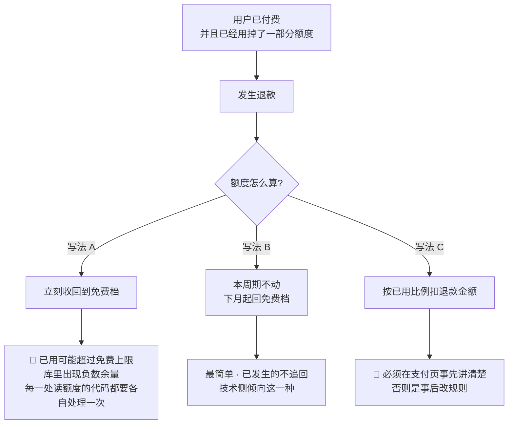

# U7.7 · 退款

> **基线**：`origin/v1` @ `73041df`，fetch 于 2026-09-02。
> **状态：活跃。** 退款规则被裁定、支付页上的退款说明定稿、或运营后台从占位变成实体，本文同一次改动内更新。
> **上一层**：[M7 商业化 · 域索引](INDEX.md)

---

## 一、这个子能力是什么、不是什么

⚪ **它现在不是一个能力，是一个缺口。界面已画，后端从未定义。**

订单列表里已经画着一笔「用了两天之后退款」的已退款订单，
而**「退款之后额度和权益怎么算」在整个文档集里没有任何一处写过**。

**是**：这一格空白的登记处 —— 缺什么、为什么卡住、不定它会挡住哪几件事。

**不是**：

- 🔴 **不是退款规则的裁定处。** 三种写法各有后果，**本单元不选**
- **不是一个待补的界面。** 现在界面上**没有发起退款的入口**，而且这是对的 ——
  **有入口而没有流程，比没有入口更糟**
- **不是律师稿的替代品。** 规则属于用户协议，架构定不了，产品也定不了

**但产品要补的那半格律师稿替不了，见 §2.3。**

---

## 二、详细产品逻辑

### 2.1 缺口的形状：钱能退，成本退不回来

**这不是措辞问题。** 退款退的是那笔订阅费，而**那几天里用掉的 AI 调用是真实发生的外部账单**，
成本收不回来。于是「退多少、额度怎么办」这两件事必须一起定，只定一件会自相矛盾。

**三种写法，后果差别很大**（`后端系统设计与组件接入` §1.11）：

| | 写法 | 后果 |
|---|---|---|
| **A** | 额度立刻收回到免费档 | 已用可能超过免费档的上限 → **库里出现负数余量**，而这是覆盖率之外第二个会算出负数的地方。界面这一侧的代价同样明确：**余量永远不许显示成负数**，于是每一处都要各自做一次兜底 |
| **B** | 本周期不动，下月起回免费档 | 最简单，已发生的不追回。**技术侧倾向这一种** |
| **C** | 按已用比例扣退款金额 | 🔴 **必须在支付页事先讲清楚，否则是事后改规则** |

🔴 **本单元不裁定选哪一种。** 拿不准边界时停下来问，不自行放宽 ——
**一个看似合理的推断不能关闭一个 ⚪。**

### 2.2 现在就能定死的两条，与选 A/B/C 无关

| 约束 | 为什么与政策无关 |
|---|---|
| **退款幂等 —— 同一笔只处理一次** | 无论哪种写法，重复处理都是错的 |
| **额度不许为负** | 扣减一律用条件更新，受影响 0 行即视为耗尽；**退款不构成例外**。界面这一侧对应一句：余量的最小值是 0，**没有负数这种显示** |

**这两条现在就能写下来，是因为它们是「怎么算」之外的东西。** 政策定的是算多少，
这两条定的是**不管算多少，都不许算出第二笔、不许算出负数**。

### 2.3 🔴 产品要补的那半格：支付页上写什么

**律师稿定的是规则，产品定的是「用户在掏钱之前读到了什么」。这两件不是同一件。**

> 三种写法里，**「按已用比例扣退款金额」这一种必须在支付页事先讲清楚，否则是事后改规则。**
> **「支付页上写什么」是产品的事**，不是律师稿的事，也不是架构的事。

**规则本身属于用户协议，待律师稿**（`商业化与额度设计` §7.3 只在年付语境下提过一句「退多少是律师稿的事」）。

**为什么这半格律师稿替不了：** 律师稿会写进用户协议，而用户协议在确认页上是一个勾选框。
**勾了不等于读了。** 写法 C 意味着用户拿回来的钱少于他付出去的钱，
**这件事如果只存在于协议正文里，那它在用户那一侧就等于没有发生过** ——
他退款时才第一次知道，那一刻规则对他而言就是被改过的。

**由此得到一条产品侧的当前约束，它不依赖 A/B/C 的裁定结果：**

| 规则 | 说明 |
|---|---|
| 支付页上关于退款**能写的话，取决于最终选哪一种写法** | 所以在裁定之前**一个字都不写**，而不是先写一句模糊的 |
| 🔴 **不许写「不支持退款」** | 这句话能不能写取决于规则本身，**产品不能自己先把它写上去** |
| 🔴 **不许写任何暗示「随时可退」的话** | 同理，反方向的空头承诺一样是事后要改的 |
| **确认页上必勾的那个协议现在没有正文** | 它是这一格的下游，一并等律师稿 |
| 裁定之后 | 若选 C，**支付页上必须出现事先说明**，且它不能藏在协议里 —— 这是产品的交付物，不是法务的 |

### 2.4 界面现在长什么样

| 情形 | 界面表现 | 用户下一步 | 钱与数据的最终状态 |
|---|---|---|---|
| **用户想退款** | 🚧 **界面上没有入口** | 走说明区的联系方式 | ⚪ **未定义** |
| **后台已执行退款** | 订单显示「已退款」 | —— | ⚪ **退款后额度与权益怎么算未定义** |
| **同一订单被付了两次** | 无感，幂等不重复发放 | —— | ⚪ **重复付款的退还路径未定** |
| **订单已关闭后又完成支付** | 订单详情显示异常态，只陈述「钱如果扣了会退回来」 | 走说明区的联系方式 | ⚪ **退还路径未定** |
| **开票失败** | 页内提示 | 重试或走联系方式 | 钱不受影响，但**联系方式指向空** |

**这五行的「钱的最终状态」全部悬空，它们共用同一个缺口。**

### 2.5 🔴 「后台已执行退款」预设了一个当前不存在的角色

**上表第二行必须单独点名。**

「订单显示已退款」这个界面态成立的前提是：**有人在某个后台执行了退款。**
而那个后台**当前不存在** —— 运营后台整棵树在总纲里只是一个占位，逐条悬空。

| 这一格特殊在哪 | 说明 |
|---|---|
| 它不是「前端有行为、后端无契约」 | 那种缺口至少两边都有人 |
| **它是「前端行为的上游不是后端契约，而是一个不存在的角色」** | 没有运营后台，就没有人能把订单推进到「已退款」。**这个界面态在今天是不可达的** |
| 为什么仍然要画它 | 因为退款一旦真的发生（例如支付平台侧发起、或 Apple 侧发起），**订单必须能显示这个事实**。画它是对的，缺的是上游 |

**登记：这一格指向运营后台占位树（`产品总纲` §五 列的 `docs/ops-console/INDEX.md`），不指向任何后端契约。**
🔴 **本单元不去定义那个后台该长什么样** —— 那是维护者一侧的设计，不在这一层。

### 2.6 那条指向空处的「联系方式」

说明区里写着一条联系方式，**它现在指向空**：客服形态、响应时效、联系方式**都没定**。

**它同时是四种情况的唯一出口**：想退款、订单已关闭后又完成支付、开票失败、
以及最要紧的那一种 —— **钱收到了、权益没发、补偿重试最终仍失败**。

| 后果 | 展开 |
|---|---|
| 用户拿不到人 | 他扣了款、没拿到权益，而屏幕上唯一的出口是一条不通的路 |
| 产品拿不到反馈 | 这一类失败**没有任何一条路径会让维护者知道它发生了**，除非用户自己找上门 |
| 它也压在运营后台上 | 客服是维护者一侧的动作，落点同样是那棵占位树 |

**登记，不裁定。** 定客服形态需要先有人回答「谁来接」，而那是排期与人力的问题，不是产品逻辑的问题。

---

## 三、前端行为意图 × 后端契约意图

| 事项 | 前端行为意图 | 后端契约意图 |
|---|---|---|
| **发起退款** | 🚧 **界面上没有入口**，而且在规则定下来之前**不许加** —— 有入口而没有流程比没有入口更糟 | ⚪ **空** |
| **已退款这一态的呈现** | 订单显示「已退款」，只陈述事实，**不解释、不承诺时间** | ⚪ **空** —— 谁把订单推到这一态，今天没有答案（§2.5） |
| **退款后额度怎么算** | 🔴 **余量永远不显示负数**，最小值是 0 | ⚪ **空** —— A/B/C 三种写法未裁定 |
| **退款后会员期怎么算** | 到期时间一律按服务端返回显示，**前端不推算** | ⚪ **空** |
| **退款幂等** | 无界面 | ✅ **与政策无关，现在就能定：同一笔只处理一次** |
| **额度不许为负** | 无界面 | ✅ **与政策无关，现在就能定：条件更新，受影响 0 行即视为耗尽** |
| **支付页上的退款说明** | 🔴 **产品的交付物。** 若最终选「按已用比例扣」，**必须事先出现在支付页上，不能只在协议里** | 不涉及 —— 这一格没有后端 |
| **人工兜底通道** | 说明区那条联系方式**现在指向空** | ⚪ **空**，且它的落点不是后端，是运营后台占位树 |

---

## 四、边界与红线在这里的具体形态

| 边界 | 在这一单元的形态 |
|---|---|
| **缺口只登记不裁定** 🔴 | 本单元是整个 M7 里唯一一个**通篇都是缺口**的单元。它的价值全在于**没有替任何人做决定** —— 补一个看起来合理的退款流程，下游会把它当契约实现 |
| **不判断对错** | 界面在「已退款」这一态上只陈述事实，不解释原因、不评价用户、不承诺时间 |
| **不引导至外部支付** | 退款说明里不出现任何「去别处处理」的出口 |
| **没有第四种反馈形态** | 退款不做推送、不做角标；用户是主动进订单看到的 |
| **不做促销心理机制** | 不用「支持随时退款」当卖点 —— **那是一句现在没有依据的话** |
| **不写排期** | 本单元不说这一格什么时候补，只说它缺什么、该谁定 |

🔴 **一条可断言的检查**：全屏扫描，**找不到任何一个发起退款的入口**，
也找不到任何一句关于退款的承诺（既没有「不支持退款」，也没有「随时可退」）。

---

## 五、缺口登记

| # | 缺口 | 缺的是哪一半 | 该谁定 |
|---|---|---|---|
| 1 | ⚪ **退款走哪条路（A / B / C）** | 三种写法与各自后果已经写清，**缺的是二选一之外的那次拍板**。它挡住五条异常的「钱的最终状态」，也挡住支付页上能写什么 | 律师稿（`执行清单` 合规轨）。🔴 **本单元不裁定** |
| 2 | 🔴 **支付页上的退款说明** | **产品要补的那一半，律师稿替不了。** 若最终选「按已用比例扣」，**必须事先讲清楚，否则是事后改规则**。缺的是规则本身 —— 规则一定，这半格产品就能立刻写 | **产品**；但**它的输入是第 1 条**，第 1 条不定这半格写不出来 |
| 3 | ⚪ **「后台已执行退款」预设的那个运营后台不存在** | 界面态成立的前提是有人能执行退款，**而那个角色今天没有**。这不是后端契约缺一行，是**上游整棵树悬空** —— 落点是 `产品总纲` §五 列的运营后台占位（`docs/ops-console/INDEX.md`） | **需人裁定**；🔴 本单元不去定义那个后台 |
| 4 | ⚪ **「钱收到了、权益没发」之后的人工兜底通道** | **客服形态、响应时效、联系方式都没定**，说明区那条联系方式指向空。它同时是四种情况的唯一出口 | **需人裁定**；落点同样是运营后台占位树 |
| 5 | **用户协议里的退款条款由谁定稿** | 确认页上那个必勾的协议**现在没有正文**；第 1 条的规则最终也落在同一份稿子里 | 律师稿 |
| 6 | **Apple 侧发起的退款怎么处置** | 与非 iOS 是**同一个缺口**，不是第二个 —— 只是发起方从我方换成了平台方，而我方**连入口都没有** | 见第 1 条；`U7.5` 已指过来 |
