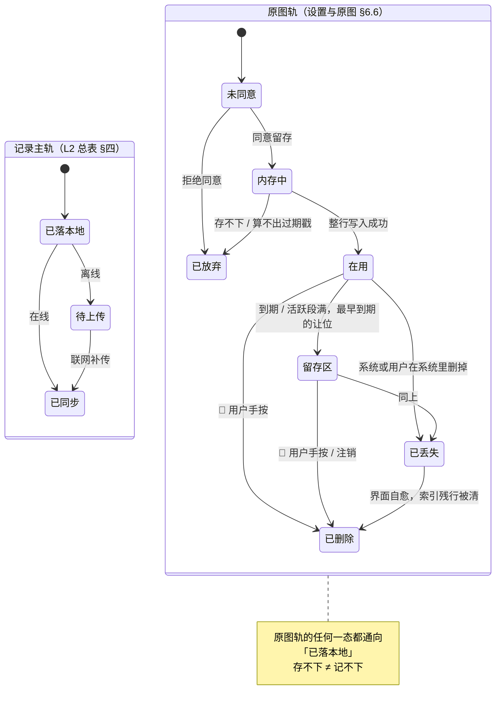

# M8 · 边界的用户可见落点

> **基线**：`origin/v1` @ `73041df`，fetch 于 2026-09-02。
> **状态：活跃。** 边界全文页的条数变化、原图去向的任何一条结论变化、反馈形态从三种变成别的数，本文同一次改动内更新。
> **上一层**：[模块地图](../INDEX.md)

---

## 一、这一域在减法的哪一端

**负空间。** 它不维护被减数、不收减数、不算差集、不端出差值 —— 另外八个域各自在减法上有一个位置，
这一域的位置是**那些位置之外的地方**：产品明确不做的事，以及做了的事里那些不许越过的形状。

`产品总纲` §四 把五件不做的事写死，`I-5` 把「原图内联一次即弃」写死，
`用户侧功能规格 · 总纲与全局约定` §2.2 把反馈形态封在三种 —— 这些结论散在别处时都只是约束。
**这一域是它们第一次有了用户读得到的形态**：一页可以直接发给别人看的边界全文、
一屏能数清自己有几张图占多大的原图管理、一句在按下快门之前就说清楚的承诺。

由此得到一条这一域自己的性质：**它产生不了任何新的产品能力。**
它每写一条，写的都是「某个已经定过的约束在用户那一侧长什么样」。
所以这一域的提案判据不是「这个功能有没有用」，而是「这条边界在界面上有没有可见落点」——
判据全文与它挡掉的东西写在 §七。

---

## 二、它服务于主流程的哪一步

`J0` 与 `J6`，回指 `用户价值与主流程` §四 M8 那一行。另有横切 `C3 原图`，
它从 `J2` 拍下那一刻一直挂到 `J6`，是这一域覆盖面最长的一条。

| 节点 | 这一域在这一步做什么 | 这一步失败会怎样 |
|---|---|---|
| **`J0` 头一次打开** | 提供边界全文那一页，并且是产品里**唯一一份**边界全文。首启说明屏与拍照同意点都是它的消费者，不是第二份 | 边界有了第二种说法。以后每一次「这算不算越界」的讨论都要先花时间确认按哪一份说 |
| **`J6` 把它带走** | 守住导出这一侧的两条：导出永不上锁、永不加锁图标；**导出文件里没有原图** | 导出打了折，`用户价值与主流程` §三 的第三样东西就不成立了 |
| **`C3` 原图（贯穿 `J2`–`J6`）** | 回答「图在哪、什么时候消失、换手机还在吗」，并提供用户自己清掉它的地方 | 用户不知道自己拍的东西去了哪。**这是产品对用户最硬的一条承诺**，它含糊一次，前面所有关于「记一笔很安全」的话都跟着贬值 |

**`J1` 登录不在这一域。** 退出登录与注销的完整流程在 `登录与账号` §四 / §七；
这一域只管它们**在本机原图上的影响面**（§四 第三条）。

---

## 三、它服务于哪一个关卡

**阶段 0：自己用两周，每天记两个数**（`实施路径` §阶段 0）。判据是人给的 pass/fail。

**这一域贡献的既不是分子也不是分母，是「愿不愿意有第二个月」。**
一个记录工具如果扣着你的记录、或者说不清你拍的图去了哪，你不会把第二个月的学习也记进来
（`用户价值与主流程` §1.3）。两周之内这件事不会显形，所以这一域在阶段 0 里**看不出效果**——
它只在做错的时候看得出来。

**这一域一个关卡数字都不产生，而且它连自己的效果都观测不到。**
`设置与原图` §十四 逐条判否了这两屏的全部埋点提案：
「有多少人读过边界页」「有多少人打开过原图屏」都想要，也都不加，因为它们服务不了任何一条阶段判据。
登记在 `G-8` / `G-14`，**原样留着，不拿一个替代指标顶上**。

这是这一域最不舒服的一点，也是它必须被写下来的原因：
**产品守着一条它无法验证有没有被看见的承诺**，唯一的守法是让它在每一处都说同一句话。

---

## 四、能力单元清单与下钻

| 单元 | 管什么 | 关键决策 |
|---|---|---|
| [`U8.1` 「这个产品不做什么」这一页](U8.1-这个产品不做什么这一页.md) | 边界给用户看的那一份 | 五句是产品里**唯一一份**边界全文，三处消费者逐字同源，`scripts/boundary-copy-check.py` 守着；✅ **首启展示 —— `M8-G1` 已随 `M0-G1` 裁定（2026-09-02，产品）**：本页在首启由「登录前那一屏说明屏」承载三句，说明屏上的「看完整的一页」通往本页；本单元画法不变（§七 `M8-G1`） |
| [`U8.2` 设置屏与数据管理](U8.2-设置屏与数据管理.md) | 设置里有什么、清空会毁掉什么 | 零开关、零自由文本输入框、三个危险操作；**清空不删令牌** —— 云端记录会回来，本机原图不会 |
| [`U8.3` 原图在哪、什么时候消失](U8.3-原图在哪什么时候消失.md) | 🔴 本域最要紧的一单元 | 到期**转归档不是删除**；界面上永远不出现「自动删除」；识别时内联一次即弃（`I-5`）；**退出登录不碰原图，只有注销才删** |
| [`U8.4` 原图管理屏](U8.4-原图管理屏.md) | 用户自己管 | 唯一的写操作是删；**没有任何分享 / 上传 / 备份 / 保存到相册入口**；删就是永久毁掉，动手之前说清一次 |
| [`U8.5` 全局交互约定的边界形态](U8.5-全局交互约定的边界形态.md) | 四态 / 三种反馈 / 文案红线 | 🔴 **没有第四种反馈形态** —— 小红点、气泡引导、未读计数都是提醒机制的变体 |

**四处跨单元共享的东西写在这里，单元文档里不各自复述一遍：**

- **共同真源**：用户可读的边界全文只有一份（`设置与原图` §二）。首启说明屏取前三句、
  拍照同意点取第三条、首次使用的相机自有说明消费同一句承诺 —— 三处都是消费者，**没有一处是第二份真源**。
- **共同禁令**：这一域两屏加起来 —— **零个开关、零个自由文本输入框、零个分享 / 上传 / 备份 / 同步入口、
  三个危险操作（清空这台设备上的数据、退出登录、注销账号），一个不多。**
- **共同差别**：**退出登录不碰原图，注销默认删除这台设备上的原图与本地缓存**，
  且必须在浮层里明确告知一次，说在「要不要先导出」之前（2026-09-02 裁定）。
  两条入口都在 `S-ACC`，这一域只管它们的本机影响面，流程在 `登录与账号` §四 / §七。
- **共同措辞**：界面上**永远不出现**「自动删除」「到期删除」「N 小时后删掉」。
  存储层已经没有任何自动删除路径（`原图存储：判据层与存储层` §五 发现一，`R-106` 裁定①），
  写「会删」是描述一个不存在的行为，而且是往危险的方向描述错。

---

## 五、域级状态机

**这一域自己不产生记录状态。** 图里的记录态取自 L2 总表 §四 的主轨，
原图七态取自 `设置与原图` §6.6 —— **本域不新造任何状态名**。
两条轨并行，**互不影响**是这一域要证明的东西本身。

🔴 **原图轨里没有一条边通向「记不成」。** 七个态各自的出口都不改变记录主轨的走向 ——
`已放弃` 的界面必须说「这张图没被本地缓存」，**不是「记不下来」**。
这张图能不能画成两条不相交的轨，就是这一域是否成立的判据（`I-1` 在原图这一侧的形态）。

🔴 **原图轨里也没有一条自动到达 `已删除` 的边。** 到 `已删除` 只有两个来源：用户手按，或注销。
到期与活跃段满都只到 `留存区`。

---

## 六、前端行为意图 × 后端契约意图

| 场景 | 前端行为意图 | 后端契约意图 |
|---|---|---|
| 边界全文页 | 从设置进，**没有第二入口**；页上零可点元素；离线可读；有独立地址，用户要发给别人看得能发出去 | 🔴 **零端点、无登录要求。** 五句是构建期打进包里的静态串 —— 接口下发意味着边界能被服务端悄悄改，而它是边界。**不做灰度、不按端下发不同版本** |
| 设置屏渲染 | 四组同步渲染，**永不出骨架屏**；离线时只有额度那一行的值位降级 | 除额度与账号尾号外**不依赖任何请求**。`GET /quota` 必须能让前端区分「0 次」与「取不到」——两者界面表现完全不同 |
| 账号那一行 | 只显示手机号尾号，一眼可见，不需要点进去 | `GET /account` 🔴 **只给尾号；不要昵称、头像、任何自由文本字段** —— 自由文本字段就是一个能装下题干的位置 |
| 清空这台设备上的数据 | 两次确认 + 打字；有未同步队列时再拦一层；按固定顺序删五类本机数据 | **服务端不参与，也不该参与。** 🔴 清空**不删令牌**，不触发登出；选「照样清空」时未传的队列本地丢弃，**服务端从不知道这些记录存在过** |
| 退出登录 | 可点即成，网络失败也要让用户退出去；🔴 **原图一张不动** | `POST /auth/logout` 只吊销当前令牌。**失败不阻断本地退出** |
| 注销账号 | 离线禁用；浮层里先说清本机原图会一起删，再问要不要先导出；「先导出」入口永不禁用 | `DELETE /account` 删云端，**同时删除这台设备上的原图与本地缓存**。响应必须能区分「已受理」与「已完成」（删除时点未决，`G-10`） |
| 原图列表 / 读一张 / 删 / 归档 / 统计 | 整屏零网络请求，抓包可验 | 🔴 **没有端点，一个都没有。** 不是「暂时还没做」，是结构上不该有 —— 服务端能列出我的图 ⇒ 服务端有我的图 |
| 拍照识别那一次 | 送出去之前先过同意点；送出去的是内存里的字节，送完即弃 | 🔴 **JSON + base64 内联，一次性。** multipart 打上去必须被拒；不落盘、不入日志、不用厂商的文件暂存接口（`I-5`） |
| 壳侧本地通道 | 探测那个口在不在（问能力，不问宿主） | **它不是端点**，是同一台机器上两个进程之间的通道，前缀刻意不是 `/api/*`。🔴 响应 `content-type` 恒为 `application/octet-stream` —— 按图片类型回，这个地址就成了一条能在浏览器里直接打开原图的链接 |
| 空间占用那个数 | 有缓存读缓存，冷启动与下拉刷新才全量；取不到就只显示张数，**不显示 0** | 🔴 容量**只由界面读**，不进判据层的存储口 —— 判据层拿得到容量，「归档也淘汰」就从后门回来了（`原图存储：判据层与存储层` §2.3） |
| 上屏文案 | 前端不拼接、不截断、不按屏宽换短句 | **服务端不下发任何上屏文案。** 错误码只用来选界面表现，不直接显示；未列出的码一律走「未知错误」 |
| 提醒 / 推送 | 不做，连「我们不打扰你」这种反向自夸也不写 | 🔴 **不提供任何推送、通知、订阅端点。** 通知权限根本不申请 |

---

## 七、这一域碰到的边界 + 缺口登记

### 什么进这一域，什么不进

🔴 **判据一条：只有当一条边界在用户界面上有可见落点时，它才进这一域。**
纯内部约束留在 L2 总表 §五 的 `I-x`，或留在它自己的技术文档里。

| 例 | 判 | 为什么 |
|---|---|---|
| 「这个产品不做什么」那一页 | ✅ 进 | 用户读得到的一页 |
| 界面上永不出现「自动删除」 | ✅ 进 | 用户读得到的措辞，而且它守的是一条会被写反的承诺 |
| 没有分享 / 上传 / 保存到相册入口 | ✅ 进 | **一个功能不存在和一个功能被藏起来，在用户那里长得一模一样** —— 所以要以肯定形式明说 |
| `I-5` 服务端不落盘、不入日志 | ❌ 不进 | 用户界面上看不见它。它是 `I-5` 本身；这一域只写它在同意点与那句承诺上的形态 |
| `RawImageBackend` 只有五个方法 | ❌ 不进 | 类型层的约束。这一域只写它的用户可见后果：「没有恢复按钮」 |
| 闭集打标只收 id 不收文本 | ❌ 不进 | 是 `I-3`，落在 M2 |

**这条判据挡掉的是这一域天然的膨胀方向。** 「边界」这两个字什么都装得下，
一旦不设判据，每一条红线都会在这里再写一遍 —— 而一条边界有三处说法时，
**最先过期的一定是最不常被读的那一处**，红线过期的代价与别的条目不同。

### 边界在这一域的形态

真源在 `产品总纲` §四 与 `设置与原图` §二，这里只写它在这一域怎么落地。

| 边界 | 在这一域的形态 |
|---|---|
| 不判断对错 | 两屏上全部数字只有四类：几张、占多大、多久前存的、还有多久转留存区。**没有任何一处对图或记录做判断** |
| 不做学科教研 | 这两屏不涉及任何学科内容，连一句「建议先看哪个」的位置都没有 |
| 不存题干与机构内容 | 设置屏**零输入框**（打字确认只接受一个固定短语，不落库不回显）；原图**不提供重命名** —— 那是这两屏唯一可能的破口 |
| 不生成标签文本 | 不适用：这两屏不打标 |
| 原图不上云 | 目录选择本身就是红线的物理落点（不落文稿 / 桌面 / 图片库）；三个「没有」以肯定形式写在界面上；接口层零端点；界面层零出站请求 |
| 不做提醒 | 设置里没有通知开关、提醒时间、每日目标、学习计划；留存区长到多大也不提醒用户去清（`G-5`） |
| 没有第四种反馈形态 | 边界页不是弹窗、原图到期不发通知、危险确认不许自造第四档（连点两次 / 长按三秒 / 滑动确认） |

### 缺口登记 —— 只登记，不裁定

| # | 缺口 | 缺的是哪一半 | 该谁定 |
|---|---|---|---|
| ✅ ~~`M8-G1`~~ | **已裁定（2026-09-02，产品）：展示**，形态是登录前的一屏说明屏，不是弹窗。`设置与原图` §3.3 与 `A-27` 已改齐，不再有相反结论 | 已闭合 | 裁定全文见 `设置与原图` §3.3；`U8.1` §五 是它的记录。⚠️ 连带收窄一条 🔴：§3.1「第二入口没有」→「**登录之后**没有」，登录之后一条没松 |
| `M8-G2` | **「清空这台设备上的数据」要不要打字确认，两份规格结论相反**：`全局组件与交互模式库` `C-DANGER` 把它列在二档且写死打字确认「全产品只有一处：注销账号」，`设置与原图` §4.2 / `B-21` / `S-05` 要求它打「清空」两个字 | 缺的是一次裁定：要么清空降到二档，要么三档的「只有一处」改写 | 产品 + 人裁定。详见 `U8.2` §五 |
| `M8-G3` | **「四种态」与组件库要求的第四张稿对不上**：总纲 §2.1 写四种态，`全局组件与交互模式库` §五 要求需要网络的屏出「骨架屏 + 空态 + 错误态 + **陈旧数据态**」，而陈旧数据态不在四态里，也没有像 `C-OFFLINE` 那样被明写「不是第五种态」 | 缺的是一句定性：它是错误态的一个形态，还是第五种态 | 产品。详见 `U8.5` §五 |
| `G-2` | **留存区保留多久** | 「转入留存区」之后没有第二个时点，也没人裁定过要不要有 | 产品 |
| `G-4` | **要不要向既有用户重新征询一次同意** | 用户当初同意的是「N 小时后删掉」，产品做的是「N 小时后转留存、无限期留着」。**承诺的性质变了而同意键没变** | 🔴 人裁定。不挡开发（文案已定稿） |
| `G-5` | **留存区会长到多大，要不要提醒** | 「提醒用户去清」是提醒，而产品不做提醒。现状是把数摆在那里，没人裁定过这够不够 | 产品。不定就按现状：什么都不变 |
| `G-6` | **容量那个数还没落地** | `原图存储：判据层与存储层` §2.3 明说这是已知缺口。**这一域写的界面依赖一个还不存在的值** | 技术 + 产品 |
| `G-7` | **浏览器驱逐策略的确切行为** | 外部事实，产品验证不了也控制不了。它决定 Web 版常驻说明写「可能清理」还是「会清理」 | 技术，动手前复核 |
| `G-10` | **注销的删除时点** | `L-3` 已登记为未决 | 技术 + 律师稿 |
| `G-11` | **移动端系统「优化存储」会不会回收原图目录** | 缺的是**实测**：无真机上架经验 | 技术 |
| `G-12` | **界面侧新提出的那一批数字（分页、缩略图、单位、上限）没人审过** | 产品可以定，但没定过 | 产品。不挡设计动手 |
| `G-13` | **「另一形态有数据」怎么探测** | 壳与浏览器按网址隔离，**结构上读不到对方**；没有一个不破红线的探测手段 | 技术。不定就退化成那一行常驻显示 |
| `G-15` | **清空时「正在录音 / 识别」的状态谁提供** | 今天没有一个跨屏可读的来源 | 技术。不定就退化成清空时直接中断，**而那会丢一次录音** |
| `G-8` `G-14` | **边界页与原图屏有没有人打开过，产品不知道** | 不缺信息，缺的是一个产品**主动选择不要**的数 | 已裁定不加。登记是为了记住这是个选择 |
| `R-114` | 两种形态的图互相看不见 | 端事实。存量为零时不咬人 | 技术，已登记 |
| `R-115` | 迁移失败的行在界面上不可见 | 「下次启动重跑」是缓解不是修复 | 技术 + 产品 |
