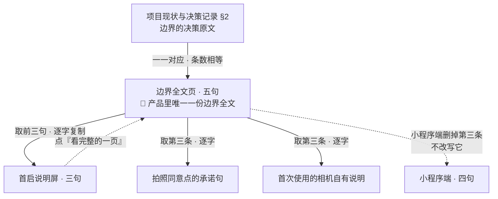

# U8.1 · 「这个产品不做什么」这一页

> **基线**：`origin/v1` @ `73041df`，fetch 于 2026-09-02。
> **状态：活跃。** 五句的条数变化、消费者增减、`M8-G1` 被裁定，本文同一次改动内更新。
> **上一层**：[M8 · 边界的用户可见落点](INDEX.md)

---

## 一、这个子能力是什么、不是什么

**是**：设置里「关于」组第一条点进去的那一页。它是**产品里唯一一份边界全文** ——
五句话，说清这个产品明确不做的五件事，一个字都不改地摆在那里。

**它必须说清哪五件事**（原文在 `设置与原图` §二，**这一层不复写、不摘抄、不改述成第二个版本**）：

| # | 这一条要说清的事 | 它对应哪条红线 |
|---|---|---|
| 一 | 不判断对错，只回答有没有 / 几次 / 多久前 | 能力边界 |
| 二 | 不存题目内容，库里没有能装它的地方 | 真题原文不上线 |
| 三 | 拍的原图只在这台设备上，不上传不同步不备份 | 原图留存（`I-5`） |
| 四 | 不提醒、不排计划、不发徽章 | 不做提醒（`R-05`） |
| 五 | 学科判断外包给用户自己接的模型 | 不做教研 |

**不是**这六样，逐条写死，因为每一样都有人会想加：

| 不是什么 | 为什么 |
|---|---|
| 不是第十四屏 | 它是 `S-SET` 的子页，不进十三屏表；有独立地址是为了能发给别人看，不是为了给它一个屏号 |
| 不是营销页 | 它说的全是产品**不做**什么。一句「我们更懂你的备考」都不许有 |
| 不是流程的一步 | 🔴 **页上零可点元素** —— 没有「了解更多」、没有跳去隐私政策的链接、没有「我知道了」。任何一个可点元素都会把一份声明变成一步操作 |
| 不是可以到处放的东西 | 🔴 **没有第二入口。** 不在首页放、不在空态放、不在记录流程里放。**边界不靠反复提醒建立，靠产品行为本身** —— 一个被到处放的「我们不做什么」是营销 |
| 不是可以有两个版本的东西 | 🔴 A/B 两版**永不**。一个产品对自己不做什么有两种说法，等于没有说法 |
| 不是接口下发的内容 | 🔴 构建期打进包里的静态串。接口下发意味着这五句能被服务端悄悄改，而它是边界 |

---

## 二、详细产品逻辑

### 2.1 为什么是这五句，不多不少

**五句不是挑出来的，是抄过来的。** 它与 `项目现状与决策记录` §2 的边界条目**一一对应，条数相等** ——
少一条就是漏改，多一条就是有人在决策层之外自己加了一条边界。
判据可跑的形态是逐条比对，验收断言要求**两边条数相等**（`设置与原图` §3.4 / `A-29`）。

由此推出这一页的取舍：**能进这一页的只有「结构上做不到」的事，不是「暂时还没做」的事。**
引子那一句「不是还没做」因此是必须的 —— 用户读「它不判断你答得对不对」的默认理解是
「这版还没做」，而这一页要防的正是这个理解。

**为什么不多写一条。** 每多一条，五句里就多一句没有决策原文兜着的话；
而下一次讨论「这算不算越界」时，那一句会被当成同等效力的边界引用。
**这一页不是产品价值观展示位，是决策记录的用户可读投影。**

### 2.2 为什么必须逐字同源，而不是各处各说各的

这五句在产品里有三个消费者，全都是**取用**，没有一个是改写：

| 层 | 是什么 | 什么时候改 |
|---|---|---|
| `项目现状与决策记录` §2 | **决策真源。** 边界本身 | 改边界才改 |
| 边界全文页（`设置与原图` §二） | **文案真源。** 用户可读的完整五句 | 决策改了就改 |
| 三个消费者 | **都不是真源。** 逐字复制，不重写、不缩写、不换说法 | 上面改了跟着改，不单独改 |

🔴 **为什么不许各处各说各的 —— 三条理由，按后果从轻到重：**

1. **改述必然漂移。** 同一件事写第二遍时，写的人会顺手让它更顺口、更短、更适合当前那一屏的位置。
   顺口的代价通常是把「不做」写成「暂不支持」，把「不上传」写成「默认不上传」。
2. **最先过期的一定是最不常被读的那一处。** 边界页一年改一次，同意点每天被看几十次；
   决策改了以后先改的一定是显眼的那处，而漏掉的那处仍然对用户生效。
3. 🔴 **一条边界有两种说法之后，它就不再是判据。** 以后每一次「这算不算越界」的讨论，
   都要先花时间确认按哪一份说 —— 而红线的全部作用就是不需要讨论。

**判据可跑**：`python3 scripts/boundary-copy-check.py`。它以边界全文页的五句为真源，
校验说明屏三句逐字等于前三句、同意点承诺句逐字等于第三条、首次使用的相机说明逐字消费同一句承诺，
不等就退出码 1。**这条判据以前只写在文档里没有实现，写下来那天它是红的**（三句无一逐字），现在是绿的。

⚠️ 系统权限弹窗的用途描述**不在校验范围内** —— 那段文字的长度与格式不由产品决定。

### 2.3 承诺句与附加句：为什么要切开

第三条（原图那一条）是唯一一条会被拿去别处用的，也是唯一一条曾经被改写过的。
处置写死（`设置与原图` §3.3）：

| | 是什么 | 规则 |
|---|---|---|
| **承诺句** | 「原图只在这台设备上」那一句，即本页第三条 | 🔴 **逐字同源，一个字都不许改** |
| **附加句** | 「到期之后会怎样」的后果说明 | 可以加、可以按端删，**但不许改写承诺句、不许与它冲突**。时长由判据层给，界面不写死 |

**为什么这么切：**「图只在这台机器上」这件事本身是红线，它必须只有一种说法；
「到期之后怎么样」是这条红线的**后果说明**，它在拍照那一刻是必要的、在首启时是抽象的。
两者混成一句，就会出现「为了塞下后果而改写红线」这种改动 —— 而那正是要堵的。

### 2.4 这一页的文案什么时候能改

🔴 **能改，但改它 = 改产品边界，走的是决策流程不是文案流程。**

| 改动类型 | 谁能改 | 顺序 |
|---|---|---|
| 错别字、标点 | 任何人 | 普通提交 |
| 语气、断句（**不改变任何一条的含义**） | 产品 | 普通提交，并在提交信息里写明「不改变含义」 |
| **删一条 / 加一条 / 让一条的范围变松** | 🔴 只有人审 | **先改决策原文，再改这一页。顺序不可颠倒** |
| A/B 两个版本 | 🔴 **永不** | —— |
| 按端给不同版本 | 🔴 **永不**。唯一例外：小程序端**不出现第三条** | 那个端上没有原图，这句话**没有主语** |

⚠️ **小程序端是删掉那一句，不是改写它。** 一句没有主语的承诺是假承诺；
而在一个端上把承诺降级成「我们保证不了它待多久」，会让**其余端那条承诺一起变成「看情况」**——
用户不按端记忆承诺，只记住这个产品对原图的说法是有条件的。

---

## 三、前端行为意图 × 后端契约意图

| 场景 | 前端行为意图 | 后端契约意图 |
|---|---|---|
| 渲染这一页 | 从设置进；标题 + 引子一句 + 五条 + 一行落款；🔴 零可点元素；离线完整显示，**没有加载态、没有失败态** | 🔴 **零端点。** 五句是构建期打进包里的静态串，不许由任何接口下发 |
| 直达与分享 | 有独立地址，用户要把这一页发给别人看，地址必须发得出去 | **无登录要求。** 未登录也能打开这一页；它不返回任何业务数据，所以不违反「未登录不给业务数据」 |
| 端差异 | 小程序端少一条，是**构建期差异**，不是运行期判断 | 🔴 **不做灰度、不按端下发不同版本、不做远程开关。** 有一个能关掉某一条的开关，就等于边界可以被远程关掉 |
| 同源一致性 | 前端不拼接、不截断、不按屏宽换短句；字号放大时纵向滚动，**一句不减、一字不改** | **无契约面。** 一致性由构建期脚本保证，不是运行期校验 —— 运行期校验意味着服务端手上有一份用来比对的副本 |
| 埋点 | 不埋。这一页被打开多少次，产品不知道 | 不提供任何为此新增的上报口 |

---

## 四、边界与红线在这里的具体形态

| 红线 | 在这一页上的形态 |
|---|---|
| **边界只有一种说法** | 全产品唯一一份边界全文；三个消费者逐字取用；机器守着，改一个字就红 |
| **不判断对错** | 这一页自己不含任何数字，也不含任何评价性词汇；它写的是产品不做什么，不是用户做得怎么样 |
| **不存题干** | 五句里没有一处能容纳题目内容，也没有示例、占位、举例说明 |
| **原图不上云** | 第三条就是那条承诺，也是它在产品里的定义处；别处出现的都是它的复制 |
| **不做提醒** | 第四条是它的用户可读版本；这一页本身也不主动出现，不弹、不推、不引导 |
| **没有第四种反馈形态** | 它是一页，不是弹窗、不是浮层、不是蒙层引导。🔴 首启全屏展示一次并要点「我知道了」被明确判否 —— **被点掉的声明等于没说**，而且总纲的浮层只用在「必须二选一」上，这里没有二选一 |

---

## 五、缺口登记

### `M8-G1` 🔴 这一页在首启展不展示 —— 两份规格结论相反，互相都没改对方

**只登记，不裁定。** 两边理由都完整，缺的是一次裁定。原样摆出来：

**一边：`设置与原图` §3.3 判「不展示」。**

- `docs/product/specs/设置与原图.md:238-240`：`### 3.3 首次使用时要不要展示一次` / `**不展示。** 判据与结论:`
- 同文件 `:244`（否决首启展示那一行的三条理由）：它是一个必须被点掉的弹窗，而浮层只用在「必须二选一」上；
  第一次打开产品的人还没有任何数据，这五条对他全是抽象的；「我知道了」会被无脑点掉。
- 同文件 `:216`（§3.1 第二入口）：🔴 **没有。** 不在首页放、不在空态放、不在记录流程里放。
- 同文件 `:1303`（验收用例 `A-27`，**仍在生效**）：全新安装走完首启，🔴 不出现任何全屏边界声明弹窗；这一页只能从 `S-SET` 进。

**另一边：`首次使用与权限申请` §1.3.3 定成不可跳过的首启第一屏。**

- `docs/product/specs/首次使用与权限申请.md:158-159`：结论（2026-09-02 用户裁定「没有本地模式」后改写）——
  有这个说明，而且它是首启的第一屏，用户在登录之前先读到这三句，不给跳过。
- 同文件 `:170`：🔴 不可关闭、不可跳过、没有返回。
- 同文件 `:203`（真源关系表给它定的身份）：首启说明屏**不是真源**，取全文页前三句逐字复制。

**两点说明这不是措辞差异，是结论差异：**

1. 说明屏上的「看完整的一页」在登录之前就能打开这一页，**这正是一个第二入口**，
   而 `设置与原图.md:216` 写着第二入口没有。
2. `设置与原图.md:1396` 那条 2026-09-02 变更记录逐节列了改动范围，末尾写着「**未动**：§二、§三……」——
   §三 正是 §3.3 所在的那一节。裁定改写了首启路径，**但没有回头改这一节**；
   而 `首次使用与权限申请` §1.3.3 改写时也没有标注它推翻了 §3.3。

**需要裁的是什么**（三选一，本文不选）：① 说明屏留着，`设置与原图` §3.3 与 `A-27` 跟着改；
② 说明屏撤掉，三句改由拍照同意点承担；③ 两者都留但重新定义「第二入口没有」那条红线。

**复现**：`python3 scripts/boundary-copy-check.py` 现在是绿的 ——
它只校验**逐字同源**，**不校验展不展示**，所以这处矛盾脚本发现不了。再读上面两处原文对照。

### 其余两条

| # | 缺口 | 缺的是哪一半 | 该谁定 |
|---|---|---|---|
| `G-8` | **这一页有多少人读过，产品不知道** | 不缺信息，缺的是一个产品**主动选择不要**的数。想埋，但它服务不了任何一条阶段判据 | 已裁定不加。登记是为了记住这是个选择，不是遗漏 |
| `G-4` | **要不要向既有用户重新征询一次同意** | 用户当初同意的是「N 小时后删掉」，产品做的是「N 小时后转留存、无限期留着」。**承诺的性质变了而同意键没变，于是没有人被重新问一遍** | 🔴 人裁定。文案已定稿，不挡开发；它挡的是「上线后第一批用户之后再改留存语义」那一次动作 |
