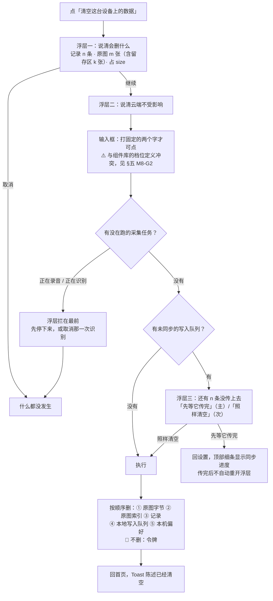

# U8.2 · 设置屏与数据管理

> **基线**：`origin/v1` @ `73041df`，fetch 于 2026-09-02。
> **状态：活跃。** 设置屏增删一个分组或一条条目、清空的影响面变化、`M8-G2` 被裁定，本文同一次改动内更新。
> **上一层**：[M8 · 边界的用户可见落点](INDEX.md)

---

## 一、这个子能力是什么、不是什么

**是**：`S-SET` 这一屏。四个分组（我的数据 / 账号 / AI / 关于）、十四个元素、
**三个危险操作、零个开关、零个自由文本输入框**。它回答的是「我的数据在哪、怎么拿走、怎么清掉」。

**不是**这五样：

| 不是什么 | 为什么 |
|---|---|
| 不是配置中心 | 🔴 **这一屏一个开关都没有**（§2.2）。一个只回答「有没有、几次、多久前」的产品，可配置的东西本来就少 |
| 不是账号中心 | 退出登录与注销的入口在 `S-ACC`，**不在这一屏首屏**；完整流程在 `登录与账号` §四 / §七 |
| 不是导出的定义处 | 这一屏只保证导出入口**永不禁用、永不加锁**。导出有什么、什么格式在 `导出与问AI` |
| 不是留存数字的定义处 | 张数、占用、上限全部由判据层算出来后显示，**界面自己不抄一个数** |
| 不是三层结构 | 层级只有两层：分组 → 条目。除边界全文页外没有二级设置页 —— **造出三层结构的那一刻，就会有人想往里填东西** |

---

## 二、详细产品逻辑

### 2.1 四组的顺序是判据不是审美

| 序 | 分组 | 为什么在这个位置 |
|---|---|---|
| ① | **我的数据** | 用户主动进设置最高频的三件事都在这：找我的图、把数据拿走、把数据清掉。**「你的数据是你的」这句话如果是真的，它就该在第一屏** |
| ② | 账号 | 登录已是前置条件，进得到这一屏的人**必然已登录**。它此刻不是待办事项，只是一行状态；放第一组等于把一件已经办完的事摆在最常来的位置 |
| ③ | AI | 只有一行，而且是**唯一与钱有关**的一行。单独成组是为了让它不混进「我的数据」—— **AI 次数是产品的成本，不是用户的资产** |
| ④ | 关于 | 边界全文页必须在设置里有一个稳定位置，但它不该抢在数据前面 |

**折叠线（最窄 360 × 640，不滚动）以上必须看得到三样**：原图管理及其张数与占用、
「导出我的全部数据」、账号的状态行。
理由：**副标题里那个数字本身就是承诺的证据**；而导出是无条件承诺，被滚动隐藏就等于打了折。
明确允许被切掉的：AI 剩余次数、关于组全部、页脚。

### 2.2 为什么一个开关都没有

🔴 **判据一条：一个开关如果打开之后产品的行为不变，它就是假的；如果变了，先回答它变到了红线的哪一侧。**

| 想加的开关 | 判 | 落在哪一侧 |
|---|---|---|
| 通知开关 / 提醒时间 | ❌ | 开关存在就意味着「打开会有提醒」，而没有。产品不做提醒 |
| 每日目标 / 学习计划 | ❌ | 目标 = 一个可比较的数 = 判断「够不够」，越过能力边界；计划还是教研 |
| 主题皮肤 | ❌ | 没人为它来，维护面却是全屏 |
| 原图自动上传 | 🔴 **永不** | 它是红线本身 |
| 原图留存时长可调 | 🔴 **永不** | 可调 = 用户能把它调到无限 = 「短期缓存」四个字失效；而且它会立刻长出「延长一次」的入口 |
| 选择原图存放目录 | 🔴 **永不** | 用户选到任何云盘同步目录的那一刻红线就破了，**而产品这边不会有任何征兆** |
| 深色模式 | ⚪ 跟随系统 | 系统已经有这个开关，再造一个是重复 |

**这一屏也没有任何一格能让用户输入自由文本。** 唯一要打字的地方是危险操作的二次确认，
它只接受一个固定短语，既不落库也不上屏回显。
🔴 这是「没有任何字段能装下题干」在设置屏的落点 —— **不是靠校验，是靠这一屏没有输入框。**

### 2.3 数据管理四条，逐条

| 条目 | 位置与样式 | 禁用条件 | 这一屏要守的具体形态 |
|---|---|---|---|
| **原图管理** | 我的数据组第一条，副标题「{n} 张，占 {size}」 | 🔴 **永不禁用**（0 张也能进，进去看到空态） | 副标题的数字是承诺的证据；取不到占用时只显示张数，**省略占用位，不显示 0、不显示「—」、不显示「计算中」** —— 一个显示 0 的空间数会让用户以为图不占地方 |
| **导出我的全部数据** | 第二条，**不加任何强调色** | 🔴 **无禁用条件**，零数据也可点 | **永不禁用、永不加锁图标、副标题里永不出现任何条件**。它是常规能力，不是特权。⚠️ 导出文件里**没有原图** —— 一份含图片的压缩包就是一条把原图搬离本机存储的通路 |
| **清空这台设备上的数据** | 第三条，🔴 **普通条目 + 次要色文字，不是红色大按钮** | 本机零记录且零原图时禁用，副标题改为说明没有数据 | 见 §2.4 |
| **退出登录 / 注销账号** | 🔴 **在 `S-ACC` 内，不在这一屏首屏** | 注销离线时禁用（本地假装成功会让用户以为账号没了而它还在） | 本机影响面见域索引 §四 第三条 |

🔴 **危险操作的三条位置约束**（全端适用）：

1. **不用填充色按钮**，用普通列表条目 + 次要色文字。红色只允许出现在**浮层内的确认按钮**上 ——
   一个红色大按钮在列表里是视觉焦点，而这三个操作都不该被顺手点到。**危险不靠颜色警告，靠多一次确认。**
2. **不在首屏第一位。** 把不可逆操作放在用户手指的落点上是设计的失误，不是他的。
3. **浮层里主按钮永远是「取消」或「先导出」，不是执行。** 读屏用户第一个听到的也是安全选项。

⚠️ 例外只有一处：批量删除原图的确认里主按钮是「删除」—— 用户在那一刻已经明确选中了若干张，
取消是他的第二意图不是第一意图。**但它仍然要浮层，仍然写明删了就没了。**

### 2.4 清空这台设备上的数据：流程与删除顺序

**删除顺序的每一步都有理由，不可调换：**

| 序 | 删什么 | 为什么在这个位置 |
|---|---|---|
| ① | 原图**字节** | 与单张删除同一顺序：**先字节后索引**。反过来会出现「用户按了删，而字节还在磁盘上」 |
| ② | 原图索引 | 崩在 ①② 之间只留残行，读取返回空，判据层照常处理 |
| ③ | 记录 | 先删图能让「空间释放」这件事在中断时也部分成立 |
| ④ | 本地写入队列 | 放在记录之后：队列先删而记录没删完，会出现「记录在但永远传不上去」 |
| ⑤ | 本机偏好（同意点、上次进的科目等） | 最后。它最不重要，但**必须删** —— 留着同意点会让下一次拍照不再问一遍 |

**清空执行到一半崩溃是可接受的中间态**：下次启动后台续跑，不打扰用户。
顺序写死的全部意义就在这里 —— 任何一个中断点上剩下的都不是危险状态。

### 2.5 清空的影响面：哪些能找回，哪些是永久毁掉

🔴 **这是这一屏最需要用户读懂的一张表。** 浮层里那句「云端的不受影响」只有配上这张表才是完整的。

| 被清掉的 | 能不能找回 | 靠什么找回 |
|---|---|---|
| 已同步的记录 | ✅ **能。** 下一次同步从云端拉回来 | 🔴 **令牌不删** —— 清空的是**数据**，不是登录状态 |
| 覆盖度与盲区 | ✅ 能。它们由记录算出来，记录回来了它们就回来 | 同上 |
| **本机原图（含留存区）** | ❌ 🔴 **永久毁掉。** 它没有服务端副本 | 无。这是这一条里唯一真正不可逆的部分 |
| **未同步的写入队列** | ❌ 永久毁掉 | 选「照样清空」时本地丢弃，**服务端从不知道这些记录存在过**。所以浮层三必须拦一次 |
| 本机偏好（同意点等） | ⚪ 不用找回 | 下次拍照会重新问一遍同意，这是设计如此 |

🔴 **令牌不删这一条要单独说清。** 清空之后用户**仍然登录着**，
下一次同步会把云端的数据拉回来 —— 这正是浮层二承诺的内容。
**要退出请用「退出登录」，两件事不合并** —— 合并会让「清空」变成一个用户预期之外的登出。

### 2.6 这一屏的状态：没有加载态

| 态 | 触发 | 屏幕上是什么 |
|---|---|---|
| **正常** | 默认（已登录） | 四组全显示 |
| **离线** | 网络不可达 | 🔴 **唯一一处降级**：AI 那一行的值位改为「联网后才知道」；注销禁用；**其余条目一格不变** |
| **空数据** | 本机零记录零原图 | 只影响两个条目：原图管理副标题、清空禁用。**不是整屏空态** |
| **令牌失效** | 续期失败 | 🔴 **整屏离开，回到未登录的登录门** —— 这一屏每一条都需要账号，不存在「留在屏上的未登录形态」 |

🔴 **这一屏永不出现骨架屏。** 它显示的东西本来就不依赖网络；
一屏标着「不需要网络」而里面有一条在转圈，那句承诺就没了。
离线降级降的是**显示**不是**能力** —— AI 那一行仍然可点，进去之后由那一屏报网络，**不在设置屏堵住用户**。

---

## 三、前端行为意图 × 后端契约意图

| 场景 | 前端行为意图 | 后端契约意图 |
|---|---|---|
| 首屏渲染 | 同步渲染，不等任何请求；四组顺序固定；折叠线以上三样必须可见 | **不要求任何启动期拉取。** 不下发配置、不下发公告、不下发条目清单 —— 条目清单可下发就意味着设置里能被远程加一条 |
| 原图管理副标题 | 张数来自本机索引，占用来自本机容量数；取不到就只显示张数 | 🔴 **零端点。** 服务端不知道用户有几张图、占多大 |
| 导出入口 | 永不禁用、永不加锁图标、副标题无条件 | 导出契约在 `导出与问AI`。这一域只加一条：🔴 **响应里没有原图字节，任何格式都没有** |
| AI 剩余次数 | 值位可降级，条目**不禁用** | `GET /quota` 必须能让前端区分「0 次」与「取不到」——两者界面表现完全不同 |
| 账号状态行 | 只显示尾号，不需要点进去看 | `GET /account` 🔴 **只要尾号；不要昵称、头像、任何自由文本字段** |
| 清空 | 三层浮层 + 打字确认；按固定顺序删五类本机数据；🔴 不删令牌 | **服务端不参与。** 未传的队列本地丢弃后服务端从不知道它们存在过；清空**不触发登出** |
| 清空前的拦截 | 正在录音 / 正在识别时浮层拦在最前 | 无契约面。⚠️ 这个跨屏状态今天没有可读来源（`G-15`）——**不定就退化成直接中断，而那会丢一次录音** |
| 退出登录 | 网络失败也让本地退出，顶部细条说明会补通知服务器 | `POST /auth/logout` 只吊销当前令牌，🔴 **失败不阻断本地退出** |
| 注销 | 离线禁用；浮层里先说清本机原图会一起删，再问要不要先导出 | `DELETE /account` 删云端并删本机原图与缓存；响应必须能区分「已受理」与「已完成」（`G-10`） |
| 埋点 | 不埋。这一屏不触发任何既有事件 | 不新增任何上报口 |

---

## 四、边界与红线在这里的具体形态

| 红线 | 在这一屏上的形态 |
|---|---|
| **不判断对错** | 这一屏全部数字只有三类：几张、占多大、还剩几次。没有一处对用户的学习做描述 |
| **不存题干** | 🔴 **零输入框。** 唯一的打字位只接受一个固定短语，不落库不回显。不是靠校验守的，是靠这一屏没有输入框 |
| **不做提醒** | 没有通知开关、提醒时间、每日目标、学习计划；页脚常驻一句陈述这个应用不在后台提醒任何事。⚠️ 连「我们不打扰你」这类反向自夸也不许写成营销语气 |
| **原图不上云** | 三条永不提供的开关（自动上传 / 留存时长可调 / 选目录）在这一屏被逐条判否，理由记在 §2.2 |
| **导出永不上锁** | 导出条目永不禁用、永不加锁图标、副标题永不出现条件（`I-4` 在设置屏的落点） |
| **没有第四种反馈形态** | 三个危险操作全部走浮层，没有第四档确认方式；清空完成给一条 Toast，**Toast 上没有「撤销」** |
| **不做促销** | AI 那一行只显示剩余次数，不显示「立即升级」「限时优惠」，也不在额度低时改变它的样式 |

---

## 五、缺口登记

### `M8-G2` 🔴 清空要不要打字确认 —— 两份规格结论相反

**只登记，不裁定。**

- `docs/product/specs/全局组件与交互模式库.md:1300`：`C-DANGER` **二档 · 浮层确认一次**的用例里
  明确列着「清空这台设备上的数据」。
- 同文件 `:1301`：**三档 · 打字确认** —— 🔴 「全产品只有一处：注销账号」。
- 同文件 `:1316`：小节标题即「打字确认的细则（**仅注销**）」。
- `docs/product/specs/设置与原图.md:760`：四条删除路径差异表里，清空设备一列写的是「**2 次 + 打字**」。
- 同文件 `:834`（`B-21`）：二次确认的输入「只接受固定的两个字（「清空」/「注销」）」——**两个**，不是一个。
- 同文件 `:1209`（`S-05`）、`:1293`（`A-22`）、`:1297`（`A-26`）：验收用例按「要打字」写。

**缺的是一次裁定，不是缺信息**：要么清空降到二档（去掉打字），要么三档的「全产品只有一处」改写成两处。
两边的理由都成立 —— 清空丢的不是整个账号的全部数据（三档判据不满足），
但它丢的是**本机原图，而那部分永久不可恢复**（二档「影响范围明确且有限」也不完全成立）。

**复现**：`grep -n '打字确认' docs/product/specs/全局组件与交互模式库.md docs/product/specs/设置与原图.md`，
再读上面两处原文对照。**该谁定**：产品出方案，人给 pass/fail —— 它改的是全产品唯一一条三档规则。

### 其余四条

| # | 缺口 | 缺的是哪一半 | 该谁定 |
|---|---|---|---|
| `G-15` | **清空时「正在录音 / 正在识别」的状态谁提供** | 拦截浮层要求清空前知道有没有在跑的采集任务，而这个状态今天没有一个跨屏可读的来源 | 技术。**不定就退化成清空时直接中断，不拦截 —— 而那会丢一次录音** |
| `G-10` | **注销的删除时点** | 已登记为未决 | 技术 + 律师稿。挡的是注销浮层里能不能写「立刻删」 |
| `G-12` | **这一屏用到的一批界面数字没人审过**（二次确认的匹配规则、版本号格式、最窄宽度与折叠线口径） | 产品可以定，但没定过；它们不是从判据层来的 | 产品。不挡设计动手，挡的是「写进代码时算不算已裁定」 |
| `G-6` | **容量那个数还没落地** | 原图管理副标题里的占用依赖一个**还不存在的值** | 技术 + 产品 |
