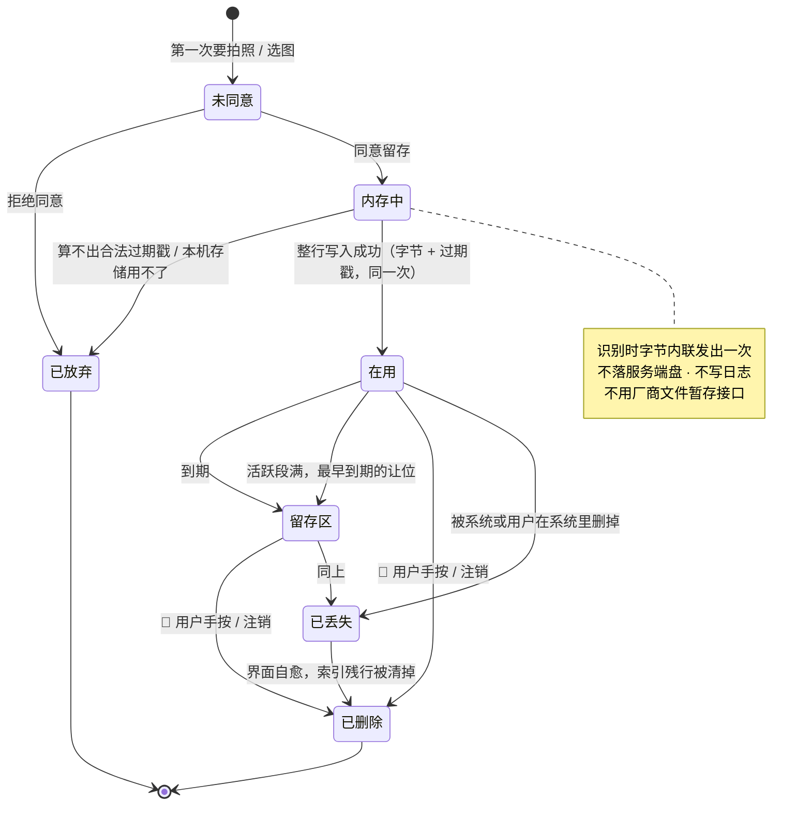
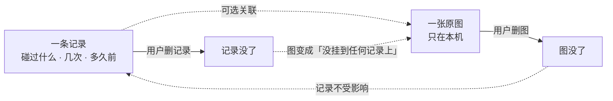
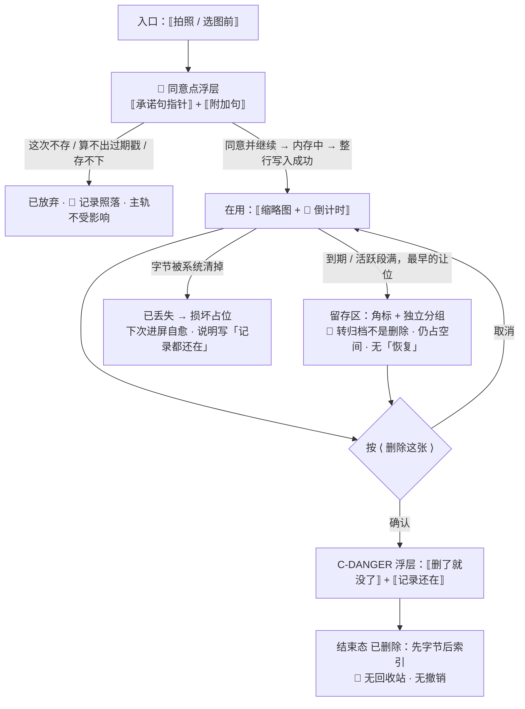

# U8.3 · 原图在哪、什么时候消失

> **基线**：`origin/v1` @ `73041df`，fetch 于 2026-09-02。
> **状态：活跃。** 原图存放位置、到期后的处置、真正删除的路径清单、退出与注销的差别，任何一处变化，本文同一次改动内更新。
> **上一层**：[M8 · 边界的用户可见落点](INDEX.md)

---

## 一、这个子能力是什么、不是什么

**是**：产品对用户最硬那条承诺的完整展开 —— **图在哪、什么时候消失、换手机还在吗**。
判据是一句可以拿去念的话：把这一单元念给一个没用过产品的人听，他能自己回答出「我换手机了，那些图还在吗」。

**不是**这四样：

| 不是什么 | 为什么 |
|---|---|
| 不是留存数字的定义处 | 保留多久、活跃段几张、归档段上限全由判据层产生。🔴 **界面自己抄一个数就等于开了第二个真源** |
| 不是存储实现 | 索引与字节怎么放、原子写、线协议在 `原图存储：判据层与存储层`。这一层只写用户可见后果 |
| 不是删除交互与元素清单 | 删几次确认、批量怎么选、怎么自愈是另一件事。本文只定义**哪些路径通向真删** |
| 不是权限流程 | 权限在 M0。只用一条结论：**权限只影响新图能不能进来，不影响已经在的图能不能管** |

---

## 二、详细产品逻辑

### 2.1 图存在哪：四个端，四个答案

| 形态 | 存在哪（界面上不显示绝对路径） | 界面上怎么说 |
|---|---|---|
| **桌面壳（macOS）** | 系统给这个应用的**应用数据目录**。**不是**文稿、不是桌面、不是图片库 | 在这台电脑上，这个应用自己的文件夹里 |
| **浏览器 / Web** | 浏览器给这个网址的本地数据库，**按网址隔离** | 在这个浏览器里，换个浏览器就看不到 |
| **移动 App** | 系统给这个 App 的私有目录，别的 App 读不到 | 在这台手机上，这个应用自己的地方 |
| **微信小程序** | 🔴 **不存原图，这个端没有这一屏** | 边界全文页在这个端删掉原图那一条 —— 没有主语的承诺是假承诺 |

🔴 **目录选择本身就是红线的物理落点，不是一个实现细节。**
macOS 的 iCloud「桌面与文稿」同步默认可开，开着就等于**原图自动上云**；
而这条破口**不在你写的代码里、不报错、不出现在任何 review 里、测试全绿**。

由此推出三条界面上的「不提供」：**不显示绝对路径也不给「在访达中显示」**（给出路径的下一步必然是
「让我换一个」）、**不提供选目录**（用户选到云盘同步目录那一刻红线就破，而产品这边不会有任何征兆）、
**不提供跨形态迁移**（壳与浏览器结构上互相读不到；要读到只能造一条把原图搬出原存储的通路，
那条通路本身就是破口）。用户会遇到「我明明存过，这边一张都没有」，处置是**提前说**，不是打通它。

⚠️ **小程序端不做弱化版。** 那个沙盒里「只存在你自己的机器上」**物理上不成立**；
在一个端上降级承诺会把**其余端那条承诺一起变成「看情况」**——
用户不按端记忆承诺，只记住这个产品对原图的说法是有条件的。

### 2.2 🔴 到期是转归档，不是删除

**存储层已经没有任何自动删除路径。** 到期只调归档；条数上限超了也只调归档（`R-106` 裁定①）。
由此得到本单元最硬的一条界面约束（`设置与原图.md:617-618`，已定稿）：

> 🔴 **界面上永远不出现「到期删除」「自动删除」「N 小时后删掉」。**

**两条理由，第二条更要紧：**① 写「会删」是**描述一个不存在的行为**；
② 而且是**往危险的方向描述错** —— 用户会以为图已经没了，于是不去清理，于是空间一直占着。

**两条转入留存区的路径，用户都要能理解：**

| 路径 | 触发 | 界面上怎么说 |
|---|---|---|
| **到期** | 过了留存期 | 单张详情的倒计时走完，那张图移到留存区分组 |
| **活跃段满了** | 活跃段条数达上限，最早到期的几张让位 | 页脚常驻一句：满了会把最早的转进留存区，**不会删** |

⚠️ **第二条必须写出来。** 它意味着**一张没到期的图也可能出现在留存区**，
而用户对此的默认理解是「它到期了」。不写，他会以为倒计时是假的。
这也是留存区分组**始终排最后、不参与时间排序**的理由 —— 混排会让用户以为留存区 = 老图。

### 2.3 归档之后：四个问题一次答完

| 问题 | 答案 | 界面上在哪回答 |
|---|---|---|
| 还能不能看 | ✅ **能。归档不是删除**，读得出来 | 留存区分组里点开就是大图 |
| 占不占空间 | 🔴 **占。归档一个字节都不释放** | 分组标题右侧的张数与占用 —— 它是「现在清理能拿回多少」的直接答案 |
| 能不能恢复成活跃 | ❌ **不能，而且不提供这个操作** | 详情里没有「恢复」按钮 |
| 什么时候真正删除 | 🔴 **永远不会自动删除。只有用户手按才真删** | 页脚那句「不会删」 |

🔴 **为什么不给「恢复」—— 这是类型上的约束，不是自觉。**
恢复 = 把归档时刻抹掉 = **一次重试就把留存期延到无限**。存储口的五个方法里写不出这个操作
（没有延期、没有 touch，归档碰不到过期戳）。加一个「恢复」按钮就等于要求存储层开第六个方法 ——
**那个口一开，红线在接口层就没了证据。**

### 2.4 单张原图的生命周期

状态名取自 `设置与原图` §6.6，**本文不新造**。



| 态 | 占本机空间 | 能预览 | 能回上一态 | 用户看到什么 |
|---|---|---|---|---|
| **未同意** | ❌ | ❌ | —— | 同意点浮层 |
| **内存中** | ❌ 只在内存 | ✅ | —— | 采集屏的预览图 |
| **在用** | ✅ | ✅ | —— | 时间分组里的缩略图 + 倒计时 |
| **留存区** | ✅ **仍然占** | ✅ | ❌ **不能回到「在用」** | 留存区分组 + 角标 |
| **已丢失** | ❌ 字节没了 | ❌ 占位 | ❌ | 损坏占位，一次刷新后自愈消失 |
| **已删除** | ❌ | ❌ | 🔴 **永不能恢复，没有回收站** | 不显示 |
| **已放弃** | ❌ | ❌ | —— | 一句失败说明，**记录照落** |

🔴 **「已放弃」不影响记录。** 存不下或算不出过期戳时，界面必须说「这张图没被本地缓存」，
**不是「记不下来」**。与「识别挂了 ≠ 记录挂了」同构：**降级方向是少功能，不是少记录**（`I-1`）。

### 2.5 识别那一次：唯一一次离开本机的字节

这是用户唯一会疑惑的地方，必须在**同意点**回答，不能等他自己发现。
拍照识别时字节**内联发出去一次**：不落任何盘、不写日志、不用厂商的文件暂存接口 —— 这是 `I-5` 的全文。

**这条约束在三层上各有一份证据，任何一层失守其余两层都能发现：**

| 层 | 证据 | 谁保证 |
|---|---|---|
| **类型层** | 元信息八个字段全是本机语义，**签名里没有 URL / bucket / fileId 的位置** | `原图存储：判据层与存储层` §2.2 |
| **接口层** | 原图相关操作**零端点**；识别端点是识别不是存储，multipart 打上去被拒 | 服务端测试 |
| **界面层** | 原图管理整屏**零出站请求**，抓包可验 | 界面验收 |

⚠️ **不要把这件事写成「为了保护隐私，我们不上传」。** 那是在解释动机，而动机可以改变；
要写的是事实 —— **事实不会因为下个版本想通了就变。**

### 2.6 🔴 退出登录不碰原图，只有注销才删

| | 退出登录 | 注销账号 |
|---|---|---|
| **本机原图** | 🔴 **一张不动** | 🔴 **默认删除**（2026-09-02 裁定） |
| **本机记录缓存** | 已同步的清掉（账号里还在，重新登录就回来） | 一并删除 |
| **未上传的队列** | **先拦一次**，传完再退 | 随账号一起没了 |
| **告知时机** | 浮层里说清原图一张不动、记录重新登录就回来 | 🔴 浮层里**明确告知一次**，说在「要不要先导出」**之前**；删完**不再给二选一** |
| **离线** | 可点。本地先清令牌，细条说明会补通知服务器 | 🔴 **禁用。** 本地假装成功会让用户以为账号没了而它还在 |

**为什么这条差别必须写清 —— 两个语义完全不同的动作：**

- **退出登录 = 换个人用这台设备。** 记录有服务端副本，清掉是安全的；
  **原图没有服务端副本，清掉就是永久毁掉。** 一个「登出」顺手毁掉用户的图，
  是用一个动作做了两件事，而其中一件用户没同意。
- **注销 = 这个账号不存在了。** 此时留着本机原图反而是一个无主残留 —— 它挂不到任何账号上，
  用户也没有入口再进来管理它。所以默认删，代价是**必须在他决定要不要先导出之前就说清楚**。
- 🔴 **「先导出」入口保持不变、永不禁用** —— 这是「导出永不上锁」在注销流程里的落点。

### 2.7 删了图，记录还在

**在。记录与原图是两件事。** 这是用户最容易搞错、也最影响他敢不敢删图的一件事。



一张图进本机缓存的时刻**常常早于记录存在的时刻**，所以它允许不挂在任何记录上 ——
**图的生命周期不依赖任何一条记录**；反过来也成立：**覆盖度由记录算，不由图算**，
所以删图**不改变任何一个盲区数字**。⚠️ 删记录时挂在它上面的图 🔴 **不跟着删**，
变成「没挂到任何记录上」—— 删记录是一次「我记错了」的更正，不是一次「我要清空间」的动作。

产品的回答必须出现在**每一次删除浮层里**：删图的浮层写「记录还在」；
**只有清空设备那一条相反** —— 它真的删记录。

### 2.8 换设备 / 重装 / 清空：后果一样，警告时机完全不同

| | 换设备 | 重装 / 卸载 | 清空这台设备上的数据 |
|---|---|---|---|
| **原图** | 🔴 **不跟着走** | 桌面壳数据目录通常保留；移动端**随 App 删光**；Web 清站点数据即删光 | 🔴 全部删除 |
| **记录** | ✅ 跟着账号走。**不存在「未登录攒下的记录」** | 同左 | 本机删除，云端不受影响 |
| **事前能警告吗** | ❌ 做不到 | ⚠️ 部分能 | ✅ 能，而且必须 |

⚠️ **这张表的每一格都是端事实，不是产品选择。产品能做的只有一件事：提前说。**
所以那句常驻说明不是可选的补充信息 —— **它是这三种情况唯一的事前警告。**
三条事前警告时机各不相同：换设备靠原图屏常驻那一句；清空靠第一层浮层给出的量级；
🔴 **首次登录成功后回到原图屏，要用一条可关闭提示说清「登录同步的是记录，不是图」。**

🔴 **第三条最容易被漏掉，也最容易让用户产生误解。**
用户的心智模型是「登录 = 我的东西都上云了」，而这个产品里登录同步的是记录不是图。
**不在登录后立刻说清楚，他会在换设备时才发现，而那时已经晚了。**

---

## 三、前端行为意图 × 后端契约意图

| 场景 | 前端行为意图 | 后端契约意图 |
|---|---|---|
| 存一张图 | 先过同意点；**整行一次写入**（字节 + 过期戳同一次），失败只影响图不影响记录 | 🔴 **零端点。** 服务端不参与存图，也不知道存了几张 |
| 列出 / 读 / 删 / 归档 / 统计 | 全走本机；整屏零出站请求 | 🔴 **一个端点都没有**，逐条理由见 §四 |
| 识别 | 内存里的字节内联发出去一次，发完即弃 | 🔴 **JSON + 内联编码，一次性**；multipart 打上去必须被拒 —— 它不是一个会落盘的上传接口。日志里不得出现字节、编码片段、原图文件名 |
| 到期与归档 | 倒计时由本机时钟与过期戳算；归档在本机判据层做 | **服务端不参与归档判据** —— 参与就有了第二份判据，而「一次重试延不了留存期」正是靠只有一份判据守住的 |
| 容量那个数 | 有缓存读缓存；冷启动与下拉刷新才全量；取不到就省略占用位 | 🔴 容量**只由界面读，不进判据层** —— 判据层拿得到容量，「归档也淘汰」就从后门回来了 |
| 壳侧本地通道 | 探测那个口在不在（问能力，不问宿主） | **它不是端点。** 前缀刻意不是 `/api/*`。🔴 响应 `content-type` 恒为 `application/octet-stream` —— 按图片类型回，这个地址就成了一条能在浏览器里直接打开原图的链接 |
| 退出 / 注销 | 见 §2.6 | 退出只吊销令牌、不下发本机清理指令；注销删云端**并**删本机原图与缓存，响应要能区分「已受理」与「已完成」 |
| 时钟异常 | 往前拨：大量图同时进留存区，**不弹浮层，一张都不删**；往后拨：🔴 **不显示负数、不显示「已过期」** | 归档**一次性且幂等**，反复扫描不会把归档时刻一路往后推 |

---

## 四、边界与红线在这里的具体形态

| 红线 | 在这里的形态 |
|---|---|
| **原图不上云不同步不共享**（`I-5`） | 目录选择是它的物理落点；识别时内联一次即弃；**没有任何分享 / 上传 / 备份 / 同步入口** |
| **三个「没有」以肯定形式明说** | 🔴 **一个功能不存在和一个功能被藏起来，在用户那里长得一模一样。** 没有上传按钮、没有云备份、没有同步开关，三句都要写出来，不能靠「找不到那个按钮」让用户推断 |
| **「备份」也在红线内** | 备份需要一份长期云端副本。**备份是共享的最温和形态，但它仍然是** |
| **「同步」破的是单数** | 红线写的是「只存在他自己的机器上」——**单数**。有了同步，「他的机器」就变成一个不断增长的集合 |
| **不判断对错** | 全部展示数字只有四类：多久前存的、还有多久转留存区、占多大、几张 |
| **不存题干** | 本机文件名只在本机显示、不进任何请求体，**且不提供重命名** —— 重命名 = 一个用户可写的自由文本字段挂在一张图上 |
| **不做提醒** | 到期不发通知、活跃段满不打断用户、留存区长到多大也不提醒去清（`G-5`） |
| **没有第四种反馈形态** | 转入留存区**没有浮层**，只靠页脚常驻那一句；删除完成的 Toast 上**没有「撤销」** |
| **手按的删就是真删** | 先删字节后改索引，理由就是这一条。**不给「撤销」**：撤销要求软删除，那意味着有五秒钟字节还在盘上 —— **在这条线上，五秒也是打折** |

**为什么原图相关的端点一个都不存在**（红线在接口层的证据，不是「暂时没做」）：
列出我的图 ⇒ 服务端有我的图；读一张 ⇒ 同上，而且它是一条**能在浏览器里直接打开原图的链接**；
删一张 ⇒ 它存过；归档 ⇒ 判据层就有了第二份；统计 ⇒ 服务端至少知道我有几张、多大。
**五条推理各自独立成立，去掉任何一条其余四条仍然拦得住。**

---

## 五、缺口登记

**只登记，不裁定。一个看起来合理的推断不能关闭其中任何一条。**

| # | 缺口 | 缺的是哪一半 | 该谁定 |
|---|---|---|---|
| `G-2` | **留存区保留多久** | 「转入留存区」之后没有第二个时点，也没人裁定过要不要有。今天的答案是「永远留着，直到用户手按」 | 产品 |
| `G-4` | **要不要向既有用户重新征询一次同意** | 用户当初同意的是「N 小时后删掉」，产品做的是「转留存、无限期留着」。**承诺的性质变了而同意键没变** —— 那个键防的是「时长变了」，防不住「性质变了」 | 🔴 人裁定 |
| `G-5` | **留存区会长到多大，要不要提醒** | 留存区不淘汰、不释放空间，长期使用后它是这台设备上最大的一块。**但「提醒用户去清」是提醒，而产品不做提醒** | 产品。不定就按现状 |
| `G-6` | **容量那个数还没落地** | 技术侧明说这是**已知缺口，不是已经做完的事**。**本文写的界面依赖一个还不存在的值** | 技术 + 产品 |
| `G-7` | **浏览器驱逐策略的确切行为** | 外部事实，产品验证不了也控制不了。它决定 Web 版常驻说明写「可能清理」还是「会清理」 | 技术，动手前复核 |
| `G-10` | **注销的删除时点** | 已登记为未决。挡的是注销浮层里能不能写「立刻删」 | 技术 + 律师稿 |
| `G-13` | **「另一形态有数据」怎么探测** | 结构上读不到对方，今天没有一个不破红线的探测手段 | 技术。**不定就退化成常驻显示那一行** |

---

## 六、线框

> 记号表与红线自查十条见 [线框与交互规格约定](../线框与交互规格约定.md)。屏宽 40 个半角字符。承诺句与附加句 🔴 **一个字都不抄**，只给指针（约定 §二）。不需要网络：常态 + 空态 + 离线细条，常态之外只画变化区。
> 🔴 **三处不可弱化的东西全在第一层**：同意那一刻、原图到期倒计时、随时可按的立即删除入口。

### 6.1 三张画在同一块里

```
┌────────────────────────────────────────┐
│ 同意点浮层              ← C-SHEET      │  ※1
│  ⟦承诺句 → 设置与原图 §二 第三条⟧      │  ※2
│  ⟦附加句·到期之后会怎样⟧               │  ※2
│  ( 同意并继续 )      [ 这次不存 ]       │  ※3
├────────────────────────────────────────┤
│ 单张原图详情 · 常态整屏                 │
│ ‹ 返回 ›               ← P-NAV         │
│ ⟦大图·本机读⟧                          │
│ ⟦多久前存的⟧                            │
│ 🔴 ⟦还有多久转留存区·倒计时⟧            │  ※4
│ ⟦占多大⟧                                │
│ ⟦属于哪条记录⟧ ← 可点；没挂时整条隐藏   │
│ ⟨ 删除这张 ⟩           ← C-DANGER       │  ※5
├────────────────────────────────────────┤
│ 变化区 · 留存区 / 空态 / 离线            │
│ ⟦缩略图 + 留存区角标⟧                   │  ※6
│ ⟦已转入留存区·不再倒计时⟧               │
│ ⟦损坏占位⟧                              │  ※7
│ ⟦顶条·离线⟧            ← C-OFFLINE     │
│ ⟦页脚常驻·满了会把最早的转进留存区⟧     │  ※6
└────────────────────────────────────────┘
```

※1 🔴 **在快门之前**，不是拍完再问；红线唯一一次征得同意的位置，不许折进二级入口、不许做成可跳过的一行小字
※2 ※3 承诺句逐字同源，本框只放指针；附加句可加、可按端删，🔴 不许改写承诺句、不许与它冲突，时长由判据层给。拒绝走 `已放弃`，🔴 **记录照落**（`I-1`）—— 界面说「这张图没被本地缓存」，不是「记不下来」
※4 🔴 **常驻可见，不折叠、不进二级页。** 它是承诺，**不是**约定 §五 第 6 条禁的促销紧迫感；措辞只说**转留存区** —— 🔴 界面上永远不出现「到期删除」「自动删除」「N 小时后删掉」；时钟往后拨不显示负数、不显示「已过期」
※5 🔴 **第一层常驻可按**，不折进「更多」；浮层写清删了就没了 **+ 记录还在**；手按即真删，Toast 上没有「撤销」
※6 ※7 留存区分组**始终排最后、不参与时间排序**，详情里🔴 **没有「恢复」**；页脚常驻，🔴 不许折成「展开查看」；损坏占位是空态的第二种形态，一次刷新后**自愈消失**，顶部说明必须写「记录都还在」；离线细条与这一块正交，**整屏零出站请求，能力一格不降**

🔴 **这三张里没有的东西**：没有分享 / 导出 / 上传 / 备份 / 同步 / 保存到相册、没有绝对路径与「在访达中显示」、没有选目录、没有重命名、没有「恢复」、没有「延长一次」、没有到期通知、没有小红点。

---

## 七、交互规格

### 7.1 必答五项

| # | 项 | 本单元的答案 |
|---|---|---|
| 1 | **入口** | 同意点：拍照 / 选图前自动拦一次（采集流程真源 `记一次学习` §4.2），本机偏好被清空后**下次拍照重新问一遍**。详情：从 `S-RAW` 任一格进，🔴 **没有第二条通向原图的路** |
| 2 | **结束状态** | 原图轨状态名取自真源 `设置与原图` §6.6（**另一条轨，本域不新造**）：`内存中` → 整行写入成功 → `在用`；到期或活跃段满 → `留存区`；🔴 **只有用户手按或注销才到 `已删除`**，没有一条自动边。记录主轨四态**一态不动** |
| 3 | **失败落点** | 算不出过期戳 / 存储用不了 → `已放弃`，停在采集屏给一句失败说明，**记录照落**。删除失败 → 停在原位加角标，只重试失败的那些。退出登录 🔴 **一张不动**；注销默认删，且必须在「要不要先导出」**之前**告知一次（流程真源 `登录与账号` §4.7 §16.9）；⚪ 删除时点未定（`G-10`），不许写「立刻删」 |
| 4 | **空态** | 两种成因两张：① 索引读到零行 → `S-RAW` 自己的空态，本文不重画 ② 索引有行、字节不在 → §6.1 变化区那格损坏占位，下次进屏自愈。🔴 **索引读不动时什么都不做并报错**，绝不当成「索引是空的」 |
| 5 | **错误态** | 🔴 **没有网络错误态** —— 这一块零端点、零出站请求。唯一的错误是本机存储用不了，与**受限态**合并：整屏说明 + 「文字记录不受影响」，只能返回。**离线态**只有 `C-OFFLINE` 细条，能力一格不降 |

### 7.2 交互流程


