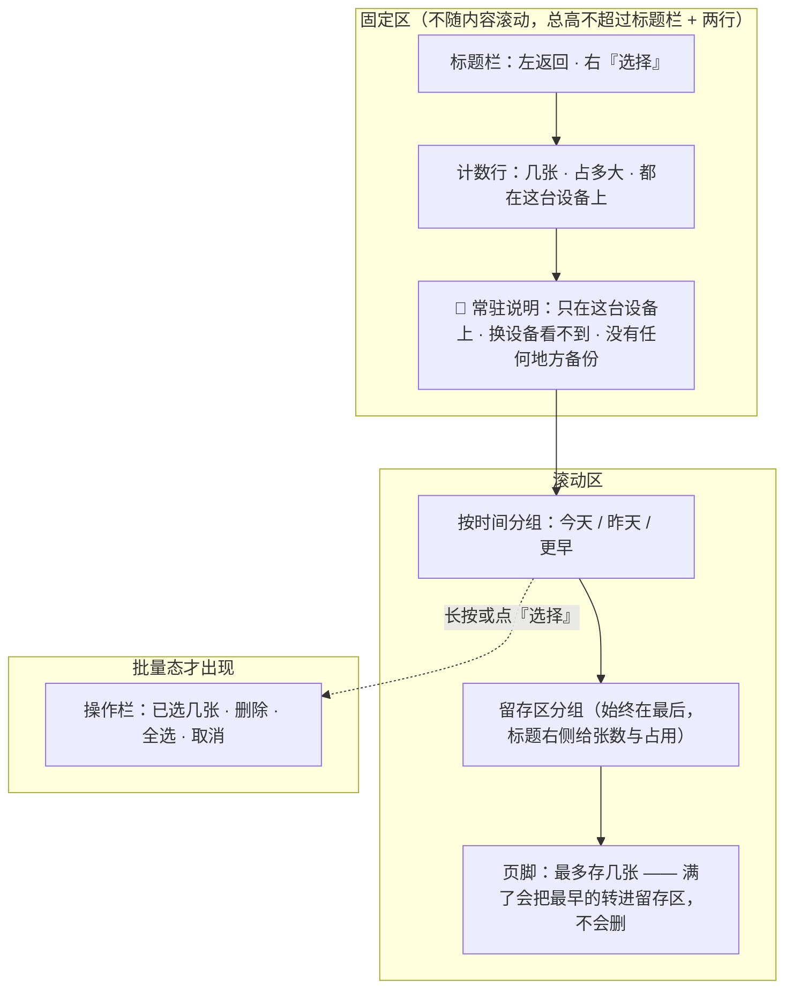
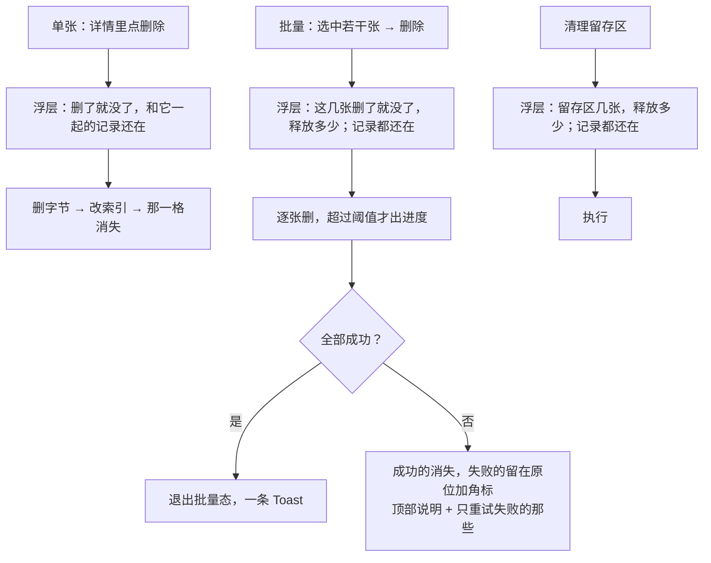
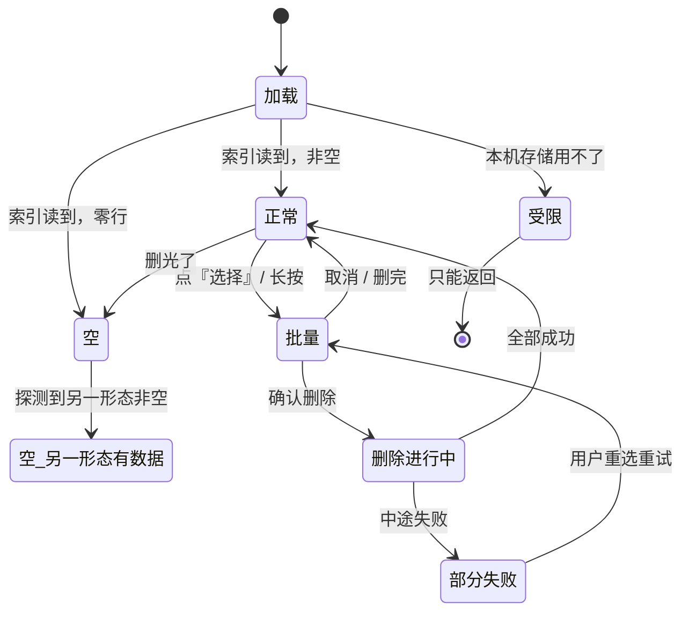
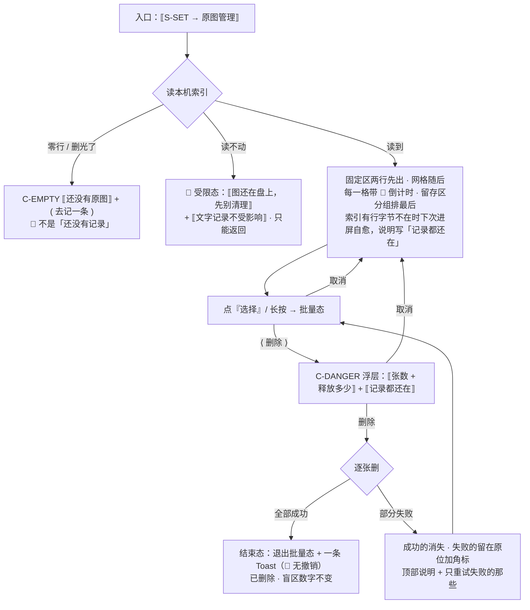

# U8.4 · 原图管理屏

> **基线**：`origin/v1` @ `73041df`，fetch 于 2026-09-02。
> **状态：活跃。** 这一屏增删一个可点元素、写操作的清单变化、空态与自愈的处置变化，本文同一次改动内更新。
> **上一层**：[M8 · 边界的用户可见落点](INDEX.md)

---

## 一、这个子能力是什么、不是什么

**是**：`S-RAW`。用户自己管这些图的地方 —— 看有几张、占多大、哪些进了留存区、哪张属于哪条记录，
以及把它们删掉。🔴 **这一屏的写操作只有两个，两个都是删。**

**不是**这五样：

| 不是什么 | 为什么 |
|---|---|
| 不是相册 | 没有「保存到相册」。相册是**系统级同步范围**（iCloud 照片、云相册默认开着），把图存进相册 = 把它交给一个会上云的地方 |
| 不是文件管理器 | 不显示绝对路径、不提供「在访达中显示」、不提供移动到别处 |
| 不是分享面板 | 🔴 **没有分享、没有导出选中、没有上传、没有备份**。长按大图也不弹系统菜单 |
| 不是原图去向的定义处 | 图在哪、什么时候转留存区、退出与注销分别怎么处置，是另一件事（域索引 §四） |
| 不是需要网络的屏 | 🔴 **整屏零出站请求。** 这不是「离线也能用」，是**它本来就没有联网的理由** |

---

## 二、详细产品逻辑

### 2.1 三种状态，用户必须能分清

| 状态 | 含义 | 界面 |
|---|---|---|
| **活跃** | 在留存期内，随时能看 | 正常缩略图 |
| **留存区** | 过了留存期，**转入留存区而不是删除** | 缩略图加角标 + 独立分组 |
| **已删除** | 用户自己删的 | 不显示 |

⚠️ **文案统一用「转入留存区」，不用「到期删除」** —— 存储层已经没有任何自动删除路径，
界面上写「会删」是描述一个不存在的行为。

🔴 **留存区分组始终排在最后，不参与时间排序。** 它不是「更早」的延续：
**活跃段满了也会把新图转进去**，一张图在留存区不代表它更早。按时间混排会让用户以为留存区 = 老图。

### 2.2 三区结构：固定区只有两行，而且不许折进滚动区



**固定区为什么只有两行**：缩略图网格是这一屏的主体，固定区每多一行就少一行图。
🔴 **但那句常驻说明不能折进滚动区** —— 它是承诺，不是补充信息；**滚一下就没了的承诺不算承诺**。
同理，字号放大到 200% 时它可以占到三行，**但不许折叠成「展开查看」**。

### 2.3 三个「没有」必须以肯定形式写在界面上

🔴 **一个功能不存在和一个功能被藏起来，在用户那里长得一模一样。**
所以不能只靠「找不到那个按钮」让用户自己推断：

| 明说什么 | 写在哪 | 为什么这个东西不存在 |
|---|---|---|
| **没有上传** | 常驻说明第一句 + 边界全文页第三条 | 上传 = 原图离开本机。这是红线本身，不是一个还没做的功能 |
| **没有云备份** | 常驻说明第二句 | 备份需要一份长期云端副本。**备份是共享的最温和形态，但它仍然是** |
| **没有同步开关** | 常驻说明 +「换设备看不到」 | 红线写的是「只存在他自己的机器上」——**单数** |

⚠️ **不要把常驻说明写成「为了保护隐私，我们不上传」。**
那是在解释动机，而动机可以改变；这句话陈述的是事实。

**Web 端要用另一版常驻说明**，因为那个端上的弱点是端事实，产品控制不了：
按网址隔离、浏览器可以主动清理、用户一键「清除站点数据」会一起清掉、隐私模式下直接不可用。
🔴 界面上**要点名「浏览器可能清理」，不能只写「建议装桌面版」** ——
后者是推广，前者是告知；**产品在这里的义务是告知一个它控制不了的事实，不是导流。**
🔴 **不因为 Web 端弱就在 Web 端加一个「备份到云」的口子。** 弱是端的事实，加口子是破红线，两件事不能交换。

### 2.4 可点元素清单里没有的东西

| 不提供 | 为什么 |
|---|---|
| 分享 / 导出选中 / 移动到 / 上传 / 备份 | 每一项都是一条把原图搬出本机存储的通路 |
| 保存到相册 | 看起来无害（相册也在本机），但相册是系统级同步范围 |
| 长按大图的系统菜单 | 移动端 WebView 默认长按图片给「存储图片 / 拷贝 / 分享」，🔴 **必须显式关掉** |
| **重命名** | 🔴 重命名 = 一个用户可写的自由文本字段挂在一张图上 = **一个能装下题干的位置**。这是「没有任何字段能装下题干」在这一屏唯一可能的破口 |
| 恢复（把留存区的图变回活跃） | 恢复 = 一次重试就把留存期延到无限。存储层写不出这个操作 |
| 跨形态迁移 | 要读到对方只能造一条把原图搬出原存储的通路 |

**这一屏只有两个写操作：删单张 / 删一批（含清理留存区）。**
其余全是读：看大图、看多久前存的、看还有多久转留存区、看占多大、看它属于哪条记录。

### 2.5 删除：三条路径，一条共同承诺

🔴 **用户手按的删就是真删。** 存储层先删字节、后改索引，理由就是这一条 ——
反过来会出现「用户按了删，而字节还在磁盘上」。



| | 单张 | 批量 | 清理留存区 |
|---|---|---|---|
| 确认 | 1 次浮层 | 1 次浮层 | 1 次浮层 |
| 浮层里必须写的 | 会失去什么 + **不会**失去什么 | 张数 + 释放空间 + 记录都还在 | 张数 + 释放空间 + 记录都还在 |
| 主按钮 | 删除 | **删除** | 删除 |
| 删记录吗 | ❌ | ❌ | ❌ |
| Toast 里有「撤销」吗 | 🔴 **没有** | 🔴 没有 | 🔴 没有 |

⚠️ **这一屏是「危险操作主按钮永远是退路」的唯一例外**：用户在那一刻已经明确选中了若干张，
取消是他的第二意图不是第一意图。**但它仍然要浮层，仍然要写明删了就没了。**

🔴 **为什么不给「撤销」**：撤销要求删除是软删除（先标记、延迟真删），
而「用户手按的删就是真删」是这条链路上**唯一不能打折的承诺**。
一个五秒可撤销的删除意味着有五秒钟那些字节还在盘上 —— **在这条线上，五秒也是打折。**

### 2.6 状态枚举与自愈

状态名取自 `设置与原图` §5.9，**本文不新造**。



**四种态在这一屏的具体形态**：加载态只盖网格位置，**固定区照常显示**（那两行不依赖索引读完）；
空态给一句「还没有原图」+ 一个「去记一条」的入口，🔴 **不是「还没有记录」**——
这一屏空不等于用户没记东西；错误与受限合并成一种（本机存储用不了），
整屏说明 +「文字记录不受影响」；批量与删除进行中是这一屏自己的两个操作态，不是第五种态。

**两条自愈规则，方向相反，都要写死：**

| 情况 | 处置 |
|---|---|
| 索引有行、字节不在（用户在系统里删了文件 / 系统清理程序回收） | 🔴 **下一次进屏自愈**，索引残行被清掉，那一格消失；清掉多张时顶部给一条可关闭说明，并且必须写「记录都还在」 |
| **索引本身读不动**（文件损坏） | 🔴 **什么都不做并报错**，整屏受限态说明「图还在盘上，先别清理」。**绝不把「读不动」当成「索引是空的」**——那会把目录里每一张都当孤儿删光 |

### 2.7 空间占用不在每次进屏时全盘扫描

🔴 **每次进屏全盘扫描是错的**：留存区不淘汰，它会长到几百张；每次都读一遍全部文件大小，
这一屏会随使用越来越慢 —— 而**慢下来的正是那些最认真用产品的人**。

处置：存一张 / 删一张走**增量**（索引里已经有这个数，不用碰字节）；
**冷启动后第一次进屏**与**用户下拉刷新**才全量；其余每一次进屏读缓存。
全量时优先读索引里的大小之和，只有在「索引与磁盘可能不一致」时才落到真的文件遍历 ——
**这一层的全部纪律是「少碰几次字节」，统计不该是例外。**

取不到占用时**只显示张数，整个省略占用位**：不显示 0、不显示「—」、不显示「计算中」。
一个显示 0 的空间数会让用户以为图不占地方。

---

## 三、前端行为意图 × 后端契约意图

| 场景 | 前端行为意图 | 后端契约意图 |
|---|---|---|
| 进屏与列表 | 读本机索引；固定区先出，网格随后；分页只做在留存区分组内部（活跃段本来就小） | 🔴 **零端点。** 一次抓包如果在这一屏上抓到任何出站请求，就是红线破口 |
| 排序 | 按过期时刻倒序；同一时刻时必须有**确定性的次级排序** | 无契约面。🔴 两次进屏顺序不同 = 用户以为图动了 |
| 删除 | 乐观更新：确认后立刻从列表移除，失败再放回并提示 | **纯本机操作，没有任何网络往返。** 批量失败必须整体可辨，不能留下半批 |
| 归档展示 | 留存区分组标题右侧给张数与占用 —— 它是「现在清理能拿回多少」的直接答案 | 🔴 容量**只由界面读，不进判据层**；归档**不释放空间**，这个数不能被当成已释放 |
| 单张详情 | 只展示：多久前存的、还有多久转留存区、占多大、属于哪条记录 | 本机文件名 🔴 **只在本机显示，不进任何请求体** |
| 大图 | 本机读；长按不弹系统菜单 | 壳侧本地通道的响应 `content-type` 恒为 `application/octet-stream` —— 按图片类型回，这个地址就成了一条能在浏览器里直接打开原图的链接 |
| 「看它属于哪条记录」 | 没挂记录时**隐藏整条**，不禁用 | 跳过去之后由时间线那一屏处理，本屏不发请求 |
| 埋点 | 不埋。🔴 一个记录删图行为的事件是这条红线上最不该出现的埋点 | 不新增任何上报口 |

---

## 四、边界与红线在这里的具体形态

| 红线 | 在这一屏上的形态 |
|---|---|
| **原图不上云不同步不共享** | 零出站请求、零端点、零分享入口；三个「没有」以肯定形式明说；Web 端另给一版说明而**不是**加一个云备份口子 |
| **不判断对错** | 全部展示元素只有四类数：几张、占多大、多久前存的、还有多久转留存区。**没有一处对图或记录做判断** |
| **不存题干** | 🔴 **不提供重命名**，本机文件名只读且不出本机。这是这一屏唯一可能的破口 |
| **不做提醒** | 到期不通知、活跃段满不打断、留存区长到多大也不提醒去清（`G-5`） |
| **没有第四种反馈形态** | 删除完成给 Toast（**不可点、无撤销**）；确认一律走浮层；🔴 不许用长按三秒 / 滑动确认代替浮层 —— 那把不可逆动作变成了手速游戏 |
| **手按的删就是真删** | 先字节后索引；无回收站、无软删除、无撤销 |
| **降级方向是少功能不是少记录** | 存储用不了时整屏受限，但必须同时说「文字记录不受影响」 |

---

## 五、缺口登记

**只登记，不裁定。**

| # | 缺口 | 缺的是哪一半 | 该谁定 |
|---|---|---|---|
| `G-6` | **容量那个数还没落地** | 技术侧明说这是**已知缺口，不是已经做完的事**：界面上今天没有任何地方显示归档占了多少。计数行、留存区分组标题都依赖它 | 技术 + 产品 |
| `G-13` | **「另一形态有数据」怎么探测** | 空态那一行要求检测到另一形态非空才显示，但两边按网址隔离、**结构上读不到对方** | 技术。**不定就退化成：那一行常驻显示，不做条件判断** |
| `G-14` | **这一屏到底有没有人打开过** | 原图这一整块是产品对用户最硬的承诺，**而产品不知道有没有人来验证过它**。埋点服务不了任何一条阶段判据，所以不加 | 已裁定不加。挡的是「这一块值不值得继续投入」这个判断 |
| `G-1` / `R-115` | **迁移失败的行在界面上不可见** | 失败时那几行留在旧存储里（**没丢**），下次启动重跑；但在重跑成功之前**用户看不见、也收不到任何提示**。现状是缓解不是修复 | 技术 + 产品 |
| `G-12` | **这一屏用到的一批界面数字没人审过**（分页大小、缩略图尺寸、批量上限、单位与进制、相对时间粒度） | 它们是界面侧新提出的，不是从判据层来的。产品可以定，但没定过 | 产品。不挡设计动手 |
| `G-7` | **浏览器驱逐策略的确切行为** | 外部事实。它决定 Web 版常驻说明写「可能清理」还是「会清理」 | 技术，动手前复核 |

---

## 六、线框

> 记号表与红线自查十条见 [线框与交互规格约定](../线框与交互规格约定.md)。屏宽 40 个半角字符。`S-RAW` 不需要网络（整屏零出站请求），按约定 §3.2 出常态整屏 + 空态 + 离线细条，常态之外只画变化区，全部并在同一块里。
> 🔴 **三处不可弱化的东西在这一屏的落点**：倒计时画在每一格上、删除入口第一层常驻可按、常驻说明是同意那一刻的延续。

### 6.1 常态整屏 + 批量态 + 变化区

```
┌────────────────────────────────────────┐
│ ‹ 返回 ›         ⟦选择⟧  ← P-NAV       │  ※1
│ ⟦计数行·{n} 张 · 占 {size}⟧            │
│ 🔴 ⟦常驻说明 → 设置与原图 §二 第三条⟧   │
│    ⟦三句，条数与顺序见真源⟧             │  ※2
├────────────────────────────────────────┤
│ ⟦分组头·今天⟧                          │
│  ⟦缩略图 + 🔴 倒计时⟧ ⟦…⟧ ← C-LIST     │  ※3
│ ⟦分组头·更早⟧   ⟦…⟧                    │
│ ⟦留存区 · {k} 张，占 {size}⟧            │  ※4
│  ⟦缩略图 + 留存区角标⟧ ⟦…⟧             │
│ ⟦页脚 → 设置与原图 §6.6 转归档那一条⟧   │  ※4
├────────────────────────────────────────┤
│ 批量态才出现 · 操作栏                    │
│ ⟦已选 {n} 张⟧ ‹全选› ‹取消› ⟨ 删除 ⟩    │  ※5
├────────────────────────────────────────┤
│ 变化区 · 空态 / 受限 / 自愈              │
│ ⟦还没有原图⟧ ( 去记一条 )  ← C-EMPTY   │  ※6
│ ⟦本机存储用不了 + 文字记录不受影响⟧     │  ※6
│ ⟦可关闭说明·清掉了几张，记录都还在⟧     │
└────────────────────────────────────────┘
```

※1 ※2 「选择」进批量态。🔴 固定区总高不超过标题栏 + 两行，但那两行**不许折进滚动区、不许折叠成「展开查看」** —— 滚一下就没了的承诺不算承诺，字号 200% 时可占三行。三个「没有」以**肯定形式**写在这里；⚠️ 不写成「为了保护隐私」这类动机句；Web 端另给一版并点名「浏览器可能清理」（⚪ 措辞待 `G-7`），🔴 **不因为 Web 端弱就加一个云备份口子**
※3 🔴 **倒计时画在每一格上**，不是进详情才看得到；单张详情与那一层的立即删除入口画在域索引 §四 登记的原图去向那一单元。**用户同意留存的那一刻**发生在采集屏的同意点浮层（同上），这一屏的常驻说明是那句承诺的延续，**不复述、也不弱化**
※4 留存区分组**始终排最后、不参与时间排序**；标题右侧那两个数是「现在清理能拿回多少」的直接答案（⚪ 占用依赖 `G-6`）；页脚常驻，措辞只说**转进留存区**，🔴 界面上永远不出现「自动删除」
※5 ※6 🔴 这一屏是「危险操作主按钮永远是退路」的**唯一例外**，但仍要浮层、仍要写明删了就没了 **+ 记录都还在**；Toast 上🔴 **没有「撤销」**，🔴 不许用长按三秒 / 滑动确认代替浮层。空态是「还没有原图」🔴 **不是「还没有记录」**；受限与错误合并成一种，🔴 **索引读不动时什么都不做并报错**，绝不当成「索引是空的」

🔴 **这张线框里没有的东西**：🔴 **没有分享、没有导出选中、没有上传、没有备份、没有同步开关、没有保存到相册**、没有长按弹出的系统菜单、没有绝对路径与「在访达中显示」、没有重命名、没有「恢复」、没有搜索与筛选、没有小红点与未读计数、没有任何百分比或进度条。

---

## 七、交互规格

### 7.1 必答五项

| # | 项 | 本单元的答案 |
|---|---|---|
| 1 | **入口** | 只有一处：`S-SET` 我的数据组第一条（🔴 **永不禁用**，0 张也进得去）。🔴 **没有深链直达单张、没有从相册或系统文件管理器进来的路**。首次登录成功后回到这一屏，要用一条可关闭说明讲清「登录同步的是记录，不是图」 |
| 2 | **结束状态** | 浏览不改变任何状态。删除的结束态在原图轨（真源 `设置与原图` §6.6，**另一条轨，本域不新造**）：到 `已删除`，先删字节后改索引。记录主轨四态与 `TS-00`–`TS-09` 🔴 **一态不动** —— 覆盖度由记录算不由图算，**删图不改变任何一个盲区数字** |
| 3 | **失败落点** | 批量删除中途失败 → 停在本屏，成功的消失、失败的留在原位加角标，顶部说明 + **只重试失败的那些**，🔴 不留一个「半批」的不可辨状态。索引读不动 → 整屏受限态，只能返回。⚪ 迁移失败的行在界面上不可见（`G-1` / `R-115`），**现状是缓解不是修复**，不在这一层替它补一个提示 |
| 4 | **空态** | 两种成因，同一张稿：① 索引读到零行 ② 删光了 —— 都给「还没有原图」+ `( 去记一条 )`。⚪ 「另一形态有数据」那一行的探测是 `G-13`，**不定就退化成常驻显示，不做条件判断** |
| 5 | **错误态** | 🔴 **没有网络错误态** —— 零端点、零出站请求，抓包可验。唯一的错误是本机存储用不了，与**受限态**合并：整屏说明 + 「文字记录不受影响」。受限态不涉及登录与额度（`I-4`）；**离线态**的 `C-OFFLINE` 细条与这一屏正交，能力一格不降 |

### 7.2 交互流程


