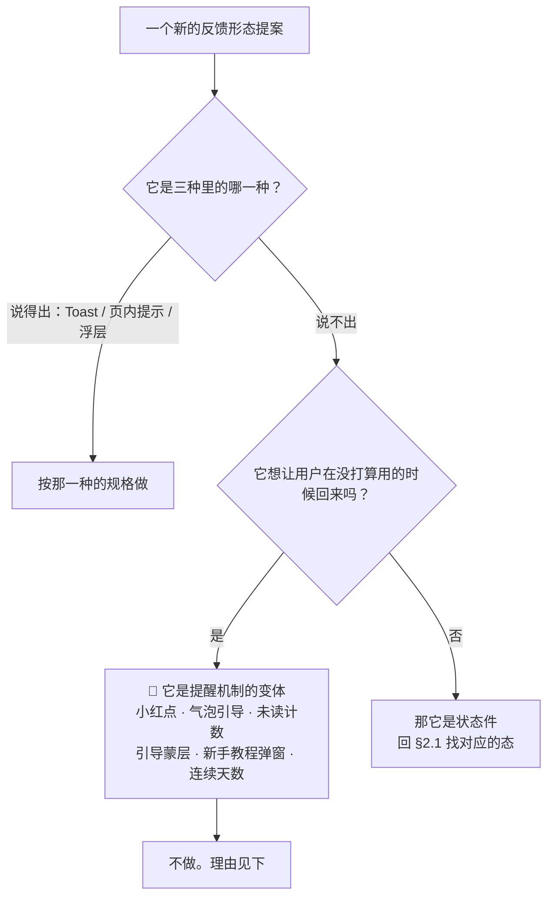

# U8.5 · 全局交互约定的边界形态

> **基线**：`origin/v1` @ `73041df`，fetch 于 2026-09-02。
> **状态：活跃。** 态的数量变化、反馈形态的数量变化、禁用词表的分类口径变化，本文同一次改动内更新。
> **上一层**：[M8 · 边界的用户可见落点](INDEX.md)

---

## 一、这个子能力是什么、不是什么

**是**：全局交互约定里**属于边界的那三条** —— 四种态每一屏都要画、反馈形态只有三种、
文案红线词表。它们不是交互风格偏好，是三条会被慢慢磨掉的边界，所以要单独写清它们各自守的是什么。

**不是**这四样：

| 不是什么 | 为什么 |
|---|---|
| 不是组件库 | 每个组件长什么样、有哪些状态、怎么防连点，在 `全局组件与交互模式库`。本文只写「哪几条是边界」 |
| 不是禁用词表的真源 | 真源是 `用户侧功能规格 · 总纲与全局约定` §2.3 那张表。🔴 **本文不复述它** —— 复述就是第二处说法 |
| 不是四种态的定义处 | 定义在总纲 §2.1。本文写的是「为什么四种态是下限，以及第五种从哪冒出来」 |
| 不是视觉规范 | 色板、间距、字号、动效一个都不定 |

---

## 二、详细产品逻辑

### 2.1 四种态，每一屏都要画

| 态 | 什么时候 | 屏幕上是什么 | 🔴 不允许 |
|---|---|---|---|
| **加载** | 首屏请求未回 | 骨架占位，**保持最终布局的形状** | 不允许整屏 loading 盖住已有内容 |
| **空** | 请求成功但没有数据 | 一句话说清「为什么空」+ **一个能立刻做的动作** | 不允许只画一张插画 |
| **错误** | 请求失败 | 一句话说清「哪一步没成」+ 可重试时给重试 | 不允许出现错误码原文、堆栈、英文 |
| **受限** | 令牌失效 / 额度 / 骨架缺失 | 说清缺什么 + 去补的入口 + **手动兜底入口** | 不允许把用户堵死在弹窗里 |

**「每一屏都要画」是产出物约束，不是提醒。** 一屏要出几张稿由它的性质决定：
不需要网络的屏（首页、记一次、设置、原图）出空态 + 离线细条；
需要网络的屏加骨架屏与错误态；需要登录或额度的再加受限态。
**少画一张的代价不是设计返工，是那一态到了线上没人写过它该说什么** —— 于是它会长成一个转圈或一句英文。

⚠️ **未登录不走受限态，走登录门**（2026-09-02 裁定）：未登录访问任何地址一律渲染登录门，
**门上没有「继续用」这个出口**。受限态里的「缺登录」只剩**已登录后令牌失效**这一种，
它的主按钮是「去登录」，**这一档没有免费兜底**。

**离线细条不是第五种态** —— 它是一条常驻细条，与四种态正交，任何态下都可能同时出现。
这个区分要写死，因为「它算不算一种态」正是第五种态最常见的进入方式。

### 2.2 反馈形态只有三种，按「用户要不要做决定」选

| 问：用户需要做什么吗 | 用哪个 | 停留 |
|---|---|---|
| 不需要，已经成了 | **Toast** | 2 秒自动消失 |
| 需要改**某一处输入** | **页内提示** | 直到该处输入变化 |
| 必须在两条路里选一次，或动作不可逆 | **浮层** | 用户选完才走 |
| 整屏内容都拿不到 | 不是反馈件，是状态件（§2.1） | —— |

**切分依据只有一条：用户要不要做决定，以及在哪做。** 不按严重程度切、不按成功失败切 ——
按严重程度切会立刻长出「重要提示」「强提醒」这类中间档，而那就是第四种。

**Toast 的三条硬性质，每一条都是防第四种的：**

| 性质 | 为什么 |
|---|---|
| 🔴 **不可点** | 一个可点的 Toast 就是一个会消失的按钮，用户来不及点就是设计的错 |
| 🔴 **不用于报错** | **Toast 报错等于把错误藏起来**。错误要么是页内提示、要么是错误态、要么是浮层 |
| 🔴 **不带「撤销」** | 需要撤销说明这个动作该在做之前用浮层问一次 |

🔴 **桌面壳不使用系统通知中心，移动端不使用推送与状态栏通知。**
系统通知会在应用外弹出 —— **那是提醒机制，不是反馈**。

### 2.3 🔴 没有第四种

**为什么这是边界不是风格偏好：**

1. 上面点名的那几样**没有一个是在回答用户此刻的问题**，它们回答的是「怎么让他再打开一次」。
   而这个产品的唯一那个数是**主动查看盲区的人数** —— 关键词是**主动**。
   一个靠小红点催回来的人，把这个数做高了，但**做高的那部分是假的**。
2. 它们全都需要一个「有没有新东西」的判断，而这个判断迟早要评价用户的状态
   （多久没记了、落后多少），那就跨到「不判断对错」的另一侧去了。
3. 🔴 **它们是可加的：加一个不痛，加到第五个才发现产品已经变成了另一类东西。**
   所以判据必须是数量而不是程度 —— **三种，不是「尽量少」。**

### 2.4 危险确认三档，也不许自造第四档

| 档 | 什么时候用 | 界面 |
|---|---|---|
| **一档 · 直接执行** | 可逆，且撤销成本低 | 无确认，就地改变 + Toast；失败回滚 |
| **二档 · 浮层确认一次** | 不可逆，但影响范围明确且有限 | 浮层，标题写清**会失去什么 + 不会失去什么**（批量时还要给量级） |
| **三档 · 打字确认** | 不可逆，且影响是**整个账号**的全部数据 | 浮层 + 一个输入框，打出指定短语才能点主动作 |

⚠️ **不许自造第四档。**「连点两次」「长按三秒」「滑动确认」都不是这个产品的确认方式 ——
**它们把不可逆动作变成了手速游戏。**

🔴 **焦点默认落点永远是退路，不是危险动作。** 读屏用户是在**听**列表，
所以危险条目的朗读文本里就要带上「不可撤销」，不能等浮层才说 —— 等他点下去才知道危险，已经晚了一步。

### 2.5 文案红线：哪一类词被禁，为什么

🔴 **词表全文在 `用户侧功能规格 · 总纲与全局约定` §2.3，本文不复述。**
这里只写**分类与理由** —— 因为新词永远会出现，而判据必须能判新词。

| 类 | 这一类词干了什么 | 越过的是哪条边界 |
|---|---|---|
| **判断类**（正确率、掌握度、排名一类） | 它们对用户的状态给出评价 | 能力边界：产品只答有没有、几次、多久前 |
| **教研类**（讲解、解析、学习建议一类） | 它们承诺产品会告诉你该怎么学 | 不做教研：学科判断外包给用户自己接的模型 |
| **提醒与激励类**（复习提醒、连续打卡、徽章一类） | 它们是提醒机制与成瘾机制的语言外壳 | 不做提醒（`R-05`）；也对应「没有第四种反馈形态」 |

🔴 **通用判据一条，它比词表更重要**：新写一句上屏文案，先问它能不能还原成
**「有没有、几次、多久前」**。还原不了就**删掉，不是改写** ——
改写只会把同一个意思换个说法留在屏上。

**自查怎么做（不另起第二份词表、不另写第二条命令）：**

- 文档侧用总纲 §七 给出的那一条命令扫 `docs/product/specs/`，命中即违规；
  🔴 **唯一例外是 §2.3 那张正反例对照表本身** —— 它必须写出那些词才能禁掉它们。
- 代码侧跑仓库自带的边界扫描。它分**两级**：**硬名单**（在一个不判对错的产品里没有任何合法用法，
  出现即红，豁免无效）与**灰名单**（词本身两可，判据在上下文，命中就去豁免表里查）。
  硬名单的入选条件不是「听起来像教研」，而是**今天在全树里一次都不出现，包括那些否定式的边界声明注释**——
  🔴 做不到这一条的词一律降到灰名单，**否则第一次跑就红在自己的合规注释上，而一条天天误报的断言两天内就会被关掉**。
- 豁免按**文件 + 命中串**生效，不按行号（行号会漂）；
  🔴 **豁免表里匹配不到任何一行的条目也算红** —— 文案改掉之后残留的豁免是一张挡箭牌，
  它会替下一处真的越界提前买好单。

**三个最容易漏掉的自查点**：① 输入框占位符、文档里的示例文案、验收用例里的示例文本
**都是上屏文案**，同样受禁用词与「不许像题干」两条约束；② 图片的替代文本也是文案；
③ 导出文件里的表头与说明文字同样受这套规范约束。

---

## 三、前端行为意图 × 后端契约意图

| 场景 | 前端行为意图 | 后端契约意图 |
|---|---|---|
| 四种态 | 每一屏按性质出齐；加载态保持最终布局形状；已有内容刷新时**不换成骨架** | 响应要能让前端分辨「成功但没数据」与「失败」——两者是不同的态。**空结果不能用错误码表达** |
| 受限态 | 说清缺什么 + 去补的入口 + 手动兜底入口 | 受限的原因要能区分到档（缺登录 / 缺额度 / 缺骨架），否则前端只能给一句笼统的话 |
| 错误文案 | 🔴 **错误码只用来选界面表现，不直接显示**；未列出的码一律走「未知错误」 | 🔴 **不下发上屏文案。** 下发即第二处真源，而且它绕过了禁用词自查 |
| 重试 | 可自动重试的走退避，用户无感；写入类失败靠幂等键去重 | 响应要能表达**可否重试**与**建议等待时长**；同一幂等键重放要返回同一结果，而不是报冲突 |
| 反馈形态 | Toast / 页内提示 / 浮层三选一，**没有第四种** | 🔴 **不提供任何推送、通知、订阅端点** —— 没有端点，第四种就没有数据来源 |
| 危险确认 | 三档按判据定，焦点落在退路上 | 不可逆动作的响应要能区分「已受理」与「已完成」，否则界面只能含糊其辞 |
| 数字与时间 | 屏幕上每个数字都必须能还原成「有没有、几次、多久前」 | 时间给绝对时刻，**相对时间由前端算** —— 服务端算就意味着它的时区口径成了第二处判据 |

---

## 四、边界与红线在这里的具体形态

| 红线 | 在这一层的形态 |
|---|---|
| **不判断对错** | 禁用词表的判断类；通用判据「还原成有没有 / 几次 / 多久前」；数字呈现的总规则 |
| **不做学科教研** | 禁用词表的教研类；文案不给建议、不排先后、不解释题目 |
| **不做提醒** | 🔴 **没有第四种反馈形态**；不用系统通知中心、不用推送、不用状态栏；连「我们不打扰你」这种反向自夸也不写 |
| **不做促销与成瘾机制** | 没有倒计时式紧迫感（验证码与频控的等待秒数是能力约束，不是紧迫感）、没有限时、没有连续天数、没有完成度激励 |
| **不存题干** | 组件的输入框、占位符、示例文案、边界值示例、验收用例里的示例文本，**一律不许长得像题目** |
| **语气纪律** | 第二人称、陈述不劝导、🔴 **全产品没有一个感叹号**、不用内部术语、失败必须指名哪一步没成 |

---

## 五、缺口登记

**只登记，不裁定。**

| # | 缺口 | 缺的是哪一半 | 该谁定 |
|---|---|---|---|
| `M8-G3` | **「四种态」与组件库要求的第四张稿对不上**：总纲 §2.1 写四种态，而 `全局组件与交互模式库` §五（`docs/product/specs/全局组件与交互模式库.md:1382`）要求需要网络的屏出「骨架屏 + 空态 + 错误态 + **陈旧数据态**」。陈旧数据态不在四态里，也没有像离线细条那样被明写「不是第五种态」 | 缺的是一句定性：它是错误态的一个形态（同文件 `:1429` 把它当成超时的落点、`:1603` 只给了一行陈旧标记），还是第五种态 | 产品。**复现**：`grep -n '陈旧' docs/product/specs/全局组件与交互模式库.md` |
| `G-8` | **边界那一页有多少人读过，产品不知道** | 不缺信息，缺的是一个产品**主动选择不要**的数。它诱人是因为看起来像在验证边界有没有被理解，但它服务不了任何一条阶段判据 | 已裁定不加。登记是为了记住这是个选择，不是遗漏 |
