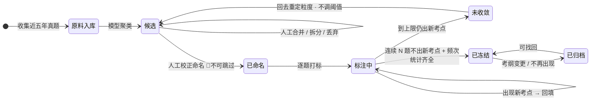

[← 文档索引](../../INDEX.md) ｜ [脑图](../产品模块脑图.md) ｜ [模块地图](../INDEX.md)

# 模块 A · 骨架层

> **这份文档回答一件事：被减数是怎么建起来、怎么维护、怎么退役的。**
> 它是「减法」左端的全部内容 —— `盲区 = 骨架层 − 行为层`（定义在 [`后端系统设计与组件接入`](../../technical/后端系统设计与组件接入.md) §1.4，本文不改）。
>
> **不是**原料从哪来（在 [`数据线 · 骨架原料的获取与隔离`](../../data/INDEX.md) / [`基础数据 · 抓取范围与渠道`](../../data/基础数据-抓取范围与渠道.md)）、
> **不是**表结构与接口（在 [`技术架构与接口契约`](../../technical/INDEX.md) §5.2 §6.4）、**不是**排期（在 [`阶段 0 至阶段 2 · 详细排期`](../../execution/阶段0至阶段 2详细排期.md) §四）、**不是**界面稿（在设计侧）。
> 本文写到「状态 + 转移条件 + 失败落点」为止，**不定字段、不定接口、不定任何数字**。冲突时一律以被引文档为准。
> **2026-08-31：正文里原本复述过的阈值、题量与接口签名已全部换成指针**（`文档规范与目录` §3.1 那条「不复述」的补齐，裁定人 chenyj）。
>
> **基线：`origin/v1` @ `3253cb0`，fetch 于 2026-08-30T15:30Z。**
> **状态：活跃。** 冷启动四步中任一步的形态变化、或 `R-12`/`R-13` 任一命中，本文同一次改动内更新。
>
> **屏幕级规格在 [`看盲区`](../specs/看盲区.md)** —— 那一份写到可以直接做 UI 与前后端开发,本文只写产品判断。
>
> **本文对阶段 0 的贡献是零。** 骨架层整个服务阶段 1，而阶段 0 还没过。

---

## 一、在减法的哪一端

**被减数，而且是唯一的被减数。** 骨架层错了，右边收得再全，差出来的也是错的。

这决定了本模块的所有取舍都倒向**慢而准**：宁可少一个考点，不可多一个错的 —— 与右端 C 打标层的「宁可丢弃率高，不可准确率低」是同一条纪律的两端。

---

## 二、详细产品逻辑

### 2.1 一个考点节点的四个状态

节点不是「建好就在那儿」，它有生命周期。**四个状态、三次转移，每次转移都是人的动作，没有一次是自动的。**

| 状态 | 含义 | 进入条件 | 谁触发 |
|---|---|---|---|
| **候选** | 模型聚类题干后吐出的一组簇 | 聚类跑完 | 机器 |
| **已命名** | 人工校正过分类与命名 | 人逐簇改名、合并、拆分、丢弃 | **人** 🔴 |
| **已冻结** | 进入考点全集，开始计入分母 | 种子标注收敛 + 频次四统计齐全 | **人** |
| **已归档** | 退役，同时退出分子与分母 | 考纲变更 / 该考点不再出现 | **人** |

🔴 **「候选 → 已命名」这一步永远不能省。** 直接采用模型给的命名，等于让模型生成标签文本 —— 那是 `R-07` 的正面违反，也会把机构的既有措辞原样搬进来（`实施路径` §1.2「不沿用任何机构的既有体系与措辞」）。**这一步是本模块存在的理由**，不是效率损耗。

**「已归档」不是删除。** 归档节点必须永远可找回、归档计数必须常驻可见（`R-49`）—— 理由在 §五。

### 2.2 冷启动：四步，第二步是全模块最重的一块

顺序取自 `实施路径` §1.2，本文不改：

| 步 | 动作 | 产出 | 失败落点 |
|---|---|---|---|
| 1 | 收集近五年公开真题 | 离线原料 | 渠道不可用 → 换渠道，见 `基础数据 · 抓取范围与渠道` 白名单 |
| 2 | 模型初步聚类 → **人工校正分类命名** | 候选 → 已命名 | 工作量失控 → **这本身就是信息**，说明规模化到多模块不可行（`实施路径` §1.2 原话） |
| 3 | 逐题打考点标签 | 每题挂 code | — |
| 4 | 汇总频次统计 | 频次统计齐全（**具体是哪几项在 `技术架构与接口契约` §6.4，本文不复述**） | 缺任一项 → 不冻结，`E` 出口层的 Top N 排序就没有依据 |

### 2.3 收敛判据与它的失败落点

**种子标注做到「连续 N 题不出现新考点」为止** —— **N 与预计题量在 `阶段 0 至阶段 2 · 详细排期` §C1，本文不复述**。

**不收敛怎么办 —— 这一条必须先写好，因为它发生时人一定在疲劳状态：**

标到 `阶段 0 至阶段 2 · 详细排期` §C1 给的上限仍在出新考点 → **不是继续标，是粒度定错了**（`R-13`）。动作是回到第 2 步重定粒度，**不是把那个 N 往下调**。这是 `实施路径` 那条纪律在本模块的实例：**判据 pass/fail，不是可调目标。**

### 2.4 三层树与分母

`模块 → 题型 → 考点`，**分母只数最底那一层**（层级定义在 `技术架构与接口契约` §6.4）。中间两层是导航，不是被减数本身 —— 把题型也计进分母，覆盖度会凭空变好看。

### 2.5 一条边界：只做一个模块、一个科目

**两套骨架同时冷启动，对一个人是灾难**（`实施路径` §1.1）。判据是可查的、不是感觉：**有没有为第二个科目做过「人工校正命名」**（`数据线 · 骨架原料的获取与隔离` §六 / `R-12`）—— 做了就是在做第二个模块，不是在积累原料。

---

## 三、简要交互示意

**先说一件容易搞错的事：本模块没有终端用户界面。** 它的「交互」全部发生在维护者一侧 —— 一个离线标注工作台。用户在产品里看到的只有它的**结果**（考点树），看不到它的过程。

**用户侧只有一个界面动作与本模块相关**：在 D 差集层看到的考点树里，**归档节点必须能被翻到**（归档区永远可见可找回，`R-49`）。除此之外用户不接触骨架层。

---

## 四、前端行为意图 × 后端契约意图

| 子模块 | 前端行为意图 | 后端契约意图 | 真源 |
|---|---|---|---|
| 考点树读取 | 单模块整棵树一次返回，**前端不做懒加载** | 一次返回整棵树并带覆盖度（**签名在真源，本文不复述**） | `技术架构与接口契约` §6.4 |
| 考点详情 | 展示频次统计 + 我的触达次数 / 最近触达 / 来源集合 | 🔴 **响应里没有讲解字段** | `技术架构与接口契约` §6.4 · `R-05` |
| 归档节点 | 归档区常驻可见、可找回；归档计数在状态栏 | 归档节点同时退出分子与分母 | `后端系统设计与组件接入` §1.4 · `R-49` |
| 冷启动工作台 | **空** —— 离线工具，形态未定 | **空** —— 不上线，无接口 | 本文 §六 登记 |

**「空」是真的空，不是没写。** 冷启动工作台今天是人拿现成工具在离线区做的事，产品侧还没有把它定成一个东西。放在这里是为了它可数。

---

## 五、这个模块碰到的边界

| 边界 | 落在本模块上是什么形态 | 真源 |
|---|---|---|
| 🔴 **不生成标签文本** | 「候选 → 已命名」必须过人手。模型的命名一律当草稿，不当结果 | `R-07` |
| 🔴 **不存题干与机构内容** | 真题原文只在离线区，**线上库没有能装下题干的字段**。考点标签自行命名，不沿用机构体系与措辞 | `数据线 · 骨架原料的获取与隔离` §二 · `R-01` `R-06` |
| ⛔ **不判断对不对** | 考点详情里没有讲解、没有难度分、没有推荐 | `R-05` |
| **归档不做成开关** | 归档是**唯一一个不用真学就能让覆盖率上升的操作** —— 把空白全归档，覆盖率立刻变满。所以归档计数常驻、导出带完整归档清单，三条都不做成可关闭项 | `R-49` |
| **只做一个科目** | 判据是「有没有为第二个科目做过人工校正命名」 | `数据线 · 骨架原料的获取与隔离` §六 · `R-12` |

---

## 六、服务哪个阶段 · 缺口登记

**服务阶段 1。** `总路线图 · 脑图与父子待办` 编号 `1.2.1`–`1.2.3` `1.2.7`；归档一条挂 `R-49`。

阶段 1 的判据（`实施路径` §阶段1的验收）：**差集结果符合你的自我认知，误判可接受**。频繁把学过的判成「未触达」→ 打标准确率或采集完整度不够 → 回阶段 0 重想。**本模块是那个判据成立的前提，但它自己不产生判据数据。**

**它在减法里的位置决定了它对北极星的贡献是间接的，链路只有一条：**
骨架层维护好被减数 → 差集算出来的盲区清单才是准的 → 清单准了，「点进盲区清单」这个动作（🌟 北极星）才有意义。
🔴 **链路上任何一环断了，多点一次都不算数** —— 一份不准的清单被点开，比没被点开更糟：
它会让人不再信后面每一份清单，而信任一旦掉了，北极星就再也涨不回来。

### 缺口

| # | 缺什么 | 形状 | 谁定 |
|---|---|---|---|
| A-1 | **冷启动工作台的产品形态未定** | 前端无、后端无、流程有 —— 与 `产品模块地图与产品逻辑` §七 那三个缺口形状不同：那三个是「前端有行为、后端无契约」，这个是两边都空 | 产品（我）；但**阶段 1 之前不该定** —— 现在定它就是 `思考模式与选择框架` §盲区二 |
| A-2 | **频次统计的更新周期未定** | 真题每年新增，统计什么时候重算、重算后覆盖度怎么变，全文档集无处定义 | 产品 + 技术；**登记，不裁定** |

**两条都不在本轮解。** 按 `实施路径`/`总路线图 · 脑图与父子待办` 只详化到下一个阶段的纪律，阶段 0 未过之前展开它们，就是在把注意力从那两个每日数字上挪走。
