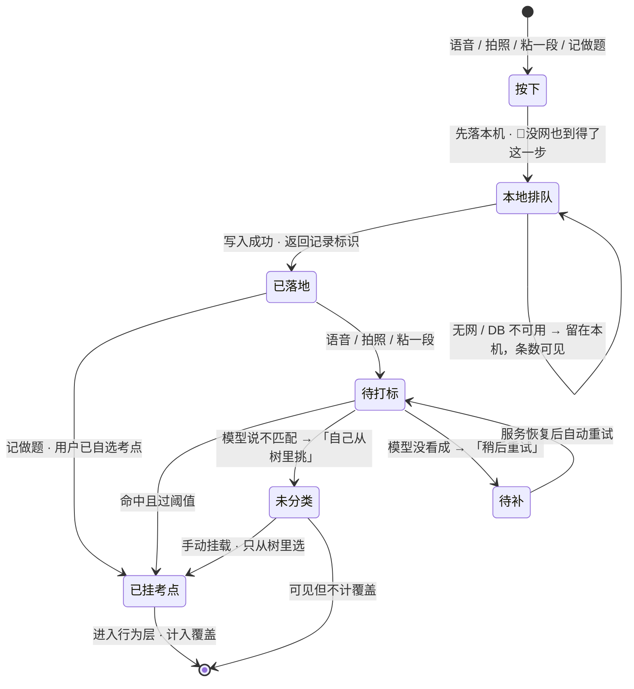
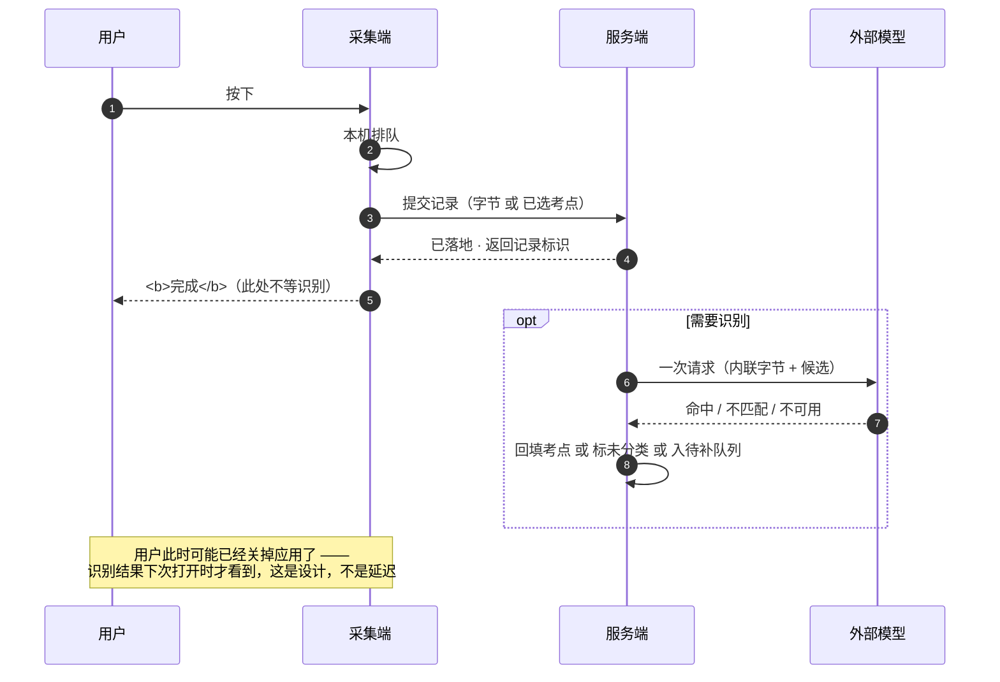

[← 文档索引](../../INDEX.md) ｜ [脑图](../产品模块脑图.md) ｜ [模块地图](../INDEX.md)

# 模块 B · 采集层

> **这份文档回答一件事：用户按下之后到底发生了什么，以及在哪几种情况下这条记录仍然存在。**
> 它是「减法」右端的入口 —— 减数收不全，差出来的盲区就是假的。
>
> **不是**接口签名（在 [`技术架构与接口契约`](../../technical/INDEX.md) §6.2）、**不是**后端时序（在 [`后端系统设计与组件接入`](../../technical/后端系统设计与组件接入.md) §1.2）、
> **不是**原图存储的判据与存储层切法（在 [`原图存储：判据层与存储层`](../../technical/原图存储-判据层与存储层.md)）、**不是**界面稿（在设计侧）。
> 本文写到「状态 + 转移条件 + 失败落点」为止，**不定字段、不定接口、不定任何数字**。冲突时一律以被引文档为准。
> **2026-08-31：正文里原本复述过的上限数字、字段名与类型名已全部换成指针**（`文档规范与目录` §3.1 那条「不复述」的补齐，裁定人 chenyj）。
>
> **基线：`origin/v1` @ `3253cb0`，fetch 于 2026-08-30T15:30Z。**
> **状态：活跃。** 入口增删、或「记录动作永不失败」的任一失败落点变化，本文同一次改动内更新。
>
> ⚠️ **这是九个模块里唯一整个服务阶段 0 的模块。** 阶段 0 的判据就是自己用两周、每天记两个数
> （`实施路径` §阶段0 / `总路线图 · 脑图与父子待办` `1.1.4`）—— **那两个数量的是本模块的摩擦**。
> 但把本文写好本身仍然不产生那两个数：**写文档不等于记录了一天。**

---

## 一、在减法的哪一端

**减数的入口。** 整个产品对用户的要求只有一件事：**碰过就记一笔**。这一笔越难记，减数越不全，盲区越假。

所以本模块唯一的设计目标是**降低摩擦**，不是丰富功能。任何让「按下」这个动作多一步的提案，先问它换回了什么。

---

## 二、详细产品逻辑

### 2.1 一条记录的六个状态

| 状态 | 含义 | 用户看得见吗 |
|---|---|---|
| **本地排队** | 已在本机，尚未提交 | 是 —— 队列条数可见 |
| **已落地** | 服务端已写入那条记录并返回它的标识 | 是 —— **到这里用户的动作就完成了** |
| **待打标** | 需要识别，已提交给 C 打标层 | 弱提示，不阻塞 |
| ↳ | ⚠️ **「记做题」这一入口不经过这个状态**，「已落地」之后直接「已挂考点」（§2.2） | — |
| **已挂考点** | 挂上了考点节点，进入行为层 | 是 |
| **未分类** | 识别过但没认出来，**不计覆盖** | 是 —— 可手动挂 |
| **待补** | 识别服务不可用，等重试 | 是 —— 与「未分类」是**两句不同的话** |

🔴 **「已落地」发生在任何模型调用之前。** 这是本模块的命门（`后端系统设计与组件接入` §1.1）：识别、转写、打标全部在写入之后。断网、模型超时、密钥没配、额度用尽 —— 任何一种都不会让「按下记一笔」失败。

**反过来说：任何把识别放到写入之前的重构，都是在拆掉这条线**，不管它看起来多顺。

### 2.2 四个入口，收敛成一次写入

| 入口 | 用户动作 | 上限 | 走不走打标 |
|---|---|---|---|
| **语音记** | 说一句 | 有时长上限（`总路线图 · 脑图与父子待办` `1.1.1.4`） | 走 |
| **拍照记** | 连拍合并（`总路线图 · 脑图与父子待办` `1.1.2.3`） | 单次有张数上限 | 走 |
| **粘一段** | 粘贴文本 | — | 走 |
| **记做题** | 自己从树里选考点 | — | **不走** —— 考点已经是选出来的，直接进覆盖层 |

**四个入口在后端收敛成同一次写入**（`后端系统设计与组件接入` §1.2）。前端有四个按钮，后端只有一条路 —— 入口增减不改变写入契约。

**「记做题」是唯一一条不依赖模型的完整路径。** 它的存在不是补充，是保底：模型全挂的时候，产品仍然可用。

### 2.3 落地那一刻记了什么 —— 以及结构上不可能记什么

| 记了 | 没记，而且没有位置可记 |
|---|---|
| 时间戳 | 🔴 转写文本 |
| 来源名称（机构名、书名） | 🔴 题干 / 选项 / 答案 / 解析 |
| 形式（语音/拍照/粘贴/做题） | 🔴 任何指向已上传文件的引用 |

🔴 **右边这一列不是「不填」，是那条记录里没有这样的字段**（`后端系统设计与组件接入` §1.2）。「先把原图传到某处，再传个引用过来」这条路在签名层面就不存在（`R-04`）；「不碰内容」靠的是没有位置，不是靠自觉（`R-01` / `R-06`）。

### 2.4 离线队列是采集端的，不是服务端的

无网时本地排队，**队列条数必须可见** —— 用户要能看出「我记的东西还在」。恢复后按客户端幂等键补传，**单批有条数上限**（`技术架构与接口契约` §6.2）。

⚠️ **图片不走批量补传**，逐条走单图路径：base64 内联下，一整批带图会把单次请求体推到没法接受的量级（`技术架构与接口契约` §6.2）。这不是性能优化，是内联这条红线的连带后果 —— **红线选了内联，就得接受它的形状。**

### 2.5 原图：留存与到期归档

| 规则 | 形态 |
|---|---|
| 🔴 服务端不落盘 | base64 内联一次即弃，不进对象存储、不打进任何级别的日志 |
| 🔴 不上云 不同步 不共享 | **不提供任何分享入口或外链** —— 没有入口就没有绕过入口的问题 |
| 到期**转归档**，不是删除 | 整层不存在任何自动删除路径（`R-106` 修复后） |

⚠️ **同意点的文案与实现已经对不上**：界面三处仍写「N 小时后自动删除」，而实现是转归档（`R-107`）。**这是产品要改的文案，不是技术要改的实现** —— 登记在 §六。

### 2.6 降级：方向是「少功能」，不是「少记录」

| 哪一环挂了 | 记录怎么样 | 用户看到什么 |
|---|---|---|
| ASR / 视觉模型 | **照落地**，进待补队列 | 少了自动打标，可手动挂考点 |
| 网络整体不可用 | **本地队列**，覆盖率按已落地记录算，导出照常 | 队列条数 |
| **数据库不可用** | **这是唯一会让写入失败的一环** | 「请稍后重试」—— **但本地那条还在，不得丢弃** |

**一个记录工具只要失败过一次，用户就不再信它，后面所有的差集都失去意义**（`后端系统设计与组件接入` §1.5 原话）。

---

## 三、简要交互示意

**图里有一条线不能动：`本地排队 → 已落地` 之后，用户的动作就完成了。** 后面三条分支怎么走，都不影响这条记录存在。

跨前后端只有一处值得单独看 —— **落地与识别是两次独立的往返**，不是一次请求的两个阶段：

---

## 四、前端行为意图 × 后端契约意图

| 子模块 | 前端行为意图 | 后端契约意图 | 真源 |
|---|---|---|---|
| 四入口 | **按下即完成，不等识别结果**；状态可见 | 一次写入返回标识；请求体里**没有**指向已上传文件的引用 | `技术架构与接口契约` §6.2 · `后端系统设计与组件接入` §1.2 |
| 离线队列 | 无网时本地排队，**队列条数可见** | 按客户端幂等键去重，批量补传有条数上限；**图片不走批量** | `技术架构与接口契约` §6.2 |
| 原图 | 本机留存，到期转归档；**不提供任何分享入口** | 内联一次即弃，服务端全程不落盘；库里只有一个枚举值 | `技术架构与接口契约` §八 🔴 · `原图存储：判据层与存储层` |
| 记做题 | 从树里选，**不能新建标签** | 只收节点 id，不收标签文本 | `技术架构与接口契约` §6.3 🔴 `R-07` |
| 删记录 | 删除要能撤销或二次确认（**形态未定**） | 级联删标签，触发覆盖层重算 | `技术架构与接口契约` §6.2 |
| 同意点文案 | ⚠️ **现文案「N 小时后自动删除」与实现不符** | 实现是转归档，无自动删除路径 | `R-107` · §六 |

---

## 五、这个模块碰到的边界

| 边界 | 落在本模块上是什么形态 | 真源 |
|---|---|---|
| 🔴 **不存题干与机构内容** | 那条记录上没有能装转写文本或题干的字段；只记来源名称与时间 | `R-01` `R-06` · `后端系统设计与组件接入` §1.2 |
| 🔴 **原图不上云不共享** | 内联一次即弃；到期转归档；**无分享入口** | `R-04` `R-52` · `原图存储：判据层与存储层` |
| 🔴 **不生成标签文本** | 「记做题」与手动挂载都只收节点 id | `R-07` |
| ⛔ **不判断对不对** | 记完不给反馈、不评分、不提示「这题你上次也错了」 | `R-05` |
| ⛔ **不做打卡 / 连续天数** | 采集是产品要的动作，**但奖励打开次数就是换掉指标** | `技术架构与接口契约` §十 |

---

## 六、服务哪个阶段 · 缺口登记

**服务阶段 0。** `总路线图 · 脑图与父子待办` 编号 `1.1.1` `1.1.2`；离线队列 `1.1.2b`；原图 `1.1.3` 🔴`R-04`；「记录动作永不失败」`1.3.7.1`（阶段 0 起全程）。

**阶段 0 的判据全部落在本模块上**：自己用两周，每天记两个数（`1.1.4`）。**那张表现在是空的** —— 这是全项目当前唯一有效的工作面。

### 缺口

| # | 缺什么 | 形状 | 谁定 |
|---|---|---|---|
| B-1 | **同意点文案与实现不符** ⚠️ | 界面三处写「N 小时后自动删除」，实现是转归档。`R-107` 已登记 | **产品（我）** —— 文案是产品的事。**这一条我认领，但它是独立改动，不在本轮** |
| B-2 | **删记录的撤销形态未定** | 前端有动作、后端有契约，**中间那一格（能不能撤销、撤销窗口多长）没人定过** | 产品；阶段 0 期间可以先不定 —— 自用阶段误删可以直接改库 |

**B-1 比 B-2 要紧。** 理由不是它更难，是它现在正在对用户说一句不成立的话；而 B-2 只是没定。
