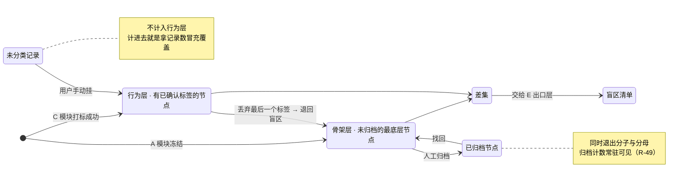

[← 文档索引](../../INDEX.md) ｜ [脑图](../产品模块脑图.md) ｜ [模块地图](../INDEX.md)

# 模块 D · 差集层

> **这份文档回答一件事：减法本身怎么做，以及有哪几种做法会让结果好看但失真。**
> `盲区 = 骨架层 − 行为层`（定义在 [`后端系统设计与组件接入`](../../technical/后端系统设计与组件接入.md) §1.4，本文不改）。
> **整个产品只有这一个产出**，所以本模块的每一条规则都是在防止它被做假。
>
> **不是**SQL 与字段（在 [`技术架构与接口契约`](../../technical/INDEX.md) §5.4 §6.4）、**不是**界面稿（在设计侧）。
> 本文写到「状态 + 转移条件 + 失败落点」为止，**不定字段、不定接口、不定任何数字**。冲突时一律以被引文档为准。
> **2026-08-31：正文里原本复述过的层级名、字段名与那个 44% 已全部换成指针**（`文档规范与目录` §3.1 那条「不复述」的补齐，裁定人 chenyj）。
>
> **基线：`origin/v1` @ `3253cb0`，fetch 于 2026-08-30T15:30Z。**
> **状态：活跃。** 三条计算规则任一变化、或反向断言被定义，本文同一次改动内更新。
>
> **屏幕级规格在 [`看盲区`](../specs/看盲区.md)** —— 那一份写到可以直接做 UI 与前后端开发,本文只写产品判断。
>
> **本文对阶段 0 的贡献是零。** 本模块主体服务阶段 1。

---

## 一、在减法的哪一端

**就是减法本身。** 左边 A 骨架层给被减数，右边 B→C 给减数，本模块做那一次减，然后把差值交给 E 出口层。

**它不产生新信息，它只保证那次减是诚实的。**

---

## 二、详细产品逻辑

### 2.1 两个集合，一次减

| | 是什么 | 谁维护 |
|---|---|---|
| **骨架层**（被减数） | 考点树里**未归档**的最底层节点集合（层级定义在 `技术架构与接口契约` §6.4） | A 模块 |
| **行为层**（减数） | 有 ≥1 条**已确认标签**的节点集合 | B→C 模块 |
| **盲区** | 骨架层 − 行为层 | 本模块 |
| **覆盖度** | 行为层 ÷ 骨架层 | 本模块 |

### 2.2 三条计算规则，每条都在挡一种做假

| 规则 | 挡的是什么 | 风险号 |
|---|---|---|
| **未分类记录不计入行为层** | 记了但没认出来 ≠ 碰过这个考点。计进去就是**拿「记录数」冒充「覆盖」** | `R-05` 的延伸 |
| **已归档节点同时退出分子与分母** | 比值仍然诚实。**只退分母会凭空涨，只退分子会凭空跌** | — |
| **归档数必须常驻可见** | 归档是**唯一一个不用真学就能让覆盖率上升的操作** —— 把空白全归档，覆盖率立刻变满 | `R-49` |

**第三条是这一节里唯一需要产品动作的**（`后端系统设计与组件接入` §1.4 原话）。它落成三件事，**三件都不做成开关**：

1. 归档计数**常驻状态栏**
2. 导出**带完整归档清单**（`R-49`；`技术架构与接口契约` §6.5 原文未提，实现按 `R-49` 走）
3. 归档区**永远可见可找回**

> **为什么不能做成开关：** 一个能关掉的诚实机制，等于没有。关掉它的那一刻不会报错，覆盖率会立刻变好看，
> 而且看起来完全合理 —— 这正是 `R-49` 要防的形状。

### 2.3 断言：正向有，反向没有

| | 语义 | 状态 |
|---|---|---|
| **我已掌握**（正向） | 用户主动声明某个考点不用再看 | 有契约（`技术架构与接口契约` §6.4），阶段 2 |
| **我卡住了**（反向） | 用户主动声明某个考点碰过但没通过 | 🔴 **未定义** —— 见 §六 D-1 |

**反向断言缺席不是漏了一个功能，是差集定义本身的一个已知盲点：**

> **「碰过但没通过」这一类，在 `盲区 = 骨架层 − 行为层` 里现在完全不可见 —— 因为碰过就算覆盖。**

一个用户把某个考点做了五遍、五遍都错，在当前定义下他的覆盖度和做对一遍的人**完全一样**。

⚠️ **这不是要现在做。** `总路线图 · 脑图与父子待办` `1.4.5` 把它挂在「阶段 3+，只列节点不排期」；现在动它就是 `R-85` 的又一个实例。**登记的理由只有一条：它是定义的盲点，不是功能待办。**

### 2.4 覆盖度这个数会在什么时候动

| 动作 | 分子 | 分母 | 结果 |
|---|---|---|---|
| 记一笔并成功打标（新考点） | +1 | — | ↑ |
| 记一笔但未分类 | — | — | **不动** |
| 手动挂一个未分类记录 | +1 | — | ↑ |
| 丢弃一个自动标签 | −1（若该节点无其他标签） | — | ↓ |
| 归档一个节点 | −1 或 0 | −1 | **可能任意方向** |
| 骨架新增节点 | — | +1 | ↓ |

**最后两行是这张表存在的理由**：覆盖度下降经常不是退步，而是被减数变大了。**产品不解释这件事，用户就会把它读成退步** —— 呈现形态在设计侧，但「必须让它可解释」是产品要求。

---

## 三、简要交互示意

**界面上与本模块相关的只有三处，一处都不能省：**

| 界面 | 必须有 | 理由 |
|---|---|---|
| 覆盖度呈现 | 数字本身 + **归档计数常驻** | `R-49` |
| 考点树 | 已触达 / 未触达 / 已归档 三态可分 | 盲区要能被点进去（E 模块的入口） |
| 归档区 | **永远可见可找回** | 归档不是删除 |

**不做的三处**：正确率、得分、排名 —— 这三个数在本模块的数据里根本算不出来，**因为产品从没记过对错**。这不是没做，是没有原料。

---

## 四、前端行为意图 × 后端契约意图

| 子模块 | 前端行为意图 | 后端契约意图 | 真源 |
|---|---|---|---|
| 覆盖概览 | 数字 + 归档计数常驻可见 | 分母 = 未归档的最底层节点数；分子 = 已确认标签的节点数；**断言单列不并入** | `技术架构与接口契约` §6.4 · `R-49` |
| 考点树 | 三态可分；归档区可找回 | 单模块整棵树一次返回 | `技术架构与接口契约` §6.4 |
| 正向断言 | 「我已掌握」**独立于覆盖度呈现**，不混进那个数 | 只收节点 id | `技术架构与接口契约` §6.4 |
| **反向断言** | 「我卡住了」—— 界面意图已登记 | **空** | **缺口 D-1** |
| 覆盖度变化的可解释性 | 下降时要能看出是「被减数变大」还是「减数变小」 | **空** —— 没有任何接口返回这个区分 | **缺口 D-2** |

---

## 五、这个模块碰到的边界

| 边界 | 落在本模块上是什么形态 | 真源 |
|---|---|---|
| 🔴 **永不判断对不对** | 覆盖度只回答「有没有、几次、多久前」。**正确率算不出来，因为没记过对错** | `项目现状与决策记录` §2.2 · `R-05` |
| ⛔ **不出现排名** | 不与他人比较，不给分位。北极星是**主动查看盲区的人数**，不是排名带来的打开次数 | `技术架构与接口契约` §十 |
| ⛔ **不做学习建议 / 复习提醒** | 产品只把差值摆出来，怎么补是用户和他自己接的模型的事 | `项目现状与决策记录` §2.2 |
| **归档三件事不做成开关** | 常驻计数 / 导出带清单 / 归档区可找回 | `R-49` |
| **宁可丢弃率高** | 未分类不计入行为层，即使这让覆盖度显得低 | `后端系统设计与组件接入` §1.3 |

---

## 六、服务哪个阶段 · 缺口登记

**服务阶段 1**（`总路线图 · 脑图与父子待办` `1.2.8`）。正向断言阶段 2（`技术架构与接口契约` §6.4）。反向断言**阶段 2 之后 · 未排期**（`总路线图 · 脑图与父子待办` `1.4.5`）。

阶段 1 的判据 —— **差集结果符合你的自我认知，误判可接受**（`实施路径` §阶段1的验收）—— 直接落在本模块的输出上。**但判据由人判，pass/fail，不是可调目标**：数据卡在临界线上时不要微调计算规则再试一轮。

### 缺口

| # | 缺什么 | 形状 | 谁定 |
|---|---|---|---|
| **D-1** | **「我卡住了」反向断言无契约** 🔴 | 前端有行为意图（已登记），后端契约里**没有对应的位置**。`总路线图 · 脑图与父子待办` `1.4.5` 已登记 | **契约由技术同事定，不是产品补**。⚠️ 但**现在不该做** —— 挂在阶段 3+，动它就是 `R-85` 的实例。登记的理由是它是**定义的盲点** |
| **D-2** | **覆盖度下降的成因不可解释** | 分母变大与分子变小在界面上长得一样，用户会一律读成退步 | 产品（我）+ 技术。**登记，不裁定** —— 阶段 1 之前不必定 |

**D-1 与 `产品模块地图与产品逻辑` §七-② 是同一条**，本文是它的展开，不是第二处登记。
