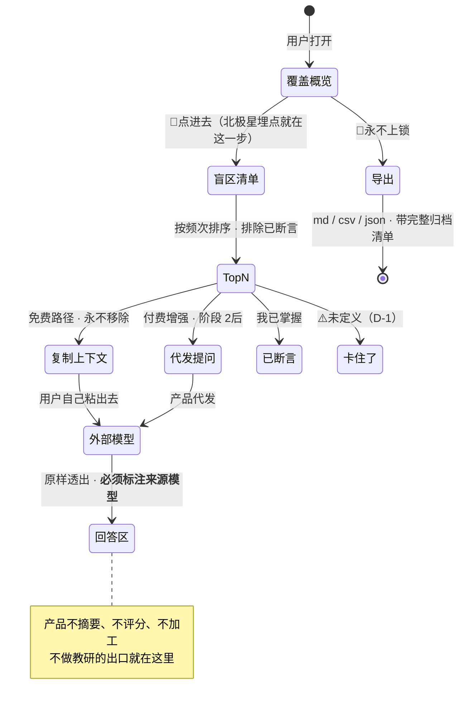
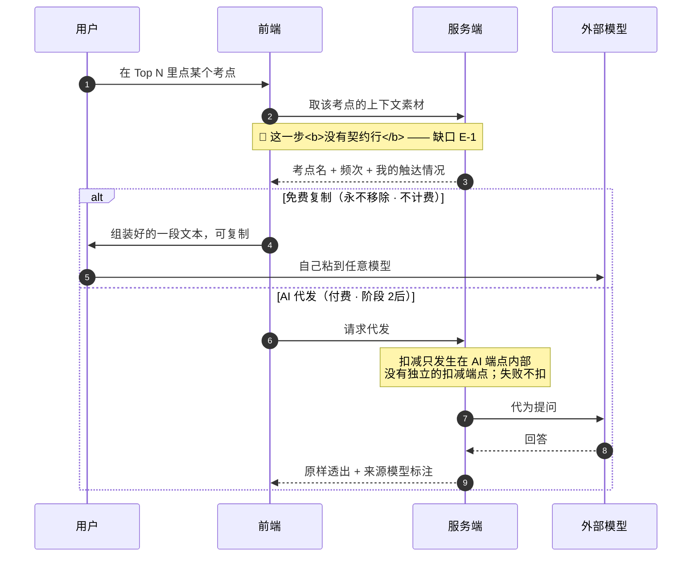

[← 文档索引](../../INDEX.md) ｜ [脑图](../产品模块脑图.md) ｜ [模块地图](../INDEX.md)

# 模块 E · 出口层

> **这份文档回答一件事：差值算出来之后，用什么形态交到用户手上。**
> **北极星指标的落点就在本模块** —— 「主动查看盲区的人数」量的是盲区清单被点进去的次数，
> 不是注册数、不是日活、不是使用时长。**本模块是整个产品唯一被那个数直接量到的地方。**
>
> **不是**接口签名（在 [`技术架构与接口契约`](../../technical/INDEX.md) §6.4 §6.5）、**不是**额度与计费规则（在 [`商业化与额度设计`](../商业化与额度设计.md)）、
> **不是**界面稿（在设计侧）。本文写到「状态 + 转移条件 + 失败落点」为止，**不定字段、不定接口、不定价格**。
> 冲突时一律以被引文档为准。
> **2026-08-31：正文里原本复述过的查询参数、道数、成数与那个 44% 已全部换成指针**（`文档规范与目录` §3.1 那条「不复述」的补齐，裁定人 chenyj）。
>
> **基线：`origin/v1` @ `3253cb0`，fetch 于 2026-08-30T15:30Z。**
> **状态：活跃。** 出口增删、或 §六 的契约缺口被补上，本文同一次改动内更新。
>
> **本文对阶段 0 的贡献是零。** 但它是**阶段 2 第二个判据**的唯一落点，见 §六。

---

## 一、在减法的哪一端

**出口 —— 把差值送出去的那一端。** 左边两端算得再准，如果差值没有一个让人愿意点开的形态，这个产品的唯一产出就没有出口。

---

## 二、详细产品逻辑

### 2.1 六个出口，一个是北极星，两个是红线

| 出口 | 形态 | 阶段 | 性质 |
|---|---|---|---|
| **盲区清单** | 哪些考点一次都没碰过 | 1 | 🌟 **北极星落点** |
| **先补这几个 · Top N** | 按频次排序，排除已断言节点 | 1 | 北极星的排序层 |
| **问 AI · 免费复制** | 组装上下文，用户自己粘出去 | **未定**（见 §六 E-1） | ⚠️ **契约缺口** · 🔴 永不移除 |
| **问 AI · AI 代发** | 产品代发并原样透出回答 | 阶段 2 后（`产品模块地图与产品逻辑` §三） | ⚠️ **契约缺口** · 付费增强 |
| **导出 md / csv / json** | 全量、无删减 | 2 | 🔴 **永不上锁** |
| **MCP / CLI · 只读** | 一组只读 tool（**几个在 `技术架构与接口契约` §6.5**） | 阶段 2后 | 营销资产，不是收入线 |

### 2.2 北极星落在哪一个具体动作上

**「点进盲区清单」这个动作本身就是北极星，埋点只埋它。**

不是「打开应用」、不是「停留时长」、不是「导出次数」。这三个都能靠别的手段做高，**而且做高了不会让任何一个人多看一次自己的盲区**。

**Top N 的排序依据是频次统计**（口径在 `技术架构与接口契约` §6.4，本文不复述），**排除已断言节点** —— 用户说过「我已掌握」的不再出现在待补里，否则清单会变成一份永远清不完的债，而清不完的清单会让人不再点开它。

### 2.3 「问 AI 时带上的东西」：产品的下一个动作在这里

**用户点进盲区清单之后，产品给他的下一个动作就是这个** —— 把上下文复制出去问模型。

| 路径 | 行为 | 计费 | 契约 |
|---|---|---|---|
| **免费复制** | 组装好上下文，用户自己粘到任意模型 | **永不移除、零边际成本、不计费** | 🔴 **无** |
| **AI 代发** | 产品代为发给模型并把回答原样透出 | 付费增强 | 🔴 **无** |

🔴 **两条路径在 `技术架构与接口契约` §六 的契约表里都没有对应的行**（详见 §六 E-1）。这一条排本模块所有缺口之首，理由不是它难，是**它正接在北极星落点的下游**。

**产品侧已经定死的两条，与契约缺不缺无关：**

1. **免费复制路径永不移除** —— 它是「不做教研」这条边界的出口。把学科判断外包给用户自己接的模型，前提是这条路一直在
2. **回答区必须标注来源模型** —— 产品不为模型说的话背书；不标注就等于产品在讲解

### 2.4 导出：两条不可逆决策之一

| 规则 | 形态 |
|---|---|
| 🔴 **永不上锁** | 无删减、无水印、**不限次数** —— 与「盲区诊断永不上锁」并列，是两条不可逆决策，不是产品偏好（`商业化与额度设计` §二） |
| 内容边界 | 只含**来源名称、时间、考点标签与统计**；🔴 不含机构内容 |
| **必须带完整归档清单** | `R-49`。归档若跟着覆盖度一起藏掉，导出就成了「把空白全归档、覆盖率变满」的同谋 |
| 注销前提示 | 注销响应里**必须带导出入口提示** |

### 2.5 MCP / CLI：开放的是读

多道锁是冗余的（**几道在 `技术架构与接口契约` §6.5**），**冗余是有意的 —— 一道锁失效不该导致整条线失守**。产品侧只需要记住两件事：

1. **只读写进凭证本身**，不是靠每个接口自觉
2. **不存在写入类 tool —— 不是禁用，是不注册**

⚠️ 以及一条纪律：**MCP 投入有精力上限**（`总路线图 · 脑图与父子待办` `1.4.2.2` 给了具体比例，本文不复述）。它是营销资产不是收入来源，**而它恰好是那种做起来很舒服、进展很可量化的东西** —— `思考模式与选择框架` §盲区二 点名的形状。

---

## 三、简要交互示意

**跨前后端只有一处值得单独画，正是缺契约的那一处：**

---

## 四、前端行为意图 × 后端契约意图

| 子模块 | 前端行为意图 | 后端契约意图 | 真源 |
|---|---|---|---|
| 盲区清单 | **点进去这个动作本身就是北极星，埋点只埋它** | 排除已断言节点，按频次排序 | `技术架构与接口契约` §6.4 · `总路线图 · 脑图与父子待办` `1.3.5` |
| Top N | 清单要能清完；已断言的不再出现 | 按频次排序取前 N（**查询参数在真源，本文不复述**） | `技术架构与接口契约` §6.4 |
| **问 AI · 免费复制** | **永不移除**；回答区标注来源模型 | **空** —— 行为写在 `商业化与额度设计` §5.3，端点不存在 | **缺口 E-1** 🔴 |
| **问 AI · 代发** | 付费增强；额度耗尽降级为免费复制，**不阻断** | **空** —— `技术架构与接口契约` §6.7.1 引用了「代发端点」，而 §六 没有它 | **缺口 E-1** 🔴 |
| 导出 | 无删减、无水印、不限次数；注销前主动提示先导出 | 三格式；只含来源名称、时间、考点标签与统计；**带完整归档清单** | `商业化与额度设计` §2.2 🔴 · `R-49` |
| MCP 只读 | 在 Web 界面**手动**签发只读令牌 | 多道锁冗余，只读写进凭证本身 | `技术架构与接口契约` §6.5 |

---

## 五、这个模块碰到的边界

| 边界 | 落在本模块上是什么形态 | 真源 |
|---|---|---|
| 🔴 **不做学科教研** | 模型的回答**原样透出，不摘要、不评分、不加工**；必须标注来源模型。这条边界的物理出口就是本模块 | `商业化与额度设计` §5.2 |
| 🔴 **不判断对不对** | 清单只答「没碰过 / 碰过几次 / 多久前」。不给讲解、不给学习建议、不给复习提醒 | `项目现状与决策记录` §2.2 · `R-05` |
| 🔴 **导出永不上锁** | 不可逆决策，不是产品偏好。**任何「导出限次数」的提案都是在动这一条** | `商业化与额度设计` §二 |
| 🔴 **盲区诊断永不上锁** | 同上。额度耗尽降级为免费复制，**不阻断查看盲区** | `商业化与额度设计` §二 |
| 🔴 **不含机构内容** | 导出内容只有来源名称、时间、考点标签与统计 | `R-06` |
| ⛔ **不做图片分享** | 没有把盲区清单做成分享图的入口 —— 那会把北极星换成传播量 | `产品模块地图与产品逻辑` §六 |
| ⛔ **MCP 投入有精力上限** | 它是营销资产，不是收入线 | `总路线图 · 脑图与父子待办` `1.4.2.2` |

---

## 六、服务哪个阶段 · 缺口登记

**盲区清单与 Top N 服务阶段 1**（`总路线图 · 脑图与父子待办` `1.2.8.4`）。导出阶段 2（`1.3.6` 🔴）。MCP 阶段 2 后（`1.4.2`）。
**「问 AI 时带上的东西」服务哪个阶段说不清** —— 这正是 E-1 的一部分。

⚠️ **阶段 2 的第二个判据落在本模块**：「看到缺口清单后点进去的比例」（`实施路径` §2.2「第二个指标最关键」）。

### 缺口

| # | 缺什么 | 形状 | 谁定 |
|---|---|---|---|
| **E-1** | **「问 AI 时带上的东西」两条路径都没有接口契约** 🔴 | 免费复制路径按 `商业化与额度设计` §5.3 自己的说法「**已经存在，决策层与 `技术架构与接口契约` 都未收录**」；付费代发的行为写在 `商业化与额度设计` §五，`技术架构与接口契约` §6.7.1 甚至引用了「代发端点」的内部扣减时机 —— 而通读 `技术架构与接口契约` §6.1–§6.7 **没有任何一行是这两条路径** | **契约由技术同事定，产品不补** —— 产品补出来的就是第二份契约 |

**为什么 E-1 排第一：它接在北极星落点的正下游。** 用户点进盲区清单（阶段 2 第二个判据量的就是这一步），下一个动作就是把上下文带出去问模型。**这条路径没有契约，等于北极星落点之后的第一步靠记忆传递。**

**需要谁做什么**：技术同事补 `技术架构与接口契约` §六 两行 —— 免费组装一行、付费代发一行 —— 并明确「组装上下文是零边际成本、不计费」（`商业化与额度设计` §三 已给规则）在端点层怎么体现。

**E-1 与 `产品模块地图与产品逻辑` §七-① 是同一条**，本文是它的展开，不是第二处登记。
