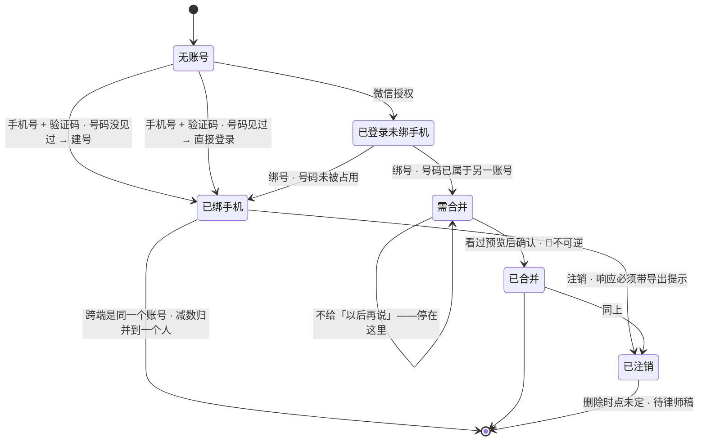
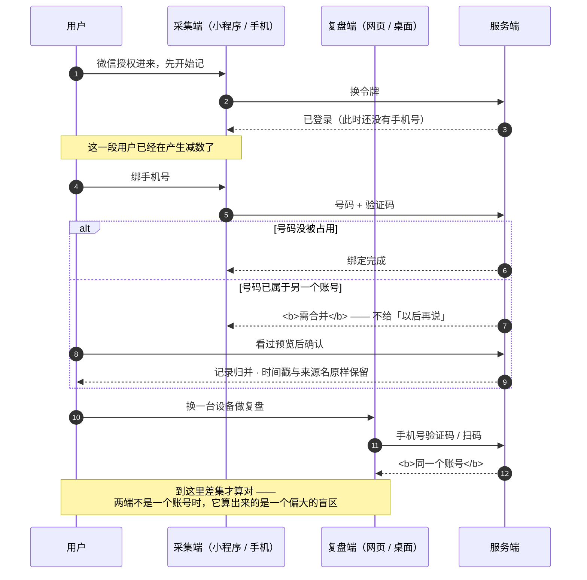

[← 文档索引](../../INDEX.md) ｜ [脑图](../产品模块脑图.md) ｜ [模块地图](../INDEX.md)

# 模块 F · 账号与端

> **这份文档回答一件事：怎么保证「同一个人在不同地方记的东西」被算成同一个人的。**
> 它不在减法的左端也不在右端 —— 它保证的是**减数属于谁**。这一格错了，差集会算大，而算大的差集
> 用户第一眼就能识破：「我明明在 iPad 上听过这节课，为什么这里说我没碰过。」
>
> **不是**后端时序与字段（在 [`后端详设`](../../technical/后端系统设计与组件接入.md) §1.6–§1.10）、**不是**令牌形态与接口签名（在 [`技术架构`](../../technical/INDEX.md) §6.1 §7.4）、
> **不是**端的技术选型（在 [`多端选型`](../../technical/多端选型与端矩阵.md)，已冻结）、**不是**界面稿（在设计侧）。
> 本文写到「状态 + 转移条件 + 失败落点」为止，**不定字段、不定接口、不定任何数字**。冲突时一律以被引文档为准。
>
> **基线：`origin/v1` @ `afab5a7`，fetch 于 2026-08-31T05:20Z。**
> **状态：活跃。** 登录通道增删、合并策略变化、或任一端的关卡归属被人裁定，本文同一次改动内更新。
>
> ⚠️ **本文服务关卡 2，不服务关卡 0。** 写它不产生 `1.1.4` 那两个每日数字，一个都不产生。
> 它现在被写出来的唯一理由见 §六 末尾那一段 —— **理由是纪律一致，不是它变要紧了。**

---

## 一、在减法的哪一端

**支撑。既不是被减数也不是减数，它决定的是「这些记录归谁」。**

产品对用户的承诺是一条减法，而减法的前提是左右两边说的是同一个人。账号与端合起来只做这一件事：

| | 它防的是什么 |
|---|---|
| **账号** | 防**漏记** —— 两端不是一个账号，同一个人的记录被拆成两份，差集偏大 |
| **端** | 防**记不成** —— 用户在哪儿学，采集入口就得在哪儿；够不到的地方等于没有减数 |

**「宁缺毋滥」防的是错标，账号合并防的是漏记 —— 两者威胁的是同一个数**（`后端详设` §1.6 原话）。

---

## 二、详细产品逻辑

### 2.1 一个账号的状态

| 状态 | 怎么进来的 | 用户看得见吗 |
|---|---|---|
| **无账号** | 初次打开 | 是 —— 但界面上**没有「注册」这个词** |
| **已登录 · 未绑手机** | 微信授权进来的 | 弱提示；此时它还不是跨端锚点 |
| **已绑手机** | 验证码通过，号码没被占用 | 是 |
| **需合并** | 验证码通过，但号码已属于另一个账号 | 是 —— **必须当场选一次** |
| **已合并** | 用户选了合并 | 是 —— 记录全部归并，时间戳与来源名原样保留 |
| **已注销** | 用户主动注销 | 是 —— 响应里必须带导出入口提示 |

### 2.2 注册即登录：产品里没有「注册」这个动作

号码没见过就建号、见过就登进去 —— **只有一条路径，没有分叉给用户看**。

**少一个页面是次要的，少一个「我到底注册过没有」的犹豫才是主要的**（`后端详设` §1.7 原话），
而这个犹豫恰好发生在用户离开成本最低的那一秒。

> ⚠️ **一个必须由产品认下的后果：关卡 3 的判据是「累计陌生注册数」，而界面上不存在「注册」。**
> 判据能不能被算出来，取决于「建号」这条分支有没有被单独打点 —— 只统计登录成功次数的话，
> 那个数里混着老用户。**这不是埋点偏好，是关卡判据成不成立的问题**（`后端详设` §1.7）。

### 2.3 账号合并：唯一一处刻意不给退路的地方

撞号的时候**不给「以后再说」这个出口**，用户必须当场选一次。

产品在别处一律降低摩擦，这里反过来，理由只有一条：**「以后再说」的代价不是多一次点击，是从这一刻起
这个人的记录永久分成两份，而他自己不知道。** 等他发现的时候，看到的是一个偏大的差集 ——
**而一次误报足以让他不再相信后面所有的差集。**

合并的形态有两条产品要求，与技术怎么实现无关：

- **合并前给预览，预览只读、无副作用** —— 用户要能先看见「会并进来什么」
- **合并不可逆，所以确认要独立于预览** —— 不可逆动作不能和查看动作共用一个按钮

### 2.4 端：一份产物，N 个壳

端的技术选型已在 `多端选型` 冻结，本文不重复。产品视角只关心两件事：**这个端服务哪个关卡、它是不是采集入口。**

| 端 | 是采集入口吗 | 服务关卡 |
|---|---|---|
| Web / H5 | 是（主形态） | **关卡 2** |
| Pad | 是 —— **但它不是一个端**，是 H5 的一组断点 | 随 H5 |
| 桌面 / iOS / Android | 是 | **无** —— 三端已实测跑通，「无」指**不服务任何关卡**，不是「还没做」（§六 `F-3`：这是过剩不是缺口） |
| 微信小程序 | 是，**只做采集**，复盘在网页 | 关卡 2 后 |

⚠️ **「桌面 / iOS / Android 服务关卡＝无」这一格，是 `模块地图` §3.1 那四个填不出关卡的模块格里，
唯一一个已经有实测产出的。** 三个端都跑起来过，而 `总路线图` 产品轨在关卡 2 之前只要一个 Web/PWA。
**砍不砍是人的裁定，本文只让它可数**（与 `文档规范` §七 同一条）。

### 2.5 退出登录：一条能从背后捅穿「记录永不失败」的路径

离线队列在设备本地。**退出登录会连同本地缓存一起清掉** —— 如果队列里还有没上传的记录，
它们就在用户完全不知情的情况下消失了。

所以「退出这台」在检测到有未上传记录时**先拦一次**，提示先上传。

**这条要单独写下来，是因为它是唯一一条不经过 B 采集层就能毁掉一条记录的路径。**
`后端详设` §1.1「记录动作本身永不失败」防的是采集链路上的失败，防不到这里。

### 2.6 注销：删除时点未定，但提示不能等

注销的响应里**必须带导出入口提示** —— 理由与 `商业化设计` §2.2「导出永不上锁」同一条：
产品承诺过数据可完整带走，那么**最需要带走的那一刻不能不提**。

**「注销之后什么时候真删」是未决项**，属于用户协议不是架构（`后端详设` §1.9 / `技术架构` §6.1，待 `L-A5` 律师稿）。
本文登记在 §六，**不裁定**。

### 2.7 失败落点

| 哪一环出问题 | 落到哪 | 用户看到什么 |
|---|---|---|
| 验证码发不出去 | 停在输入手机号 | 可重试；**频控与滑块管这一层，不由额度管**（`商业化设计` §3.2） |
| 号码已属于另一个账号 | **需合并** —— 不是失败，是一个必须当场答的问题 | 预览 + 一次确认 |
| 微信侧拿不到跨应用标识 | 无法把两个入口认成同一人 | 退回到「用手机号绑一次」——**手机号才是锚点，微信不是** |
| 令牌失效 / 被吊销 | 回到未登录 | 重新登录；**本地未上传的记录不得被清掉**（§2.5） |
| 某个端没做 | 那个端上记不了 | 没有降级路径 —— **端缺失是缺口，不是失败** |

---

## 三、简要交互示意

**图里只有一条线不能动：`需合并` 没有指回「稍后」的箭头。** 它是产品里唯一刻意不给退路的地方（§2.3）。

跨端那一次值得单独看 —— **采集端与复盘端不是同一个界面，但必须是同一个账号**：

---

## 四、前端行为意图 × 后端契约意图

| 子模块 | 前端行为意图 | 后端契约意图 | 真源 |
|---|---|---|---|
| 手机号登录 | 界面上**没有「注册」二字**；一条路径走完 | 号码没见过就建号，见过就登进去；**建号这一步单独打点** | `后端详设` §1.7 |
| 验证码 | 失败给得起重试；不把风控做成用户的错 | 频控与人机校验，**不由额度管** | `后端详设` §1.8 · `商业化设计` §3.2 |
| 微信授权 | 作为快捷入口，**不作为跨端锚点** | 拿不到跨应用标识时退回手机号绑定 | `后端详设` §6.1 §6.3 |
| 账号合并 | 预览只读；确认独立、且说明不可逆；**无「以后再说」** | 预览无副作用；确认需一次性凭证 | `技术架构` §6.1 · `后端详设` §1.6 |
| 退出这台 | 有未上传记录时**先拦一次** | 令牌吊销立即生效 | `后端详设` §1.9 |
| 注销 | 响应里必须带导出入口提示 | **删除时点未定** ⚪ 待律师稿 | `技术架构` §6.1 · §六 F-1 |
| 端矩阵 · Web/H5 | 主形态，复盘在这里 | 无端专属契约 | `多端选型` §3.1 |
| 端矩阵 · 小程序 | **只做采集入口**，不做复盘；不开原图通道 | 同一套契约；**令牌逻辑在小程序里手写一遍**（原生小程序不复用 Web 构建产物，`多端选型` §3.6）—— 它只同步账号身份，**与原图通道无关**：那个端上根本没有原图（`多端选型` §3.6.1） | `多端选型` §3.6 |
| 端矩阵 · 桌面/iOS/Android | **空** —— 三个端已跑通，但**没有一个产品动作是它们独有的** | 同一份产物，壳不改契约 | `多端选型` §一 · §六 F-3 |

---

## 五、这个模块碰到的边界

| 边界 | 落在本模块上是什么形态 | 真源 |
|---|---|---|
| ⛔ **不做积分 / 打卡 / 徽章 / 排名** | 账号页不出现连续天数、等级、成就。**账号是身份，不是成长体系的载体** | `决策记录` §2.2 · `技术架构` §十 |
| 🔴 **数据可完整导出** | 注销流程里必须先给导出入口 —— 承诺兑现的时点就在这一步 | `商业化设计` §2.2 |
| 🔴 **原图不上云不共享** | 换一台设备**不同步原图**；跨端同步的只有记录，不含原图 | `R-04` · `原图存储` |
| ⛔ **不引导至外部支付** | 小程序内的账号与付费入口不得指向站外 | 🔴`R-36` · `商业化设计` §6.2 |
| 🔴 **不碰内容** | 合并归并的是记录本身；来源名与时间原样保留，**没有内容可归并** | `R-01` `R-06` |

---

## 六、服务哪个关卡 · 缺口登记

**服务关卡 2。** `总路线图` 编号 `1.3.1`（账号体系）、`1.3.2`（Web/H5）；微信授权与打通 `1.4.1`（关卡 2 后）；
小程序在 `执行清单` `L-C` 档（关卡 2 后）。**关卡 0 与关卡 1 不需要本模块的任何一格** —— 阶段 0-1 是单人自用、无账号。

### 缺口

| # | 缺什么 | 形状 | 谁定 |
|---|---|---|---|
| F-1 | **注销之后的删除时点未定** ⚪ | 前端已定「响应带导出提示」，后端契约里删除时点是空的。属用户协议不属架构，待 `L-A5` 律师稿 | **不是我** —— 律师 + 人裁定。产品只负责保住「先给导出入口」这一条 |
| F-2 | **退出登录拦截的形态未定** | 「有未上传记录时先拦一次」这条已成立，但**拦成什么样**（强制上传 / 提示可跳过 / 显示条数）没人定过 | 产品。关卡 2 之前不必定 —— 自用阶段不会退出登录 |
| F-3 | **桌面 / iOS / Android 服务关卡为「无」** | 三个端已实测跑通，而 `总路线图` 产品轨到关卡 2 只要一个 Web/PWA。**这不是缺口是过剩**，登记在这里是为了它可数。⚠️ **而且它是 `思考模式` §盲区二 的一个实例，不只是一次排期错位** —— 多做一个端进展可量化、做起来舒服、不需要面对任何一个真实用户，正是那一条点名的形状 | 人裁定。按北极星标尺，关卡 0 没过之前多一个端，**主动查看盲区的人数不动一格** |

### 为什么这一份现在才写，以及为什么现在写它

上一版（`模块地图` §九）拒绝写本文，理由是「它服务关卡 2，`实施路径`/`总路线图` 只详化到下一个关卡」。
**那条理由被一次外部审计判为双标** —— `模块D` / `模块E` 里同样展开了关卡 2 及之后的内容（反向断言、导出、MCP、代发），
同一套纪律只用来挡 F/G，没用来挡 D/E。

**现在统一到一条规则，`模块地图` §九 已改写：**

> **模块文档只把「真源里已经定过的东西」展开成「状态 + 转移条件 + 失败落点」，不论它服务哪个关卡；
> 它不排期、不新定义任何东西。** 展开一件已经定死的事不会让它提前发生 ——
> **会让它提前发生的是排期，而排期不在本文，在 `执行清单` / `详细排期` / `总路线图`。**

**这条规则不放宽 `思考模式` §盲区二。** 它挡的仍然是同一件事：本文没有为任何一格提前排期，
也没有定义一个 `后端详设` / `多端选型` / `技术架构` 里不存在的东西。**而它服务的关卡仍然是 2，这句话不会因为写了一份文档而改变。**
