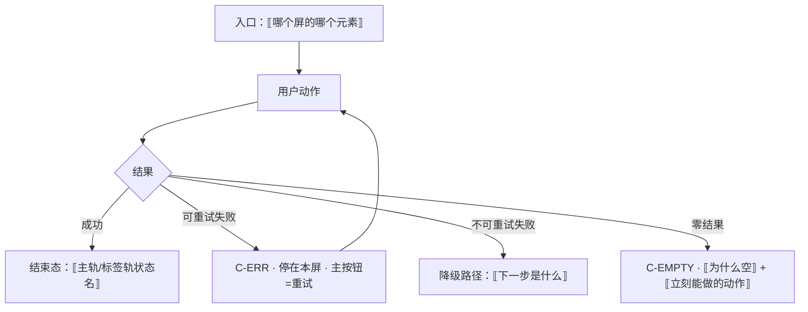

# 线框与交互规格约定

> **基线**：`origin/v1` @ `73041df`，fetch 于 2026-09-02。
> **状态：活跃。** 记号表、必答五项、红线自查清单任一项变化，本文同一次改动内更新。
>
> **上一层**：[模块地图](INDEX.md)
> **它是什么**：51 份能力单元新增的两节（`线框` / `交互规格`）**共享的写法约定**。
> 它不定任何产品口径，只定「这两节长什么样」。**口径一律向真源要。**

---

## 一、为什么先有这一份

上一波九个 agent 并行写模块树，是先把状态名定死才放出去的 —— 否则会写出九套词汇。
线框同理，而且更容易分叉：**一个人用方框、一个人用表格、一个人贴组件名，三份文档就没法互相 review。**

这一份是同一件事在界面层的落点。它只解决三个问题：

1. **记号统一** —— 线框用同一套字符，跨域能对着读
2. **必答项统一** —— 交互规格答不全的那几项，正是最后落到前端时会被临时发明的那几项
3. **不产生第二处文案** —— 线框里出现界面原文，就是在 `specs/` 之外开第二处说法

---

## 二、一条裁定：线框里不写界面原文，写槽位 + 指针

`模块地图` §七 已经写死：**能力单元文档里出现用户看到的原样文案 = 越界**（那在 `specs/`）。
线框天然要摆文字，两条规矩正面撞上。**裁定：线框摆的是槽位，不是文案。**

| 写法 | 例 | 判据 |
|---|---|---|
| ✅ 槽位记号 | `⟦计数·今天记了 {n} 条⟧` | 说清这一格**装什么**，不说它**逐字长什么样** |
| ✅ 槽位 + 真源指针 | `⟦边界三句 → 首次使用与权限申请 §1.3.4⟧` | 读者要原文时知道去哪拿 |
| ❌ 抄原文 | 把边界五句抄进线框 | 第二处说法。而且 `boundary-copy-check.py` 只守 `specs/` 四处，抄到这里它**查不到，也就烂得最快** |
| ❌ 自己编一句 | 「加载中，请稍候」 | 编的那一刻它就成了真源之外的第五种说法 |

🔴 **边界五句、首启卡片三句、同意点承诺句，一律只给指针，一个字都不抄。**
它们逐字同源由脚本守着，抄进模块层等于把守不住的那一份摆到最显眼的位置。

⚠️ 例外只有一类：**状态徽标文字**（「已对上」「没对上」「稍后再认」…）。
它们是 `模块地图` §4.3 那张表的转录，本来就住在模块层，照抄那张表、不改写。

---

## 三、线框记号表

**屏宽以 40 个半角字符为准**（最窄机型的口径），桌面壳 / Web 的宽屏差异只在需要时另给一张，不默认出两张。

### 3.1 字符

| 记号 | 含义 | 例 |
|---|---|---|
| `┌─┐ │ └─┘` | 屏或区块的边框 | 见 §3.3 |
| `├─┤` | 区之间的分隔 | |
| `╌╌╌ 折叠线 ╌╌╌` | 首屏折叠线，线以上是「任何机型任何字号都必须完整出现」的部分 | 只有 `S-HOME` 有硬约束（`记一次学习` §3.1） |
| `( 动作 )` | **主按钮** —— 一屏最多一个（`C-BTN`） | `( 记一条 )` |
| `[ 动作 ]` | 次按钮 | `[ 稍后再说 ]` |
| `‹ 动作 ›` | 文本按钮 | `‹ 换个方式 ›` |
| `⟨ 危险动作 ⟩` | 危险按钮，走 `C-DANGER` | `⟨ 清空留存区 ⟩` |
| `⟦槽位⟧` | 内容槽位，装什么写在里面 | `⟦最近 3 条摘要⟧` |
| `▢` | 输入框（`C-INPUT`） | `▢ ⟦来源名称⟧` |
| `◉ / ○` | 单选已选 / 未选 | |
| `⊙—` | 开关（`C-SWITCH`） | |
| `▸ / ▾` | 折叠收起 / 展开（`C-DISC`） | |
| `···` | 骨架占位块（`C-SKEL`） | |
| `←` | 右侧引组件锚，**每一格可点元素都要引** | `( 记一条 )  ← C-BTN 主` |
| `※` | 这一格的说明，写在线框下方的注表里，不写在框里 | |

🔴 **框里不出现色值、间距、字号、圆角、图标形状。** 那些是设计的事，本层一个都不给
（同 `全局组件与交互模式库` §1.1 的纪律）。框里只有**区块、层级、顺序、可点性**。

### 3.2 一份线框要出几张

**照 `全局组件与交互模式库` §五「每一屏要出几张稿」那张表，本文不重列判据**，只给落到单元文档里的形态：

| 单元涉及的屏 | 至少出 |
|---|---|
| 不需要网络 | 常态 + 空态 + 离线细条 |
| 需要网络 | 常态 + 骨架 + 空态 + 错误态 + 陈旧数据态 |
| 需要骨架树 | 上面全部 + 骨架为空的空态 |
| 需要登录或额度 | 上面全部 + 受限态 |

⚠️ **不是每一张都画整屏。** 只有常态画整屏，其余各态**只画发生变化的那一个区**，其余写 `⟦同常态⟧`。
整屏画五遍的唯一后果是改一处要改五处。

### 3.3 范例 —— `S-HOME` 常态（照 `记一次学习` §3.1 §3.3 转绘，不新增结构）

```
┌────────────────────────────────────────┐
│ ⟦顶条·离线/同步中⟧      ← C-OFFLINE     │  ※1
├────────────────────────────────────────┤
│ 一区                                    │
│  ⟦计数·今天记了 {n} 条⟧  ← 可点 → S-TL │
│  ⟦计数·今天有 {m} 次没记⟧  不可点       │
│                                        │
│ 三区                                    │
│  [ 本来该记，但懒了 ]   ← C-BTN 次      │  ※2
├╌╌╌╌╌╌╌╌╌╌ 折叠线 ╌╌╌╌╌╌╌╌╌╌╌╌╌╌╌╌╌╌╌╌┤
│ 四区                                    │
│  ⟦最近 3 条摘要 · 时间/来源/标签状态⟧   │  ※3
│  ⟦…⟧                                   │
│  ⟦…⟧                                   │
│                                        │
│ 五区                                    │
│  ‹ 看盲区 ›            ← 进 S-BLIND    │
├────────────────────────────────────────┤
│ 二区 · 固定不随滚动                     │
│  🎤说   📷拍   ✍️写     ← C-BTN 快捷×3  │
│  (      记一条      )   ← C-BTN 主      │  ※4
└────────────────────────────────────────┘
```

※1 在线且队列为空时**整条不渲染**，不是隐藏后留占位（`记一次学习` §3.2）
※2 计数写本机失败时**仍可点**，失败进队列；不许做成负面或正面反馈（同 §3.4）
※3 无数据时**整区隐藏**，不出空插画（`C-EMPTY` 不用于这一区）
※4 **永不禁用**。折叠线以上四样与主按钮在任何态下都可点，含加载态与云端错误态

🔴 **注意范例里没有的东西**：没有覆盖率进度条、没有百分比、没有连续天数、没有小红点、没有未读计数。
**看线框的第一遍就该数这几样有没有混进来。**

---

## 四、交互规格：五项必答，一项都不许留空

答不出的那一项，写「⚪ 缺口，登记在 §缺口登记」，**不许自己拍一个**。

| # | 必答 | 判据（怎么算答了） |
|---|---|---|
| 1 | **入口** | 从哪几个屏、哪几个元素能到这里。多入口要列全，**含深链与登录后回跳**（`P-NAV`） |
| 2 | **结束状态** | 用主轨四态 + `TS-00`–`TS-09` 说，不用「完成了」这种词。终态可以有多个 |
| 3 | **失败落点** | 失败之后用户**停在哪一屏、看到哪一态、下一步能点什么**。「给个 Toast」不算答，Toast 之后停在哪才算 |
| 4 | **空态** | 成因 + 那一句话说清为什么空 + 一个能立刻做的动作（`C-EMPTY`）。**多成因就是多张空态**，不许合并成一句 |
| 5 | **错误态** | 可重试 / 不可重试分开；有缓存时是陈旧数据态不是错误态（`C-ERR`） |

**按需追加的两项**（`全局组件与交互模式库` §五 那张表说要出就必须出）：

- **受限态** —— 涉及登录或额度的单元。🔴 受限态的**主按钮永远是免费兜底那一条**，付费入口只能是次按钮或文本按钮（`C-LIMIT`、`C-BTN`）
- **离线态** —— 涉及本地队列的单元，画 `C-OFFLINE` 细条落在哪

### 4.1 交互流程用 Mermaid，画到「用户看得见的变化」为止



🔴 **每一条失败边都必须落到一个有下一步的节点。** 落到「知道了」就是把人堵在原地
（`全局组件与交互模式库` §1.2 第 4 问）。

🔴 **流程图里不许出现 `style X fill:#...` 这类色值。** 2026-09-03 从八份单元里删掉了 16 行
（`U2.1` `U2.3` `U2.4` `U2.5` `U3.5` `U6.3` `U6.4` 与 M6 域索引）。两条理由，第二条更硬：

| # | 理由 |
|---|---|
| 1 | 它是设计取值，本层一个都不给（`全局组件与交互模式库` §1.1） |
| 2 | 🔴 **那 16 行在用颜色编码状态语义**：`NO_MATCH` 涂红、待补涂黄、已挂涂绿。**红=错**，而产品永不判断对错 —— 一张把「没对上」画成红色的流程图，就是在给设计一个「这里该报错」的暗示。这些文档自己写着「危险不靠颜色警告」「不靠红色」（`U8.2` §2.3 / `U6.4`），流程图不该是例外 |

**要区分节点就用形状与文字**（`{}` 判断、`[]` 动作、`(())` 终态），它们在灰度和朗读下都还在。

### 4.2 契约缺口标 `[契约缺]`，不发明端点

接口契约那一环由技术经理另派。**契约表里没有行的地方**（免费复制、AI 代发）
在交互规格里写 `[契约缺]` 并说清**界面需要后端能区分哪几档**，止于此 ——
写下一个 `POST /xxx` 就是替技术侧拍板，而且拍的是一个没人认的板。

---

## 五、红线自查：画完每一张线框数一遍

**这一节是 review 的第一道，比「好不好看」先跑。** 命中任意一条即为不合格，不是「改改文案」。

| # | 数这一样 | 命中即违规 |
|---|---|---|
| 1 | 正确率 / 得分 / 排名 / 星级 / 等级 | 产品不判断对错 |
| 2 | 题目讲解 / 解析 / 学习建议 / 「建议先补」的理由 | 不做教研。`U3.3` 排序按真题频次，**排序不是建议** |
| 3 | 复习提醒 / 到期提醒 / 推送 / 小红点 / 未读计数 / 气泡引导 | 没有第四种反馈形态；本产品不做提醒 |
| 4 | 连续打卡 / 连续 N 天 / 成就徽章 / 完成度激励 | 不做成瘾机制 |
| 5 | **进度环 / 百分比 / 完成度条** | 覆盖度是「碰过几个 / 共几个」，**呈现成分数就是在打分** |
| 6 | 倒计时式紧迫感、限时优惠 | 不做促销（验证码等待秒数是能力约束，不算） |
| 7 | 任何能装下题干的格子 | 输入框、占位符、示例、边界值示例，一律不许长得像题目 |
| 8 | 置信度、匹配分、相似度 | `模块地图` §4.3 第 3 条：任何形态都不显示置信度 |
| 9 | 原图的分享 / 导出 / 同步入口 | 原图只在本机（`I-5`、`U8.4`） |
| 10 | 三处必须出现且不可弱化的东西**缺了任意一处** | 用户同意留存原图的那一刻、原图到期倒计时、立即删除入口 —— 缺一处也是违规 |

⚠️ 第 5 条最容易被当成样式问题。**一个进度环不是「换个组件」就能修的**：
它把「碰过 12 个考点」变成「你完成了 12%」，后者是评价。**换控件不换口径 = 没修。**

---

## 六、引用规则（照旧，本文不新开）

| 规则 | 落到线框上是什么 |
|---|---|
| **跨域不许直指** | 线框里要提别域的单元，写 `` 见 `模块地图` §三登记的 `U?.?` `` |
| **域内只许辐条指轮毂** | hub 的线框不许回指 spoke |
| **禁止双向** | 两份单元的交互流程互相跳转时，在 `模块地图` §三 中转，不互指 |
| **组件锚只引不抄** | `C-BTN` `C-EMPTY` `P-NAV` … 一律引锚，不把 `全局组件与交互模式库` 的规格复制过来 |
| **状态名只引不造** | 主轨四态 + `TS-00`–`TS-09`，真源 `模块地图` §四 |

---

## 七、这两节写到哪一步就该停

> **只把「真源里已经定过的结构」画出来，把「必答五项里真源已经答过的」抄成规格。
> 真源没答的，登记成缺口，不画上去。**

判据可查：

- 线框里出现了真源里没有的**区块或入口** = 越界（那是在设计新功能）
- 线框里出现了**界面原文** = 越界（那在 `specs/`，见 §二）
- 交互规格里出现了**端点路径** = 越界（那在 `技术架构与接口契约`，见 §4.2）
- 交互规格里出现了**什么时候做** = 越界（那在 `执行清单`）

**这两节一个关卡数字都不产生。** 它们值得写的唯一理由是：
现在 51 份文档说清了「发生什么」，但没有一份说清「用户在哪一格看到它」——
而红线破在界面上，破的正是那一格。
