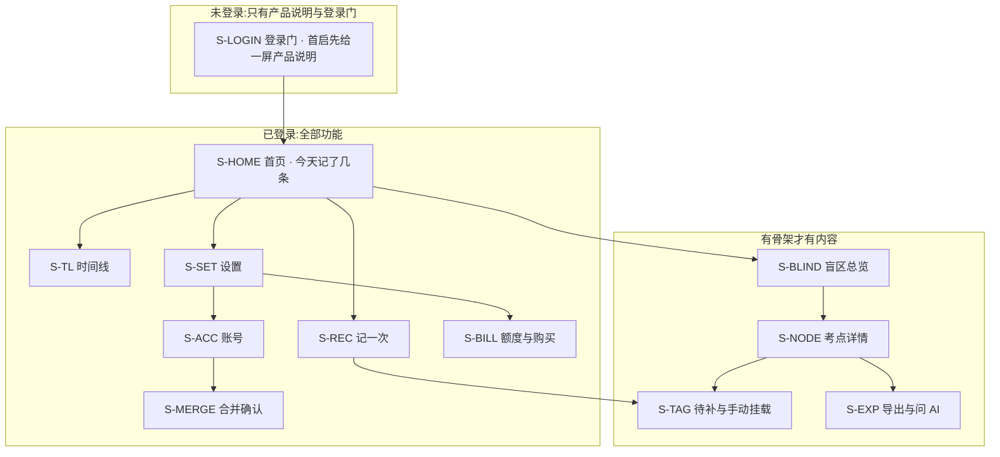

[← 文档索引](../../INDEX.md) ｜ [产品模块地图与产品逻辑](../INDEX.md)

# 用户侧功能规格 · 总纲与全局约定

> **这份目录回答一件事:用户看得见的每一块,长什么样、点下去发生什么、出错时屏幕上写什么字。**
> 它写到**可以直接交给 UI 设计和前后端开发动手**为止:每一屏有元素清单与取值来源,每一个可点元素有禁用条件,
> 每一条异常有触发条件、界面表现、原样文案、用户的下一步、后端行为。
>
> **不是**模块的状态机与产品判断(在 [`模块 A · 骨架层`](../modules/模块A-骨架层.md)–[`模块 G · 商业化`](../modules/模块G-商业化.md))、
> **不是**接口签名与字段类型(在 [`技术架构与接口契约`](../../technical/INDEX.md) §六、[`后端系统设计与组件接入`](../../technical/后端系统设计与组件接入.md))、
> **不是**视觉稿(在设计侧)、**不是**排期(在 [`执行清单`](../../execution/执行清单.md))。
>
> **契约冲突时一律以 `技术架构与接口契约` 为准。** 本目录里出现的端点都是引用;本目录**新提出**的端点一律标 `🚧 待技术定稿`,
> 它是产品意图不是契约。
>
> **基线:`origin/v1` @ `83b9632`,fetch 于 2026-09-01T14:00Z。**
> **状态:活跃。** 新增一屏、改一条异常处理、改一句界面文案,本目录同一次改动内更新。

---

## 零、这套规格给谁用,以及三份文档的分工

| 角色 | 从这里拿什么 | 拿不到什么 |
|---|---|---|
| **UI 设计** | 屏幕清单、每屏的元素与层级、状态枚举(空/加载/错误/受限)、文案原文 | 视觉风格、间距、色板 |
| **前端** | 交互行为、禁用条件、跳转关系、错误码 → 界面表现映射、离线行为 | 组件库选型、路由实现(在 [`多端选型与端矩阵`](../../technical/多端选型与端矩阵.md) §4.6) |
| **后端** | 每个动作要哪个端点、请求/响应里产品要什么语义、错误码要能区分到哪一档 | 字段类型、索引、时序(在 `后端系统设计与组件接入`) |

**分工写死:模块文档回答「这一块为什么这么设计」,本目录回答「它长什么样」,技术文档回答「它怎么实现」。**
同一件事三处都写就是三处说法 —— 本目录只在**屏幕**这一层展开,凡涉及数字、字段、阈值一律给指针。

---

## 一、屏幕地图



**十三屏,一屏不多。** 屏幕编号 `S-XXX` 是设计与开发共用的锚,**改名可以,改编号要同时改本表与各规格文档**。

| 屏幕 | 归哪份规格 | 登录要求 | 骨架要求 | 网络要求 |
|---|---|---|---|---|
| `S-HOME` 首页 | [记一次学习](记一次学习.md) | 需要 | 不需要 | **不需要** |
| `S-REC` 记一次 | [记一次学习](记一次学习.md) | 需要 | 不需要 | **不需要**(AI 识别需要) |
| `S-TL` 时间线 | [记一次学习](记一次学习.md) | 需要 | 不需要 | 不需要(读本地)/需要(云端) |
| `S-BLIND` 盲区总览 | [看盲区](看盲区.md) | **需要** | **需要** | 需要 |
| `S-NODE` 考点详情 | [看盲区](看盲区.md) | **需要** | **需要** | 需要 |
| `S-TAG` 待补与手动挂载 | [打标与未分类](打标与未分类.md) | **需要** | **需要** | 需要 |
| `S-EXP` 导出与问 AI | [导出与问AI](导出与问AI.md) | **需要**(导出仍不限次数、不加水印) | 需要 | 需要 |
| `S-LOGIN` 登录 | [登录与账号](登录与账号.md) | — | 不需要 | **需要** |
| `S-ACC` 账号 | [登录与账号](登录与账号.md) | 需要 | 不需要 | 需要 |
| `S-MERGE` 合并确认 | [登录与账号](登录与账号.md) | 需要 | 不需要 | 需要 |
| `S-BILL` 额度与购买 | [额度与购买](额度与购买.md) | **需要** | 不需要 | 需要 |
| `S-SET` 设置 | [设置与原图](设置与原图.md) | 需要 | 不需要 | 不需要 |
| `S-RAW` 原图管理 | [设置与原图](设置与原图.md) | 需要 | 不需要 | **不需要** |

⚠️ **「登录要求」一律是「需要」**(2026-09-02 用户裁定「没有本地模式」):登录是入口,登录之后这些屏的**离线可用性完全不变** —— 网络要求那一列没动。

---

## 二、全局交互约定(每份规格都默认遵守,不再重复)

### 2.1 四种态,每一屏都要画

| 态 | 什么时候 | 屏幕上是什么 | 不允许 |
|---|---|---|---|
| **加载** | 首屏请求未回 | 骨架占位(保持最终布局的形状),**不转圈遮罩** | 不允许整屏 loading 盖住已有内容 |
| **空** | 请求成功但没有数据 | 一句话说清「为什么空」+ **一个能立刻做的动作** | 不允许只画一张插画 |
| **错误** | 请求失败 | 一句话说清「哪一步没成」+ 重试按钮(可重试时) | 不允许出现错误码原文、堆栈、英文 |
| **受限** | 登录态失效 / 额度 / 骨架缺失 | 说清缺什么 + 去补的入口 + **手动兜底入口** | 不允许把用户堵死在弹窗里 |

⚠️ **未登录不走受限态,走登录门**(2026-09-02 用户裁定「没有本地模式」):未登录访问任何 route id 一律渲染登录门(`登录与账号` §1.2),**门没有「继续用」这个出口**。受限态里的「缺登录」只剩**已登录后令牌失效**这一种,它的主按钮是「去登录」,**这一档没有免费兜底** —— 见 [全局组件与交互模式库](全局组件与交互模式库.md) `C-LIMIT`。

### 2.2 反馈形态只有三种,按「用户要不要做决定」选

| 形态 | 用在哪 | 停留 | 例 |
|---|---|---|---|
| **Toast** | 已经成功、用户不需要做任何事 | 2 秒自动消失 | 「已记下」 |
| **页内提示**(输入框下方 / 卡片内) | 用户要改这一处的输入 | 直到该处输入变化 | 「验证码错了,还能试 3 次」 |
| **浮层**(必须选一次) | 不可逆、或必须二选一 | 用户选完才走 | 合并账号、删除记录、注销 |

**没有第四种。** 尤其没有「小红点」「气泡引导」「未读计数」——它们是提醒机制的变体,`R-05` 的边界写着本产品不做提醒。

### 2.3 文案红线:界面上永远不出现的词

🔴 **下列词一个都不许出现在任何界面、Toast、空态、错误提示、推送、导出文件里**(真源 [`项目现状与决策记录`](../../decisions/INDEX.md) §2、`产品模块地图与产品逻辑` §六):

```
正确率 · 得分 · 分数 · 排名 · 名次 · 击败了 x% · 掌握度 · 熟练度 · 等级
讲解 · 解析 · 答案 · 知识点讲解 · 学习建议 · 复习提醒 · 该复习了
连续打卡 · 连续 n 天 · 成就 · 徽章 · 勋章 · 里程碑 · 战绩
```

**产品只回答三件事:有没有、几次、多久前。** 所有文案都必须能还原成这三句之一。

| ❌ 不许写 | ✅ 写成 |
|---|---|
| 「这个考点你掌握得不错」 | 「这个考点你碰过 3 次,最近一次 6 天前」 |
| 「建议复习行政处罚」 | 「行政处罚:近 5 年考了 7 次,你没碰过」 |
| 「今日已完成打卡」 | 「今天记了 3 条」 |
| 「正确率偏低」 | **删掉,这句话本产品不该有** |

### 2.4 输入与键盘(所有表单通用)

- 进入需要输入的屏,**自动聚焦第一个空的输入框**并唤起键盘;手机号唤起数字键盘,验证码唤起数字键盘且 `autocomplete=one-time-code`
- **软键盘不得遮挡当前输入框与它下方的主按钮**;遮挡时整屏上推,不做内部滚动
- 粘贴一串数字到验证码框:自动按位填充并**自动提交**,不需要再点按钮
- 所有输入框**失焦才校验**,输入过程中不报错;唯一例外是超长截断(手机号 11 位截断)
- **任何时候按返回键都能退出当前屏**,没有「不可返回」的屏;有未保存内容时用浮层问一次

### 2.5 离线与弱网

| 情况 | 行为 |
|---|---|
| 完全离线 | `S-HOME` / `S-REC` / `S-TL` / `S-SET` / `S-RAW` **照常可用**,写入进本地队列;顶部一条常驻细条:「离线中,已存在这台设备上,联网后自动同步」 |
| 请求超时(>10s) | 按「错误态」处理,**不无限转圈** |
| 回来联网 | 队列自动补传,补传中顶部细条变「正在同步 3 条」,完成后 2 秒消失;**不需要用户点任何按钮** |
| 补传冲突 | 以 `client_token` 幂等去重(`技术架构与接口契约` §6.2),用户无感 |

🔴 **记录动作永不失败**(`1.3.7.1`):离线、识别挂了、额度用完了,**记录本身一定要落下来**,失败的只能是它的附加能力。

---

## 三、错误码 → 界面表现(全局映射表)

**后端返回的错误码只用来选界面表现,不直接显示。** 未列出的码一律走「未知错误」行。

| 错误码 | 界面表现 | 文案 | 用户下一步 |
|---|---|---|---|
| `UNAUTHORIZED` | 受限态 | 「这一步需要先登录」 | 去 `S-LOGIN`,登录后**回到原处并自动重试一次** |
| `TOKEN_EXPIRED` | 静默 | 无 | 前端先静默续期(`POST /auth/refresh`),续期失败才当 `UNAUTHORIZED` |
| `QUOTA_EXHAUSTED` | 受限态 | 「这个月的 AI 次数用完了(还剩 0 次)」 | **手动记录入口**(主) + 去 `S-BILL`(次) |
| `SMS_TOO_FREQUENT` | 页内提示 | 「发得太频繁了,{n} 秒后可以再试」 | 等倒计时 |
| `SMS_CODE_WRONG` | 页内提示 | 「验证码不对,还能试 {n} 次」 | 重填 |
| `SMS_CODE_EXPIRED` | 页内提示 | 「验证码过期了,重新发一条」 | 点重发 |
| `SMS_LOCKED` | 受限态 | 「错太多次了,{n} 分钟后再试」 | 等 / 换登录方式 |
| `PHONE_TAKEN` | 浮层 | 见 [登录与账号](登录与账号.md) §五 | 选合并或换号 |
| `NO_MATCH` | 页内提示(不是错误) | 「这条没能对上任何考点」 | 手动挂载 / 就这样留着 |
| `SYLLABUS_EMPTY` | 空态 | 「这个科目的考点表还没建好」 | 只给「去记一条」的入口 |
| `NETWORK_TIMEOUT` | 错误态 | 「网络没通,刚才那一步没成」 | 重试按钮 |
| `SERVER_ERROR` | 错误态 | 「服务出了点问题,刚才那一步没成」 | 重试按钮 |
| 未知 | 错误态 | 「没成,再试一次」 | 重试按钮 |

⚠️ **错误文案里不出现错误码、不出现英文、不出现「请稍后重试」这种没有信息量的话。** 每一句都要说清「哪一步没成」。

---

## 四、登录态 × 能力矩阵

**未登录不是一种可长期停留的形态**(2026-09-02 用户裁定「没有本地模式」):未登录只能看到产品说明与登录门,**不能记、不能看盲区、不能打标、不能导出**。登录从「出口」变成「入口」—— **不登录不能记;能记的一定已登录**。

| 能力 | 未登录 | 已登录 · 免费 | 已登录 · 付费 |
|---|---|---|---|
| 手动记一条 | ❌ | ✅ | ✅ |
| 语音 / 拍照记一条 | ❌ | ✅ 额度内 | ✅ 额度内 |
| 看时间线 | ❌ | ✅ 全部 | ✅ |
| 看盲区 | ❌ | ✅ 只要骨架能拉到 | ✅ |
| 导出 | ❌ | ✅ **不限次数、无水印** | ✅ |
| AI 代发 | ❌ | ✅ 额度内 | ✅ 额度内 |
| 跨端同一份数据 | ❌ | ✅ | ✅ |
| 只读令牌(MCP) | ❌ | ✅ 阶段 2 后 | ✅ |
| 看产品说明与登录门 | ✅ | —— | —— |

🔴 **导出永远不限次数、不加水印、不因未付费而删减**(`1.3.6.1`)。这一格是承诺,不是策略。

---

## 五、埋点:只埋阶段判据要的那几个数

**不做行为分析,不做漏斗,不做留存曲线。** 埋点只服务两件事:阶段验收判据、北极星。

| 事件 | 为什么埋 | 真源 |
|---|---|---|
| `record_created`(带来源:手动/语音/拍照/批量) | 阶段 0 的两个每日数字之一 | `总路线图 · 脑图与父子待办` `1.1.4` |
| `record_skipped`(用户自己点「本来该记但懒得记」) | 阶段 0 的第二个数 | 同上 |
| `blindspot_opened` | **北极星:主动查看盲区的人数** | `项目现状与决策记录` §2 |
| `signup_created`(建号分支,与登录成功分开) | 阶段 3 的「陌生注册数」判据 | `后端系统设计与组件接入` §1.7 |

⚠️ **这四个之外不加埋点。** 加一个就要在这张表里说清它服务哪条判据 —— 说不清就是不该加(`思考模式与选择框架` §盲区二)。

---

## 六、规格清单

| 规格 | 覆盖屏幕 | 状态 |
|---|---|---|
| [登录与账号](登录与账号.md) | `S-LOGIN` `S-ACC` `S-MERGE` | 可开发 |
| [记一次学习](记一次学习.md) | `S-HOME` `S-REC` `S-TL` | 可开发 |
| [看盲区](看盲区.md) | `S-BLIND` `S-NODE` | 可开发 |
| [打标与未分类](打标与未分类.md) | `S-TAG` | 可开发 |
| [导出与问AI](导出与问AI.md) | `S-EXP` | 可开发 |
| [额度与购买](额度与购买.md) | `S-BILL` | 可开发 · 依赖阶段 2 后的支付资质 |
| [设置与原图](设置与原图.md) | `S-SET` `S-RAW` | 可开发 |

**四份横切规格**——它们不占任何一屏,写的是「每一屏都要遵守的那一层」。逐屏规格与它们冲突时**以横切规格为准**:

| 横切规格 | 它定什么 | 逐屏规格从它那里拿什么 |
|---|---|---|
| [全局组件与交互模式库](全局组件与交互模式库.md) | 按钮 / 输入框 / 列表 / 卡片 / 浮层 / Toast / 四种态 / 骨架屏 / 树选择器 / 危险操作确认的**结构、状态、行为、文案模式** | 组件级规格。逐屏规格只写「哪一屏用哪个组件、填什么内容」,**不各写各的** |
| [首次使用与权限申请](首次使用与权限申请.md) | 从安装到第一条记录落下来的完整路径;麦克风 / 相机 / 相册 / 剪贴板 / 文件的**申请时机与被拒后的降级路径**;**不申请**哪些权限及理由 | 权限矩阵。逐屏规格只写「这个权限在本屏的落点」 |
| [无障碍与多端适配](无障碍与多端适配.md) | 13 屏 × 4 端的能力矩阵;各端「本机存储」到底是什么(**原图红线在多端上的落点**);无障碍下限与逐屏焦点顺序 | 端差异与无障碍的**唯一真源**。逐屏规格只写本屏专属的部分 |
| [端到端验收用例集](端到端验收用例集.md) | **跨屏旅程用例**(`J-xxx`)与**红线专项用例**(`RL-xx-xx`) | 屏内用例归逐屏规格自己;跨两屏以上的、以及红线的全产品验收,只在这一份里 |

**骨架原料怎么来的,不在本目录**,它是一条单独的后端线:[`骨架数据采集流水线`](../../data/骨架数据采集流水线.md) —— **没有用户界面,不占用户侧任何一屏**。

---

## 七、红线自查(每次改本目录都要重跑一遍)

| 检查 | 命令 / 做法 |
|---|---|
| 界面文案不含禁用词 | `grep -rnE '正确率\|得分\|排名\|讲解\|解析\|学习建议\|复习提醒\|打卡\|徽章' docs/product/specs/` —— **命中即违规**,除了 §2.3 那张对照表本身 |
| 没有任何字段能装题干 | 通读每份规格的「元素清单」列,任何一格允许用户输入或系统存放题目内容 → 违规 |
| 自动打标不生成文本 | 规格里凡出现「AI 给出标签」,必须写明它只从候选集里选 `nodeId` 或返回 `NO_MATCH` |
| 原图不出本机 | 凡出现原图的屏,必须写明存储位置是本机,且没有上传按钮 |
