[← 用户侧功能规格](INDEX.md)

# 全局组件与交互模式库

> **这份文档回答一件事:七份逐屏规格里反复出现的那些组件,各自长什么样、有哪几个状态、点下去发生什么、出错时写什么字。**
> 它写到**设计能照着画、前端能照着实现、后端能照着判断要返回什么语义**为止。
>
> **分工写死:本文定组件,逐屏规格定「哪一屏用哪个组件、里面填什么内容」。**
> 逐屏规格里出现「按钮」「空态」「浮层」时,指的就是本文定义的那一个;它只需要写清楚**内容与取值来源**,不再重复描述行为。
> 🔴 **组件行为上两边冲突时以本文为准**;内容与取值来源上以逐屏规格为准。
>
> **不是**全局约定(四种态、三种反馈形态、文案红线、错误码映射、登录态矩阵、埋点在 [`用户侧功能规格 · 总纲与全局约定`](INDEX.md))、
> **不是**视觉(色板、间距、字号、圆角、阴影在设计侧,本文一个都不定)、
> **不是**接口契约(在 [`技术架构与接口契约`](../../technical/INDEX.md))、
> **不是**端的技术选型(在 [`多端选型与端矩阵`](../../technical/多端选型与端矩阵.md))。
>
> **基线:`origin/v1` @ `15accea`,fetch 于 2026-09-01T15:05Z。**
> **状态:活跃。** 新增一个组件、改一条组件行为、改一句组件级文案模式,本文同一次改动内更新。

---

## 零、怎么用这份文档

### 0.1 三种读者各拿什么

| 角色 | 从这里拿什么 | 拿不到什么 |
|---|---|---|
| **UI 设计** | 每个组件的区块与层级、状态枚举(要出几张稿)、边界值(超长/超量时画什么)、无障碍下限 | 色板、间距、字号、圆角、阴影、动效曲线 —— 本文一个数值都不给 |
| **前端** | 交互细则、防抖节流与连点保护、降级顺序、多端差异、返回键行为、重试与幂等的界面后果 | 组件库选型、路由实现 |
| **后端** | 组件要求响应里带什么语义(可否重试、剩余次数、`retryAfter`、幂等结果) | 字段类型与签名 |

### 0.2 每个组件按同一套模板写,一节不缺

| 段 | 写什么 | 为什么必须有 |
|---|---|---|
| **用途与不用于** | 它解决哪一类问题;以及**明确不用它做什么** | 「不用于」比「用于」更能防止组件被滥用成第四种反馈形态 |
| **结构** | 区块与层级,哪些必选、哪些可选 | 设计与前端对着同一份区块清单出稿与写代码 |
| **状态枚举** | 全部状态与迁移(够复杂时给 Mermaid `stateDiagram-v2`) | 设计要出几张稿,由这一节决定 |
| **交互细则** | 每个动作的响应、防抖节流、连点保护、失败回滚 | 这一段是前端的实现清单 |
| **边界值** | 长度 / 数量 / 尺寸的上限,以及超出时的降级 | 超出时怎么办不写死,就会各端各做各的 |
| **文案模式** | 可套用的句式模板 + 正反例表 | 逐屏规格填内容时照着套,不再自己编 |
| **无障碍** | 焦点、朗读文本、热区下限、200% 字体、颜色不作为唯一信息载体 | 这四条是下限不是加分项,不允许被简化掉 |
| **多端差异** | Web / 桌面壳 / 移动 App / 微信小程序 四栏 | 端的能力不同,不写差异就会在小程序上崩掉 |
| **反例** | 这个组件最容易被做错成什么样 | review 时逐条对照,比正面描述更快抓到问题 |

### 0.3 组件清单与它们的锚

**锚 `C-XXX` / `P-XXX` 是设计与开发共用的引用名。** 改名可以,改锚要同时改本表与引用它的逐屏规格。

| 锚 | 组件 | 主要出现在 |
|---|---|---|
| `C-BTN` | [按钮](#c-btn-按钮) | 全部十四屏 |
| `C-INPUT` | [输入框](#c-input-输入框) | `S-LOGIN` `S-REC` `S-TAG` `S-EXP` |
| `C-PICK` | [选择器(单选 / 多选 / 树 / 日期时间)](#c-pick-选择器) | `S-TAG` `S-REC` `S-BLIND` `S-EXP` |
| `C-SWITCH` | [开关](#c-switch-开关) | `S-NODE` `S-SET` |
| `C-LIST` | [列表](#c-list-列表) | `S-TL` `S-BLIND` `S-RAW` `S-BILL` |
| `C-CARD` | [卡片](#c-card-卡片) | `S-TL` `S-BLIND` `S-BILL` `S-REC` |
| `C-DISC` | [折叠 / 面包屑 / Tab 与科目切换器](#c-disc-折叠-面包屑-tab) | `S-BLIND` `S-NODE` `S-TAG` `S-TL` |
| `C-TOAST` | [Toast](#c-toast-toast) | 全部十四屏 |
| `C-INLINE` | [页内提示](#c-inline-页内提示) | 有输入的每一屏 |
| `C-SHEET` | [浮层](#c-sheet-浮层) | `S-MERGE` `S-TL` `S-RAW` `S-SET` `S-BILL` |
| `C-DANGER` | [危险操作确认模式](#c-danger-危险操作确认模式) | `S-TL` `S-RAW` `S-SET` `S-ACC` `S-MERGE` |
| `C-SKEL` | [骨架屏](#c-skel-骨架屏) | 需要网络的每一屏 |
| `C-EMPTY` | [空态](#c-empty-空态) | 全部十四屏 |
| `C-ERR` | [错误态](#c-err-错误态) | 需要网络的每一屏 |
| `C-LIMIT` | [受限态](#c-limit-受限态) | `S-REC` `S-TAG` `S-EXP` `S-BILL` `S-ACC` |
| `C-OFFLINE` | [离线细条](#c-offline-离线细条) | `S-HOME` `S-REC` `S-TL` `S-SET` `S-RAW` |
| `P-NAV` | [导航与返回](#p-nav-导航与返回) | 跨屏 |
| `P-TIME` | [加载与超时的统一阈值表](#p-time-加载与超时的统一阈值表) | 跨屏 |
| `P-RETRY` | [重试与幂等](#p-retry-重试与幂等) | 跨屏 |
| `P-NUM` | [数字与时间的呈现规范](#p-num-数字与时间的呈现规范) | 跨屏 |
| `P-COPY` | [文案总规范](#p-copy-文案总规范) | 跨屏 |

### 0.4 本文不重复的东西(在总纲里,只引用)

| 内容 | 在哪 | 本文怎么处理 |
|---|---|---|
| 四种态的定义与「不允许」 | [`总纲`](INDEX.md) §2.1 | 本文给**组件级**规格:`C-SKEL` `C-EMPTY` `C-ERR` `C-LIMIT` 四节 |
| 三种反馈形态的选择规则 | [`总纲`](INDEX.md) §2.2 | 本文给**每一种的组件规格**:`C-TOAST` `C-INLINE` `C-SHEET` 三节 |
| 界面禁用词全表 | [`总纲`](INDEX.md) §2.3 | 🔴 **本文不复述那张表**,只在 [`P-COPY`](#p-copy-文案总规范) 写「怎么自查」 |
| 错误码 → 界面表现映射 | [`总纲`](INDEX.md) §三 | 本文只定「拿到某一档表现之后组件怎么长」,不重列错误码 |
| 输入与键盘的全局约定 | [`总纲`](INDEX.md) §2.4 | `C-INPUT` 展开为组件级细则,**不改口径** |
| 离线与弱网的全局行为 | [`总纲`](INDEX.md) §2.5 | `C-OFFLINE` 只定那条细条本身 |
| 各屏用哪个组件、填什么内容 | 七份逐屏规格 | 本文 §九 给反向索引,不搬内容 |

### 0.5 三条贯穿全文的硬规则

> **1. 反馈形态只有三种。** Toast / 页内提示 / 浮层。**没有第四种** —— 尤其没有小红点、气泡引导、未读计数、引导蒙层、新手教程弹窗。它们都是提醒机制的变体,本产品不做提醒。
> **2. 不做任何促销或成瘾机制。** 没有倒计时式的紧迫感(验证码与频控的等待秒数是能力约束,不是紧迫感)、没有限时、没有连续天数、没有完成度激励。
> **3. 没有任何字段能装下题干。** 组件的输入框、占位符、示例文案、边界值示例、验收用例里的示例文本,**一律不许长得像题目**。

---

## 一、全组件通用的前提

### 1.1 尺寸与数值的纪律

🔴 **本文只出现两类数值,别的一个都没有:**

| 允许 | 例 | 为什么它不是视觉 |
|---|---|---|
| **可访问性下限** | 最小点击热区 44×44pt;正文缩放到 200% 不截断不重叠 | 它是能不能点到、能不能读到,是行为 |
| **时间阈值** | Toast 停留 2 秒;骨架屏出现的等待窗口 | 它决定用户看到什么顺序的画面,是行为 |

**不允许出现:** 色值、色板名、间距、字号、行高、圆角、阴影、边框宽度、动效时长与曲线、层级 z 值、栅格列数。
这些全部交给设计,本文一个都不给 —— 给了就是第二处说法,而且一定先过期。

⚠️ **「44×44pt」是热区不是视觉尺寸。** 图标画多大是设计的事,可点区域不小于 44×44pt 是本文的事;
两者不一致时用透明扩展热区补足,**不是把图标画大**。

### 1.2 每个可点元素必须回答的四个问题

设计稿与代码 review 时逐个组件对照,四问缺一即为不合格:

| # | 问题 | 不合格的样子 |
|---|---|---|
| 1 | **它什么时候禁用?** | 「看情况」;或者能点但点了没反应 |
| 2 | **点下去到反馈之间用户看到什么?** | 什么都不变,用户以为没点上,于是连点 |
| 3 | **失败了屏幕上写什么字?** | 「操作失败」这种不说清哪一步没成的话 |
| 4 | **失败之后用户的下一步是什么?** | 只有一个「知道了」,把人堵在原地 |

### 1.3 禁用与加载:全产品统一的三条

| 规则 | 说明 |
|---|---|
| **禁用只有两种合法理由** | ① 必填项没填够(如验证码不足位数);② 前置条件不成立(如留存区为空时的「清理留存区」)。**「正在请求中」不算禁用理由** —— 那是加载态,见下 |
| **加载中的元素保持可见位置不动** | 主按钮转为加载中时**不改变它的占位**,不允许文字变短导致按钮跳动 |
| **禁用元素必须能说出原因** | 禁用按钮旁(或按下时)给一句话说清缺什么。**没有理由的灰按钮等于死路** |

🔴 **禁用不是防错的主手段,可撤销才是。** 能让用户先做再改的,不要先禁再放。

### 1.4 「点下去发生什么」的四类响应,只有这四类

| 类 | 用在哪 | 反馈形态 |
|---|---|---|
| **就地改变** | 开关、折叠、Tab 切换、断言 | 元素自身变化,**乐观更新**,失败回滚 + `C-TOAST` |
| **提交一次** | 记一条、确认标签、发验证码、下单 | 按钮进加载态 → 成功 `C-TOAST` / 失败 `C-INLINE` 或 `C-ERR` |
| **换一屏** | 进详情、进设置、进登录 | 走 [`P-NAV`](#p-nav-导航与返回) |
| **要用户选一次** | 删除、合并、清空、注销 | `C-SHEET`,按 [`C-DANGER`](#c-danger-危险操作确认模式) 定档 |

**任何交互都必须落在这四类之一。** 落不进去的,先回到 §0.5 第 1 条检查是不是在造第四种反馈形态。

---

## 二、基础交互件

### `C-BTN` 按钮

#### 用途与不用于

| | |
|---|---|
| **用途** | 触发一个动作。四类:**主**(这一屏最该做的那一件)、**次**(可做但不是重点)、**文本**(轻量、可逆、密度高的位置)、**危险**(不可逆或会丢数据) |
| **不用于** | 导航到另一屏时的**唯一**指示(那是链接或整行可点区);不用于承载状态信息(「已同步」不是按钮);不用于替代 Tab 切换 |

🔴 **一屏最多一个主按钮。** 两个主按钮等于没有主按钮,用户要先做一次选择才能开始做事。
🔴 **受限态里的主按钮永远是免费兜底那一条**,付费入口只能是次要按钮或文本按钮(见 [`C-LIMIT`](#c-limit-受限态))。

#### 结构

| 区块 | 必选 | 说明 |
|---|---|---|
| 文字 | ✅ | 动词开头,说清点了会发生什么 |
| 前置图标 | ❌ | 只在快捷入口(说 / 拍 / 写)上出现;图标不单独承载语义,必须配文字 |
| 加载指示 | 条件 | 进入加载态时出现,**替换文字但不改变按钮占位** |
| 辅助说明 | ❌ | 一行小字,放在按钮**下方**,不放按钮里 |

#### 状态枚举

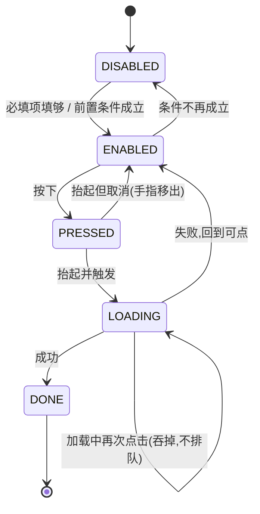

| 状态 | 屏幕上 | 可点 |
|---|---|---|
| `DISABLED` | 弱化显示,**旁边或按下时给一句话说清缺什么** | 否(但可接收按下以给出原因) |
| `ENABLED` | 常态 | 是 |
| `PRESSED` | 立刻的按下反馈(视觉形式由设计定,**必须有**) | —— |
| `LOADING` | 加载指示替换文字,占位不变 | 否 |
| `DONE` | 不停留;由 `C-TOAST` 或屏幕跳转接手 | —— |

⚠️ **没有 `SUCCESS` 状态。** 按钮不承担「已成功」的展示 —— 那是 Toast 的事。按钮变绿打勾停两秒是在造第四种反馈形态。

#### 交互细则

| 动作 | 行为 |
|---|---|
| **按下反馈** | 必须有,且在**手指按下的那一刻**出现,不等请求 |
| **手指移出后抬起** | 取消,不触发 |
| **连点保护** | 🔴 首次点击立刻进 `LOADING` 并**吞掉**后续点击,不排队、不计数。请求回来前该按钮的第二次点击**永不产生第二个请求** |
| **保护窗口** | 即使请求秒回,`LOADING` 也至少维持到请求返回;返回后按钮**立刻**恢复,不额外加冷却 |
| **幂等兜底** | 会写数据的按钮,同一次点击生成的幂等键在重试时复用,见 [`P-RETRY`](#p-retry-重试与幂等) |
| **防抖** | 只用于**输入驱动**的按钮可用性计算(如手机号合法性),不用于点击本身 |
| **键盘触发** | 桌面壳与 Web 上 `Enter` 触发当前焦点按钮,`Space` 同样触发;`Esc` 不触发任何按钮 |
| **表单里的默认按钮** | 输入框内按回车 = 触发该表单的主按钮,前提是它当前可点 |

#### 边界值

| 项 | 上限 / 规则 | 超出时 |
|---|---|---|
| 按钮文字长度 | ≤ 6 个汉字 | 超出说明动作没想清楚,**不允许缩字号、不允许换行、不允许省略号**,改文案 |
| 一屏主按钮数量 | 1 | 超出即为设计缺陷,退回 |
| 一屏可点元素总数 | 无硬上限,但**主链路三屏**(`S-HOME` / `S-REC` / `S-TL`)以外的屏若超过一屏能一眼数清的程度,拆屏 |
| 并排按钮数量 | ≤ 2 | 3 个及以上改为纵向排列 |
| 点击热区 | ≥ 44×44pt | 视觉尺寸不足时用透明热区补足 |

#### 文案模式

**句式模板:`动词 + 宾语`,宾语能省则省。**

| ❌ 不许写 | ✅ 写成 | 为什么 |
|---|---|---|
| 「提交」 | 「记下」 | 「提交」不说明发生了什么 |
| 「确定」(在删除浮层里) | 「删掉」 | 确认按钮要复述那个动作,用户才知道自己在确认什么 |
| 「好的」「知道了」(作为唯一按钮) | 给一个真动作 + 一个退出 | 单按钮浮层等于堵路 |
| 「立即购买(限时)」 | 「选这个」 | 促销词一律不许 |
| 「继续学习」 | 「记一条」 | 产品不判断学习,只记录 |
| 「查看详情」 | 「看这个考点」 | 说清去哪 |

#### 无障碍

| 项 | 要求 |
|---|---|
| 角色 | 语义按钮元素,不是可点的容器;小程序用 `button` 而非 `view` + `bindtap` |
| 朗读文本 | 与可见文字一致;`DISABLED` 时朗读附加禁用原因;`LOADING` 时朗读「正在…」 |
| 焦点 | 键盘可达,焦点指示不得被移除;点击后焦点**不丢失**(留在按钮上或移到结果区) |
| 热区 | ≥ 44×44pt |
| 200% 字体 | 按钮高度随文字增长,**不裁切、不横向溢出**;并排两个按钮在 200% 下自动改为纵向 |
| 颜色 | 🔴 主/次/危险的区分**不能只靠颜色**:主按钮靠填充与位置,危险按钮靠文案本身说清后果 |

#### 多端差异

| 端 | 差异 |
|---|---|
| **Web / H5** | 悬停态存在;`Enter` / `Space` 触发;`:focus-visible` 必须有可见焦点环 |
| **桌面壳(Tauri · macOS)** | 同 Web,外加系统级快捷键不与按钮抢焦点;窗口失焦时按钮不进入 `PRESSED` |
| **移动 App(Tauri iOS / Android)** | 无悬停;Android 物理返回键**不触发**任何按钮;按下反馈要跟手 |
| **微信小程序** | 用原生 `button`;`open-type` 只在微信登录处使用,其余一律普通按钮;**不使用小程序的加载遮罩 API**,加载态在按钮内表现 |

#### 反例

1. 点了没反应,用户连点三次 → 落了三条记录。**连点保护缺失是本组件最贵的错。**
2. 请求中把整屏罩上半透明遮罩 + 转圈。**违反四种态里「不允许整屏 loading 盖住已有内容」。**
3. 灰掉的按钮不说明原因,用户在屏幕上找不到自己缺什么。
4. 成功后按钮变成「已完成」并停留。**按钮不做成功展示。**
5. 危险按钮只用颜色区分,读屏用户与色觉障碍用户拿不到「这是危险动作」这条信息。
6. 加载时按钮文字从「记下」变「记录中…」,按钮宽度跳变,底下的内容跟着抖。
7. 把「去买」做成主按钮、「手动挂考点」做成文字链。**主次反了,主链路上就立了付费墙。**
8. 用按钮承载状态:「已同步 ✓」做成一个不可点的按钮,用户反复去点它。

---

### `C-INPUT` 输入框

#### 用途与不用于

| | |
|---|---|
| **用途** | 四种:**文本**(记录内容、来源名、令牌名)、**数字**(手机号)、**验证码**(定长数字)、**搜索**(树内搜考点名) |
| **不用于** | 🔴 **承载题目内容。** 占位符、示例、帮助文字、错误提示里不许出现任何长得像题目的文字 —— 写了用户就会开始往里抄题,而数据库里根本没有能装它的地方 |
| **不用于** | 让用户输入标签文本(标签只能从树里选,见 [`C-PICK`](#c-pick-选择器));不用于输入密码(产品没有密码) |

#### 结构

| 区块 | 必选 | 说明 |
|---|---|---|
| 标签或占位符 | ✅ | 二选一;占位符**消失后信息不能丢**,所以承载关键说明时必须用标签 |
| 输入区 | ✅ | —— |
| 清除按钮 | 条件 | 有内容且获得焦点时出现;搜索框常驻 |
| 计数 | 条件 | 只在**接近上限**时出现,不常驻 |
| 页内提示位 | ✅ | 预留位置,**紧贴该输入框下方**;隐藏时不占位跳动 |
| 辅助说明 | ❌ | 一行小字,说清这个字段会被怎么用 |

#### 状态枚举

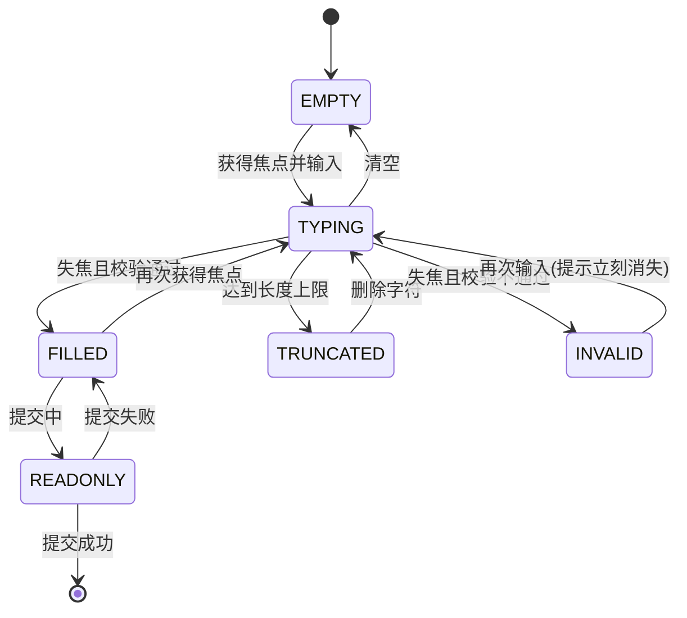

| 状态 | 屏幕上 |
|---|---|
| `EMPTY` | 占位符可见;清除按钮不显示 |
| `TYPING` | 🔴 **输入过程中不报错**;清除按钮出现 |
| `TRUNCATED` | 停止接受新字符;**唯一允许在输入过程中给的即时反馈** |
| `FILLED` | 常态 |
| `INVALID` | 页内提示出现在该框正下方,**保留用户已输入的内容** |
| `READONLY` | 提交途中只读,不禁用(禁用会让读屏跳过它) |

#### 交互细则

| 项 | 规则 |
|---|---|
| **校验时机** | 🔴 **失焦才校验**,输入过程中不报错。唯一例外是超长截断 |
| **提示消失** | 页内提示在**该处输入发生变化的第一时刻**消失,不等再次失焦 |
| **自动聚焦** | 进入需要输入的屏,自动聚焦第一个空的输入框并唤起键盘(口径见 [`总纲`](INDEX.md) §2.4) |
| **清除按钮** | 点击清空并保持焦点;**清空不触发提交,也不触发校验** |
| **粘贴** | 文本框:保留换行,超长按上限截断并给页内提示;数字框:剥离非数字字符再填;验证码框:按位填充并**自动提交** |
| **防抖** | 只有搜索框防抖(输入停止后再发请求),窗口取「打字停顿」量级;其余输入框不发请求所以无防抖 |
| **节流** | 搜索请求在途时新输入不排队,**只保留最后一次**;返回结果与当前输入不匹配时丢弃该结果 |
| **软键盘遮挡** | 🔴 遮挡时**整屏上推**,保证当前输入框与它下方的主按钮都可见;**不做输入区内部滚动** |
| **回车** | 单行框回车 = 触发主按钮;多行框回车 = 换行,提交靠按钮 |
| **自动增高** | 记录内容框单行起,自动增高到上限行数后内部滚动 |
| **不做的事** | 不做实时联想补全、不做输入中的字数进度条、不做「输入得不错」这类评价 |

#### 边界值

| 项 | 上限 | 超出时 |
|---|---|---|
| 手机号 | 11 位 | 截断,不再接受输入(口径见 [登录与账号](登录与账号.md) §2.3) |
| 验证码 | 6 位 | 满位自动提交 |
| 记录内容 | 上限值在 [`技术架构与接口契约`](../../technical/INDEX.md) 定义,本文不复述 | 达到上限时截断 + 页内提示「写不下了,已经记到这里」,**已输入内容不丢** |
| 来源名 | 短字段,一行内 | 超出截断显示,存储值不截断 |
| 搜索词 | 无下限门槛,空词 = 不搜 | 只搜考点名称,**不搜内容** |
| 输入框可见行数 | 记录内容框最多 6 行后内部滚动 | —— |
| 粘贴超长文本 | 按该字段上限截断 | 页内提示说清「只留了前面这些」,并**保留剩余文本可继续处理**(批量补录场景见 [记一次学习](记一次学习.md) §3.5) |

#### 文案模式

| 位置 | 句式模板 | ✅ 例 | ❌ 例 |
|---|---|---|---|
| 占位符 | 「{要什么} + 一句话就行」 | 「刚才碰了什么?一句话就行」 | 任何长得像题目的示例 |
| 占位符(标识类) | 直接写字段名 | 「手机号」 | 「请输入您的手机号码」 |
| 校验失败 | 「{这一处}看起来不对」 | 「手机号看起来不对」 | 「格式错误」「invalid input」 |
| 达到上限 | 「{做不了什么},{已经怎样}」 | 「写不下了,已经记到这里」 | 「超出最大长度限制」 |
| 搜不到 | 「没有叫这个的考点」 | 「没有叫这个的考点」 | 「无结果,要不要新建?」 |
| 辅助说明 | 「{这个字段会被怎么用}」 | 「只记来源的名字,不记里面的内容」 | 「填写越详细效果越好」 |

🔴 **占位符里永远不出现示例题目、示例题干、示例选项。** 这条在 review 时逐个占位符看。

#### 无障碍

| 项 | 要求 |
|---|---|
| 标签关联 | 每个输入框有程序可读的标签;**占位符不能替代标签** |
| 错误关联 | 页内提示与输入框程序上关联,聚焦时被读出;错误出现时朗读一次 |
| 键盘类型 | 手机号 / 验证码:数字键盘,`inputmode="numeric"`;手机号 `autocomplete="tel"`;验证码 `autocomplete="one-time-code"`;搜索 `inputmode="search"` |
| 焦点顺序 | 与视觉顺序一致;验证码框出现后焦点自动移入并被朗读 |
| 热区 | 输入框整体可点区 ≥ 44pt 高;清除按钮热区 ≥ 44×44pt |
| 200% 字体 | 输入框随字体增高;**不允许固定高度导致文字被裁** |
| 颜色 | 错误态不能只靠颜色,必须有文字提示 |

#### 多端差异

| 端 | 差异 |
|---|---|
| **Web / H5** | 软键盘遮挡靠视口变化处理;iOS Safari 聚焦时的整页缩放要挡掉;`autocomplete` 生效依赖浏览器 |
| **桌面壳(Tauri · macOS)** | 无软键盘;支持系统级输入法候选窗,**候选窗弹出时不触发失焦校验**;支持 `Cmd+A` / `Cmd+V` 系统快捷键 |
| **移动 App(Tauri iOS / Android)** | 软键盘上推整屏;`one-time-code` 在 iOS 可从通知栏直填;Android 输入法高度变化频繁,上推要跟随而不是一次性 |
| **微信小程序** | 原生 `input` / `textarea`;`textarea` 层级高于普通视图,**浮层打开时必须先收起或隐藏它**,否则会盖在浮层上面;`adjust-position` 处理键盘遮挡 |

#### 反例

1. 边打字边报红。**违反「失焦才校验」,用户还没写完就被否定。**
2. 占位符里写了一句像题目的示例文本。**红线,直接退回。**
3. 校验失败后清空整个输入框,用户要重打一遍手机号。
4. 页内提示出现时把下方内容顶下去,按钮跳走,用户点空。**提示位必须预留。**
5. 软键盘盖住主按钮,用户以为没有提交入口。
6. 搜索框每敲一个字发一个请求,先发的后回,列表反复闪回旧结果。**节流与结果丢弃缺失。**
7. 给标签输入框加了「没搜到?新建一个」。**红线:标签只能从树里选。**
8. 用禁用代替只读,提交途中读屏用户完全读不到自己刚填的内容。
9. 计数常驻显示「12/200」,把一个随手记的动作变成写作任务。

---

### `C-PICK` 选择器

四个变体共用一套骨架:**单选**、**多选**、**树选择器**、**日期时间选择器**。

#### 用途与不用于

| | |
|---|---|
| **用途** | 从**已经存在的一组选项**里挑,挑完就完 |
| **不用于** | 🔴 **创造新选项。** 全产品所有选择器都**没有「新建」入口** —— 标签只能是骨架树上的节点,挑不到就是没有 |
| **不用于** | 承载排序偏好之外的任何「设置」;不用于二选一的决定(那是浮层) |

#### 结构

| 区块 | 单选 | 多选 | 树 | 日期时间 |
|---|---|---|---|---|
| 触发处(收起时显示当前值) | ✅ | ✅ | ✅ | ✅ |
| 搜索框 | 选项多时 | 选项多时 | ✅ **必有** | ❌ |
| 面包屑(当前所在层级) | ❌ | ❌ | ✅ **必有** | ❌ |
| 选项区 | ✅ | ✅ | ✅ | ✅ |
| 已选区(可逐个移除) | ❌ | ✅ | ✅ | ❌ |
| 确认按钮 | ❌ 点即选中即关闭 | ✅ | ✅(选中叶子即完成时可省) | ✅ |
| 空结果提示 | ✅ | ✅ | ✅ | —— |

#### 状态枚举(树选择器)

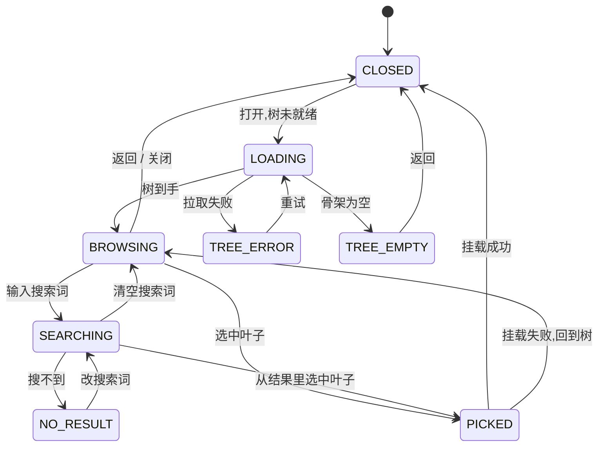

#### 交互细则 · 通用

| 项 | 规则 |
|---|---|
| 打开 | 覆盖当前屏或从底部升起,由端决定;**打开时下层内容不销毁**,关闭后回到原滚动位置 |
| 单选 | 点中即选中并关闭,**不需要再点确认** |
| 多选 | 需要确认按钮;已选项在顶部成组显示,可逐个移除 |
| 关闭 | 返回键 / 关闭按钮 / 点外部三者一致:放弃本次选择,**不留半截状态** |
| 连点保护 | 选项在提交途中禁止重复点击,规则同 [`C-BTN`](#c-btn-按钮) |
| 键盘 | 上下键移动、回车选中、`Esc` 关闭(桌面壳与 Web) |

#### 交互细则 · 树选择器(写全)

| 项 | 规则 |
|---|---|
| **层级** | 三层:章 → 节 → 考点。**只有第 3 层(叶子)可选** |
| **默认展开** | 展开到第 2 层 |
| **选中父节点** | 不可选;就地提示「挑到具体考点」,并展开它 |
| **搜索范围** | 🔴 **只搜考点名称,不搜任何内容** |
| **搜索结果形态** | 平铺的叶子列表,每条带**它所在的章节路径**;点一条既能选中,也能「在树里看它」跳回层级视图并定位 |
| **搜索防抖** | 输入停止后再检索;在途结果与当前词不匹配时丢弃 |
| **面包屑** | 常驻在顶部,显示当前所处层级路径;点面包屑任一级跳回该级 |
| **已挂载的叶子** | 置灰 + 标「已经挂过了」,**不可再选**,但可点开看它属于哪条路径 |
| **没有「新建」** | 🔴 搜不到就是没有。**不给「新建考点」、不给「就用我输入的这个词」、不给「提交一个新考点」** |
| **选中之后** | 立即执行挂载,成功走 Toast 并进入下一条;失败回到树并保留展开位置 |
| **树数据过期** | 挂载返回「树变了」时:重新拉树、回到 `BROWSING`、页内提示「考点表更新了,重新挑一次」 |
| **不做的事** | 不显示置信度、不显示相似度、不做「推荐考点」排序、不显示每个节点的覆盖百分比 |

#### 交互细则 · 日期时间选择器

| 项 | 规则 |
|---|---|
| 用途 | 只有一个:把一条记录的时间改到过去 |
| 上限 | 🔴 **不可选到未来。** 未来的日期不可点,不是选了再报错 |
| 默认值 | 此刻 |
| 粒度 | 到分钟;**不提供秒** |
| 时区 | 设备本地时区,口径见 [`P-NUM`](#p-num-数字与时间的呈现规范) |
| 快捷 | 「今天」「昨天」两个快捷项;**不做「上周」「上个月」这类区间**,记录时间是一个点不是区间 |
| 优先用原生 | 各端优先用系统原生日期选择,拿不到再用自绘 |

#### 边界值

| 项 | 上限 / 规则 | 超出时 |
|---|---|---|
| 单选选项数 | 超过一屏时出现搜索框 | —— |
| 多选已选数 | 一条记录最多挂几个考点 🚧 **未定**,见 [打标与未分类](打标与未分类.md) §六 `T-2`;**在它定下来之前,界面按「无上限但每次只挂一个」实现** | 定下来后在此加一行 |
| 树规模 | 单科目整棵树一次返回,前端不做懒加载(口径见 [看盲区](看盲区.md) §四);**多大的树会让首屏不可接受没有实测数**,见 [看盲区](看盲区.md) §六 `B-3` | 超过可接受规模时先出骨架屏,不出转圈遮罩 |
| 搜索结果条数 | 展示上限由列表虚拟滚动兜底,见 [`C-LIST`](#c-list-列表) | 顶部一行小字说明「只列了前面这些,把词写具体一点」 |
| 考点名长度 | 列表内两行截断 | 截断处可展开,或在详情里看全 |
| 日期范围 | 下限:无;上限:此刻 | 未来日期不可点 |

#### 文案模式

| 位置 | 句式模板 | ✅ 例 | ❌ 例 |
|---|---|---|---|
| 触发处未选 | 「自己挑一个」 | 「自己挑一个」 | 「请选择标签」 |
| 选中父节点 | 「挑到具体{层级名}」 | 「挑到具体考点」 | 「该项不可选」 |
| 搜不到 | 「没有叫这个的考点」+「把词写短一点试试」 | 同左 | 「没有找到?点这里新建」 |
| 已挂过 | 「已经挂过了」 | 「已经挂过了」 | 「重复标签」 |
| 树为空 | 「考点表还没建好,先记着,建好了再来挂」 | 同左 | 「暂无数据」 |
| 树拉取失败 | 「没拉到考点表」+ 重试 | 同左 | 「加载失败,请稍后重试」 |

#### 无障碍

| 项 | 要求 |
|---|---|
| 角色与状态 | 树节点朗读出「第几层、展开/收起、有几个子项、是否已选、是否不可选」 |
| 焦点 | 打开时焦点进入搜索框(树)或第一个选项(单/多选);关闭后焦点**回到触发它的那个元素** |
| 焦点陷阱 | 打开期间焦点不跑到下层内容;关闭即释放 |
| 热区 | 每个选项行 ≥ 44pt 高;展开箭头与整行是两个热区,箭头热区 ≥ 44×44pt |
| 200% 字体 | 选项行自动增高,章节路径换行显示,**不横向滚动** |
| 颜色 | 「已选」「不可选」不能只靠颜色,配文字标记 |

#### 多端差异

| 端 | 差异 |
|---|---|
| **Web / H5** | 覆盖层形式;`Esc` 关闭;搜索框获得焦点不触发页面滚动跳变 |
| **桌面壳(Tauri · macOS)** | 可用更宽的两栏(左树右结果);键盘导航为主要路径 |
| **移动 App(Tauri iOS / Android)** | 底部升起,高度不遮挡搜索框;Android 返回键 = 关闭选择器而不是退出屏 |
| **微信小程序** | 原生弹出层;树整棵传给页面前先裁剪到当前层级以控制 `setData` 体量;`textarea` 同屏时先收起 |

#### 反例

1. 给树选择器加一个「没找到?新建一个考点」。**红线,标签只能从闭集里选。**
2. 搜索结果只给考点名不给章节路径,同名考点分不清。
3. 选中父节点后自动选中它下面全部叶子。**那是刷覆盖度的入口。**
4. 树里给每个节点画进度条或百分比。**覆盖度不是学习进度。**
5. 打开选择器后返回键直接退出了整个屏,用户丢掉了正在处理的记录。
6. 日期选择器允许选未来,选完再弹一个「不能选未来」的提示。**不可选就不给点。**
7. 多选没有已选区,用户选到第八个时不知道自己选了什么。
8. 搜索每敲一个字发一次请求,慢结果覆盖快结果,列表反复跳。

---

### `C-SWITCH` 开关

#### 用途与不用于

| | |
|---|---|
| **用途** | 一个**立刻生效、可逆、二值**的状态。全产品只有两处:`S-NODE` 的「我已经会了」、`S-SET` 里的本机偏好项 |
| **不用于** | 🔴 不可逆动作(那是 [`C-DANGER`](#c-danger-危险操作确认模式));不用于需要「保存」才生效的设置;不用于提醒类开关 —— **设置里没有通知开关、提醒时间、每日目标、学习计划**(见 [设置与原图](设置与原图.md) §一) |

#### 结构

| 区块 | 必选 | 说明 |
|---|---|---|
| 标签 | ✅ | 陈述这个状态是什么,不是问句 |
| 开关本体 | ✅ | —— |
| 一行说明 | ❌ | 说清打开之后会发生什么;**不说「推荐打开」** |

🔴 **没有保存按钮。** 开关一律**立即生效**;有保存按钮的那种设置在本产品不存在。

#### 状态枚举

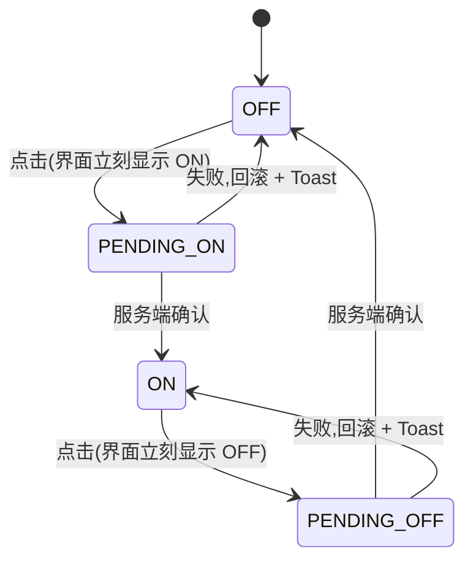

| 状态 | 屏幕上 | 可点 |
|---|---|---|
| `OFF` / `ON` | 常态 | 是 |
| `PENDING_*` | **已经显示成目标状态**(乐观更新),不转圈、不禁用 | 是(见下「途中反向点击」) |

#### 交互细则

| 项 | 规则 |
|---|---|
| **立即生效** | 点击即改变界面,同时发请求。**不等响应** |
| **失败回滚** | 请求失败:开关**滑回原状态** + `C-TOAST` 说清哪一步没成 |
| **途中反向点击** | 允许。以**最后一次点击的目标状态**为准,前一个在途请求的结果被丢弃 |
| **节流** | 连续快速切换时合并为一次请求(取最终态),**不为每次点击发一个请求** |
| **不做二次确认** | 开关是可逆的,取消一次断言不需要浮层 |
| **副作用可见** | 「我已经会了」打开后该考点从盲区榜排除 —— 这个后果要在开关旁一行小字说清,并且概览侧的解释由 [看盲区](看盲区.md) §2.3 负责 |

#### 边界值

| 项 | 规则 |
|---|---|
| 标签长度 | 一行内;超出换行,**不截断** —— 开关的语义全靠这句话 |
| 快速切换 | 无次数限制,节流合并 |
| 离线时 | 本机可判定的开关照常生效;需要服务端的断言进本地队列,界面显示目标状态,同步后不再提示 |

#### 文案模式

| 位置 | 句式模板 | ✅ 例 | ❌ 例 |
|---|---|---|---|
| 标签 | 陈述状态 | 「我已经会了」 | 「是否标记为已掌握」 |
| 说明 | 「打开后{会发生什么}」 | 「打开后这个考点不出现在下面的列表里」 | 「建议对熟悉的考点打开」 |
| 失败 | 「没标上,再试一次」 | 「没标上,再试一次」 | 「操作失败」 |

#### 无障碍

| 项 | 要求 |
|---|---|
| 角色 | 语义开关角色,朗读「已打开 / 已关闭」 |
| 焦点 | 键盘可达;`Space` 切换 |
| 热区 | 整行可点,行高 ≥ 44pt;不要求用户精准点那个小滑块 |
| 200% 字体 | 标签换行,开关本体不被挤出屏幕 |
| 颜色 | 开关状态不能只靠颜色,靠滑块位置 + 朗读文本 |

#### 多端差异

| 端 | 差异 |
|---|---|
| **Web / H5** | 语义 `checkbox` + 开关样式;`Space` 切换 |
| **桌面壳(Tauri · macOS)** | 同 Web |
| **移动 App(Tauri iOS / Android)** | 支持整行点击与滑块拖动两种;拖动到一半松手回弹到原状态 |
| **微信小程序** | 原生 `switch`;`bindchange` 与乐观更新同时进行,失败时用 `setData` 回滚 |

#### 反例

1. 加一个「保存」按钮。**开关立即生效,没有保存。**
2. 失败了不回滚,界面显示打开、服务端是关闭,下次进来又变回去。
3. 请求途中把开关禁用并转圈,用户以为卡死。
4. 给取消断言加一个「确定要取消吗」的浮层。**可逆动作不需要确认。**
5. 设置里出现「每天提醒我记录」的开关。**红线:本产品不做提醒。**
6. 开关旁写「打开后学习效率更高」。**产品不做评价、不做劝导。**

---

## 三、容器与内容件

### `C-LIST` 列表

三个变体:**普通列表**、**分组列表**(时间线按天分组、原图按时间分组)、**虚拟滚动长列表**(骨架树、大量记录)。

#### 用途与不用于

| | |
|---|---|
| **用途** | 把同构的一组条目按一个**可见的口径**排出来 |
| **不用于** | 承载「推荐」——🔴 **任何列表的排序口径必须写在屏幕上**,不写口径的排序列表会被读成产品在做学科判断(见 [看盲区](看盲区.md) §2.1) |
| **不用于** | 无限流式的消费型内容;不用于自动播放、自动加载到底的沉浸滚动 |

#### 结构

| 区块 | 必选 | 说明 |
|---|---|---|
| 排序口径行 | 排序可变时 ✅ | 一行小字写清「按什么排」,并且**可切换** |
| 分组头 | 分组列表 ✅ | 时间线用「今天 / 昨天 / {月}月{日}日」 |
| 条目 | ✅ | 条目本身的结构在 [`C-CARD`](#c-card-卡片) |
| 下拉刷新指示 | 支持刷新的列表 ✅ | —— |
| 末尾区 | ✅ | 三态之一:可加载 / 加载中 / 没有更多 |
| 空态 | ✅ | 走 [`C-EMPTY`](#c-empty-空态) |
| 错误态 | 需要网络时 ✅ | 走 [`C-ERR`](#c-err-错误态) |

#### 状态枚举

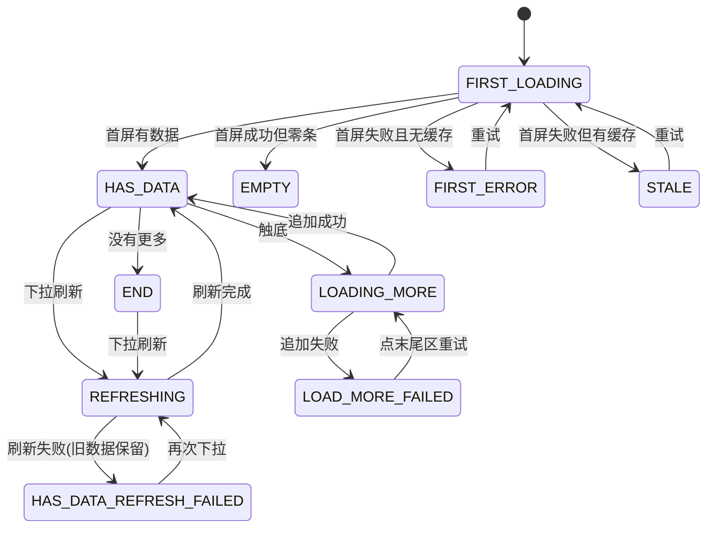

**设计要出的稿:`FIRST_LOADING`(骨架屏形状)、`HAS_DATA`、`EMPTY`、`FIRST_ERROR`、`STALE`、`LOADING_MORE`、`LOAD_MORE_FAILED`、`END`。八张,一张不少。**

#### 交互细则

| 项 | 规则 |
|---|---|
| **分页策略** | 🔴 统一为**下拉刷新 + 上拉加载**;游标分页(cursor),不用页码 |
| **触发加载更多** | 滚动接近底部时自动触发一次;失败后**不自动重试**,末尾区变成可点的重试 |
| **重复触发保护** | 在途时不再触发;同一游标不发第二次请求 |
| **下拉刷新** | 从头拉一页;🔴 **刷新失败不清空已有内容**,保留旧数据 + `C-TOAST` 说清没刷上 |
| **排序稳定性** | 🔴 同一游标序列内**排序键必须唯一且稳定**:排序键相同的条目用创建时间 + 条目 id 作为兜底次序,保证翻页不重不漏。排序切换 = 重新从头拉,不在本地重排已加载数据 |
| **切换排序** | 立刻回到列表顶部,清空已加载数据并重新拉第一页;**保留用户的筛选条件** |
| **条目高度不定** | 允许;虚拟滚动实现必须支持动态高度并缓存已测高度。**不允许为了实现虚拟滚动而强制统一行高截断内容** |
| **保持滚动位置** | 从详情返回时恢复到离开时的位置(见 [`P-NAV`](#p-nav-导航与返回)) |
| **新数据插入** | 用户正在中途浏览时,刷新得到的新条目**不顶走当前视口**;插在顶部并保持视觉位置不动 |
| **删除一条** | 就地移除 + `C-TOAST`;失败则复位到原位置,不改变滚动位置 |
| **左滑操作** | 只在时间线条目上有,只有一个动作(删除),走 [`C-DANGER`](#c-danger-危险操作确认模式) 第二档 |
| **不做的事** | 不做自动加载到底、不做「已读/未读」、不做无限循环滚动、不做条目数量的炫耀式展示 |

#### 末尾区三态

| 态 | 屏幕上 | 可点 |
|---|---|---|
| **可加载** | 不显示任何文字(自动触发),或一行「往下拉看更多」 | 是 |
| **加载中** | 一行加载指示,**不遮挡已有条目** | 否 |
| **没有更多** | 一行「就这些了」 | 否 |
| **加载失败** | 一行「没拉到后面的」+ 「再试一次」 | 是 |

#### 边界值

| 项 | 规则 | 超出时 |
|---|---|---|
| 首页拉取条数 | 由接口契约定义,本文不复述 | —— |
| 已加载总条数 | 无上限;超过一屏可流畅渲染的量级时切虚拟滚动 | —— |
| 分组内条数 | 无上限 | 分组头吸顶 |
| 条目主文本 | 列表内 2 行截断 | 展开在详情里,不在列表里就地展开长文 |
| 骨架树规模 | 见 [`C-PICK`](#c-pick-选择器) 边界值;实测上限缺口在 [看盲区](看盲区.md) §六 `B-3` | 先出骨架屏 |
| 计数展示 | 见 [`P-NUM`](#p-num-数字与时间的呈现规范) | —— |

#### 文案模式

| 位置 | 句式模板 | ✅ 例 | ❌ 例 |
|---|---|---|---|
| 排序口径 | 「按{口径}排」 | 「按近 5 年出现次数排」 | 「智能推荐排序」 |
| 末尾 | 「就这些了」 | 「就这些了」 | 「已经到底啦~」 |
| 加载更多失败 | 「没拉到后面的」 | 「没拉到后面的」 | 「加载失败」 |
| 刷新失败 | 「没刷新上,下面还是刚才的」 | 同左 | 「网络异常」 |
| 用缓存 | 「这是刚才的数据」 | 「这是刚才的数据」 | 无标记直接显示旧数据 |
| 分组头 | 「今天 / 昨天 / {月}月{日}日」 | 「8月30日」 | 「Today」 |

#### 无障碍

| 项 | 要求 |
|---|---|
| 结构语义 | 列表与列表项语义;分组头与其下条目程序上关联 |
| 朗读顺序 | 条目内按「主信息 → 次信息 → 状态」朗读,不按视觉位置乱序 |
| 焦点 | 键盘可逐条移动;进入详情再返回时焦点回到那一条 |
| 加载更多 | 追加内容后向读屏播报一次「又加载了 {n} 条」,**不打断当前朗读** |
| 热区 | 整行可点,行高 ≥ 44pt;行内二级可点元素热区 ≥ 44×44pt 且与整行区分 |
| 200% 字体 | 行自动增高;虚拟滚动的高度缓存在字体变化时失效重算 |
| 颜色 | 条目状态(如标签状态)不能只靠颜色,配文字 |

#### 多端差异

| 端 | 差异 |
|---|---|
| **Web / H5** | 下拉刷新在浏览器里与原生下拉冲突,只在可安全接管时启用,否则给一个显式的「刷新」按钮 |
| **桌面壳(Tauri · macOS)** | 无下拉刷新手势,用显式刷新按钮 + `Cmd+R` 不劫持;滚动条可见 |
| **移动 App(Tauri iOS / Android)** | 下拉刷新与左滑删除都启用;左滑与系统侧滑返回冲突时,**系统返回优先**,左滑热区从条目内侧起 |
| **微信小程序** | 用 `scroll-view` 或页面级 `onReachBottom` / `onPullDownRefresh`;长列表必须用官方虚拟列表方案控制 `setData`;左滑删除自绘 |

#### 反例

1. 刷新失败把列表清空成错误态,用户丢掉了已经在看的内容。
2. 排序键不唯一,翻页时同一条记录出现两次、另一条永远看不到。**排序稳定性缺失是最难被发现的错。**
3. 切换排序后在本地对已加载的部分重排,于是「第一页按新口径排、后面按旧口径排」。
4. 触底自动重试失败请求,弱网下把请求打成一串。
5. 为做虚拟滚动强制统一行高,长考点名被裁掉一半。
6. 列表顶部不写排序口径,「先看这些」被读成产品在推荐先学什么。
7. 加载更多时弹一个全屏转圈遮罩。
8. 从详情返回时列表回到顶部,用户要重新滚半分钟。

---

### `C-CARD` 卡片

三个变体:**记录卡片**(时间线 / 刚记完)、**考点卡片**(盲区列表行 / 考点详情头)、**档位卡片**(`S-BILL`)。

#### 用途与不用于

| | |
|---|---|
| **用途** | 把一条对象的**少量关键信息**聚在一起,并给出至多两个动作 |
| **不用于** | 🔴 承载题目内容、任何学科判断、任何评分或评价性文字 |
| **不用于** | 堆信息 —— 卡片上放不下的信息说明它该进详情屏,不是把卡片做高 |

#### 结构

| 区块 | 记录卡片 | 考点卡片 | 档位卡片 |
|---|---|---|---|
| 主标识 | 时间 | 考点名 | 档位名 |
| 主信息 | 内容摘要(2 行截断) | 「近 5 年 {n} 次」 | 价格 |
| 次信息 | 来源名 | 我的状态(三种之一) | 包含的两类次数 |
| 状态标记 | 标签状态徽标 | —— | 当前档位标记 |
| 行内动作 | ≤ 2(展开候选 / 删除) | ≤ 1 | 1(「选这个」) |
| 整卡可点 | ✅ 进详情 | ✅ 进 `S-NODE` | ❌ **只有按钮可点** |

🔴 **卡片上不出现:百分比、进度条、置信度、相似度、任何评分化的数字。**

#### 信息密度约束

| 规则 | 说明 |
|---|---|
| **一张卡片最多四行信息** | 主标识 / 主信息 / 次信息 / 状态。第五行意味着该拆屏 |
| **一张卡片最多两个可点元素**(整卡可点算其中之一) | 超过两个,用户就要在卡片内部做一次选择 |
| **状态标记只有一个** | 两个标记同时出现时,合并成一句话或只留更重要的那个 |
| **不放缩略图以外的媒体** | 原图缩略只在记录卡片上,且**只是本机图的引用** |

#### 状态枚举(记录卡片的标签状态)

标签状态机的**定义**在 [打标与未分类](打标与未分类.md) §二,本文不复述;卡片侧只定**这几种状态在卡片上的表现规则**:

| 规则 | 说明 |
|---|---|
| 每种状态在卡片上占**同一个位置**,不换位 | 位置固定,用户扫一眼就知道去哪找 |
| 「正在认」用**行内的、不打断的**指示 | 🔴 **刚记完那一刻不许弹窗要求确认标签** |
| 「没对上」与「待补」文案必须不同 | 前者是认过了确实对不上,后者是还没认 |
| 「已丢弃」弱化显示但记录仍可见 | 弱化不等于隐藏 |
| 状态变化时卡片高度尽量不变 | 变化时不得让下方卡片跳动到用户点错 |

#### 交互细则

| 项 | 规则 |
|---|---|
| **整卡可点 vs 内部可点** | 🔴 内部可点元素的热区**不与整卡热区重叠**:内部元素吃掉它自己的点击,不冒泡到整卡 |
| **内部元素热区** | ≥ 44×44pt,且与卡片边缘保持可分辨的间隔(具体间隔由设计定) |
| **长按** | 不做长按菜单。移动端的次要动作用左滑,桌面端用行内按钮 |
| **长文本截断与展开** | 列表里 2 行截断;展开只在**详情**里,不在列表里就地展开 —— 就地展开会打乱虚拟滚动的高度缓存与滚动位置 |
| **例外** | 卡片内的候选行(最多 3 个)可**就地展开**,因为它是一次性的确认动作而非阅读内容;展开时保持卡片在视口内 |
| **乐观更新** | 卡片内的确认 / 丢弃立刻改状态,失败回滚 + `C-TOAST` |
| **连点保护** | 同 [`C-BTN`](#c-btn-按钮) |
| **档位卡片** | 🔴 整卡不可点,只有「选这个」可点 —— 避免误触发下单;档位、价格、次数**全部由服务端返回,前端不硬编码**(口径见 [额度与购买](额度与购买.md) §3.1) |

#### 边界值

| 项 | 上限 | 超出时 |
|---|---|---|
| 内容摘要 | 2 行 | 截断,详情里看全 |
| 考点名 | 2 行 | 截断 |
| 来源名 | 1 行 | 中间省略,保留头尾 |
| 卡片内候选行 | 3 个 | 超出走 `S-TAG`(那里最多 5 个) |
| 原图缩略 | 单条记录最多 6 张(口径见 [记一次学习](记一次学习.md) §3.4) | 第 7 张位置提示「最多 6 张」 |
| 档位卡片数 | 由服务端返回决定 | 超过一屏时纵向滚动,不横向轮播 |
| 数字 | 见 [`P-NUM`](#p-num-数字与时间的呈现规范) | —— |

#### 文案模式

| 位置 | 句式模板 | ✅ 例 | ❌ 例 |
|---|---|---|---|
| 考点卡片我的状态 | 「你没碰过」/「你碰过 {n} 次,最近 {d} 天前」/「你标了『已经会了』」 | 三选一,不自造第四种 | 「你已掌握」 |
| 考点卡片出现次数 | 「近 {n} 年 {m} 次」 | 「近 5 年 7 次」 | 「重点考点」「必考」 |
| 记录卡片空内容 | 「(语音)」「(图片)」 | 同左 | 「无内容」 |
| 档位卡片 | 「{档位名} · {价格} · 含{两类次数}」 | —— | 「限时优惠」「最划算」「立省 X 元」 |
| 状态徽标 | 「已对上 {n} 个考点」/「待补」/「没对上」/「正在认」 | 同左 | 「识别失败」 |

🔴 **档位卡片上不出现:限时、倒计时、原价划线、「最受欢迎」、「立省」、自动续费。**

#### 无障碍

| 项 | 要求 |
|---|---|
| 朗读 | 整卡作为一个可点元素朗读时,把四行信息连成一句;内部可点元素单独可达并单独朗读 |
| 焦点 | 整卡与内部元素在 Tab 序里都出现,顺序为「整卡 → 内部元素」 |
| 热区 | 内部元素 ≥ 44×44pt 且不与整卡热区冲突 |
| 200% 字体 | 卡片自动增高;信息不重叠、不横向溢出;四行信息在极端字号下允许换行成更多视觉行 |
| 颜色 | 标签状态、当前档位标记不能只靠颜色 |
| 图片 | 原图缩略必须有替代文本,内容为「{时间}的图片」,**不描述图片内容** |

#### 多端差异

| 端 | 差异 |
|---|---|
| **Web / H5** | 悬停时不额外弹出信息层(那会变成气泡引导) |
| **桌面壳(Tauri · macOS)** | 宽屏下卡片可并排;并排时**每行卡片数变化不改变信息量** |
| **移动 App(Tauri iOS / Android)** | 左滑删除;缩略图从本机读取 |
| **微信小程序** | 🔴 **不显示原图缩略** —— 小程序不开原图通道(见 [`多端选型与端矩阵`](../../technical/多端选型与端矩阵.md));该位置显示「(图片)」文字占位 |

#### 反例

1. 点卡片上的「删除」结果整卡跳进了详情。**内部元素冒泡到整卡是最常见的实现错。**
2. 档位卡片整卡可点,用户滑动时误触发下单。
3. 卡片上加一行「你在这个考点上表现不错」。**产品不做评价。**
4. 记录卡片上加「相似度 62%」的候选排序。**红线,不显示置信度。**
5. 刚记完弹一个浮层要求确认标签,把「再记一条」的成本抬高。
6. 在列表里就地展开长内容,虚拟滚动高度全乱,用户滚回去找不到位置。
7. 档位卡片上写「限时特惠,还剩 2 小时」。**红线:不做促销机制。**
8. 缩略图的替代文本写成图片里的文字。**那等于把内容搬进了替代文本。**

---

### `C-DISC` 折叠 面包屑 Tab

三个小组件放在一起,因为它们解决同一件事:**在不换屏的前提下改变当前看到的是哪一部分**。

#### 用途与不用于

| | |
|---|---|
| **折叠** | 用于树的层级展开、说明性长文的收起。**不用于隐藏关键动作** —— 关键动作不许藏在折叠里 |
| **面包屑** | 用于**树选择器内部**与考点详情的章节路径显示。**它不是导航栈** —— 页面级返回走 [`P-NAV`](#p-nav-导航与返回) |
| **Tab / 科目切换器** | 用于同一屏内的平行视图切换(时间线的「全部 / 没对上的」、盲区的科目切换) |
| **都不用于** | 承载未读计数、红点、新内容提示。🔴 **Tab 上永远没有角标** |

#### 结构与规则

| 组件 | 规则 |
|---|---|
| **折叠** | 折叠头必须自己说清里面是什么;**默认展开到第 2 层**(骨架树);展开状态在同一次会话内保持,离屏再回来不重置 |
| **面包屑** | 常驻顶部;每一级可点,点了回到该级;**最后一级是当前位置,不可点**;层级过深时省略中间层,保留首尾 |
| **Tab** | 🔴 **只有一个选项时不显示切换器** —— 一个 Tab 的切换器是纯噪声(口径见 [看盲区](看盲区.md) §2.1 的科目切换) |
| **Tab 数量** | 时间线的筛选**只有两个:全部 / 没对上的**,不加第三个;科目切换器数量由用户已有记录涉及的科目决定 |
| **Tab 切换** | 切换即重新拉该视图的第一页;**各 Tab 的滚动位置分别保持** |
| **Tab 不做的事** | 不做左右滑动切换 Tab(与列表左滑删除冲突);不做 Tab 上的数量角标;不做「新」标记 |

#### 状态枚举(Tab)

| 状态 | 屏幕上 |
|---|---|
| `SINGLE` | **不渲染切换器**,直接显示唯一那个视图 |
| `IDLE` | 当前项高亮(且不只靠颜色:配下划线或形状) |
| `SWITCHING` | 目标视图出 [`C-SKEL`](#c-skel-骨架屏),**当前视图不清空到白屏** |
| `SWITCHED` | 新视图就位,滚动位置为该 Tab 上次的位置 |

#### 交互细则

| 项 | 规则 |
|---|---|
| 切换防抖 | 快速连点不同 Tab 时,只保留最后一次的请求结果 |
| 折叠动作幂等 | 连点折叠头不产生请求(树是一次性返回的) |
| 面包屑点击 | 回到该级,**保留搜索词吗?不保留** —— 点面包屑等于退出搜索回到浏览 |
| 深链进入 | 从深链进入考点详情时,面包屑要能显示完整路径,即使用户没走过上层 |
| 键盘 | 左右方向键在 Tab 之间移动,回车激活(桌面壳与 Web) |

#### 边界值

| 项 | 上限 | 超出时 |
|---|---|---|
| Tab 数量 | 一屏放得下的量 | 超出时横向滚动,**不做「更多」下拉** |
| Tab 文字 | ≤ 5 个汉字 | 改文案 |
| 面包屑层级 | 3 层(章 / 节 / 考点) | 窄屏时省略中间层,保留首尾 |
| 折叠内条目 | 无上限 | 交给虚拟滚动 |

#### 文案模式

| 位置 | ✅ 例 | ❌ 例 |
|---|---|---|
| 时间线筛选 | 「全部」「没对上的」 | 「待处理(3)」 |
| 科目切换 | 科目名原样 | 「我的科目 ▾」 |
| 折叠头 | 「按章看全部」 | 「点击展开更多精彩内容」 |

#### 无障碍

| 项 | 要求 |
|---|---|
| 角色 | Tab 用标签页语义,朗读「第 2 项,共 2 项,已选中」;折叠朗读展开/收起状态 |
| 焦点 | 切换 Tab 后焦点留在 Tab 上,由播报告知内容已更新,**不把焦点扔进内容区** |
| 热区 | Tab 项 ≥ 44×44pt;折叠头整行可点 |
| 200% 字体 | Tab 允许换行或横向滚动,**不缩字号** |
| 颜色 | 选中态不能只靠颜色 |

#### 多端差异

| 端 | 差异 |
|---|---|
| **Web / H5** | Tab 状态进 URL 查询参数,刷新后保持 |
| **桌面壳(Tauri · macOS)** | 同 Web;宽屏下面包屑与树可并排常驻 |
| **移动 App(Tauri iOS / Android)** | 不启用左右滑动切换 Tab |
| **微信小程序** | 原生 tab 组件或自绘;**页面栈深度有限**,面包屑跳级要用重定向而不是不断压栈 |

#### 反例

1. 只有一个科目时仍然显示科目切换器。**明确禁止。**
2. Tab 上加「没对上的 (3)」这样的计数角标。**那是未读计数的变体,红线。**
3. 切换 Tab 时把内容区清成白屏再转圈。
4. 把「删除」这类动作藏进折叠里。
5. 面包屑做成返回栈,点了以后行为与系统返回不一致,用户彻底迷路。
6. Tab 左右滑切换,与时间线的左滑删除打架,用户一滑就删了记录。
7. 折叠状态每次离屏都重置,用户每次回来都要重新展开到自己那一章。

---

## 四、反馈件

🔴 **只有这一节里的四个东西。** `C-TOAST` / `C-INLINE` / `C-SHEET` 是三种反馈形态本身,`C-DANGER` 是它们的一种用法模式。
**任何新的反馈形态提案先回答:它是这三种里的哪一种?答不上来就是第四种,不做。**

### 选哪一种:一张判定表

| 问 | 答 | 用哪个 |
|---|---|---|
| 用户需要做什么吗? | 不需要,已经成了 | `C-TOAST` |
| 用户需要做什么吗? | 需要改**某一处输入** | `C-INLINE` |
| 用户需要做什么吗? | 必须在两条路里选一次,或动作不可逆 | `C-SHEET` |
| 整屏内容都拿不到? | 是 | 不是反馈件,是状态件:`C-ERR` / `C-EMPTY` / `C-LIMIT` |

---

### `C-TOAST` Toast

#### 用途与不用于

| | |
|---|---|
| **用途** | 🔴 **只用于「已经成功,而且用户不需要做任何事」。** 一条,2 秒,自动消失 |
| **不用于** | 🔴 **报错。** 错误要么是页内提示(用户要改某一处),要么是错误态(整块拿不到),要么是浮层(要选一次)。**Toast 报错等于把错误藏起来** |
| **不用于** | 承载动作(不可点、没有「撤销」按钮 —— 需要撤销的动作说明它该走浮层确认);不用于展示进度;不用于提醒 |

#### 结构

| 区块 | 必选 | 说明 |
|---|---|---|
| 一句话 | ✅ | 陈述已经发生的事实 |
| 图标 | ❌ | 有也只能是装饰,不承载信息 |
| 动作 | 🔴 **禁止** | Toast 不可点 |

#### 状态枚举

不需要状态图。只有两个状态:**显示中**(2 秒)与**不存在**。

#### 交互细则

| 项 | 规则 |
|---|---|
| **停留** | 2 秒(口径来自 [`总纲`](INDEX.md) §2.2),到点自动消失 |
| **同时最多一条** | 🔴 不排队成串、不堆叠 |
| **连续触发的合并规则** | ① 内容相同:重置计时,**不新增一条**;② 内容不同:新的**立刻替换**旧的并重新计时;③ 极短时间内的批量成功(如批量补录 50 条):**合并成一条带计数的**,不是 50 条 |
| **不可点** | 点击穿透到下层内容 |
| **不阻塞** | 不遮挡当前操作区与主按钮;出现时下层内容可继续操作 |
| **屏幕位置固定** | 全产品一个位置,不因屏而异(具体位置由设计定) |
| **离屏时** | 触发 Toast 的那一屏已经被退出时,**不显示**;不跨屏追着用户 |
| **失败时不发** | 任何失败路径都不发 Toast(除了乐观更新回滚这一种,见下) |
| **乐观更新回滚是唯一例外** | 就地改变失败并回滚时,用一条 Toast 说清「没成」——因为此时用户看到的界面已经变回去了,没有可指的输入处,也不该拦一个浮层 |

#### 边界值

| 项 | 上限 | 超出时 |
|---|---|---|
| 文案长度 | ≤ 15 个汉字 | 改文案;说不完的说明它不该是 Toast |
| 同时数量 | 1 | 替换 |
| 触发频率 | 无限制,但按合并规则收敛 | —— |
| 200% 字体下 | 允许换到两行 | 仍不超过屏宽 |

#### 文案模式

**句式模板:`已 + 动词` 或 `动词 + 了`。陈述完成,不评价,不劝导。**

| ✅ 例 | ❌ 例 | 为什么 |
|---|---|---|
| 「已记下」 | 「记录成功!」 | 不用感叹号 |
| 「记下了」 | 「太棒了,又记了一条」 | 不夸奖用户 |
| 「已对上」 | 「打标成功」 | 不用内部术语 |
| 「已登录」 | 「欢迎回来~」 | 不寒暄 |
| 「已到账」 | 「购买成功,感谢支持」 | 不致谢、不促销 |
| 「已复制」 | 「复制成功,快去问 AI 吧」 | 不指挥用户下一步 |
| 「标了『已经会了』」 | 「已标记掌握」 | 禁用词 |
| 「没标上,再试一次」(回滚场景) | 「操作失败」 | 要说清哪一步没成 |

#### 无障碍

| 项 | 要求 |
|---|---|
| 播报 | 用礼貌级别的实时区域播报,**不打断读屏当前朗读** |
| 焦点 | 🔴 **绝不抢焦点** |
| 时长 | 屏幕阅读器或系统「减少动态效果 / 延长提示时间」开启时,停留时间跟随系统设置延长 |
| 颜色 | 成功与否不能只靠颜色,文案本身说清 |
| 200% 字体 | 换行显示,不裁切 |

#### 多端差异

| 端 | 差异 |
|---|---|
| **Web / H5** | 自绘;实时区域播报 |
| **桌面壳(Tauri · macOS)** | 🔴 **不使用系统通知中心** —— 系统通知会在应用外弹出,那是提醒机制;Toast 只在窗口内 |
| **移动 App(Tauri iOS / Android)** | 🔴 **不使用系统推送、不使用状态栏通知**;只在应用内显示 |
| **微信小程序** | 用 `wx.showToast` 或自绘;🔴 **`mask` 必须为 false**(遮罩会阻塞下层操作,违反「不阻塞」);`duration` 对齐 2 秒 |

#### 反例

1. 用 Toast 报错:「网络异常」一闪而过,用户没看清、也不知道该干什么。**最常见也最贵的错。**
2. Toast 上加「撤销」按钮。**Toast 不可点** —— 需要撤销说明该在动作前用浮层问一次。
3. 批量补录 50 条弹 50 条 Toast,屏幕被刷屏 100 秒。
4. Toast 停留 5 秒并带遮罩,用户点不了下面的按钮。
5. Toast 抢焦点,读屏用户当前朗读被打断,回不到原位置。
6. 用系统通知发 Toast,应用没打开也弹。**那是提醒,红线。**
7. Toast 文案写「今天已经记了 5 条,继续保持」。**那是激励机制。**

---

### `C-INLINE` 页内提示

#### 用途与不用于

| | |
|---|---|
| **用途** | 🔴 **用户要改「这一处」输入或「这一处」选择时用。** 位置紧贴出错的那一处 |
| **不用于** | 整块或整屏拿不到内容(那是 `C-ERR`);不用于成功反馈;不用于需要用户做选择的场合 |
| **也用于** | 非错误的**就地说明**:「这条没能对上任何考点」是一个正常结果,不是失败,但它同样紧贴那一处 |

#### 结构

| 区块 | 必选 | 说明 |
|---|---|---|
| 一句话 | ✅ | 说清**这一处**怎么了、要怎么改 |
| 位置 | ✅ | 紧贴那一处的**正下方**;是卡片内的问题就在卡片内 |
| 行内动作 | ❌ | 至多一个文本按钮(如「点重发」),且必须与这一处相关 |
| 占位 | ✅ | 提示位**预留高度**,出现与消失不引起下方内容跳动 |

#### 状态枚举

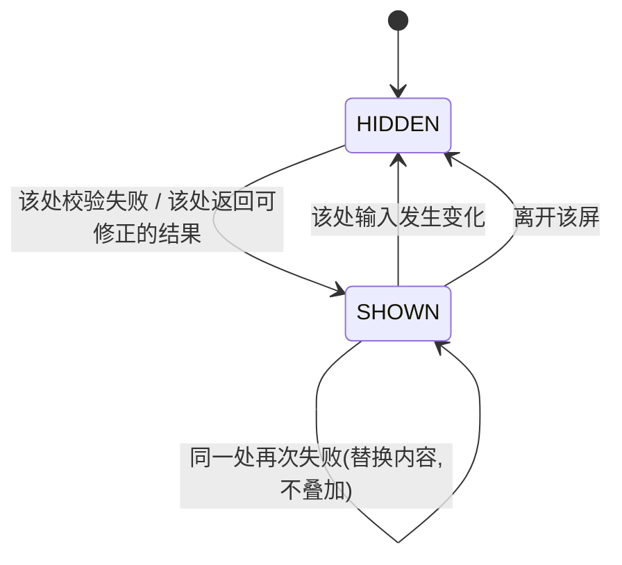

#### 交互细则

| 项 | 规则 |
|---|---|
| **出现时机** | 失焦校验失败时,或提交后服务端返回了「这一处可以改」的结果 |
| **消失条件** | 🔴 **该处输入发生变化的第一时刻**,不等再次失焦、不靠计时 |
| **不叠加** | 同一处同时只有一条;新的替换旧的 |
| **多条同时出现的优先级** | 见下表 |
| **不滚动** | 出现时**不自动滚动页面**;若该处不在视口内,则滚动到它并聚焦 |
| **保留输入** | 出现提示时用户已输入的内容一律保留 |
| **带倒计时的提示** | 秒数以服务端返回的 `retryAfter` 为准,前端不自己算 —— 这是能力约束的说明,**不是制造紧迫感** |

#### 多条同时出现时的优先级

**同一屏可以有多条页内提示(不同的「一处」各一条),但焦点与滚动只服务一条。** 按下表选那一条:

| 优先级 | 类型 | 例 |
|---|---|---|
| 1(最高) | 阻断提交的必填/格式问题,且**在视觉上最靠前**的那一处 | 手机号非法 |
| 2 | 阻断提交的必填/格式问题,靠后的那些 | 协议未勾选 |
| 3 | 服务端返回的可修正结果 | 验证码不对 |
| 4 | 就地的非错误说明 | 「这条没能对上任何考点」 |

**规则:全部同时显示;自动滚动与聚焦只去优先级最高的那一条。** 读屏播报也只播报那一条,其余靠焦点移动时读出。

#### 边界值

| 项 | 上限 | 超出时 |
|---|---|---|
| 单条长度 | ≤ 20 个汉字 | 说不清就说明它该是别的形态 |
| 同屏条数 | 无硬上限 | 超过 3 条说明这一屏的表单该拆 |
| 行内动作 | ≤ 1 | —— |
| 剩余次数类提示 | 由服务端给次数,前端只填 | 次数为 0 时切换到锁定文案 |

#### 文案模式

**句式模板:`{这一处}{怎么了}` + 可选的 `{怎么改}`。**

| ✅ 例 | ❌ 例 | 为什么 |
|---|---|---|
| 「手机号看起来不对」 | 「格式错误」 | 要说清是哪一处 |
| 「验证码不对,还能试 {n} 次」 | 「验证失败,请重试」 | 要给可用信息 |
| 「验证码过期了,重新发一条」 | 「code expired」 | 不出现英文 |
| 「发得太频繁了,{n} 秒后可以再试」 | 「请求过于频繁,请稍后重试」 | 不说没信息量的话 |
| 「这条没能对上任何考点」 | 「识别失败」 | 这是正常结果,不是失败 |
| 「已经挂过了」 | 「重复操作」 | 说人话 |
| 「写不下了,已经记到这里」 | 「超出长度限制」 | 说清已经发生了什么 |
| 「考点表更新了,重新挑一次」 | 「数据版本冲突」 | 不暴露内部概念 |

#### 无障碍

| 项 | 要求 |
|---|---|
| 关联 | 与出错的那个输入框程序上关联,聚焦时被读出 |
| 播报 | 出现时用断言级别播报一次(优先级最高的那条) |
| 焦点 | 提交失败后焦点移到优先级最高的那一处输入框 |
| 颜色 | 🔴 不能只靠红色;必须有文字,且图标不作为唯一载体 |
| 200% 字体 | 换行显示,预留位随之增高,**不覆盖下方内容** |

#### 多端差异

| 端 | 差异 |
|---|---|
| **Web / H5** | 与输入框程序关联;提交失败后聚焦第一处错误 |
| **桌面壳(Tauri · macOS)** | 同 Web;输入法候选窗弹出时不触发失焦校验,因此提示不会误弹 |
| **移动 App(Tauri iOS / Android)** | 软键盘遮挡时整屏上推,保证提示与主按钮同时可见 |
| **微信小程序** | 自绘在 `input` 下方;🔴 **不用 `wx.showToast` 代替页内提示** |

#### 反例

1. 用 Toast 代替页内提示:验证码错了闪一下就没了,用户不知道还能试几次。
2. 提示出现时把下方按钮顶走,用户点空。**预留位缺失。**
3. 提示三秒后自动消失,用户还没改完就找不到自己错在哪。**消失条件只有一个:该处输入变化。**
4. 提示只说「错误」,不说是哪一处。
5. 多条提示同时抢滚动,页面来回跳。
6. 把「这条没能对上任何考点」写成红色错误提示。**它是正常结果,不是失败。**
7. 页内提示里写「请稍后重试」或带上错误码。**红线。**

---

### `C-SHEET` 浮层

两类:**确认型**(必须选一次)与**信息型**(说明一件事,只有一个退出)。

#### 用途与不用于

| | |
|---|---|
| **用途** | 🔴 **不可逆、或必须二选一。** 用户选完才走 |
| **不用于** | 成功反馈、错误播报、新手引导、功能介绍、评分邀请、推荐付费。🔴 **没有引导蒙层、没有新手教程弹窗** |
| **不用于** | 承载一个完整的子流程 —— 需要多步的走屏(如 `S-MERGE` 是两屏两步,不是一个多页浮层) |

#### 结构

| 区块 | 确认型 | 信息型 |
|---|---|---|
| 标题 | ✅ 一句话说清要决定什么 | ✅ |
| 正文 | ❌ 至多两行说清后果 | ✅ |
| 主动作 | ✅ **复述那个动作**(「删掉」「合并」) | ❌ |
| 次动作 | ✅ 退路(「再想想」「不删」) | ✅ 唯一按钮(「知道了」) |
| 关闭按钮 | 可逆动作 ✅ / 不可逆动作 ❌ | ✅ |

**按钮顺序与主次:**

| 规则 | 说明 |
|---|---|
| 🔴 **危险动作的确认按钮不是视觉主按钮** | 退路才是默认落点;确认按钮用危险样式,但不抢主位置 |
| 顺序 | 各端跟随平台惯例(iOS 与 Android 的取消/确认左右相反),**但「哪个是默认落点」全产品一致:永远是退路** |
| 数量 | 确认型恰好 2 个;信息型恰好 1 个。**没有三按钮浮层** |
| 文案 | 主动作复述动词,不写「确定」;退路写「再想想」「不删」,不写「取消」 |

#### 状态枚举

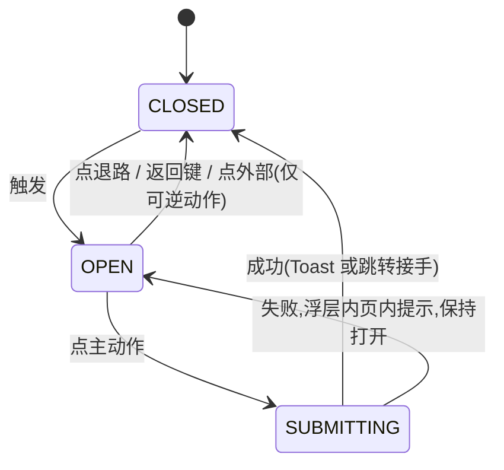

#### 交互细则

| 项 | 规则 |
|---|---|
| **不许叠加** | 🔴 **同一时刻最多一个浮层。** 已有浮层时新的请求排队等待,或直接丢弃(由触发方决定,默认丢弃) |
| **点外部关闭** | 🔴 **不可逆操作不许点外部关闭**;可逆操作允许,等同于点退路 |
| **返回键** | 等同于点退路,**永远能退出**;不可逆浮层也能被返回键退出 —— 退出 = 不执行,这不是「不可返回」 |
| **提交中** | 主动作进加载态,退路仍可点(点了 = 取消等待并关闭,但**不撤销已发出的请求**;结果由幂等保证不重复,见 [`P-RETRY`](#p-retry-重试与幂等)) |
| **失败** | 浮层**保持打开**,在浮层内用页内提示说清哪一步没成;不关掉浮层再弹一个错误 |
| **连点保护** | 同 [`C-BTN`](#c-btn-按钮) |
| **不自动关闭** | 没有定时自动关闭的浮层 |
| **不承载输入** | 例外只有一处:注销的打字确认(见 [`C-DANGER`](#c-danger-危险操作确认模式)) |
| **滚动锁定** | 浮层打开时下层不滚动;浮层内内容超高时浮层内部滚动 |

#### 边界值

| 项 | 上限 | 超出时 |
|---|---|---|
| 标题 | ≤ 20 个汉字 | 改文案 |
| 正文 | ≤ 2 行 | 说不完就说明该走一屏,不是浮层 |
| 按钮 | 确认型 2 个 / 信息型 1 个 | 没有第三个 |
| 同时打开数 | 1 | 后来的丢弃 |
| 浮层内高度 | 不超过一屏 | 内部滚动,**按钮固定可见** |

#### 文案模式

**句式模板(确认型):标题 = `{后果}` 的陈述,不是「确定要…吗」。**

| ✅ 例 | ❌ 例 |
|---|---|
| 「删了就没了,和它一起的标签也会删掉」+「删掉」/「不删」 | 「确定删除吗?」+「确定」/「取消」 |
| 「合并后不能拆开,继续吗?」+「合并」/「再想想」 | 「是否继续?」+「是」/「否」 |
| 「删了就没了,和它一起的记录还在」+「删掉」/「不删」 | 「确认删除该图片?」 |
| 「这台设备上的数据会被清空,云端的不动」+「清空」/「不清」 | 「危险操作!请谨慎!」 |

🔴 **确认型浮层的标题必须写出「会失去什么」与「不会失去什么」两件事。** 只写「会失去什么」用户会过度恐慌,只写动作用户不知道后果。

#### 无障碍

| 项 | 要求 |
|---|---|
| 角色 | 对话框语义;打开时朗读标题与正文 |
| 焦点 | 打开时焦点进入浮层(落在**退路**上);焦点陷阱在浮层内;关闭后焦点**回到触发它的那个元素** |
| 键盘 | `Esc` = 退路(可逆动作);不可逆动作的 `Esc` 同样 = 退路(不执行) |
| 热区 | 按钮 ≥ 44×44pt |
| 200% 字体 | 浮层内滚动,**按钮不被挤出屏幕** |
| 颜色 | 危险动作不能只靠红色,文案本身说清后果 |

#### 多端差异

| 端 | 差异 |
|---|---|
| **Web / H5** | 自绘对话框;浏览器返回键 = 关闭浮层而不是退到上一页(浮层打开时压一个历史项) |
| **桌面壳(Tauri · macOS)** | 窗口内浮层,**不用系统模态窗**;`Esc` 关闭 |
| **移动 App(Tauri iOS / Android)** | Android 物理返回 = 退路;iOS 侧滑手势在浮层打开时不生效 |
| **微信小程序** | 🔴 **不用 `wx.showModal`** —— 它的按钮文案与顺序不受控,做不到「主动作复述动词、退路是默认落点」。自绘;打开前先收起 `textarea` |

#### 反例

1. 浮层套浮层:删除确认里再弹一个错误浮层。**同一时刻最多一个。**
2. 用浮层做新手引导。**红线:没有引导蒙层、没有教程弹窗。**
3. 不可逆操作允许点外部关闭,用户误触后不知道自己做了什么。
4. 用浮层报网络错误。
5. 按钮写「确定 / 取消」,用户不知道自己在确定什么。
6. 浮层里塞一个完整表单,内容超屏,按钮被挤到看不见。
7. 提交失败后浮层直接关掉,用户以为成功了。
8. 浮层打开时返回键退出了整个屏,用户丢了正在做的事。
9. 刚记完弹浮层要确认标签。**打断记录节奏,明确禁止。**

---

### `C-DANGER` 危险操作确认模式

**三档,写死每一档用在什么场景。** 定档看两件事:**能不能撤销**、**丢的是不是用户产生的数据**。

| 档 | 什么时候用 | 界面 | 全产品的用例 |
|---|---|---|---|
| **一档 · 直接执行** | 可逆,且撤销成本低 | 无确认,就地改变 + `C-TOAST`;失败回滚 | 「我已经会了」的开关与取消、丢弃候选标签(可在卡片内「看看丢掉的」找回)、跳过一条 |
| **二档 · 浮层确认一次** | 不可逆,但影响范围明确且有限 | `C-SHEET` 确认型,标题写清「会失去什么 + 不会失去什么」 | 删一条记录、删一张原图、清理留存区、清空这台设备上的数据、账号合并的第二步 |
| **三档 · 打字确认** | 不可逆,且影响是**整个账号**的全部数据 | `C-SHEET` 确认型 + 一个输入框,要求打出指定短语才能点主动作 | 🔴 **全产品只有一处:注销账号** |

#### 三档的定档判据

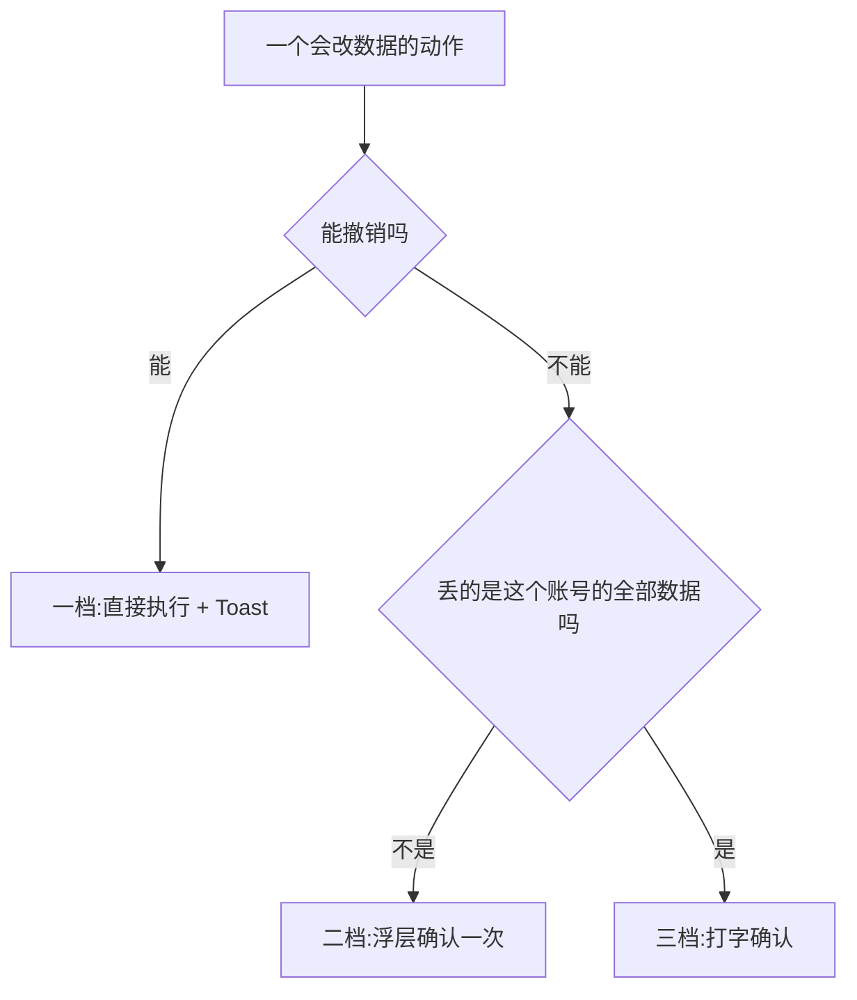

⚠️ **不许自造第四档。** 「连点两次」「长按三秒」「滑动确认」都不是本产品的确认方式 —— 它们把不可逆动作变成了手速游戏。

#### 打字确认的细则(仅注销)

| 项 | 规则 |
|---|---|
| 要打的短语 | 一个固定的中文短语,在浮层里**原样显示**给用户看着抄 |
| 匹配 | 完全一致才启用主动作;**去掉首尾空白后比较**,不做模糊匹配 |
| 主动作 | 未匹配时禁用,并在旁边说清「照着上面那句话打一遍」 |
| 输入框 | 唯一允许出现在浮层里的输入框 |
| 前置 | 打字确认之前必须先给出「先把数据导出」的入口(导出永远免费不限次数) |
| 后续 | 注销的具体流程与冷静期在 [登录与账号](登录与账号.md) §七,本文不复述 |

#### 二档浮层的强制内容

| 必须写清 | 例 |
|---|---|
| 会失去什么 | 「删了就没了,和它一起的标签也会删掉」 |
| **不会**失去什么 | 「和它一起的记录还在」「云端的不动」 |
| 影响的量级(批量时) | 「会清掉 {n} 张,腾出 {size}」 |

#### 文案模式

| ✅ 例 | ❌ 例 |
|---|---|
| 「删了就没了,和它一起的标签也会删掉」 | 「此操作不可恢复,请谨慎操作!」 |
| 「会清掉 {n} 张,腾出 {size}」 | 「确认清理?」 |
| 「照着上面那句话打一遍」 | 「请输入验证文本」 |

#### 无障碍

| 项 | 要求 |
|---|---|
| 焦点默认落点 | 🔴 永远是**退路**,不是危险动作 |
| 朗读 | 危险动作的按钮朗读时带上后果(如「删掉,删了就没了」) |
| 颜色 | 危险不能只靠红色 |
| 打字确认 | 输入框有标签;要抄的短语可被读屏读出并可复制 |

#### 多端差异

| 端 | 差异 |
|---|---|
| **Web / H5** | 二档与三档均为自绘浮层 |
| **桌面壳(Tauri · macOS)** | 同上;**不用系统级危险确认对话框** |
| **移动 App(Tauri iOS / Android)** | 左滑删除后仍要走二档浮层,左滑本身不是确认 |
| **微信小程序** | 🔴 小程序不做注销(三档);二档自绘 |

#### 反例

1. 删除记录只靠左滑,滑完直接删。**左滑不是确认。**
2. 给「取消断言」加浮层确认。**一档的动作被抬到二档,交互变重且毫无收益。**
3. 二档浮层只写「不可恢复」,不写会失去什么、不会失去什么。
4. 注销之外的地方也要求打字确认。**三档全产品只有一处。**
5. 用「长按三秒删除」代替浮层。
6. 危险浮层的焦点默认落在「删掉」上,回车直接删。
7. 注销浮层里不给导出入口,用户只能在「丢数据」和「不注销」之间选。

---

## 五、状态件

**四种态的定义在 [`总纲`](INDEX.md) §2.1,本文给它们的组件级规格。** 外加一个 `C-OFFLINE`,它不是第五种态 —— 它是一条常驻细条,与四种态正交,任何态下都可能同时出现。

### 每一屏要出几张稿

| 屏的性质 | 必须出的态 |
|---|---|
| 不需要网络(`S-HOME` `S-REC` `S-SET` `S-RAW`) | 空态 + 离线细条 |
| 需要网络(`S-BLIND` `S-NODE` `S-TL` 云端 `S-EXP` `S-BILL`) | 骨架屏 + 空态 + 错误态 + 陈旧数据态 |
| 需要骨架(`S-BLIND` `S-NODE` `S-TAG`) | 上面全部 + 骨架为空的空态 |
| 需要登录或额度(`S-BILL` `S-EXP` 代发 `S-ACC`) | 上面全部 + 受限态 |

---

### `C-SKEL` 骨架屏

#### 用途与不用于

| | |
|---|---|
| **用途** | 首屏或某一块内容在请求途中的占位 |
| **不用于** | 🔴 **不用于已经有内容的区域。** 已有内容时刷新走「保留旧内容 + 局部指示」,不换成骨架 |
| **不用于** | 提交动作的等待(那是按钮的加载态);不用于列表的加载更多(那是末尾区) |

#### 结构与出现规则

| 项 | 规则 |
|---|---|
| **形状** | 🔴 **必须保持最终布局的形状**:几行、几块、什么层级,与数据到手后一致 |
| **出现时机** | 请求发出后等待一小段;**在这段时间内请求就回来了,就不出骨架屏** —— 闪一下的骨架比等一下更糟。阈值见 [`P-TIME`](#p-time-加载与超时的统一阈值表) |
| **最短停留** | 一旦出现,至少停留到不产生闪烁的程度再切换到内容,阈值见 [`P-TIME`](#p-time-加载与超时的统一阈值表) |
| **不遮罩** | 🔴 **不允许整屏 loading 遮罩盖住已有内容** |
| **不转圈** | 骨架屏里没有转圈指示 |
| **数量** | 列表骨架给固定几行(与首屏预期条数同量级),不给一屏满屏 |
| **动效** | 有没有微光由设计定;**「减少动态效果」开启时必须停止动效** |

#### 状态枚举

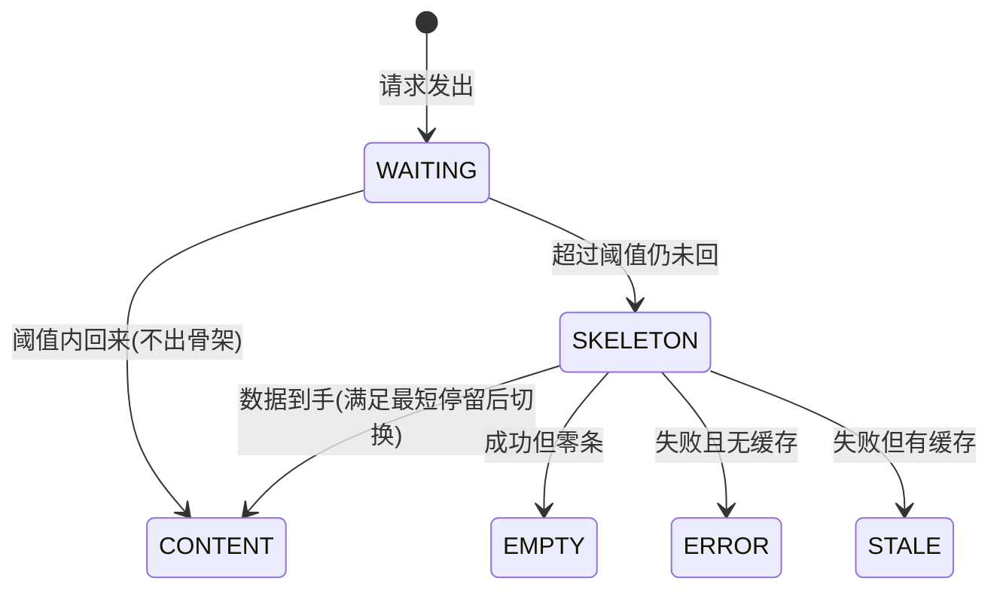

#### 边界值与降级

| 情况 | 表现 |
|---|---|
| 请求很快回来 | 不出骨架,直接出内容 |
| 请求慢 | 骨架 → 内容 |
| 请求超时 | 骨架 → 错误态(有缓存则 → 陈旧数据态) |
| 局部块慢、整屏已就绪 | 只在那一块出骨架,**其余区域正常可用** |
| 覆盖层正在重算 | 🔴 **不出骨架,也不显示上一次的数字** —— 数字位换成占位块 + 状态条一行小字「正在重新算」(口径真源 [看盲区](看盲区.md) §2.5 / §2.7.5,逐项规定以那里为准)。⚠️ 本行 2026-09-03 改正:此前写「显示上一次的数字 + 一行小字」,与它自己指的真源相反 —— §2.7.5 把「旧值 + 小字」逐条判为违规打折 |

#### 文案模式

**骨架屏没有文案。** 它不写「加载中」「玩命加载中」;需要说话的场合说明它不是骨架屏而是别的态。
唯一例外是**局部重算**的那一行小字,文案由逐屏规格给(如「正在重新算」)。

#### 无障碍

| 项 | 要求 |
|---|---|
| 播报 | 骨架出现时向读屏播报一次「正在加载」,内容到手后播报一次「已加载」;**中间不重复播报** |
| 焦点 | 骨架块**不可聚焦**,不进 Tab 序 |
| 动效 | 跟随系统「减少动态效果」设置停止 |
| 200% 字体 | 骨架块高度跟随字体缩放,保证与最终内容形状仍然一致 |

#### 多端差异

| 端 | 差异 |
|---|---|
| **Web / H5** | 自绘;首屏可用静态骨架直出减少白屏 |
| **桌面壳(Tauri · macOS)** | `web/dist` 内嵌,首屏无网络等待,**只有数据请求会出骨架** |
| **移动 App(Tauri iOS / Android)** | 同上 |
| **微信小程序** | 自绘骨架;🔴 **不用 `wx.showLoading`** —— 它是整屏遮罩 |

#### 反例

1. 用整屏半透明遮罩 + 转圈代替骨架。**明确禁止。**
2. 骨架形状与最终布局不一致,数据到手后整屏重排,用户点错。
3. 请求 100 毫秒就回来了,骨架闪一下,屏幕像抽搐。
4. 下拉刷新时把已有列表换成骨架,用户丢失当前位置。
5. 骨架里写「加载中,请稍候」。
6. 骨架块可被 Tab 聚焦,键盘用户在一堆占位块里穿行。
7. 覆盖层重算时清空数字出骨架,用户以为数据没了。

---

### `C-EMPTY` 空态

#### 用途与不用于

| | |
|---|---|
| **用途** | 请求成功但**没有数据** |
| **不用于** | 请求失败(那是 `C-ERR`);不用于缺登录/额度/骨架(那是 `C-LIMIT`) |

#### 结构

🔴 **两件东西,缺一不可:一句话说清为什么空 + 一个能立刻做的动作。**

| 区块 | 必选 | 说明 |
|---|---|---|
| 一句话 | ✅ | 说清**为什么**空,不是「暂无数据」 |
| 主动作 | ✅ | 一个能**立刻**做的事,不是「去别处看看」 |
| 次动作 | ❌ | 至多一个 |
| 插画 | ❌ | 🔴 **不允许只画一张插画**;有插画也必须配上面两件 |
| 等待提示 | 🔴 禁止 | 骨架没建好时**不给等待提示、不给进度条、不给「预计 x 天后开放」** |

#### 空态的四种成因,文案完全不同

| 成因 | 一句话模板 | 主动作 |
|---|---|---|
| **从来没有过** | 「你还没{做过什么},所以这里是空的」 | 去做那件事 |
| **筛选后为空** | 「按现在的筛法没有」 | 「看全部」 |
| **已经做完了** | 「都{处理完了/碰过了}」 | 一个继续往前的动作 |
| **上游还没就绪** | 「{那个东西}还没建好」 | **只给一个当下就能做的事**,不给等待 |

#### 文案模式

| ✅ 例 | ❌ 例 | 属于哪种成因 |
|---|---|---|
| 「你还没记过东西,所以现在整张表都是没碰过」 | 「暂无数据」 | 从来没有过 |
| 「今天还没记」 | 「今日暂无记录 :(」 | 从来没有过 |
| 「这个科目的考点表还没建好」 | 「考点表建设中,预计 3 天后开放」 | 上游没就绪 |
| 「都处理完了」 | 「恭喜你,全部完成!」 | 已经做完 |
| 「这个科目的考点你都碰过至少一次」 | 「覆盖率 100%」 | 已经做完 |
| 「这台设备上还没有原图」 | 「空空如也~」 | 从来没有过 |
| 「还没有订单」 | 「暂无订单记录」 | 从来没有过 |
| 「都标成会了。要看全部,去掉几个标记就行」 | 「没有盲区了,继续加油!」 | 已经做完 |

🔴 **空态文案里不出现:表情符号、感叹号、鼓励、拟人化的自嘲(「空空如也」)、任何百分比。**

#### 边界值

| 项 | 上限 |
|---|---|
| 一句话 | ≤ 30 个汉字,允许两行 |
| 主动作 | 恰好 1 个 |
| 次动作 | ≤ 1 个 |
| 插画 | ≤ 1 个,且可省 |

#### 无障碍

| 项 | 要求 |
|---|---|
| 播报 | 空态出现时朗读那一句话 + 主动作 |
| 焦点 | 从加载态切到空态时焦点移到空态区域;主动作在 Tab 序里紧随其后 |
| 插画 | 装饰性,替代文本为空,**不朗读** |
| 热区 | 主动作 ≥ 44×44pt |
| 200% 字体 | 一句话换行,主动作不被挤出屏幕 |

#### 多端差异

| 端 | 差异 |
|---|---|
| **Web / H5** | —— |
| **桌面壳(Tauri · macOS)** | 宽屏下空态居中,主动作仍在一屏内 |
| **移动 App(Tauri iOS / Android)** | —— |
| **微信小程序** | 🔴 原图相关的空态在小程序上是**常态而非异常**(不开原图通道),文案要说清「这个端不存图」,而不是「还没有图」 |

#### 反例

1. 「暂无数据」四个字加一张插画。**两条红线一起踩。**
2. 空态只有一张插画,没有任何可做的动作。
3. 骨架没建好时给「正在建设中,敬请期待」+ 进度条。**禁止等待提示。**
4. 空态主动作是「去首页看看」。**那不是一个能立刻做的事。**
5. 「全部碰过」的空态写成「覆盖率 100%,太棒了」。**百分比 + 夸奖,两条都踩。**
6. 筛选后为空的文案与从来没有过的文案共用一句,用户以为自己的数据丢了。
7. 空态用错误态的样式(带重试按钮),用户以为出了故障。

---

### `C-ERR` 错误态

#### 用途与不用于

| | |
|---|---|
| **用途** | 请求失败,整块或整屏拿不到内容 |
| **不用于** | 某一处输入的问题(那是 `C-INLINE`);不用于成功;不用于缺登录/额度(那是 `C-LIMIT`) |

#### 结构

🔴 **两件东西:一句话说清哪一步没成 + 重试按钮(可重试时)。**

| 区块 | 必选 | 说明 |
|---|---|---|
| 一句话 | ✅ | 说清**哪一步**没成 |
| 重试按钮 | 可重试时 ✅ | 不可重试时给别的出路 |
| 兜底出路 | 不可重试时 ✅ | 一个不依赖这次失败的动作 |
| 🔴 不出现 | —— | 错误码、英文、堆栈、内部术语、「请稍后重试」 |

#### 可重试与不可重试

| 类 | 判据 | 界面 |
|---|---|---|
| **可重试** | 网络、超时、服务端临时问题 | 一句话 + 「再试一次」 |
| **不可重试** | 前置条件不成立(记录已被删、树已更新、令牌已吊销) | 一句话 + 一个**换条路**的动作(回列表、重挑、刷新整屏) |
| **有缓存时** | 任意失败 | 🔴 **显示缓存内容 + 标「这是刚才的数据」**,不进错误态 |

#### 状态枚举

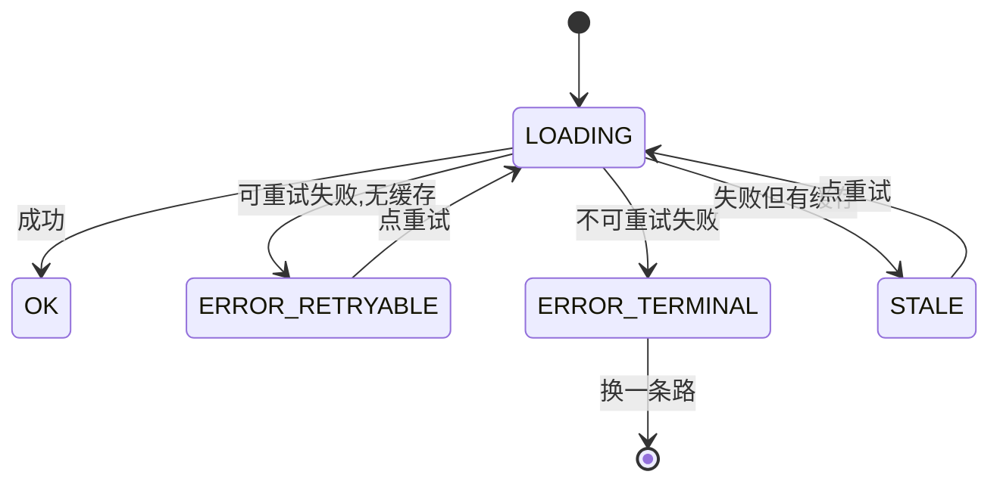

#### 交互细则

| 项 | 规则 |
|---|---|
| 重试 | 手动重试**永远可用**;自动重试的范围见 [`P-RETRY`](#p-retry-重试与幂等) |
| 重试的连点保护 | 同 [`C-BTN`](#c-btn-按钮) |
| 局部失败 | 只有那一块进错误态,**其余区域仍可用** |
| 主链路优先 | 🔴 任何失败都不许让「记一条」这个动作变得不可用 —— 记录动作永不失败,失败的只能是它的附加能力 |
| 陈旧标记 | 缓存内容顶部一行小字,不遮挡内容 |

#### 文案模式

**句式模板:`{哪一步}没成`,或 `{什么东西}没{动词}到`。**

| ✅ 例 | ❌ 例 |
|---|---|
| 「网络没通,刚才那一步没成」 | 「网络异常,请稍后重试」 |
| 「服务出了点问题,刚才那一步没成」 | 「系统错误 (500)」 |
| 「没拉到考点表」 | 「数据加载失败」 |
| 「没保存上,再试一次」 | 「保存失败」 |
| 「这条记录已经删了」 | 「记录不存在 (404)」 |
| 「考点表更新了,重新挑一次」 | 「版本冲突 CONFLICT」 |
| 「没成,再试一次」(未知错误兜底) | 「未知错误 UNKNOWN_ERROR」 |
| 「这是刚才的数据」 | 无标记直接显示旧数据 |

🔴 **自查一句话:把文案念给一个没看过代码的人听,他能说出「刚才是哪一步」吗?** 说不出就重写。

#### 边界值

| 项 | 上限 |
|---|---|
| 一句话 | ≤ 25 个汉字 |
| 按钮 | ≤ 2(重试 + 一条出路) |
| 重试次数 | 手动重试不限次 |
| 局部错误块数 | 同屏多块失败时,合并为一条整屏错误;**不堆三条错误块** |

#### 无障碍

| 项 | 要求 |
|---|---|
| 播报 | 错误出现时用断言级别播报一次;**只播报一次**,重试失败再播报 |
| 焦点 | 焦点移到错误区域,重试按钮紧随其后 |
| 颜色 | 不能只靠颜色;文案本身说清 |
| 热区 | 重试按钮 ≥ 44×44pt |
| 200% 字体 | 一句话换行,按钮不被挤出 |

#### 多端差异

| 端 | 差异 |
|---|---|
| **Web / H5** | —— |
| **桌面壳(Tauri · macOS)** | 壳把 `/api` 代理到后端;代理层失败要转成同样的产品文案,**不许把代理层的原始错误上屏** |
| **移动 App(Tauri iOS / Android)** | 同上 |
| **微信小程序** | 请求失败的原生错误信息一律不上屏 |

#### 反例

1. 屏幕上出现 `NETWORK_TIMEOUT` 或 `500`。**红线。**
2. 「请稍后重试」。**没有信息量,红线。**
3. 有缓存却进错误态,用户看不到刚才还在看的内容。
4. 一屏三块分别失败,弹三个错误块。
5. 用 Toast 报错,一闪而过。
6. 错误态盖住了「记一条」的入口,主链路被附加能力的失败拖死。
7. 不可重试的错误也给「再试一次」,用户点十次都一样。
8. 重试按钮点了没有加载反馈,用户连点。

---

### `C-LIMIT` 受限态

#### 用途与不用于

| | |
|---|---|
| **用途** | 缺登录(**已登录后令牌失效**)、缺额度、缺骨架 —— **能力上暂时用不了这条路** |
| **不用于** | 请求失败(那是 `C-ERR`);不用于零数据(那是 `C-EMPTY`);**不用于未登录** —— 未登录一律渲染登录门,不是受限态(`登录与账号` §1.2) |

#### 结构

🔴 **三件东西:缺什么 + 去补的入口 + 手动兜底入口。**

| 区块 | 必选 | 说明 |
|---|---|---|
| 一句话 | ✅ | 说清**缺什么**,带上可给的数字(如剩余次数) |
| **主按钮 = 免费兜底** | ✅ | 🔴 **主按钮永远是免费兜底那一条**,不是去补的入口 |
| 去补的入口 | ✅ | 次要按钮或文本按钮 |
| 🔴 不许 | —— | **不许把用户堵死在弹窗里**:受限态是页内的一块,不是一个必须关掉才能走的浮层 |

#### 「主按钮永远是免费兜底」这条为什么写死

**把「去买」做成主按钮,就等于在主链路上立了付费墙。** 主链路(记一条 / 看盲区 / 导出)必须永远有一条不花钱能走通的路:

| 受限场景 | 免费兜底(主按钮) | 去补的入口(次) |
|---|---|---|
| AI 识别次数用完 | 「自己写一条」/「自己挑一个考点」 | 「看看档位」 |
| AI 代发次数用完 | 「复制给 AI」(本地生成,永远免费) | 「看看档位」 |
| 登录态失效后用需要账号的能力 | **没有免费兜底** —— 主按钮就是「去登录」 | —— |
| 骨架没建好 | 「去记一条」 | —— (没有可补的,不给等待提示) |

🔴 **「主按钮永远是免费兜底」约束的是付费墙,不是登录门。** 登录是入口不是出口(2026-09-02 用户裁定「没有本地模式」):未登录不走受限态、直接渲染登录门,**门上没有「继续用」这个出口**;受限态里的「缺登录」只剩已登录后令牌失效这一种,它**没有兜底路径**,主按钮就是「去登录」。缺额度、缺骨架两档不变。

🔴 **导出永远不受限**:不限次数、不加水印、不因未付费而删减。导出屏永远不会出现受限态。

#### 状态枚举

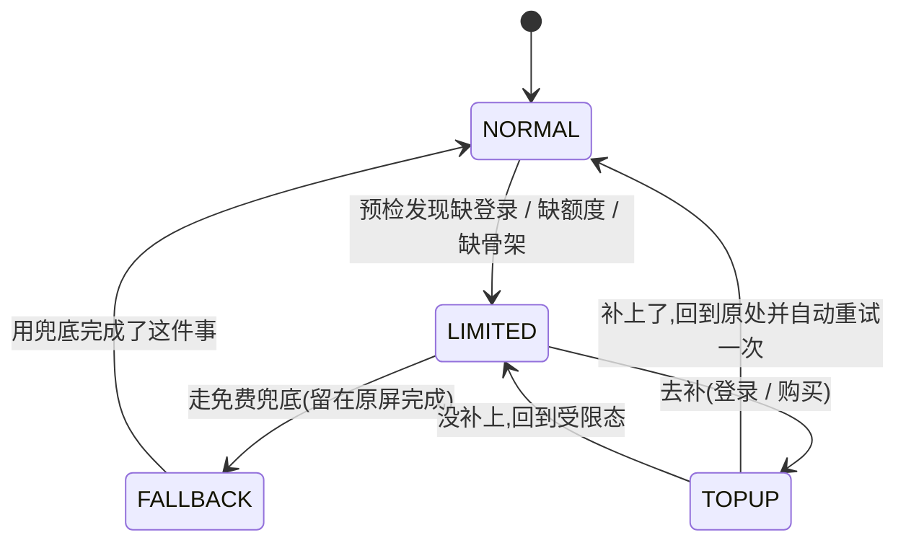

#### 交互细则

| 项 | 规则 |
|---|---|
| **预检** | 额度类受限用只读预检判断,**预检不扣减** |
| **失败不扣** | 能力调用失败时不消耗次数,界面明写「这次没算次数」 |
| **补完回来** | 🔴 **回到原处并自动重试一次**,只重试一次;再失败回到受限态,不循环 |
| **保持上下文** | 去登录/购买时保留用户在原屏的输入与所选项(如所选档位) |
| **不阻塞记录** | 🔴 额度用完时**记录本身照样落下来**,受限的只是识别与代发 |
| **不弹窗** | 受限态就地展示;需要用户选一次时才用浮层,且浮层里同样是免费兜底为默认落点 |

#### 边界值

| 项 | 规则 |
|---|---|
| 一句话 | ≤ 25 个汉字,带数字时数字由服务端给 |
| 按钮 | 恰好 2 个(兜底 + 去补);无可补时 1 个 |
| 自动重试 | 恰好 1 次 |
| 轮询到账 | 支付后主动查询的节奏与上限由 [额度与购买](额度与购买.md) §3.2 定义,本文不复述 |

#### 文案模式

| ✅ 例 | ❌ 例 |
|---|---|
| 「这个月的 AI 次数用完了(还剩 0 次)」 | 「额度不足,请升级会员」 |
| 「这一步需要先登录」 | 「登录后解锁全部功能」 |
| 「这个月 AI 次数用完了,可以自己挑一个考点」 | 「升级后无限使用」 |
| 「这次没算次数」 | 「本次调用已扣除」 |
| 「先登录才能看你的额度」 | 「请先登录」 |
| 「考点表还没建好,先记着,建好了再来挂」 | 「功能暂未开放」 |

🔴 **受限态文案里不出现:解锁、升级、会员、专属、无限、立省、限时。**

#### 无障碍

| 项 | 要求 |
|---|---|
| 焦点 | 受限态出现时焦点移到那一块;**默认落点是免费兜底按钮** |
| 播报 | 朗读「缺什么 + 兜底动作」 |
| 颜色 | 受限不能只靠颜色 |
| 热区 | 两个按钮均 ≥ 44×44pt |
| 200% 字体 | 两个按钮改纵向排列,兜底在上 |

#### 多端差异

| 端 | 差异 |
|---|---|
| **Web / H5** | 支付通道按端可用性决定;不可用时只显示兜底 + 一句「这个端上不能买」 |
| **桌面壳(Tauri · macOS)** | 同上 |
| **移动 App(Tauri iOS / Android)** | 应用商店的支付规则可能限制购买入口;**限制的是「去补」,兜底永远在** |
| **微信小程序** | 同上 |

#### 反例

1. 「去买」做成主按钮、兜底做成灰色小字。**主次反了,主链路上立了付费墙。**
2. 受限用浮层弹出,只有「去购买」和「关闭」,用户被堵住。
3. 额度用完导致记录也记不下来。**红线:记录动作永不失败。**
4. 登录回来后不自动重试,用户要重新点一遍原来那个按钮。
5. 自动重试写成无限重试,失败时打成一串请求。
6. 受限文案写「升级解锁无限次数」。**促销词,红线。**
7. 导出屏出现受限态。**导出永远免费不限次数。**
8. 预检时就把次数扣掉了,用户没用上却少了一次。

---

### `C-OFFLINE` 离线细条

#### 用途与不用于

| | |
|---|---|
| **用途** | 常驻一条细条,告诉用户**现在的数据在哪、会不会丢** |
| **不用于** | 报错(离线不是错误);不用于阻止操作;不用于催用户联网 |

#### 结构与位置

| 项 | 规则 |
|---|---|
| 位置 | 🔴 **全产品同一个位置:当前屏顶部**,常驻不遮挡内容(把内容整体下推,不悬浮盖住) |
| 内容 | 一句话,**不可点** |
| 出现范围 | 不需要网络也能用的屏(`S-HOME` `S-REC` `S-TL` `S-SET` `S-RAW`)以及任何有本地队列在等的屏 |

#### 状态枚举

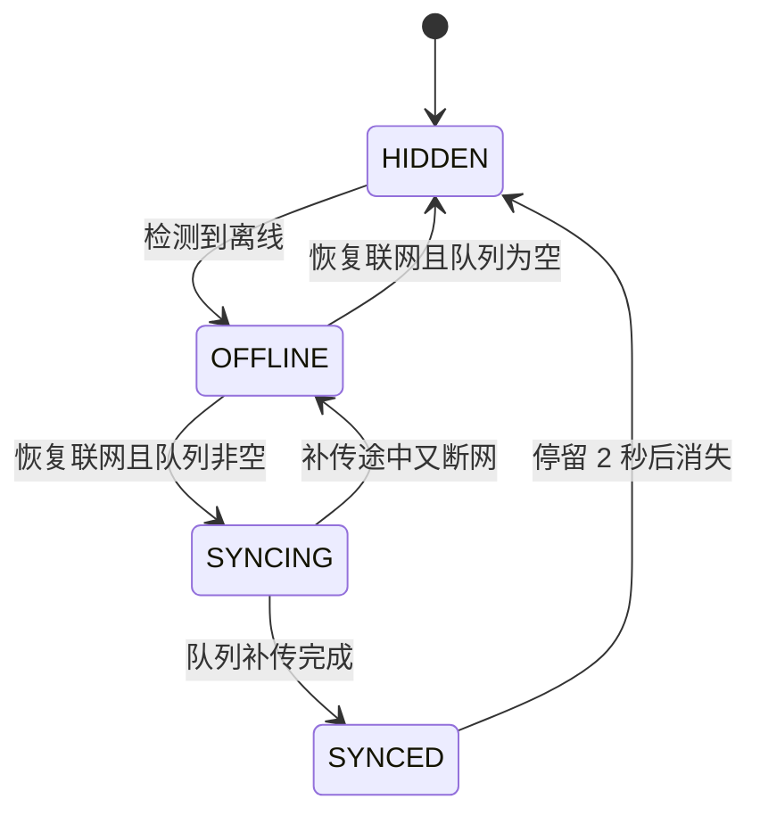

| 状态 | 文案 |
|---|---|
| `OFFLINE` | 「离线中,已存在这台设备上,联网后自动同步」 |
| `SYNCING` | 「正在同步 {n} 条」 |
| `SYNCED` | 「同步完了」,停留 2 秒后自动消失 |
| `HIDDEN` | 在线且队列为空时不显示 |

#### 交互细则

| 项 | 规则 |
|---|---|
| 自动消失 | 🔴 联网后补传完成自动消失,**不需要用户点任何按钮** |
| 不可点 | 细条不可点,不承载动作 |
| 计数 | `{n}` 是本地队列里待补传的条数,实时递减 |
| 冲突 | 补传冲突以幂等键去重,**用户无感**,不弹任何提示 |
| 抖动保护 | 网络状态在短时间内反复变化时,细条**不跟着闪** —— 状态变化要经过一个稳定窗口才上屏 |
| 与其他态共存 | 离线细条与骨架屏/空态/错误态可同时存在,它在最顶部,不互斥 |
| 不催促 | 不写「请检查网络设置」「去开 WiFi」 |

#### 边界值

| 项 | 规则 |
|---|---|
| 文案长度 | ≤ 22 个汉字,一行内;窄屏换两行 |
| 队列条数 | 超过展示上限时按 [`P-NUM`](#p-num-数字与时间的呈现规范) 的计数规则显示 |
| 同步失败 | 队列保留,细条回到 `OFFLINE` 文案;**不弹错误** —— 数据没丢,不是错误 |

#### 文案模式

| ✅ 例 | ❌ 例 |
|---|---|
| 「离线中,已存在这台设备上,联网后自动同步」 | 「网络连接已断开!」 |
| 「正在同步 3 条」 | 「同步中… 30%」 |
| 「同步完了」 | 「同步成功,共 3 条,耗时 1.2 秒」 |

#### 无障碍

| 项 | 要求 |
|---|---|
| 播报 | 状态变化时用礼貌级别播报一次,**不打断当前朗读、不抢焦点** |
| 焦点 | 不进 Tab 序(不可点) |
| 颜色 | 离线与同步中不能只靠颜色区分,文案不同 |
| 200% 字体 | 换行显示,内容整体下推 |

#### 多端差异

| 端 | 差异 |
|---|---|
| **Web / H5** | 浏览器的在线状态不可靠,以**实际请求是否成功**为准,不只看系统事件 |
| **桌面壳(Tauri · macOS)** | 同上;壳的本地服务始终可用,细条只反映到后端的连通性 |
| **移动 App(Tauri iOS / Android)** | 弱网(能连但请求超时)同样算离线,走同一条细条 |
| **微信小程序** | 用小程序的网络状态接口 + 请求结果双重判断 |

#### 反例

1. 离线时弹错误浮层,用户以为数据丢了。**离线不是错误。**
2. 细条悬浮盖住第一条记录。
3. 同步完成后要求用户点「知道了」才消失。
4. 网络抖动时细条一秒闪三次。
5. 细条写「网络连接已断开,请检查设置」。**催促且没信息量。**
6. 同步进度做成百分比进度条。
7. 补传冲突时弹一个「发现重复数据,是否覆盖」的浮层。**幂等去重,用户无感。**

---

## 六、跨组件的交互模式

### `P-NAV` 导航与返回

#### 五条硬规则

| # | 规则 | 说明 |
|---|---|---|
| 1 | 🔴 **任何时候按返回键都能退出当前屏** | 没有「不可返回」的屏。浮层、选择器、登录流程都能退 |
| 2 | 🔴 **有未保存内容时用浮层问一次** | 只问一次,给「留下」与「不保存就走」两条路 |
| 3 | 🔴 **登录后回到原处并自动重试一次** | 只重试一次 |
| 4 | **返回时保持来处的滚动位置与筛选条件** | 从详情返回列表,回到离开时那一行 |
| 5 | **深链进入后返回栈必须可用** | 见下 |

#### 返回键要退出的是「最内层的那一个」

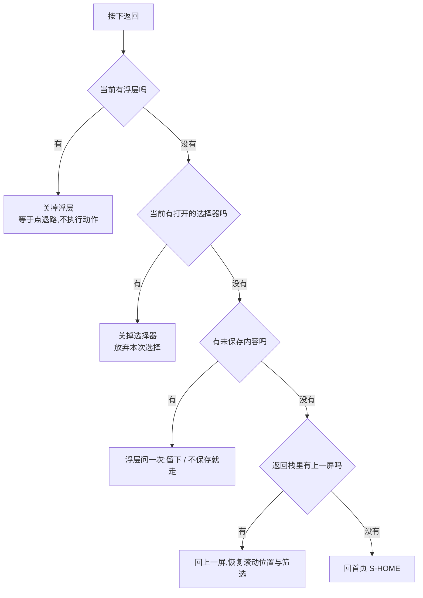

#### 「未保存内容」的判定

| 屏 | 算未保存 | 不算未保存 |
|---|---|---|
| `S-REC` 手写 | 输入框非空 | 只改了时间没写内容 |
| `S-REC` 语音/拍照 | **不适用** —— 先落记录再处理,本来就没有未保存状态 | —— |
| `S-EXP` 预览框 | 用户编辑过预览文本 | 没编辑过 |
| `S-LOGIN` | **不算** —— 半截的登录流程直接丢弃,不问 | —— |
| `S-TAG` | **不算** —— 每一步都是即时提交的 | —— |
| `S-BILL` 确认页 | **不算** —— 还没下单,直接退 | —— |

⚠️ **「不算未保存」的屏一律直接退出,不问。** 每多问一次,退出这件事就贵一点。

#### 深链与返回栈

| 场景 | 返回栈 |
|---|---|
| 从外部深链进 `S-NODE` | 返回栈补一层 `S-BLIND`,返回时进盲区总览而不是退出应用 |
| 从外部深链进 `S-TAG` | 返回栈补一层 `S-TL` |
| 从 Toast / 通知进入 | **不存在** —— 本产品没有推送 |
| 应用内跳转 | 正常压栈 |
| 登录成功 | **不压栈**:用回到来处替换掉登录屏,返回键不会回到登录屏 |

#### 「登录后回到原处并自动重试一次」的统一实现约定

| 项 | 约定 |
|---|---|
| 触发 | 任何因缺登录而中断的动作 |
| 记什么 | 中断点(哪一屏、哪一个动作)+ 该动作的原始参数 + 幂等键 |
| 登录成功后 | 关掉登录屏(不压栈)→ 回到那一屏并恢复参数 → **自动执行一次**那个动作 |
| 重试次数 | 🔴 **恰好一次。** 失败就停在结果上(错误态或受限态),不再自动重试 |
| 幂等 | 复用中断前生成的幂等键,见 [`P-RETRY`](#p-retry-重试与幂等) |
| 用户取消登录 | 回到那一屏,**不执行**那个动作,保留用户原来的输入 |
| 上下文过期 | 中断点只在本次会话内有效;杀进程再进不恢复,回首页 |

#### 无障碍

| 项 | 要求 |
|---|---|
| 焦点 | 返回上一屏时焦点回到「进入下一屏时的那个元素」 |
| 播报 | 换屏时播报新屏的标题 |
| 键盘 | 桌面壳与 Web 上有可达的返回按钮,不只靠浏览器返回 |

#### 多端差异

| 端 | 差异 |
|---|---|
| **Web / H5** | 浏览器返回键 = 上表逻辑;浮层与选择器打开时各压一个历史项 |
| **桌面壳(Tauri · macOS)** | 无系统返回键;`Cmd+[` 与屏内返回按钮走同一逻辑;窗口关闭 ≠ 返回 |
| **移动 App(Tauri iOS / Android)** | Android 物理返回键走上表;iOS 侧滑返回在浮层打开时不生效 |
| **微信小程序** | 页面栈深度有限,深链补栈用重定向而不是不断压栈;右上角返回与自绘返回行为一致 |

#### 反例

1. 登录屏没有返回,用户被堵在那里。**红线。**
2. 登录成功后压栈,用户按返回又回到登录屏。
3. 每次退出都问「确定要离开吗」,包括什么都没填的时候。
4. 登录后回到原处但不自动重试,用户要重新点一遍。
5. 登录后自动重试三次,失败时打出一串请求。
6. 深链进详情,返回直接退出应用。
7. 从详情返回列表时回到顶部。
8. 浮层打开时按返回退出了整个屏。

---

### `P-TIME` 加载与超时的统一阈值表

**这张表的作用是让「快、慢、超时」在全产品有同一个口径。** 区间给的是设计与实现的取值范围,取值在区间内由端自行标定后写死在一处。

| 阶段 | 阈值区间 | 界面表现 | 依据 |
|---|---|---|---|
| **瞬时** | 请求发出到 ~0.1 秒 | 什么都不出 —— 按下反馈已经给过了 | 这个量级用户感知为「立刻」,任何额外指示都是闪烁 |
| **短等待** | ~0.1 秒到**骨架阈值** | 只有按钮的加载态,内容区不动 | 用户还在等自己刚才那一下的结果,不需要新画面 |
| **骨架阈值** | 0.3–0.6 秒之间取一个值 | 内容区出 [`C-SKEL`](#c-skel-骨架屏) | 低于这个区间会闪;高于这个区间用户开始怀疑没点上 |
| **骨架最短停留** | 0.3–0.5 秒 | 骨架一旦出现,至少停留这么久再切内容 | 防止「骨架闪一下就没」的抽搐感 |
| **算慢** | 2–3 秒 | 骨架继续;**不加任何额外文案**;若是提交类动作,按钮保持加载态 | 到这个量级用户已经知道在等,加字只会添乱 |
| **算很慢** | 5–6 秒 | 仅限**提交类**动作:按钮下方一行小字说清在等什么(如「正在认」);查询类不加 | 提交类用户会怀疑要不要再点一次,这一行是替代连点的信息 |
| **超时** | 见 [`总纲`](INDEX.md) §2.5 —— 阈值在那里定义,**本文不复述** | 按错误态处理,**不无限转圈** | 总纲已定,这里只接它的下游表现 |
| **搜索防抖** | 0.2–0.4 秒 | 输入停止后再发请求 | 一次打字停顿的量级 |
| **网络状态抖动窗口** | 1–2 秒 | 状态稳定这么久才改 [`C-OFFLINE`](#c-offline-离线细条) | 防止细条闪烁 |
| **Toast 停留** | 2 秒 —— 口径来自 [`总纲`](INDEX.md) §2.2 | 见 [`C-TOAST`](#c-toast-toast) | 总纲已定 |

**已经在别处定义、本文一律不复述的时间:** 超时判定([`总纲`](INDEX.md) §2.5)、验证码倒计时与频控等待([登录与账号](登录与账号.md) §2.4,以服务端返回为准)、录音时长上限([记一次学习](记一次学习.md) §3.3)、支付到账轮询节奏([额度与购买](额度与购买.md) §3.2)、原图留存期([`多端选型与端矩阵`](../../technical/多端选型与端矩阵.md))。

⚠️ **这些区间是行为不是风格,所以它们在本文;具体取哪个值由端标定,标定结果写在实现的一处常量里,不散落。**

🔴 **超过任何阈值都不许做的事:** 不加「玩命加载中」这类文案、不加百分比进度、不加预计剩余时间、不加转圈遮罩、不自动跳走。

---

### `P-RETRY` 重试与幂等

#### 哪些动作可以自动重试

| 类 | 自动重试 | 说明 |
|---|---|---|
| **读**(查询、拉列表、拉树) | ✅ | 幂等,失败自动退避重试 |
| **离线队列的补传** | ✅ | 队列本身就是为补传设计的,带幂等键 |
| **登录后的那一次** | ✅ 恰好一次 | 见 [`P-NAV`](#p-nav-导航与返回) |
| **写**(记一条、确认标签、断言、下单) | ❌ **不自动重试** | 由用户点重试;后端靠幂等键兜住重复 |
| **支付相关** | ❌ | 只做「主动查一次结果」,不重发下单 |
| **注销、合并** | ❌ | 不可逆动作永不自动重试 |

#### 退避策略

| 项 | 规则 |
|---|---|
| 次数 | 自动重试**最多两次**(合计三次请求),之后进错误态交给用户 |
| 间隔 | 指数退避,首次间隔在「短等待」量级,每次翻倍,并加一点随机抖动避免同时打过去 |
| 上限 | 总耗时不超过超时阈值;超过就直接进错误态 |
| 离线时 | 🔴 **不重试,直接进队列** —— 离线下重试只是白耗电 |
| 界面 | 自动重试期间界面**不变化**:仍是骨架或按钮加载态,**不显示「重试中 (2/3)」** |

#### `client_token` 幂等键在界面上的后果

**幂等键是技术手段(定义在 [`技术架构与接口契约`](../../technical/INDEX.md),本文不复述),它在界面上只有一个后果:用户无感。**

| 场景 | 用户看到 | 🔴 不许看到 |
|---|---|---|
| 点了记下,请求超时,用户又点一次 | 一条记录 | 两条记录 |
| 离线记了三条,联网后补传,其中一条之前其实已经传成功 | 三条记录 | 四条记录 |
| 登录后自动重试那一次,而中断前请求其实已经到了服务端 | 一条记录 | 两条记录 |
| 支付后主动查询,回调也到了 | 一次到账 | 两次到账 |

| 规则 | 说明 |
|---|---|
| **键在什么时候生成** | 🔴 **用户按下按钮那一刻生成一次**,同一次意图的所有重试(自动的和手动的)复用它 |
| **什么时候换新键** | 用户**再次表达意图**时(重新填、重新点一个新的动作)。「点重试」不换键;「改了内容再点」换键 |
| **重复提交的界面表现** | 服务端识别为重复时,界面按**成功**处理 —— 不提示「重复提交」,不报错 |
| **列表去重** | 乐观插入的本地条目与补传返回的条目按幂等键归并,**不出现一闪而过的两条** |

🔴 **重试不许产生第二条记录。** 这条是本产品的记录动作永不失败的另一半:落得下来,而且只落一条。

#### 反例

1. 写操作自动重试,超时的那一次其实成功了,于是记录翻倍。
2. 「点重试」时重新生成幂等键,等于绕过了幂等。
3. 界面显示「重试中 (2/3)」,把内部机制暴露给用户。
4. 离线时仍然自动重试,电量掉得比记录还快。
5. 服务端返回「重复提交」,界面直接报错,用户以为没成。
6. 乐观插入的本地条目与服务端返回的条目没归并,列表里闪出两条又变一条。
7. 不可逆动作(合并、注销)自动重试。

---

### `P-NUM` 数字与时间的呈现规范

#### 🔴 总规则:屏幕上的每个数字都必须能还原成「有没有、几次、多久前」

| 数字 | 还原成 | 合法 |
|---|---|---|
| 「近 5 年 7 次」 | 几次 | ✅ |
| 「你碰过 3 次」 | 几次 | ✅ |
| 「最近一次 6 天前」 | 多久前 | ✅ |
| 「你没碰过」 | 有没有 | ✅ |
| 「一共 120 个考点,碰过 40 个」 | 几次(计数) | ✅ |
| 「本月还剩 12 次」 | 几次(能力额度,不是学习数据) | ✅ |
| 「3 张,占 12 MB」 | 计数与容量,不是学习数据 | ✅ |
| 任何百分比 | 还原不了 | ❌ |
| 任何比值、平均、分位 | 还原不了 | ❌ |
| 任何随时间上升的「累计荣誉计数」 | 还原不了 | ❌ |

🔴 **禁止的数字形态:百分比、进度条、比值(3/10 写成 30%)、平均值、评分、位次、连续天数、层级数字。**
覆盖度只能写成「{碰过}/{总数}」这样的两个计数,**不写成百分比,也不画成进度条**。

#### 计数格式

| 规则 | 说明 |
|---|---|
| 千分位 | ≥ 10000 时加千分位分隔;四位数不加 |
| 上限展示 | 超过 999 的**列表角标类**计数写「999+」;正文里的计数写真实数字 |
| 零 | 写「0」,不写「无」「暂无」;但整块为零时走 [`C-EMPTY`](#c-empty-空态) |
| 单位 | 「次」「个」「条」「张」按对象固定,同一对象全产品同一个量词 |
| 容量 | 用户可读单位(KB / MB / GB),保留至多一位小数 |
| 🔴 不做 | 不做「1.2万」这类模糊化 —— 计数要能对得上 |

#### 相对时间的口径

| 距今 | 写法 | 边界 |
|---|---|---|
| 同一自然日 | 「今天」+ 时刻 | 按**设备本地时区**的自然日切分,不是「24 小时内」 |
| 前一自然日 | 「昨天」+ 时刻 | 同上 |
| 2–6 天 | 「{n} 天前」 | 按自然日差算,不按小时 |
| 7 天及以上,同一年 | 「{月}月{日}日」 | —— |
| 跨年 | 「{年}年{月}月{日}日」 | —— |

| 项 | 规则 |
|---|---|
| **时区** | 🔴 全部按**设备本地时区**渲染;服务端存的时间戳是绝对时间,渲染在端上做 |
| **跨时区** | 用户换时区后,同一条记录的「今天/昨天」可能变 —— **这是正确行为**,不做修正、不做提示 |
| **「多久前」的计算** | 用自然日差,不用小时差:昨天 23:50 和今天 00:10 相差 20 分钟,但显示「昨天」与「今天」 |
| **不做** | 不做「刚刚」「几秒前」「一分钟前」这类高频刷新的相对时间 —— 它们要求界面自己动起来,而本产品的界面不自己动 |

#### 日期与时长格式

| 项 | 格式 |
|---|---|
| 日期 | 「{月}月{日}日」/ 跨年加「{年}年」;**不用斜杠、不用连字符、不用英文月份** |
| 日期 + 时刻 | 「{月}月{日}日 {时}:{分}」,24 小时制 |
| 时长(录音) | 「{秒}秒」;满 60 秒写「1 分钟」 |
| 周期说明 | 「每月 1 号重置」 |
| 🔴 不做 | 不做「已坚持 {n} 天」、不做「距离上次 {n} 天,去看看吧」——前者是连续天数,后者是提醒 |

#### 无障碍

| 项 | 要求 |
|---|---|
| 朗读 | 数字与单位一起朗读(「7 次」不是「7」);相对时间朗读为完整词(「6 天前」) |
| 缩写 | 「999+」朗读为「超过 999」 |
| 颜色 | 数字的含义不靠颜色区分 |
| 200% 字体 | 数字与单位不拆行 |

#### 反例

1. 覆盖度写成「33%」或画成进度条。**红线。**
2. 「已连续记录 7 天」。**连续天数,红线。**
3. 「刚刚」「1 分钟前」,界面每秒自己刷新。
4. 把「碰过 3 次 / 共 10 个」压缩成一个比值。
5. 「1.2万条记录」,用户对不上真实数字。
6. 用服务器时区渲染「今天」,凌晨的记录被算成昨天。
7. 「距离上次学习已经 12 天了」。**那是提醒的变体。**

---

### `P-COPY` 文案总规范

#### 六条硬规则

| # | 规则 | 说明 |
|---|---|---|
| 1 | **人称:第二人称「你」** | 「你碰过 3 次」;不用「您」(过度客气会让工具变服务)、不用「我的」作前缀(「我的记录」→「记录」) |
| 2 | **语气:陈述,不劝导** | 陈述已经发生的事实或当前的状态。不鼓励、不催促、不建议、不感叹 |
| 3 | **标点:全角,且不用感叹号** | 界面文案用全角标点;🔴 **全产品没有一个感叹号**;不用波浪号、不用颜文字、不用表情符号 |
| 4 | **不用内部术语** | 「打标」「归类」「实体」「节点」「幂等」不上屏;上屏的词是「对上」「考点」「记录」 |
| 5 | **说清哪一步没成** | 所有失败文案必须指名那一步 |
| 6 | **禁用词** | 🔴 全表在 [`总纲`](INDEX.md) §2.3,**本文不复述**;自查方法见下 |

#### 各处文案的字数上限

| 位置 | 上限 | 超出时 |
|---|---|---|
| Toast | ≤ 15 个汉字 | 说不完就说明它不该是 Toast |
| 按钮 | ≤ 6 个汉字 | 改文案,不缩字号、不换行 |
| 页内提示 | ≤ 20 个汉字 | 拆成提示 + 一行辅助说明 |
| 浮层标题 | ≤ 20 个汉字 | —— |
| 浮层正文 | ≤ 2 行 | 说不完就该是一屏 |
| 空态一句话 | ≤ 30 个汉字 | —— |
| 错误态一句话 | ≤ 25 个汉字 | —— |
| 受限态一句话 | ≤ 25 个汉字 | —— |
| 屏幕标题 | ≤ 8 个汉字 | —— |
| 排序口径行 | ≤ 15 个汉字 | —— |
| 离线细条 | ≤ 22 个汉字 | —— |

#### 「说清哪一步没成」的错误文案句式模板

**模板:`{哪一步}没成` 或 `{什么}没{动词}到`,可选加一个 `{怎么办}`。**

| 模板 | 套用 |
|---|---|
| 「{网络/服务}没通,刚才那一步没成」 | 传输层失败 |
| 「没{动词}到{对象}」 | 拉取失败:「没拉到考点表」 |
| 「没{动词}上,再试一次」 | 写入失败:「没保存上,再试一次」「没标上,再试一次」 |
| 「{对象}已经{状态}了」 | 前置条件变了:「这条记录已经删了」 |
| 「{对象}更新了,重新{动作}一次」 | 数据版本变了:「考点表更新了,重新挑一次」 |
| 「{这一处}看起来不对」 | 输入格式:「手机号看起来不对」 |
| 「{这一处}不对,还能试 {n} 次」 | 输入错误且有次数:验证码 |
| 「{做不了什么},{已经怎样}」 | 边界:「写不下了,已经记到这里」 |
| 「没成,再试一次」 | 未知错误的唯一兜底 |

🔴 **模板之外的错误文案一律不写。** 写不进模板说明那个失败还没想清楚是哪一步。

#### 怎么自查禁用词

| 步 | 做法 |
|---|---|
| 1 | 用 [`总纲`](INDEX.md) §七「界面文案不含禁用词」那一行给出的命令跑一遍 `docs/product/specs/`,命中即违规 —— **本文不另起一份词表,也不另写一条命令**,那会变成第二处说法 |
| 2 | 前端代码侧同样跑一遍,范围是所有上屏文案的定义处 |
| 3 | 🔴 **例外只有一处**:[`总纲`](INDEX.md) §2.3 那张正反例对照表本身 —— 它必须写出那些词才能禁掉它们 |
| 4 | 新写一句上屏文案时,先问它能不能还原成「有没有、几次、多久前」;还原不了就删,不改写 |

#### 三个更容易漏掉的自查点

| 点 | 说明 |
|---|---|
| **占位符与示例** | 🔴 输入框占位符、文档里的示例文案、验收用例里的示例文本 **都是上屏文案**,同样受禁用词与「不像题干」两条约束 |
| **替代文本** | 图片的替代文本也是文案,同样不许描述图片内容、不许出现禁用词 |
| **导出文件** | 导出的 Markdown / CSV / JSON 里的表头与说明文字同样受这套规范约束 |

#### 语气的正反例

| ❌ 不许写 | ✅ 写成 |
|---|---|
| 「太棒了,今天记了 5 条!」 | 「今天记了 5 条」 |
| 「建议你先看这几个考点」 | 「按近 5 年出现次数排」 |
| 「快来记录你的第一条吧~」 | 「随手记一句就行,不用写完整」 |
| 「您的操作已成功」 | 「已记下」 |
| 「很遗憾,加载失败了」 | 「没拉到考点表」 |
| 「继续保持,你做得很好」 | **删掉,这句话本产品不该有** |
| 「今天已经偷懒 3 次了」 | 「今天有 3 次没记」 |

---

## 七、组件级验收用例

**48 条,每一类组件至少 2 条。** 这些用例验的是**组件行为**,不验业务流程 —— 业务流程的用例在各份逐屏规格的「异常全集」里。
每条都能在任意一屏上跑,跑的时候挑该组件出现的那一屏。

| # | 组件 | Given | When | Then |
|---|---|---|---|---|
| `UI-01` | `C-BTN` | 一个会写数据的主按钮处于可点状态,网络慢 | 用户在 1 秒内连点 5 次 | 只发出 1 个请求;按钮在第一次点击后立刻进入加载态并吞掉后续点击;结束后只产生 1 条数据 |
| `UI-02` | `C-BTN` | 主按钮因必填项没填够而禁用 | 用户点它 | 不发请求;屏幕上出现一句话说清还缺什么;**不是**静默无反应 |
| `UI-03` | `C-BTN` | 提交请求失败 | 失败返回 | 按钮回到可点态,占位与宽度与点击前完全一致;不出现「已完成」之类的成功态 |
| `UI-04` | `C-BTN` | 系统字体设为 200% | 打开任意有并排两个按钮的屏 | 两个按钮改为纵向排列;文字不截断、不横向溢出;每个热区仍 ≥ 44×44pt |
| `UI-05` | `C-INPUT` | 手机号输入框为空 | 用户开始逐位输入,输到第 3 位 | 输入过程中**不出现任何错误提示**;输到第 11 位后第 12 位被拒绝接受 |
| `UI-06` | `C-INPUT` | 手机号校验失败,页内提示已出现 | 用户修改输入框内容(哪怕只删一个字符) | 提示立刻消失,不等失焦、不等计时 |
| `UI-07` | `C-INPUT` | 移动端软键盘弹起 | 用户聚焦在屏幕下半部的输入框 | 输入框与它下方的主按钮同时可见;整屏上推而不是输入区内部滚动 |
| `UI-08` | `C-INPUT` | 收到验证码短信 | 用户粘贴 6 位数字到验证码框 | 按位填充并自动提交;用户不需要再点按钮 |
| `UI-09` | `C-INPUT` | 任意屏 | 检查全部输入框的占位符、示例、帮助文案 | 没有任何一处出现长得像题目的文字 |
| `UI-10` | `C-PICK` | 树选择器已打开,搜索框输入一个树上不存在的词 | 搜索返回零结果 | 显示「没有叫这个的考点」;**屏幕上没有任何形式的「新建」入口** |
| `UI-11` | `C-PICK` | 树选择器展开到第 2 层 | 用户点一个父节点 | 不被选中;就地提示「挑到具体考点」;该父节点展开 |
| `UI-12` | `C-PICK` | 树选择器已打开且用户已展开到某一章 | 用户按返回键 | 关闭选择器回到原屏,**不退出整个屏**;原屏的滚动位置与已填内容保留 |
| `UI-13` | `C-PICK` | 日期时间选择器已打开 | 用户尝试选一个未来的日期 | 未来日期不可点;**不是**选完再报错 |
| `UI-14` | `C-SWITCH` | 「我已经会了」处于关闭,网络正常 | 用户点开关 | 界面立刻变为打开(不等响应);请求成功后无额外提示 |
| `UI-15` | `C-SWITCH` | 同上,但请求失败 | 失败返回 | 开关滑回关闭;出现一条 Toast「没标上,再试一次」;**不弹浮层** |
| `UI-16` | `C-SWITCH` | 任意设置屏 | 检查这一屏的全部开关 | 没有「保存」按钮;没有通知开关、提醒时间、每日目标、学习计划 |
| `UI-17` | `C-LIST` | 列表已加载三页,用户滚动在第二页中间 | 用户下拉刷新且刷新失败 | 已有内容**不被清空**;出现一条 Toast 说清没刷上;滚动位置不变 |
| `UI-18` | `C-LIST` | 列表按「近 5 年出现次数」排,存在多条次数相同的条目 | 用户连续翻三页 | 没有任何一条重复出现,也没有任何一条被跳过 |
| `UI-19` | `C-LIST` | 列表已到最后一页 | 用户继续上拉 | 末尾显示「就这些了」;不再发请求 |
| `UI-20` | `C-LIST` | 加载更多请求失败 | 失败返回 | 末尾区变为「没拉到后面的」+「再试一次」;**不自动重试** |
| `UI-21` | `C-LIST` | 用户从列表进入某条详情再返回 | 返回 | 回到离开时的滚动位置与筛选条件 |
| `UI-22` | `C-CARD` | 记录卡片整卡可点,卡内有一个「删除」 | 用户点「删除」 | 只触发删除流程;**不进入详情**(事件不冒泡到整卡) |
| `UI-23` | `C-CARD` | 档位卡片列表 | 用户点卡片的空白区域 | 什么都不发生;只有「选这个」可点 |
| `UI-24` | `C-CARD` | 任意卡片 | 检查卡片上的全部数字 | 没有百分比、没有进度条、没有置信度、没有相似度 |
| `UI-25` | `C-DISC` | 用户只有一个科目有记录 | 进入盲区总览 | **不渲染科目切换器** |
| `UI-26` | `C-DISC` | 时间线有 3 条没对上的记录 | 查看筛选 Tab | Tab 上**没有任何计数角标或红点**;只有「全部」「没对上的」两项 |
| `UI-27` | `C-DISC` | 用户在 Tab A 滚到中间,切到 Tab B 再切回 A | 切回 A | A 的滚动位置保持在切走时的位置 |
| `UI-28` | `C-TOAST` | 批量补录 50 条全部成功 | 提交完成 | 屏幕上**只出现一条** Toast(带计数),不是 50 条 |
| `UI-29` | `C-TOAST` | 任意 Toast 正在显示 | 用户点 Toast | 点击穿透到下层内容;Toast 本身不可点、没有按钮 |
| `UI-30` | `C-TOAST` | 任意请求失败 | 失败返回 | 屏幕上出现的是页内提示或错误态;**没有任何报错用的 Toast**(乐观更新回滚除外) |
| `UI-31` | `C-INLINE` | 一屏同时有两处校验失败 | 用户点提交 | 两条提示都显示;自动滚动与焦点只去视觉上最靠前的那一条;读屏只播报那一条 |
| `UI-32` | `C-INLINE` | 页内提示位当前为空 | 提示出现 | 下方内容**不发生跳动**(提示位已预留高度) |
| `UI-33` | `C-SHEET` | 删除确认浮层已打开 | 提交失败 | 浮层**保持打开**,在浮层内出现页内提示;不关闭浮层再弹别的东西 |
| `UI-34` | `C-SHEET` | 一个不可逆动作的确认浮层已打开 | 用户点浮层外部区域 | 浮层**不关闭**;按返回键则关闭且**不执行**该动作 |
| `UI-35` | `C-SHEET` | 任意浮层已打开 | 触发另一个浮层 | 屏幕上仍然只有一个浮层;不叠加 |
| `UI-36` | `C-SHEET` | 确认浮层刚打开 | 用读屏检查焦点 | 焦点落在**退路**按钮上,不是危险动作上 |
| `UI-37` | `C-DANGER` | 时间线上一条记录 | 用户左滑并点删除 | 弹出二档浮层,标题同时写清会失去什么与不会失去什么;左滑本身不删除 |
| `UI-38` | `C-DANGER` | 全产品任意屏 | 统计要求打字确认的入口 | 恰好一处(注销);其余不可逆动作一律二档浮层 |
| `UI-39` | `C-SKEL` | 首屏请求在 0.1 秒内返回 | 页面渲染 | 骨架屏**从未出现**,直接出内容 |
| `UI-40` | `C-SKEL` | 列表已有内容,用户触发刷新 | 刷新进行中 | 已有内容仍然可见可滚动;**没有整屏遮罩、没有转圈盖住内容** |
| `UI-41` | `C-EMPTY` | 某科目骨架尚未建好 | 进入盲区总览 | 显示一句话说清为什么空 + 一个当下能做的动作;**没有进度条、没有「预计 x 天后开放」** |
| `UI-42` | `C-EMPTY` | 任意空态 | 检查这一屏 | 至少有一句话和一个可点动作;不是只有一张插画;文案里没有感叹号与表情符号 |
| `UI-43` | `C-ERR` | 列表请求失败,但本地有上一次的缓存 | 失败返回 | 显示缓存内容 + 一行「这是刚才的数据」;**不进错误态、不清空** |
| `UI-44` | `C-ERR` | 任意请求失败 | 读屏与肉眼检查错误文案 | 没有错误码、没有英文、没有「请稍后重试」;能读出「刚才是哪一步」 |
| `UI-45` | `C-LIMIT` | AI 次数已用完 | 用户触发需要额度的动作 | 受限态就地出现;**主按钮是免费兜底**,付费入口是次要按钮;记录本身照样能落下来 |
| `UI-46` | `C-LIMIT` | 因缺登录中断了一个动作,用户完成登录 | 登录成功 | 回到原屏并**自动执行一次**那个动作;失败则停在结果上,不再自动重试;返回键不会回到登录屏 |
| `UI-47` | `C-OFFLINE` | 设备离线,本地队列有 3 条 | 恢复联网 | 细条变为「正在同步 3 条」→ 完成后 2 秒自动消失;用户不需要点任何按钮 |
| `UI-48` | `C-OFFLINE` | 网络在 1 秒内断开又恢复 | 观察细条 | 细条**不闪烁**(状态需稳定超过抖动窗口才上屏) |
| `UI-49` | `P-NAV` | 任意屏(含登录屏、浮层、选择器) | 按返回键 | 都能退出当前层;没有任何一屏是退不出去的 |
| `UI-50` | `P-NAV` | 用户在记录输入框里写了内容 | 按返回键 | 弹一次浮层问「留下 / 不保存就走」;而在登录屏、打标屏做同样的事**不问**,直接退 |
| `UI-51` | `P-TIME` | 任意查询请求耗时 3 秒 | 观察屏幕 | 骨架屏持续显示;**没有额外文案、没有百分比、没有预计剩余时间** |
| `UI-52` | `P-TIME` | 任意请求超过超时阈值 | 超时 | 进错误态;**不无限转圈** |
| `UI-53` | `P-RETRY` | 用户点「记下」,请求超时,用户又点一次「记下」 | 两次请求都到达服务端 | 最终只有一条记录;界面上不出现「重复提交」的提示 |
| `UI-54` | `P-RETRY` | 一个查询请求连续失败 | 自动重试进行中 | 界面表现不变(仍是骨架);**不显示「重试中 (2/3)」**;最多两次自动重试后进错误态 |
| `UI-55` | `P-NUM` | 用户在某科目碰过 40 个考点、共 120 个 | 查看盲区总览与骨架树 | 显示两个计数;**没有任何百分比、没有进度条** |
| `UI-56` | `P-NUM` | 一条记录创建于昨天 23:50,现在是今天 00:10 | 查看时间线 | 显示「昨天」,不是「20 分钟前」;分组头是「昨天」 |
| `UI-57` | `P-COPY` | 全部上屏文案(含占位符、替代文本、导出文件表头) | 跑总纲 §七 给出的禁用词自查命令 | 零命中(总纲 §2.3 那张对照表本身除外) |
| `UI-58` | `P-COPY` | 任意成功、失败、空、受限的文案 | 逐句检查 | 没有感叹号、没有表情符号、没有「您」、没有劝导句;每句都能还原成「有没有、几次、多久前」或说清哪一步没成 |

---

## 八、红线自查

### 8.1 逐条对照

| 红线 | 本文的结论 | 落在哪 |
|---|---|---|
| **只回答「有没有、几次、多久前」,永不判断对不对** | ✅ [`P-NUM`](#p-num-数字与时间的呈现规范) 把它写成了数字的准入判据:还原不了这三句的数字一律不上屏 | §六 `P-NUM` |
| **界面上不出现禁用词** | ✅ 本文不复述词表,只给自查方法;全文示例文案已逐句检查 | §六 `P-COPY` |
| **反馈形态只有三种,没有第四种** | ✅ §四 只定义了三种,并给了判定表;`C-TOAST` 明确不可点不报错、`C-DISC` 明确无角标无红点、`C-SHEET` 明确不做引导蒙层与教程弹窗 | §四 |
| **不做促销 / 成瘾机制** | ✅ `C-CARD` 档位卡片禁掉限时、倒计时、划线价、「最受欢迎」;`C-LIMIT` 禁掉解锁/升级/无限;`P-NUM` 禁掉连续天数与进度条 | §三 · §五 · §六 |
| **没有任何字段能装下题干** | ✅ `C-INPUT` 的「不用于」第一条就是这个,并在文案模式与验收用例 `UI-09` 里给了检查动作;本文全部示例文案无一处像题目 | §二 `C-INPUT` |
| **错误文案不出现错误码、英文、「请稍后重试」** | ✅ `C-ERR` 结构里写死不出现,文案模式给了九个句式模板,`UI-44` 是它的验收 | §五 `C-ERR` |
| **不做学科教研 / 不碰内容** | ✅ `C-PICK` 树选择器只搜名称不搜内容、无「新建」;`C-CARD` 禁掉置信度与相似度;`C-CARD` 图片替代文本明确不描述内容 | §二 · §三 |
| **原图只在本机** | ✅ `C-CARD` 与 `C-EMPTY` 的多端差异写明小程序不显示原图缩略、该端空态是常态;本文没有任何上传/备份/同步入口 | §三 · §五 |
| **不做提醒** | ✅ `C-TOAST` 多端差异禁用系统通知与推送;`C-SWITCH` 禁掉提醒类开关;`P-NUM` 禁掉「距离上次 N 天」 | §四 · §二 · §六 |
| **主链路上不立付费墙** | ✅ `C-LIMIT` 把「主按钮永远是免费兜底」写成结构约束并给了对照表;`C-BTN` 在开头重申一次 | §五 `C-LIMIT` |

### 8.2 三个特别自查

| 自查 | 结论 |
|---|---|
| **本文有没有引入第四种反馈形态?** | ✅ **没有。** §四 只有三种加一个用法模式(`C-DANGER`,它是 `C-SHEET` 的定档规则,不是新形态);§五 的四个状态件是「整块内容拿不到时屏幕上是什么」,不是反馈 —— 它们不由用户的某个动作触发,也不需要用户回应;`C-OFFLINE` 是常驻的事实陈述、不可点、不要求回应,同样不构成反馈形态。§一 §1.4 的四类响应逐条落回三种形态 |
| **有没有写死视觉数值?** | ✅ **没有色值、间距、字号、行高、圆角、阴影、边框、动效时长、z 值、栅格。** 全文出现的数值只有两类:可访问性下限(44×44pt 热区、200% 字体)与时间阈值(Toast 2 秒、骨架阈值 0.3–0.6 秒、骨架最短停留 0.3–0.5 秒、算慢 2–3 秒、算很慢 5–6 秒、搜索防抖 0.2–0.4 秒、网络抖动窗口 1–2 秒),外加文案字数上限与条目数量上限 —— 后两者是内容边界不是视觉规格。超时阈值、验证码倒计时、录音时长、支付轮询、留存期一律指针,不复述 |
| **示例文案里有没有禁用词?** | ✅ **没有。** 全文的 ✅ 例、❌ 例、模板、验收用例逐句检查过;❌ 例里出现的是「解锁」「升级」「会员」「限时」这类促销词与「已掌握」这类改写前的错误写法,它们出现在**明确标注为不许写**的那一列,与总纲 §2.3 对照表同一性质。禁用词全表本身不在本文复述 |

### 8.3 与总纲的关系

| 检查 | 结论 |
|---|---|
| 有没有与总纲冲突 | **没有。** 本文的每一处口径都取自总纲或逐屏规格,冲突项为零 |
| 有没有复述总纲已写死的东西 | 有意识地避开了:禁用词表、错误码映射、超时阈值、登录态矩阵、埋点四事件一律指针。§0.4 是这份「不重复清单」本身 |
| 本文新定义了什么 | 组件的结构 / 状态枚举 / 交互细则 / 边界值 / 文案句式模板 / 无障碍下限 / 多端差异 / 反例,以及 `P-TIME` 里除超时外的时间阈值区间、`P-RETRY` 的退避与幂等键界面后果、`P-NUM` 的计数与相对时间口径、`P-COPY` 的字数上限。**这些在本文之前没有第二处定义** |

---

## 九、组件 → 逐屏规格的反向索引

**这张表只是指路,内容在各自的文档里。**

| 屏 | 用到的组件 | 那一屏的规格 |
|---|---|---|
| `S-HOME` 首页 | `C-BTN` `C-CARD` `C-EMPTY` `C-OFFLINE` `C-TOAST` `P-NUM` | [记一次学习](记一次学习.md) §二 |
| `S-REC` 记一次 | `C-BTN` `C-INPUT` `C-PICK`(日期)`C-CARD` `C-TOAST` `C-LIMIT` `C-OFFLINE` `P-RETRY` | [记一次学习](记一次学习.md) §三 |
| `S-TL` 时间线 | `C-LIST`(分组)`C-CARD` `C-DISC`(Tab)`C-SHEET` `C-DANGER`(二档)`C-EMPTY` `C-ERR` `P-NUM` | [记一次学习](记一次学习.md) §四 |
| `S-BLIND` 盲区总览 | `C-LIST` `C-CARD` `C-DISC`(科目切换 / 折叠)`C-SKEL` `C-EMPTY` `C-ERR` `P-NUM` | [看盲区](看盲区.md) §二 |
| `S-NODE` 考点详情 | `C-SWITCH` `C-CARD` `C-LIST` `C-DISC`(面包屑)`C-BTN` `C-TOAST` | [看盲区](看盲区.md) §三 |
| `S-TAG` 待补与手动挂载 | `C-PICK`(树)`C-CARD` `C-BTN` `C-INLINE` `C-TOAST` `C-EMPTY` `C-LIMIT` | [打标与未分类](打标与未分类.md) §三 |
| `S-EXP` 导出与问 AI | `C-PICK`(范围)`C-INPUT`(预览可编辑)`C-BTN` `C-LIMIT` `C-TOAST` `C-ERR` | [导出与问AI](导出与问AI.md) §二 |
| `S-LOGIN` 登录 | `C-INPUT` `C-BTN` `C-INLINE` `C-TOAST` `P-NAV` | [登录与账号](登录与账号.md) §二 |
| `S-ACC` 账号 | `C-LIST` `C-BTN` `C-SHEET` `C-DANGER`(三档 · 注销) | [登录与账号](登录与账号.md) §四 · §七 |
| `S-MERGE` 合并确认 | `C-SHEET` `C-DANGER`(二档 × 2 步)`C-BTN` | [登录与账号](登录与账号.md) §五 |
| `S-BILL` 额度与购买 | `C-CARD`(档位)`C-LIST`(订单)`C-BTN` `C-LIMIT` `C-ERR` `C-TOAST` `P-NUM` | [额度与购买](额度与购买.md) §三 |
| `S-SET` 设置 | `C-LIST`(分组)`C-SWITCH` `C-SHEET` `C-DANGER`(二档) | [设置与原图](设置与原图.md) §一 |
| `S-RAW` 原图管理 | `C-LIST`(分组网格)`C-CARD` `C-SHEET` `C-DANGER`(二档)`C-EMPTY` `P-NUM` | [设置与原图](设置与原图.md) §三 |
