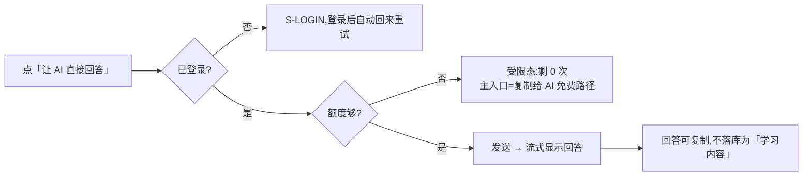

[← 用户侧功能规格](INDEX.md) ｜ [模块 E · 出口层](../modules/模块E-出口层.md)

# 导出与问 AI · 逐屏规格

> **这份文档回答:用户怎么把自己的盲区带出去用,以及带出去的东西里有什么、没有什么。**
> 覆盖 `S-EXP`,以及嵌在 `S-NODE` 的「带去问 AI」入口。
>
> **不是**出口层的产品判断(在 [`模块 E · 出口层`](../modules/模块E-出口层.md))、**不是**令牌与 MCP 的实现
> (在 [`技术架构与接口契约`](../../technical/INDEX.md) §6.5)。
>
> **基线:`origin/v1` @ `83b9632`,fetch 于 2026-09-01T14:00Z。** **状态:活跃。**

---

## 一、三条出口,性质完全不同

| 出口 | 是什么 | 要账号 | 要额度 | 阶段 |
|---|---|---|---|---|
| **导出文件** | 把我的数据整份拿走 | ❌ | ❌ | 阶段 1 |
| **复制给 AI**(免费路径) | 生成一段文字,用户自己粘到任何 AI 里 | ❌ | ❌ | 阶段 1 |
| **AI 代发**(付费路径) | 产品替用户把这段文字发给模型并把回答带回来 | ✅ | ✅ | 阶段 2 后 |

🔴 **导出永远不限次数、无水印、不删减、不因为没付费而缩水**(`1.3.6.1`)。
这是承诺不是策略 —— 一个「导出要会员」的产品在讲「你的数据是你的」时没有可信度。

---

## 二、`S-EXP` 导出与问 AI

### 2.1 元素清单

| 区 | 元素 | 取值 | 为空时 |
|---|---|---|---|
| 顶 | 范围选择 | 「全部」/「某个科目」/「这一个考点」(从 `S-NODE` 进来时预选) | 默认「全部」 |
| 一 | **导出**:格式三选一 `Markdown` / `CSV` / `JSON` | —— | —— |
| 一 | 「导出」按钮 + 一行说明 | 「不限次数,没有水印」 | —— |
| 二 | **复制给 AI**:预览框(可滚动,可编辑) | 本地生成的文本 | 无数据时整区隐藏 |
| 二 | 「复制」按钮 | —— | —— |
| 三 | **让 AI 直接回答**(阶段 2 后) | —— | 未登录时显示但点击进登录 |
| 三 | 剩余次数 | `GET /quota` 的 `ai_ask.remaining` | 「这个月还剩 0 次」 |
| 四 | 只读令牌(MCP)入口 | —— | 阶段 2 后才显示 |

### 2.2 「带出去的东西里有什么」——必须在屏幕上说清

预览框上方一行小字,**原文**:

> 这段文字里只有:考点名称、你碰过几次、最近一次多久前、来源名称。**没有任何题目内容。**

🔴 这不是免责声明,是产品事实:数据库里就不存题干(边界:不存储任何培训机构的课程内容,连预留字段都没有)。

### 2.3 复制给 AI 的文本长什么样

```
我在准备 {科目}。下面是我最近学过和没学过的考点情况,请你帮我判断先补哪些。

【我没碰过的】
- 行政处罚的种类(近 5 年出现 7 次)
- 行政强制的程序(近 5 年出现 5 次)

【我碰过但很久没碰的】
- 行政许可的设定(碰过 2 次,最近一次 34 天前)

【我标了已经会了的】
- 行政复议的范围
```

| 规则 | 说明 |
|---|---|
| 谁做学科判断 | **用户自己接的模型**。产品只提供差集,不提供任何判断 |
| 文本可编辑 | ✅ 用户可以改任何一句再复制 |
| 长度上限 | 超过 🚧(见 §五 `X-1`)时提示「太长了,先选一个科目」 |
| 不包含 | 题目、答案、解析、机构名以外的课程内容、用户手机号与账号 ID |

### 2.4 导出文件

| 格式 | 给谁用 | 内容 |
|---|---|---|
| `Markdown` | 人读 / 粘给 AI | 按章节分层的清单 |
| `CSV` | 表格软件 | 一行一个考点:名称 · 章节 · 出现次数 · 我碰过几次 · 最近时间 |
| `JSON` | 自己写脚本 | 同 CSV 的字段,外加记录列表 |

- 点「导出」→ 端上直接下载 / 分享(`GET /export?format=`)
- 大数据量时:先 Toast「正在准备」→ 完成后再触发下载,**不阻塞界面**
- **导出永远不需要等待审核、不需要邮箱、不发到邮件**

### 2.5 AI 代发(阶段 2 后)



| 规则 | 说明 |
|---|---|
| 额度预检 | `POST /quota/precheck`,**只读不扣减**;剩 0 时响应带手动入口提示 |
| 扣减时机 | 服务端内部动作,不是可调用端点(`技术架构与接口契约` §6.7.1) |
| 失败不扣 | 模型调用失败时**不消耗次数**,界面明写「这次没算次数」 |
| 回答的归属 | 回答是模型给的,**产品不为其正确性背书**;界面底部一行小字:「这是你接的模型给的回答」 |
| 回答存哪 | 🚧 见 §五 `X-2` |

🔴 **回答里可能出现讲解 —— 那是模型的输出,不是产品的功能。** 产品不得把它二次加工成「学习建议」「复习计划」,
也不得把它存成结构化的「知识点讲解」。**存了就等于产品自己做了教研。**

### 2.6 只读令牌 / MCP(阶段 2 后)

| 元素 | 规则 |
|---|---|
| 签发 | **只在 Web 界面手动签发**,前缀 `ro_`;签发后只显示一次 |
| 文案 | 「这个令牌只能读,不能改任何东西」 |
| 列表 | 名称 · 创建时间 · 最后使用时间 · 吊销按钮 |
| 🔴 不暴露 | 支付与额度一律不给 MCP(`技术架构与接口契约` §6.7.3) |

---

## 三、`S-NODE` 上的「把这个考点带去问 AI」

从考点详情进入时:范围预选为**这一个考点**,预览文本只含这一个考点及我的相关记录时间。
**不带记录正文** —— 记录正文可能被用户抄了题干进去,带出去就是把题干带出了本机(见 §四 `X-05`)。

---

## 四、异常全集

| # | 触发 | 表现 | 文案 | 下一步 |
|---|---|---|---|---|
| `X-01` | 无数据可导 | 空态 | 「还没有可以导出的东西」 | 去记一条 |
| `X-02` | 导出请求失败 | 错误态 | 「导出没成」 | 重试 |
| `X-03` | 端不支持下载(小程序) | 改为「复制全文」+ 说明 | 「这个端不能下载文件,已经帮你复制了」 | 粘贴 |
| `X-04` | 预览文本过长 | 页内提示 | 「太长了,先选一个科目」 | 缩小范围 |
| `X-05` | 记录正文疑似含题干 | **不阻断,但不带出去** | 「记录正文没有带上」 | —— |
| `X-06` | 未登录点代发 | 受限 | 「这一步需要先登录」 | 登录后自动重试 |
| `X-07` | 额度为 0 | 受限态 | 「这个月的 AI 次数用完了」+ **免费路径作主入口** | 复制给 AI |
| `X-08` | 模型调用超时 | 错误态 | 「模型没回,这次没算次数」 | 重试 |
| `X-09` | 模型返回空 | 同上 | 「模型这次没给出回答,没算次数」 | 重试 |
| `X-10` | 流式中断 | 保留已收到的部分 | 「回答只收到一半」 | 重试 |
| `X-11` | 令牌泄露担心 | 令牌列表可一键吊销 | 「吊销后立刻失效」 | 吊销 |
| `X-12` | 只读令牌尝试写操作 | 服务端 403 | —— | 界面无入口 |

---

## 五、缺口登记

| # | 缺口 | 卡在哪 |
|---|---|---|
| `X-1` | **预览文本的长度上限** | 没定。它取决于用户接的模型上下文,而那是用户的选择,产品只能给一个保守值 |
| `X-2` | **AI 代发的回答存不存** | 没定。存了要回答「它算不算学习内容」;不存则用户换设备就没了。**🔴 存的话必须确认它不构成题干存储** |
| `X-3` | **「问 AI 时带上的东西」两条路径的契约** | `模块 E · 出口层` 已登记为 `E-1`:免费复制路径与付费代发路径在 `技术架构与接口契约` §六 都没有契约行。**这一份规格写出了界面,契约仍然是空的** |

---

## 六、红线自查

| 检查 | 结果 |
|---|---|
| 导出不限次数、无水印、不删减 | ✅ §一 |
| 带出去的内容不含题干 | ✅ §2.2 · §三 · `X-05` |
| 不把模型回答加工成建议/计划 | ✅ §2.5 |
| 不给 MCP 支付与额度 | ✅ §2.6 |
| 不含禁用词 | ✅ |
