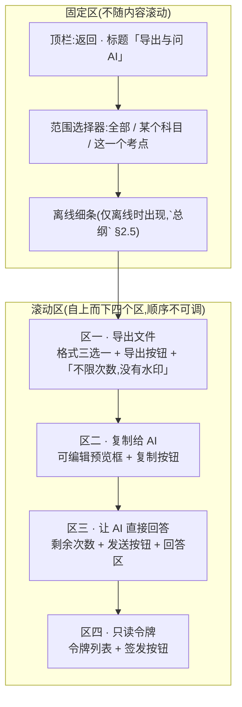
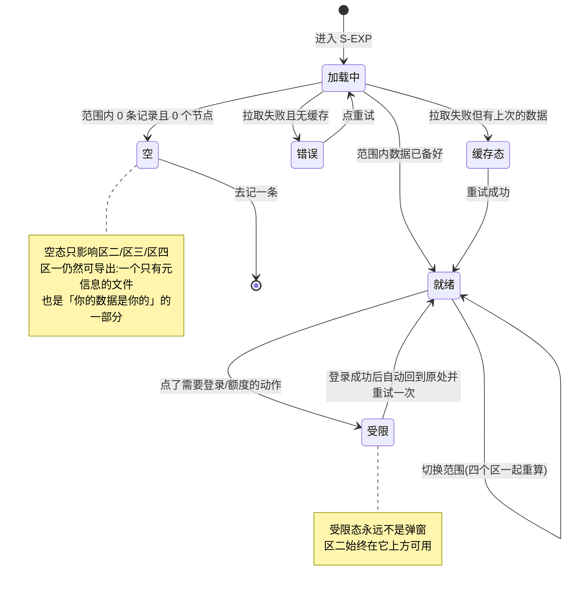
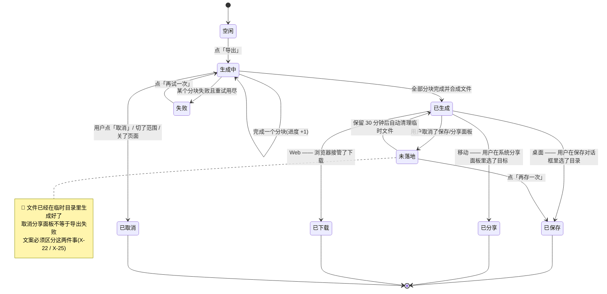
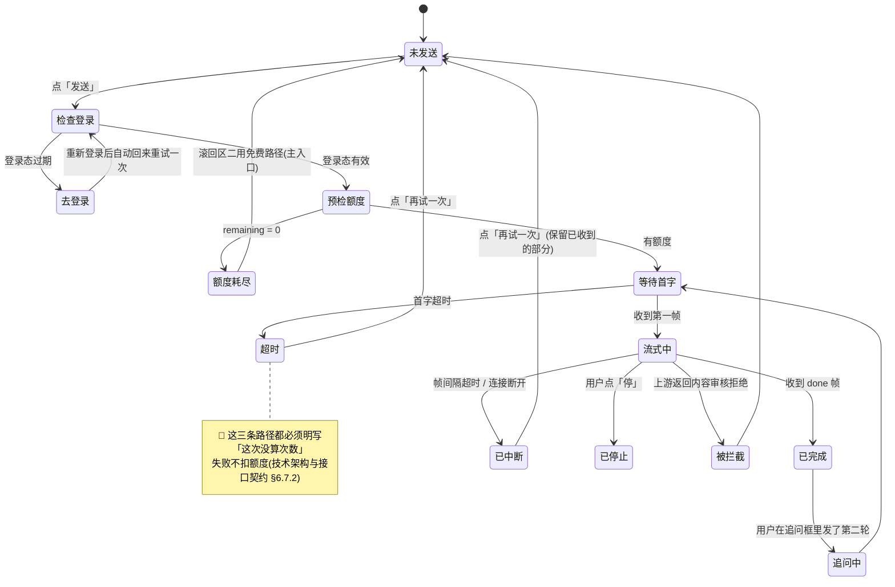
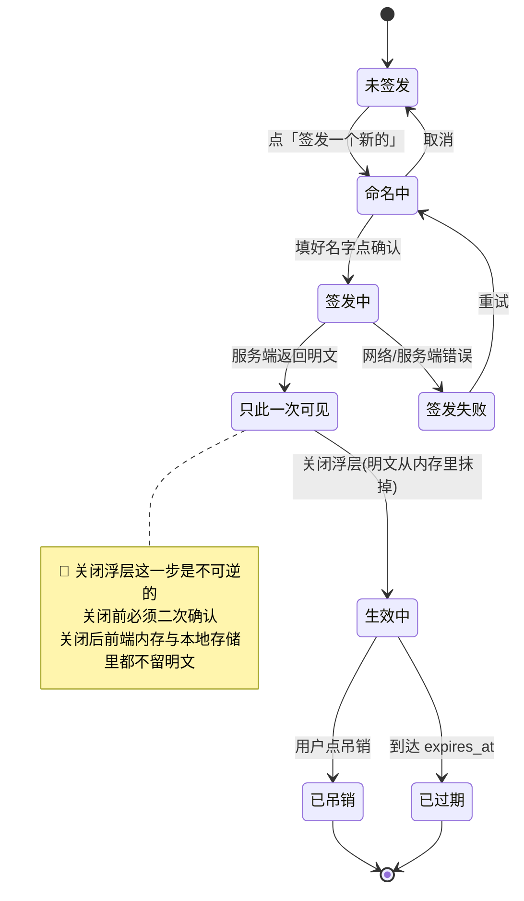
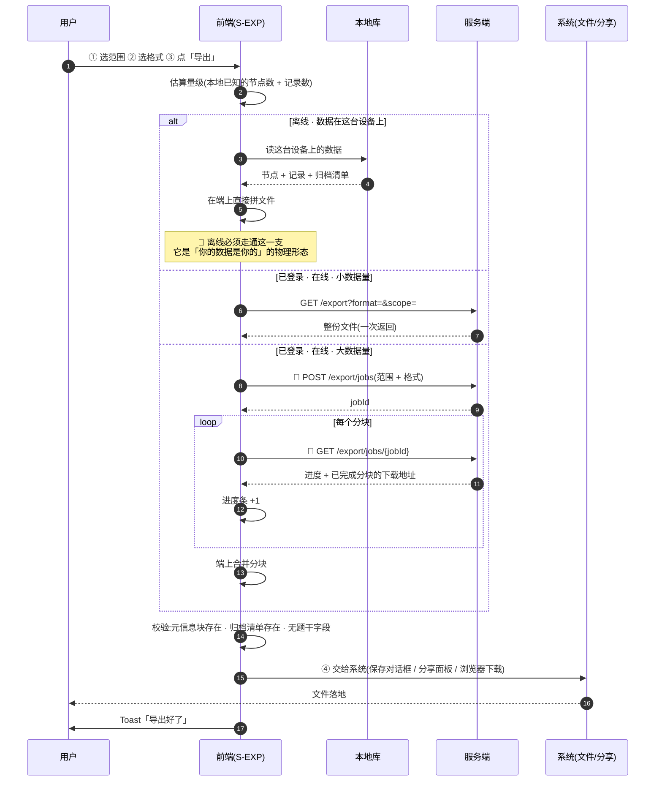
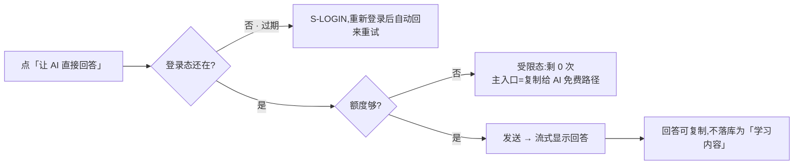
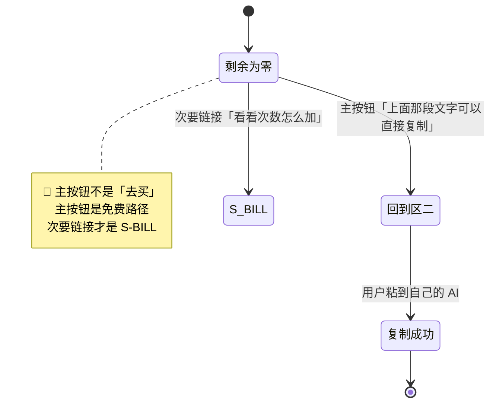
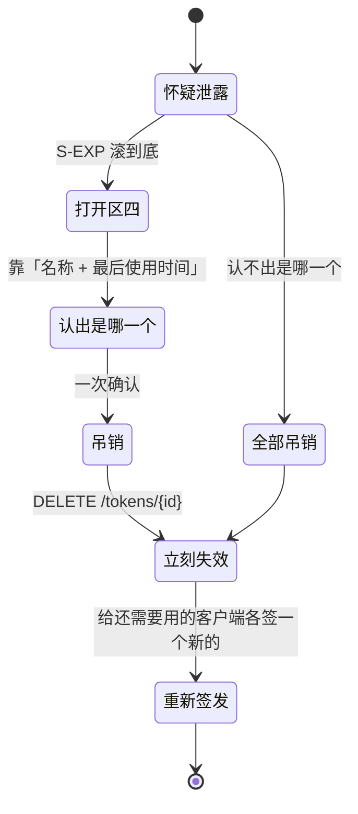

[← 用户侧功能规格](INDEX.md) ｜ [模块 E · 出口层](../modules/模块E-出口层.md)

# 导出与问 AI · 逐屏规格

> **这份文档回答:用户怎么把自己的盲区带出去用,以及带出去的东西里有什么、没有什么。**
> 覆盖 `S-EXP`,以及嵌在 `S-NODE` 的「带去问 AI」入口,以及只读令牌(MCP)这条出口。
>
> **不是**出口层的产品判断(在 [`模块 E · 出口层`](../modules/模块E-出口层.md))、**不是**令牌与 MCP 的实现
> (在 [`技术架构与接口契约`](../../technical/INDEX.md) §6.5)。全局约定在 [`总纲`](INDEX.md) §二,不在本文重复。
>
> **写到可以直接做 UI 设计与前后端开发为止。** 凡是数字(额度、条数上限、令牌有效期、文件大小上限)一律给指针指向真源;
> 本文**新提出**的端点一律标 `🚧 待技术定稿` —— **它是产品意图不是契约**,契约仍然由技术同事补(`模块 E · 出口层` 缺口 `E-1`)。
>
> **编号约定**:异常编号两位补零(`X-01`),缺口编号不补零(`X-1`),两套编号互不覆盖,都只往后加、不重排。
>
> **基线:`origin/v1` @ `15accea`,fetch 于 2026-09-01T15:05Z。** **状态:活跃。**

---

## 一、三条出口,性质完全不同

### 1.1 出口对照

| 出口 | 是什么 | 要账号 | 要额度 |
|---|---|---|---|
| **导出文件** | 把我的数据整份拿走 | ✅ | ❌ |
| **复制给 AI**(免费路径) | 生成一段文字,用户自己粘到任何 AI 里 | ✅ | ❌ |
| **AI 代发**(付费路径) | 产品替用户把这段文字发给模型并把回答带回来 | ✅ | ✅ |

🔴 **导出永远不限次数、无水印、不删减、不因为没付费而缩水**(`1.3.6.1`)。
这是承诺不是策略 —— 一个「导出要会员」的产品在讲「你的数据是你的」时没有可信度。

⚠️ **「要账号」这一列 2026-09-02 由 ❌ 改成 ✅**(用户裁定:没有本地模式)。
理由不是把导出收紧了,而是**登录前根本不产生数据** —— 没有可导的东西,也就没有「未登录导出」这件事。
🔴 **这一改不动上面那条红线**:不限次数、无水印、不删减是对**每一个已登录用户**的承诺,免费档与付费档拿到的东西一模一样。

### 1.2 第四条通道:只读令牌(MCP)

上面三条是**用户自己把数据带出去**;第四条是**用户授权另一个程序进来读**。性质不同,所以单列一行,不并进上表。

| 通道 | 是什么 | 要账号 | 要额度 | 性质 |
|---|---|---|---|---|
| **只读令牌(MCP)** | 签发一串只能读的凭证,让用户自己的 AI 客户端直接读他的盲区 | ✅ | ❌ | 营销资产,不是收入线(`模块 E · 出口层` §2.5) |

它和前三条的关系:**前三条是一次性的、用户在场的;第四条是持续的、用户不在场的。**
所以第四条唯一多出来的产品要求是**可撤销**与**可见**:令牌列表常驻、最后使用时间常驻、吊销一步到位。

### 1.3 四条出口共用同一句话

**带出去的东西里只有三件事:有没有、几次、多久前。** 外加两类名字:**考点名称**(来自骨架闭集)与**来源名称**(用户自己填的机构/课程名)。

| 出口 | 载体 | 这一句在哪被说给用户听 |
|---|---|---|
| 导出文件 | 文件内容 | 文件头的元信息块 + 导出按钮旁一行小字 |
| 复制给 AI | 预览框文本 | 预览框上方一行小字 + 文本自身的【说明】段 |
| AI 代发 | 发出去的请求体 | 与「复制给 AI」同一段文本,**逐字一致** |
| 只读令牌 | MCP 的 5 个 tool 返回值 | 签发页的「这个令牌能读到什么」清单 |

🔴 **四条出口的内容边界是同一条,不是四条。** 只要有一条比其它三条多带了一类东西,那一条就是被绕过去的那个口子。

### 1.4 出口 × 前置条件矩阵

| 出口 | 已登录·免费 | 已登录·付费 | 无骨架 | 完全离线 |
|---|---|---|---|---|
| 导出文件(这台设备上的数据) | ✅ | ✅ | ⚠️ 只能导记录,导不出盲区 | ✅ **必须可用** |
| 导出文件(云端数据) | ✅ | ✅ | 同上 | ❌ 见 §十四 |
| 复制给 AI | ✅ | ✅ | ❌ 整区隐藏 | ✅ 这台设备上的数据可用 |
| AI 代发 | ✅ 额度内 | ✅ 额度内 | ❌ | ❌ |
| 只读令牌 | ✅ | ✅ | 不相关 | ❌ 签发/吊销都要网 |

**矩阵里没有「未登录」这一列**(2026-09-02 用户裁定:没有本地模式)。未登录只能看到产品说明与登录门,
**不能记、不能看盲区、不能打标、不能导出** —— 不是把导出关掉了,是那时候一条数据都还没有。
运行时唯一与登录有关的情况是**登录态中途过期**,见 `X-53`。

🔴 **免费用户能完整走通「记录 → 看盲区 → 导出」,这条主链路上一个付费墙都没有。**
`S-EXP` 上唯一带额度的元素是「让 AI 直接回答」,而它的兜底就在同一屏、同一个滚动位置上方(见 §九)。

---

## 二、`S-EXP` 屏幕结构

### 2.1 区块划分



**四个区的顺序是产品判断,不是排版偏好:**

| 顺序 | 为什么它在这个位置 |
|---|---|
| 区一在最上 | 导出是**唯一一条对所有人、所有状态都成立**的出口。把它放在第一屏,是「你的数据是你的」这句话在版面上的落点 |
| 区二紧随其后 | 免费路径永不移除(`模块 E · 出口层` §2.3)。它必须在付费路径**之上**,而不是之下 —— 放在下面就变成了「付费不成再看看这个」 |
| 区三在区二之下 | 🔴 **付费增强不许挡在免费路径前面。** 额度耗尽时用户往上滚一屏就是完整可用的免费路径 |
| 区四在最下 | 面向的是「会配 MCP 客户端」的少数用户,且它是常驻管理界面不是一次性动作 |

⚠️ **不做吸底主按钮。** 四个区各有各的动作按钮,一个吸底按钮会让用户读不出它属于哪一区;
而「导出」和「发给 AI」被误点的代价完全不同(一个不可撤销地花钱)。

### 2.2 固定区与滚动区的分界

| 元素 | 固定 / 滚动 | 理由 |
|---|---|---|
| 顶栏 | 固定 | 任何时候都能返回(`总纲` §2.4) |
| 范围选择器 | **固定** | 它同时改四个区的内容。滚到区三时看不见当前范围,用户会以为发出去的是全部 |
| 离线细条 | 固定,置于范围选择器之下 | 与全局约定一致 |
| 四个区 | 滚动 | —— |
| 回答区(区三)内部 | 区内独立滚动 | 流式回答可能很长;它不该把区四推到看不见的地方 |
| 预览框(区二)内部 | 区内独立滚动,**最多 12 行高** | 见 §十二 边界值 |

### 2.3 从不同入口进来时的预选状态

| 入口 | 范围预选 | 格式预选 | 落地滚动位置 | 焦点落在 |
|---|---|---|---|---|
| `S-SET` →「导出我的全部数据」 | 全部 | `Markdown` | 顶部(区一) | 格式选择器第一项 |
| `S-BLIND` → 导出入口 | 当前科目 | `Markdown` | 顶部(区一) | 格式选择器第一项 |
| `S-NODE` →「把这个考点带去问 AI」 | **这一个考点** | 不变 | **区二,预览框顶端可见** | 预览框(不自动展开键盘) |
| `S-ACC` → 注销前的「先导出」提示 | 全部 | `JSON` | 顶部(区一) | 「导出」按钮 |
| 直接进入(深链 / 返回栈) | 上次的选择 | 上次的选择 | 顶部 | 范围选择器 |

🔴 **注销路径预选 `JSON` 是有意的**:注销是不可逆的,`JSON` 是三种格式里唯一能被程序完整重读的一种。
`DELETE /account` 的响应必须带导出入口提示(`技术架构与接口契约` §6.1),这一行就是那个提示的落点。

⚠️ **从 `S-NODE` 进来时不预选格式、也不改格式**:用户上一次选了 `CSV`,这次从考点详情进来仍然是 `CSV`。
范围是这次动作带来的信息,格式是用户的长期偏好,**两者不能互相覆盖**。

### 2.4 「带出去的东西里有什么」——必须在屏幕上说清

预览框上方一行小字,**原文**:

> 这段文字里只有:考点名称、你碰过几次、最近一次多久前、来源名称。**没有任何题目内容。**

导出按钮下方一行小字,**原文**:

> 不限次数,没有水印。文件里只有考点名称、时间、来源名称和统计数字。

🔴 这不是免责声明,是产品事实:数据库里就不存题干(边界:不存储任何培训机构的课程内容,连预留字段都没有)。
**两句话的措辞不同但断言相同** —— 一句面向「我要粘给 AI」,一句面向「我要留一份」。

---

## 三、元素清单

**读法**:「可点吗」为 ❌ 的元素永远不接收焦点也不产生 hover 态;「禁用条件」为空表示它没有禁用态,只有出现/不出现。
朗读文本里的 `{}` 是运行时替换,朗读文本**不朗读装饰性图标**。

### 3.1 固定区

| 元素 | 取值来源 | 为空时 | 可点吗 | 禁用条件 | 无障碍朗读文本 |
|---|---|---|---|---|---|
| 返回 | —— | —— | ✅ | 无 | 「返回」 |
| 标题 | 固定文案「导出与问 AI」 | —— | ❌ | —— | 「导出与问 AI,页面标题」 |
| 范围选择器 · 全部 | —— | —— | ✅ | 无 | 「范围:全部,{已选中/未选中}」 |
| 范围选择器 · 科目 | 用户已有记录涉及的科目(同 `S-BLIND` 口径) | 只有一个科目时**不显示这一项**,直接落到「全部」 | ✅ | 该科目下 0 个节点时禁用 | 「范围:{科目名},{已选中/未选中}」 |
| 范围选择器 · 这一个考点 | 从 `S-NODE` 带入的 `nodeId` | 非 `S-NODE` 入口时**不显示这一项** | ✅ | 无 | 「范围:考点 {考点名},{已选中/未选中}」 |
| 离线细条 | 端的网络状态 | 在线时不出现 | ❌ | —— | 「离线中,已存在这台设备上,联网后自动同步」 |

### 3.2 区一 · 导出文件

| 元素 | 取值来源 | 为空时 | 可点吗 | 禁用条件 | 无障碍朗读文本 |
|---|---|---|---|---|---|
| 区标题「导出文件」 | 固定 | —— | ❌ | —— | 「导出文件,区域标题」 |
| 格式 `Markdown` | —— | —— | ✅ | 无 | 「格式 Markdown,给人读的清单,{已选中/未选中}」 |
| 格式 `CSV` | —— | —— | ✅ | 小程序端不显示(见 §十五) | 「格式 CSV,给表格软件,{已选中/未选中}」 |
| 格式 `JSON` | —— | —— | ✅ | 无 | 「格式 JSON,给自己写脚本,{已选中/未选中}」 |
| 格式说明一行 | 随所选格式变(见 §六 表头) | —— | ❌ | —— | 随文案朗读 |
| 「导出」按钮 | —— | —— | ✅ | ①当前范围内 0 条记录且 0 个节点 ②导出任务处于「生成中」 | 「导出,按钮{,不可用:{原因}}」 |
| 按钮下小字 | 固定文案(§2.4) | —— | ❌ | —— | 「不限次数,没有水印。文件里只有考点名称、时间、来源名称和统计数字」 |
| 进度条 | 导出任务的已完成分块数 | 未在生成时不出现 | ❌ | —— | `aria-live=polite`,每完成 25% 播报一次「正在准备,已完成 {n}%」 |
| 「取消」按钮 | —— | 未在生成时不出现 | ✅ | 无 | 「取消这次导出,按钮」 |
| 「上次导出:{时间}」 | 端本地记录 | 从未导出过时不出现 | ❌ | —— | 「上次导出:{绝对时间}」 |

⚠️ **「上次导出」只显示时间,不显示次数。** 显示次数会把导出做成一个可比较的数字,而导出次数不是本产品要提高的任何一个数(`模块 E · 出口层` §2.2)。

### 3.3 区二 · 复制给 AI

| 元素 | 取值来源 | 为空时 | 可点吗 | 禁用条件 | 无障碍朗读文本 |
|---|---|---|---|---|---|
| 区标题「复制给 AI」 | 固定 | —— | ❌ | —— | 「复制给 AI,区域标题」 |
| 边界小字 | 固定文案(§2.4) | —— | ❌ | —— | 「这段文字里只有考点名称、你碰过几次、最近一次多久前、来源名称。没有任何题目内容」 |
| **预览框** | 本地按 §八 模板生成 | 当前范围内没有任何考点 → **整区隐藏**(不是显示空框) | ✅ 可编辑 | 生成中时只读并显示骨架 | 「问 AI 用的文字,多行文本框,可编辑,共 {n} 字」 |
| 字数计数 | 预览框实时字数 | —— | ❌ | —— | 仅在接近上限时播报,见 §十二 |
| 「复制」按钮 | —— | —— | ✅ | 预览框为空(用户全删了) | 「复制这段文字,按钮」 |
| 「恢复成生成的那一版」 | —— | 用户没改过时不出现 | ✅ | 无 | 「恢复成产品生成的那一版,按钮」 |
| 「换成只发这一个考点 / 换成整个科目」 | 范围选择器的快捷镜像 | 范围只有一种可选时不出现 | ✅ | 无 | 「把范围换成 {目标范围},按钮」 |

### 3.4 区三 · 让 AI 直接回答

| 元素 | 取值来源 | 为空时 | 可点吗 | 禁用条件 | 无障碍朗读文本 |
|---|---|---|---|---|---|
| 区标题「让 AI 直接回答」 | 固定 | —— | ❌ | —— | 「让 AI 直接回答,区域标题」 |
| 剩余次数 | `GET /quota` 的 `ai_ask.remaining` | 请求未回时显示「—」不显示 0 | ❌ | —— | 「这个月还剩 {n} 次」 |
| 「这个月还剩 0 次」时的兜底指引 | 固定文案 | 剩余 > 0 时不出现 | ✅(滚回区二) | 无 | 「这个月的次数用完了。上面那段文字可以直接复制,粘到你自己的 AI 里,按钮:回到复制」 |
| 「发送」按钮 | —— | —— | ✅ | ①登录态过期时**不禁用**,点击进重新登录(`X-53`) ②生成中 ③预览框为空 ④离线 | 「把上面那段文字发给 AI,按钮{,不可用:{原因}}」 |
| 模型名称与备案标识 | 服务端返回(`商业化与额度设计` §5.2「须公示所用模型的名称与备案号/上线编号」) | 未返回时**不发送**,见 `X-44` | ❌ | —— | 「这次用的模型:{名称},{备案标识}」 |
| 回答区 | 流式返回 | 未发送过时不出现 | ✅ 可选中复制 | —— | 见 §十七 播报节流 |
| 回答区底部小字 | 固定文案 | —— | ❌ | —— | 「这是你接的模型给的回答」 |
| 「停」按钮 | —— | 非流式进行中时不出现 | ✅ | 无 | 「停止接收,按钮」 |
| 「复制回答」 | —— | 回答为空时不出现 | ✅ | 无 | 「复制这段回答,按钮」 |
| 追问输入框 | 用户输入 | 首轮未完成时不出现 | ✅ | 额度为 0 时禁用并露出兜底指引 | 「接着问,单行输入框,{n}/{上限} 字」 |
| 「这次没算次数」提示 | 服务端失败响应 | 成功时不出现 | ❌ | —— | 「这次没算次数」 |

### 3.5 区四 · 只读令牌

| 元素 | 取值来源 | 为空时 | 可点吗 | 禁用条件 | 无障碍朗读文本 |
|---|---|---|---|---|---|
| 区标题「只读令牌」 | 固定 | —— **区四常驻,不隐藏** | ❌ | —— | 「只读令牌,区域标题」 |
| 说明一行 | 固定文案 | —— | ❌ | —— | 「这个令牌只能读,不能改任何东西」 |
| 「它能读到什么」清单 | 固定,5 条,与 `技术架构与接口契约` §6.5 锁 3 的 tool 白名单一一对应 | —— | ❌ | —— | 逐条朗读 |
| 令牌列表行:名称 | `GET /tokens` | 一个都没有时显示空态 + 签发按钮 | ✅(展开详情) | 无 | 「令牌 {名称}」 |
| 令牌列表行:创建时间 | 同上 | —— | ❌ | —— | 「创建于 {绝对时间}」 |
| 令牌列表行:最后使用时间 | 同上 | 从未使用过 → 「还没被用过」 | ❌ | —— | 「最后一次被用:{绝对时间 / 还没被用过}」 |
| 令牌列表行:吊销按钮 | —— | —— | ✅ | 已吊销的行不显示按钮 | 「吊销令牌 {名称},按钮」 |
| 「签发一个新的」按钮 | —— | —— | ✅ | ①达到个数上限 ②离线 ③当前不是 Web/桌面界面(见 §十五) | 「签发一个新的只读令牌,按钮{,不可用:{原因}}」 |
| 令牌名称输入框 | 用户输入 | —— | ✅ | 无 | 「给这个令牌起个名字,输入框,{n}/{上限} 字」 |
| **令牌明文** | 签发响应,**只此一次** | —— | ✅ 可选中 | 无 | 见 §十七「只展示一次的内容」 |
| 「复制令牌」按钮 | —— | —— | ✅ | 无 | 「复制令牌,按钮」 |
| 「我已经存好了」按钮 | —— | —— | ✅ | 未复制且未选中过时**仍可点**,但走二次确认 | 「我已经存好了,按钮」 |

---

## 四、状态枚举

### 4.1 屏幕级状态



| 状态 | 触发 | 区一 | 区二 | 区三 | 区四 |
|---|---|---|---|---|---|
| 加载中 | 首次进入 / 换范围 | 按钮禁用 + 骨架 | 预览框骨架 | 剩余次数「—」 | 列表骨架 |
| 就绪 | 数据备好 | 可用 | 可用 | 可用 | 可用 |
| 空 | 范围内没有任何考点与记录 | **仍可导出**(只含元信息) | **整区隐藏** | 整区隐藏 | 不受影响 |
| 缓存态 | 网络失败但有上次数据 | 可用,标「这是刚才的数据」 | 可用,同标 | **禁用**(不拿旧数据发给模型) | 只读,不可签发 |
| 错误 | 网络失败且无数据 | 禁用 | 隐藏 | 隐藏 | 错误态 + 重试 |
| 受限 | 额度为 0 / 登录态过期(`X-53`) | 不受影响 | 不受影响 | 见 §九 | 不受影响(令牌与额度无关) |
| 离线 | 端离线 | **本机数据可用** | 本机数据可用 | 禁用 | 禁用 |

🔴 **区一在上表里只有两种禁用:加载中、无数据。** 没有任何一行是「因为没登录」或「因为没付费」。

### 4.2 导出任务状态机



| 状态 | 界面 | 可以做什么 | 数据留住了吗 |
|---|---|---|---|
| 空闲 | 「导出」按钮常态 | 换范围、换格式 | 不涉及 |
| 生成中 | 进度条 + 「取消」;**按钮变为不可重复点击** | 取消 | 不涉及 |
| 已生成 | 桌面弹保存对话框 / 移动弹分享面板 / Web 触发下载 | 保存、分享、下载 | ✅ 临时文件在 |
| 已保存 / 已分享 / 已下载 | Toast「导出好了」(2 秒) | —— | ✅ 用户手上有一份 |
| 未落地 | 页内提示 + 「再存一次」 | 再存一次 | ✅ 临时文件保留 30 分钟 🚧(见 `X-9`) |
| 失败 | 错误态 + 「再试一次」 | 重试 | ✅ 源数据一个字没动 |
| 已取消 | 无提示(用户自己取消的,不需要被告知) | —— | ✅ 临时文件立即清理 |

### 4.3 AI 代发会话状态机



| 状态 | 屏幕上 | 额度 | 「停」按钮 | 追问框 |
|---|---|---|---|---|
| 未发送 | 发送按钮可用 | 不动 | 不显示 | 不显示 |
| 检查登录 / 预检额度 | 发送按钮转为「正在准备」并禁用 | 不动(预检只读) | 不显示 | 不显示 |
| 额度耗尽 | 受限态,兜底指引在最上 | 不动 | 不显示 | 禁用 |
| 等待首字 | 回答区骨架 + 模型名称已就位 | 不动 | 显示 | 不显示 |
| 流式中 | 回答逐段出现 | 不动 | 显示 | 不显示 |
| 已完成 | 回答完整 + 底部小字 | **此时才扣 1 次** | 不显示 | 显示 |
| 已停止 | 保留已收到的部分 + 「这次没算次数」 | 不扣 | 不显示 | 显示 |
| 已中断 / 超时 / 被拦截 | 错误态 + 「这次没算次数」 | 不扣 | 不显示 | 不显示 |

### 4.4 只读令牌状态机



| 状态 | 列表里怎么显示 | 能用吗 | 能吊销吗 |
|---|---|---|---|
| 只此一次可见 | 尚未入列表 | 已经能用 | —— |
| 生效中 | 名称 + 创建时间 + 最后使用时间 | ✅ 只读 | ✅ |
| 已吊销 | 灰色 + 「已吊销 {时间}」,**保留在列表里** | ❌ 403 | 不显示按钮 |
| 已过期 | 灰色 + 「已过期 {时间}」,保留在列表里 | ❌ 401 | 不显示按钮 |

⚠️ **已吊销/已过期的行不从列表里消失。** 用户吊销一个令牌之后要能确认「它确实被吊销了」;
列表里凭空少一行,和「我是不是吊销错了那个」是同一种不确定。

---

## 五、出口一 · 导出文件:逐步骤交互

### 5.1 四步,一步都不能加

| 步 | 用户做什么 | 屏幕上发生什么 | 不允许发生什么 |
|---|---|---|---|
| ① 选范围 | 点范围选择器 | 四个区一起重算;区一按钮上的文字不变 | 不允许弹「确定要换范围吗」 |
| ② 选格式 | 点 `Markdown` / `CSV` / `JSON` | 格式说明一行随之更换 | 不允许有「推荐」标记 —— 三种格式没有优劣 |
| ③ 生成 | 点「导出」 | 小数据量:直接就绪;大数据量:进度条 + 取消 | 🔴 不允许要求登录、不允许要求邮箱、不允许发到邮件、不允许排队审核 |
| ④ 落地 | 桌面选目录 / 移动选分享目标 / Web 由浏览器接管 | Toast「导出好了」 | 不允许在这一步再问一次「要不要升级」 |

🔴 **这四步里没有任何一步能被付费状态改变。** 免费档用户走的是同样的四步,拿到的是同样格式、同样字段、同样没有水印的文件。

### 5.2 时序



> **`POST /export/jobs` 与 `GET /export/jobs/{jobId}` 是本文新提出的,标 `🚧 待技术定稿`。**
> 它们**不是契约**,是产品对「大数据量导出不能把界面卡死」这一条的意图表述。契约行仍然由技术同事补(`模块 E · 出口层` `E-1` 的同一条纪律)。
> `GET /export?format=` 是既有契约(`技术架构与接口契约` §6.5),小数据量路径直接用它,不改。

### 5.3 大数据量:分块与进度

| 事 | 规则 |
|---|---|
| 分块的单位 | **按考点节点分块,不按字节分块。** 字节分块会把一行 CSV 劈成两半;节点分块的每一块都是自洽的 |
| 阈值 | 🚧 见 §十二 与缺口 `X-5` —— 产品给的是「超过一屏可滚完的量级就要有进度」,具体条数由技术侧按实测给 |
| 进度怎么表达 | 「正在准备,{已完成}/{总数} 个考点」。**不是一个只能看个大概的百分比条,是可数的两个整数** |
| 为什么用整数 | 百分比在最后一块很大时会长时间停在 97%,而两个整数在任何时刻都是诚实的 |
| 取消 | 立即停止;已完成的分块**立即删除**,不留半份文件 |
| 失败重试 | 单块失败自动重试 2 次;仍失败 → 整个任务失败(不交付半份文件) |
| 🔴 不做的事 | 不做「后台继续导出,完了通知你」 —— 那需要一个通知机制,而本产品不做提醒(`R-05`) |

### 5.4 桌面「保存到哪」与移动「分享出去」的差异

| | 桌面壳(Tauri macOS) | 移动 App | Web | 小程序 |
|---|---|---|---|---|
| 落地方式 | 系统保存对话框,用户自己选目录 | 系统分享面板 | 浏览器下载 | **不提供** |
| 默认位置 | 上次选过的目录,首次为「下载」 | 无(由用户选的目标决定) | 浏览器下载目录 | —— |
| 用户能不能取消 | 能 → `未落地` | 能 → `未落地` | 基本不能(浏览器接管后) | —— |
| 取消之后 | 「文件已经准备好了,还没存下来」+「再存一次」 | 同左 | —— | —— |
| 成功之后的附加动作 | 「在访达中显示」 | 无 | 无 | —— |
| 文件名谁定 | 产品给默认名,用户可改 | 产品给默认名,用户一般改不了 | 产品给默认名 | —— |

🔴 **移动端没有「保存到哪」这个概念,所以不能照搬桌面的文案。**
桌面说「已保存到 {目录}」,移动只能说「导出好了」—— 说「已保存」而用户其实点的是「发给微信」,那句话就是假的。

### 5.5 导出后的一次自检(前端做,不依赖服务端)

**文件交给系统之前,前端跑三条断言,任何一条不过就不交付、走 `X-16`:**

| # | 断言 | 为什么是前端做 |
|---|---|---|
| 1 | 元信息块存在且 `schema` 字段有值 | 缺了它,这份文件将来没人能确定是哪一版导的 |
| 2 | 归档清单存在(`archived` 列/节存在,哪怕是 0 条) | `R-49`:归档跟着覆盖度一起藏掉,导出就成了同谋 |
| 3 | **没有任何字段名或字段值属于「题干形状」** | 见 §6.7 —— 这条是红线在客户端的最后一道 |

---

## 六、🔴 导出文件的字段清单与样例

**这一节是本文的核心。** 三种格式的字段清单必须逐格式、逐字段核一遍,因为**导出文件是这条红线最容易破的地方** ——
界面上不写题干很容易做到,而「顺手把 `extracted_text` 也导出去」看起来完全合理。

### 6.0 三格式共用的口径

| 项 | 规则 | 理由 |
|---|---|---|
| 数据来源 | 只有六张表:`syllabus_node` / `syllabus_stat` / `record_event` / `record_tag` / `user_assertion` / `node_coverage`(字段见 `技术架构与接口契约` §5.2) | 六张表之外的任何字段进导出,都要先回答「它从哪来」 |
| **不导出 `record_event.extracted_text`** 🔴 | 三种格式都没有这一列 | 见 §6.6 |
| 不导出的其它字段 | `user_id` / `client_token` / `phone_hash` / `phone_enc` / `token_hash` / 任何 `id` 以外的账号标识 | 导出是给用户自己看的,账号内部标识对他没有意义,而它们是可以被拿去关联的 |
| 时间表示 | **ISO-8601 带时区偏移**,例 `2026-09-01T15:05:00+08:00` | 不用 UTC(用户读不出「这是我几点记的」),不用裸本地时间(换设备后无法还原) |
| 相对时间 | **不进文件。**「34 天前」只出现在预览框与界面上 | 相对时间在文件被打开的那一刻就过期了 |
| 空值 | 见各格式;三种格式都**不写 `null` / `NULL` / `-` / `无` 这类字面量** | 字面量会被下游当成一个真实的值 |
| 排序 | 节点按 `subject → 章节路径 → sort`;记录按 `occurred_at` 升序 | 稳定排序,两次导出可 diff |
| 数量上限 | 🔴 **没有上限。** 不限次数、不限条数、不删减 | `1.3.6.1` |
| 水印 | 🔴 **没有。** 文件里不含任何产品标识以外的东西,元信息块里的产品名不是水印 | 同上 |

### 6.1 元信息块:三种格式都有,字段一致

| 字段 | 含义 | 来源 | 可能为空吗 | **为什么它装不下题干** |
|---|---|---|---|---|
| `schema` | 导出格式版本,固定形如 `kaodian-export/1` 🚧 | 常量 | 否 | 常量,取值域只有版本串 |
| `exported_at` | 导出时刻 | 端上时钟 | 否 | 时间戳 |
| `scope` | `all` / `subject` / `node` | 用户选择 | 否 | 三选一枚举 |
| `scope_name` | 科目名或考点名 | `syllabus_node.name` / `subject` | `scope=all` 时空 | **来自骨架闭集**,取值只能是树上已存在的名字(`R-07`) |
| `syllabus_version` | 骨架版本 | `syllabus_node.version` | 否 | 版本号 |
| `account_mode` | **恒为 `cloud`(已登录)**;~~`local`~~ 这一支 2026-09-02 起**已作废**(没有本地模式,登录前不产生数据) | 端状态 | 否 | 枚举,取值域只剩 `cloud` 一个 |
| `node_total` / `node_touched` / `node_untouched` | 范围内考点总数 / 碰过 / 没碰过 | 覆盖层聚合 | 否 | 整数 |
| `node_archived` | 归档节点数(`R-49` 常驻) | 骨架层 | 否 | 整数 |
| `node_asserted` | 用户标了「已经会了」的数 | `user_assertion` | 否 | 整数 |
| `record_total` | 范围内记录条数 | `record_event` | 否 | 整数 |
| `notice` | 固定一句边界声明,见下 | 常量 | 否 | 常量 |

`notice` 的**原文**(三种格式逐字一致):

> 这份文件里只有考点名称、时间、来源名称和统计数字,没有任何题目内容。

### 6.2 考点表(`nodes`):一行一个考点

| 字段 | 含义 | 来源 | 可能为空吗 | **为什么它装不下题干** |
|---|---|---|---|---|
| `node_id` | 考点在骨架树上的 id | `syllabus_node.id` | 否 | 整数主键 |
| `node_name` | 考点名 | `syllabus_node.name` | 否 | 🔴 **闭集**:值只能是树上已存在的节点名,产品没有任何路径能往这一列写自由文本(`R-07` 在接口层是「只接受 `nodeId` 不接受 `name`」) |
| `node_path` | 章节路径,形如 `法律 / 行政法 / 行政处罚的种类` | 由 `parent_id` 上溯拼接 | 否 | 由上一列同源的名字拼成,最多三层(`level` CHECK ≤ 3) |
| `subject` | 科目 | `syllabus_node.subject` | 否 | 枚举式短串 |
| `level` | 层级 1/2/3 | `syllabus_node.level` | 否 | 整数,有 CHECK 约束 |
| `recent5y_count` | 近 5 年出现次数 | `syllabus_stat.recent5y_count` | 骨架没有统计时空 | 整数 |
| `last_seen_year` | 最近一次出现在哪一年 | `syllabus_stat.last_seen_year` | 可空 | 四位年份 |
| `avg_per_paper` | 每份卷子平均出现次数 | `syllabus_stat.avg_per_paper` | 可空 | 小数 |
| `province_codes` | 出现过的省份代码 | `syllabus_stat.province_codes` | 可空 | 代码串,不是内容 |
| `touch_count` | **我碰过几次** | `node_coverage.touch_count` | 没碰过时为 `0` | 整数 —— 这是「几次」 |
| `last_touch_at` | **我最近一次碰它是什么时候** | `node_coverage.last_touch_at` | 没碰过时空 | 时间戳 —— 这是「多久前」 |
| `source_names` | 我碰它的来源名称集合 | `node_coverage.source_names` | 可空 | 🔴 `source_name VARCHAR(64)`,记的是**名字**不是内容(`技术架构与接口契约` §5.1) |
| `asserted` | 我标了「已经会了」吗 | `user_assertion` 有无对应行 | 否 | 布尔 |
| `asserted_at` | 标记时刻 | `user_assertion.asserted_at` | 未标记时空 | 时间戳 |
| `archived` | 这个考点被归档了吗 | 骨架层归档状态 | 否 | 布尔 —— 🔴 `R-49` 的落点,归档节点**仍然占一行** |
| `archived_at` | 归档时刻 | 骨架层 | 未归档时空 | 时间戳 |

🔴 **这张表里没有一列的类型是长文本。** 全库最长的字符列是 `record_event.extracted_text VARCHAR(200)`,而它**不在这张表里**;
本表最长的字符列是 `source_names`,它由若干个 `VARCHAR(64)` 的来源名拼成 —— 一句「某机构资料分析强化课」放得下,一道题的题干放不下。

### 6.3 记录表(`records`):一行一条学习记录

| 字段 | 含义 | 来源 | 可能为空吗 | **为什么它装不下题干** |
|---|---|---|---|---|
| `record_id` | 记录 id | `record_event.id` | 否 | 整数主键 |
| `occurred_at` | 这条记录发生在什么时候 | `record_event.occurred_at` | 否 | 时间戳 —— 「多久前」的原料 |
| `source_name` | 来源名称 | `record_event.source_name` | 可空(手动记且没填时) | 🔴 `VARCHAR(64)`,只记名字 |
| `capture_type` | `voice` / `photo` / `text` | `record_event.capture_type` | 否 | 三选一枚举 |
| `node_ids` | 这条记录挂到了哪些考点上 | `record_tag.node_id` 聚合 | 一个没挂上时空 | 整数列表 |
| `node_names` | 同上的名字 | 由 `node_ids` 关联出 | 同上 | 闭集名字 |
| `tag_origin` | 每个标签是 `auto` 还是 `manual` | `record_tag.origin` | 否 | 二选一枚举,**写入后不可变** |
| `tag_confirmed_at` | 用户确认标签的时刻 | `record_tag.confirmed_at` | 未确认时空 | 时间戳 |
| `tag_discarded` | 这个标签被丢弃了吗 | `record_tag.discarded` | 否 | 布尔 —— 宁缺毋滥的落地:可见但不计覆盖度 |
| `tag_confidence` | 自动打标的置信度 | `record_tag.confidence` | 手动挂载时空 | `DECIMAL(4,3)` |

🔴 **这张表里没有 `extracted_text`。** 见 §6.6。
🔴 **这张表里没有任何图片相关的列** —— 服务端一张图片表都不建(`技术架构与接口契约` §5.2「不建的表」),端上的原图也不进导出(§6.6)。

### 6.4 归档清单:不是第四张表,是 `nodes` 表里的两列

`R-49` 要求「导出必须带完整归档清单」。**实现方式是 `nodes` 表里的 `archived` / `archived_at` 两列,而不是一个单独的、可以被漏掉的附录。**

| 做法 | 结果 |
|---|---|
| ❌ 单独一节「已归档」 | 它是一个可以被下游读取程序漏读的可选块;漏读之后覆盖率看起来就是满的 |
| ✅ `nodes` 表里的一列 | 归档节点**占用与普通节点完全一样的一行**,任何读这张表的人都必然读到它 |

元信息块里的 `node_archived` 是这一列的计数,两处必须对得上 —— **对不上就是导出实现坏了**,这是一条可断言的检查(见 §二十 `A-22`)。

### 6.5 三种格式的差异

| | `Markdown` | `CSV` | `JSON` |
|---|---|---|---|
| 给谁用 | 人读 / 粘给 AI | 表格软件 | 自己写脚本 |
| 产物 | 单文件 `.md` | **一个 `.zip`**,内含 `nodes.csv` / `records.csv` / `meta.csv` | 单文件 `.json` |
| 为什么 CSV 是压缩包 | —— | CSV 一个文件只能装一张表,而导出必须同时给出考点、记录与元信息。**把三张表塞进一个文件会让程序再也读不回来** —— 那样它就不是 CSV 了 | —— |
| 元信息 | 文件开头的引用块 | `meta.csv`(两列:`key`,`value`) | 顶层对象的 `meta` 字段 |
| 考点 | 按章节分节的列表 | `nodes.csv` | `nodes` 数组 |
| 记录 | 末尾一节「我的记录时间线」 | `records.csv` | `records` 数组 |
| 编码 | **UTF-8 不带 BOM** | 🔴 **UTF-8 带 BOM** | **UTF-8 不带 BOM** |
| 换行 | `LF` | 🔴 **`CRLF`**(RFC 4180) | `LF` |
| 空值 | 该行整段省略,不写占位 | **空字段**(两个逗号之间什么都没有) | **省略该键**,不写 `null` |

**编码这三格是踩过的坑,不是风格偏好:**

| 格式 | 带不带 BOM | 后果 |
|---|---|---|
| `CSV` | **带** | Excel 双击打开一个不带 BOM 的 UTF-8 CSV 时会按系统区域(简中 = GBK)猜编码,中文全变乱码。带上 BOM 之后 Excel 直接认 UTF-8。代价:某些 Linux 工具会把 BOM 当成第一个字段名的一部分 —— 这个代价我们接受,因为 CSV 这个格式就是为表格软件准备的 |
| `JSON` | **不带** | 带 BOM 的 JSON 会让绝大多数 `JSON.parse` 在第一个字符上报错 |
| `Markdown` | **不带** | 带 BOM 时不少渲染器会在第一行渲染出一个不可见怪字符,而第一行正好是标题 |

### 6.6 🔴 为什么记录正文(`extracted_text`)不进导出文件

| 问 | 答 |
|---|---|
| 它是用户自己的东西吗 | 是。它是用户自己记下来的一句话摘要 |
| 那为什么不给他 | 🔴 **因为它是全库唯一一个用户有可能把题干抄进去的字段。** 它进了导出文件,导出文件就有了一个「题干形状」的列 —— 而这份文件会被用户粘给 AI、发到群里、存到网盘 |
| 「导出不删减」不是承诺吗 | 「不删减」的口径是 **🔴 不因为付费与否而少给**。免费用户与付费用户拿到的字段**完全一致**。它不是「把库里每一列都倒出来」 |
| 用户想看自己记过什么怎么办 | 在 `S-TL` 时间线里看,那是他自己账号内的浏览,不产生一份可传播的文件 |
| 这一条谁定的 | 它是 `模块 E · 出口层` §2.4「内容边界:只含来源名称、时间、考点标签与统计」这一句的直接展开 —— 那一句里没有「记录正文」 |
| 还有争议吗 | 有。它与 `S-SET` 上「导出我的全部数据」这句文案的「全部」有张力。**登记为缺口 `X-4`,本文不自行裁定文案怎么改** |

**原图同理,且更硬**:用户上传的原图只存在他自己的机器上(`R-04`),**不进导出文件、不进 AI 代发的请求体、不进 MCP 的任何 tool 返回值**。
导出文件里连一个图片文件名、一个尺寸、一个张数都没有 —— 张数在 `S-RAW` 里显示,它是本机的显示,不是可导出的数据。

### 6.7 「题干形状」的判定:导出自检第 3 条到底检什么

**不能用关键词黑名单检题干** —— 题干里出现什么词是不可枚举的。检的是**形状**:

| 检查 | 判据 | 命中怎么办 |
|---|---|---|
| 字段名白名单 | 导出文件里出现的字段名,必须全部在 §6.1–§6.3 三张表里 | 有表外字段 → 不交付,走 `X-16` |
| 单值长度 | 任何一个字符串值的长度 **不超过 `source_name` 的 64 与 `node_path` 的合理上界** 🚧 | 超长 → 不交付 |
| 值域 | 枚举列的值必须落在枚举里;布尔列只有真假;时间列必须能按 ISO-8601 读出来 | 不合法 → 不交付 |
| 结构 | 不允许出现嵌套的自由文本对象/数组(`JSON` 格式) | 出现 → 不交付 |

🔴 **这四条检的是「有没有一个足够大的洞」,不是「洞里有没有装东西」。**
一个 `VARCHAR(200)` 的列今天装的是摘要,明天就可能装题干 —— 所以判据是**不许有这个洞**,而不是「这次导的这批数据里没有题干」。

### 6.8 文件名规则

```
考点导出-{范围}-{YYYYMMDD-HHmm}.{md|zip|json}
```

| 段 | 规则 |
|---|---|
| `范围` | `全部` / 科目名 / 考点名。取自闭集,不是自由文本 |
| 时间 | **本地时区**的年月日时分,不带秒、不带时区偏移 —— 文件名是给人认的,精确到分钟够了 |
| 非法字符 | `/ \ : * ? " < > |` 与控制字符一律替换为 `-`;首尾的 `.` 和空格去掉 |
| 长度 | 文件名总长上限 🚧(各端不同,见 §十五);超长时**从「范围」段中间截断并加 `…`**,不截时间段 |
| 重名 | 桌面由系统对话框处理;Web 由浏览器加 `(1)`;移动不涉及 |
| 🔴 不含 | 用户昵称、手机号、账号 id、设备名 —— 文件名是会被截图和转发的 |

### 6.9 `Markdown` 样例(脱敏)

> ⚠️ **样例里的考点名是真实存在的公考考点名,来源名是占位。样例里没有任何题目内容、任何选项、任何答案。**

```markdown
# 考点导出 · 全部

> 这份文件里只有考点名称、时间、来源名称和统计数字,没有任何题目内容。

- schema: kaodian-export/1
- 导出于: 2026-09-01T15:05:00+08:00
- 范围: 全部
- 骨架版本: 2026.08
- 账号形态: 已登录
- 考点: 共 128 个 · 碰过 41 个 · 没碰过 87 个 · 已归档 6 个 · 标了「已经会了」3 个
- 记录: 共 96 条

## 法律 / 行政法

### 我没碰过的

| 考点 | 近 5 年 | 最近出现 |
|---|---|---|
| 行政处罚的种类 | 7 次 | 2025 |
| 行政强制措施与行政强制执行 | 5 次 | 2025 |
| 行政复议的受理 | 3 次 | 2024 |

### 我碰过的

| 考点 | 近 5 年 | 我碰过 | 最近一次 | 来源 |
|---|---|---|---|---|
| 行政许可的设定 | 4 次 | 2 次 | 2026-07-29T20:14:00+08:00 | 某网课 |
| 行政诉讼的受案范围 | 6 次 | 1 次 | 2026-08-20T09:02:00+08:00 | 某讲义 |

### 我标了「已经会了」的

| 考点 | 标记于 |
|---|---|
| 行政复议的范围 | 2026-08-11T21:40:00+08:00 |

### 已归档

| 考点 | 归档于 |
|---|---|
| 行政法基本原则(旧版) | 2026-06-02T10:00:00+08:00 |

## 我的记录时间线

| 时间 | 来源 | 采集方式 | 挂到的考点 | 标签来源 |
|---|---|---|---|---|
| 2026-08-20T09:02:00+08:00 | 某讲义 | text | 行政诉讼的受案范围 | manual |
| 2026-07-29T20:14:00+08:00 | 某网课 | voice | 行政许可的设定 | auto(已确认) |
| 2026-07-21T19:30:00+08:00 | 某机构冲刺班 | photo | (没对上任何考点) | —— |
```

⚠️ **时间线那张表里没有「我记了什么」这一列。** 它只有时间、来源名称、采集方式、挂到哪个考点 —— 四件事都不是内容。

### 6.10 `CSV` 样例(脱敏)

`nodes.csv`(UTF-8 带 BOM,CRLF,首行表头):

```csv
node_id,node_name,node_path,subject,level,recent5y_count,last_seen_year,avg_per_paper,province_codes,touch_count,last_touch_at,source_names,asserted,asserted_at,archived,archived_at
10241,行政处罚的种类,法律 / 行政法 / 行政处罚的种类,法律,3,7,2025,0.7,"110000,310000",0,,,false,,false,
10242,行政许可的设定,法律 / 行政法 / 行政许可的设定,法律,3,4,2025,0.4,110000,2,2026-07-29T20:14:00+08:00,某网课,false,,false,
10250,行政复议的范围,法律 / 行政法 / 行政复议的范围,法律,3,3,2024,0.3,110000,1,2026-08-11T21:12:00+08:00,"某网课,某讲义",true,2026-08-11T21:40:00+08:00,false,
10199,行政法基本原则(旧版),法律 / 行政法 / 行政法基本原则(旧版),法律,3,,,,,0,,,false,,true,2026-06-02T10:00:00+08:00
```

`records.csv`:

```csv
record_id,occurred_at,source_name,capture_type,node_ids,node_names,tag_origin,tag_confirmed_at,tag_discarded,tag_confidence
8801,2026-07-21T19:30:00+08:00,某机构冲刺班,photo,,,,,,
8802,2026-07-29T20:14:00+08:00,某网课,voice,10242,行政许可的设定,auto,2026-07-29T20:15:00+08:00,false,0.876
8803,2026-08-20T09:02:00+08:00,某讲义,text,10250,行政复议的范围,manual,2026-08-20T09:02:00+08:00,false,
```

`meta.csv`:

```csv
key,value
schema,kaodian-export/1
exported_at,2026-09-01T15:05:00+08:00
scope,all
syllabus_version,2026.08
account_mode,cloud
node_total,128
node_touched,41
node_untouched,87
node_archived,6
node_asserted,3
record_total,96
notice,"这份文件里只有考点名称、时间、来源名称和统计数字,没有任何题目内容。"
```

### 6.11 `CSV` 的转义规则与 Excel 的坑

| 规则 | 内容 |
|---|---|
| 基准 | RFC 4180 |
| 何时必须加双引号 | 字段值含 `,` 或 `"` 或 `CR`/`LF` 时。`source_names` 与 `province_codes` 这两列是多值拼接,**几乎总是要加** |
| 字段内的双引号 | 翻倍:`"` → `""` |
| 字段内的换行 | 保留在引号内 —— 但本导出的**所有列在写入前都会把 `CR`/`LF` 替换成空格**,因为没有任何一列的语义需要换行 |
| 🔴 公式注入 | 字段值以 `=` `+` `-` `@` `Tab` `CR` 开头时,**前置一个单引号**。考点名与来源名理论上不会这样开头,但来源名是用户自己填的自由文本 —— **这一条防的是用户自己把自己坑了** |
| 空值 | 空字段。不是 `""`,不是 `NULL` |
| 表头 | 必有,且字段名与 §6.2 / §6.3 逐字一致(小写下划线) |

**Excel 打开中文的三个坑,以及我们各自怎么处理:**

| 坑 | 现象 | 处理 |
|---|---|---|
| 编码猜测 | 不带 BOM 的 UTF-8 CSV 在简中 Windows 上按 GBK 解,中文全乱 | 🔴 带 BOM |
| 长数字被转成科学计数法 | `province_codes` 是 `110000,310000` 这样的代码串 | 用双引号包起来 **并且**它含逗号本来就必须加引号;Excel 仍可能识别成数字 → **产品接受这一点,不做「加一个前导单引号」的规避**,因为那会让非 Excel 的读者看到一个多余的引号。用户真要精确读代码串,用 `JSON` 格式 |
| 时间被 Excel 重新格式化 | ISO-8601 带时区偏移的串,Excel **不认**,会当纯文本 | 🔴 **这正是我们要的** —— 当成文本就不会被改写。所以时间列坚持带时区偏移,不写成 `2026/09/01 15:05` |

### 6.12 `JSON` 样例(脱敏)

```json
{
  "meta": {
    "schema": "kaodian-export/1",
    "exported_at": "2026-09-01T15:05:00+08:00",
    "scope": "all",
    "syllabus_version": "2026.08",
    "account_mode": "cloud",
    "node_total": 128,
    "node_touched": 41,
    "node_untouched": 87,
    "node_archived": 6,
    "node_asserted": 3,
    "record_total": 96,
    "notice": "这份文件里只有考点名称、时间、来源名称和统计数字,没有任何题目内容。"
  },
  "nodes": [
    {
      "node_id": 10241,
      "node_name": "行政处罚的种类",
      "node_path": ["法律", "行政法", "行政处罚的种类"],
      "subject": "法律",
      "level": 3,
      "recent5y_count": 7,
      "last_seen_year": 2025,
      "avg_per_paper": 0.7,
      "province_codes": ["110000", "310000"],
      "touch_count": 0,
      "asserted": false,
      "archived": false
    },
    {
      "node_id": 10242,
      "node_name": "行政许可的设定",
      "node_path": ["法律", "行政法", "行政许可的设定"],
      "subject": "法律",
      "level": 3,
      "recent5y_count": 4,
      "last_seen_year": 2025,
      "avg_per_paper": 0.4,
      "province_codes": ["110000"],
      "touch_count": 2,
      "last_touch_at": "2026-07-29T20:14:00+08:00",
      "source_names": ["某网课"],
      "asserted": false,
      "archived": false
    },
    {
      "node_id": 10199,
      "node_name": "行政法基本原则(旧版)",
      "node_path": ["法律", "行政法", "行政法基本原则(旧版)"],
      "subject": "法律",
      "level": 3,
      "touch_count": 0,
      "asserted": false,
      "archived": true,
      "archived_at": "2026-06-02T10:00:00+08:00"
    }
  ],
  "records": [
    {
      "record_id": 8801,
      "occurred_at": "2026-07-21T19:30:00+08:00",
      "source_name": "某机构冲刺班",
      "capture_type": "photo",
      "node_ids": []
    },
    {
      "record_id": 8802,
      "occurred_at": "2026-07-29T20:14:00+08:00",
      "source_name": "某网课",
      "capture_type": "voice",
      "node_ids": [10242],
      "node_names": ["行政许可的设定"],
      "tag_origin": "auto",
      "tag_confirmed_at": "2026-07-29T20:15:00+08:00",
      "tag_discarded": false,
      "tag_confidence": 0.876
    }
  ]
}
```

### 6.13 `JSON` 的 schema 版本规则

| 规则 | 内容 |
|---|---|
| 字段名 | `meta.schema`,取值 `kaodian-export/{主版本}` 🚧 |
| 加字段 | **不升版本。** 消费方必须按「未知字段忽略」写 |
| 改字段含义 / 删字段 / 改类型 | **升主版本。** 这三件事会让老的消费方读出错误的结论,而错误结论比读不出更糟 |
| 顶层结构 | 恒为 `{meta, nodes, records}` 三个键。**不新增第四个顶层键** —— 新增顶层键等于新增一类被带出去的东西,那是内容边界的变更,要先过 §二十二 的红线自查 |
| 数字类型 | 计数是整数,`avg_per_paper` 与 `tag_confidence` 是小数;**没有任何字段是字符串化的数字** |
| 🔴 不允许的形状 | 任意深度的自由文本对象、`extra` / `raw` / `payload` / `content` 这类通用容器键 —— 一个通用容器键就是一个能装下题干的洞 |

---

## 七、出口二 · 复制给 AI(免费路径):逐步骤交互

### 7.1 三步

| 步 | 用户做什么 | 屏幕上发生什么 |
|---|---|---|
| ① 看 | 进屏即见预览框里已经生成好的文本 | **不需要点「生成」** —— 一个「生成」按钮会让用户以为这一步要花钱 |
| ② 改(可选) | 在预览框里直接编辑 | 出现「恢复成生成的那一版」 |
| ③ 复制 | 点「复制」 | Toast「已复制,粘到你自己的 AI 里就行」 |

🔴 **这条路径全程零网络请求、零额度,也不再单独检查一次登录**(登录是进产品的门槛,不是这一步的门槛)。
文本在端上用这台设备上已有的数据拼出来 —— 这就是「永不移除」在实现上的形态:
它没有一个可以被关掉的开关,因为它没有一个开关。

### 7.2 时序

```mermaid
sequenceDiagram
    autonumber
    participant U as 用户
    participant F as 前端(区二)
    participant L as 本地数据(本机库 / 已缓存的覆盖层)
    participant OS as 系统剪贴板
    participant M as 用户自己的 AI(产品之外)

    U->>F: 进入 S-EXP(或从 S-NODE 带着 nodeId 进来)
    F->>L: 取范围内的:考点名 · 章节路径 · 近5年次数 · 我碰过几次 · 最近一次 · 来源名称 · 归档清单
    L-->>F: 结构化数据(🔴 不含 extracted_text,不含原图)
    F->>F: 按 §八 模板拼文本
    F->>U: 预览框显示;上方一行边界小字

    opt 用户编辑
        U->>F: 改任意一句
        F->>F: 标记 dirty,露出「恢复成生成的那一版」
        Note over F: 🔴 改动不回存,不进任何库(见 §7.3)
    end

    U->>F: 点「复制」
    F->>OS: 写剪贴板
    alt 写成功
        OS-->>F: ok
        F->>U: Toast「已复制,粘到你自己的 AI 里就行」
    else 权限被拒 / API 不可用
        F->>U: 全选文本 + 页内提示(X-35 / X-36)
    end
    U->>M: 自己粘出去
    Note over M: 学科判断在这里发生<br/>🔴 产品既不在场,也不知道结果
```

### 7.3 预览框改了要不要保存 —— 不保存

| 问 | 答 |
|---|---|
| 用户改的文本存哪 | 🔴 **哪儿都不存。** 不进本机库、不进云端、不进任何缓存 |
| 换个范围再换回来,改动还在吗 | **不在。** 换范围会重新按模板生成 |
| 退出这一屏再回来呢 | **不在。** 每次进屏都是产品生成的那一版 |
| 为什么不存 | 三条:①存下来就要回答「它算不算用户的学习内容」;②它是一个**用户可以往里写任何东西**的自由文本框 —— 存了它,库里就有了一个能装题干的洞,而这正是 `R-01` 明令不建的东西;③不存,产品对「产品生成的那一版里没有题干」这个断言才是恒真的 |
| 用户改了很多不想丢怎么办 | 他已经复制出去了。**这个框的用途是「改一下再复制」,不是「起草并保管」** |
| 界面上说清了吗 | 说清:改过之后预览框下方一行小字 —— 「你改的这一版不会被保存,离开这一屏就没了」 |

⚠️ **「恢复成生成的那一版」不做二次确认。** 用户随时可以再改一遍,而多一次浮层的成本高于误点的成本。

### 7.4 复制的四种落地方式

| 端 | 首选 | 降级 1 | 降级 2 |
|---|---|---|---|
| 桌面壳 | 系统剪贴板 API | 选中文本 + 提示按快捷键 | —— |
| 移动 App | 系统剪贴板 | 系统分享面板(把文本分享出去) | 选中文本 |
| Web | `navigator.clipboard.writeText` | `document.execCommand('copy')` | 全选 + 提示手动复制 |
| 小程序 | `wx.setClipboardData` | 无 | 无(小程序上本屏不存在,见 §十五) |

🔴 **降级到「全选 + 提示手动复制」时,产品仍然算成功交付了这条出口。** 免费路径的承诺是「这段文字用户能拿到」,不是「一定要通过剪贴板 API 拿到」。

---

## 八、🔴 「带去问 AI」的文本模板

**这是本文的第二个核心。** 免费路径复制的是它,付费代发发出去的**也是它,逐字一致** ——
两条路径共用一个模板,是「代发只是把『复制出去自己粘』变成『点一下直接发』」(`商业化与额度设计` §5.3)在产品上的落点。
**两条路径的文本一旦不同,内容边界就要核两遍,而核两遍的东西迟早只核一遍。**

### 8.1 模板原文

```text
我在准备{科目}。下面是我碰过和没碰过的考点情况,数据来自我自己的记录,请你帮我判断先补哪些。

【说明】这段文字里只有考点名称、我碰过几次、最近一次多久前、来源名称。没有任何题目内容。

【我没碰过的】共 {untouched_count} 个,按近 5 年出现次数从多到少
- {node_name}(章节:{node_path};近 5 年出现 {recent5y_count} 次)
- ……

【我碰过但很久没碰的】共 {stale_count} 个,按最近一次从远到近
- {node_name}(碰过 {touch_count} 次,最近一次 {days_since} 天前;来源:{source_names})
- ……

【我最近碰过的】共 {fresh_count} 个
- {node_name}(碰过 {touch_count} 次,最近一次 {days_since} 天前)
- ……

【我标了「已经会了」的】共 {asserted_count} 个
- {node_name}

【已归档的考点】共 {archived_count} 个,它们不在上面任何一档里
- {node_name}

【我最近记东西的节奏】最近 {window_days} 天里我记了 {record_count} 条,涉及 {node_count} 个考点。

【这份数据】导出于 {exported_at},骨架版本 {syllabus_version}。
```

**分档规则**(端上算,不需要服务端):

| 档 | 判据 |
|---|---|
| 我没碰过的 | `touch_count = 0` 且未断言、未归档 |
| 我碰过但很久没碰的 | `touch_count > 0` 且 `days_since > 14` 🚧(阈值见 `X-6`) |
| 我最近碰过的 | `touch_count > 0` 且 `days_since ≤ 14` 🚧 |
| 我标了「已经会了」的 | `user_assertion` 有对应行 |
| 已归档的考点 | 骨架层归档状态为真 |

- 某一档为 0 个时,**整段省略**(连标题一起),不写「共 0 个」——空标题会让人以为数据没拉全
- 从 `S-NODE` 进来(范围 = 这一个考点)时,只保留该考点所在的那一档,外加【这份数据】段;抬头改成:「我在准备{科目},想集中补一个考点。」

### 8.2 每一段为什么在里面

| 段 | 承载「有没有 / 几次 / 多久前」的哪一件 | 为什么它必须在 | 去掉它会怎样 |
|---|---|---|---|
| 抬头 | 都不承载 | 说清**数据来自我自己的记录**,以及**要模型做的是判断先补哪些** | 模型会不知道这堆名词是什么,容易自行发挥成一份大纲 |
| 【说明】 | 都不承载 | 🔴 **边界声明进正文**。用户把这段粘到任何地方,这一句都跟着 | 边界只写在界面上,文本一离开界面就没人知道它的口径 |
| 【我没碰过的】 | **有没有**(= 没有)+ 骨架侧的「考了几次」 | 这是差集本身,是整个产品的产出 | 剩下的段落就只是一份流水账 |
| 【我碰过但很久没碰的】 | **几次** + **多久前** | 「碰过」和「碰过很久了」在用户那里是两件事,合并会让模型给不出分层的答复 | 模型只能在「会」与「不会」之间二选一,而产品从不提供这个二分 |
| 【我最近碰过的】 | **几次** + **多久前** | 给模型一个「已经在做的事」的参照,避免它把用户正在推进的东西又推荐一遍 | 建议会重复用户手上正在做的 |
| 【我标了「已经会了」的】 | **有没有**(用户自己的断言) | 🔴 这是**用户的**断言不是产品的判断。写明「我标了」而不是「我已掌握」 | 措辞一旦变成产品口吻,产品就在替用户判断对不对 |
| 【已归档的考点】 | **有没有**(退出分母的那一部分) | 🔴 `R-49` 在文本出口上的落点。归档节点如果在这段文字里消失,模型看到的覆盖面就是被美化过的 | 「把空白全归档」这个动作在文本出口上也能刷出一个好看的局面 |
| 【我最近记东西的节奏】 | **几次** | 让模型知道这个人一周记 3 条还是 30 条,给出的节奏才落地 | 模型会按一个它自己设想的强度给方案 |
| 【这份数据】 | 都不承载 | 可复现:两次粘贴出的差异能被追溯到骨架版本还是我的记录 | 用户拿两版结果对不上时无从判断 |

### 8.3 样例(脱敏)

> ⚠️ **考点名是真实存在的公考考点名;来源名是占位。样例里没有任何题目内容、任何选项、任何答案。**

```text
我在准备法律。下面是我碰过和没碰过的考点情况,数据来自我自己的记录,请你帮我判断先补哪些。

【说明】这段文字里只有考点名称、我碰过几次、最近一次多久前、来源名称。没有任何题目内容。

【我没碰过的】共 3 个,按近 5 年出现次数从多到少
- 行政处罚的种类(章节:法律 / 行政法 / 行政处罚的种类;近 5 年出现 7 次)
- 行政强制措施与行政强制执行(章节:法律 / 行政法 / 行政强制措施与行政强制执行;近 5 年出现 5 次)
- 行政复议的受理(章节:法律 / 行政法 / 行政复议的受理;近 5 年出现 3 次)

【我碰过但很久没碰的】共 1 个,按最近一次从远到近
- 行政许可的设定(碰过 2 次,最近一次 34 天前;来源:某网课)

【我最近碰过的】共 1 个
- 行政诉讼的受案范围(碰过 1 次,最近一次 12 天前)

【我标了「已经会了」的】共 1 个
- 行政复议的范围

【已归档的考点】共 1 个,它们不在上面任何一档里
- 行政法基本原则(旧版)

【我最近记东西的节奏】最近 30 天里我记了 9 条,涉及 5 个考点。

【这份数据】导出于 2026-09-01T15:05:00+08:00,骨架版本 2026.08。
```

### 8.4 🔴 逐槽位核一遍:模板里没有任何位置能放题目内容

**模板一共 12 个槽位,逐个核:**

| # | 槽位 | 数据来源 | 值域 | 为什么放不进题干 |
|---|---|---|---|---|
| 1 | `{科目}` | `syllabus_node.subject` | 短枚举串 | 闭集 |
| 2 | `{node_name}` | `syllabus_node.name` | 树上已存在的节点名 | 🔴 闭集。产品没有任何路径能生成一个新的考点名(`R-07`:模型只能从候选里选 `nodeId` 或返回「无匹配」) |
| 3 | `{node_path}` | 由 `parent_id` 上溯 | 最多三层的节点名拼接 | 同上,且 `level` 有 CHECK ≤ 3 |
| 4 | `{recent5y_count}` | `syllabus_stat.recent5y_count` | 整数 | 数字 |
| 5 | `{touch_count}` | `node_coverage.touch_count` | 整数 | 数字 |
| 6 | `{days_since}` | 由 `node_coverage.last_touch_at` 与当前时间算出 | 整数 | 数字 |
| 7 | `{source_names}` | `node_coverage.source_names` | 若干个 `VARCHAR(64)` 的来源名 | 🔴 **本模板唯一的自由文本来源**,见下 |
| 8 | `{untouched_count}` / `{stale_count}` / `{fresh_count}` / `{asserted_count}` / `{archived_count}` | 各档计数 | 整数 | 数字 |
| 9 | `{window_days}` / `{record_count}` / `{node_count}` | 节奏统计 | 整数 | 数字 |
| 10 | `{exported_at}` | 端上时钟 | 时间戳 | 时间 |
| 11 | `{syllabus_version}` | `syllabus_node.version` | 版本串 | 常量式短串 |
| 12 | 各段固定文案 | 常量 | 常量 | 写死在代码里 |

**第 7 号槽位是唯一一个用户能往里写字的位置,所以它单独核一遍:**

| 问 | 答 |
|---|---|
| 它是什么 | `record_event.source_name`,`VARCHAR(64)`,用户自己填的「我这次是从哪学的」 |
| 它能装下题干吗 | 64 个字符。**一句「某机构资料分析强化课」放得下,一道行测题的题干放不下** —— 这是 `技术架构与接口契约` §5.1 选这个长度时就已经算过的 |
| 用户硬往里塞怎么办 | 塞得进 64 字的不是题干,是题干的一个片段。产品不做内容检测(那需要读内容),**产品做的是不给这个洞** |
| 那 `extracted_text`(200 字)呢 | 🔴 **它根本不在模板里。** 见 `X-05` 与 §6.6 —— 记录正文既不进导出文件,也不进这段文字 |

🔴 **结论:模板的 12 个槽位里,11 个的值域是闭集、整数或时间,第 12 个是 64 字上限的来源名称。没有任何一个位置能装下一道题。**
这不是靠提示词兜住的,是**结构上没有这个位置**。

### 8.5 用户手改预览框,产品的责任边界不变

| 断言 | 说明 |
|---|---|
| 产品保证的是什么 | 🔴 **产品生成的那一版文本里没有题目内容。** 这个断言恒真,因为 §8.4 的 12 个槽位里没有能装下题干的位置 |
| 用户改了之后呢 | 改完的那一版是**用户自己写的文字**。他可以在里面写任何东西 —— 就像他可以在任何一个输入框里写任何东西 |
| 那产品是不是就没边界了 | 不是。边界的位置没有变,变的是**谁在说话**。产品对「产品说了什么」负责,不对「用户在自己的设备上写了什么」负责 |
| 产品会读它吗 | ❌ **不读、不存、不分析、不上传**(免费路径全程零网络请求) |
| 那付费代发呢 | 🔴 **代发会把用户改过的这一版原样发给模型** —— 这是必须在界面上说清的一件事,见 §9.5。**这也是产品能力边界唯一一处依赖用户自己的位置**,所以它要被写下来,不是被回避 |
| 会因此产生「产品提供了题干」这个事实吗 | 不会。产品提供的是一个可编辑的文本框和一条发送通道;这与「产品的数据库里有题干」「产品的工具能读到题干」是完全不同的两件事。**后两者才是红线,而它们都是结构上不成立的** |

⚠️ **这一段不许被简化成「用户自己负责」。** 它要说清的是「产品的断言在改动之后仍然成立」,而不是「出了事不怪我们」——
前者是一个可验证的技术事实,后者是一句免责声明,而免责声明不是边界。

---

## 九、出口三 · AI 代发(付费路径)

### 9.1 主流程



| 规则 | 说明 |
|---|---|
| 额度预检 | `POST /quota/precheck`,**只读不扣减**;剩 0 时响应带手动入口提示 |
| 扣减时机 | 服务端内部动作,不是可调用端点(`技术架构与接口契约` §6.7.1) |
| 失败不扣 | 模型调用失败时**不消耗次数**,界面明写「这次没算次数」 |
| 回答的归属 | 回答是模型给的,**产品不为其正确性背书**;界面底部一行小字:「这是你接的模型给的回答」 |
| 回答存哪 | 🚧 见 §二十一 `X-2` |
| 发出去的是什么 | 🔴 **§八 那段文本,一字不多。** 用户改过就发改过的那一版(§8.5) |
| 模型公示 | 🔴 发送前必须已经拿到模型名称与备案标识(`商业化与额度设计` §5.2);拿不到就不发,走 `X-44` |

🔴 **回答里可能出现学科内容 —— 那是模型的输出,不是产品的功能。** 产品不得把它二次加工成「先补哪些」的清单、
不得排成计划、不得存成结构化的学科条目。**存了就等于产品自己做了教研。**

### 9.2 时序

```mermaid
sequenceDiagram
    autonumber
    participant U as 用户
    participant F as 前端(区三)
    participant S as 服务端
    participant M as 外部模型

    U->>F: 点「发送」
    alt 登录态过期
        F->>U: 受限态「这一步需要先登录」
        U->>F: 重新登录成功
        F->>F: 回到 S-EXP,恢复范围与文本,🔴 自动重试一次
    end
    F->>S: POST /quota/precheck(只读)
    alt remaining = 0
        S-->>F: QUOTA_EXHAUSTED + 手动入口提示
        F->>U: 受限态;🔴 主入口是「回到上面复制」
    else 有额度
        S-->>F: remaining = n
        F->>S: 🚧 POST /ask(文本 + idempotencyKey),SSE
        S->>S: 组装:🔴 只带前端给的这段文本<br/>不附加任何库里的其它字段
        S->>M: 代为提问
        Note over S,M: 🔴 工具清单里没有任何能读到题干/答案的工具<br/>见 §十八 接口对照最后一行
        M-->>S: 首帧
        S-->>F: 模型名称 + 备案标识 + 首帧
        F->>U: 骨架收起,回答开始逐段出现
        loop 流式
            M-->>S: 下一帧
            S-->>F: 转发
        end
        M-->>S: 结束
        S->>S: 🔴 调用成功之后才 used+1(§6.7.1)
        S-->>F: done 帧 + 剩余额度
        F->>U: 底部小字「这是你接的模型给的回答」+ 追问框
    end
```

> `POST /ask` 标 `🚧 待技术定稿` —— 产品意图不是契约,契约行仍是 `E-1`。
> 🔴 **`done` 帧一定要发出去**(`Agent 框架与能力边界` §六):成功、失败、上游断流三条路径都要走到,漏发的表现是界面永远转圈。

### 9.3 中途取消、超时、拒答

| 情况 | 触发 | 界面 | 额度 | 已收到的部分 |
|---|---|---|---|---|
| 用户点「停」 | 主动 | 立刻停止追加,「停」变成「再试一次」 | 不扣 | **保留** |
| 首字超时 | 发出后 🚧 秒无首帧(见 §十二) | 错误态 | 不扣 | 无 |
| 帧间隔超时 | 两帧之间 🚧 秒无数据 | 按「已中断」 | 不扣 | **保留** |
| 连接断开 | 网络切换 / 锁屏被系统回收 | 按「已中断」 | 不扣 | **保留** |
| 模型 5xx | 上游错误 | 错误态 | 不扣 | 无 |
| 模型返回空 | 上游返回 0 长度 | 错误态 | 不扣 | 无 |
| 上游内容审核拒绝 | 上游拦截 | 页内提示,**不当成产品的错误** | 不扣 | 无 |

🔴 **上面七种情况的文案里都必须出现「这次没算次数」。**
一个会在失败时扣钱的产品,用户第二次就不敢点了 —— 而这句话是让他敢点第二次的唯一方式。

⚠️ **「保留已收到的部分」时不许伪装成完整回答。** 保留的部分下方必须有一行:「回答只收到一半」。

### 9.4 追问

| 规则 | 说明 |
|---|---|
| 什么时候出现 | 首轮 `已完成` 之后 |
| 追问带什么上下文 | §八 那段文本 + 上一轮的问答 |
| 🔴 追问不重新读库 | 追问不会因为「用户在别的屏改了数据」而带上新的字段 —— **上下文的形状在第一轮就固定了** |
| 计费 | 每一轮独立计一次(与首轮同一口径:成功才扣) |
| 轮数上限 | 🚧 见 §十二 |
| 上下文过期 | 超过 🚧 分钟后追问 → 提示「刚才那一轮太久了,重新发一次」,回到 `未发送` |
| 追问框里能写什么 | 自由文本,长度上限见 §十二。**它和预览框一样不回存** |

### 9.5 界面上必须说清的三句话

| 位置 | 原文 | 为什么 |
|---|---|---|
| 发送按钮上方 | 「会把上面那段文字原样发出去。你改过的话,发的就是你改过的那一版。」 | §8.5 —— 用户必须知道发出去的是哪一版 |
| 回答区顶部 | 「这次用的模型:{名称}({备案标识})」 | `商业化与额度设计` §5.2:公示位从可选变成必需 |
| 回答区底部 | 「这是你接的模型给的回答」 | `模块 E · 出口层` §2.3:不标注就等于产品在做教研 |

🔴 **回答区与产品自身的输出必须在视觉上可区分**(不同底色 / 明确的边框 + 顶部模型标识)。
一个和产品其它文字长得一样的回答区,等于产品把模型说的话认领成了自己的话。

### 9.6 模型返回了越界内容,前端怎么办

**前提**:回答是自由文本,`Agent 框架与能力边界` §四已经写明**输出侧自检这道防线今天缺席**(`R-91`)。所以本节写的是产品要求,不是既有实现。

| 层 | 做什么 | 不做什么 |
|---|---|---|
| **数据面**(结构性,已成立) | 🔴 模型拿不到题干、拿不到标准答案 —— 六个工具全是 READ/COMPUTE,`EFFECT` 一个都没有(`Agent 框架与能力边界` §五) | —— |
| **提示词** | 有,且它「只是请求模型别做某事」 | 不把它当成防线 |
| **输出侧** | 🚧 **产品要求**:流式文本经过一道词表闸,命中时**不截断回答**,而是在回答区顶部加一行提示 | ❌ **不删改模型的输出**、❌ 不把它二次加工、❌ 不因此扣用户的额度 |

**命中时的上屏原文**:

> 这段回答里有超出这个产品范围的内容。它是模型说的,这个产品不判断对不对。

| 为什么不截断 | 截断等于产品在对模型的输出做内容裁决,而「判断哪一句越界」本身就是一次学科判断。**产品能做的是标注来源,不是修改内容** |
|---|---|
| 为什么不静默 | 静默等于产品默认认领了这段话 |
| 谁定这道闸做不做 | 🔴 **`R-91` 未决,不由本文裁定。** 登记为缺口 `X-7` |

### 9.7 额度为 0:主入口必须是免费兜底



| 元素 | 视觉层级 | 文案 |
|---|---|---|
| 免费兜底 | **主按钮** | 「这个月的次数用完了。上面那段文字可以直接复制,粘到你自己的 AI 里」 |
| 去 `S-BILL` | 次要文字链 | 「看看次数怎么加」 |
| 🔴 不允许 | —— | 不允许浮层、不允许全屏遮罩、不允许把区二折叠起来 |

**这一条的验收方式很直接**:把额度设为 0,免费用户仍然能在同一屏、往上滚一屏之内,完整拿到那段文字(见 §二十 `A-05`)。

---

## 十、出口四 · 只读令牌(MCP)

### 10.1 签发 → 展示 → 复制 → 吊销

```mermaid
sequenceDiagram
    autonumber
    participant U as 用户
    participant F as 前端(区四 · Web / 桌面壳)
    participant S as 服务端
    participant C as 用户的 MCP 客户端

    U->>F: 点「签发一个新的」
    F->>U: 浮层:给这个令牌起个名字 +「它能读到什么」5 条清单
    U->>F: 填名字,确认
    F->>S: POST /tokens/readonly(name)
    S->>S: 生成 ro_ 前缀令牌;user_token.scope='readonly'
    S-->>F: 🔴 明文,只此一次
    F->>U: 浮层显示明文 + 「复制令牌」+「我已经存好了」
    Note over F,U: 🔴 明文只在这个浮层的生命周期里存在<br/>不写 localStorage、不写日志、不进任何埋点
    U->>F: 复制 → 点「我已经存好了」
    F->>F: 从内存抹掉明文,关闭浮层
    F->>S: GET /tokens(刷新列表)
    S-->>F: 列表(名称 · 创建时间 · 最后使用时间 · 状态)

    U->>C: 把令牌配进自己的 MCP 客户端
    C->>S: 带 ro_ 令牌请求
    S->>S: 锁 1 凭证 · 锁 2 非 GET → 403 · 锁 3 白名单 5 个 tool · 锁 4 /billing /quota → 403
    S-->>C: 只读数据

    opt 吊销
        U->>F: 点某一行的「吊销」
        F->>U: 浮层「吊销后立刻失效,配了它的地方都会读不到」
        U->>F: 确认
        F->>S: DELETE /tokens/{id}
        S-->>F: ok
        F->>U: 该行变灰,标「已吊销 {时间}」
    end
```

### 10.2 「只展示一次」这件事的完整规则

| 规则 | 内容 |
|---|---|
| 明文出现的唯一时机 | `POST /tokens/readonly` 的响应,渲染在签发浮层里 |
| 明文的存续范围 | 🔴 只在这个浮层的组件内存里。**不写本地存储、不写 URL、不写日志、不进埋点、不进错误上报** |
| 关闭浮层 | **不可逆**。关闭前二次确认:「关掉之后这串字符不会再显示。你存好了吗?」 |
| 用户点了「我已经存好了」但没复制 | 仍然走二次确认(前端知道他没点过复制、也没选中过) |
| 刷新页面 | 明文没了,且**找不回来**(见 `X-54`) |
| 找不回来之后怎么办 | 吊销它,再签发一个新的。**这是唯一的路径,界面上直接这么写** |
| 为什么不能再看一次 | 服务端存的是 `token_hash`(SHA-256),不是原值(`技术架构与接口契约` §5.2)。**它不是「不给看」,是真的没有** |
| 界面上说清了吗 | 说清:浮层里一行小字 ——「这串字符只显示这一次。我们这边存的是它的指纹,不是它本身,所以我们也拿不回来。」 |

### 10.3 「它能读到什么」——签发前必须逐条列出

**5 条,与 `技术架构与接口契约` §6.5 锁 3 的 tool 白名单一一对应,不多不少:**

| # | 能读到 | 对应 tool | 对应端点 |
|---|---|---|---|
| 1 | 我的考点树和覆盖情况 | `syllabus.tree` | `GET /syllabus/tree` |
| 2 | 某一个考点的详情 | `node.detail` | `GET /syllabus/nodes/{id}` |
| 3 | 我的盲区清单 | `coverage.blindspots` | `GET /coverage/blindspots` |
| 4 | 我的时间线 | `timeline` | `GET /timeline` |
| 5 | 我的导出文件 | `export` | `GET /export` |

**并列出「读不到什么」,同样在签发前:**

> 它读不到:你的手机号、你的订单和剩余次数、你拍的原图。它也**改不了任何东西** —— 不能替你记一条、不能替你确认标签、不能替你标「已经会了」。

🔴 **「不能替你记一条」这句话在产品上的依据是「不注册,不是禁用」**(`模块 E · 出口层` §2.5):MCP server 上根本没有写入类 tool 这个东西。

### 10.4 多个令牌的管理

| 事 | 规则 |
|---|---|
| 为什么允许多个 | 一台电脑一个、一个客户端一个 —— **出事时能只吊销出事的那一个**,而不是把所有客户端一起打断 |
| 个数上限 | 🚧 见 §十二 与缺口 `X-8` |
| 名称 | 必填,长度上限见 §十二。占位提示:「例如:家里的电脑」 |
| 名称重复 | 允许。**不做唯一校验** —— 两台电脑都叫「电脑」是用户自己的事,产品替他改名比重名更烦 |
| 排序 | 按创建时间倒序;已吊销/已过期的沉到最下,但**不消失** |
| 有效期 | 🚧 见 §十二。到期自动失效,**不自动续期、不发到期提醒**(本产品不做提醒,`R-05`) |
| 到期前会怎样 | 列表行上显示「{n} 天后过期」。**这是状态显示,不是提醒** —— 用户不打开这一屏就不会看到它 |

### 10.5 令牌泄露的补救路径

**用户觉得令牌泄露了,他要能在 30 秒内把它变成一串废字符。**



| 步骤 | 界面要给什么 | 为什么 |
|---|---|---|
| 认出是哪一个 | **最后使用时间**必须常驻 | 这是用户判断「哪一个在被别人用」的唯一线索 |
| 认不出来 | 「把所有令牌都吊销」按钮,**二次确认** | 想不清楚的时候要有一个一定安全的动作 |
| 吊销之后 | 「已吊销。配了它的地方现在开始读不到任何东西」 | 用户需要一句确定的话,而不是一个消失的列表行 |
| 重新签发 | 吊销成功的提示里带「再签一个新的」 | 吊销的目的通常不是停用,是换一个 |
| 🔴 不做的事 | 不做「检测到异常使用」的告警 | 那需要一套行为分析,而本产品不做行为分析(`总纲` §五) |

---

## 十一、`S-NODE` 上的「把这个考点带去问 AI」

从考点详情进入时:范围预选为**这一个考点**,预览文本只含这一个考点及我的相关记录时间。
**不带记录正文** —— 记录正文可能被用户抄了题干进去,带出去就是把题干带出了本机(见 §十三 `X-05`)。

### 11.1 这个入口的完整行为

| 事 | 规则 |
|---|---|
| 入口位置 | `S-NODE` 元素清单里的最后一项(`看盲区` §3.1) |
| 点击后 | 进 `S-EXP`,**滚动到区二**,范围选择器显示「这一个考点」 |
| 带过去什么 | `nodeId` 一个值。**不带任何已经渲染好的文本** —— 文本在 `S-EXP` 里按同一个模板重新生成 |
| 为什么不带文本 | 两处各拼一次文本就是两份模板,而两份模板迟早只核一份(§八 开头同一条理由) |
| 返回 | 回 `S-NODE` 并保持滚动位置;范围选择器**不重置**(用户可能还要再问一次) |
| 区一(导出)呢 | 仍然可用,范围同样是这一个考点 —— 导出一个考点是合法的,文件里就一行 |
| 埋点 | **不新增。** 从 `S-NODE` 进来不重复打 `blindspot_opened`,它已经在进 `S-NODE` 时打过了 |

### 11.2 单考点模板与全量模板的差异

| | 全量 / 科目范围 | 这一个考点 |
|---|---|---|
| 抬头 | 「我在准备{科目}……请你帮我判断先补哪些。」 | 「我在准备{科目},想集中补一个考点。」 |
| 分档 | 五档齐全 | **只保留该考点所在的那一档** |
| 【我最近记东西的节奏】 | 有 | 有(它是这个人的节奏,与范围无关) |
| 【已归档的考点】 | 有 | 该考点已归档时才有 |
| 我的相关记录 | 不列 | **只列时间与来源名称**,不列正文 |
| 长度 | 可能触发上限 | 几乎不可能触发上限 |

**单考点时「我的相关记录」那一段的原文形状:**

```text
【我在这个考点上记过的】共 2 条
- 2026-07-29T20:14:00+08:00,来源:某网课
- 2026-08-11T21:12:00+08:00,来源:某讲义
```

🔴 **两列:时间、来源名称。没有第三列。** 第三列如果是「我记了什么」,它就是 `extracted_text`,而那正是 `X-05` 挡的东西。

---

## 十二、边界值与输入约束

**读法**:🚧 表示这个数字本文不定 —— 要么它有真源(给指针),要么它没定(登记进 §二十一)。
**产品给的是「这里需要一个上限」和「超出时怎么办」,不是那个数字本身。**

### 12.1 导出

| 项 | 下限 | 上限 | 超出/触底时 | 真源 / 缺口 |
|---|---|---|---|---|
| 导出范围 | 1 个考点 | 全部科目全部记录 | —— | —— |
| 导出次数 | 🔴 **无下限** | 🔴 **无上限** | 永不出现「今天已导出 N 次」 | `1.3.6.1` |
| 单次导出的节点条数 | 0(空文件也导) | **无上限** | 超过分块阈值 → 分块 + 进度 | —— |
| **分块阈值** | —— | 🚧 | 界面从「直接就绪」切到「进度条」 | 缺口 `X-5`(技术侧按实测给) |
| **单文件大小上限** | —— | 🚧 | 超过时仍然导,只是必然走分块路径 | 缺口 `X-5` |
| Web 端 Blob 上限 | —— | 🚧 端相关 | 见 `X-27`,降级为分段下载 | `多端选型与端矩阵` |
| 文件名总长 | 1 | 🚧 端相关 | 从「范围」段中间截断加 `…` | §6.8 |
| 临时文件保留 | —— | 30 分钟 🚧 | 到期清理,「再存一次」失效 | 缺口 `X-9` |
| 分块失败重试 | —— | 2 次 | 整个任务失败,不交付半份 | §5.3 |

### 12.2 复制给 AI

| 项 | 下限 | 上限 | 超出/触底时 | 真源 / 缺口 |
|---|---|---|---|---|
| **预览框字符上限** | —— | 🚧 | 页内提示「太长了,先选一个科目」;**文本仍然完整,不静默截断** | 缺口 `X-1` |
| 接近上限的提示阈值 | —— | 上限的 90% 🚧 | 字数计数变色 + 读屏播报一次 | 同上 |
| 预览框可视高度 | 4 行 | **12 行** | 超出后区内滚动 | §2.2 |
| 预览框为空 | —— | —— | 「复制」禁用;露出「恢复成生成的那一版」 | §3.3 |
| 「很久没碰」的天数阈值 | —— | 14 天 🚧 | 决定考点落在哪一档 | 缺口 `X-6` |
| 「最近记东西的节奏」窗口 | —— | 30 天 🚧 | —— | 缺口 `X-6` |
| 每一档最多列几个考点 | —— | 🚧 | 超出时按排序取前 N 并在段尾写「还有 {m} 个没列出来」 | 缺口 `X-1` |

🔴 **「不静默截断」是硬要求。** 一段被悄悄截掉一半的文本,用户粘出去之后拿到的是一份基于残缺数据的回答,
而他不会知道数据是残缺的 —— 这比直接告诉他「太长了」糟得多。

### 12.3 AI 代发

| 项 | 下限 | 上限 | 超出/触底时 | 真源 / 缺口 |
|---|---|---|---|---|
| 每月次数 | 0 | `ai_ask` 的 `granted` | 受限态 + 免费兜底作主入口 | `技术架构与接口契约` §6.6 `GET /billing/plans` |
| 剩余次数 | 0 | —— | 见 §9.7 | `GET /quota` |
| 发送的文本长度 | 1 字 | 同预览框上限 🚧 | 同 §12.2 | 缺口 `X-1` |
| 追问输入长度 | 1 字 | 🚧 | 输入框超长截断并提示 | 缺口 `X-10` |
| 追问轮数 | —— | 🚧 | 达到上限后追问框禁用,提示「这一轮聊到头了,重新发一次」 | 缺口 `X-10` |
| 上下文过期 | —— | 🚧 分钟 | 提示「刚才那一轮太久了,重新发一次」 | 缺口 `X-10` |
| **首字超时** | —— | **10 秒**(与 `总纲` §2.5 的请求超时同口径) | 错误态 +「这次没算次数」 | `总纲` §2.5 |
| **帧间隔超时** | —— | 🚧(建议 ≥ 首字超时的 2 倍) | 按「已中断」,保留已收到部分 | 缺口 `X-10` |
| 整体超时 | —— | 🚧 | 同上 | 缺口 `X-10` |

⚠️ **首字超时与整体超时必须是两个数。** 流式回答本来就会持续几十秒,拿「请求超过 10 秒算超时」去套整体,等于每次都超时。

### 12.4 只读令牌

| 项 | 下限 | 上限 | 超出/触底时 | 真源 / 缺口 |
|---|---|---|---|---|
| 令牌个数 | 0 | 🚧 | 「签发一个新的」禁用 + 提示「先吊销一个再签」 | 缺口 `X-8` |
| 令牌名称长度 | 1 字(必填) | 🚧 | 输入框截断 | 缺口 `X-8` |
| 令牌有效期 | —— | 🚧 | 到期自动失效,列表行变灰 | `技术架构与接口契约` §7.4 / 缺口 `X-8` |
| 明文可见时长 | —— | 直到用户关闭浮层 | **不做倒计时自动关闭** —— 用户可能正在配置客户端 | §10.2 |
| 吊销生效时间 | —— | 立刻 | 「配了它的地方现在开始读不到任何东西」 | §10.5 |

### 12.5 通用输入约束

| 约束 | 规则 |
|---|---|
| 失焦才校验 | 预览框、追问框、令牌名称框都遵守(`总纲` §2.4);唯一例外是超长截断 |
| 软键盘 | 不得遮挡当前输入框与它下方的主按钮 |
| 返回键 | 任何时候都能退出;预览框有未复制的改动时 **不拦截**(改动本来就不保存,拦截只是制造焦虑) |
| 令牌明文浮层的返回键 | 🔴 **拦截,走二次确认** —— 这是全屏唯一一个不可逆的关闭动作 |
| 粘贴 | 预览框与追问框接受粘贴;**粘贴的内容不做任何检测**(检测需要读内容) |

---

## 十三、异常全集

**「上屏原文文案」这一列就是要写进代码的字符串**,`{}` 是运行时替换。
**「数据留住了吗」这一列回答的是同一个问题:这次异常有没有让用户丢东西。** 🔴 **全表的答案必须都是「留住了」** ——
出口层的任何一次失败都不该动用户的数据,失败的只能是这次出口动作本身。

### 13.1 导出方向

| # | 触发条件 | 界面表现 | 上屏原文文案 | 用户下一步 | 后端行为 | 数据留住了吗 |
|---|---|---|---|---|---|---|
| `X-01` | 无数据可导 | 空态 | 「还没有可以导出的东西」 | 去记一条 | 无请求 | ✅ 无数据可丢 |
| `X-02` | 导出请求失败 | 错误态 | 「导出没成」 | 重试 | 不产生任何写 | ✅ |
| `X-03` | 端不支持下载(小程序) | 改为「复制全文」+ 说明 | 「这个端不能下载文件,已经帮你复制了」 | 粘贴 | 无请求 | ✅ |
| `X-13` | 选了某科目,该科目下 0 个节点 | 区一空态,区二整区隐藏 | 「这个科目的考点表还没建好」 | 换科目 / 去记一条 | `SYLLABUS_EMPTY` | ✅ |
| `X-14` | 范围是「这一个考点」,而它已被归档 | 页内提示,**仍然可导** | 「这个考点已经归档了,导出里会标出来」 | 继续导 | 正常返回,`archived=true` | ✅ |
| `X-15` | 生成中途骨架版本更新了 | 无提示,**用开始时的版本生成完** | —— | —— | 服务端按 jobId 锁定 `syllabus_version` | ✅ 文件自洽 |
| `X-16` | 导出生成失败(服务端 5xx / 自检未过) | 错误态 | 「导出没成,文件没生成出来」 | 「再试一次」 | 临时文件立即清理;写 `error_event` | ✅ |
| `X-17` | 导出生成超时 | 错误态 | 「准备得太久了,这次没成」 | 「再试一次」/ 缩小范围 | 任务标失败,清理分块 | ✅ |
| `X-18` | 数据量超过分块阈值 | **不是异常**,进度条 + 取消 | 「正在准备,{done}/{total} 个考点」 | 等 / 取消 | 分块生成 | ✅ |
| `X-19` | 某个分块失败且重试用尽 | 错误态 | 「导出没成,已经准备好的部分已经清掉了」 | 「再试一次」 | 清理全部分块,**不交付半份** | ✅ |
| `X-20` | 写文件权限被拒(桌面) | 页内提示 + 重新选目录 | 「这个位置没法写入,换一个地方试试」 | 换目录 | 文件仍在临时目录 | ✅ 文件还在 |
| `X-21` | 存储空间不足 | 页内提示 | 「这台设备空间不够了,腾一点再存」 | 清理 / 换目录 | 同上 | ✅ |
| `X-22` | 用户在保存对话框里点了取消 | 页内提示 + 「再存一次」 | 「文件已经准备好了,还没存下来」 | 再存一次 / 不管 | 临时文件保留 30 分钟 🚧 | ✅ |
| `X-23` | 导出中杀进程 / 关标签页 | 下次进屏无残留 | —— | 重新导 | 未完成的分块在下次启动时清理 | ✅ |
| `X-24` | 导出中切换了范围 | 静默取消当前任务,按新范围重来 | 「已经按新的范围重新准备」 | 等 | 旧 jobId 作废 | ✅ |
| `X-25` | 移动端分享面板被取消 | 页内提示 + 「再分享一次」 | 「文件已经准备好了,还没发出去」 | 再分享 | 同 `X-22` | ✅ |
| `X-26` | 移动端没有任何可接收的目标 App | 页内提示 | 「这台设备上没有能接收文件的应用」 | 换端导出 | —— | ✅ |
| `X-27` | Web 端文件超出浏览器内存能承受的 Blob | 自动降级为分段下载 | 「文件比较大,分成 {n} 个文件下载」 | 等 | 服务端按分块返回 | ✅ |
| `X-28` | 浏览器阻止了下载(弹窗拦截) | 页内提示 + 显式下载链接 | 「浏览器把下载拦下来了,点这里手动下载」 | 点链接 | —— | ✅ |
| `X-29` | 文件名含非法字符或过长 | 无提示,静默按 §6.8 规则处理 | —— | —— | —— | ✅ |
| `X-30` | 目标目录已有同名文件 | 交给系统对话框 / 浏览器加 `(1)` | —— | —— | —— | ✅ |
| `X-31` | 离线点导出(本机数据) | 🔴 **正常导出,不是异常** | —— | —— | 无请求,端上拼文件 | ✅ |
| `X-32` | 离线点导出,但数据在云端且本机无缓存 | 受限态 | 「这台设备上还没有你的数据,联网之后再导」 | 联网重试 | —— | ✅ 云端数据没动 |
| `X-33` | 用户反馈 Excel 打开 CSV 中文乱码 | 不是运行时异常,是实现约束 | —— | —— | 🔴 CSV 必须带 BOM(§6.11) | ✅ |
| `X-34` | ~~未登录导出后又登录,数据范围变了~~ | **已裁定 · 作废**(2026-09-02:没有本地模式,登录前不产生数据,也就没有「登录前导过一份」这件事) | —— | —— | —— | —— |

### 13.2 复制给 AI 方向

| # | 触发条件 | 界面表现 | 上屏原文文案 | 用户下一步 | 后端行为 | 数据留住了吗 |
|---|---|---|---|---|---|---|
| `X-04` | 预览文本过长 | 页内提示 | 「太长了,先选一个科目」 | 缩小范围 | 无请求 | ✅ 文本不截断 |
| `X-05` | 记录正文疑似含题干 | **不阻断,但不带出去** | 「记录正文没有带上」 | —— | 🔴 结构上就不取这个字段 | ✅ 正文仍在本机 |
| `X-35` | 剪贴板权限被拒 | 自动全选 + 页内提示 | 「这台设备不让直接写剪贴板,文字已经选好了,自己复制一下」 | 手动复制 | 无请求 | ✅ |
| `X-36` | 剪贴板 API 不可用(旧浏览器 / 非安全上下文) | 同上,走 `execCommand` 降级 | 同上 | 手动复制 | —— | ✅ |
| `X-37` | 复制成功但用户没有可粘贴的目标 | 不是异常 | 「已复制,粘到你自己的 AI 里就行」 | —— | —— | ✅ |
| `X-38` | 用户把预览框全删了 | 「复制」禁用 + 露出恢复按钮 | 「这段是空的。要复制的话,先恢复成生成的那一版」 | 点恢复 | —— | ✅ |
| `X-39` | 某一档考点太多,超出每档条数上限 | 段尾追加一行 | 「还有 {m} 个没列出来。要全部的话,用上面的导出」 | 去导出 | —— | ✅ 完整数据在导出里 |
| `X-40` | 用户改了预览框之后切换范围 | 浮层问一次 | 「换范围会重新生成,你改的那一版就没了。要换吗?」 | 换 / 不换 | —— | ✅ 原始数据没动 |
| `X-41` | 范围内一个考点都没有 | 区二**整区隐藏** | —— | —— | —— | ✅ |

### 13.3 AI 代发方向

| # | 触发条件 | 界面表现 | 上屏原文文案 | 用户下一步 | 后端行为 | 数据留住了吗 |
|---|---|---|---|---|---|---|
| `X-06` | 点代发时登录态已过期 | 受限 | 「这一步需要先登录」 | 重新登录后自动重试 | 无请求 | ✅ |
| `X-07` | 额度为 0 | 受限态 + **免费路径作主入口** | 「这个月的 AI 次数用完了(还剩 0 次)。上面那段文字可以直接复制,粘到你自己的 AI 里」 | 复制给 AI | `QUOTA_EXHAUSTED`,不扣 | ✅ |
| `X-08` | 模型调用超时 | 错误态 | 「模型没回,这次没算次数」 | 重试 | `ai_call_log(status=failed)`,不扣 | ✅ |
| `X-09` | 模型返回空 | 同上 | 「模型这次没给出回答,没算次数」 | 重试 | 同上 | ✅ |
| `X-10` | 流式中断 | 保留已收到的部分 | 「回答只收到一半」 | 重试 | 同上 | ✅ |
| `X-42` | 登录后回到 `S-EXP`,但范围/文本丢了 | 🔴 **不允许发生**;若发生则回到全部范围并提示 | 「刚才的选择没带回来,已经回到『全部』」 | 重选 | —— | ✅ |
| `X-43` | 额度预检请求本身失败(网络) | 错误态,**不发送** | 「没查到还剩几次,这次没发出去」 | 重试 | 无扣减 | ✅ |
| `X-44` | 拿不到模型名称与备案标识 | 🔴 **不发送** | 「这次没发出去。要用哪个模型还没准备好」 | 重试 | 不调模型,不扣 | ✅ |
| `X-45` | 代发进行中,额度被另一台设备用光 | 当前这次照常完成 | —— | —— | 条件更新 `used<granted`,affected=0 → 回滚按耗尽处理 | ✅ |
| `X-46` | 模型 5xx | 错误态 | 「模型那边出了点问题,这次没算次数」 | 重试 | 不扣 | ✅ |
| `X-47` | 上游内容审核拦截 | 页内提示,**不当成产品的错误** | 「模型那边没让这段发出去,这次没算次数」 | 改一改再发 / 用免费路径 | 不扣 | ✅ |
| `X-48` | 用户中途点「停」 | 保留已收到的部分 | 「停下来了,这次没算次数」 | 重试 / 就这样 | 不扣 | ✅ |
| `X-49` | 流式首字超时 | 错误态 | 「模型一直没开口,这次没算次数」 | 重试 | 不扣 | ✅ |
| `X-50` | 流式帧间隔超时 | 保留已收到的部分 | 「回答只收到一半,这次没算次数」 | 重试 | 不扣 | ✅ |
| `X-51` | 🔴 模型返回了超出产品范围的内容 | 回答区顶部加一行,**不删改回答** | 「这段回答里有超出这个产品范围的内容。它是模型说的,这个产品不判断对不对」 | 自己看着办 | 正常扣(调用是成功的) | ✅ |
| `X-52` | 追问时上一轮上下文已过期 | 页内提示 | 「刚才那一轮太久了,重新发一次」 | 重发 | 不扣 | ✅ |
| `X-53` | 代发进行中令牌过期 | 静默续期;续期失败按登录态过期处置 | 「这一步需要先登录」 | 重新登录后重试 | `POST /auth/refresh` | ✅ |
| `X-54` | 代发进行中用户切走 / 锁屏 | 回来时继续显示已收到的部分 | 「回答只收到一半」(若已中断) | 重试 | 不扣 | ✅ |
| `X-55` | 离线点「发送」 | 按钮禁用 + 一行说明 | 「现在没网,发不出去。上面那段文字可以先复制下来」 | 复制 | 无请求 | ✅ |

### 13.4 只读令牌方向

| # | 触发条件 | 界面表现 | 上屏原文文案 | 用户下一步 | 后端行为 | 数据留住了吗 |
|---|---|---|---|---|---|---|
| `X-11` | 令牌泄露担心 | 令牌列表可一键吊销 | 「吊销后立刻失效」 | 吊销 | `DELETE /tokens/{id}` | ✅ |
| `X-12` | 只读令牌尝试写操作 | 服务端 403 | —— | —— | 界面无入口;网关过滤器锁 2 拦 | ✅ |
| `X-56` | 令牌签发失败 | 错误态 | 「没签出来,再试一次」 | 重试 | 不产生半个令牌 | ✅ |
| `X-57` | 令牌浮层关掉后再也看不到明文 | 🔴 **不是 bug,是设计** | 「这串字符只显示这一次。我们这边存的是它的指纹,不是它本身,所以我们也拿不回来」 | 吊销后重签 | —— | ✅ |
| `X-58` | 用户刷新页面导致明文丢失 | 同上 | 「刚才那串字符已经没了。吊销它,再签一个新的」 | 吊销 + 重签 | —— | ✅ |
| `X-59` | 已吊销的令牌仍被客户端使用 | 用户侧不可见;列表里「最后使用时间」不再更新 | —— | —— | 401,不计入任何统计 | ✅ |
| `X-60` | 令牌已过期仍被使用 | 同上,列表行显示「已过期」 | —— | —— | 401 | ✅ |
| `X-61` | 令牌数达到上限 | 「签发一个新的」禁用 + 提示 | 「令牌最多 {n} 个。先吊销一个再签」 | 吊销一个 | —— | ✅ |
| `X-62` | 令牌名称为空 | 页内提示,失焦才报 | 「给它起个名字,不然以后认不出是哪一个」 | 填名字 | —— | ✅ |
| `X-63` | 复制令牌失败 | 自动全选明文 + 页内提示 | 「没能自动复制,字符已经选好了,自己复制一下」 | 手动复制 | —— | ✅ |
| `X-64` | ~~未登录 / 本机模式进 `S-EXP`~~ | **已裁定 · 作废**(2026-09-02:没有本地模式,进得到 `S-EXP` 的一定已登录) | —— | —— | —— | —— |
| `X-65` | 用只读令牌打 `/billing/**` 或 `/quota/**` | 用户侧不可见 | —— | —— | 🔴 403,锁 4(`技术架构与接口契约` §6.7.3) | ✅ |
| `X-66` | 在不支持签发的端上进区四(移动 / 小程序) | 只读列表 + 一行说明 | 「签发新令牌要在网页版或桌面版上做」 | 换端 | —— | ✅ |
| `X-67` | 离线进区四 | 列表显示上次缓存 + 标记;签发与吊销都禁用 | 「现在没网,签发和吊销都做不了」 | 联网 | —— | ✅ |

**合计 67 条。** 🔴 **「数据留住了吗」一列全是 ✅ —— 这一列如果出现一个 ❌,那一行就是必须先修掉的设计,不是一条待办。**

---

## 十四、离线与弱网

**全局约定在 `总纲` §2.5,本节只写这一屏多出来的部分。**

### 14.1 逐条:四条出口在离线下各自的可用性

| 出口 | 完全离线 | 弱网(请求超时) | 为什么是这样 |
|---|---|---|---|
| **导出文件 · 本机数据** | 🔴 **必须可用,无任何降级** | 不走网,不受影响 | **这是承诺的一部分。** 一个断网就导不出数据的产品,说「你的数据是你的」时说的是「在我们的服务器上」 |
| **导出文件 · 云端数据** | 本机有缓存 → 可用并标「这是刚才的数据」;无缓存 → `X-32` | 同左 | 云端数据本来就不在这台设备上 |
| **复制给 AI** | ✅ 用本机/缓存数据生成 | 不受影响 | 全程零网络请求(§7.1) |
| **AI 代发** | ❌ 按钮禁用 + `X-55` | 首字超时 → `X-49` | 它本来就是「产品代你去调外部模型」 |
| **只读令牌** | ❌ 列表只读,签发/吊销禁用(`X-67`) | 按错误态 | 签发与吊销都是服务端的写 |

### 14.2 离线时这一屏长什么样

| 元素 | 离线时 |
|---|---|
| 顶部细条 | 「离线中,已存在这台设备上,联网后自动同步」(全局约定,不改) |
| 区一 | 完全正常。**按钮上不加「离线」字样** —— 加了会让用户以为这是降级版 |
| 区一的一行小字 | 追加半句:「现在没网,导的是这台设备上的数据」 |
| 区二 | 完全正常 |
| 区三 | 发送按钮禁用,下方一行:「现在没网,发不出去。上面那段文字可以先复制下来」 |
| 区四 | 列表灰显 + 「现在没网,签发和吊销都做不了」 |

🔴 **区一和区二在离线下不显示任何错误色、不显示重试按钮。** 它们没有失败,不需要重试。

### 14.3 回到联网

| 事 | 行为 |
|---|---|
| 覆盖层补算 | 自动;补算期间区一区二用旧数据,顶部细条显示「正在同步 {n} 条」 |
| 补算完成 | 区一区二**静默重算**,不打断用户;若预览框被用户改过 → **不重算**,保留他改的那一版直到他自己切范围 |
| 区三 | 自动解禁,**不自动发送**(自动发送会花掉用户一次额度) |
| 区四 | 自动刷新列表 |
| 导出任务 | 离线期间发起的本机导出不受影响;云端导出任务不排队、不自动重发 —— **用户要的是现在这份文件,不是十分钟后的** |

---

## 十五、多端差异

| 维度 | 桌面壳(Tauri macOS) | 移动 App(Tauri iOS/Android) | Web / H5 | 微信小程序 |
|---|---|---|---|---|
| **这一屏存在吗** | ✅ | ✅ | ✅ 主形态 | 🔴 **不存在** —— `L-C6` 把小程序限定成三屏(录音 / 拍照 / 历史列表),`S-EXP` 不在范围内 |
| 区一 导出 | ✅ | ✅ | ✅ | ❌ 见 `X-03` 与下一行 |
| 文件落地 | 系统保存对话框(Tauri dialog + fs),用户选目录 | 系统分享面板 | `Blob` + `a[download]`;超大文件降级分段(`X-27`) | —— |
| 落地后的附加动作 | 「在访达中显示」 | 无 | 无 | —— |
| `CSV`(zip)支持 | ✅ | ✅ | ✅ | ❌ |
| 区二 复制 | 系统剪贴板 | 系统剪贴板 / 分享面板 | `navigator.clipboard` → `execCommand` → 全选 | (若将来有入口)`wx.setClipboardData` |
| 区三 AI 代发 | ✅ | ✅ | ✅ | ❌ 不在三屏范围内 |
| 区四 令牌:查看 | ✅ | ✅ 只读(`X-66`) | ✅ | ❌ |
| 区四 令牌:**签发** | ⚠️ 见下方裁定 | ❌ | ✅ | ❌ |
| 存储空间检查 | ✅ 能读 | ✅ 能读 | ❌ 读不到,只能等失败(`X-21` 在 Web 上表现为下载失败) | —— |
| 文件名长度上限 | macOS 单段 255 字节 | 由分享目标决定 | 由浏览器与操作系统决定 | —— |
| 大文件的内存约束 | 弱(可流式写盘) | 中 | 🔴 **强** —— `Blob` 全量在内存;`File System Access API` 只有 Chromium 系有,Safari 没有,所以默认路径必须是 `Blob` + 分段降级 | —— |

**小程序端的处置(裁定)**:`S-EXP` 整屏不提供,历史列表底部给一行不可点的说明 —— 「导出和问 AI 在网页版和桌面版上」。
**不在小程序上做一个弱化版的导出。** 理由与 `多端选型与端矩阵` §3.6.1 对原图通道的裁定同形:
承诺的执行权不在我们手上时,**不做,好过做一个做不到承诺的版本**。
`X-03`(「这个端不能下载文件,已经帮你复制了」)**保留**,它是将来小程序真的出现这个入口时的处理,不是当前形态。

**桌面壳能不能签发令牌 —— 未定。** 契约原文是「**在 Web 界面手动签发**」(`技术架构与接口契约` §6.5),
而桌面壳内嵌的就是同一份 `web/dist`,它算不算「Web 界面」这句话没有答案。**登记为缺口 `X-11`,本文不自行放宽。**

---

## 十六、性能与体感预算

**依据**:三个量级来自交互领域的经典结论 —— **0.1 秒**内响应会被感知为「即时」,**1 秒**内用户的思路不会断,**10 秒**是注意力的上限。
本节把这三个量级映射到本屏的每一个动作上,**不引入第四个量级**。

| 动作 | 目标 | 超过怎么办 | 依据 |
|---|---|---|---|
| 进屏 → 骨架出现 | < 100ms | —— | 骨架是纯渲染,不等数据 |
| 进屏 → 预览框有文本(本机数据) | < 300ms | 300ms 未完成 → 预览框显示骨架 | 纯本地计算,数据量是节点数级别 |
| 切换范围 → 四区重算 | < 300ms | 同上 | 同上 |
| 切换格式 | < 50ms | —— | 只换一行说明文字 |
| 点「导出」→ 文件就绪(小数据量) | < 500ms | **200ms 内不出任何加载态**(避免闪烁);> 200ms 出骨架;> 800ms 出进度条 | 200ms 是「闪一下」与「等一下」的分界 |
| 点「导出」→ 文件就绪(大数据量) | 无目标,但**必须有进度** | 进度用两个整数,不用百分比(§5.3) | —— |
| 点「复制」→ Toast | < 100ms | 超过说明剪贴板 API 卡住 → 走 `X-35` 降级 | 纯本地,应当是即时的 |
| 点「发送」→ 额度预检返回 | < 1s | > 1s 按钮转「正在准备」;> 10s 按超时 | `总纲` §2.5 |
| 点「发送」→ **模型首字** | < 3s | > 3s 回答区出一行「还在等模型」;> 10s 按首字超时(`X-49`) | 3s 是用户开始怀疑「是不是没发出去」的时点 |
| 流式:相邻两帧 | < 2s | > 帧间隔上限 🚧 按中断(`X-50`) | —— |
| 代发整体 | 无固定目标 | 由帧间隔与整体超时兜底 | 流式的总时长天然不可预估 |
| 令牌签发 → 明文出现 | < 1s | > 1s 按钮转 loading;> 10s 按超时(`X-56`) | 一次简单的服务端写 |
| 令牌吊销 → 列表行变灰 | < 500ms | **乐观更新**,失败回滚并提示 | 吊销是用户在紧张状态下做的动作,不能让他等 |

| 什么时候出骨架屏 | 规则 |
|---|---|
| < 200ms 能完成 | **不出。** 出了就是闪一下,比没有更差 |
| 200ms–800ms | 骨架屏(保持最终布局的形状,`总纲` §2.1) |
| > 800ms 且可分块 | 骨架屏 + 进度(两个整数) |
| > 800ms 且不可分块 | 骨架屏 + 「正在准备」,**不转圈遮罩** |

🔴 **任何一处都不允许整屏 loading 遮罩**(`总纲` §2.1)。区三在流式时,区一区二必须仍然可用 —— 用户随时可以放弃等待,滚上去复制。

---

## 十七、无障碍

### 17.1 焦点顺序

```
返回 → 范围选择器(左右方向键在选项间移动,Tab 跳出整组)
     → 区一:格式组(同上) → 「导出」 →(生成中时)「取消」
     → 区二:预览框 → 「复制」 →(有改动时)「恢复成生成的那一版」
     → 区三:「发送」 →(有回答时)「停」/「复制回答」→ 追问框
     → 区四:「签发一个新的」→ 令牌行 1 的吊销 → 令牌行 2 的吊销 → ……
```

| 规则 | 内容 |
|---|---|
| 分组 | 范围选择器与格式选择器各是**一个焦点单位**(radiogroup),不是 N 个 Tab 停靠点 |
| 隐藏的区 | 整区隐藏时**不接收焦点**(不是视觉隐藏 + `tabindex=-1`,是不渲染) |
| 禁用的按钮 | 🔴 **仍然接收焦点**,并把禁用原因朗读出来 —— 一个跳过去的按钮等于没解释为什么不能点 |
| 浮层 | 令牌明文浮层与「换范围会丢改动」浮层都做焦点捕获;关闭后焦点回到触发它的元素 |
| 跳转 | 从 `S-NODE` 进来时,焦点直接落在预览框(不展开键盘),不用 Tab 十几次 |

### 17.2 朗读文本

**逐元素的朗读文本在 §三 的最后一列,不在这里重复。** 本节只写通用规则:

| 规则 | 内容 |
|---|---|
| 数字 | 「碰过 3 次」读成「碰过三次」,不读成「3、次」 |
| 时间 | 绝对时间读完整;相对时间读「三十四天前」 |
| 图标 | 装饰性图标 `aria-hidden`;承载信息的图标必须有文字替代 |
| 状态变化 | 用 `aria-live="polite"`,不用 `assertive` —— 本屏没有任何必须打断用户的事 |
| 错误 | 错误提示与它对应的控件用 `aria-describedby` 关联,**不只是视觉上放在下面** |

### 17.3 最小点击热区与动态字体

| 项 | 规则 |
|---|---|
| 最小热区 | **44×44 pt**(移动)/ 32×32 px(桌面)。令牌行的「吊销」按钮尤其不能做小 —— 它是紧张状态下要点中的那个 |
| 热区与视觉边界 | 允许热区大于视觉边界;**不允许两个热区重叠** |
| 动态字体 100%–200% | 三区改**单列纵向**;格式选择器从横排三选一改为纵排 |
| 200% 时 | 预览框高度按**行数**而不是固定 px 计算(仍是 12 行,只是更高);按钮文字换行不截断;数字与它的单位不允许分行(「7」和「次」不能分到两行) |
| 200% 时的令牌明文 | 允许横向滚动,**不缩小字号**、不换行断开 —— 一串被换行的令牌用户读不出哪里有空格 |
| 触控与键盘并存 | 桌面壳与 Web 上所有动作都有键盘路径;没有任何动作只能靠拖拽或长按 |

### 17.4 流式返回对读屏器的播报节流

🔴 **逐字播报流式回答会让读屏器完全不可用** —— 它会不停打断自己。

| 阶段 | 读屏器行为 |
|---|---|
| 发送后 | 一次播报:「正在等模型回答」;回答区 `aria-busy="true"` |
| 流式中 | 🔴 **不播报增量。** 回答容器 `aria-live="off"` |
| 每收到一个自然段 | 可选:播报「已收到 {n} 段」——**最快 5 秒一次**,不是每段都播 |
| 收到 `done` 帧 | `aria-busy="false"`,播报「回答完成,共 {n} 段。按 {快捷键} 从头朗读」 |
| 用户点「停」 | 播报「已停止,这次没算次数」 |
| 中断/超时 | 播报「回答只收到一半,这次没算次数」 |
| 提供「从头朗读」 | 🔴 **必须有。** 这是读屏器用户读到完整回答的唯一路径 |

### 17.5 只展示一次的内容的可访问性

**令牌明文是本屏唯一一处「看不见就永远拿不到」的内容,所以它的无障碍要求比别处高:**

| 要求 | 做法 |
|---|---|
| 可被逐字符朗读 | 明文放在 `readonly` 的文本输入框里,不是纯文本节点 —— 输入框能被读屏器逐字符导航,纯文本不能 |
| 明确的字符区分 | 提供「逐字符朗读」按钮,把 `ro_aB3…` 读成「r、o、下划线、大写 A、小写 b、数字 3……」 |
| 复制按钮 | 有明确的 `aria-label`「复制令牌」,复制成功后 `aria-live` 播报「已复制」 |
| 浮层打开时 | 焦点直接落在明文输入框,并先播报一句:「这串字符只显示这一次」 |
| 关闭前 | 二次确认浮层,**不能用「点外面关掉」这种没有朗读的关闭方式** |
| 不做的事 | 🔴 不做倒计时自动关闭 —— 对读屏器用户,一个会自己消失的不可恢复内容是灾难 |

---

## 十八、接口对照

**「产品对响应的语义要求」不是字段类型,是「这个响应必须能区分出哪几档」。** 契约冲突时一律以 `技术架构与接口契约` 为准。

| 动作 | 端点 | 真源 | 产品对响应的语义要求 |
|---|---|---|---|
| 导出(小数据量) | `GET /export?format=md\|csv\|json` | `技术架构与接口契约` §6.5 | 🔴 无删减、无水印、不限次数;内容只含来源名称、时间、考点标签与统计;**必须带完整归档清单**(`R-49`,`ExportResponse.archivedNodes`);🔴 **响应里不得出现 `extracted_text` 或任何长文本字段** |
| 导出(大数据量,发起) | 🚧 `POST /export/jobs` | **本文新提出,待技术定稿** | 返回 `jobId` + 分块总数;分块的单位是考点节点不是字节 |
| 导出(大数据量,轮询) | 🚧 `GET /export/jobs/{jobId}` | **本文新提出,待技术定稿** | 进度必须是「已完成/总数」两个整数;失败要能区分「这一块失败」与「整个任务失败」 |
| 组装问 AI 的文本 | 🚧 **无端点 —— 端上生成** | `模块 E · 出口层` `E-1` | 🔴 免费路径**零网络请求**。这是「永不移除」在实现上的形态:没有端点就没有可以关掉的开关 |
| AI 代发 | 🚧 `POST /ask`(SSE) | **本文新提出,待技术定稿**;`E-1` 仍未补 | ①必须先返回模型名称与备案标识再返回首帧;②`done` 帧一定要发出去(成功/失败/断流三条路径);③错误要能区分「未登录 / 额度耗尽 / 上游超时 / 上游 5xx / 上游拦截 / 返回空」六档 —— 少一档界面就只能说「没成」 |
| 额度查询 | `GET /quota` | `技术架构与接口契约` §6.7 | 只读;返回 `ai_ask` 的 `granted`/`used`/`remaining` + `periodYm` |
| 额度预检 | `POST /quota/precheck` | 同上 | 🔴 只读不扣减;剩 0 时响应体**必须带手动入口提示** —— 界面靠它决定兜底文案 |
| 额度扣减 | **没有端点** | `技术架构与接口契约` §6.7.1 | 🔴 服务端内部动作。产品要求:**调用成功之后才扣,失败不扣**,且同一 `idempotencyKey` 重试不重复扣 |
| 签发只读令牌 | `POST /tokens/readonly` | `技术架构与接口契约` §6.5 | 明文**只在这一次响应里出现**;`scope` 一经签发不可提升 |
| 列出令牌 | `GET /tokens` | 同上 | 必须返回 `最后使用时间` —— 它是用户判断「哪一个在被别人用」的唯一线索;已吊销/已过期的行**必须仍在列表里** |
| 吊销令牌 | `DELETE /tokens/{id}` | 同上 | 立即生效,不是软标记 |
| MCP 只读访问 | 5 个 tool → 5 个 GET | `技术架构与接口契约` §6.5 锁 3 | 🔴 **不注册任何写入类 tool —— 不是禁用,是不注册**;🔴 `/billing/**` 与 `/quota/**` 一律 403(锁 4) |
| 考点详情(区二取数) | `GET /syllabus/nodes/{id}` | `技术架构与接口契约` §6.4 | 🔴 **没有讲解字段**(`R-05`) |
| 盲区清单(区二取数) | `GET /coverage/blindspots` | 同上 | 排除已断言节点;这是北极星指标的落点接口 |

### 18.1 🔴 写死一条:AI 代发的工具清单

**AI 代发的工具清单里不许有任何能读到题干、答案、解析的工具。这是能力边界在接口层的落点。**

| 工具 | 级别 | 给出什么 | 能读到题干吗 |
|---|---|---|---|
| `coverage_summary` | READ | 覆盖率概览(几个数) | ❌ |
| `blindspot_list` | READ | 盲区清单(考点名 + 统计) | ❌ |
| `node_detail` | READ | 考点详情 | ❌ —— 这个端点本身就没有讲解字段 |
| `recent_records` | READ | 最近记录(时间 + 来源名称 + 挂到的考点) | ❌ |
| `study_cadence` | READ | 学习节奏(几条 / 几个考点) | ❌ |
| `time_now` | COMPUTE | 当前时间 | ❌ |

| 断言 | 内容 |
|---|---|
| `EFFECT` 级工具 | 🔴 **一个都没有,而且这是刻意的**(`Agent 框架与能力边界` §五) |
| 能读到题干的工具 | 🔴 **一个都没有,因为库里没有题干**(`技术架构与接口契约` §5.1:线上库不建能装题干的列) |
| 加一个会怎样 | 🔴 **能力边界在那一刻结束,而且什么都不会报错**(`Agent 框架与能力边界` §四)。所以加工具的人必须先回答「它读的是哪张表的哪一列」 |
| 这条靠什么守 | **数据面**(结构性)。提示词那道**不是**防线,它「只是请求模型别做某事」;输出侧那道**今天缺席**(`R-91`) |
| 代发请求体里有什么 | 🔴 **只有 §八 那段文本。** 服务端不额外附加任何库里的字段 —— 附加了就等于绕过工具清单开了第二条取数路径 |

---

## 十九、埋点

**本屏不新增任何埋点事件。** `总纲` §五 的四个事件是全集:
`record_created` / `record_skipped` / `blindspot_opened` / `signup_created`。

| 想埋的 | 埋不埋 | 理由 |
|---|---|---|
| `export_clicked` / 导出次数 | ❌ | 「导出次数」明确不是北极星(`模块 E · 出口层` §2.2:「不是导出次数」)。埋了它,下一步就是想办法把它做高,而做高它不会让任何一个人多看一次自己的盲区 |
| `copy_clicked` / 复制次数 | ❌ | 同上 |
| `ask_sent` / 代发次数 | ❌ | 它已经有一份权威记录 —— `ai_call_log` 与 `quota_period.used`(那是**计费流水,不是埋点**)。再埋一次就是同一件事两处说法 |
| `token_created` | ❌ | 令牌数在 `GET /tokens` 里就是可数的 |
| `blindspot_opened` | ✅ **已有** | 它在进 `S-NODE` / `S-BLIND` 时打,**不在本屏重复打** |
| 导出格式的分布 | ❌ | 说不清它服务哪条阶段判据 |
| 预览框被编辑的比例 | ❌ | 这是行为分析,本产品不做行为分析 |

⚠️ **要加就写进缺口登记,并在那里说清它服务哪条判据** —— 说不清就是不该加(`总纲` §五)。
本轮**一条都没加**,所以 §二十一 的缺口表里没有埋点条目。

---

## 二十、验收用例

**Given / When / Then。三条红线各有一组专项用例,排在最前面。**

### 20.1 🔴 红线专项一:导出不限次数、无水印、不缩水

| # | Given | When | Then |
|---|---|---|---|
| `A-01` | 已登录的免费档用户,这台设备上有 96 条记录 | 连续点「导出」20 次 | 20 次全部成功;屏幕上从未出现次数、剩余、限制、升级相关的任何字样;20 个文件字节级别一致(除文件名里的时间) |
| `A-02` | 免费用户与付费用户,数据完全相同 | 各自导出同一范围的 `JSON` | 两份文件**除 `exported_at` 外逐字节相同**;字段数量、字段名、字段顺序一致 |
| `A-03` | 任意用户 | 导出 `Markdown` / `CSV` / `JSON` | 三份文件里都不含「试用」「体验版」「由 XX 生成」「升级解锁」这类字样;元信息块里只有 §6.1 表中列出的字段 |
| `A-04` | 免费用户,`ai_ask` 剩余为 0 | 进 `S-EXP`,点「导出」 | 🔴 **导出照常成功**;区一没有任何禁用、没有任何受限提示 |
| `A-05` | 免费用户,`ai_ask` 剩余为 0 | 进 `S-EXP`,走完「记录 → 看盲区 → 导出」 | 🔴 全链路一个付费墙都没有;区三的受限态里,主按钮是「回到上面复制」,`S-BILL` 是次要文字链 |
| `A-06` | 用户在 `S-ACC` 点注销 | 注销确认页出现 | 🔴 页面上有导出入口,点进去范围预选「全部」、格式预选 `JSON`(`技术架构与接口契约` §6.1) |
| `A-07` | 一个只有 1 条记录的新用户,和一个有 5000 条记录的老用户 | 各自导出「全部」 | 两人拿到的字段清单完全一致;老用户走分块 + 进度,新用户直接就绪;**没有任何一条数据被省略** |

### 20.2 🔴 红线专项二:导出文件不含题干

| # | Given | When | Then |
|---|---|---|---|
| `A-08` | 用户的某条记录 `extracted_text` 里写满了 200 字 | 导出 `JSON` | 🔴 文件里**没有任何字段的值等于那 200 字**;`records` 数组里没有 `extracted_text` 这个键 |
| `A-09` | 同上 | 导出 `CSV`,检查 `records.csv` 的表头 | 🔴 表头逐字段与 §6.3 一致,**没有第 11 列** |
| `A-10` | 同上 | 导出 `Markdown`,检查「我的记录时间线」那张表 | 🔴 表只有 5 列:时间 / 来源 / 采集方式 / 挂到的考点 / 标签来源。**没有「我记了什么」这一列** |
| `A-11` | 任意导出文件 | 检查每一个字符串字段值的长度 | 🔴 没有任何一个值超过 `source_name` 的 64 与 `node_path` 的上界;没有任何一个字段的类型是长文本 |
| `A-12` | 任意导出文件(`JSON`) | 检查顶层键 | 🔴 恒为 `{meta, nodes, records}` 三个;**没有 `extra` / `raw` / `payload` / `content` 这类通用容器键** |
| `A-13` | 用户在 `S-RAW` 里有 30 张原图 | 导出任意格式 | 🔴 文件里**没有任何图片相关的内容** —— 没有文件名、没有路径、没有张数、没有尺寸、没有 base64 |
| `A-14` | 服务端被人加了一个返回长文本的字段 | 前端拿到响应,执行 §5.5 的第 3 条自检 | 🔴 **不交付文件**,走 `X-16`;用户看到「导出没成,文件没生成出来」,而不是拿到一份含题干的文件 |

### 20.3 🔴 红线专项三:AI 代发够不到题干

| # | Given | When | Then |
|---|---|---|---|
| `A-15` | 代发链路完整可用 | 枚举 AI 代发能调用的全部工具 | 🔴 只有 §18.1 那 6 个;级别全部是 `READ` 或 `COMPUTE`;**`EFFECT` 一个都没有** |
| `A-16` | 同上 | 逐个工具检查它读的表与列 | 🔴 没有任何一个工具读到 `extracted_text`,也没有任何一个工具读到一个能装下题干的列 —— **因为库里没有这样的列** |
| `A-17` | 用户在预览框里没有做任何修改 | 点「发送」,抓取发给服务端的请求体 | 🔴 请求体里只有 §八 模板生成的那段文本;服务端**不额外附加任何库里的字段** |
| `A-18` | 用户问模型「这道题怎么做,教教我」 | 走完代发链路 | 模型拿不到任何题目内容,所以它答不出「这道题」;回答区顶部有模型名称,底部有「这是你接的模型给的回答」 |
| `A-19` | 模型返回了超出产品范围的内容 | 回答呈现 | 🔴 **产品不删改这段回答**,只在顶部加一行「这段回答里有超出这个产品范围的内容。它是模型说的,这个产品不判断对不对」;**产品不把它二次加工成任何清单或计划,也不落库** |
| `A-20` | 用户拿一个只读令牌配好 MCP 客户端 | 枚举这个令牌能读到的全部内容 | 🔴 只有 §10.3 那 5 条;打任何非 GET → 403;打 `/billing/**` 或 `/quota/**` → 403 |
| `A-21` | 有人试图给 MCP 加一个「读题干」的 tool | 检查 MCP server 的注册表 | 🔴 **注册不上,因为它要读的列不存在**;这条边界不是由提示词守的,是由 DDL 守的 |

### 20.4 导出:交互与完整性

| # | Given | When | Then |
|---|---|---|---|
| `A-22` | 用户有 6 个归档考点 | 导出任意格式 | 🔴 `meta.node_archived = 6`,且 `nodes` 里 `archived=true` 的行**正好 6 行**;两处对不上即为失败(`R-49`) |
| `A-23` | 用户从 `S-SET` 进来 | 观察 `S-EXP` 的初始态 | 范围「全部」,格式 `Markdown`,滚动在顶部,焦点在格式选择器第一项 |
| `A-24` | 用户上次选了 `CSV`,这次从 `S-NODE` 进来 | 观察格式 | 🔴 格式仍是 `CSV`(长期偏好不被这次动作覆盖);范围是「这一个考点」 |
| `A-25` | 数据量超过分块阈值 | 点「导出」 | 出现进度条,文案是「正在准备,{done}/{total} 个考点」,**不是百分比**;「取消」可点 |
| `A-26` | 分块进行到一半 | 点「取消」 | 立即停止;已完成的分块被清除;**没有半份文件留在任何地方** |
| `A-27` | 桌面壳,用户在保存对话框里点「取消」 | 观察界面 | 「文件已经准备好了,还没存下来」+「再存一次」;**不是错误态**,不显示「导出失败」 |
| `A-28` | 移动端,用户在分享面板里点「取消」 | 观察界面 | 「文件已经准备好了,还没发出去」;🔴 **不出现「已保存到」这类桌面文案** |
| `A-29` | 简中 Windows 上的 Excel | 双击打开导出的 `nodes.csv` | 中文正常显示(BOM 生效);时间列被当作文本,没有被 Excel 改写成 `2026/9/1` |
| `A-30` | `source_name` 里含逗号和双引号的记录 | 导出 `CSV` | 该字段被双引号包裹,内部双引号翻倍;任意遵循 RFC 4180 的读取程序能正确读回 |
| `A-31` | 某条记录的 `source_name` 以 `=` 开头 | 导出 `CSV` | 该值前置一个单引号;Excel 打开时不执行成公式 |
| `A-32` | 范围内 0 条记录 0 个节点 | 点「导出」 | 🔴 **仍然导出成功**,得到一份只有元信息块的文件;区二整区隐藏 |

### 20.5 复制给 AI

| # | Given | When | Then |
|---|---|---|---|
| `A-33` | 用户进入 `S-EXP` | 观察区二 | 预览框里**已经有文本**,不需要点任何「生成」按钮 |
| `A-34` | 设备完全离线 | 观察区二 | 🔴 预览框正常有文本;没有错误色、没有重试按钮 |
| `A-35` | 用户改了预览框里的三句话,然后退出这一屏再回来 | 观察预览框 | 🔴 显示的是**产品生成的那一版**;用户改的那一版没有被保存到任何地方 |
| `A-36` | 用户改了预览框,然后切换范围 | 观察 | 浮层问一次「换范围会重新生成,你改的那一版就没了。要换吗?」 |
| `A-37` | 剪贴板权限被拒 | 点「复制」 | 文本自动全选 + 「这台设备不让直接写剪贴板,文字已经选好了,自己复制一下」;**这仍然算这条出口交付成功** |
| `A-38` | 生成的文本超过预览框字符上限 | 观察 | 页内提示「太长了,先选一个科目」;🔴 **文本没有被静默截断** |
| `A-39` | 用户从 `S-NODE` 的某个考点进来 | 观察预览框文本 | 只含这一个考点;「我在这个考点上记过的」那段**只有时间与来源名称两列** |

### 20.6 AI 代发

| # | Given | When | Then |
|---|---|---|---|
| `A-40` | 登录态已过期的用户 | 点「发送」 | 进 `S-LOGIN`;重新登录成功后**回到 `S-EXP`,范围与文本原样保留,并自动重试一次** |
| `A-41` | `ai_ask.remaining = 0` | 点「发送」 | 受限态;🔴 主按钮是「上面那段文字可以直接复制」,`S-BILL` 是次要文字链;**没有浮层、没有全屏遮罩** |
| `A-42` | 模型调用超时 | 观察界面与额度 | 「模型没回,这次没算次数」;`GET /quota` 的 `used` **没有增加** |
| `A-43` | 流式进行到一半连接断开 | 观察界面 | 已收到的部分保留,下方一行「回答只收到一半,这次没算次数」;`used` 没有增加 |
| `A-44` | 流式进行中 | 点「停」 | 立即停止追加;保留已收到部分;「停下来了,这次没算次数」 |
| `A-45` | 服务端拿不到模型名称与备案标识 | 点「发送」 | 🔴 **不发送**;「这次没发出去。要用哪个模型还没准备好」 |
| `A-46` | 一次成功的代发 | 观察回答区 | 顶部有「这次用的模型:{名称}({备案标识})」,底部有「这是你接的模型给的回答」;回答区与产品自身文字**在视觉上可区分** |
| `A-47` | 流式进行中 | 尝试滚动到区一区二并点「复制」 | 🔴 **可以** —— 没有整屏遮罩,用户随时可以放弃等待走免费路径 |

### 20.7 只读令牌

| # | Given | When | Then |
|---|---|---|---|
| `A-48` | 已登录用户在 Web 上 | 点「签发一个新的」 | 浮层先列出「它能读到什么」5 条与「读不到什么」,**然后**才是名称输入框 |
| `A-49` | 签发成功 | 观察浮层 | 明文可见 + 一行「这串字符只显示这一次。我们这边存的是它的指纹,不是它本身,所以我们也拿不回来」 |
| `A-50` | 明文浮层打开 | 按返回键 / 点关闭 | 🔴 二次确认「关掉之后这串字符不会再显示。你存好了吗?」 |
| `A-51` | 关闭浮层后 | 检查前端内存、本地存储、日志、埋点 | 🔴 **四处都没有明文** |
| `A-52` | 用户吊销一个令牌 | 观察列表 | 该行变灰并标「已吊销 {时间}」,🔴 **仍在列表里**;提示「已吊销。配了它的地方现在开始读不到任何东西」 |
| `A-53` | 用被吊销的令牌请求任意端点 | 观察响应 | 401;列表里的「最后使用时间」**不再更新** |
| `A-54` | 未登录(断言按新形态反过来写,2026-09-02 用户裁定) | 用深链或外部唤起直接打开 `S-EXP` | 🔴 落到登录门,**进不到 `S-EXP`**;四个区一个都不渲染 |
| `A-55` | 移动端用户进区四 | 观察 | 令牌列表只读;「签发一个新的」禁用 + 「签发新令牌要在网页版或桌面版上做」 |

### 20.8 离线 · 多端 · 无障碍

| # | Given | When | Then |
|---|---|---|---|
| `A-56` | 设备完全离线,本机有数据 | 点「导出」 | 🔴 **导出成功**,拿到完整文件;区一没有任何错误提示 |
| `A-57` | 设备完全离线 | 观察区三区四 | 区三发送禁用 + 「现在没网,发不出去。上面那段文字可以先复制下来」;区四灰显 + 「现在没网,签发和吊销都做不了」 |
| `A-58` | 离线期间用户改了预览框,随后联网 | 观察预览框 | 🔴 **不静默重算**,保留用户改的那一版,直到他自己切范围 |
| `A-59` | 微信小程序 | 找导出入口 | 🔴 **没有这一屏**;历史列表底部一行不可点的说明「导出和问 AI 在网页版和桌面版上」 |
| `A-60` | Web 端,文件超出 `Blob` 能承受的大小 | 点「导出」 | 自动降级分段下载 + 「文件比较大,分成 {n} 个文件下载」;**没有一次导出因此失败** |
| `A-61` | 读屏器开启,一次代发正在流式返回 | 监听播报 | 🔴 **不逐字播报**;`done` 之后播报一次「回答完成,共 {n} 段」;有「从头朗读」入口 |
| `A-62` | 动态字体放大到 200% | 观察这一屏 | 三区变单列;预览框仍是 12 行(更高);按钮文字换行不截断;「7」与「次」不分行;令牌明文横向滚动不换行 |
| `A-63` | 键盘用户 | 从顶部 Tab 到底 | 焦点顺序与 §17.1 一致;禁用的按钮**仍然接收焦点并朗读禁用原因**;隐藏的区不接收焦点 |

**合计 63 条。** 其中红线专项:导出不限次数无水印 7 条(`A-01`–`A-07`)、导出文件不含题干 7 条(`A-08`–`A-14`)、AI 代发够不到题干 7 条(`A-15`–`A-21`)。

---

## 二十一、缺口登记

| # | 缺口 | 为什么卡住 | 不定它会挡住什么 |
|---|---|---|---|
| `X-1` | **预览文本的长度上限** | 没定。它取决于用户接的模型上下文,而那是用户的选择,产品只能给一个保守值 | 挡住 §12.2 的三个数(预览框上限、提示阈值、每档条数上限),也挡住 `X-04` / `X-39` 的触发点。前端只能先写一个猜的数,而猜的数会被当成结论引用 |
| `X-2` | **AI 代发的回答存不存** | 没定。存了要回答「它算不算学习内容」;不存则用户换设备就没了。**🔴 存的话必须确认它不构成题干存储** | 挡住 §9.4 追问的上下文从哪来,也挡住「换设备后还能不能看到上次的回答」这一整条体验 |
| `X-3` | **「问 AI 时带上的东西」两条路径的契约** | `模块 E · 出口层` 已登记为 `E-1`:免费复制路径与付费代发路径在 `技术架构与接口契约` §六 都没有契约行。**这一份规格写出了界面,契约仍然是空的** | 挡住后端开工。本文的 `POST /ask` 是产品意图不是契约;没有契约行,前后端就只能靠这份文档口头对齐 |
| `X-4` | **记录摘要(`extracted_text`)要不要进导出,以及「导出我的全部数据」这句文案怎么改** | 产品裁定是**不进**(§6.6),但它与 `设置与原图` §一「导出我的全部数据」里的「全部」有张力。**改哪一边是产品要拍的板,本文不自行改另一份规格的文案** | 挡住 `S-SET` 那一行文案的定稿;也挡住用户问「我的笔记为什么没导出来」时客服口径 |
| `X-5` | **导出的分块阈值与单文件大小上限** | 需要实测:多大的数据量会让端上拼文件卡住、多大的文件会让 Web 端 `Blob` 撑不住。**这是技术侧要给的数,和 `看盲区` 的 `B-3`(整棵树一次返回的上限)是同一类问题** | 挡住 §5.3 的分块实现与 §十六 的性能预算落地;在它定下来之前,进度条的触发点只能拍脑袋 |
| `X-6` | **「很久没碰」的天数阈值与「最近的节奏」的统计窗口** | 14 天与 30 天是本文写的占位。它们决定一个考点落在【我碰过但很久没碰的】还是【我最近碰过的】,**而这是产品对「多久前」的一次分档,不该由实现顺手定** | 挡住 §8.1 的分档规则定稿。两个数变了,模板输出就变了,而用户会以为是自己的数据变了 |
| `X-7` | **模型返回越界内容时,要不要做一道输出侧的词表闸** | 🔴 `R-91` 未决:`Agent 框架与能力边界` §四写明输出侧自检**今天缺席**,并把问题原样留着 ——「是补一道流式输出的词表闸,还是书面承认这条面只靠数据面守,需要人定」。**本文不替它裁定** | 挡住 `X-51` 的实现路径:不做闸,那一行提示就永远不会出现;做闸,又要定「命中什么算越界」而那本身是一次学科判断 |
| `X-8` | **令牌的个数上限、名称长度上限、有效期** | 没定。`技术架构与接口契约` §7.4 有令牌方案但没有给只读令牌这三个数 | 挡住 §12.4 与 `X-61`;也挡住列表里「{n} 天后过期」这句文案能不能写 |
| `X-9` | **导出临时文件保留多久** | 30 分钟是本文写的占位。太短,用户取消保存后回来就「再存一次」失效;太长,一份含全部数据的文件在临时目录里躺着 | 挡住 `X-22` / `X-25` 的「再存一次」什么时候失效,以及桌面壳的清理时机 |
| `X-10` | **代发的四个时间与两个长度**:帧间隔超时、整体超时、上下文过期、追问轮数上限、追问输入长度上限 | 没定。首字超时可以套 `总纲` §2.5 的 10 秒,**其余五个套不上** —— 流式的时间尺度和一次性请求不是一回事 | 挡住 §9.3 / §9.4 的实现,以及 `X-50` / `X-52` 的触发点 |
| `X-11` | **桌面壳算不算「Web 界面」** | `技术架构与接口契约` §6.5 写死「只读令牌**在 Web 界面手动签发**」,而桌面壳内嵌的就是同一份 `web/dist`。这句话没有回答这个问题,**而放宽它是安全边界的变更,产品不自行放宽** | 挡住 §十五 那一格与 `X-66` 的定稿:桌面壳上「签发一个新的」到底是可点还是禁用 |

⚠️ **`X-3` 排第一,理由不是它难,是它正接在北极星落点的下游**(`模块 E · 出口层` §六)。
本文写出了界面,把「界面等契约」这件事变得更明显了 —— 但**产品补出来的契约就是第二份契约**,所以本文只标 🚧,不写契约行。

---

## 二十二、红线自查

| # | 红线 | 检查了什么 | 结论 |
|---|---|---|---|
| 1 | 导出不限次数、无水印、不删减、不因未付费缩水 | §1.1 / §1.4 的矩阵里区一没有任何一格是付费条件;§4.1 的状态表里区一只有「加载中」「无数据」两种禁用;§5.1 四步里没有一步能被付费状态改变;`A-01`–`A-07` 七条专项用例 | ✅ |
| 2 | 免费用户能完整走通「记录 → 看盲区 → 导出」 | §1.4 矩阵 + §9.7 额度为 0 时主入口是免费兜底 + `A-04` / `A-05` | ✅ |
| 3 | 导出文件的字段清单里没有任何字段能装下题干 | §6.1 / §6.2 / §6.3 逐字段核过,每张表都有「为什么它装不下题干」一列;§6.6 写明 `extracted_text` 不进导出及理由;§6.7 给了「题干形状」的四条判定;`A-08`–`A-14` 七条专项用例 | ✅ |
| 4 | **§6.9 / §6.10 / §6.12 三段样例逐字核过** | 🔴 **单独核了一遍**:三段样例里出现的全部内容是 —— 考点名(行政处罚的种类 / 行政强制措施与行政强制执行 / 行政复议的受理 / 行政许可的设定 / 行政诉讼的受案范围 / 行政复议的范围 / 行政法基本原则(旧版))、章节路径、科目名、整数、时间戳、来源名占位(某网课 / 某讲义 / 某机构冲刺班)、枚举值、布尔。**没有任何一句题目内容、没有任何一个选项、没有任何一个答案** | ✅ |
| 5 | **§8.3 那段样例逐字核过** | 🔴 **单独核了一遍**:同上,外加固定文案。样例里的每一行都能还原成「有没有 / 几次 / 多久前」加一个名字。**没有任何一句题目内容、没有任何一个选项、没有任何一个答案** | ✅ |
| 6 | 「带去问 AI」的文本模板里没有位置能放题目内容 | §8.4 逐槽位核了 12 个槽位:11 个是闭集/整数/时间,第 12 个是 64 字上限的来源名称,并单独核了这一个 | ✅ |
| 7 | 用户手改预览框不改变产品的责任边界 | §8.5 说清「产品保证的是产品生成的那一版」,并写明这不是免责声明而是一个可验证的事实;§7.3 说明改动不回存的三条理由 | ✅ |
| 8 | AI 代发够不到题干、答案 | §18.1 逐个核了 6 个工具,`EFFECT` 为零;写死「请求体里只有 §八 那段文本,服务端不额外附加库里的字段」;`A-15`–`A-21` 七条专项用例 | ✅ |
| 9 | 不判断「对不对」、不做学科教研 | §9.1 写明产品不为回答背书;§9.5 三句话(发出去的是哪一版 / 模型名称与备案 / 「这是你接的模型给的回答」);§9.6 命中越界内容时**不删改、不加工、不落库** | ✅ |
| 10 | 界面/Toast/空态/错误提示/导出文件内容里不出现禁用词 | 通读 §三 的朗读文本列、§十三 的「上屏原文文案」列、§6.1 的 `notice`、§8.1 的模板固定文案:**没有一处出现**正确率 / 得分 / 分数 / 排名 / 掌握度 / 熟练度 / 等级 / 学习建议 / 复习提醒 / 连续打卡 / 成就 / 徽章 / 里程碑 | ✅ |
| 11 | 不存培训机构课程内容,只带来源名称与时间 | §6.2 / §6.3 里来源一律是 `source_name VARCHAR(64)`;§3.1 的元素清单里来源名不可点(不为它建页面) | ✅ |
| 12 | 用户原图不进导出文件、不进代发请求体 | §6.6 写明导出文件里连文件名/尺寸/张数都没有;§18.1 六个工具里没有任何图片相关的;`A-13` | ✅ |
| 13 | 归档清单完整,不被藏起来 | §6.4 把归档做成 `nodes` 表的一列而不是可选附录;元信息块里有 `node_archived` 计数;§8.1 模板里有【已归档的考点】一段;`A-22`(`R-49`) | ✅ |
| 14 | 不给 MCP 支付与额度 | §10.3 的「读不到什么」明写订单与剩余次数;§十八 写死锁 4;`A-20` | ✅ |
| 15 | 不做提醒、不做分享图、不做行为分析 | §10.4 令牌到期「是状态显示不是提醒」;§10.5 不做异常使用告警;§5.3 不做「导出完了通知你」;§十九 一条埋点都没加 | ✅ |
| 16 | 未决项不猜、不替用户裁定 | §二十一 登记 11 条;其中 `X-7`(`R-91`)、`X-11`(桌面壳算不算 Web 界面)、`X-4`(「全部」这句文案)都是本文**明确拒绝自行裁定**的 | ✅ |

> ⚠️ **关于第 10 条的检查方式**:`总纲` §七 给的是一条 `grep`。本文正文里出现禁用词的位置**全部是否定式的边界声明**
> (例如「不得把它二次加工成学习建议」),这正是 `自动化交付工作流 · 基于 Multica` §9.10 记过的那类已知误报 ——
> **黑名单不能匹配这个仓库自己写下的合规声明**。真正要检的是**会上屏的字符串**,也就是 §三 的朗读文本列、
> §十三 的「上屏原文文案」列、§6.1 的 `notice` 与 §8.1 的模板固定文案 —— **这四处逐条核过,一个禁用词都没有。**

---

## 二十三、变更记录

| 日期 | 改了什么 | 依据 |
|---|---|---|
| 2026-09-02 | **用户裁定「没有本地模式」**:§1.1 的「要账号」列由 ❌ 改为 ✅(登录前不产生数据,所以没有「未登录导出」这件事),§1.4 矩阵删掉「未登录·本机」整列;`X-34` / `X-64` 标为**已裁定 · 作废**(ID 保留),`X-06` 的前提由「未登录」改为「登录态已过期」;§4.1「受限」行、§4.3 与 §9.1/§9.2 的登录分支一律改成「登录态过期」这一支;§5.2 时序里的 `alt 本机模式 / 离线` 改为 `alt 离线 · 数据在这台设备上`;`account_mode` 恒为 `cloud`,`local` 一支作废,三段样例同步;`A-01` / `A-40` 前提改写,`A-54` 断言按新形态反过来写。**🔴 导出红线一个字没动** —— 不限次数、无水印、不删减与登录无关;注销流程里的「先导出」入口同样不动 | 用户拍板(KUBI-72),`登录与账号` §1.1 原「本机模式是一种正常形态」同日推翻 |
| 2026-09-02 | **用户裁定「取消功能分期,按完整 App 做」。** 四条出口都不再带阶段前提:§1.1 出口表与 §1.2 令牌表的「阶段」列**整列删除**(三条出口 + 只读令牌都是有的),§1.4 矩阵里只读令牌的「✅ 阶段 2 后」改为「✅」;§2.1 结构图 `Z3` `Z4`、§3.4 §3.5 §4.3 §4.4 §九 §十 §13.3 §13.4 八处标题去掉「(阶段 2 后)」;§3.5 区标题「只读令牌」的「阶段 2 之前**整区隐藏**」**直接去掉条件** —— 区四常驻,端能力差异仍按 `X-66`(移动/小程序只读)与 §十五 走;`X-64` 与 `A-54` 里「阶段 2 之前区四整区不渲染」一句删除,两条的作废理由与断言其余部分不动。**阶段作为验收判据的用法一个字没动** —— §十九 埋点表「说不清它服务哪条阶段判据」保留。§17.4 那张表的表头「阶段」指的是**流式播报的时序**(发送后 / 流式中 / 收到 done),与产品分期无关,原样保留 | **用户拍板**(KUBI-72,2026-09-02):「把登录三屏属阶段 2 这个干掉,就是正常的做完整 app 功能」 |


