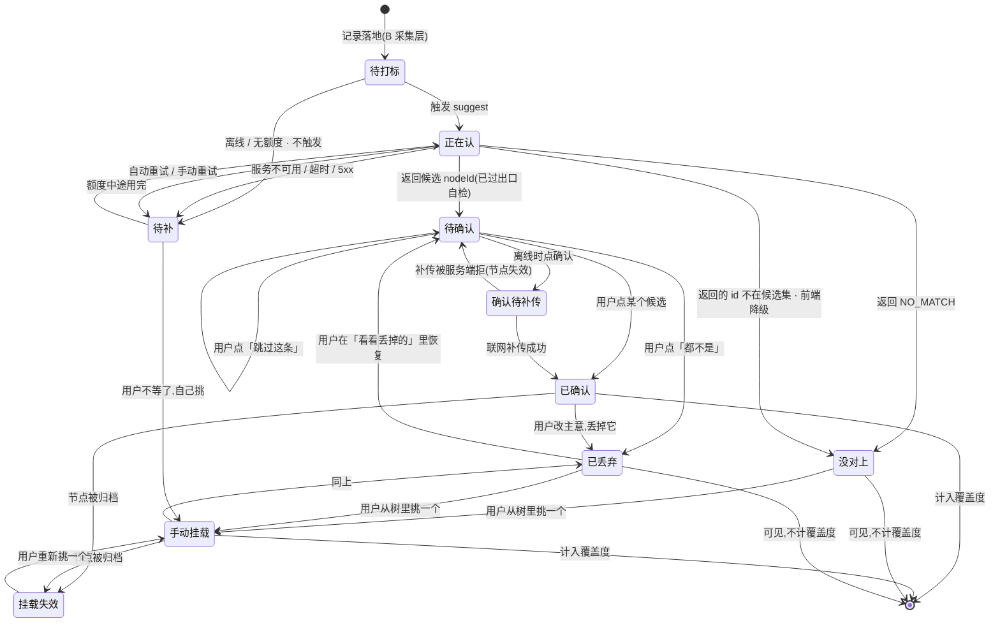
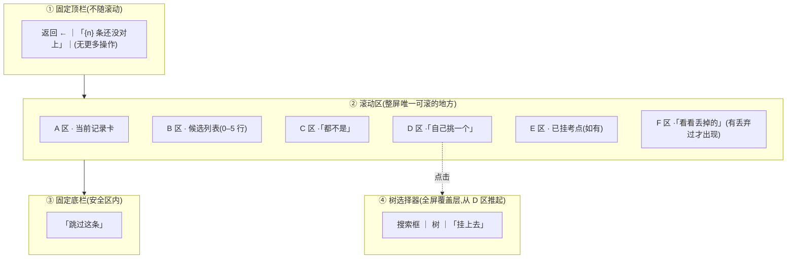
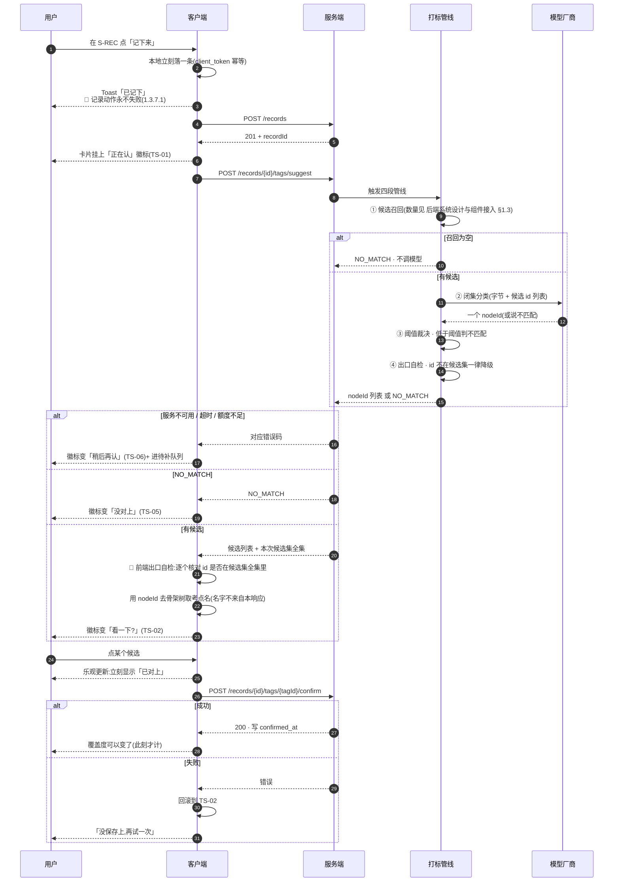
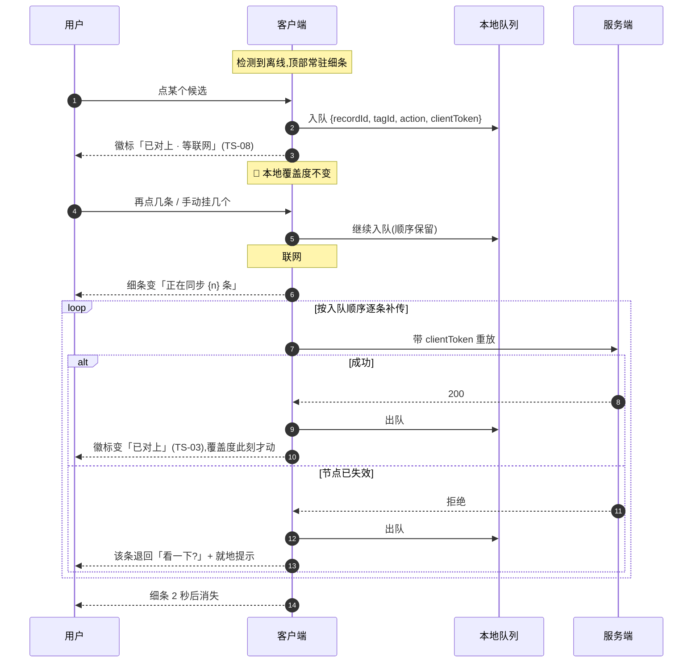

[← 用户侧功能规格](INDEX.md) ｜ [M2 打标与未分类](../modules/M2-打标与未分类/INDEX.md)

# 打标与未分类 · 逐屏规格

> **受众=UI 设计 + 前后端开发。篇幅上限=1400 行。深度档位=详设。**
>
> **这份文档回答:一条记录怎么变成「碰过某个考点」,对不上的时候屏幕上写什么。**
> 覆盖 `S-TAG`,以及嵌在 `S-TL` / `S-REC` 卡片里的打标状态。
> 它写到**可以直接交给 UI 设计与前后端开发动手**为止:每个区块有元素清单与取值来源,每个可点元素有禁用条件,
> 每条异常有触发条件、界面表现、上屏原文、用户下一步、后端行为。
>
> **不是**打标管线怎么分段(在 [`M2 打标与未分类`](../modules/M2-打标与未分类/INDEX.md))、**不是**闭集分类的实现(在 [`技术架构与接口契约`](../../technical/INDEX.md) §6.3)、
> **不是**候选召回数量与阈值(在 [`后端系统设计与组件接入`](../../technical/后端系统设计与组件接入.md) §1.3)、**不是**视觉稿(在设计侧)。
>
> **全局约定不在本文重复**:四种态、三种反馈形态、文案红线、错误码 → 界面映射、埋点四事件,全在
> [`用户侧功能规格 · 总纲与全局约定`](INDEX.md)。**本文与它冲突时以它为准。**
> 本文**新提出**的端点一律标 `🚧 待技术定稿`,它是产品意图不是契约。
>
> **编号约定(现有编号带来的,别混)**:异常一律两位数 `T-01`–`T-52`;缺口一律一位数 `T-1`–`T-12`;
> 状态用 `TS-nn`,验收用例用 `A-nn`。
>
> **基线:`origin/v1` @ `15accea`,fetch 于 2026-09-01T15:05Z。** **状态:活跃。**
> 状态机增删一个态、异常表增删一行、界面文案改一个字,本文同一次改动内更新。

---

## 一、🔴 两条硬规则,界面必须体现

> **1. 自动打标只能从候选集里选一个 `nodeId`,或者返回「无匹配」。它永不生成标签文本。**
> **2. 匹配不上就丢弃,不硬归类。宁可丢弃率高,不可准确率低。**

真源:`R-07`(闭集打标)、`项目现状与决策记录` §2.5(宁缺毋滥)、[`技术架构与接口契约`](../../technical/INDEX.md) §6.3。

对界面的直接后果:

| 后果 | 屏幕上怎么体现 |
|---|---|
| 没有「新建标签」按钮 | 手动挂载只能**从树里选**,输入框只能搜索,搜不到就是没有 |
| 没有「AI 猜的标签,你改一下文字」 | 标签是树上的节点,不可编辑文字 |
| 「没对上」是正常结果不是失败 | 文案是「这条没能对上任何考点」,**不是**「识别失败」 |
| 丢弃率高是设计 | 不做「强制归类到最接近的一个」,也不显示「相似度 62%」 |

### 1.1 两条规则各自的界面落点,逐条可查

| 规则 | 界面落点 | 怎么验它没被绕过 |
|---|---|---|
| 闭集:只能选 id | 树选择器的输入框只有「搜索」一种用途,**没有回车新建**、没有「找不到?创建一个」的兜底行 | `A-05`–`A-12` |
| 闭集:永不生成文本 | 候选行、已确认标签行、卡片徽标里的**每一个考点名都来自骨架树**,不来自打标响应 | `A-05`、`A-09`、`T-14` |
| 闭集:出口自检在前端也有一道 | 前端拿到候选后,**逐个核对 `nodeId` 是否在本次响应给出的候选集内**;不在就当无匹配 | `A-07`、`T-13` |
| 不硬归类:没对上是终态 | 「没对上」的卡片上**没有**「换一个更接近的」按钮 | `A-13`–`A-20` |
| 不硬归类:不显示分档 | 候选行上没有百分比、没有星级、没有「最可能」标记 | `A-16`、`T-15` |
| 未确认不计覆盖度 | `待确认` 的记录在 `S-BLIND` 里**不让任何考点从「没碰过」变成「碰过」** | `A-21`–`A-28` |

⚠️ **前端这道自检是冗余的**,后端 `enforceClosedSet` 已经检过一遍(`M2 打标与未分类` §2.1 ④)。
冗余是有意的:**这条红线不该只有一处实现** —— 与 MCP 只读的四道锁同一个理由(`技术架构与接口契约` §6.5)。

### 1.2 界面上永远不出现的东西(本屏专属,总纲那张词表之外)

| 不出现 | 为什么 |
|---|---|
| 置信度 / 相似度 / 匹配度的**任何数字或图形表达** | 它不是学科判断的依据,显示了就是请用户替产品做判断 |
| 「最可能是这个」「推荐选这个」 | 排序理由产品不背书,加一个词就是背书 |
| 「AI 识别失败」「识别错误」 | 「没对上」不是失败态 |
| 丢弃率 / 未分类率 / 已处理条数占比 | 缺口 `T-1`,倾向不给;它会被读成产品能力评分 |
| 「新建考点」「添加自定义标签」「其他」 | `R-07` 的正面违反 |
| 「一键全部确认」 | 见 §5.4.1 |

---

## 二、一条记录的标签状态机

### 2.1 记录级状态:七个旧态 + 三个新态

**记录级状态是从它的标签推出来的**,不是独立存的一份东西(推导规则在 §2.3)。

| # | 状态 | 怎么进来 | 卡片上显示 | 计不计覆盖度 |
|---|---|---|---|---|
| `TS-00` | `待打标` | 记录已落地,分类还没触发(离线记的、批量补录的) | 无徽标,卡片正常显示 | 否 |
| `TS-01` | `正在认` | 刚提交,识别/分类未回 | 「正在认」+ 转圈小点 | 否 |
| `TS-02` | `待确认` | 返回了候选 `nodeId` | 「对上 {n} 个考点,看一下?」 | **否** —— 未确认不计 |
| `TS-03` | `已确认` | 用户点了确认 | 「已对上:{考点名}」 | ✅ |
| `TS-04` | `已丢弃` | 用户点了丢弃 | 「你丢掉了这个标签」(弱化显示) | 否,**但记录仍可见** |
| `TS-05` | `没对上` | 返回 `NO_MATCH` | 「这条没能对上任何考点」 | 否 |
| `TS-06` | `待补` | 服务暂时不可用 / 额度不足 | 「稍后再认」+ 重试 | 否 |
| `TS-07` | `手动挂载` | 用户自己从树里选 | 「已对上:{考点名}」 | ✅ |
| `TS-08` | `确认待补传` | 离线时点了确认,进本地队列 | 「已对上:{考点名}」+「等联网」细标 | **否,直到补传成功** |
| `TS-09` | `挂载失效` | 已确认/手动挂载的节点被归档或 id 失效 | 「这个考点已经归档了」 | 否(节点已退出分母,`R-49`) |

⚠️ **`没对上` 与 `待补` 是两件事,文案必须分开**:前者是「认过了,确实对不上」,后者是「还没认」。
合成一句话会让用户对同一个界面产生两种预期(`M2 打标与未分类` 已登记这两种失败形态)。

⚠️ **`TS-08` 不能提前计覆盖度。** 覆盖度是这个产品唯一的产出,本地队列里的确认没有经过服务端的
闭集校验,把它计进去等于让离线状态成为绕过红线的通道。界面上它长得像 `已确认`(用户体感连续),
但 `S-BLIND` 的分子里没有它 —— 这个不一致是刻意的,在 §9.3 单独说明。

### 2.2 标签个体的三态

一条记录可以挂多个标签,**每个标签自己有三态**;记录级状态是这些标签的汇总。

| 标签态 | 含义 | 后端判据 | 计不计覆盖度 |
|---|---|---|---|
| `候选` | 自动打标返回、用户还没表态 | 未确认且未丢弃 | 否 |
| `已确认` | 用户点过确认,或用户手动挂的 | 已写 `confirmed_at` | ✅ |
| `已丢弃` | 用户点过丢弃 | `discarded=1` | 否,**可见** |

🔴 **确认与丢弃都不改 `origin` 字段** —— `origin`(自动/手动)是**来源**不是**状态**
(`技术架构与接口契约` §6.3、`M2 打标与未分类` §四)。界面上也因此不需要区分「自动确认的」与「手动挂的」:
**已确认就是已确认**,来源只在导出文件里出现。

### 2.3 记录级状态怎么从标签推出来

| 记录的标签集合 | 记录级状态 |
|---|---|
| 打标未触发 | `TS-00 待打标` |
| 已触发、未返回 | `TS-01 正在认` |
| 返回了 `NO_MATCH` 且无任何标签 | `TS-05 没对上` |
| 服务不可用 / 额度不足,进了待补队列 | `TS-06 待补` |
| 至少一个 `候选` 态标签 | `TS-02 待确认` |
| 至少一个 `已确认` 态标签(在线) | `TS-03 已确认` / `TS-07 手动挂载`(按 `origin` 区分显示,不区分行为) |
| 至少一个 `已确认` 态标签,但补传队列里还有它 | `TS-08 确认待补传` |
| 全部标签都是 `已丢弃` | `TS-04 已丢弃` |
| 已确认的标签指向的节点已归档 | `TS-09 挂载失效` |

**优先级从上到下**:同时满足多条时取先命中的那条。这条优先级是给前端渲染徽标用的,不是后端状态。

### 2.4 状态机图



### 2.5 每一次转移:谁触发、可不可逆、计不计覆盖度

| # | 转移 | 触发条件 | 谁触发 | 可逆? | 转移后计覆盖度? |
|---|---|---|---|---|---|
| 1 | `待打标 → 正在认` | 记录落地且在线且有额度 | **系统** | 否(过程态) | 否 |
| 2 | `待打标 → 待补` | 离线 / 无额度 | **系统** | 是(恢复后自动重试) | 否 |
| 3 | `正在认 → 待确认` | 响应含候选且全部通过出口自检 | **系统** | 否 | 否 |
| 4 | `正在认 → 没对上` | 响应为 `NO_MATCH` | **系统** | 是(可手动挂载) | 否 |
| 5 | `正在认 → 没对上` | 响应含候选但 id 不在候选集 | **系统**(前端降级) | 是 | 否 |
| 6 | `正在认 → 待补` | 超时 / 5xx / 额度中途用完 | **系统** | 是 | 否 |
| 7 | `待确认 → 已确认` | 用户点某个候选行 | **用户** | 是(可再丢弃) | ✅ |
| 8 | `待确认 → 已丢弃` | 用户点「都不是」 | **用户** | 是(可在「看看丢掉的」恢复) | 否 |
| 9 | `待确认 → 待确认` | 用户点「跳过这条」 | **用户** | —— | 否 |
| 10 | `待确认 → 确认待补传` | 离线时点确认 | **用户**(网络状态是系统的) | 是 | **否** |
| 11 | `没对上 → 手动挂载` | 用户从树里选中叶子并确认 | **用户** | 是 | ✅ |
| 12 | `已丢弃 → 手动挂载` | 同上 | **用户** | 是 | ✅ |
| 13 | `已丢弃 → 待确认` | 用户在「看看丢掉的」里点恢复 | **用户** | 是 | 否 |
| 14 | `待补 → 正在认` | 队列自动重试 | **系统** | 否 | 否 |
| 15 | `待补 → 正在认` | 用户点「再试一次」 | **用户** | 否 | 否 |
| 16 | `待补 → 手动挂载` | 用户不等了 | **用户** | 是 | ✅ |
| 17 | `确认待补传 → 已确认` | 联网补传成功 | **系统** | 是 | ✅(此刻才计) |
| 18 | `确认待补传 → 待确认` | 补传被服务端拒 | **系统** | 是 | 否 |
| 19 | `已确认 → 已丢弃` | 用户丢掉一个已确认标签 | **用户** | 是 | 否(覆盖度回落) |
| 20 | `手动挂载 → 已丢弃` | 同上 | **用户** | 是 | 否 |
| 21 | `已确认 → 挂载失效` | 节点被归档(`骨架层` §2.1) | **系统** | 是(节点可找回) | 否(节点已退出分母) |
| 22 | `挂载失效 → 手动挂载` | 用户重新挑一个 | **用户** | 是 | ✅ |

**用户触发的转移有 10 条(7–13、15、16、19、20、22),系统触发的有 12 条。**

🔴 **没有任何一条系统触发的转移会让覆盖度上升。** 唯一让覆盖度上升的是 7、11、12、16、17、22,
其中 17 是 10 的延迟兑现,起点仍是用户的一次点击。**这一句是「未确认不计覆盖度」在状态机层的形式化表述**,
改动状态机时先对着它检查(`A-21`–`A-28`)。

---

## 三、`S-TAG` 待补与手动挂载

### 3.1 进入方式

| 入口 | 场景 | 进来时列表里是什么 |
|---|---|---|
| `S-TL` 筛选「没对上的」 | 集中处理 | 该筛选结果的全部记录,按记录时间倒序 |
| 记录卡片点「看一下」 | 单条确认 | **只有这一条**,处理完直接回 `S-TL` |
| `S-NODE` 点「把记录挂到这个考点」 | 反向挂载 | 该考点的候选记录列表,树选择器**预选中这个节点** |
| 首页无入口 | **故意的** —— 打标不是每天要做的事,不占首页 | —— |

⚠️ **`S-TAG` 没有底部导航项,也不在任何 Tab 里。** 它永远是从别处推进来的一层,返回键退回来处。
理由与首页无入口同一条:做成常驻入口会让「处理待补」变成一个每天要清的数字,
而这个产品不做任何形式的待办清空机制(总纲 §2.2「没有第四种」)。

### 3.2 屏幕结构:三个固定区 + 一个滚动区



| 区 | 固定/滚动 | 什么时候不出现 | 高度约束 |
|---|---|---|---|
| ① 顶栏 | 固定 | 永不 | 单行,标题过长中间省略 |
| ② A 记录卡 | 滚动 | 永不 | 内容超过 6 行折叠,点「展开」看全文;**折叠状态下不截断到看不懂** |
| ② B 候选列表 | 滚动 | 候选为空(`没对上`/`待补`)时整区不渲染 | 每行两行高(考点名 + 路径) |
| ② C「都不是」 | 滚动 | 候选为空时不渲染 | 单行按钮 |
| ② D「自己挑一个」 | 滚动 | **永不** —— 任何状态下都能手动挂 | 单行按钮 |
| ② E 已挂考点 | 滚动 | 这条记录还没有已确认标签时不渲染 | 每个标签一行 |
| ② F「看看丢掉的」 | 滚动 | 这条记录没有丢弃过标签时不渲染 | 单行文字按钮,弱化 |
| ③ 底栏 | 固定 | **永不** | 单行;软键盘弹起时随键盘上推(总纲 §2.4) |
| ④ 树选择器 | 覆盖层 | 只在点 D 区后出现 | 见 §3.5 |

**为什么「跳过这条」在固定底栏而「都不是」在滚动区**:跳过是**退出动作**,任何时候都要够得着;
「都不是」是**对候选的判断**,必须看完候选才有意义 —— 位置本身在传达「先看再点」。

### 3.3 元素清单 · `S-TAG` 主体

| 区 | 元素 | 取值来源 | 为空时 | 可点吗 | 禁用条件 | 无障碍朗读文本 |
|---|---|---|---|---|---|---|
| ① | 返回 | —— | —— | ✅ | 无 | 「返回」按钮 |
| ① | 「{n} 条还没对上」 | 待处理列表长度(本地计算) | 「都处理完了」+ 返回入口 | ❌ | —— | 「还有 {n} 条没对上」 |
| A | 记录时间 | 记录本身 | —— | ❌ | —— | 「{相对时间},{绝对时间}」 |
| A | 记录内容 | 记录本身 | 只有图片时显示「这条只有图片」 | ✅ 展开/折叠 | 内容不超过 6 行时不可点 | 「记录内容:{全文}」 |
| A | 来源 | 记录的来源名称字段 | 「没写来源」 | ❌ | —— | 「来源:{名称}」 |
| A | 原图缩略 | **本机原图**(`R-04`) | 本机没有这张图 → 显示「原图在另一台设备上」 | ✅ 点开大图 | 本机无图时禁用 | 「记录附带的图片,{n} 张」 |
| B | 候选行 · 考点名 | **骨架树**(`GET /syllabus/tree`),按响应给的 `nodeId` 取名 | —— | ✅ 点击即确认 | 离线且树无缓存;该节点已归档 | 「候选 {i},共 {n} 个:{考点名}」 |
| B | 候选行 · 章节路径 | 骨架树,`模块 → 题型` 两级 | 路径缺层时显示已有层级 | ❌ | —— | 「位置:{模块} 下的 {题型}」 |
| B | 「还有 {n} 个」折叠行 | 候选数超过渲染上限时出现 | —— | ✅ 展开 | 无 | 「展开其余 {n} 个候选」 |
| C | 「都不是」 | —— | 常驻(候选非空时) | ✅ | 候选为空时整区不渲染 | 「都不是,丢掉这 {n} 个候选」 |
| D | 「自己挑一个」 | —— | 常驻 | ✅ | 骨架为空(`SYLLABUS_EMPTY`);离线且树无缓存 | 「自己挑一个考点,打开考点表」 |
| E | 已挂考点行 | 骨架树 | 无已确认标签时不渲染 | ✅ 点开 `S-NODE` | 节点已归档时不可跳转 | 「已对上:{考点名},点击查看这个考点」 |
| E | 已挂考点行 · 丢掉 | —— | —— | ✅ | 离线时可点(进队列) | 「丢掉这个标签」 |
| F | 「看看丢掉的」 | 该记录已丢弃的标签 | 没丢弃过时不渲染 | ✅ 展开 | 无 | 「查看丢掉的 {n} 个标签」 |
| F | 丢掉的标签 · 恢复 | —— | —— | ✅ | 离线时可点(进队列) | 「恢复这个标签到待确认」 |
| ③ | 「跳过这条」 | —— | 常驻 | ✅ | 列表只剩这一条且它已处理完时改为「完成」 | 「跳过这条,看下一条」 |

🔴 **候选行上不显示置信度数字。** 显示「87%」会让用户按数字挑,而这个数字不是学科判断的依据。
候选只按服务端给的顺序排,**排序理由不解释,因为产品不为它背书**。

🔴 **A 区没有任何可编辑的输入框。** 记录内容在 `S-REC` 里写,在这里只读。
本屏**唯一的文本输入是树选择器的搜索框,而它的输出只有 `nodeId`** —— 全屏没有第二个能装下文字的地方
(`文档规范与目录` §五 的红线在本屏的落点)。

### 3.4 交互

| 动作 | 行为 | 端点 |
|---|---|---|
| 点某个候选 | 确认 → Toast「已对上」→ **自动进入下一条** | `POST /records/{id}/tags/{tagId}/confirm` |
| 点「都不是」 | 全部候选置为丢弃 → 进入下一条 | `POST /.../discard` |
| 点「自己挑一个」 | 打开树选择器;选中叶子 → 挂载 → 下一条 | `POST /records/{id}/tags`(body 只接受 `nodeId`) |
| 点「跳过这条」 | 不改状态,进入下一条 | 无请求 |
| 处理完最后一条 | 空态「都处理完了」+「回时间线」 | —— |
| 点「看看丢掉的」 | 就地展开,不跳屏 | 无请求(数据随记录一起来) |
| 点丢掉的标签 · 恢复 | 置回 `候选` 态,回到 B 区 | `POST /records/{id}/tags/{tagId}/restore` 🚧 待技术定稿 |
| 点已挂考点 | 跳 `S-NODE`,**返回时回到本条,不重置进度** | `GET /syllabus/nodes/{id}` |
| 点已挂考点 · 丢掉 | 覆盖度立即回落,Toast「丢掉了,考点回到没碰过」 | `POST /.../discard` |
| 点「再试一次」(待补态) | 重新触发一次分类 | `POST /records/{id}/tags/suggest` |

**批量处理时的节奏**:一次一条、自动前进、**不做多选批量确认** ——
批量确认会让人不看内容就点,而错标比不标更贵(覆盖度失真,`M2 打标与未分类`)。

**「自动进入下一条」的两条约束**:

1. **进入下一条前留 300–500ms**,让 Toast「已对上」与卡片切换错开;直接切会让人不确定刚才点中了没有。
2. **自动前进不做无限滚动**,是整卡替换。列表位置由顶栏的 `{n}` 表达,**不做进度条** ——
   进度条会把「处理完」变成一个要清零的目标。

### 3.5 树选择器

| 规则 | 说明 |
|---|---|
| 只能选**叶子节点**(第 3 层) | 选中父节点时提示「挑到具体考点」 |
| 搜索 | 搜考点名;**搜不到就是没有,不提供「新建」** |
| 已挂载的 | 置灰并标「已经挂过了」 |
| 一条记录可挂多个 | 上限 🚧 未定,见 §十六 `T-2` |

#### 3.5.1 树选择器元素清单

| 位置 | 元素 | 取值来源 | 为空时 | 可点吗 | 禁用条件 | 无障碍朗读文本 |
|---|---|---|---|---|---|---|
| 顶 | 关闭 ✕ | —— | —— | ✅ | 无 | 「关闭考点表」 |
| 顶 | 标题「挑一个考点」 | 固定文案 | —— | ❌ | —— | 「挑一个考点」 |
| 顶 | 搜索框 | 用户输入 | 占位文字「搜考点名」 | ✅ | 树未加载完成时禁用并置灰 | 「搜索考点名,输入框」 |
| 顶 | 清空 ✕(搜索框内) | —— | 输入为空时不渲染 | ✅ | 无 | 「清空搜索」 |
| 中 | 模块行(第 1 层) | 骨架树 | 骨架为空 → 走 `SYLLABUS_EMPTY` 空态 | ✅ 展开/收起 | 无 | 「{模块名},分组,{已展开/已收起},含 {n} 个题型」 |
| 中 | 题型行(第 2 层) | 骨架树 | —— | ✅ 展开/收起 | 无 | 「{题型名},分组,第 2 层,{已展开/已收起},含 {n} 个考点」 |
| 中 | 考点行(第 3 层) | 骨架树 | —— | ✅ 选中 | 已挂过;已归档 | 「{考点名},考点,可选中」/ 已挂过时「{考点名},已经挂过了,不可选」 |
| 中 | 考点行 · 已挂标记 | 该记录的已确认标签集合 | —— | ❌ | —— | 见上 |
| 中 | 归档区入口 | 骨架树的归档节点(`R-49`) | 没有归档节点时不渲染 | ✅ 展开 | 无 | 「归档的考点,{n} 个」 |
| 中 | 搜索结果行 | 搜索结果 | **无结果 → 见 §5.3.3 的专属文案** | ✅ 选中 | 同考点行 | 「{考点名},在 {模块} 下的 {题型} 里」 |
| 底 | 「挂上去」 | —— | —— | ✅ | **未选中任何叶子时禁用**;选中的是父节点时禁用 | 「挂上去,把这条记录挂到 {考点名}」/ 未选中时「挂上去,不可用,先挑一个考点」 |
| 底 | 已选中提示「已选:{考点名}」 | 选中状态 | 未选中时显示「还没挑」 | ❌ | —— | 「已选:{考点名}」 |

**树选择器里没有「新建」「其他」「以上都不是」三个按钮。**
「以上都不是」的语义在 `S-TAG` 主体的 C 区已经有了,**在树里再放一个等于给用户第二条放弃路径,
而这条路径的终点是「随便挑一个最像的」** —— 那正是「不硬归类」要挡的行为。

#### 3.5.2 树选择器的三种打开姿势

| 从哪打开 | 初始状态 | 为什么 |
|---|---|---|
| `S-TAG` D 区「自己挑一个」 | 全树收起,搜索框聚焦但不唤起键盘 | 大多数人会先搜;但直接弹键盘会挡住树,用户就看不到「树长什么样」 |
| `S-NODE` 反向挂载 | **预选中该节点**,树滚动到它并展开父级 | 用户是从考点侧来的,他已经知道要挂哪个 |
| 卡片内轻量交互 →「自己挑一个」 | 同 D 区 | 保持一致 |

---

## 四、卡片内的打标状态:三种尺寸形态

打标状态不只在 `S-TAG` 出现,它嵌在别的屏里。**三种尺寸,信息量逐级递减,但状态名一个都不能改。**

| 形态 | 出现在 | 尺寸 | 显示什么 | 不显示什么 |
|---|---|---|---|---|
| **S 徽标** | `S-TL` 时间线卡片右上 | 一行内的小标签 | 状态名 + 图形 | 候选内容、考点名、条数 |
| **M 行内** | `S-TL` 卡片展开后 · `S-REC` 记完后 | 卡片内 1–3 行 | 状态名 + 最多 3 个候选行(可行内确认) | 章节路径(空间不够)、「都不是」以外的动作 |
| **L 全屏** | `S-TAG` | 整屏 | §3.3 全清单 | —— |

### 4.1 S 徽标:十个状态的可辨识表达

🔴 **颜色不是唯一信息载体。** 每个状态都有**独立文字**,并且图形也不同 —— 色觉障碍与灰度截图下都要能分开。

| 状态 | 徽标文字 | 图形 | 强调级别 |
|---|---|---|---|
| `TS-00 待打标` | 无徽标 | 无 | —— |
| `TS-01 正在认` | 「正在认」 | 三点脉动 | 弱 |
| `TS-02 待确认` | 「看一下?」 | 空心圆 | **强**(唯一需要用户动作的态) |
| `TS-03 已确认` | 「已对上」 | 实心勾 | 弱 |
| `TS-04 已丢弃` | 「丢掉了」 | 空心斜杠 | 最弱(降低不透明度) |
| `TS-05 没对上` | 「没对上」 | 空心横线 | 弱 |
| `TS-06 待补` | 「稍后再认」 | 空心时钟 | 中 |
| `TS-07 手动挂载` | 「已对上」 | 实心勾 | 弱 |
| `TS-08 确认待补传` | 「已对上 · 等联网」 | 实心勾 + 上行箭头 | 弱 |
| `TS-09 挂载失效` | 「考点已归档」 | 空心方框 | 中 |

⚠️ **`TS-03` 与 `TS-07` 的徽标完全一样**,这是有意的:来源不是状态(§2.2)。
**`TS-04` 是全屏唯一一个用降低不透明度表达的状态** —— 它要看得见(记录仍可见是产品承诺),但不该抢注意力。

### 4.2 M 行内:能做什么,不能做什么

| 位置 | 元素 | 行为 |
|---|---|---|
| `S-TL` 每条卡片 | 状态徽标 | 点击展开候选(最多 3 个,行内确认) |
| `S-REC` 刚记完 | 「正在认」→ 认完变成候选行 | 行内确认,**不打断用户继续记下一条** |
| 行内候选行 | 考点名(**不带章节路径**) | 点击即确认,Toast「已对上」,卡片收起 |
| 行内 | 「都不是」 | 丢弃全部候选,卡片收起 |
| 行内 | 「看全部」 | 候选多于 3 个时出现,跳 `S-TAG` 定位到这一条 |
| 行内 | 「自己挑一个」 | 直接打开树选择器覆盖层,不跳屏 |

⚠️ **刚记完那一刻不能弹窗要求确认标签。** 用户正在记录的节奏里,弹窗会把「再记一条」的成本抬高 ——
而阶段 0 判据量的就是这个成本(`实施路径` §阶段 0 的验收)。

⚠️ **M 形态不显示章节路径。** 路径要两行,行内放不下;放不下就不放,**不做缩写路径** ——
缩写后的路径会让两个不同章节下的同名考点看起来一样,那是比不显示更坏的结果。
需要路径就点「看全部」去 L 形态。

### 4.3 三种形态的一致性约束

| 约束 | 说明 |
|---|---|
| 状态名在三种形态里逐字相同 | 「没对上」在 S 里是「没对上」,在 L 里也是「没对上」,不做「未匹配」这种同义变体 |
| 三种形态都不显示置信度 | 空间大小不是显示它的理由 |
| 三种形态的确认都走同一个端点 | 行内确认与全屏确认没有区别,后端看不出来是从哪点的 |
| 只有 L 形态有「跳过」 | S/M 形态里「不处理」就是不点,不需要一个按钮来表达 |
| 文案来自同一处词表 | `多端选型与端矩阵` §4.5:面向用户的字符串一处词表、三处消费 |

---

## 五、逐步骤交互细则

### 5.1 自动打标的等待与回来



**几个不能改的点:**

| # | 约束 | 理由 |
|---|---|---|
| 1 | **记录先落地,再触发打标** | `1.3.7.1`:记录动作永不失败,失败的只能是它的附加能力 |
| 2 | **「正在认」不阻塞用户** | 用户可以立刻记下一条、返回、退出;回来时状态自己会对 |
| 3 | **考点名一律从骨架树取,不从打标响应取** | 打标响应里如果出现了标签文本,那是红线违规的信号(`T-14`),不是可用的数据 |
| 4 | **确认走乐观更新,失败必须回滚** | 不回滚会让界面上的覆盖度与服务端的不一致,而覆盖度是唯一产出 |
| 5 | **前端出口自检在取名之前做** | 先自检再取名,不在候选集里的 id 根本不该去查名字 |

### 5.2 候选确认界面:一次一条

#### 5.2.1 为什么是一次一条

**一屏一条记录,处理完自动换下一条。** 不做「一页列 20 条,每条右边一个勾」。

| 理由 | 展开 |
|---|---|
| 列表化会让人按位置点,不按内容点 | 一屏 20 个勾,手指从上到下扫一遍,内容没看 |
| 错标比不标贵 | 覆盖度失真,而覆盖度是这个产品唯一的产出(`M2 打标与未分类` §一) |
| 「处理完了」不该变成一件值得庆祝的事 | 一次一条天然没有「批量清空」的爽感,这是有意的 |

#### 5.2.2 候选怎么展示

每个候选一行,两行高:第 1 行是**考点名**(第 3 层节点名),第 2 行是**它在树上的路径**(第 1 层 › 第 2 层)。

| 元素 | 规则 |
|---|---|
| 考点名 | 来自骨架树的第 3 层节点名。**过长时尾部省略**,不换行(换行会让候选行高度不一,列表节奏乱掉) |
| 路径 | `模块 › 题型`,两级。**不显示第 3 层自己**(它已经在第 1 行了) |
| 路径缺层 | 骨架异常导致取不到父级时,显示能取到的层级,缺的那一级不用占位符补 |
| 排序 | **服务端给什么顺序就什么顺序**,前端不重排、不置顶、不加「最可能」标记 |
| 视觉权重 | 每一行完全一样。**第一行不加粗、不高亮、不加边框** |
| 置信度 | 🔴 **不显示。** 没有数字、没有星级、没有进度条、没有排序徽标 |
| 点击热区 | 整行,含路径那一行 |
| 二次确认 | **没有。** 点了就是确认,因为它可逆(可以再丢弃) |

#### 5.2.3 多个候选时怎么选

| 情况 | 界面 |
|---|---|
| 1 个候选 | 就一行。**不因为只有一个就自动确认** —— 自动确认会让覆盖度里混进没人看过的标签(缺口 `T-3`) |
| 2–5 个候选 | 全部平铺,无折叠 |
| 超过渲染上限 | 前 5 行 +「还有 {n} 个」折叠行,展开后全平铺;**折叠的顺序也不重排** |
| 用户想选多个 | 可以。点第一个 → 确认 → 卡片**不立刻前进**,而是把已选那个移到 E 区,B 区剩下的候选还在;再点第二个即可。**只有点「跳过这条」或「都不是」才前进** |

⚠️ **「点了一个就自动前进」与「可以选多个」是矛盾的,这里的裁定是:第一次点击后不前进。**
§3.4 那句「确认 → 自动进入下一条」适用于**只有一个候选**,或用户点完后**主动点跳过**的情形。
多候选时的自动前进会让「这条其实碰了两个考点」这种真实情况没法表达。

#### 5.2.4 全都不对时怎么办

**点「都不是」。** 它做三件事,一次做完:

1. 该记录的全部候选标签置为丢弃
2. 记录级状态变 `TS-04 已丢弃`
3. 自动前进到下一条,Toast「丢掉了,记录还在」

| 疑问 | 回答 |
|---|---|
| 丢弃后记录会消失吗 | **不会。** 记录仍在 `S-TL` 里,内容一个字不少 |
| 丢弃后还能再认吗 | **能。** F 区「看看丢掉的」常驻,任何时候可恢复到 `待确认` |
| 丢弃会不会触发重新分类 | **不会。** 重新分类要用户主动点「再试一次」;自动重分类会变成「摇到满意为止」 |
| 「都不是」和「跳过这条」的区别 | 「都不是」是**表态**(这些候选是错的),「跳过」是**不表态**(我现在不想弄)。前者改状态,后者不改 |

### 5.3 手动挂载:搜索 → 树浏览 → 选中 → 确认

#### 5.3.1 四步的界面行为

| 步 | 用户动作 | 界面反应 | 端点 |
|---|---|---|---|
| 1 · 打开 | 点「自己挑一个」 | 覆盖层从底部推起;树用缓存先渲染,同时后台刷新 | `GET /syllabus/tree` |
| 2 · 搜索 | 在搜索框输入 | 防抖后出结果列表,**结果列表替换树**(不是并排) | `GET /syllabus/search?q=` 🚧 待技术定稿 |
| 2' · 浏览 | 不搜,直接展开树 | 逐层展开,展开状态在本次覆盖层内保持 | 无请求(树已在本地) |
| 3 · 选中 | 点第 3 层节点 | 该行选中态,底部「已选:{考点名}」;**底部按钮从禁用变可点** | 无请求 |
| 3' · 误选父节点 | 点第 1/2 层节点 | 展开/收起该层,**并在底部提示「挑到具体考点」**;不算选中 | 无请求 |
| 4 · 确认 | 点「挂上去」 | 覆盖层收起 → Toast「已对上」→ 回 `S-TAG`,该考点出现在 E 区 | `POST /records/{id}/tags` |

🔴 **`POST /records/{id}/tags` 的 body 只接受 `nodeId`,不接受 `name`。**
这是 `R-07` 在接口层的实现:**只要 API 上没有传入自由文本标签的通道,自由生成的考点就进不了库**
(`技术架构与接口契约` §6.3)。前端因此**连一个能装标签文本的变量都不该有** ——
选中态存的是 `nodeId`,显示用的名字是**每次从树里现取的**。

#### 5.3.2 搜索的行为细则

| 规则 | 值 | 依据 |
|---|---|---|
| 触发方式 | 输入即搜,**不需要按回车**;回车等同于收起键盘 | 回车键在这里如果做成「新建」就是红线违规,所以它必须什么都不做 |
| 防抖 | 200–300ms | 中文输入法一个词的击键间隔通常短于 200ms,再短会在拼音未上屏时发请求 |
| 最短关键词 | 1 个字符即搜(中文一个字就有意义) | —— |
| 匹配范围 | **只匹配考点名(第 3 层)**;不匹配模块名与题型名 | 匹配上层会让结果里出现不可选的行,用户点了没反应 |
| 匹配方式 | 子串匹配。**不做同义词扩展、不做拼音纠错** | 纠错等于替用户猜,猜错了就是往「硬归类」滑 |
| 结果排序 | 服务端顺序,前端不重排 | 与候选行同一条纪律 |
| 结果条数上限 | 🚧 未定,见缺口 `T-6`;定之前前端按 50 条截断并提示 | —— |
| 结果行显示 | 考点名 + 完整路径(**搜索结果必须带路径**,因为脱离了树的上下文) | —— |
| 已挂过的结果 | 置灰 +「已经挂过了」,不可选 | —— |
| 清空搜索 | 回到树浏览态,**保留清空前的展开状态** | —— |

#### 5.3.3 搜索无结果时说什么

🔴 **不是「没找到」。**「没找到」会让用户以为是自己搜错了,然后换词再搜、再搜,最后随便挑一个最像的。
**要说清的是:这个考点表里没有这一条。**

上屏原文:

```
这份考点表里没有「{关键词}」这一条。

考点表是维护出来的,不是自动生成的 —— 搜不到就是它现在还没有。
这条记录可以先这么留着,不影响它被记下来。
```

配两个动作:

| 动作 | 行为 |
|---|---|
| 「换个词搜」 | 清空输入框并重新聚焦 |
| 「就这样留着」 | 关闭覆盖层,记录保持 `没对上`/`已丢弃` 态 |

**没有第三个动作。** 特别是**没有**「反馈这个考点」「申请添加」——
那会变成一条通向「用户提交标签文本」的路,而这条路在接口层根本不存在(`技术架构与接口契约` §6.3)。
要不要收集这类反馈,登记为缺口 `T-9`。

#### 5.3.4 树浏览的行为细则

| 规则 | 说明 |
|---|---|
| 初始展开层级 | 全部收起(第 1 层可见)。**唯一例外**:从 `S-NODE` 反向挂载进来时展开到目标节点 |
| 展开方式 | 点整行展开/收起,**不做单独的箭头热区**(热区太小) |
| 同时展开数 | 不限制,不做手风琴。手风琴会让「对比两个题型下的考点」这个动作做不了 |
| 展开状态保持 | 本次覆盖层内保持;关闭覆盖层后重置 |
| 已挂过的节点 | 置灰 +「已经挂过了」,不可选,**但仍可见** |
| 归档节点 | 收在「归档的考点」分组里,**可见可找回**(`R-49`),但**不可选** —— 归档节点已退出分母,挂上去覆盖度也不动 |
| 层级深度 | 三层封顶(`骨架层` §2.4)。超过三层见 §七 |
| 滚动 | 整树一个滚动容器;**不做懒加载**(`技术架构与接口契约` §6.4:单模块整棵树一次返回) |

### 5.4 批量处理待补:能批到哪一步

**能批量的只有「进入」,不能批量的是「表态」。**

| 动作 | 能批量吗 | 为什么 |
|---|---|---|
| 一次进入一串待处理记录 | ✅ | `S-TAG` 本来就是一串记录的处理流 |
| 自动前进到下一条 | ✅ | 减少的是操作成本,不是判断成本 |
| 批量重试待补 | ✅ | 重试不产生标签,只是再问一次;**它不改变任何覆盖度** |
| 批量丢弃 | ⚠️ **不做,但不是红线** | 丢弃不产生覆盖度,批量丢弃在数据上是安全的;不做的理由是它会诱导「先全丢再说」,而丢弃后想找回要一条条恢复 |
| **批量确认 / 一键全部确认** | 🔴 **永不做** | 见 §5.4.1 |
| 批量挂载到同一个考点 | 🔴 **不做** | 它是批量确认的变体,而且更危险 —— 一次能把 20 条记录挂到同一个节点上 |

#### 5.4.1 为什么没有「一键全部确认」

这不是交互偏好,是产品的定义问题:

1. **覆盖度是这个产品唯一的产出**(`M2 打标与未分类` §一)。一键确认让覆盖度上升的成本降到一次点击,
   而覆盖度的意义完全建立在「这条记录真的碰过这个考点」上。
2. **「未确认不计覆盖度」这条规则存在的意义,就是要求每个计入的标签都被人看过一次。**
   一键确认在形式上满足「用户确认过」,在实质上把这条规则清零 —— 它是这条红线唯一的、也是最容易的绕过方式。
3. **它会让「唯一那个数」变好看。** 北极星是主动查看盲区的人数;覆盖度虚高会让盲区清单变短,
   清单变短则查看的动机下降。**这是一条让指标短期变好、长期变坏的路径**,而产品的固定动作是先想清楚它是不是在自欺。

⚠️ **界面上连禁用态的「全部确认」都不画。** 不是禁用,是不画(与「新建标签」同一处理)。
画一个灰的按钮等于承认这个功能应该存在,只是暂时不给。

### 5.5 丢弃与撤销

#### 5.5.1 丢弃之后发生了什么

| 问题 | 怎么样 |
|---|---|
| 记录还在吗 | **在。** 丢弃只置标签的丢弃标志位,记录一个字不删(`技术架构与接口契约` §6.3) |
| 记录还在时间线里吗 | **在**,正常显示,徽标是「丢掉了」 |
| 标签还在吗 | **在**,只是不计覆盖度。它在 F 区「看看丢掉的」里 |
| 覆盖度怎么变 | 丢的是已确认标签 → 覆盖度**立刻回落**;丢的是候选标签 → 覆盖度不变(它本来就没计) |
| `origin` 字段变吗 | **不变。** 来源不是状态(§2.2) |
| 能再认一次吗 | **能。** 见 §5.5.2 |

#### 5.5.2 撤销:没有时间窗口

🔴 **丢弃不设撤销窗口 —— 只要记录还在,丢掉的标签就一直能恢复。**

理由:丢弃在存储层就是一个标志位,不是删除动作。既然数据没走,就没有理由给恢复设时限。
**设一个「30 秒内可撤销」的窗口反而是坏设计**:它让用户在 30 秒内产生压力,而丢弃本来是个低风险动作。

| 恢复路径 | 在哪 | 恢复到哪个态 |
|---|---|---|
| Toast 上的「撤销」 | 丢弃后 2 秒内的 Toast 里 | 回到丢弃前的态(`待确认` 或 `已确认`) |
| F 区「看看丢掉的」 | `S-TAG` 常驻(该记录有丢弃过时) | `待确认` |
| `S-TL` 卡片展开 | M 形态里同样有「看看丢掉的」 | `待确认` |

**Toast 上的「撤销」是唯一一个带时限的入口(2 秒,与 Toast 同寿命),但它不是唯一入口** ——
错过了走 F 区,结果一样。**能力不随时间消失,只有快捷方式会。**

| 唯一让丢弃不可恢复的情况 | 界面 |
|---|---|
| 记录本身被删除 | 记录都没了,标签跟着级联删(`技术架构与接口契约` §6.2 `DELETE /records/{id}`)。删记录时的浮层已经说清这件事 |

#### 5.5.3 恢复之后

恢复到 `待确认`,**不自动确认**。用户还得再点一次候选行。
理由:恢复表达的是「我想再看看」,不是「我确认它是对的」—— 把两件事合成一次点击,又回到没看就计入。

---

## 六、「未分类」的四种成因,逐种给界面话术

🔴 **四种成因的文案完全不同,不许混成一句。** 混成一句会让用户对同一个界面产生多种预期,
而其中三种是可以做点什么的、一种是不用做什么的 —— 用户分不清就都不做,减数少一块
(`M2 打标与未分类` §2.2)。

| 成因 | 状态 | 用户看到什么(上屏原文) | 用户能做什么 | 会不会自动重试 | 计不计覆盖度 |
|---|---|---|---|---|---|
| **① 返回 `NO_MATCH`** —— 认过了,确实对不上 | `TS-05 没对上` | 「这条没能对上任何考点。考点表里没有匹配的一条,不是这条记录记错了。」 | 手动挂载 / 就这样留着 | **不会** —— 认过了就是认过了,重认会变成摇到满意为止 | 否 |
| **② 服务暂时不可用** —— 压根没看成 | `TS-06 待补` | 「还没认上,服务这会儿没通。它会自己再试,你不用管。」 | 等 / 点「再试一次」/ 手动挂载 | **会**,自动重试(次数与退避 🚧 见缺口 `T-5`) | 否 |
| **③ 额度不足** —— 也没看成,但原因在账上 | `TS-06 待补` + 受限说明 | 「这个月的 AI 次数用完了(还剩 0 次),这条先没认。你可以自己挑一个考点,记录已经存下来了。」 | **手动挂载(主)** / 去 `S-BILL`(次) | **不会自动重试** —— 额度是用户侧状态,补上额度后由用户点重试 | 否 |
| **④ 骨架该科目未建好** —— 没有「集」可闭 | `TS-05 没对上` + 空态 | 「这个科目的考点表还没建好,现在还没法挂。先记着,建好了这条还在。」 | **只能「就这样留着」**;手动挂载入口置灰 | **不会** —— 骨架建好前重试多少次都一样 | 否 |

### 6.1 四种成因的界面差异,逐格可查

| 差异点 | ① `NO_MATCH` | ② 服务不可用 | ③ 额度不足 | ④ 骨架未建好 |
|---|---|---|---|---|
| 徽标文字 | 「没对上」 | 「稍后再认」 | 「稍后再认」 | 「没对上」 |
| 徽标图形 | 空心横线 | 空心时钟 | 空心时钟 | 空心方框 |
| 有没有「再试一次」按钮 | ❌ | ✅ | ✅(补额度后才可点) | ❌ |
| 「自己挑一个」可点吗 | ✅ | ✅ | ✅ **这是主动作** | ❌ 禁用,提示「考点表还没建好」 |
| 有没有去别处的入口 | 无 | 无 | ✅ 去 `S-BILL` | 无 |
| 语气 | 陈述,不道歉 | 陈述 +「不用管」 | 陈述 + 给出路 | 陈述 +「先记着」 |
| 对应错误码 | `NO_MATCH` | `SERVER_ERROR` / `NETWORK_TIMEOUT` | `QUOTA_EXHAUSTED` | `SYLLABUS_EMPTY` |

⚠️ **② 与 ③ 的状态相同(都是 `待补`)但文案与动作不同。**
状态是给程序看的,文案是给人看的 —— 同一个状态可以有两套话术,反过来不行(两个状态不能共用一句话)。

### 6.2 第五种成因:召回为空 —— 它对界面不可见

`M2 打标与未分类` §2.1 ①:**召回为空 → 直接未分类,不调模型。**
它在接口层返回的也是 `NO_MATCH`,因此界面上与成因 ① 完全一样,**用户看不出区别**。

🔴 **这个不可见是已知的、且现在没法解决**:「纪律生效(模型该丢就丢)」与「召回太窄(本该命中却没召回)」
**在数据上长得一样**(`M2 打标与未分类` §六 `C-1`)。产品侧的裁定是:

- **不在界面上区分。** 区分了也没有一个用户能做的动作不同,只会多一句听不懂的话。
- **不因此给用户「重试」入口。** 召回策略没变,重试结果一样。
- 分开它需要一次抽样人工复核,那是维护侧的动作,不是用户侧的界面。

---

## 七、边界值与输入约束

| # | 项 | 值 | 超出/不满足时怎么办 | 真源 |
|---|---|---|---|---|
| 1 | 候选个数 · 下限 | 0 | 0 个 → 不是 `待确认`,走 `NO_MATCH` 那条路(§六 ①) | `后端系统设计与组件接入` §1.3 |
| 2 | 候选个数 · 服务端召回量 | 由服务端定 | 前端不硬编码,按响应渲染 | `后端系统设计与组件接入` §1.3 |
| 3 | 候选个数 · 界面渲染上限 | 一屏 **5 行** | 超出折叠为「还有 {n} 个」,展开后全平铺,**顺序不变** | 本文 §5.2.3 |
| 4 | 候选个数 · 硬上限 | 🚧 未定,见缺口 `T-10` | 定之前:超过 20 个视为响应异常,走 `T-15`,当无匹配处理 | —— |
| 5 | 候选里的重复 `nodeId` | 不允许 | 前端去重后渲染,**不报错**;去重后为 0 则走 `NO_MATCH`(`T-16`) | —— |
| 6 | 搜索关键词 · 最短 | 1 字符 | 空串 → 退回树浏览态,不发请求 | 本文 §5.3.2 |
| 7 | 搜索关键词 · 最长 | **32 字符** | 输入框硬截断(与总纲 §2.4「唯一例外是超长截断」一致);超长的搜索词不是有效意图 | 总纲 §2.4 |
| 8 | 搜索结果条数上限 | 🚧 未定,见缺口 `T-6` | 定之前按 50 条截断 +「只显示前 50 条,搜得再具体一点」 | —— |
| 9 | 树的最大层级 | **3 层**(`模块 → 题型 → 考点`) | 出现第 4 层 → **只渲染前 3 层,第 4 层及以下不渲染**,并按 `T-35` 上报;不做自适应深度 | `骨架层` §2.4 |
| 10 | 树的节点总数 | 单模块整棵树一次返回,不分页 | 渲染用虚拟列表;**渲染方式变,数据获取方式不变** | `技术架构与接口契约` §6.4 |
| 11 | 考点名长度 · 候选行 | 单行,尾部省略 | 省略后长按/悬停显示全名;**朗读文本永远是全名** | 本文 §3.3 |
| 12 | 考点名长度 · 树行 | 单行,尾部省略 | 同上 | —— |
| 13 | 考点名长度 · 已挂考点行(E 区) | **最多两行**,超出省略 | E 区空间比候选行宽裕,给两行 | —— |
| 14 | 章节路径长度 | 单行,**中间省略**(保住两端) | `模块 › … › 题型`,首尾都要能看见 | —— |
| 15 | 记录内容展示长度 | 折叠到 **6 行** | 「展开」按钮;展开后不再折叠 | 本文 §3.2 |
| 16 | 待补队列长度上限 | 🚧 未定,见缺口 `T-4` | 定之前:队列不设上限,但**顶栏计数超过 99 显示「99+」**;队列满的降级行为见 `T-36` | —— |
| 17 | 自动重试次数 | 🚧 未定,见缺口 `T-5` | 定之前:界面按「会自己再试」表述,**不显示第几次重试、不显示下次重试时间** | `后端系统设计与组件接入` §1.3 |
| 18 | 重试退避 | 🚧 未定,见缺口 `T-5` | 同上。**界面不暴露退避曲线** —— 暴露了用户会盯着它等 | —— |
| 19 | 单条记录最多挂几个考点 | 🚧 未定,见缺口 `T-2` | 定之前前端不设本地上限,服务端拒绝时走 `T-41` | 本文 §十六 `T-2` |
| 20 | 同一考点重复挂载 | **去重,不报错** | 树里该行已置灰不可选;若绕过(并发/多端)则服务端幂等,界面提示「已经挂过了」(`T-07`) | —— |
| 21 | 同一标签同时被确认与丢弃 | 后到的胜出 | 多端并发,见 `T-27` | —— |
| 22 | 原图缩略图数量 | 单条记录最多 6 张(连拍合并) | 超出由 `S-REC` 侧拦,本屏只显示已存在的 | `技术架构与接口契约` §6.2 |
| 23 | 一次自动前进的间隔 | **300–500ms** | 见 §3.4 | 本文 §3.4 |
| 24 | Toast 停留 | 2 秒 | 总纲 §2.2 | 总纲 §2.2 |

---

## 八、异常全集

**列全 52 条。** 每一条都必须能回答最后一列:🔴 **记录留住了吗** —— 全表必须全是 ✅,
因为「记录动作永不失败」(`1.3.7.1`)是这个产品最硬的一条承诺,**打标的任何失败都不许波及记录本身**。

| # | 触发条件 | 界面表现 | 上屏原文文案 | 用户下一步 | 后端行为 | 记录留住了吗 |
|---|---|---|---|---|---|---|
| `T-01` | 分类服务不可用 | 卡片状态 `待补` | 「还没认上,服务这会儿没通。它会自己再试,你不用管。」 | 等 / 手动重试 / 手动挂载 | 进待补队列,恢复后自动重试 | ✅ |
| `T-02` | 额度不足 | 卡片状态 `待补` + 受限说明 | 「这个月的 AI 次数用完了(还剩 0 次),这条先没认。你可以自己挑一个考点,记录已经存下来了。」 | 手动挂载 / 去 `S-BILL` | 不扣额度、不入重试队列 | ✅ |
| `T-03` | 返回 `NO_MATCH` | 状态 `没对上` | 「这条没能对上任何考点。考点表里没有匹配的一条,不是这条记录记错了。」 | 手动挂载 / 就这样 | 不写标签,记录标记已打标过 | ✅ |
| `T-04` | 候选全被丢弃后又想找回 | 卡片内「看看丢掉的」 | 「丢掉的 {n} 个」 | 点恢复 | 丢弃标志位置回 | ✅ |
| `T-05` | 确认时记录已被删 | Toast | 「这条记录已经删了」 | 回列表 | 404,不写标签 | ✅ 已删是用户自己删的 |
| `T-06` | 树数据比标签新/旧 | 挂载失败 | 「考点表更新了,重新挑一次」 | 重挑 | 拒绝该 `nodeId`,前端刷新树 | ✅ |
| `T-07` | 同一考点重复挂载 | 就地提示 | 「已经挂过了」 | —— | 幂等,不新建标签 | ✅ |
| `T-08` | 骨架为空 | 空态 | 「这个科目的考点表还没建好,现在还没法挂。先记着,建好了这条还在。」 | 返回 | `SYLLABUS_EMPTY` | ✅ |
| `T-09` | 网络中断在确认途中 | 乐观更新后回滚 | 「没保存上,再试一次」 | 重试 | 未写入 | ✅ |
| `T-10` | `suggest` 超时(超过 10s) | 状态 `待补` | 「还没认上,服务这会儿没通。它会自己再试,你不用管。」 | 等 / 手动挂载 | 客户端断开;服务端结果到了也回填,下次进屏能看到 | ✅ |
| `T-11` | `suggest` 返回 5xx | 状态 `待补` | 同 `T-10` | 同上 | 进待补队列 | ✅ |
| `T-12` | `suggest` 返回空候选数组(不是 `NO_MATCH`) | 状态 `没对上` | 「这条没能对上任何考点。考点表里没有匹配的一条,不是这条记录记错了。」 | 手动挂载 | **前端按 `NO_MATCH` 处理**;同时按契约不合规上报 | ✅ |
| `T-13` | 🔴 返回的 `nodeId` **不在本次候选集内** | 状态 `没对上` | 同 `T-12` | 手动挂载 | **前端出口自检拒绝该 id,整条当无匹配**;不查名字、不渲染;上报契约违规 | ✅ |
| `T-14` | 🔴 响应里出现了**标签文本字段** | 状态 `没对上` | 同 `T-12` | 手动挂载 | **整条响应丢弃**,一个候选都不渲染;🔴 **这是红线违规的信号,按最高级别上报**(`R-07`) | ✅ |
| `T-15` | 候选数超过硬上限(超过 20) | 状态 `没对上` | 同 `T-12` | 手动挂载 | 视为响应异常,整条当无匹配;上报 | ✅ |
| `T-16` | 候选里有重复 `nodeId` | 去重后正常渲染 | 无(用户无感) | 正常确认 | 前端去重;去重后为 0 走 `T-12` | ✅ |
| `T-17` | 候选 `nodeId` 指向**非叶子节点** | 该候选行不渲染 | 无;其余候选正常显示 | 正常确认其余的 | 前端过滤;全部被过滤则走 `T-12`;上报 | ✅ |
| `T-18` | 候选 `nodeId` 指向**已归档节点** | 该候选行不渲染 | 同上 | 同上 | 归档节点已退出分母(`R-49`),挂上去覆盖度也不动 | ✅ |
| `T-19` | 骨架版本更新导致候选 id 失效(确认时 404) | 该候选行消失 + 就地提示 | 「考点表更新了,这个考点没了。重新挑一次」 | 重挑 / 手动挂载 | 拒绝确认;前端强制刷新树 | ✅ |
| `T-20` | 确认时该节点刚被归档 | 确认成功但标为失效 | 「这个考点已经归档了,它不再算进覆盖里」 | 重新挑一个 / 就这样 | 写标签但不计分子(节点已退出分母) | ✅ |
| `T-21` | 离线时点确认 | 乐观更新为 `TS-08 确认待补传` | 「已对上 · 等联网」 | 继续用,不用管 | 进本地队列;**覆盖度暂不变** | ✅ |
| `T-22` | 离线时点手动挂载(树**有**缓存) | 树正常打开,可选可挂 | 顶部细条「离线中,已存在这台设备上,联网后自动同步」 | 正常挂 | 进本地队列 | ✅ |
| `T-23` | 离线时点手动挂载(树**无**缓存) | 「自己挑一个」禁用 + 说明 | 「考点表还没下载过,联网后才能挑。这条先留着,记录已经存下来了。」 | 联网后再来 | 无请求 | ✅ |
| `T-24` | 确认请求失败但本地已乐观更新 | 回滚到 `待确认` + 页内提示 | 「没保存上,再试一次」 | 重试 | 未写入;**回滚必须把覆盖度也退回去** | ✅ |
| `T-25` | 两个端同时确认**同一个**候选 | 两端都显示成功 | 无 | —— | 幂等,确认时间以先到的为准 | ✅ |
| `T-26` | 两个端同时确认**不同**候选 | 两端各自显示成功,刷新后都在 E 区 | 无 | —— | 两个标签都写入;若超过挂载上限走 `T-41` | ✅ |
| `T-27` | 一端确认、另一端丢弃**同一个**标签 | 后到的胜出;先到端下次刷新时状态变 | 刷新后就地提示「这个标签在另一台设备上被改过了」 | —— | 后写胜出,不做合并 | ✅ |
| `T-28` | 搜索请求失败 | 结果区错误态 | 「搜不动,网络没通。你可以直接在下面的考点表里翻。」 | 重试 / 翻树 | 无写入;**树浏览仍可用** | ✅ |
| `T-29` | 搜索无结果 | 结果区专属空态 | 「这份考点表里没有「{关键词}」这一条。考点表是维护出来的,不是自动生成的 —— 搜不到就是它现在还没有。这条记录可以先这么留着,不影响它被记下来。」 | 换个词 / 就这样留着 | 无 | ✅ |
| `T-30` | 搜索关键词为空串 | 退回树浏览 | 无 | —— | 不发请求 | ✅ |
| `T-31` | 搜索关键词超长(超过 32 字符) | 输入框硬截断 | 无(截断即所见) | 继续搜 | —— | ✅ |
| `T-32` | 搜索结果超过条数上限 | 列表底部提示行 | 「只显示前 {n} 条,搜得再具体一点」 | 加词细化 | 服务端截断 | ✅ |
| `T-33` | 树加载失败 | 覆盖层错误态 | 「考点表没拉下来,刚才那一步没成」+ 重试按钮 | 重试 / 关掉 | 无写入 | ✅ |
| `T-34` | 树加载超时(超过 10s) | 同 `T-33` | 同 `T-33` | 同上 | 同上 | ✅ |
| `T-35` | 树返回了第 4 层及以下 | 只渲染前 3 层 | 无(用户无感) | 正常挑 | 前端截断;按契约不合规上报 | ✅ |
| `T-36` | 待补队列满 | 顶栏计数 + 页内提示 | 「还没认上的攒太多了({n} 条)。它们会一条条自己再试,记录都在。」 | 等 / 手动挂几条 | 新的不再入队,**记录照样落地**;降级细节见缺口 `T-4` | ✅ |
| `T-37` | 批量重试途中额度用完 | 前几条成功、后几条变 `待补` + 受限说明 | 「这个月的 AI 次数用完了(还剩 0 次),剩下的 {n} 条先没认。」 | 手动挂载 / 去 `S-BILL` | 已成功的不回滚;剩余的不扣额度 | ✅ |
| `T-38` | 用户在「正在认」期间删了这条记录 | 卡片消失,自动前进 | Toast「这条删掉了」 | —— | 分类结果回来时丢弃;级联删标签 | ✅ 是用户自己删的 |
| `T-39` | 用户在「正在认」期间退出 `S-TAG` | 无提示 | 无 | 下次进来能看到结果 | 后台照常回填 | ✅ |
| `T-40` | 待确认期间该记录被另一端删除 | 确认时失败 | 「这条记录已经删了」 | 回列表 | 404 | ✅ 是用户自己删的 |
| `T-41` | 单条记录挂载数达上限 | 「挂上去」禁用 + 提示 | 「这条已经挂了 {n} 个考点了」 | 先丢一个再挂 | 拒绝新增 | ✅ |
| `T-42` | 手动挂载选中了父节点 | 底部提示 + 按钮保持禁用 | 「挑到具体考点」 | 展开继续挑 | 无请求 | ✅ |
| `T-43` | 手动挂的节点已由自动打标确认过 | 该行置灰不可选 | 「已经挂过了」 | 挑别的 | 幂等 | ✅ |
| `T-44` | 恢复丢弃标签时该标签已不存在 | 就地提示 | 「这个标签找不到了,考点表可能更新过。重新挑一次」 | 手动挂载 | 404 | ✅ |
| `T-45` | 恢复丢弃标签时记录已被删 | Toast + 回列表 | 「这条记录已经删了」 | —— | 404 | ✅ 是用户自己删的 |
| `T-46` | 自动重试到上限仍失败 | 状态保持 `待补`,不再自动试 | 「试了几次都没通,先这样。你可以自己挑一个考点。」 | 手动重试 / 手动挂载 | 停止自动重试,保留手动入口 | ✅ |
| `T-47` | 登录态失效后点确认 | 受限态 | 「这一步需要先登录」 | 去 `S-LOGIN`,**登录后回到原处并自动重试一次** | `UNAUTHORIZED` | ✅ 这台设备上的记录不受影响 |
| `T-48` | 令牌过期在确认途中 | 静默续期,用户无感 | 无 | —— | 先 `POST /auth/refresh`,续期失败才当 `T-47` | ✅ |
| `T-49` | 进入 `S-TAG` 时列表为空 | 空态 | 「都处理完了」+「回时间线」 | 返回 | 无 | ✅ |
| `T-50` | 处理途中列表被另一端清空 | 走到下一条时进空态 | 「都处理完了」+「回时间线」 | 返回 | 无 | ✅ |
| `T-51` | 原图缩略图在本机不存在(跨端打开) | 缩略位显示占位说明 | 「原图在另一台设备上」 | —— | **不请求任何远端图片**(`R-04`:原图不上云) | ✅ |
| `T-52` | 记录只有图片没有文字 | A 区显示「这条只有图片」+ 缩略图 | 「这条只有图片」 | 正常确认/挂载 | 打标照常(图走 base64 内联,不落盘) | ✅ |

### 8.1 三条必须拒绝的响应,单独拎出来说

`T-13` / `T-14` / `T-15` 不是普通异常,它们是**红线在客户端的最后一道闸**:

| # | 拒绝什么 | 为什么必须在前端也拒 | 拒绝后 |
|---|---|---|---|
| `T-13` | id 不在本次候选集 | 后端 `enforceClosedSet` 是第一道,但**一道锁失效不该导致整条线失守** | 整条当无匹配,一个候选都不渲染 |
| `T-14` | 响应里有标签文本 | 一旦渲染,界面上就出现了模型生成的考点名 —— `R-07` 当场失守 | 整条响应丢弃 + 最高级别上报 |
| `T-15` | 候选数异常多 | 候选集大到失去「闭集」的意义,等于回到开集 | 整条当无匹配 |

🔴 **三条的共同点:拒绝的粒度是「整条响应」,不是「过滤掉坏的那几个」。**
过滤会让一个可疑的响应留下一部分被采信,而这一部分正好也可能是幻觉。
**宁可这条记录未分类,不可采信一个来路不明的候选** —— 这就是「宁可丢弃率高,不可准确率低」。

> ⚠️ `T-17` / `T-18` 是例外:它们过滤单个候选而不是整条丢弃。区别在于**这两条不是契约违规**,
> 而是骨架树与打标结果之间的正常时间差(节点刚归档、层级刚调整)。**契约违规整条丢,时间差过滤单条。**

---

## 九、离线与弱网

### 9.1 逐条能力

| 能力 | 完全离线 | 弱网(慢但通) | 依据 |
|---|---|---|---|
| 看已有的打标状态 | ✅ 本地数据 | ✅ | 状态随记录一起存本地 |
| 自动打标(`suggest`) | ❌ **要联网** | ⚠️ 超时超过 10s 走 `待补` | 总纲 §2.5 |
| 打开树选择器(树**有**缓存) | ✅ | ✅ 先渲染缓存,后台刷新 | 本文 §9.2 |
| 打开树选择器(树**无**缓存) | ❌ 入口禁用(`T-23`) | ⚠️ 骨架屏 → 超时走 `T-34` | —— |
| 树内搜索 | ⚠️ **本地过滤已缓存的树**,不发请求 | ✅ | 本文 §9.2 |
| 确认候选 | ✅ 进队列(`TS-08`) | ✅ | 本文 §9.3 |
| 丢弃候选 | ✅ 进队列 | ✅ | —— |
| 恢复丢弃的 | ✅ 进队列 | ✅ | —— |
| 手动挂载 | ✅ 但要树有缓存 | ✅ | —— |
| 重试待补 | ❌ 按钮禁用,提示「联网后自己会再试」 | ✅ | —— |
| 看覆盖度变化 | ❌ **队列里的确认不改本地覆盖度** | ✅ | 本文 §9.3 |

### 9.2 树能不能缓存:能,而且必须缓存

**能缓存,理由是它本来就一次全量返回**(`技术架构与接口契约` §6.4:单模块整棵树一次返回,前端不做懒加载)。
一份能一次拿完的数据,没有不缓存的理由。

| 规则 | 说明 |
|---|---|
| 缓存什么 | 整棵树(三层节点 + 名称 + 路径 + 归档标记)。**不缓存覆盖度** —— 覆盖度会变,树不常变 |
| 缓存在哪 | 本地存储层(判据一份,各端实现不同,`多端选型与端矩阵` §4.2) |
| 什么时候刷 | 打开树选择器时后台刷一次;**先渲染缓存,拿到新的再无缝替换**,不出骨架屏 |
| 版本对不上怎么办 | 挂载被拒(`T-06`/`T-19`)→ 强制刷新树 → 让用户重挑 |
| 缓存过期策略 | 🚧 未定,见缺口 `T-11`。定之前:不过期,只在打开时后台刷 |
| 离线时的搜索 | **在缓存的树上做本地子串匹配**,行为与在线一致;搜不到时**文案完全相同**(§5.3.3) |

⚠️ **离线搜索的文案不能变成「离线搜不了」。** 树在本地,搜索就是能做的;
说「离线搜不了」是把一个能做的事说成不能做。

### 9.3 离线确认怎么排队



| 规则 | 说明 |
|---|---|
| 队列顺序 | **严格先进先出**。同一条记录上的「确认 → 丢弃 → 恢复」必须按用户操作顺序重放,否则最终态是错的 |
| 幂等 | 每个队列项带 `client_token`,补传去重(总纲 §2.5) |
| 同一标签的连续操作 | **本地合并**:队列里同一标签的相邻操作只保留最后一个(点了确认又丢弃 → 只补传丢弃) |
| 补传中用户还能操作吗 | ✅,新操作追加到队尾 |
| 补传失败(网络又断) | 留在队列里,下次联网继续;**不提示、不需要用户点任何按钮** |
| 补传被服务端拒 | 该条出队,状态退回 `待确认` + 就地提示;**不静默丢弃** |
| 队列可见吗 | 只有条数可见(顶部细条 + `S-TAG` 顶栏计数);**不给「查看队列」入口** —— 那是一个用户帮不上忙的界面 |

### 9.4 补传冲突怎么解

| 冲突 | 解法 | 用户看到 |
|---|---|---|
| 本地确认 vs 云端已丢弃 | **后写胜出**,本地的补传时间更晚 → 确认生效 | 无提示 |
| 本地确认 vs 云端记录已删 | 记录没了,该队列项直接出队 | 「这条记录已经删了」(合并成一条 Toast,不逐条弹) |
| 本地挂载 vs 云端骨架已更新、节点没了 | 服务端拒绝,该项出队,状态退回 | 就地提示「考点表更新了,重新挑一次」 |
| 本地挂载 vs 云端已挂同一节点 | 幂等,视为成功 | 无提示 |
| 本地队列有 5 条、云端全都改过 | 逐条按上面规则处理,**结果汇总成一条提示** | 「有 {n} 条在另一台设备上被改过了,状态已经对上」 |

🔴 **补传永远不弹浮层。** 用户此刻可能在做别的事,而补传是系统行为不是用户决定
(总纲 §2.2:浮层只用于「必须选一次」)。

---

## 十、多端差异

| 项 | 桌面壳(Tauri macOS) | 移动 App(iOS/Android) | Web / H5 | 微信小程序 |
|---|---|---|---|---|
| `S-TAG` 布局 | 两栏:左记录卡 + 右候选/树,树选择器**不做覆盖层做右栏** | 单栏,树选择器全屏覆盖层 | 宽屏同桌面两栏,窄屏同移动 | 单栏,同移动 |
| 候选确认 | 点击 + **键盘:`1`–`5` 直接选第 n 个候选,`Enter` 确认选中项,`Esc` 关闭树** | 点击 | 点击 + 键盘(同桌面) | 点击 |
| 前进/后退 | `↓`/`↑` 或 `J`/`K` 换下一条/上一条 | **左右滑动换条**;左滑=跳过,右滑=上一条 | 键盘 + 点击 | 点击,**不做手势**(小程序手势与系统返回手势冲突) |
| 丢弃 | `D` 键 | 长按候选行 → 就地菜单 | `D` 键 | 长按 |
| 树展开 | `←`/`→` 收起/展开,`Space` 选中 | 点击整行 | 同桌面 | 点击整行 |
| 树渲染 | 全树虚拟列表 | 全树虚拟列表 | 全树虚拟列表 | ⚠️ **分层渲染**,见 §10.1 |
| 搜索框 | 自动聚焦,不弹键盘 | 聚焦但**不自动弹键盘**(弹了挡住树) | 自动聚焦 | 聚焦不弹键盘 |
| 原图缩略 | ✅ 本机原图 | ✅ 本机原图 | ⚠️ 只显示本次会话内存里的;跨会话走 `T-51` | 🔴 **不显示** —— 小程序端不承接原图通道(`多端选型与端矩阵` §3.6.2) |
| 离线队列 | ✅ | ✅ | ⚠️ 依赖浏览器存储,清缓存即丢;**提示语要说清这一点** | ⚠️ 同 Web,受小程序存储上限约束 |
| 树缓存 | ✅ | ✅ | ✅ | ⚠️ 受存储上限约束,超限时只缓存节点名与 id,路径现算 |
| 返回行为 | `Esc` 退覆盖层,系统快捷键退屏 | 系统返回键/手势 | 浏览器后退 | 小程序返回 |
| 深链 | ✅ 路由表统一(`多端选型与端矩阵` §4.6) | ✅ | ✅ | ⚠️ 页面栈层数受限,`S-TAG` 从 `S-NODE` 进时用重定向而非新开页 |

### 10.1 小程序端的树渲染:为什么不做全树虚拟列表

**小程序的包体与运行时约束不允许把一棵整树塞进一个自定义虚拟列表组件**
(端选型见 `多端选型与端矩阵` §3.6:小程序端用原生,不用跨端框架)。裁定:

| 项 | 小程序端的做法 |
|---|---|
| 数据获取 | **不变** —— 仍是整棵树一次返回。改的是渲染,不是契约 |
| 渲染 | 只渲染:全部第 1 层 + 当前展开的那个第 1 层下的第 2 层 + 当前展开的那个第 2 层下的第 3 层 |
| 副作用 | 小程序端**同一时间只能展开一条路径**(手风琴),与其他端不同 |
| 这个差异要不要抹平 | **不抹平。** 抹平的代价是其他端也退化成手风琴,而「对比两个题型下的考点」在大屏上是真实动作 |
| 搜索 | 不受影响 —— 搜索结果是平铺列表,不是树 |
| 登记 | 缺口 `T-7`:小程序端的树渲染上限没实测过,包体与首屏时间都没数 |

### 10.2 桌面端的键盘方案

**桌面壳是唯一一个「一次一条」能做到很快的端** —— 键盘可以让确认变成纯手指动作。

| 键 | 动作 | 冲突处理 |
|---|---|---|
| `1`–`5` | 选中第 n 个候选并确认 | 搜索框聚焦时不生效(要能输数字) |
| `Enter` | 确认当前选中项 | 树选择器里等同「挂上去」 |
| `D` | 丢弃全部候选(等同「都不是」) | 搜索框聚焦时不生效 |
| `S` / `↓` / `J` | 跳过这条 / 下一条 | 同上 |
| `↑` / `K` | 上一条 | 同上 |
| `F` | 打开树选择器并聚焦搜索框 | —— |
| `←` / `→` | 树内收起/展开 | 仅树选择器内 |
| `Space` | 树内选中当前行 | 仅树选择器内;搜索框聚焦时输空格 |
| `Esc` | 关闭树选择器 → 再按退出 `S-TAG` | 有未提交队列时也直接退,队列自己会传 |

⚠️ **没有「全选」快捷键。** 快捷键不能造出一个界面上不存在的能力(§5.4.1)。

---

## 十一、性能与体感预算

**每一格给区间 + 依据。** 依据只有三类:总纲已定的全局值、人的感知阈值、这个产品自己的纪律。

| # | 从哪到哪 | 预算 | 依据 |
|---|---|---|---|
| 1 | 点「记下来」→ 卡片出现 | **低于 100ms** | 本地先落库,不等网络(`1.3.7.1`)。100ms 是「立即」的感知阈值 |
| 2 | 卡片出现 →「正在认」徽标出现 | **低于 300ms** | 徽标是本地状态,不等服务端;300ms 内出现不会被读成两次变化 |
| 3 | 「正在认」→ 候选返回 | **目标 2–4s,上限 10s** | 上限取总纲 §2.5「请求超时超过 10s 按错误态」。管线含一次模型调用,2–4s 是它的常规区间 |
| 4 | 超过上限后 | 转 `待补`,**不再转圈** | 总纲 §2.5「不无限转圈」 |
| 5 | 「正在认」期间的转圈动画 | 一直转,**但不阻塞任何操作** | 它是状态指示不是加载遮罩 |
| 6 | 点候选 → 界面显示「已对上」 | **低于 100ms**(乐观更新) | 确认是可逆动作,乐观更新的成本低 |
| 7 | 确认请求 → 服务端确认 | 目标 1s 以内,超时按 `T-24` 回滚 | —— |
| 8 | 确认成功 → 自动前进 | **300–500ms** | §3.4:让 Toast 与切换错开 |
| 9 | 点「自己挑一个」→ 树可见 | 有缓存 **低于 150ms**;无缓存出骨架屏 | 有缓存就是本地渲染 |
| 10 | 无缓存时:多久出骨架屏 | **超过 400ms 才出** | 低于 400ms 出骨架屏会造成闪烁,反而更慢 |
| 11 | 无缓存时:树加载上限 | **10s** → `T-34` | 总纲 §2.5 |
| 12 | 搜索输入 → 发请求 | 防抖 **200–300ms** | §5.3.2:中文输入法击键间隔 |
| 13 | 发请求 → 结果上屏 | 目标 **低于 500ms** | 搜索是高频交互,超过 500ms 用户会停手看 |
| 14 | 搜索超过多久出加载态 | **超过 400ms** | 同 #10 |
| 15 | 离线搜索(本地过滤) | **低于 100ms**,不出加载态 | 本地过滤,没有理由慢 |
| 16 | 树展开一层 | **低于 100ms**,无动画或不超过 150ms 动画 | 树已在本地;展开是纯渲染 |
| 17 | 树滚动 | 60fps,虚拟列表 | —— |
| 18 | `S-TAG` 首屏(从 `S-TL` 进) | **低于 300ms** | 记录已在本地,候选也已在本地 |
| 19 | 首屏超过多久出骨架屏 | **超过 400ms** | 同 #10 |
| 20 | 覆盖层推起动画 | **200–250ms** | 低于 200ms 显得跳,高于 300ms 显得拖 |
| 21 | 离线队列补传的节奏 | 逐条串行,**每条之间不加人为延迟** | 队列是系统行为,越快越好 |
| 22 | 顶部同步细条消失 | 完成后 **2 秒** | 总纲 §2.5 |

⚠️ **#3 的「目标 2–4s」不是承诺,是观测值的期望区间。**
界面上**不显示预计等待时间、不显示进度百分比** —— 显示了就要为它负责,而这条链路的耗时取决于外部厂商。

---

## 十二、无障碍

### 12.1 焦点顺序

**`S-TAG` 主体:**

```
返回 →「{n} 条还没对上」(只读) → 记录时间(只读) → 记录内容 → [展开] → 来源(只读)
     → [原图] → 候选 1 → 候选 2 → … → [还有 n 个] →「都不是」→「自己挑一个」
     → 已挂考点 1 → [丢掉] → … →「看看丢掉的」→「跳过这条」
```

**树选择器(覆盖层打开时,焦点必须被困在覆盖层内):**

```
关闭 ✕ → 搜索框 → [清空] → 第 1 层节点 1 →(展开后)第 2 层 … → 归档区 →「挂上去」→(回到关闭 ✕)
```

| 规则 | 说明 |
|---|---|
| 覆盖层打开 | 焦点移到搜索框;**Tab 循环困在覆盖层内**,不会跑到底下的 `S-TAG` |
| 覆盖层关闭 | 焦点回到「自己挑一个」按钮 |
| 自动前进后 | 焦点回到**第一个候选行**(不是返回按钮)—— 用户在这里的意图是继续处理 |
| 无候选时自动前进后 | 焦点到「自己挑一个」 |
| 禁用元素 | **可聚焦但不可激活**,朗读时带上禁用原因(见 §3.3 / §3.5.1 的朗读文本列) |

### 12.2 朗读语义

| 元素 | 语义角色 | 朗读要点 |
|---|---|---|
| 候选列表 | 列表,每行是列表项 + 按钮 | 「候选 {i},共 {n} 个:{考点名},位置:{模块} 下的 {题型}」 |
| 考点树 | 树,层级用 `aria-level` + `aria-expanded` | 层级必须朗读出来:「第 2 层」「已展开」「含 {n} 个考点」 |
| 树的选中态 | `aria-selected` | 「已选中」 |
| 已挂过的节点 | `aria-disabled` + 原因 | 「{考点名},已经挂过了,不可选」 |
| 归档区 | 独立分组 | 「归档的考点,{n} 个,这些不算进覆盖里」 |
| 状态徽标 | 文本,不是纯图形 | 徽标文字本身就是朗读文本(§4.1) |
| 记录内容 | 文章区 | 折叠时朗读全文,不朗读被截断的版本 |

🔴 **树的层级必须靠 `aria-level` 表达,不能只靠缩进。** 缩进是视觉的,读屏读不出来;
而「这个考点在哪个题型下」是用户判断该不该选它的**唯一依据**。

### 12.3 「正在认」的状态播报节流

`TS-01 → TS-02/TS-05/TS-06` 是系统触发的状态变化,读屏用户看不到徽标变化,必须播报。但**不能每条都播**:

| 规则 | 值 |
|---|---|
| 播报区域 | `aria-live="polite"`,不用 `assertive`(不打断用户当前朗读) |
| 节流窗口 | **2 秒**。窗口内多条状态变化合并成一条:「{n} 条认完了」 |
| 单条变化 | 「这条认上了 {n} 个考点,可以看一下」/「这条没对上」/「这条稍后再认」 |
| `S-REC` 里的播报 | **只在用户停止输入 1 秒后播**,输入过程中不打断 |
| 不播报的 | 补传队列进度、树的后台刷新、自动前进本身(前进后焦点移动已经表达了) |

### 12.4 点击热区与动态字体

| 项 | 要求 |
|---|---|
| 最小点击热区 | **44×44pt**(移动端)/ 32×32px(桌面指针)。候选行整行是热区,天然满足 |
| 树的行高 | 至少 44pt;层级缩进**不吃热区**(缩进用内边距,不用外边距) |
| 「丢掉」这类小按钮 | 视觉可以小,**热区必须撑到 44pt**,且相邻热区间距不小于 8pt |
| 字体放大到 200% | 候选行从两行变**三到四行**(考点名换行 + 路径换行),行高自适应;**不做横向滚动** |
| 字体放大到 200% · 路径 | 从「中间省略」改为**完整换行显示** —— 大字号下省略号的信息损失更严重 |
| 字体放大到 200% · 底栏 | 「跳过这条」按钮高度自适应;**不允许它把滚动区压到看不见内容** |
| 字体放大到 200% · 树 | 缩进量**按比例放大**,否则层级在大字号下看不出来 |
| 字体放大到 200% · 徽标 | 徽标文字照常放大;**空间不够时徽标换行到卡片下一行,不缩小字号** |

### 12.5 颜色不作为唯一信息载体

🔴 **十个状态(§4.1)在灰度下必须全部可分辨。** 落点:

| 手段 | 说明 |
|---|---|
| 文字 | 每个状态有独立徽标文字,**没有任何一个状态是「只有一个彩色圆点」** |
| 图形 | 实心勾 / 空心圆 / 空心横线 / 空心时钟 / 空心斜杠 / 空心方框 / 三点脉动 —— 形状两两不同 |
| 不透明度 | 只有 `TS-04 已丢弃` 用降低不透明度,且它同时有文字与形状 |
| 验证 | 十个徽标截图去色 + 灰度,逐两两比对可辨识(`A-44`) |

---

## 十三、接口对照

| 动作 | 端点 | 真源 | 产品对响应的语义要求 |
|---|---|---|---|
| 触发自动打标 | `POST /records/{id}/tags/suggest` | `技术架构与接口契约` §6.3 | 🔴 见 §13.1 |
| 确认一个候选 | `POST /records/{id}/tags/{tagId}/confirm` | 同上 | 成功后该标签必须计入覆盖度;**不改 `origin`**;幂等(重复确认返回成功) |
| 丢弃候选 | `POST /records/{id}/tags/{tagId}/discard` | 同上 | 置丢弃标志位,**标签仍可读**;不改 `origin`;幂等 |
| 手动挂载 | `POST /records/{id}/tags` | 同上 | 🔴 **body 只接受 `nodeId`,不接受 `name`**;非叶子 / 已归档 / 不存在的 id 一律拒绝 |
| 恢复丢弃的标签 | `POST /records/{id}/tags/{tagId}/restore` | 🚧 **待技术定稿** | 丢弃标志位置回,状态回到 `候选`;**不自动确认** |
| 读骨架树 | `GET /syllabus/tree` | `技术架构与接口契约` §6.4 | 整棵树一次返回;**必须带归档标记**(`R-49`);层级恒为 3 层 |
| 树内搜索 | `GET /syllabus/search?q=` | 🚧 **待技术定稿** | 只搜第 3 层节点名;返回必须带完整路径;**返回里没有任何自由文本字段可被当作新考点** |
| 取待处理列表 | `GET /records?tagStatus=pending` | 🚧 **待技术定稿** | 返回 `待确认`/`没对上`/`待补` 三类;**按记录时间倒序**;cursor 分页 |
| 手动重试待补 | `POST /records/{id}/tags/suggest`(复用) | `技术架构与接口契约` §6.3 | 与首次触发同一个端点,**不新增重试端点** |
| 看考点详情 | `GET /syllabus/nodes/{id}` | `技术架构与接口契约` §6.4 | 🔴 **响应里没有讲授类字段**(`R-05`) |
| 删记录 | `DELETE /records/{id}` | `技术架构与接口契约` §6.2 | 级联删标签;触发覆盖层重算 |

### 13.1 🔴 `suggest` 响应的唯一硬要求

> **响应必须让前端能自行判定「返回的 `nodeId` 是否在本次候选集内」;不在就当无匹配。**

这是闭集打标红线在接口层的落点。展开成三条,缺一条这个判定就做不了:

| # | 要求 | 不满足会怎样 |
|---|---|---|
| 1 | 响应里**必须同时带本次候选集全集**与**被选中的 id** | 前端只拿到选中的 id,就没有集合可比,自检退化成「相信服务端」 |
| 2 | 「无匹配」必须是一个**明确的返回形态**,不是空数组、不是 `null`、不是 200 空体 | 空数组与「服务没看成」在客户端长得一样,`待补` 与 `没对上` 就分不开(`M2 打标与未分类` §2.2) |
| 3 | 响应里**不得存在任何能装下标签文本的字段** —— 连可选的、连注释成「调试用」的都不行 | 有字段就会有人往里写;返回类型在类型层已经没有标签文本字段(`后端系统设计与组件接入` 合规矩阵 `R-07` 行),**接口层要保持同一形状** |

**产品对第 3 条的态度**:如果某天响应里出现了标签文本字段,**前端的正确行为是整条丢弃并上报**(`T-14`),
而不是「忽略这个字段」。忽略等于默许它存在,而它存在的下一步就是有人渲染它。

### 13.2 产品不要求、也不接受的响应字段

| 字段 | 为什么不要 |
|---|---|
| 置信度 / 相似度分值 | 界面不显示它(§1.2)。**响应里可以有(服务端阈值裁决要用),但前端不读、不存、不传给任何渲染层** |
| 候选的排序理由 / 命中关键词 | 产品不为排序背书,拿到了也不会显示 |
| 「最接近的一个」兜底 id | 🔴 **这是「硬归类」的接口形态,明确拒绝**。有它就一定会有人在界面上用它 |
| 模型名 / 厂商名 / 耗时 | 用户侧不需要;它是维护侧指标 |
| 任何讲授、点评、难度类字段 | `R-05`;`GET /syllabus/nodes/{id}` 已经写死没有 |

---

## 十四、埋点

🔴 **打标不产生任何埋点事件。** 总纲 §五 那四个事件(`record_created` / `record_skipped` /
`blindspot_opened` / `signup_created`)之外**不加新事件**,本屏一个都不加。

### 14.1 为什么不加

| 可能想埋的 | 为什么不埋 |
|---|---|
| `tag_confirmed`(确认了一个候选) | 它服务不了任何一条阶段判据。北极星是**主动查看盲区的人数**,确认次数与它没有因果链 |
| `tag_discarded`(丢弃率) | **丢弃率是后端指标,不是用户行为埋点。** 它可以从标签表直接算(丢弃标志位的占比),不需要客户端上报一次 |
| `manual_tag_attached`(手动挂载次数) | 同上,后端可算 |
| `no_match_rate`(未分类率) | 同上,后端可算;而且它的两种成因在数据上分不开(`M2 打标与未分类` §六 `C-1`),埋了也解释不了 |
| `tag_screen_opened`(进 `S-TAG` 的人数) | 它长得像北极星,但**不是**。北极星量的是「主动查看盲区」,而 `S-TAG` 是处理待补 —— 把它埋上会诱导用团队精力去做高一个没用的数 |

**判据很简单:能从库里算出来的,不埋;算不出来但也服务不了判据的,不埋。**
加一个埋点就要在总纲 §五 那张表里说清它服务哪条判据 —— 说不清就是不该加
(`思考模式与选择框架` §盲区二)。

### 14.2 要加怎么办

不在本文自行加。**登记到缺口 `T-8`**,由产品在有一条具体判据要它的时候再定。
在那之前,任何「先埋着,以后可能有用」的提案一律不接 —— 那正是把注意力从阶段 0 那两个数上挪走的典型形态。

### 14.3 与埋点无关但要采的:契约违规上报

`T-13` / `T-14` / `T-15` / `T-17` / `T-35` 触发时,前端要上报一次**契约违规**。

| 项 | 说明 |
|---|---|
| 这是不是埋点 | **不是。** 它不进行为分析,不进任何用户维度的统计 |
| 上报什么 | 违规类型 + `recordId` + 时间。**不含记录内容、不含候选名、不含任何文本** |
| 为什么必须有 | `T-14` 是 `R-07` 失守的唯一信号。没有这条上报,红线破了没人知道 |
| 上报通道 | 现有错误上报通道,**不新建** |

---

## 十五、验收用例

**Given / When / Then,52 条。** 其中三条红线各有专项:
**闭集打标 `A-05`–`A-12`(8 条)**、**不硬归类 `A-13`–`A-20`(8 条)**、**未确认不计覆盖度 `A-21`–`A-28`(8 条)**。

### 15.1 基础流程

| # | Given | When | Then |
|---|---|---|---|
| `A-01` | 用户刚在 `S-REC` 记下一条,在线且有额度 | 记录提交完成 | 卡片 300ms 内出现「正在认」徽标,且用户能立刻继续记下一条 |
| `A-02` | 一条记录处于 `正在认` | 服务端返回 3 个候选 | 徽标变「看一下?」,不弹窗、不打断用户 |
| `A-03` | `S-TAG` 打开,当前记录有 3 个候选 | 用户点第 2 个候选 | 100ms 内显示「已对上」,300–500ms 后该候选移到 E 区,B 区仍显示剩下 2 个 |
| `A-04` | 当前记录只有 1 个候选 | 用户点它 | 确认后 300–500ms 自动前进到下一条 |

### 15.2 🔴 闭集打标专项

| # | Given | When | Then |
|---|---|---|---|
| `A-05` | 树选择器打开,搜索框有输入 | 用户按回车 | **只收起键盘**,不新建任何东西;界面上不存在「新建」「添加」「创建」任何按钮 |
| `A-06` | `S-TAG` 与树选择器都打开过 | 遍历全屏所有可输入元素 | **只有一个文本输入框(树搜索框)**,且它的提交结果只能是一个 `nodeId` |
| `A-07` | `suggest` 返回的候选里有一个 `nodeId` 不在同一响应给出的候选集全集里 | 前端渲染 | **整条响应当无匹配**,状态变 `没对上`,一个候选都不渲染,并上报契约违规(`T-13`) |
| `A-08` | `suggest` 返回里没有候选集全集 | 前端渲染 | 无法自检 → **整条当无匹配**;不允许「没有集合就相信服务端」 |
| `A-09` | `suggest` 响应里带了一个标签文本字段 | 前端渲染 | **整条响应丢弃**,状态 `没对上`,按最高级别上报红线违规(`T-14`) |
| `A-10` | 用户在树里选中一个节点并挂载 | 抓包看请求体 | body **只有 `nodeId`**,没有 `name`、没有任何字符串形态的考点名 |
| `A-11` | 候选行渲染完成 | 检查考点名的数据来源 | 名字来自 `GET /syllabus/tree` 的缓存,**不来自 `suggest` 响应** |
| `A-12` | 搜索一个不存在的考点名 | 结果为空 | 出现 §5.3.3 的专属文案,**只有「换个词搜」与「就这样留着」两个动作**,没有第三个 |

### 15.3 🔴 不硬归类专项

| # | Given | When | Then |
|---|---|---|---|
| `A-13` | 一条记录返回 `NO_MATCH` | 进入 `S-TAG` 看这条 | 状态是 `没对上`,文案是「这条没能对上任何考点…」,**没有**「换一个更接近的」按钮 |
| `A-14` | 一条记录处于 `没对上` | 用户等待 5 分钟 | **不会自动重新分类**;状态不变 |
| `A-15` | 一条记录处于 `没对上` | 用户点「就这样留着」 | 记录仍在时间线里,内容一字不少,徽标是「没对上」 |
| `A-16` | 候选列表渲染完成 | 检查每一行 | 没有百分比、没有星级、没有进度条、没有「最可能」标记;**每一行视觉权重完全相同** |
| `A-17` | 服务端返回 5 个候选 | 前端渲染 | 顺序与响应完全一致,**前端没有重排、没有置顶** |
| `A-18` | 用户点「都不是」 | 全部候选被丢弃 | 记录仍可见;**不触发重新分类**;不出现「要不要看看别的考点」这类追问 |
| `A-19` | `suggest` 响应里带了一个「最接近的一个」兜底 id 字段 | 前端渲染 | 该字段**不被读取、不被渲染**;按 §13.2 视为不接受的字段 |
| `A-20` | 候选数超过 20 个 | 前端渲染 | 视为响应异常,**整条当无匹配**(`T-15`),不做「取前 5 个」 |

### 15.4 🔴 未确认不计覆盖度专项

| # | Given | When | Then |
|---|---|---|---|
| `A-21` | 一条记录处于 `待确认`,候选指向考点 X,X 此前从未被碰过 | 打开 `S-BLIND` | **X 仍在盲区清单里**;覆盖度分子不含它 |
| `A-22` | 同上 | 用户点确认 | X 从盲区清单移出,覆盖度分子加一 |
| `A-23` | 同上,用户点了确认后又丢弃 | 打开 `S-BLIND` | **X 回到盲区清单**,覆盖度分子减一 |
| `A-24` | 离线,用户点确认(`TS-08 确认待补传`) | 打开 `S-BLIND` | **覆盖度不变**;徽标显示「已对上 · 等联网」 |
| `A-25` | 同上 | 联网补传成功 | **此刻**覆盖度才加一 |
| `A-26` | 同上 | 补传被服务端拒(节点失效) | 覆盖度不变;状态退回 `待确认` + 就地提示 |
| `A-27` | 一条记录有 3 个候选,用户一个都没点 | 打开 `S-BLIND` | 三个考点**全都还在盲区清单里** |
| `A-28` | 遍历界面所有能让覆盖度上升的入口 | 逐个检查 | **每一个都需要用户的一次显式点击**;不存在任何批量、自动、定时的确认路径 |

### 15.5 手动挂载

| # | Given | When | Then |
|---|---|---|---|
| `A-29` | 树选择器打开 | 用户点第 2 层节点 | 该层展开/收起,底部提示「挑到具体考点」,「挂上去」保持禁用 |
| `A-30` | 树选择器打开,已选中一个第 3 层节点 | 用户点「挂上去」 | 覆盖层收起,Toast「已对上」,该考点出现在 E 区 |
| `A-31` | 该记录已挂过考点 X | 打开树选择器 | X 那一行置灰 +「已经挂过了」,不可选 |
| `A-32` | 骨架里有归档节点 | 打开树选择器 | 「归档的考点」分组可见可展开,**但里面的节点不可选** |
| `A-33` | 用户从 `S-NODE` 点「把记录挂到这个考点」 | 树选择器打开 | **预选中该节点**,树已滚动到它并展开父级,「挂上去」可点 |
| `A-34` | 搜索框输入 32 个字符后继续输入 | —— | 硬截断在 32,不报错 |
| `A-35` | 离线,树有缓存 | 用户搜索 | **本地过滤出结果**,100ms 内上屏;无结果时文案与在线时逐字相同 |
| `A-36` | 离线,树无缓存 | 用户点「自己挑一个」 | 按钮禁用,提示「考点表还没下载过,联网后才能挑。这条先留着,记录已经存下来了。」 |

### 15.6 异常与并发

| # | Given | When | Then |
|---|---|---|---|
| `A-37` | 确认请求发出后网络断了 | 请求失败 | 界面回滚到 `待确认`,**覆盖度也退回去**,页内提示「没保存上,再试一次」 |
| `A-38` | 两个端同时确认同一个候选 | 两边都点 | 两边都显示成功;服务端只记一次确认,不重复计覆盖度 |
| `A-39` | 一端确认、另一端丢弃同一标签 | 两边都点 | 后写胜出;先到端刷新后就地提示「这个标签在另一台设备上被改过了」 |
| `A-40` | 用户在「正在认」期间删了这条记录 | 分类结果返回 | 结果被丢弃,不复活记录,Toast「这条删掉了」 |
| `A-41` | 待补队列里有 5 条,联网 | 自动补传 | 顶部细条「正在同步 5 条」,逐条出队,完成后 2 秒消失;**全程不弹浮层** |
| `A-42` | 额度在批量重试途中用完 | 剩余记录处理 | 已成功的不回滚;剩余变 `待补` + 受限说明;**记录全都还在** |
| `A-43` | 遍历异常全集 52 条 | 逐条走一遍 | **「记录留住了吗」列全部为 ✅**;没有任何一条打标失败导致记录丢失 |

### 15.7 无障碍与多端

| # | Given | When | Then |
|---|---|---|---|
| `A-44` | 十个状态徽标各截一张图 | 去色转灰度,两两比对 | **十个两两可辨识**,不依赖颜色 |
| `A-45` | 读屏开启,树选择器打开 | Tab 遍历 | 焦点困在覆盖层内;每个树节点朗读出层级、展开状态与子项数 |
| `A-46` | 读屏开启,3 条记录同时从 `正在认` 变 `待确认` | 状态变化 | 2 秒窗口内合并成一条播报「3 条认完了」,`polite` 不打断 |
| `A-47` | 动态字体放大到 200% | 打开 `S-TAG` | 候选行换行显示,路径完整换行不省略,底栏按钮仍可见,**无横向滚动** |
| `A-48` | 桌面壳,`S-TAG` 打开,焦点不在搜索框 | 按 `2` | 选中并确认第 2 个候选 |
| `A-49` | 桌面壳,树选择器打开,焦点在搜索框 | 按 `2` | **输入字符「2」**,不触发候选选择 |
| `A-50` | 小程序端,树选择器打开 | 展开第 1 层的 A,再展开第 1 层的 B | A 自动收起(手风琴);**这是小程序端独有的行为,其他端不收起** |
| `A-51` | 小程序端,记录带原图 | 打开 `S-TAG` | **不显示原图缩略**,A 区不出现图片位(`多端选型与端矩阵` §3.6.2) |
| `A-52` | 任意端,任意状态 | 用总纲 §2.3 的禁用词表逐词搜索整屏文案 | **一个都不命中** |

---

## 十六、缺口登记

| # | 缺口 | 为什么卡住 | 不定它会挡住什么 |
|---|---|---|---|
| `T-1` | **丢弃率要不要给用户看** | 产品内部关心丢弃率,但它是不是该出现在界面上没定。**倾向不给** —— 它会被读成产品能力评分 | 不挡开发。定了「给」才需要新增一处界面与一个后端聚合 |
| `T-2` | **一条记录最多挂几个考点** | 没定。不定的话「批量挂载」会变成刷覆盖度的入口 | 挡 `T-41` 的具体数字与「挂上去」的禁用条件;前端要先按「无上限 + 服务端拒绝」实现 |
| `T-3` | **自动确认的门槛** | 现在全部候选都要用户点一次。是否允许高置信度自动确认?**没定,而且倾向不做** —— 自动确认会让覆盖度里混进没人看过的标签 | 不挡开发。它一旦被定成「做」,§2.5 那条「没有系统触发的转移能让覆盖度上升」就要重写 |
| `T-4` | **待补队列长度上限** | 没定。队列无上限时,离线两周攒下的量会不会把补传拖垮,没实测过 | 挡 `T-36` 的触发条件与降级行为;前端要先按「不设上限 + 计数 99+」实现 |
| `T-5` | **自动重试次数与退避曲线** | `后端系统设计与组件接入` §1.3 只说「恢复后自动重试」,没给次数与间隔 | 挡 `T-46`(什么时候停止自动重试)。界面文案已按「会自己再试」写好,不受影响 |
| `T-6` | **树内搜索的端点与结果条数上限** | `GET /syllabus/search` 是本文新提的,契约未定;条数上限也未定 | 挡 `T-32`。定之前前端按 50 条截断,并且**可以先只做本地过滤**(树本来就全量在本地) |
| `T-7` | **小程序端的树渲染上限** | 包体、首屏时间、单页节点数都没实测过。小程序端尚未开工(`执行清单` `L-C` 档) | 挡 §10.1 的手风琴方案能不能成立。不挡其他端 |
| `T-8` | **打标要不要埋点** | 现在一个都不埋(§十四)。丢弃率、未分类率都能从库里算,埋点服务不了任何一条判据 | 不挡开发。要加时必须先在总纲 §五 那张表里说清它服务哪条判据 |
| `T-9` | **搜不到考点时要不要收集反馈** | 「这个考点表里没有这一条」是一个真实信号,但收集它的任何形态都长得像「用户提交标签文本」,而那条路在接口层不存在 | 不挡开发(现在明确不做)。要做的话形态必须是「记一次搜索词」而不是「提交一个考点」,而这两者的界限没划过 |
| `T-10` | **候选个数的硬上限** | 服务端召回量在 `后端系统设计与组件接入` §1.3,但「多到什么程度算响应异常」没定 | 挡 `T-15` 的阈值。前端先按 20 实现,**这个数是本文拍的,不是真源** |
| `T-11` | **骨架树缓存的过期策略** | 树不常变,但「不常」是多久没定;`骨架层` `A-2`(频次统计更新周期)也没定,两者相关 | 挡「什么时候强制刷新树」。现在按「打开时后台刷、不过期」实现,`T-06`/`T-19` 兜底 |
| `T-12` | **`挂载失效`(`TS-09`)的记录要不要催用户重挂** | 节点归档后,原来挂在它上面的记录变成失效状态。现在只显示「这个考点已经归档了」,不做任何催促 | 不挡开发。做催促就撞上 `R-05` 的边界(本产品不做任何形式的提醒),所以**倾向永远不做**,只保留状态显示 |

**`T-1` `T-3` `T-8` `T-9` `T-12` 五条的倾向都是「不做」。** 登记它们不是为了以后做,是为了以后有人提时,
能看到这里已经想过一遍、以及想过的理由 —— 省掉一次重新讨论。

---

## 十七、红线自查

| # | 检查 | 结果 | 落点 |
|---|---|---|---|
| 1 | 🔴 **自动打标只能选 `nodeId` 或返回无匹配,永不生成标签文本** | ✅ | §一 · §1.1 · §5.1(考点名一律从骨架树取)· §13.1(响应不得有能装标签文本的字段)· `T-14` · `A-09`/`A-11` |
| 2 | 🔴 **匹配不上就丢弃,不硬归类** | ✅ | §一 · §六 ① · §13.2(拒绝「最接近的一个」兜底 id)· `T-13`/`T-15` · `A-13`–`A-20` |
| 3 | 🔴 **没有「新建标签」按钮** | ✅ | §3.5.1(树选择器元素清单里没有)· §5.3.3(搜不到时只有两个动作)· `A-05`/`A-06`/`A-12` |
| 4 | 🔴 **没有「AI 猜的标签,你改一下文字」** | ✅ | §3.3(A 区无输入框,全屏唯一输入是树搜索框)· §5.3.1(前端连能装标签文本的变量都不该有) |
| 5 | 🔴 **「没对上」是正常结果不是失败** | ✅ | §1.2(不出现「识别失败」)· §六 ① 的文案「不是这条记录记错了」 |
| 6 | 🔴 **不显示置信度 / 相似度百分比** | ✅ | §1.2 · §3.3 的红字 · §5.2.2 · §13.2(响应里可以有,前端不读) |
| 7 | 🔴 **不做「强制归类到最接近的一个」** | ✅ | §5.2.4 · §13.2 · `A-19` |
| 8 | 🔴 **产品只回答有没有、几次、多久前;不判断对不对** | ✅ | 全文没有任何一处对记录内容作学科判断;`GET /syllabus/nodes/{id}` 无讲授类字段(§十三) |
| 9 | 🔴 **界面不出现总纲 §2.3 那张词表里的任何一个词** | ✅ | 全文界面文案逐条对照;本文正文也不复述那张词表 —— 复述会让红线自查的 grep 命中自己 |
| 10 | 🔴 **没有任何字段能装下题干**(含示例、占位、附录) | ✅ | §3.3 / §3.5.1 两张元素清单里,唯一可输入的是树搜索框,输出只有 `nodeId`;A 区记录内容只读;本文全文无题干示例、无占位、无附录 |
| 11 | 🔴 **未确认的标签不计入覆盖度** | ✅ | §2.1(`TS-02` 明标「否」)· §2.5(没有系统触发的转移能让覆盖度上升)· §5.4.1(不做一键全部确认)· §9.3(离线队列不预计)· `A-21`–`A-28` |
| 12 | 🔴 **原图不出本机** | ✅ | §3.3(取值来源写死「本机原图」)· `T-51`(跨端时不请求远端图)· §十(小程序端不承接原图通道) |
| 13 | **「没对上」与「待补」是两句不同的话** | ✅ | §2.1 的 ⚠️ · §六 那张四成因表 · §6.1 逐格差异 |
| 14 | **四种未分类成因的文案完全不同** | ✅ | §六 · §6.1(徽标文字、图形、按钮、语气、错误码逐项不同) |
| 15 | **异常全集里「记录留住了吗」全为 ✅** | ✅ | §八 最后一列 52 行 · `A-43` |
| 16 | **埋点没有超出总纲 §五 那四个事件** | ✅ | §十四(一个都不加;要加登记为 `T-8`)· §14.3(契约违规上报不是埋点) |
| 17 | **本文新提的端点都标了 `🚧 待技术定稿`** | ✅ | §十三:`restore` / `syllabus/search` / `records?tagStatus=pending` 三个 |
| 18 | **数字都给了指针或标了未定** | ✅ | §七 每一行都有真源列或指向缺口;§十一 每一行都有依据列 |
| 19 | **没有提醒机制的变体**(小红点 / 未读计数 / 待办清零) | ✅ | §3.1(`S-TAG` 无常驻入口)· §3.4(不做进度条)· `T-12`(挂载失效不催促) |
| 20 | **不存储任何培训机构的课程内容** | ✅ | A 区只显示「来源名称」与时间,没有课程内容字段 |
