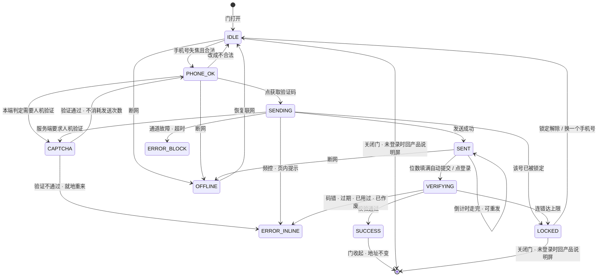
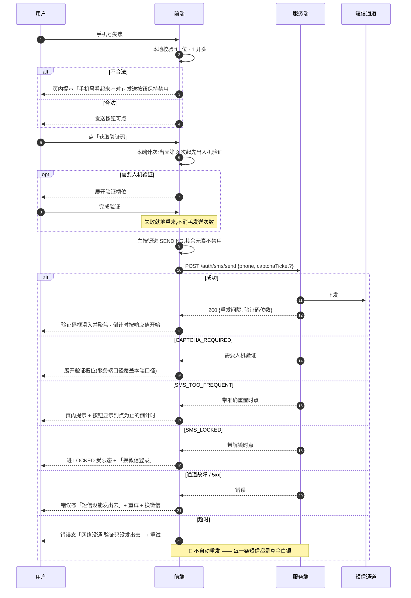
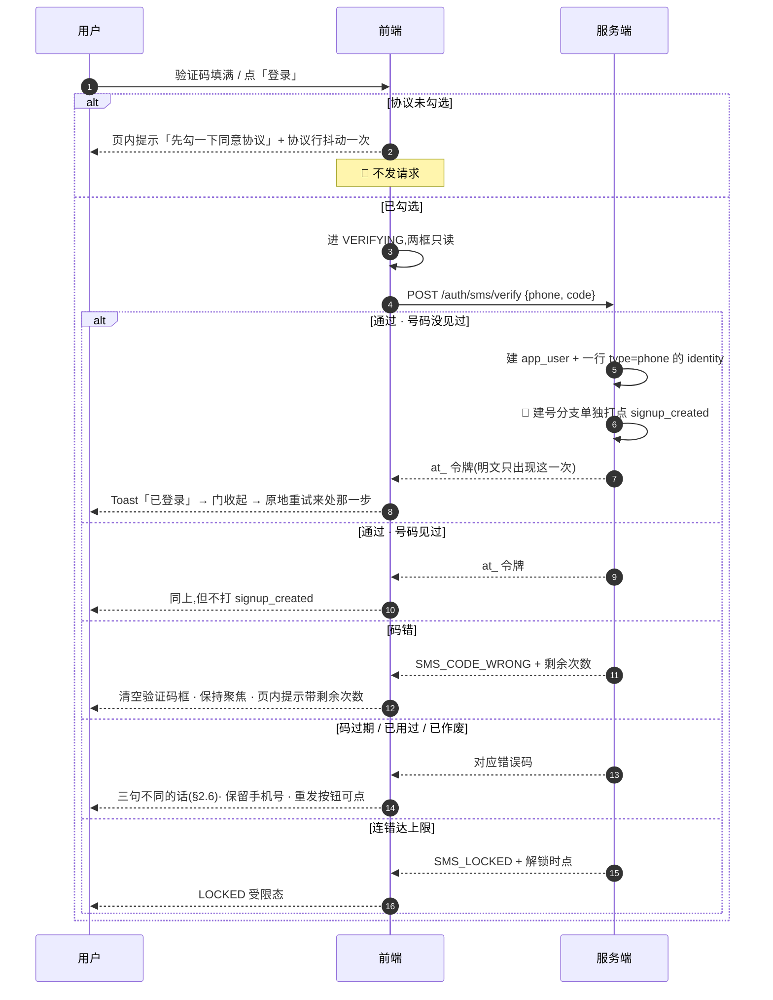
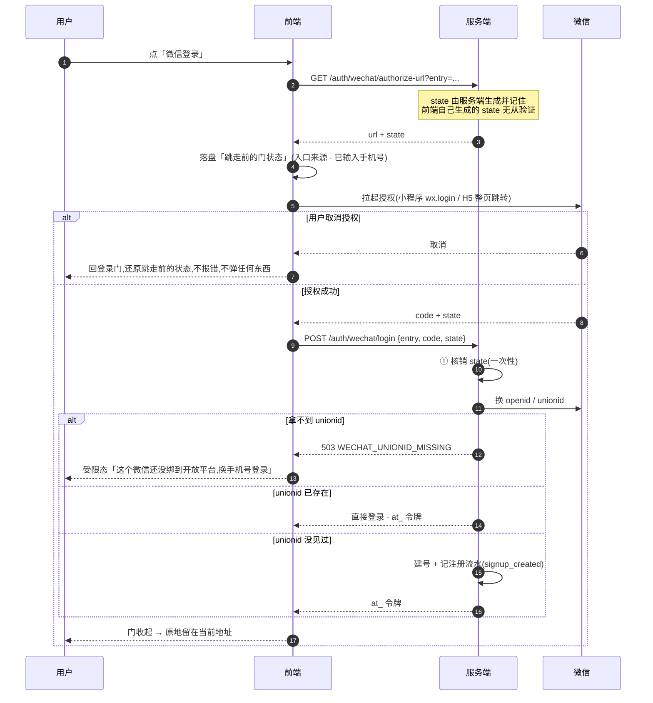
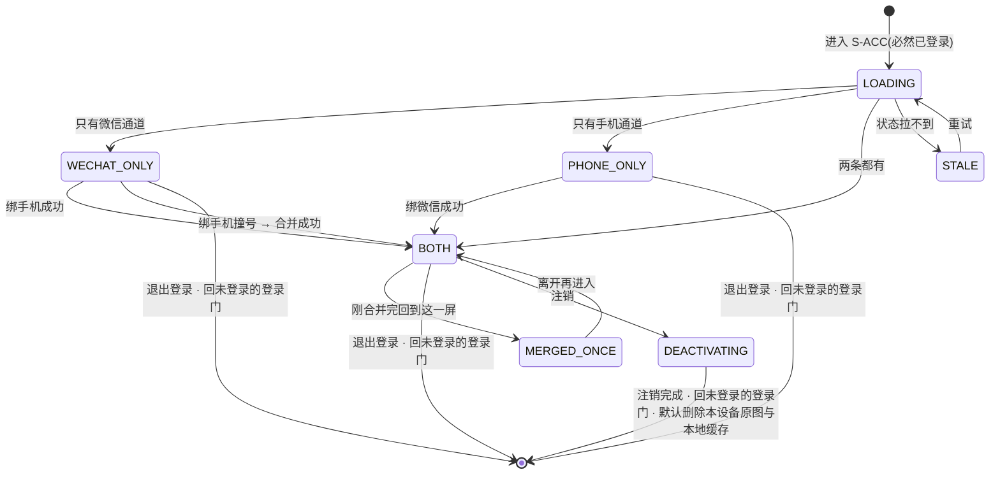
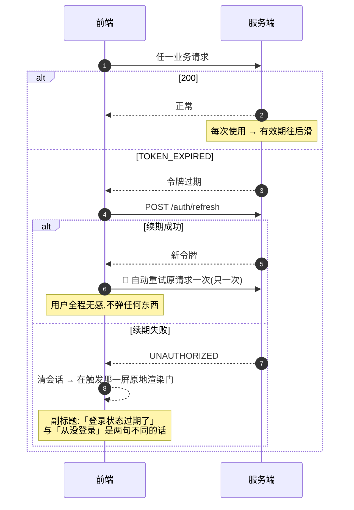
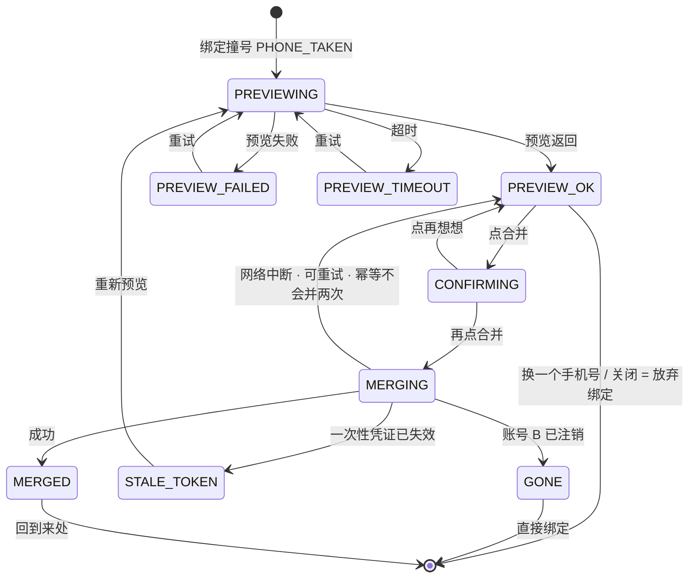
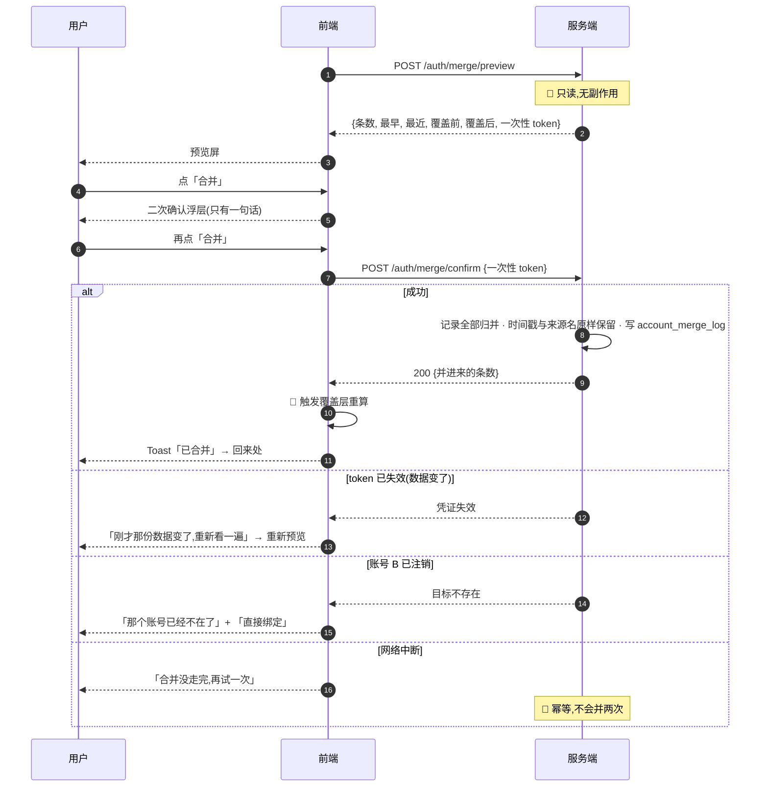
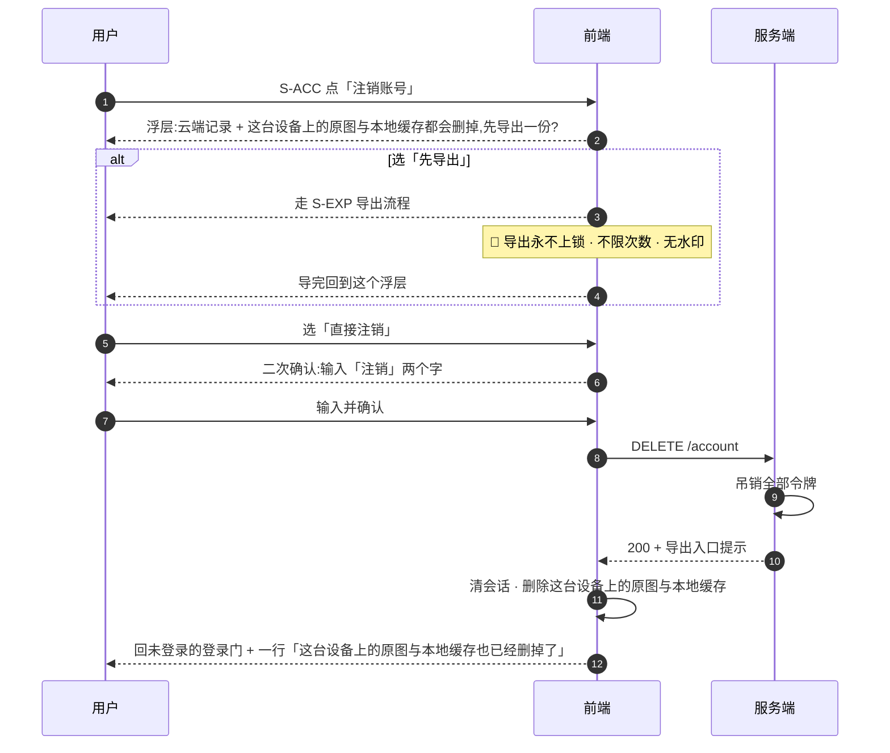

[← 用户侧功能规格](INDEX.md) ｜ [模块 F · 账号与端](../modules/模块F-账号与端.md)

# 登录与账号 · 逐屏规格

> **这份文档回答:用户怎么进来、进不来时屏幕上写什么、两个账号撞在一起时怎么办。**
> 覆盖 `S-LOGIN` `S-ACC` `S-MERGE` 三屏,写到**设计师能照着出稿、前后端能照着写代码**为止:
> 每一屏有区块结构与元素清单,每个元素有取值来源、空态、禁用条件与朗读文本;
> 每个动作有前端行为、请求、各档响应下的屏幕变化;每一条异常有上屏原文文案与「用户输入留住了吗」。
>
> **写作口径:受众=UI 设计 + 前后端开发;篇幅上限=1500 行;深度档位=详设。**
>
> **不是**账号模型与合并的产品判断(在 [`模块 F · 账号与端`](../modules/模块F-账号与端.md))、**不是**令牌形态与接口签名
> (在 [`技术架构与接口契约`](../../technical/INDEX.md) §6.1 §7.4、[`后端系统设计与组件接入`](../../technical/后端系统设计与组件接入.md) §1.6–§1.10 §6.1–§6.11)、
> **不是**端的技术选型(在 [`多端选型与端矩阵`](../../technical/多端选型与端矩阵.md),已冻结)、**不是**视觉稿(在设计侧)。
> 全局交互约定在 [`用户侧功能规格 · 总纲`](INDEX.md) §二,本文不重复,只在与三屏相关处引用。
>
> **基线:`origin/v1` @ `15accea`,fetch 于 2026-09-01T15:05Z。**
> **状态:活跃。** 登录通道增删、频控数值变化、合并策略变化、端矩阵变化,本文同一次改动内更新。

---

## 零、这份文档的数字口径与端点口径

**本文一个数字都不写死。** 频控阈值、锁定时长、验证码有效期与位数、令牌有效期、单批条数上限、
分页大小,一律以指针指向真源;界面上出现的所有数字**都从服务端响应里取**,前端不硬编码、不自己算。

| 类别 | 本文怎么写 | 真源 |
|---|---|---|
| 单号 / 单 IP 发送频控、重发间隔 | 只写「按频控」,数字来自 `sms/send` 响应 | [`技术架构与接口契约`](../../technical/INDEX.md) §6.1 · [`后端系统设计与组件接入`](../../technical/后端系统设计与组件接入.md) §1.8 |
| 验证码有效期、单次使用、连错锁定次数与解锁时长 | 只写「过期 / 已用过 / 已作废 / 已锁定」四种终态 | `技术架构与接口契约` §6.1 · `后端系统设计与组件接入` §1.8 |
| 验证码位数 | 由短信模板定,前端按响应里的位数渲染格子 | `后端系统设计与组件接入` §6.7(模板未报备,见 §十八 `L-6`) |
| 令牌有效期、滑动续期、多设备并存 | 只写「过期了就静默续期,续不上才让用户重登」 | `技术架构与接口契约` §7.4 · `后端系统设计与组件接入` §1.9 |
| 列表分页大小、cursor | 只写「cursor 分页,前端不猜总数」 | `技术架构与接口契约` §六 统一约定 |
| 「一天」从哪儿开始 | 频控的「日」与用户看到的「今天」**不是同一个键** | [`执行清单`](../../execution/INDEX.md) `R-81`(`kaodian.auth.sms.zone` / `kaodian.api.timeline.zone`) |

**端点口径:** 本文出现的端点全部是引用。**本文新提出的端点一律标 `🚧 待技术定稿`**,它是产品意图不是契约;
契约冲突时以 `技术架构与接口契约` 为准。全量对照见 §十四。

---

## 一、有几种登录,以及为什么不是五种

| # | 方式 | 可用端 | 阶段 | 是不是跨端锚点 | 进不去时的退路 |
|---|---|---|---|---|---|
| 1 | **手机号 + 短信验证码** | 全部 | 阶段 2 | ✅ **唯一锚点** | 换设备 / 等频控 |
| 2 | **微信授权** | 小程序 · App · **已认证服务号 H5** | 阶段 2 后 | ❌ 除非绑了手机号 | 转手机号验证码 |
| 3 | **Apple 登录** | iOS · macOS | 🚧 未定 | ❌ 除非绑了手机号 | 见 §十八 缺口 `L-1` |

**「不登录」不在这张表里,因为它不是一种登录方式,也不再是任何一条通道的退路**
—— 2026-09-02 用户裁定「没有本地模式」,未登录不能记、不能看盲区、不能打标、不能导出(§1.1)。

**没有密码。** 没有「注册」按钮、没有「忘记密码」、没有邮箱、没有第三方账号体系(除微信 / Apple 这两个端上架必需的)。
理由在 [`模块 F · 账号与端`](../modules/模块F-账号与端.md) §2.2:**少一个页面是次要的,少一个「我到底注册过没有」的犹豫才是主要的。**

微信那一行的「可用端」包含 H5,依据是 `后端系统设计与组件接入` §6.1 已确认本项目的公众号是**已认证的服务号**
且**已绑定到同一个微信开放平台账号** —— 网页授权可用、unionid 从第一天就有。
**但这不改变通道 2 的阶段归属:微信整体在阶段 2 后**(`技术架构与接口契约` §7.2),资质齐了不等于该现在做。

### 1.1 登录是入口,不是出口

**产品只有两种态,没有第三种。**

| 态 | 能做什么 | 是不是一种可停留的形态 |
|---|---|---|
| **未登录** | 只能看到产品说明与登录门。**不能记、不能看盲区、不能打标、不能导出** | ❌ 不是。它是进门前的那一步,不是一种用法 |
| **已登录** | 全部功能 | ✅ 唯一的正常形态 |

- **不登录不能记;能记的一定已登录。** 登录不是某个能力临到头上才弹出来的一步,它是进产品的第一步
- 首次打开**不直接进 `S-HOME`**:先给一屏产品说明(首启卡片,三句话),**底部按钮是登录入口,不给「跳过」**
- 相机 / 相册权限的申请时点**不变** —— 仍在第一次拍照时申请,只是它现在必然发生在登录之后
- 登录之后触发的再次登录(令牌过期、在别处被吊销)**仍然是「这一步需要先登录」,不是「请先登录」**;
  登录成功后**回到原处并自动重试刚才那一步**
- **原图仍然只存在用户自己的机器上**,不上云、不同步、不共享。取消本机模式不改变这一条(§十九 第 7 条)

🚫 **原红线「不允许把本机模式做成体验版」已作废。** 作废依据:2026-09-02 用户裁定「没有本地模式」。
作废原因:那条红线保护的是「不登录也能完整地用」这件事,而**这件事已经不存在** —— 没有被保护的对象,
就没有这条红线。**这里不接一条新的红线。** 能力矩阵见 [`用户侧功能规格 · 总纲`](INDEX.md) §四,本文不重复。

### 1.2 `S-LOGIN` 不是一条路由,是一扇原地渲染的门

[`多端选型与端矩阵`](../../technical/多端选型与端矩阵.md) §4.6.2 已冻结:**`/login` 这个地址不存在。**
理由是门只有里外、没有历史 —— 做成路由的话,登录完按一下后退就回到登录页,再点一次又登进去,一个不存在的往返。

**落到三屏上的具体形态:**

| | 结论 |
|---|---|
| 未登录访问任何 `route id` | **原地渲染登录门,地址不变** |
| 登录完成 | **原地留在那个地址**,不做任何 navigate,不 replace history |
| 用户按返回键 / 关闭门 | **回到「门底下那一屏」**(定义见下)。**不是回到上一个页面** |
| 分享出去的链接 | 分享的是那个 `route id` 的地址,不是登录地址 —— 别人打开时**在同一个地址上看到门** |
| `S-ACC` / `S-MERGE` | `S-ACC` 是 `settings` 下的一屏,有地址;**`S-MERGE` 也是门**,不是路由(它是一次必须当场答的问题,不是一个位置) |

**「门底下那一屏」是什么,由这一节定义。** `无障碍与多端适配` §3.4 与 §十五 用例 11
(「在 `S-LOGIN` 门里按返回 → 回到门底下那一屏」)引用的就是下面这张表:

| 关门时的身份 | 门底下那一屏是什么 |
|---|---|
| **未登录** | **只剩首启产品说明屏**(§1.1)。内容地址在新形态下全部需要账号,门一收起底下没有任何可用内容,所以**没有第二种可能** |
| 已登录过(令牌失效触发的门) | 触发那扇门的那一屏,处于受限态;地址不变 |

⚠️ **这条推翻了「深链 / 扫码进入登录屏」这个入口的旧写法。** 深链指向的永远是内容地址;
门是那个地址在未登录时的渲染结果。深链参数非法时的行为见 §八 `E-43`。

### 1.3 三屏 × 四种态的对应

`用户侧功能规格 · 总纲` §2.1 要求每一屏都画全四种态。三屏各自的落点:

| 屏 | 加载 | 空 | 错误 | 受限 |
|---|---|---|---|---|
| `S-LOGIN` | **不存在** —— 门不发首屏请求,元素全部本地渲染 | **不存在** —— 门永远有内容 | 发码 / 校验失败,页内提示或错误态 | 频控受限、锁定、通道未开通 |
| `S-ACC` | 设备列表与绑定状态未回时**骨架占位**,身份区先用本地缓存渲染 | 设备列表只有当前这一台时写「只有这一台」,不画插画 | 设备列表拉不到 → 该区块单独错误 + 重试,**不影响其余区块** | 令牌过期(静默续期失败后) |
| `S-MERGE` | 预览请求未回 → **骨架占位在数字那两行**,主按钮禁用 | **不存在** —— 走到这一屏说明另一个账号确实存在 | 预览失败 / 超时 → 错误态 + 重试 + 「换一个手机号」 | 一次性凭证过期 |

---

## 二、`S-LOGIN` 登录门

### 2.1 进入方式(六条复核后剩三条,全部要能返回)

| 入口 | 触发 | 副标题说什么 | 返回后 |
|---|---|---|---|
| 产品说明屏(首启卡片)底部的登录入口 | **进产品的第一步** | 通用句 | 回产品说明屏 —— 那里**没有「跳过」**(§1.1) |
| 未登录访问需要账号的地址(含深链) | 路由守卫。新形态下**内容地址全部需要账号** | 按目标屏给句子 | **原地留在该地址**,门收起后底下是产品说明屏(§1.2) |
| 令牌失效后的任一请求 | `UNAUTHORIZED`(过期 / 在别处被吊销) | 「登录状态过期了」 | 回触发屏并自动重试一次 |

**原表另外三条已不成立,原因是同一条。** `S-EXP` 点「让 AI 代发」、`S-BILL` 点任何档位、
`S-SET` 点「在另一台设备上也用」—— 这三屏在新形态下**本身就要求已登录**,到得了它们的人一定已经登录,
「这个能力需要账号」不会再触发一次登录(§1.1)。门仍然可能出现在这三屏上,但触发的是**令牌失效**(表第 3 行),
副标题是「登录状态过期了」,不再是「代发要用你自己的账号发出去」这类按能力写的句子。
**它们各自的「返回后」行为原样保留**,因为「回到原处并自动重试刚才那一步」按屏不同:
回 `S-EXP` 并自动重试代发(`AC-06`)、回 `S-BILL` 并保持所选档位(`AC-07`)、回 `S-SET`。

**返回键、左上角关闭、点浮层外部**三者行为一致:退出登录流程,回到来处,**不留半截状态**
—— 手机号输入保留在内存里(同一次会话内再打开门时预填),验证码输入清空。

### 2.2 屏幕结构

```
┌─ 固定区(不随内容滚动) ────────────────────────┐
│  [×] 关闭                                      │  ← 左上角,最小热区见 §十三
├────────────────────────────────────────────────┤
│  ① 说明区                                      │
│     标题:登录                                  │
│     副标题:这一步为什么需要账号(按入口)        │
├────────────────────────────────────────────────┤
│  ② 输入区                                      │  ← 折叠线以上必须放到这里
│     手机号输入框                                │
│     [页内提示位 · 常驻占位,不撑动布局]          │
│     验证码输入框(发送成功后滑入)               │
│     [页内提示位]                                │
│     [人机验证槽位 · 按需出现]                   │
├────────────────────────────────────────────────┤
│  ③ 动作区                                      │
│     主按钮:获取验证码 / 登录                    │
│     协议勾选行                                  │
├─ 滚动区(仅当 ④ 在小屏被挤出时才滚) ──────────┤
│  ④ 其他通道区                                  │
│     分隔线 + 「或者」                           │
│     微信登录(仅支持的端渲染)                   │
└────────────────────────────────────────────────┘
```

**两条结构硬要求:**

| # | 要求 | 为什么 |
|---|---|---|
| 1 | **折叠线以上必须同时看得见:副标题、手机号框、主按钮。** 软键盘弹起后仍然成立 | `用户侧功能规格 · 总纲` §2.4:软键盘不得遮挡当前输入框与它下方的主按钮,遮挡时整屏上推 |
| 2 | **页内提示位是常驻占位,不是插入元素。** 没有提示时占位透明但占高度 | 提示出现时布局跳动会把主按钮顶走,用户点空 |

**这一屏没有贴底出口区。** 原来的 ⑤「先不登录,继续用」已随本机模式一并取消(§1.1),
门的退出口只剩左上角关闭 —— 它**永不禁用**(§2.3)。

### 2.3 元素清单

| 元素 | 取值来源 | 为空 / 异常时 | 可点吗 | 禁用条件 | 无障碍朗读文本 |
|---|---|---|---|---|---|
| 关闭按钮 | 固定 | —— | 是 | **永不禁用** | 「关闭,按钮」 |
| 标题 | 固定文案「登录」 | —— | 否 | —— | 「登录,标题」 |
| 副标题 | **入口决定**(§2.1 表第三列) | 主动进入时用通用句 | 否 | —— | 朗读全句 |
| 手机号输入框 | 用户输入 | 占位符「手机号」 | 是 | `VERIFYING` / `LOCKED` 时只读 | 「手机号,输入框,已填 138****8000」——**已填内容按打码形态朗读** |
| 手机号页内提示 | 见 §八 | 隐藏(占位保留) | 否 | —— | `role=alert`,变化时立即播报 |
| 清除手机号按钮 | 固定 | 输入为空时隐藏 | 是 | 输入为空 | 「清除手机号,按钮」 |
| 验证码输入框 | 用户输入 | **未发送成功前不渲染** | 是 | `VERIFYING` / `LOCKED` 时只读 | 「验证码,输入框,已填 n 位,共 m 位」 |
| 验证码页内提示 | 见 §八 | 隐藏(占位保留) | 否 | —— | `role=alert` |
| 发送 / 重发按钮 | 未发过=「获取验证码」;倒计时中=「{n}s 后重发」;可重发=「重发」 | 手机号非法时保持禁用 | 条件 | 手机号非法 · 倒计时未走完 · `SENDING` · `LOCKED` · 离线 | 「获取验证码,按钮」/「还需等待 n 秒,按钮,不可用」 |
| 主按钮 | 未发过=「获取验证码」;已发过=「登录」 | —— | 条件 | 验证码位数不足 · 未勾协议 · `VERIFYING` · 离线 | 「登录,按钮」/「登录,按钮,不可用,还需填完验证码」 |
| 人机验证槽位 | 服务端要求或本端提前挡(§2.7) | 不需要时**不占高度** | 是 | 加载中 | 「安全验证,请完成滑动」 |
| 微信登录入口 | 图标 + 「微信登录」 | **仅支持的端渲染**(§十一) | 是 | 微信未安装 / 版本过低 / 通道未开通 | 「微信登录,按钮」 |
| 协议勾选 | 「已阅读并同意《用户协议》《隐私政策》」 | **默认不勾选** | 是 | **永不禁用** | 「已阅读并同意用户协议和隐私政策,复选框,未选中」 |
| 协议链接 ×2 | 协议正文地址 | 拉不到正文 → 见 `E-46` | 是 | —— | 「用户协议,链接」「隐私政策,链接」 |
| 离线细条 | 网络状态 | 在线时不渲染 | 否 | —— | 「当前离线,登录需要联网」 |

🔴 **关闭按钮永不禁用,它是这一屏唯一的退出口。** 原来的「先不登录,继续用」已取消(§1.1),
所以「不把用户堵在门里」这件事**全部压在关闭按钮上** —— 它的对比度与热区按 §十三 的最小值走,
任何状态(含 `LOCKED` `ERROR_BLOCK` `OFFLINE`)下都不得禁用、不得隐藏。

🔴 **这一屏没有任何一个字段能装下题干。** 全屏只有两个可输入元素:手机号、验证码,
各自有位数上限与字符白名单(§七)。**不留、也不会留第三个输入框。**

### 2.4 状态枚举

| 状态 | 屏幕上具体是什么 | 手机号框 | 验证码框 | 主按钮 | 可退出吗 |
|---|---|---|---|---|---|
| `IDLE` | 只有手机号框;验证码框不存在 | 可编辑 · 聚焦 | 不渲染 | 「获取验证码」· 禁用 | ✅ |
| `PHONE_OK` | 同上 | 可编辑 | 不渲染 | 「获取验证码」· 可点 | ✅ |
| `CAPTCHA` | 人机验证槽位展开,压住动作区 | 只读 | 不渲染 | 禁用 | ✅ 关掉验证即回 `PHONE_OK` |
| `SENDING` | 主按钮转圈,文案「发送中」;**其余可点元素不禁用** | 可编辑 | 不渲染 | 转圈 · 禁用 | ✅ |
| `SENT` | 验证码框滑入并自动聚焦;倒计时开始 | 可编辑(改号即回 `PHONE_OK`) | 可编辑 · 聚焦 | 「登录」· 位数不足则禁用 | ✅ |
| `VERIFYING` | 主按钮转圈;两个输入框只读 | 只读 | 只读 | 转圈 · 禁用 | ✅ **允许退出**,请求跑完(见 `E-56`) |
| `ERROR_INLINE` | 页内提示出现在对应输入框下方 | 可编辑 | 可编辑 | 按位数决定 | ✅ |
| `ERROR_BLOCK` | 整个输入区替换为错误态:一句话 + 重试按钮 | 只读 | 只读 | 隐藏 | ✅ |
| `LOCKED` | 受限态:说清锁到什么时候 + 「换微信登录」;关闭按钮仍在 | 只读 | 只读 | 隐藏 | ✅ |
| `OFFLINE` | 顶部常驻细条 + 主按钮禁用 + 一句「登录这一步必须联网」 | 可编辑 | 可编辑 | 禁用 | ✅ |
| `SUCCESS` | **不停留**:Toast「已登录」→ 门收起 → 原地留在当前地址 | —— | —— | —— | —— |



**图里有两条线不能动:**

1. `CAPTCHA --> PHONE_OK` 那条标着「不消耗发送次数」—— 人机验证失败不是用户的错。
2. **每一个态都有回 `[*]` 的路**(经关闭按钮)。**没有任何一个态把用户堵死**,包括 `LOCKED`。
   现在这条路只剩一条(⑤ 已取消),所以关闭按钮**永不禁用**这一条比以前更硬(§2.3)。

### 2.5 手机号输入交互

| 行为 | 规则 |
|---|---|
| 键盘 | 数字键盘;`inputmode=numeric` `autocomplete=tel` |
| 长度 | 输入到 11 位自动截断,不再接受输入(**唯一一处输入过程中就生效的约束**) |
| 字符白名单 | 只接受 `0-9`。粘贴时先剥掉空格、`-`、`+86`、括号,再截断 |
| 校验时机 | **失焦时**校验;输入过程中不报错 |
| 校验规则 | 11 位、以 1 开头。**不做运营商号段校验** —— 号段会变,判错的代价比放过大 |
| 非法时 | 页内提示「手机号看起来不对」+ 发送按钮保持禁用 |
| 记忆 | 上次登录成功的号码**本机记住并预填**,可一键清除;换号直接改,不需要先清 |
| 打码 | 屏幕上**不打码**(用户要能核对自己输的是什么);朗读与日志里打码 |
| 改号 | `SENT` 态下改动手机号 → 立即回 `PHONE_OK`,**清空验证码框、停掉倒计时、收起验证码框** |

### 2.6 验证码输入交互

| 行为 | 规则 |
|---|---|
| 出现时机 | 点了「获取验证码」且服务端返回成功之后,验证码框**滑入并自动聚焦** |
| 格子数 | **按响应里的位数渲染**,不写死(§零) |
| 键盘 | 数字键盘;`autocomplete=one-time-code` |
| 粘贴 | 粘贴一串数字 → 剥非数字 → 按位填充 → 填满即**自动提交** |
| 填满 | **自动提交**,主按钮同时可点(两条路都留着) |
| 倒计时 | **服务端返回的重发间隔为准**,不由前端自己算 —— 换设备 / 杀进程重进不能绕过频控 |
| 倒计时持久化 | 倒计时终点存本机;切回前台按墙钟重算剩余,**不是从暂停处继续倒** |
| 输错 | 清空输入框、保持聚焦、页内提示带剩余次数 |
| 连错达上限 | 进 `LOCKED`,见 §八 `E-07` |
| 四种终态 | **四句不同的话**,不许合并成「验证码错误」(`后端系统设计与组件接入` §1.8) |

**「四种终态四句话」这条是从后端抄下来的,它在界面上的形态是:**

| 终态 | 上屏原文 | 用户该做的事 | 说成同一句话的后果 |
|---|---|---|---|
| 输错 | 「验证码不对,还能试 {n} 次」 | 重输 | —— |
| 已过期 | 「验证码过期了,重新发一条」 | **重发** | 用户拿着过期的码反复输,把自己输到锁定 |
| 已作废(同号发了新的) | 「这个号刚发了新的一条,用新的那条」 | **用新的那条** | 同上 |
| 频控 / 锁定 | 「错太多次了,{n} 分钟后再试」 | **等到具体时点** | 「请稍后再试」只惩罚真实用户;刷子不会因为文案含糊而少刷 |

### 2.7 人机验证什么时候出现

`技术架构与接口契约` §6.1 写着频控之外**还要滑块或行为验证**,理由是纯计数频控挡不住换 IP 刷短信费;
`后端系统设计与组件接入` §1.8 把它排在四道闸的**第①道** —— 拦在花钱那一步之前。产品侧的出现规则:

| 情况 | 是否出现 |
|---|---|
| 同一设备当天第 1 次发送 | ❌ 不出现 |
| 同一设备当天第 3 次起 | ✅ 出现 |
| 服务端返回 `CAPTCHA_REQUIRED` | ✅ 出现(**服务端说了算,前端只是提前挡一道**) |
| 验证失败 | 就地重来,**不消耗发送次数** |
| 短信通道处于「不真发」的默认配置 | 由服务端决定;**前端不因为环境不同而改行为**(`后端系统设计与组件接入` §6.8 的配对红线在服务端强制) |

⚠️ **验证组件加载失败时不能把用户卡死**:超过加载预算(§十二)未出现 →
显示「验证组件没加载出来」+ 重试 + 「换微信登录」。**Web 端还要考虑它被拦截插件屏蔽**(`E-53`)。

### 2.8 逐步骤交互细则 · 发验证码



**四条不许违反的细则:**

| # | 细则 | 为什么 |
|---|---|---|
| 1 | `SENDING` 期间**不禁用**手机号框、关闭按钮、微信入口 | 转圈期间把整屏锁住,用户唯一能做的就是等 |
| 2 | 发码超时后**不自动重试** | 请求可能已经到了服务端并真发了短信。自动重试 = 双倍账单 + 双倍频控消耗 |
| 3 | 倒计时数字**只来自响应** | 前端自己算的倒计时,杀进程重进就归零,等于没有频控 |
| 4 | 频控与锁定的提示**必须给准确时点**,不给「请稍后」 | `后端系统设计与组件接入` §1.8:含糊的文案只惩罚真实用户 |

### 2.9 逐步骤交互细则 · 校验并登录



🔴 **界面上没有「注册」二字,但服务端必须能把「建号」这一支单独数出来。**
阶段 3 的判据是「累计陌生注册数」,只统计登录成功次数的话那个数里混着老用户
(`后端系统设计与组件接入` §1.7)。**这不是埋点偏好,是判据能不能被算出来的问题** —— 见 §十五。

### 2.10 协议勾选

| 规则 | 说明 |
|---|---|
| 默认状态 | **不勾选**。不做「继续即代表同意」的隐式勾选 |
| 未勾就点主按钮 | 页内提示 + 协议行抖动一次,**不发请求**(`E-02`) |
| 勾选后 | 记住本机,同一账号下次不再要求重勾 —— 直到协议版本变化(`E-42`) |
| 点协议链接 | **端内打开**,不跳系统浏览器;返回后勾选状态与已输入内容全部保留 |
| 协议正文拉不到 | 见 `E-46`。**不允许「拉不到就当同意」** |
| 协议版本 | 由服务端给版本号;版本变了要重新勾一次。端点见 §十四(🚧 待技术定稿) |

---
## 三、微信授权(阶段 2 后)

### 3.1 三条入口,不是一条

`后端系统设计与组件接入` §6.1 已经写明:**微信不是一条通道,是三条** —— 小程序、
已认证服务号 H5、PC 扫码,三个不同的应用、三套 appid/secret、三笔认证费。产品侧只关心一件事:
**这三条在界面上是同一个按钮**,用户看到的永远是「微信登录」四个字,分支在服务端。

| 入口 | 哪个端会走到 | 界面差异 |
|---|---|---|
| 小程序 | 微信小程序 | 无跳转,`wx.login` 直接给 code |
| 服务号 H5 | 微信内打开的 H5 | **整页跳走再跳回**,回来时门要能还原到跳走前的状态(§3.4) |
| PC 扫码 | Web 桌面浏览器 | 🚧 阶段 2 后,且需要网站应用审核。**当前不在界面上出现** |

### 3.2 授权流程



### 3.3 授权之后账号是什么形态

| 规则 | 说明 |
|---|---|
| 拿不到 unionid | **拒绝降级建号**,提示「这个微信还没绑到开放平台,换手机号登录」。服务端返回 503 不是 502 —— 这不是微信出了问题,是配置没做对(`后端系统设计与组件接入` §6.3) |
| 微信登录后 | 账号状态是「已登录 · 未绑手机」,**它还不是跨端锚点** |
| 弱提示 | `S-ACC` 顶部一行:「绑定手机号后,换设备也能看到这些记录」。**不弹窗、不拦路、不每次都提** |
| 取消授权 | 静默回到登录门,**不报错** —— 用户取消不是错误 |
| 昵称与头像 | 服务端**一概丢弃**(`后端系统设计与组件接入` §6.1)。`S-ACC` 上不显示微信昵称头像 |
| 通道未开通 | 服务端回 503 `WECHAT_NOT_ENABLED`,**不是 404** —— 端点存在,只是这个阶段还没开(`E-51`) |

⚠️ **「显示微信昵称」这条与更早的 `S-ACC` 身份区写法冲突,以本表为准:**
服务端不留昵称,界面上就没有昵称可显示。`S-ACC` 身份区在只绑了微信时显示的是**「已绑定微信」**,
不是一个名字。更正依据见 §十八。

### 3.4 H5 整页跳转的还原责任

**这条是 H5 独有的,小程序和 App 都没有。** 整页跳走意味着门所在的那个页面被卸载了。

| 要还原什么 | 存哪 | 还原不了时 |
|---|---|---|
| 门是从哪个 `route id` 上打开的 | 跳走前写本机存储,以 state 作 key | 回首页,门不再自动打开 |
| 副标题该说哪一句 | 同上 | 用通用句 |
| 已输入的手机号 | 同上 | 空着,不报错 |
| 「登录成功后要自动重试的那一步」 | 同上 | **不自动重试**,用户手动再点一次 |

🔴 **还原失败不许表现为一次错误。** 用户刚授权完,看到一条错误提示只会以为登录失败了 ——
实际上他已经登录成功了。见 `E-14`。

---

## 四、`S-ACC` 账号屏

### 4.1 屏幕结构

```
┌─ 固定区 ───────────────────────────────────────┐
│  ← 返回      账号                               │
├─ 滚动区 ───────────────────────────────────────┤
│  ① 身份区(走到这一屏必然已登录)                │
│     已绑通道(手机号打码 / 已绑定微信)          │
│     [弱提示条:绑定手机号后,换设备也能看到这些记录]│
├────────────────────────────────────────────────┤
│  ② 绑定区(只渲染没绑的那些)                    │
│     绑定手机号 >                                 │
│     绑定微信 >                                   │
├────────────────────────────────────────────────┤
│  ③ 设备区                                       │
│     当前设备(本机)                              │
│     其他设备 n 台 · 各自最近使用时间             │
├────────────────────────────────────────────────┤
│  ④ 数据区:导出我的全部数据 >                     │
├────────────────────────────────────────────────┤
│  ⑤ 退出区:退出登录                              │
├────────────────────────────────────────────────┤
│  ⑥ 注销区(次要样式,非红色大按钮):注销账号     │
└────────────────────────────────────────────────┘
```

**折叠线以上必须看得见 ①,以及 ② 的第一行(如果有)。** ⑥ 永远在最下面,
**不做成红色大按钮** —— 它是一个正当但不可逆的操作,不该长得像一个主动作。

### 4.2 元素清单

**这一屏没有「未登录时」这一列** —— 未登录到不了 `S-ACC`(§1.1),原来那一列写的全是本机模式下的形态,已随之取消。

| 区块 | 元素 | 取值来源 | 为空 / 异常时 | 可点吗 | 禁用条件 | 无障碍朗读文本 |
|---|---|---|---|---|---|---|
| ① | 身份主行 | 已绑通道 | 拉不到 → 用本地缓存 + 顶部一条「状态没刷新」 | 否 | —— | 「已绑定手机号 138****8000」 |
| ① | 手机号 | 服务端返回的打码形态 | —— | 否 | —— | **按打码形态朗读**,不朗读完整号码 |
| ① | 微信绑定标记 | 是否存在 wx identity | —— | 否 | —— | 「已绑定微信」 |
| ① | 弱提示条 | 只绑了微信时出现 | —— | 是(点进绑手机) | —— | 「绑定手机号后,换设备也能看到这些记录,按钮」 |
| ② | 「绑定手机号」 | 未绑手机时渲染 | —— | 是 | 离线 | 「绑定手机号,按钮」 |
| ② | 「绑定微信」 | 未绑微信且本端支持微信时渲染 | 本端不支持 → **不渲染**,不做灰色 | 是 | 离线 · 通道未开通 | 「绑定微信,按钮」 |
| ③ | 当前设备行 | 本机设备名 | 设备名取不到 → 用端的通用名 | 否 | —— | 「当前设备,{名称}」 |
| ③ | 其他设备行 | `GET /tokens` 的 `device_label` + 最近使用时间 | 只有一台 → 一句「只有这一台」 | 是(可单条退出) | 离线 | 「{名称},最近使用 {相对时间},退出这台,按钮」 |
| ③ | 设备区错误态 | —— | 拉不到 → 该区块单独错误 + 重试 | 是 | —— | `role=alert` |
| ④ | 「导出我的全部数据」 | 固定 | —— | 是 | **永不禁用** | 「导出我的全部数据,按钮」 |
| ⑤ | 「退出登录」 | 固定 | —— | 是 | 注销执行中 | 「退出登录,按钮」 |
| ⑥ | 「注销账号」 | 固定 | —— | 是 | 注销执行中 | 「注销账号,按钮」 |

🔴 **④ 在任何登录态下都在,且永不禁用。** [`用户侧功能规格 · 总纲`](INDEX.md) §四:
**导出永远不限次数、不加水印、不因未付费而删减** —— 这一格是承诺,不是策略。

🔴 **这一屏也没有任何一个字段能装下题干。** 设备名是**服务端按端类型生成的枚举**,
不是用户输入(能不能改名未定,见 §十八 `L-9`)。

### 4.3 状态枚举

| 状态 | 屏幕上具体是什么 |
|---|---|
| `WECHAT_ONLY` | ① 显示「已绑定微信」+ 弱提示条;② 只有「绑定手机号」;③④⑤⑥ 全有 |
| `PHONE_ONLY` | ① 显示打码手机号;② 只有「绑定微信」(本端支持时);③④⑤⑥ 全有 |
| `BOTH` | ① 两行都显示;② **整块不渲染**;③④⑤⑥ 全有 |
| `LOADING` | ① 用本地缓存渲染;②③ 骨架占位;④ 已可点 |
| `STALE` | 拉不到最新状态:① 用缓存 + 顶部一条「状态没刷新」+ 重试;②③ 禁用 |
| `MERGED_ONCE` | ① 上方一次性提示「{n} 条记录已经并进来了」。**下次进入不再显示** |
| `DEACTIVATING` | 注销请求进行中:全屏只读,⑥ 转圈,其余禁用 |

**原 `LOCAL_ONLY` 已删除**(2026-09-02 用户裁定「没有本地模式」):它描述的是本机模式下的 `S-ACC`,
而未登录已经到不了这一屏。**这一屏的入口态是 `LOADING`,不是某个未登录态。**



### 4.4 绑定手机号

```mermaid
sequenceDiagram
    autonumber
    participant U as 用户
    participant F as 前端
    participant S as 服务端

    U->>F: S-ACC 点「绑定手机号」
    F-->>U: 打开与 S-LOGIN 同构的输入区(标题改成「绑定手机号」)
    Note over F: 🔴 复用同一套输入组件与同一套异常映射<br/>不写第二份手机号校验
    U->>F: 手机号 + 验证码
    F->>S: POST /auth/sms/send → POST /auth/bind/phone
    alt 号码未被占用
        S->>S: 给当前账号加一行 type=phone 的 identity
        S-->>F: 200
        F-->>U: Toast「已绑定」→ 回 S-ACC,② 少一行,① 多一行
    else 号码已属于另一个账号
        S-->>F: PHONE_TAKEN
        F-->>U: 转 S-MERGE(§五)
        Note over U,F: 🔴 不给「以后再说」这个出口
    else 当前令牌已失效
        S-->>F: UNAUTHORIZED
        F-->>U: 先静默续期;续不上 → 「登录状态过期了,重新登一下」(E-33)
    end
```

**绑定与登录复用同一套输入组件,但有三处不同:**

| 项 | `S-LOGIN` | 绑定手机号 |
|---|---|---|
| 标题 | 「登录」 | 「绑定手机号」 |
| 协议勾选 | 有 | **没有** —— 已登录说明协议已同意过 |
| 底部出口 | **没有**(只有左上角关闭) | **有「以后再说」** —— 绑定不是必经关口,可以放弃;而登录是,所以门上没有对应的一行 |

### 4.5 绑定微信

与 §三 同一条链路,差别只有两处:调用 `POST /auth/bind/wechat`;
撞上「这个微信已属于另一个账号」时同样转 `S-MERGE`。
**本端不支持微信时,② 里不渲染这一行,不做灰色禁用** —— 一个这个端上不存在的能力,不该在这个端上留一个灰按钮。

### 4.6 设备区

| 规则 | 说明 |
|---|---|
| 数据来源 | `GET /tokens`(`技术架构与接口契约` §6.5),取 `device_label` 与最近使用时间 |
| 多设备 | **不做「把别的设备踢下线」的默认动作**。滑动续期,多端同时在线是正常的(`技术架构与接口契约` §7.4) |
| 单条退出 | 每一行可单独「退出这台」→ `DELETE /tokens/{id}`,**立即生效** |
| 退出当前这台 | 与 ⑤「退出登录」是同一件事,走同一段拦截逻辑(§4.7) |
| 时间显示 | 相对时间(「3 天前」),悬停 / 长按给绝对时间 |
| 排序 | 当前设备置顶,其余按最近使用时间倒序 |
| 分页 | cursor 分页;设备多到一屏放不下时**分页而不是截断** |

### 4.7 退出登录:一条能从背后捅穿「记录永不失败」的路径

```mermaid
sequenceDiagram
    autonumber
    participant U as 用户
    participant F as 前端
    participant Q as 本地离线队列
    participant S as 服务端

    U->>F: 点「退出登录」
    F->>Q: 查有没有未上传的记录
    alt 队列里还有未上传的记录
        F-->>U: 🔴 先拦一次:浮层说清有 {n} 条还没传上去
        Note over U,F: 拦成什么样未定 —— 见 §十八 L-5
        U->>F: 选「先传完」→ 触发补传,传完再回到这一步
    else 队列是空的
        F-->>U: 浮层确认一次(🔴 真源原文,见下):「退出后,这台设备上的原图一张不动;已经同步过的记录会从这台设备上清掉 —— 它们在你的账号里,重新登录就回来」
        U->>F: 确认
        F->>S: POST /auth/logout(只吊销当前令牌)
        S-->>F: 200
        F->>F: 清令牌、会话与已同步的记录缓存(**不碰原图**)
        F-->>U: 回到未登录的登录门
    end
```

🔴 **退出登录的清除范围,以这张表为唯一真源**(2026-09-02 定,`设置与原图` §4.3 引用本表,不另立说法):

| | 退出登录时 | 为什么 |
|---|---|---|
| 令牌与会话 | **清** | 退出就是解除这台设备与账号的连接 |
| 已同步过的记录缓存 | **清** | 它们在账号里,重新登录就回来,清掉不丢东西 |
| 队列里还没上传的记录 | **先拦一次,传完再退**(见下) | 服务端没有副本,清掉就是丢 |
| **原图** | 🔴 **一张不动** | 原图从不上传,账号里没有副本,清掉就是永久毁掉用户自己的图。**只有注销才删原图**(§六) |

🔴 **这条拦截不是可选项。** 离线队列在设备本地,**退出登录会清掉已同步的记录缓存** ——
如果队列里还有没上传的记录,它们就在用户完全不知情的情况下消失了
(`模块 F · 账号与端` §2.5 · `后端系统设计与组件接入` §1.9)。
**它是唯一一条不经过采集层就能毁掉一条记录的路径**,「记录动作本身永不失败」防不到这里。

### 4.8 令牌续期与失效



**产品对这条链路的唯一硬要求:`UNAUTHORIZED` 必须能让前端区分「从没登录」与「登录过期」。**
两者副标题不同,而副标题是这扇门唯一在说人话的地方。

---

## 五、`S-MERGE` 账号合并:唯一一处刻意不给退路的地方

**触发**:已登录账号 A 去绑手机号(或绑微信),而该标识已属于账号 B(`PHONE_TAKEN`)。

**为什么这里反过来不给退路:** 产品在别处一律降低摩擦,这里不。
「以后再说」的代价不是多一次点击,是从这一刻起这个人的记录永久分成两份,而他自己不知道。
等他发现的时候,看到的是一个偏大的差集 —— **而一次误报足以让他不再相信后面所有的差集**
(`模块 F · 账号与端` §2.3)。

### 5.1 屏幕结构

```
┌─ 第一步 · 预览(占满,不是小浮层) ────────────┐
│  [×] 关闭 —— 等于放弃这次绑定                   │
│                                                │
│  ① 标题:这个手机号已经有记录了                  │
│  ② 主信息:另一个账号里有 {n} 条记录             │
│           最早 {date},最近 {date}              │
│  ③ 变化说明:合并后,这 {n} 条会算进你现在这个    │
│           账号,碰过的考点从 {a} 个变成 {b} 个   │
│  ④ 🔴 不可逆声明(独立一行,不与其他文字混排)   │
│           合并之后不能拆开。                     │
│                                                │
│  ⑤ 主按钮:合并                                 │
│  ⑥ 次按钮:换一个手机号                         │
└────────────────────────────────────────────────┘
        ↓ 点「合并」
┌─ 第二步 · 确认(小浮层,只有一句话) ──────────┐
│  合并后不能拆开,继续吗?                        │
│  [合并]  [再想想]                               │
└────────────────────────────────────────────────┘
```

**④ 必须独立成行、独立成段,不许挤进 ③ 的句尾。** 不可逆声明和数字混排,用户读的是数字。

### 5.2 元素清单

| 元素 | 取值来源 | 为空 / 异常时 | 可点吗 | 禁用条件 | 无障碍朗读文本 |
|---|---|---|---|---|---|
| 关闭 | 固定 | —— | 是 | 合并执行中 | 「关闭,按钮,关闭等于放弃这次绑定」 |
| 标题 | 固定 | —— | 否 | —— | 「这个手机号已经有记录了,标题」 |
| 记录条数 `{n}` | `merge/preview` 响应 | 预览未回 → **骨架占位** | 否 | —— | 「另一个账号里有 n 条记录」 |
| 最早 / 最近时间 | 同上 | 同上 | 否 | —— | 绝对日期,不用相对时间 |
| 覆盖前后 `{a}`→`{b}` | 同上 | 拿不到该字段 → **整行不显示**,不显示 0 | 否 | —— | 「碰过的考点从 a 个变成 b 个」 |
| 不可逆声明 | 固定 | **永不隐藏** | 否 | —— | 「合并之后不能拆开」,**单独一次播报** |
| 主按钮「合并」 | 固定 | —— | 是 | 预览未回 · 预览失败 · 离线 | 「合并,按钮」 |
| 次按钮「换一个手机号」 | 固定 | —— | 是 | 合并执行中 | 「换一个手机号,按钮」 |
| 二次确认浮层 | 固定 | —— | 是 | —— | 「合并后不能拆开,继续吗」 |

🔴 **合并屏上的数字只回答「有没有、几次、多久前」:条数、最早时间、最近时间,外加一个覆盖度前后值。**
没有对比、没有评价、没有任何形容词。

🔴 **预览里不显示「会并进来哪些记录」的清单。** 挑选界面本身就是一次「按覆盖度调数据」的入口(§5.6),
而且一条记录的摘要展开到极限就会开始接近内容 —— **这一屏只给计数,不给内容**。

### 5.3 状态枚举

| 状态 | 屏幕上具体是什么 |
|---|---|
| `PREVIEWING` | ②③ 骨架占位;④ 已显示(它是固定文案);⑤ 禁用 |
| `PREVIEW_OK` | 数字全部上屏;⑤ 可点 |
| `PREVIEW_FAILED` | 错误态:「另一个账号里有多少条,现在算不出来」+ 重试 + ⑥ |
| `PREVIEW_TIMEOUT` | 错误态:「那个账号的记录有点多,算得有点久」+ 重试 + ⑥ |
| `CONFIRMING` | 二次确认浮层在上层;底下的预览保持可见但不可交互 |
| `MERGING` | ⑤ 转圈;关闭与 ⑥ 禁用;**这是本文唯一一处允许禁用关闭的地方** |
| `MERGED` | 不停留:Toast「已合并」→ 回来处;`S-ACC` 进 `MERGED_ONCE` |
| `STALE_TOKEN` | 一次性凭证失效:「刚才那份数据变了,重新看一遍」+ 重新预览 |
| `GONE` | 预览与确认之间账号 B 被注销:「那个账号已经不在了」+ 「直接绑定」 |



**图里只有一条线不能加:`PREVIEW_OK` 没有指向「以后再说」的箭头。**
关闭与「换一个手机号」都是**放弃这次绑定**,不是把这个决定推到以后 —— 二者的区别是:
放弃绑定后账号 A 仍然是账号 A,没有任何一份数据处在「将来要并」的悬置状态。

### 5.4 合并流程



### 5.5 合并后

- Toast「已合并」→ 回到来处;`S-ACC` 顶部显示一次性提示「{n} 条记录已经并进来了」,**下次进入不再显示**
- **时间戳与来源名称原样保留**,不重排、不改写(`模块 F · 账号与端` §2.3)
- 合并**触发覆盖层重算**;重算未完成时盲区屏显示「正在重新算,稍等」而不是旧数字
- 重算期间用户可以正常记录、正常导出;**只有盲区那几个数字处在「正在重新算」**

### 5.6 不做的事

| 不做 | 为什么 |
|---|---|
| 自动合并 | 用户会失去对「我的数据在哪个账号里」的控制。而且手机号会被运营商回收、微信会被借用登录,**自动合并可能把两个人的记录并到一起,那会让覆盖度彻底失真 —— 那个指标就是整个产品**(`技术架构与接口契约` §7.1) |
| 拆分 / 回滚 | 拆分需要保留合并前快照 = 一份重复数据,而且拆错比合错更难解释 |
| 合并时让用户挑哪些记录 | 挑选界面本身就是一次「按覆盖度调数据」的入口 |
| 预览里展开记录内容 | 记录摘要展开到极限会开始接近内容,而**这个产品不碰内容** |
| 「以后再说」 | 见 §五 开头 |

---

## 六、注销与导出

### 6.1 步骤

| 步骤 | 屏幕 | 规则 |
|---|---|---|
| 1 | `S-ACC` 点「注销账号」 | 次要样式,不在首屏,**不是红色大按钮** |
| 2 | 浮层 | 「注销后,云端的记录会被删掉,**这台设备上的原图与本地缓存也会一起删掉**。**要不要先导出一份?**」+ 「先导出」(主) / 「直接注销」(次)。**这就是那一次明确告知**,只说一次,说在用户决定要不要导出之前 |
| 3 | 点「先导出」 | 走 `S-EXP` 的导出流程,导完**回到这一步**(不是回 `S-ACC`)。🔴 **这个入口保持不变、永不禁用** |
| 4 | 二次确认 | 输入「注销」两个字才可点(**唯一一处要求打字确认的地方**) |
| 5 | 执行 | `DELETE /account`;**响应必须带导出入口提示**;吊销全部令牌;**同时删除这台设备上的原图与本地缓存** |
| 6 | 完成 | 回到**未登录的登录门**;这台设备上的原图与本地缓存**默认已删除**(第 2 步已明确告知过一次),**不再给「要不要也删掉」的二选一** |



⚠️ **删除时点(立即硬删 vs 软删 T+N)是未决项**,`技术架构与接口契约` §6.1 与
`后端系统设计与组件接入` §1.9 都已登记,属用户协议不属架构,待 `L-A5` 律师稿。界面文案取决于它:
如果是软删,第 2 步文案必须改成「{n} 天内还能找回」—— **在它定下来之前,界面按「立即删除」写,不许写「可找回」。**

### 6.2 注销之后再用同一个号登录

**这一条必须在删除时点定下来之前就写清楚,因为它是用户最可能立刻做的事。**

| 删除时点口径 | 用同号登录会发生什么 | 界面上必须说清的一句 |
|---|---|---|
| 立即硬删 | 号码在 identity 里已经不存在 → **走建号分支**,一个全新的空账号 | 「这个手机号之前的记录已经删掉了,现在是一个新账号」 |
| 软删 T+N | 🚧 **未定**:是恢复旧账号,还是建新号并让旧账号继续等硬删 | **文案写不出来** —— 见 §十八 `L-3` |

🔴 **在删除时点未定之前,前端按「立即硬删」实现,并且不显示任何「找回」入口。**
写了「可找回」而实际是硬删,是产品在骗人;反过来只是少给一个入口。

---

## 七、边界值与输入约束

| 项 | 约束 | 超出 / 异常时 | 真源 · 备注 |
|---|---|---|---|
| 手机号长度 | 11 位 | 输入到 11 位**自动截断**,不再接受输入 | 输入过程中就生效的唯一例外(`总纲` §2.4) |
| 手机号首位 | 以 1 开头 | 失焦时页内提示,不做号段校验 | 号段会变,判错代价比放过大 |
| 手机号字符集 | 只接受 `0-9` | 粘贴时剥掉空格 · `-` · `+86` · 括号后再截断 | —— |
| 手机号粘贴超长 | 剥净后 >11 位 → **取前 11 位** | 不报错,失焦时按结果校验 | 从通讯录粘贴常带格式 |
| 手机号国际区号 | **只支持中国大陆** | 见 `E-46`,并登记 `L-7` | 短信模板与频控都按大陆号设计 |
| 验证码位数 | **按 `sms/send` 响应里的位数** | 填满即自动提交 | 短信模板未报备(`L-6`) |
| 验证码字符集 | 只接受 `0-9` | 粘贴时剥非数字后按位填充 | —— |
| 验证码粘贴超长 | 取前 N 位(N = 响应位数) | 填满即自动提交 | —— |
| 验证码有效期 | 按服务端 | 过期 → `E-08` | `技术架构与接口契约` §6.1 |
| 验证码单次使用 | 用过即作废 | `E-09` | 同上 |
| 同号重发 | 新码发出,旧码**立即作废** | `E-27` | `后端系统设计与组件接入` §1.8 |
| 重发倒计时 | **服务端返回值为准** | 倒计时中按钮禁用 | 前端自己算等于没有频控 |
| 倒计时跨进程 | 存终点时刻,回前台按墙钟重算 | 已过点 → 直接可重发 | —— |
| 连错锁定 | 按服务端次数与时长 | `E-07` | —— |
| 协议勾选 | **默认不勾** | 未勾即点 → `E-02`,不发请求 | —— |
| 昵称 | **不存在这个字段** | —— | 微信昵称服务端一概丢弃(§3.3) |
| 设备名 | **服务端按端类型生成的枚举**,不是用户输入 | 取不到 → 用端的通用名 | 能不能改名未定(`L-9`) |
| 设备列表分页 | cursor 分页,前端不猜总数 | 到底了显示「没有更多了」 | `技术架构与接口契约` §六 |
| 合并预览条数 | 服务端算,前端只渲染 | 拿不到 → 骨架保持,**不显示 0** | —— |
| 时间显示 · 相对 | 设备列表用相对时间(「3 天前」) | 超过一年 → 转绝对日期 | —— |
| 时间显示 · 绝对 | 合并预览的「最早 / 最近」用绝对日期 | —— | 绝对日期不会因为看的时间不同而变 |
| 时区 | 显示一律用**用户设备时区**;「今天」的口径按 `kaodian.api.timeline.zone` | 设备时区与服务端不一致 → `E-28` | `执行清单` `R-81` |
| 时间格式 | `YYYY-MM-DD`;到分用 `YYYY-MM-DD HH:mm`。**不用 12 小时制、不用「上午/下午」** | —— | 契约层用 ISO-8601 带时区,显示层转本地 |
| 令牌有效期 | 按服务端,滑动续期 | 过期 → 静默续期 | `技术架构与接口契约` §7.4 |
| 令牌明文 | **签发时只出现一次,不可再查看** | 界面上永远不显示令牌 | 同上 |
| 深链参数 | 只允许不透明 id 与固定枚举值 | 非法 → `E-43` | `多端选型与端矩阵` §4.6.3 |

---
## 八、异常全集

**每一行都要有设计稿。**「文案」列是**上屏原文**,不是描述;最后一列回答一个所有人都会漏的问题:
**用户已经输进去的东西还在不在。** 手机号在异常里被清空,是这一屏最容易犯也最招人烦的错。

映射底座是 [`用户侧功能规格 · 总纲`](INDEX.md) §三 那张全局错误码表,本表只补三屏特有的部分;
未在两处出现的错误码一律走总纲的「未知错误」行。

| # | 触发条件 | 界面表现 | 上屏原文文案 | 用户下一步 | 后端行为 | 已输入的留住了吗 |
|---|---|---|---|---|---|---|
| `E-01` | 手机号格式不对(失焦时判定) | 页内提示 | 「手机号看起来不对」 | 改 | **不发请求** | ✅ 手机号原样保留 |
| `E-02` | 未勾协议就点主按钮 | 页内提示 + 协议行**抖动一次** | 「先勾一下同意协议」 | 勾选 | **不发请求** | ✅ 两个框都保留 |
| `E-03` | 重发间隔内重复发送 | 按钮禁用 + 倒计时 | 「{n}s 后重发」 | 等 | `SMS_TOO_FREQUENT` | ✅ 全保留 |
| `E-04` | 单号当日发送次数超限 | 受限态 | 「今天这个号发得够多了,明天再试,或者换微信登录」 | 换通道 / 明天 | `SMS_TOO_FREQUENT` | ✅ 手机号保留 |
| `E-05` | 单 IP 当日发送次数超限 | 受限态 | 「这个网络今天发得太多了,换个网络或者明天再试」 | 换网络 | `SMS_TOO_FREQUENT` | ✅ 手机号保留 |
| `E-06` | 验证码输错 | 页内提示 + 清空验证码框 | 「验证码不对,还能试 {n} 次」 | 重填 | `SMS_CODE_WRONG`,响应带剩余次数 | ✅ 手机号保留;验证码故意清空 |
| `E-07` | 连错达上限 | 受限态 | 「错太多次了,{n} 分钟后再试」 | 等 / 换微信 | `SMS_LOCKED`,响应带解锁时点 | ✅ 手机号保留 |
| `E-08` | 验证码超过有效期 | 页内提示 | 「验证码过期了,重新发一条」 | 重发 | `SMS_CODE_EXPIRED` | ✅ 手机号保留;验证码清空 |
| `E-09` | 验证码已被用过 | 页内提示 | 「这条验证码用过了,重新发一条」 | 重发 | 单次使用 | ✅ 同上 |
| `E-10` | 短信通道故障 | 错误态 | 「短信没能发出去,换微信登录,或者过一会儿再试」 | 换通道 / 稍后 | 5xx | ✅ 手机号保留 |
| `E-11` | 人机验证组件加载失败 | 错误态 | 「验证组件没加载出来」 | 重试 / 换微信 | —— | ✅ 手机号保留 |
| `E-12` | 人机验证不通过 | 就地重来 | 「再来一次」 | 重试 | **不消耗发送次数** | ✅ 全保留 |
| `E-13` | 发码请求超时 | 错误态 | 「网络没通,验证码没发出去」 | 手动重试 | —— | ✅ 手机号保留 |
| `E-14` | 登录成功但回跳 / 状态还原失败 | 兜底,**不报错** | —— | 回首页,手动再点一次原来那一步 | 已登录,**不重复登录** | ➖ 已登录,输入已不需要 |
| `E-15` | 微信授权被用户取消 | 静默 | 无 | —— | 不发请求 | ✅ 门还原到跳走前 |
| `E-16` | 微信拿不到 unionid | 受限态 | 「这个微信还没绑到开放平台,换手机号登录」 | 换通道 | 503 `WECHAT_UNIONID_MISSING` | ✅ 门还原 |
| `E-17` | 微信 `state` 失效 / 被核销过 | 错误态 | 「这次授权超时了,再来一次」 | 重试 | `WECHAT_STATE_INVALID` | ✅ 门还原 |
| `E-18` | 要绑的手机号已属他人 | 转 `S-MERGE` | 见 §五 | 合并 / 换号 | `PHONE_TAKEN` | ✅ 手机号带进合并屏 |
| `E-19` | 预览与确认之间账号 B 的数据变了 | 浮层 | 「刚才那份数据变了,重新看一遍」 | 重新预览 | 一次性 token 失效 | ➖ 无输入 |
| `E-20` | 合并执行中断网 | 错误态 | 「合并没走完,再试一次」 | 重试 | **幂等,不会并两次** | ➖ 无输入 |
| `E-21` | 令牌过期 | **静默续期** | 无 | 无感 | `POST /auth/refresh` | ✅ 当前屏一切不动 |
| `E-22` | 续期也失败 | 受限态 → 原地渲染门 | 「登录状态过期了,重新登一下」 | 重登 | `UNAUTHORIZED` | ✅ 触发屏的内容不清 |
| `E-23` | 账号被封禁 | 受限态 | 「这个账号暂时不能用了」+ 联系方式 | 联系 | 🚧 见 §十八 `L-2` |  ✅ 手机号保留 |
| `E-24` | 注销后仍持旧令牌发请求 | 受限态 → 原地渲染门 | 「这个账号已经注销了」 | 重新登录或换一个号 | 全部令牌已吊销 | ➖ 无输入 |
| `E-25` | 设备系统时间偏差导致令牌判定异常 | 静默重登一次 | 无(失败才提示) | 无感 | 见 `E-28` | ✅ 全保留 |
| `E-26` | 同一账号在第 N 台设备登录 | **不拦、不提示、不踢人** | 无 | 照常用 | 多设备并存,各记 `device_label` | ➖ 正常路径 |
| `E-27` | 同一号码刚发了新码,用户还在输旧码 | 页内提示 | 「这个号刚发了新的一条,用新的那条」 | 用新码 | 旧码已作废 | ✅ 手机号保留;验证码清空 |
| `E-28` | 设备时钟与服务端偏差过大,令牌被判过期 | 先静默续期一次;仍失败才提示 | 「这台设备的时间好像不对,校准一下再登」+ 「去系统设置」 | 校准时间 | 服务端以自身时钟为准,**不因客户端时间放宽** | ✅ 手机号保留 |
| `E-29` | 短信已到达,但用户切走了 App | 回前台时门保持 `SENT` 态,倒计时按墙钟重算 | 无 | 继续输 | —— | ✅ 手机号与已输位数全保留 |
| `E-30` | 通知栏 / 键盘自动填充没成功 | **无任何提示** | 无 | 手动输 或 粘贴 | —— | ✅ 全保留 |
| `E-31` | 剪贴板权限被系统拒绝 | 页内提示(只在用户点了「粘贴」后出现) | 「读不到剪贴板,手动输一下」 | 手动输 | —— | ✅ 全保留 |
| `E-32` | 剪贴板里不是数字 / 位数不够 | **不提示、不填充** | 无 | 手动输 | —— | ✅ 全保留 |
| `E-33` | 绑定过程中当前令牌在别处被吊销 | 先静默续期;续不上 → 原地渲染门 | 「登录状态过期了,重新登一下」 | 重登后重新绑 | `UNAUTHORIZED` | ✅ 手机号保留,重登后预填 |
| `E-34` | 预览与确认之间账号 B 被注销 | 浮层 | 「那个账号已经不在了」+ 「直接绑定」 | 直接绑定 | 目标不存在,合并降级为普通绑定 | ➖ 无输入 |
| `E-35` | 预览与确认之间账号 A(当前账号)新增了记录 | **不打断** | 无 | 继续 | 覆盖度前后值以确认时刻重算 | ➖ 无输入 |
| `E-36` | 一次性凭证过期(预览后停留太久) | 浮层 | 「刚才那份数据变了,重新看一遍」 | 重新预览 | 凭证一次性且有期限 | ➖ 无输入 |
| `E-37` | 合并预览超时(账号数据量极大) | 错误态 | 「那个账号的记录有点多,算得有点久」 | 重试 / 换一个手机号 | 预览应能分档返回,见 §十四 语义要求 4 | ➖ 无输入 |
| `E-38` | 合并请求超时但服务端实际已成功 | 重试后拿到「已合并」 | 「已合并」 | 无感 | **幂等,不会并两次** | ➖ 无输入 |
| `E-39` | 注销后立刻用同号登录 | 正常登录流程 | 「这个手机号之前的记录已经删掉了,现在是一个新账号」 | 继续用 | 走建号分支(硬删口径) | ✅ 手机号保留 |
| `E-40` | 注销进行中用户再次点「注销账号」 | 按钮已禁用 | 无 | 等 | 幂等 | ➖ 无输入 |
| `E-41` | 只剩一个通道时想解绑它 | **不提供解绑入口** | 无(入口不渲染) | —— | 🚧 解绑能力本身未定,见 `L-11` | ➖ 无输入 |
| `E-42` | 协议版本更新,需要重新同意 | 协议勾选框**回到未勾**,并在勾选行上方加一行说明 | 「协议更新了,再确认一次」 | 重新勾选 | 服务端下发协议版本号 | ✅ 手机号保留;不打断输入 |
| `E-43` | 深链带非法参数 | **忽略非法参数**,按该 `route id` 的默认视图渲染 | 无 | 照常用 | —— | ➖ 无输入 |
| `E-44` | 深链指向的 `route id` 在本端不存在(小程序) | 明确转场,**不是 404** | 「这一屏在小程序上没有,去网页端看」 | 去网页端 | —— | ➖ 无输入 |
| `E-45` | 系统语言不是中文 | 界面仍为中文 | 无 | 照常用 | 🚧 多语言未定,见 `L-13` | ➖ 无输入 |
| `E-46` | 用户输入的是非中国大陆号码 / 带国际区号 | 页内提示 | 「现在只支持中国大陆的手机号,换微信登录也行」 | 换通道 | **不发请求** | ✅ 手机号保留 |
| `E-47` | App 端微信未安装 / 版本过低 | 微信入口**不渲染**(不做灰色) | 无 | 用手机号 | —— | ✅ 全保留 |
| `E-48` | 授权返回时 App 已被系统回收 | 冷启动后按 §3.4 还原;还原不了走 `E-14` | 无 | —— | 令牌以服务端为准 | ⚠️ 尽力还原,还原不了则空 |
| `E-49` | 微信 code 被重复提交(用户手动刷新回跳页) | 错误态 | 「这次授权超时了,再来一次」 | 重新授权 | code 一次性 | ✅ 门还原 |
| `E-50` | 微信 appid 配错(`errcode 40029`) | 错误态 | 「微信登录暂时用不了,换手机号登录」 | 换通道 | 服务端记可告警的事实,**不静默降级** | ✅ 门还原 |
| `E-51` | 微信通道在本阶段未开通 | 微信入口**不渲染** | 无 | 用手机号 | 503 `WECHAT_NOT_ENABLED`(端点存在,只是没开) | ✅ 全保留 |
| `E-52` | 短信通道尚未配置(签名 / 模板未报备) | 受限态 | 「短信登录还没开通,换微信登录」 | 换通道 | 由服务端决定;**前端不因环境不同而改行为** | ✅ 手机号保留 |
| `E-53` | Web 端人机验证被拦截插件屏蔽 | 错误态 | 「验证组件没加载出来,可能被浏览器插件挡住了」+ 重试 + 换微信 | 关插件 / 换通道 | —— | ✅ 手机号保留 |
| `E-54` | 完全离线时打开登录门 | 顶部常驻细条 + 主按钮禁用 | 「登录这一步必须联网」 | 等联网 | **不发请求** | ✅ 可以照常输入 |
| `E-55` | 弱网:发码请求发出但响应迟迟不回 | 主按钮保持 `SENDING`,超过超时预算转 `E-13` | 见 `E-13` | 手动重试 | **不自动重发** | ✅ 全保留 |
| `E-56` | 用户在 `VERIFYING` 期间关掉了门 | 门收起;请求继续跑完 | 成功则一条 Toast「已登录」,失败则**什么都不弹** | —— | 照常处理 | ➖ 门已关 |
| `E-57` | 登录成功但覆盖层还在重算 | 盲区屏显示重算中 | 「正在重新算,稍等」 | 等 / 去记一条 | 重算异步 | ➖ 无输入 |
| `E-58` | ~~登录前已有未上传记录,此时登录~~ | **已裁定 · 作废**(2026-09-02) | —— | —— | —— 前提不存在:不登录不能记,**登录前不产生数据**(§1.1) | ➖ 无输入 |
| `E-59` | 设备列表请求超时 | ③ 区块单独错误态,**不影响 ①②④⑤⑥** | 「设备列表没拉到」+ 重试 | 重试 | cursor 分页 | ➖ 无输入 |
| `E-60` | 两台设备同时对同一对账号发起合并 | 后到的那台拿到凭证失效 | 「刚才那份数据变了,重新看一遍」 | 重新预览(此时通常已合并完,预览会显示 0 条) | **幂等,不会并两次** | ➖ 无输入 |

**三条读表规则:**

| # | 规则 |
|---|---|
| 1 | **「已输入的留住了吗」只有三种值:✅ 保留 / ➖ 该场景没有输入 / ⚠️ 尽力保留。** 没有第四种 —— 「清空」这个值在本表里只允许出现在验证码框,且只在码本身已经无效时 |
| 2 | **凡是「换微信登录」出现在文案里,前提是本端真的有微信入口。** 端不支持时那句话改成「过一会儿再试」,见 §十一 |
| 3 | **错误文案里不出现错误码、不出现英文、不出现「请稍后重试」。** 每一句都要说清「哪一步没成」(`总纲` §三) |

---

## 九、权限与系统能力

**这三屏只碰四样系统能力,一样都不多。** 每一样都要能在被拒绝时继续走完登录。

| 能力 | 用在哪 | 什么时候要 | 被拒绝 / 不可用时 | 引导文案 |
|---|---|---|---|---|
| **短信自动填充**(iOS `oneTimeCode` / Android SMS Retriever) | 验证码框 | **不主动申请任何权限** —— iOS 靠 `autocomplete=one-time-code`,Android 靠系统建议条 | 静默降级为手动输入,**不提示**(`E-30`) | 无 —— 一个没成功的便利不该变成一条错误 |
| **剪贴板读取** | 验证码框的「粘贴」 | 只在用户主动点「粘贴」时读 | 页内提示 + 手动输(`E-31`) | 「读不到剪贴板,手动输一下」 |
| **网络状态** | 离线细条、按钮禁用 | 门打开时与每次请求前 | 无法判断时**按在线处理**,让请求自己失败 | 「登录这一步必须联网」 |
| **系统时间** | 令牌与倒计时 | 出现 `E-28` 时 | 给「去系统设置」的跳转 | 「这台设备的时间好像不对,校准一下再登」 |

**明确不用的系统能力:**

| 不用 | 为什么 |
|---|---|
| 通讯录 | 读通讯录只为了填一个自己的号码,代价与收益完全不成比例 |
| 生物识别(指纹 / 面容) | 本产品**没有密码**,生物识别没有可解锁的对象。真要做是「快捷再登录」,那是另一个能力,见 `L-12` |
| 推送权限 | `R-05` 的边界写着本产品不做提醒。**登录流程不申请推送** |
| 定位 | 三屏没有任何一处需要位置 |
| 相机 / 相册 | 三屏没有任何一处需要图片。**这一条同时是原图红线在本文的落点** |

---

## 十、离线与弱网逐条

🔴 **登录相关的每一个动作都必须联网,这件事要在界面上说清,不能让用户点了才发现。**
门在离线时的第一句话也是唯一一句:「登录这一步必须联网」。**未登录 + 离线只能等联网,不给第二条路。**

| 动作 | 完全离线 | 弱网(慢但通) | 请求超时 | 中途断网 | 恢复联网后 |
|---|---|---|---|---|---|
| 打开登录门 | ✅ 能打开,顶部细条 + 主按钮禁用 | ✅ 正常 | —— | —— | 细条消失,按钮按输入状态恢复 |
| 输入手机号 / 验证码 | ✅ **照常可输入** | ✅ | —— | —— | 输入不丢 |
| 发验证码 | ❌ 按钮禁用,不发请求 | 转圈到超时预算 | `E-13` 错误态 + 手动重试 | 同左 | **不自动补发**(会产生真实账单) |
| 校验并登录 | ❌ 按钮禁用 | 转圈 | 错误态 + 重试 | 结果未知 → 恢复后前端**先查一次登录态**再决定要不要重试 | 已登录则直接收起门 |
| 微信授权 | ❌ 入口禁用 + 一句「微信登录也要联网」 | 授权页可能白屏 → `E-17` | 同左 | H5 跳回失败 → `E-14` | 手动重来 |
| 绑定手机 / 微信 | ❌ 入口禁用 | 转圈 | 错误态 + 重试 | 结果未知 → 恢复后刷新 `S-ACC` 状态再决定 | 状态自动刷新 |
| 合并预览 | ❌ 走不到这一屏(它的前置是绑定请求) | 骨架占位 | `E-37` | `PREVIEW_FAILED` | 重试 |
| 合并确认 | ❌ 按钮禁用 | 转圈,**关闭被禁用** | `E-20` | `E-20`,**幂等** | 重试,不会并两次 |
| 令牌续期 | ❌ 不发;当前屏按已登录渲染,业务请求各自失败 | 静默 | 静默失败 → 下一次请求再试 | 同左 | 自动续上,用户无感 |
| 退出登录 | ⚠️ **允许本地退出,但先拦一次**:离线时本地队列一定还没传完 | 正常 | 本地会话已清,服务端令牌稍后过期 | 同左 | 无需补偿 |
| 注销 | ❌ 按钮禁用 + 一句「注销要联网」 | 转圈 | 错误态 + 重试 | 结果未知 → 恢复后刷新状态 | 状态自动刷新 |
| 设备列表 | ❌ ③ 区块显示「离线时看不到别的设备」 | 骨架 | `E-59` | 同左 | 自动重拉 |
| 导出 | ✅ **本机数据照常可导** | ✅ | —— | —— | —— |

**两条与总纲对齐的说明:**

1. `用户侧功能规格 · 总纲` §2.5 的离线细条说的是**记录动作**离线可用;登录三屏**不适用那条**,
   因为登录本身就是「与服务端确认身份」。**但细条的位置、样式、文案节奏保持一致** —— 用户不该看到两种离线条。
2. 🔴 **「已登录状态下的离线可用性」一个字都没变**:本地先落盘、联网后同步,「记录动作本身永不失败」这条红线不动。
   变的只有未登录那一端 —— **未登录 + 离线 = 只能等联网**,门上直说这一句,**不给「先记着、联网再传」这条出路**,
   因为登录前根本不产生数据(§1.1)。

---

## 十一、多端差异

**列的是能力,不是文案;文案照着能力写,不反过来**(与 `多端选型与端矩阵` §五 同一条规矩)。

| 项 | Web / H5 | 桌面壳(Tauri macOS) | 移动 App(iOS / Android) | 微信小程序 |
|---|---|---|---|---|
| `S-LOGIN` | ✅ | ✅ | ✅ | ✅ |
| `S-ACC` | ✅ | ✅ | ✅ | ⚠️ 只做身份与退出,**不做设备列表与注销** —— 那两件在网页端 |
| `S-MERGE` | ✅ | ✅ | ✅ | ⚠️ 撞号时明确转场到网页端,**不在小程序上做一个弱化版合并** |
| 手机号 + 验证码 | ✅ | ✅ | ✅ | ✅ |
| 微信登录 | ✅ **微信内 H5 走服务号授权**;微信外**不渲染入口** | ❌ 不渲染(PC 扫码见 `L-14`) | ✅ App SDK | ✅ `wx.login` |
| 一键手机号 | ❌ | ❌ | ❌ | ⚠️ `phonenumber.getPhoneNumber` 技术上可用,**但它是按次外部账单**,同样受频控与人机验证管;做不做见 `L-15` |
| Apple 登录 | ❌ | 🚧 `L-1` | 🚧 `L-1` | ❌ |
| 登录门的地址 | 原地渲染,地址不变 | 同左(壳内 loopback 地址) | 同左 | 微信页面栈,**route id 的一个子集** |
| 深链 | URL 本身 | 自定义 scheme → 同一个 route id | 同左(真上架后加 Universal Links) | URL Scheme / URL Link |
| 会话存储 | 浏览器存储;**受隐私模式与站点数据清理影响**(`E-22` 会更频繁) | 应用数据目录,**不受浏览器清理影响** | 应用私有目录 | 微信本地存储,**令牌逻辑在小程序里手写一遍** |
| 键盘行为 | 软键盘上推整屏 | **物理键盘**:`Tab` 走焦点顺序、`Enter` 触发主按钮、`Esc` 关闭门 | 软键盘上推整屏 | 软键盘上推整屏 |
| 自动填充验证码 | 浏览器 `one-time-code` | ❌ 桌面没有短信 | ✅ 系统级 | ✅ 微信键盘建议条 |
| 剪贴板 | 需用户手势 | 直接可读 | 需用户手势 | `wx.getClipboardData`,**会弹系统提示** |
| 导出入口 | ✅ | ✅ | ✅ | ⚠️ 转场到网页端 |
| 原图相关 | 与本文无关 | 与本文无关 | 与本文无关 | **该端没有原图**,`S-ACC` 上不出现任何原图字样(`多端选型与端矩阵` §3.6.1) |

**四条端差异的判定规则:**

| # | 规则 |
|---|---|
| 1 | 🔴 **本端不支持的能力就不渲染它,不做灰色禁用。** 一个灰按钮会让用户以为「我这儿坏了」 |
| 2 | 🔴 **小程序上不给任何 `route id` 做一个功能更弱的同名屏。** 那会让同一个地址在两个端指向两件事(`多端选型与端矩阵` §4.6.4) |
| 3 | 桌面壳的 `Esc` 关门与移动端的返回键是**同一个动作**,走同一段代码路径 |
| 4 | Web 端因为存储更容易被清掉,**`E-22`(重登)会更频繁** —— 所以那句「登录状态过期了」必须写得不像故障 |

---

## 十二、性能与体感预算

**给区间,并说清依据。** 没有依据的数字不写。

| 指标 | 预算 | 依据 |
|---|---|---|
| 登录门首屏可交互 | **≤ 300ms**(从点击触发到手机号框可输入) | 门不发任何首屏请求,元素全部本地渲染(§1.3)。超过 300ms 说明门被做成了一次导航 |
| 门的出现动画 | **200–300ms** | 短于 200ms 会让用户不确定发生了什么;长于 300ms 会拖慢一个每次都要走的动作 |
| 验证码框滑入动画 | **180–240ms**,与自动聚焦同帧结束 | 它要能被看见(所以不能更短),又不能挡住用户立刻输入(所以不能更长) |
| 发码请求超时阈值 | **10s**,与 `总纲` §2.5 的全局超时一致 | 全局约定不为这一屏破例;超时后走 `E-13`,**不自动重发** |
| 校验请求超时阈值 | 同上 | 同上 |
| 出骨架屏的门槛 | **> 400ms 才出** | 低于 400ms 出骨架,用户看到的是一次闪烁,比直接等更糟 |
| 合并预览的骨架 | **立即出**(它必然要跨网络) | 与上一条不同:预览是一次确定要等的请求,不是可能很快的请求 |
| 合并预览响应 | **目标 ≤ 3s;> 10s 走 `E-37`** | 它要扫另一个账号的全部记录,数据量不可控 |
| 倒计时刷新频率 | **1s 一次**,读屏器播报节流见 §十三 | —— |
| 人机验证组件加载 | **5s 未出现即视为失败**(`E-11`) | 它是第三方脚本,不能让它决定用户能不能登录 |
| 微信 H5 整页跳转往返 | 不设预算(取决于微信) | **但跳走前的状态必须已经落盘**(§3.4),否则慢与丢是同一件事 |
| 门收起到原地重试 | **≤ 100ms** | 用户刚看到「已登录」,这一步再慢就会让人以为要重新点一次 |

---

## 十三、无障碍

| 项 | 要求 |
|---|---|
| **焦点顺序 · `S-LOGIN`** | 关闭 → 手机号 → (清除)→ 发送/重发 → 验证码 → 人机验证 → 协议勾选 → 协议链接 ×2 → 主按钮 → 微信登录 |
| **焦点顺序 · `S-ACC`** | 返回 → ① → ② 各行 → ③ 各行(每行内:设备名 → 退出这台)→ ④ → ⑤ → ⑥ |
| **焦点顺序 · `S-MERGE`** | 关闭 → 标题 → 数字区 → **不可逆声明** → 主按钮 → 次按钮。二次确认浮层打开时焦点**移入浮层并被困住**,关闭后回到主按钮 |
| **门打开时** | 焦点移到第一个空输入框;**焦点被困在门内**,`Tab` 不会跑到门后面那一屏 |
| **门收起时** | 焦点回到打开门的那个元素 |
| 朗读文本 | 见各屏元素清单最后一列。**所有手机号一律按打码形态朗读** |
| 错误提示 | 页内提示用 `role=alert`,出现时立即播报;**不重复播报同一句** |
| 倒计时播报 | 🔴 **节流**:不逐秒播报。变化时用 `aria-live=polite`,**每 10 秒播报一次**,最后 3 秒不再播报(用户此时已经在等) |
| 最小点击热区 | **≥ 44×44**(逻辑像素)。协议勾选框的热区**含那行文字**,不是只有方块 |
| 动态字体 200% | 三屏**全部允许纵向滚动**,无内容被裁切 |
| 颜色不作为唯一信息载体 | 错误提示除了变色,必须**有图标 + 文字**;禁用按钮除了变淡,必须有 `aria-disabled` 与朗读里的「不可用,还需…」 |
| 对比度 | 正文与提示文字 ≥ 4.5:1 |
| 动效 | 系统开启「减弱动态效果」时,验证码框滑入改为直接出现;门的出现动画改为淡入 |
| 抖动反馈(`E-02`) | 🔴 **抖动不是唯一提示**,同时必须有页内文字提示 —— 抖动对读屏器用户等于没有 |
| 自动提交 | 验证码填满自动提交时,**先播报一句「正在登录」**,不能让读屏器用户不知道发生了什么 |

---
## 十四、接口对照

**「产品对响应的语义要求」列不是字段类型,是「必须能区分到哪一档」。** 区分不出来,对应的界面就写不出来。

| 动作 | 端点 | 真源 | 产品对响应的语义要求 |
|---|---|---|---|
| 发验证码 | `POST /auth/sms/send` | `技术架构与接口契约` §6.1 | 失败时要能区分**频控 / 需人机验证 / 通道故障 / 通道未开通**四档 —— 四档的界面表现完全不同(`E-03` `E-11` `E-10` `E-52`)。成功时要带**重发间隔**与**验证码位数** |
| 校验并登录 | `POST /auth/sms/verify` | 同上 | 失败时要能区分**码错 / 已过期 / 已用过 / 已作废 / 已锁定**五档,码错要带**剩余次数**,锁定要带**解锁时点**。成功时要能区分**建号 / 直接登录**(埋点判据,§十五) |
| 微信授权地址 | `GET /auth/wechat/authorize-url?entry=` | `后端系统设计与组件接入` §6.1 | `state` **由服务端生成**;响应要带 `entry`,前端据此决定是跳转还是原地 |
| 微信登录 | `POST /auth/wechat/login` | `技术架构与接口契约` §6.1 | 失败时要能区分 **state 失效 / code 无效 / 拿不到 unionid / 通道未开通**四档(`E-17` `E-49` `E-16` `E-51`);`WECHAT_UNIONID_MISSING` 必须是 503 不是 502 |
| 微信 + 手机号一步登录 | `POST /auth/wechat/phone-login` | `后端系统设计与组件接入` §6.9(契约表里没有这一条) | 与上一行同档;另外要能表明**这是一次计费调用**,以便频控口径统一(`L-15`) |
| 绑手机 / 绑微信 | `POST /auth/bind/phone` · `/auth/bind/wechat` | `技术架构与接口契约` §6.1 | 撞号时必须是**可区分的一档**(`PHONE_TAKEN`),不能混进通用 4xx —— 它是唯一一个要转屏的失败 |
| 合并预览 | `POST /auth/merge/preview` | 同上 | **只读、无副作用。** 必须返回:记录条数、最早时间、最近时间、覆盖度前值与后值、一次性凭证。**覆盖度前后值拿不到时要能被识别为「没有这个字段」,而不是 0** —— 显示 0 会让用户以为合并会让覆盖度归零 |
| 合并执行 | `POST /auth/merge/confirm` | 同上 | 必须带预览的一次性凭证;失败时要能区分**凭证失效 / 目标账号不存在 / 服务端错误**三档(`E-36` `E-34` `E-20`);**幂等** |
| 续期 | `POST /auth/refresh` | 同上 | 失败与「从没登录」必须可区分(§4.8) |
| 退出 | `POST /auth/logout` | 同上 | 只吊销当前令牌;**立即生效** |
| 设备列表 / 单条吊销 | `GET /tokens` · `DELETE /tokens/{id}` | `技术架构与接口契约` §6.5 | 要带 `device_label` 与**最近使用时间**;吊销**立即生效**。分页用 cursor |
| 注销 | `DELETE /account` | `技术架构与接口契约` §6.1 | **响应里必须带导出入口提示**;吊销全部令牌;删除时点未定(`L-3`) |
| 协议版本 | `GET /auth/agreements/current` 🚧 **待技术定稿** | 本文新提出 | 要能给出**当前版本号**与**正文地址**;前端据版本号判断要不要重新勾选(`E-42`)。**拉不到时不许当作已同意** |

**四条产品侧的通用要求:**

| # | 要求 |
|---|---|
| 1 | 任何 `UNAUTHORIZED` 都要能让前端区分**「从没登录」与「登录过期」** —— 两者副标题不同 |
| 2 | 所有频控 / 锁定类响应都要带**准确的时点**,不是「稍后」(`后端系统设计与组件接入` §1.8) |
| 3 | 界面上出现的每一个数字都必须在某个响应里有对应字段。**前端不算、不猜、不兜底成 0** |
| 4 | 错误体里的 `message` **不直接上屏**(`总纲` §三);上屏的是本文「文案」列那句话 |

---

## 十五、埋点

**这三屏只允许产生一个事件,而且它不是「登录成功」。**

| 事件 | 在本文的哪一步 | 为什么埋 | 真源 |
|---|---|---|---|
| `signup_created` | `sms/verify` 或 `wechat/login` **走了建号分支**的那一刻 | 阶段 3 的「累计陌生注册数」判据。**界面上不存在「注册」,所以只能在服务端把这一支单独数出来** | `用户侧功能规格 · 总纲` §五 · `后端系统设计与组件接入` §1.7 |

**明确不埋的:**

| 不埋 | 为什么 |
|---|---|
| 登录成功次数 | 它是 `signup_created` 的超集,混着老用户,**对判据没有用** |
| 发码次数、发码失败率 | 它是运维指标,不是阶段判据。要它请走服务端日志,不走用户侧埋点 |
| 登录漏斗、各步骤流失 | `总纲` §五:**不做行为分析、不做漏斗、不做留存曲线** |
| 合并发生次数、合并放弃次数 | 它很想被知道,但它服务不了任何一条已定的判据 —— **想清楚它服务哪条判据之前不加** |
| 微信 vs 手机号的通道占比 | 同上 |

⚠️ **总纲 §五 那四个事件之外一个都不加。** 加一个就要在总纲那张表里说清它服务哪条判据 ——
说不清就是不该加。本文认为可能需要新事件的地方,全部写进 §十八 的缺口登记,**不在这里直接加**。

---

## 十六、验收用例

**Given / When / Then,可直接转成测试用例。** 凡涉及数字的断言一律写成「按服务端返回值」,不写死。

### 16.1 登录入口与门的可退出性

| # | Given | When | Then |
|---|---|---|---|
| `AC-01` | 全新安装,从未登录 | 首次打开 App | 先看到一屏产品说明,**底部按钮是登录入口**;**不直接进 `S-HOME`**,**没有「跳过」** |
| `AC-02` | 未登录 | 尝试打开时间线 / 盲区 / 导出 / 原图管理 | 四者**全部到不了**,看到的是产品说明与登录门;**没有任何一条能在未登录下产生的记录** |
| `AC-03` | 未登录 | 全文检索界面文案 | **不出现**「体验版」「免费额度」「登录解锁更多」以及条数上限提示 |
| `AC-04` | 登录门处于任意状态(含 `LOCKED` `ERROR_BLOCK` `OFFLINE`) | 查看左上角 | **关闭按钮始终可见且可点** —— 它是门唯一的退出口(§2.3) |
| `AC-05` | 登录门打开 | 按返回键 / 点关闭 / 点浮层外部 | 三者行为一致:门收起,回到来处,**不留半截状态** |
| `AC-06` | 已登录 · 令牌在 `S-EXP` 失效,门在「让 AI 代发」那一步原地渲染(§2.1) | 登录成功 | 门收起,**自动重试代发**,不需要用户再点一次 |
| `AC-07` | 已登录 · 令牌在 `S-BILL` 失效,门在某个档位上原地渲染(§2.1) | 登录成功 | 回 `S-BILL`,**所选档位仍然选中** |

### 16.2 门不是路由

| # | Given | When | Then |
|---|---|---|---|
| `AC-08` | 未登录 | 直接打开任一内容地址(**它们现在全部需要账号**) | **地址不变**,在该地址上原地渲染登录门 |
| `AC-09` | 同上,门已渲染 | 登录成功 | **地址仍然不变**,原地留在那一屏;历史记录里**没有多出一条登录页** |
| `AC-10` | 登录成功后 | 按浏览器 / 系统返回 | 回到打开该地址之前的那一屏,**不会回到登录门** |
| `AC-11` | 任意端 | 在地址栏 / 深链里输入 `/login` | **该地址不存在**,按未知地址处理 |

### 16.3 手机号与验证码输入

| # | Given | When | Then |
|---|---|---|---|
| `AC-12` | 门处于 `IDLE` | 输入第 12 位数字 | **被截断**,输入框仍是 11 位 |
| `AC-13` | 门处于 `IDLE` | 粘贴 `+86 138-0000-0000` | 剥格式后填入 `13800000000`,失焦校验通过 |
| `AC-14` | 手机号只输了 3 位 | 继续输入(未失焦) | **不出现任何错误提示** |
| `AC-15` | 手机号非法 | 失焦 | 页内提示「手机号看起来不对」,发送按钮保持禁用 |
| `AC-16` | 上次登录成功过 | 再次打开门 | 手机号**已预填**,且有一个可点的清除按钮 |
| `AC-17` | 发送成功,门处于 `SENT` | 修改手机号 | 验证码框**收起并清空**,倒计时停止,回到 `PHONE_OK` |
| `AC-18` | 门处于 `SENT` | 粘贴一串数字(长度 ≥ 位数) | 按位填充 → 填满 → **自动提交**,不需要点登录 |
| `AC-19` | 门处于 `SENT` | 剪贴板内容不是纯数字 | **不填充、不提示**,输入保持原样 |
| `AC-20` | 门处于 `SENT`,倒计时进行中 | 杀掉进程并重新打开门 | 倒计时**按剩余时间继续**,不归零 |
| `AC-21` | 门处于 `SENT` | 切到后台停留超过倒计时时长后切回 | 重发按钮**已可点**,不是继续倒 |

### 16.4 发码与频控

| # | Given | When | Then |
|---|---|---|---|
| `AC-22` | 同一设备当天第 1 次发送 | 点「获取验证码」 | **不出现人机验证** |
| `AC-23` | 同一设备当天第 3 次发送 | 点「获取验证码」 | **先出人机验证**,通过后才发请求 |
| `AC-24` | 人机验证不通过 | 就地重来 | **发送次数不增加**(服务端计数与本端计数都不增加) |
| `AC-25` | 服务端返回 `CAPTCHA_REQUIRED` 而本端认为不需要 | —— | **以服务端为准**,展开验证槽位 |
| `AC-26` | 发码请求超时 | 等待超时预算走完 | 出错误态 + **手动**重试按钮;**没有任何自动重发** |
| `AC-27` | 单号当日次数超限 | 点「获取验证码」 | 受限态,文案里**有具体时点**,不是「请稍后」 |
| `AC-28` | 门处于 `SENDING` | 观察其余元素 | 手机号框、微信入口、关闭按钮**都不被禁用** |

### 16.5 校验、四种终态与协议

| # | Given | When | Then |
|---|---|---|---|
| `AC-29` | 协议未勾选,验证码已填满 | 触发自动提交 / 点登录 | **不发请求**,页内提示 + 协议行抖动一次,**且有文字提示**(不是只有抖动) |
| `AC-30` | 验证码输错 | 提交 | 验证码框清空并保持聚焦,**手机号不被清空**,提示带剩余次数 |
| `AC-31` | 验证码已过期 | 提交 | 文案是「验证码过期了,重新发一条」,**不是**「验证码不对」 |
| `AC-32` | 同号刚重新发过码,用户输的是旧码 | 提交 | 文案是「这个号刚发了新的一条,用新的那条」,与过期、输错**各自不同** |
| `AC-33` | 连错达上限 | 提交 | 进 `LOCKED`,文案带**解锁时点**,并给「换微信登录」(本端有微信入口时) |
| `AC-34` | 号码从未登录过 | 校验通过 | 建号并登录;**服务端记录了一次 `signup_created`** |
| `AC-35` | 号码登录过 | 校验通过 | 直接登录;**不记 `signup_created`** |
| `AC-36` | 服务端下发了新的协议版本 | 打开门 | 协议勾选**回到未勾**,并显示「协议更新了,再确认一次」 |
| `AC-37` | 协议正文拉不到 | 点协议链接 | 给出错误与重试;**勾选状态不被自动置为已勾** |

### 16.6 微信

| # | Given | When | Then |
|---|---|---|---|
| `AC-38` | 本端不支持微信(桌面壳 / 微信外的 H5) | 打开门 | 微信入口**不渲染**,不是灰色禁用 |
| `AC-39` | 用户在微信授权页点了取消 | 返回 | 回到登录门,**不弹任何错误**,已输入的手机号还在 |
| `AC-40` | 服务端拿不到 unionid | 微信登录 | 受限态「这个微信还没绑到开放平台,换手机号登录」;**没有降级建号** |
| `AC-41` | 微信通道在本阶段未开通 | 调用登录端点 | 服务端返回 **503 `WECHAT_NOT_ENABLED`,不是 404** |
| `AC-42` | H5 整页跳转授权 | 授权成功跳回 | 门还原到跳走前的入口与已输入内容;还原失败时**不报错**,只是回首页 |
| `AC-43` | 微信登录成功、未绑手机 | 进 `S-ACC` | 显示「已绑定微信」;**不显示任何昵称或头像**;顶部有一行弱提示,**不是弹窗** |

### 16.7 账号屏、设备与退出

| # | Given | When | Then |
|---|---|---|---|
| `AC-44` | 已登录 · 任意绑定组合(含 `LOADING` `STALE`) | 打开 `S-ACC` | 「导出我的全部数据」**可见且可点**,**永不禁用** |
| `AC-45` | 已登录 · 两条通道都绑了 | 打开 `S-ACC` | 绑定区**整块不渲染**,不出现两个灰按钮 |
| `AC-46` | 设备列表请求失败 | 打开 `S-ACC` | ③ 单独错误 + 重试;①②④⑤⑥ **照常可用** |
| `AC-47` | 本地离线队列里还有未上传的记录 | 点「退出登录」 | **先拦一次**,说清有几条没传上去,**不直接退出** |
| `AC-48` | 队列为空 | 点「退出登录」→ 确认 | 只吊销当前令牌;**其他设备仍在线** |
| `AC-49` | 在设备 A 上对设备 B 点「退出这台」 | 设备 B 发下一个请求 | **立即** `UNAUTHORIZED`,不等令牌自然过期 |
| `AC-50` | 令牌过期 | 发一个业务请求 | 前端静默续期并**自动重试一次**;用户全程无感,不弹任何东西 |
| `AC-51` | 续期也失败 | 同上 | 在触发那一屏原地渲染门,副标题是「登录状态过期了」,**与「从没登录」不同** |

### 16.8 合并

| # | Given | When | Then |
|---|---|---|---|
| `AC-52` | 已登录账号 A,去绑一个已属于账号 B 的号 | 提交绑定 | 转 `S-MERGE`;**界面上没有「以后再说」这个出口** |
| `AC-53` | `S-MERGE` 预览未回 | 观察屏幕 | 数字位是骨架占位;**不可逆声明已经在屏幕上**;主按钮禁用 |
| `AC-54` | 预览返回了,但没有覆盖度前后值 | 观察屏幕 | 那一行**整行不显示**;**不显示 0** |
| `AC-55` | 预览已返回 | 点「合并」 | 出现二次确认浮层,**只有一句话**;点「再想想」回到预览,什么都没发生 |
| `AC-56` | 二次确认已通过 | 合并执行中 | 关闭与「换一个手机号」被禁用;**这是全文唯一允许禁用关闭的时刻** |
| `AC-57` | 合并请求超时后用户重试 | 重试 | 结果是「已合并」,**记录没有被并两次** |
| `AC-58` | 预览与确认之间账号 B 被注销 | 点确认 | 「那个账号已经不在了」+ 「直接绑定」;**不报未知错误** |
| `AC-59` | 合并成功 | 回到 `S-ACC` | 顶部一次性提示「{n} 条记录已经并进来了」;**离开再进入不再显示** |
| `AC-60` | 合并成功,覆盖层重算未完成 | 打开盲区屏 | 显示「正在重新算,稍等」,**不显示旧数字** |
| `AC-61` | 合并全流程 | 检查界面所有文案 | 只出现条数与时间;**不出现任何评价性词汇** |

### 16.9 注销与导出

| # | Given | When | Then |
|---|---|---|---|
| `AC-62` | 已登录 | 点「注销账号」 | 第一个浮层的**主按钮是「先导出」**,次按钮才是「直接注销」 |
| `AC-63` | 选了「先导出」 | 导出完成 | **回到注销浮层**,不是回 `S-ACC` |
| `AC-64` | 走到二次确认 | 不输入「注销」两个字 | 确认按钮**不可点** |
| `AC-65` | 注销成功 | 观察屏幕 | 回到**未登录的登录门**;这台设备上的原图与本地缓存**已被删除**;删除这件事在第 2 步浮层里**已明确告知过一次** |
| `AC-66` | 删除时点未定的当前实现 | 检查注销相关全部文案 | **不出现**「{n} 天内可找回」这类字样 |
| `AC-67` | 注销后立刻用同号登录 | 校验通过 | 是一个空的新账号,并有一句说明;**服务端记 `signup_created`** |

### 16.10 离线、无障碍与红线

| # | Given | When | Then |
|---|---|---|---|
| `AC-68` | 完全离线 | 打开登录门 | 门能打开,顶部细条 + 主按钮禁用 + 一句「登录这一步必须联网」;**输入框仍可输入** |
| `AC-69` | 完全离线 · 未登录 | 通读门上全部文案 | 只说「登录这一步必须联网」;**不出现「不登录也能记」这类第二条出路** |
| `AC-70` | 弱网,发码转圈中 | 用户重复点主按钮 | **不产生第二个请求** |
| `AC-71` | 开启读屏器 | 打开登录门 | 焦点进入第一个空输入框且**被困在门内**;关门后焦点回到打开门的元素 |
| `AC-72` | 开启读屏器,倒计时进行中 | 监听播报 | **不逐秒播报**;按节流规则播报,最后几秒不再播报 |
| `AC-73` | 开启读屏器 | 手机号已填 | 朗读的是**打码形态**,不是完整号码 |
| `AC-74` | 系统字体放大到 200% | 打开三屏 | 全部可纵向滚动,无内容被裁切 |
| `AC-75` | 系统开启「减弱动态效果」 | 触发验证码框出现 | 改为直接出现,**没有滑入动画** |
| `AC-76` | 桌面壳 | 按 `Tab` / `Enter` / `Esc` | 依次走焦点顺序 / 触发主按钮 / 关闭门 |
| `AC-77` | 三屏全部文案 | 跑 `总纲` §七 的禁用词扫描 | **零命中** |
| `AC-78` | 三屏全部元素清单 | 逐格检查 | **没有任何一个字段能容纳题干、答题内容或课程内容** |
| `AC-79` | 三屏 | 检查是否有上传原图的入口 | **没有** |
| `AC-80` | 三屏 + 导出文件 | 检查是否出现任何激励机制元素(连续天数、奖章、称号、等第) | **没有** |

---

## 十七、这三屏对阶段 0 的贡献是零

阶段 0 要的是自己用两周、每天记两个数(`实施路径` §阶段 0 的验收)。**登录三屏一个数都不产生**,它们服务阶段 2。
写在这里是因为它迟早要做,**不是因为它现在要做**。

⚠️ 这一节不是谦辞,是一道闸:`思考模式与选择框架` §盲区二 记着这个项目自己的失败模式 ——
**注意力流向能做的部分,不是最不确定的部分。** 登录屏正好是「能做、做起来舒服、不需要面对任何一个真实用户」的那一类。
**这份文档写得再细,主动查看盲区的人数不动一格。**

---

## 十八、缺口登记

**不裁定、不替用户猜,原样交出去。** 每一条写清「缺什么 / 为什么卡住 / 不定它会挡住什么」。

| # | 缺口 | 为什么卡住 | 不定它会挡住什么 |
|---|---|---|---|
| `L-1` | **Apple 登录做不做** | 上 App Store 且提供了第三方登录时,Apple 审核要求提供 Apple 登录。而移动端是否上架未定(`多端选型与端矩阵` §七)。**上架就必须做,不上架就不做** —— 这一条由上架决定,不由登录设计决定 | 挡住 iOS 提审。设计上要预留第四个通道的位置,但**现在不画** |
| `L-2` | **封禁状态存不存在** | `E-23` 写了界面,但产品从没定过「什么情况下封一个账号」。**没定之前后端不该有这个状态** | 挡不住开发,但会留一个没人能触发的界面。**定不下来就把 `E-23` 一起删掉**,不要留半个 |
| `L-3` | **注销的删除时点** | 属用户协议不属架构,待 `L-A5` 律师稿(`技术架构与接口契约` §6.1 · `后端系统设计与组件接入` §1.9) | 挡住 §6.1 第 2 步与 §6.2 的文案。**现在按硬删写**,定了软删要同时改这两处 |
| `L-4` | ~~**本机模式的数据在登录后怎么办**~~ **已裁定 · 作废(不存在本机模式,登录前不产生数据)** | 前提消失:2026-09-02 用户裁定「没有本地模式」,未登录不能记,**不存在「登录前攒下的数据」这份东西** | 不再挡任何事。`E-58` 随它一并作废;「登录成功后的第一屏」不再是一个未决问题 —— 登录是第一步,不是中途插进来的一步 |
| `L-5` | **退出登录拦截的形态未定** | 「有未上传记录时先拦一次」这条已成立(`模块 F · 账号与端` F-2),但**拦成什么样**(强制先传 / 提示可跳过 / 只显示条数)没人定过 | 挡住 §4.7 那个浮层的按钮组合。**产品定,阶段 2 之前不必定** |
| `L-6` | **验证码位数与短信模板文案** | 签名与模板报备各需工作日且需主体资质,尚未报备(`后端系统设计与组件接入` §6.7 · `R-34`) | 挡住验证码框画几个格子。**所以本文写成「按响应位数渲染」** —— 定不下来也能先做 |
| `L-7` | **非中国大陆手机号 / 国际区号支持不支持** | 短信模板、频控口径、`kaodian.auth.sms.zone` 的「日」全部按大陆号设计。改一处要连着改三处 | 挡住区号选择器要不要做。**现在按不支持写**(`E-46`),真要支持是一次跨三处的改动,不是加个下拉框 |
| `L-8` | **协议版本更新后的重新同意流程与端点** | `GET /auth/agreements/current` 是本文新提出的(🚧),协议正文本身也还在 `L-A5` 律师稿里 | 挡住 `E-42`。**没有版本号就只能每次都不勾**,那是一个更差但能跑的兜底 |
| `L-9` | **设备名从哪来、能不能改** | 契约里只有 `device_label`,没定它由谁生成、能不能被用户改。改名会引入一个自由文本字段 —— **而自由文本字段是红线要盯的东西** | 挡住 §4.6 设备行的形态。**倾向不给改**,但不由本文裁定 |
| `L-10` | **合并预览在数据量极大时的降级口径** | `E-37` 写了超时的界面,但没定「超时之后给什么」:是给一个不精确的条数,还是干脆不给数字直接让用户决定 | 挡住 `PREVIEW_TIMEOUT` 之后那一屏。**给不精确的数字比不给更危险** —— 合并是不可逆的 |
| `L-11` | **两个通道时能不能解绑其中一个** | 契约里没有解绑端点。而「只剩一个通道还能不能解绑」是一个必须先答的问题 —— 解到零个通道等于用户把自己锁在外面 | 挡住 `E-41`。**现在按「不提供解绑」写**,入口不渲染 |
| `L-12` | **要不要做「快捷再登录」(生物识别)** | 本产品没有密码,生物识别没有可解锁的对象;真做是「用指纹换一次免验证码登录」,那是一个新的安全面 | 不挡任何事。登记是为了它可数 —— **它属于「能做、做起来舒服」的那一类,按北极星标尺不动一格** |
| `L-13` | **多语言做不做** | 界面文案是本产品最吃语义的部分(红线词表、四种终态四句话)。翻译一遍等于把红线扫描也要做一遍 | 不挡阶段 2。登记是因为 `E-45` 现在的答案是「界面仍为中文」,而那是一个默认值不是一个决定 |
| `L-14` | **PC 扫码登录做不做** | 它是微信三条入口里的第三条,需要开放平台的网站应用审核(一笔额外费用)。而桌面壳现在**根本不渲染微信入口** | 不挡任何事。桌面用户走手机号验证码即可 |
| `L-15` | **小程序的一键手机号用不用** | 它能一步拿到 unionid + 手机号,`R-33` 根本不会发生;但它是**按次外部账单**(`后端系统设计与组件接入` §6.6),必须同样受频控与人机验证管 | 挡住小程序登录屏长什么样。**小程序在阶段 2 后,不必现在定** |
| `L-16` | ~~**合并与通道选择要不要新埋点**~~ **已裁定 · 作废(不存在本机模式,登录前不产生数据)** | 它是作为 `L-4` 的从属缺口登记的(本机数据上传要不要一个新事件);`L-4` 作废,它随之作废 | 不挡开发。**「不加新埋点」这条口径本身没变**,仍写在 §十五「明确不埋的」那张表里 |

### 变更记录 · 与既有内容不一致的地方,以及依据

**「只增不删」的例外有三处:前两处是与真源对齐、不是改判断;第三处是用户裁定,是改判断。**

| 日期 | 改的是什么 | 依据 | 影响面 |
|---|---|---|---|
| 2026-09-01 | 微信登录的「可用端」从「小程序 · App」补成「小程序 · App · **已认证服务号 H5**」;`S-LOGIN` 的入口从「深链 / 扫码进入登录屏」改写为「未登录访问需要账号的地址 → 原地渲染门」 | 前者:`后端系统设计与组件接入` §6.1 已确认本项目公众号是已认证服务号且已绑开放平台。后者:`多端选型与端矩阵` §4.6.2 冻结了「`/login` 不存在」 | §一 通道表、§1.2、§2.1 入口表、§十一 多端差异表 |
| 2026-09-01 | `S-ACC` 身份区不再显示「微信昵称」,改为「已绑定微信」 | `后端系统设计与组件接入` §6.1:昵称头像**服务端一概丢弃**。库里没有的东西,界面上显示不出来 | §4.2 元素清单、§4.3 状态枚举、`AC-43` |
| **2026-09-02** | **用户裁定「没有本地模式」,本机模式整体取消。** 产品只剩「未登录 / 已登录」两种态:未登录只能看到产品说明与登录门,不能记、不能看盲区、不能打标、不能导出;登录从「出口」变成「入口」;「本机模式」「先不登录,继续用」「`LOCAL_ONLY`」三个词从本文删除;原 🔴「不允许把本机模式做成体验版」作废且不接新红线;`L-4` `L-16` `E-58` 保留行并标作废 | **用户拍板**(KUBI-72,2026-09-02),不是与真源对齐 —— 这一条推翻了原 §1.1 冻结的「本机模式是一种正常形态」 | §一 通道表、§1.1(整节重写)、§1.2 门与路由 + 「门底下那一屏」定义表、§2.1 入口表(六条复核后剩三条)、§2.2 屏幕结构、§2.3 元素清单、§2.4 状态枚举与状态机、§2.8 细则、§4.1 屏幕结构、§4.2 元素清单、§4.3 状态枚举与状态机、§4.4 底部出口、§4.7 退出登录、§六 注销(§6.1 步骤与时序)、§八 `E-24` `E-54` `E-58`、§十 离线、§十一 多端差异、§十三 无障碍(焦点顺序 / 动态字体 / 对比度)、§十五 埋点、§十六 `AC-01`–`AC-04` `AC-06` `AC-07` `AC-08` `AC-28` `AC-44` `AC-65` `AC-69` `AC-74`、§十八 `L-4` `L-16`、§十九 第 8 / 9 / 13 条。**`S-MERGE`(§五)不受影响** —— 它原本只有「微信号与手机号是同一个人的两个账号」这一支,从来没有「本机数据并入账号」那一支,按裁定第 5 条**原样保留** |

`E-01`–`E-25`、`L-1`–`L-4`、`S-LOGIN` / `S-ACC` / `S-MERGE` 三个屏幕编号**全部保留,编号连续往后加**。

---

## 十九、红线自查

| # | 红线 | 检查做法 | 结论 |
|---|---|---|---|
| 1 | 产品只回答「有没有、几次、多久前」 | 通读三屏所有上屏文案与数字来源 | ✅ 全文出现的数字只有:记录条数、覆盖考点个数、剩余次数、倒计时秒数、设备台数、时间点。**没有一个是评价** |
| 2 | 界面 / Toast / 空态 / 错误提示 / 导出文件不出现禁用词 | 按 `总纲` §七 的词表逐词扫本文 | ✅ 零命中(`AC-77` 是它的自动化形态) |
| 3 | 不做学科教研 | 检查三屏是否有任何与学科内容相关的元素 | ✅ 三屏一个都没有 —— 它们只处理身份 |
| 4 | 不存培训机构课程内容 | 检查合并预览是否展开记录内容 | ✅ §5.2 明确「只给计数,不给内容」;§5.6 把「展开记录内容」写进不做清单 |
| 5 | 🔴 **没有任何字段能装下题干**,含示例、占位、附录 | 逐格检查三屏元素清单的可输入元素 | ✅ 全文可输入元素只有三个:手机号、验证码、注销确认要输的「注销」两个字。**三个都有字符白名单与位数上限**,示例里也没有出现过任何题目内容 |
| 6 | 自动打标只选 id 不生成文本 | 本文是否涉及打标 | ➖ 不涉及。三屏不产生任何标签 |
| 7 | 原图只存在用户自己的机器上,不上云 / 不同步 / 不共享 | 检查三屏是否有原图入口;检查跨端同步的描述 | ✅ 三屏没有任何图片入口(§九「明确不用的系统能力」把相机 / 相册写死);§十一 明确小程序端没有原图。**跨端同步的是记录,不含原图** |
| 8 | ~~本机模式不是降级形态,不做成体验版~~ **已作废** | —— | 🚫 **2026-09-02 用户裁定「没有本地模式」**:未登录不能记、不能看盲区,**这条红线要保护的「不登录也能完整地用」已不存在**。按裁定**不改写成别的红线**,直接作废(§1.1) |
| 9 | 导出永远不限次数、无水印、不删减 | 检查 `S-ACC` ④ 的禁用条件与注销流程 | ✅ ④ **永不禁用**;注销第一步的主按钮就是「先导出」,该入口这次**保持不变、永不禁用**(§6.1 第 3 步) |
| 10 | 不做提醒与激励机制 | 检查三屏是否有小红点、未读计数、连续天数、奖章 | ✅ 一个都没有。§九 明确**登录流程不申请推送权限**;`总纲` §2.2 也写着反馈形态只有三种 |
| 11 | 数字给指针不写死 | 检查频控、锁定、有效期、位数、分页 | ✅ §零 把口径写死为「指针 + 从响应取」,§七 每一行都指到真源 |
| 12 | 新提出的端点标 `🚧 待技术定稿` | 检查 §十四 | ✅ 只有一个:`GET /auth/agreements/current`,已标 |
| 13 | 未决项不猜、不替用户裁定 | 检查 §十八 | ✅ 16 条缺口,每条写清「为什么卡住」与「挡住什么」;其中 `L-4` `L-16` 已由 2026-09-02 用户裁定作废,**行保留并标明作废原因,不静默删除**;`E-58` 随 `L-4` 一并作废,同样保留行,**没有编一个行为出来** |

