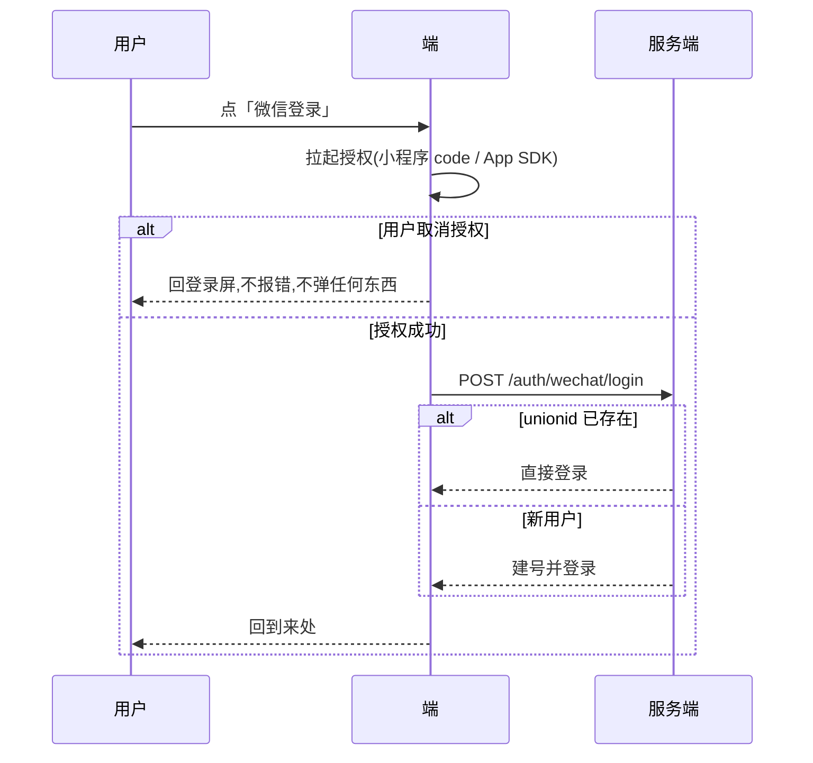

[← 用户侧功能规格](INDEX.md) ｜ [模块 F · 账号与端](../modules/模块F-账号与端.md)

# 登录与账号 · 逐屏规格

> **这份文档回答:用户怎么进来、进不来时屏幕上写什么、两个账号撞在一起时怎么办。**
> 覆盖 `S-LOGIN` `S-ACC` `S-MERGE` 三屏,写到可以直接做 UI 与前后端开发。
>
> **不是**账号模型与合并的产品判断(在 [`模块 F · 账号与端`](../modules/模块F-账号与端.md))、**不是**令牌形态与接口签名
> (在 [`技术架构与接口契约`](../../technical/INDEX.md) §6.1、[`后端系统设计与组件接入`](../../technical/后端系统设计与组件接入.md) §1.6–§1.10)。
> 全局交互约定在 [`用户侧功能规格 · 总纲`](INDEX.md) §二,本文不重复。
>
> **基线:`origin/v1` @ `83b9632`,fetch 于 2026-09-01T14:00Z。**
> **状态:活跃。** 登录通道增删、频控数值变化、合并策略变化,本文同一次改动内更新。

---

## 一、有几种登录,以及为什么不是五种

| # | 方式 | 可用端 | 阶段 | 是不是跨端锚点 | 进不去时的退路 |
|---|---|---|---|---|---|
| 1 | **本机模式(不登录)** | 全部 | 阶段 0 起 | ❌ 只在这台设备 | —— 它本身就是退路 |
| 2 | **手机号 + 短信验证码** | 全部 | 阶段 2 | ✅ **唯一锚点** | 换设备/等频控/回本机模式 |
| 3 | **微信授权** | 小程序 · App | 阶段 2 后 | ❌ 除非绑了手机号 | 转手机号验证码 |
| 4 | **Apple 登录** | iOS · macOS | 🚧 未定 | ❌ 除非绑了手机号 | 见 §十 缺口 `L-1` |

**没有密码。** 没有「注册」按钮、没有「忘记密码」、没有邮箱、没有第三方账号体系(除微信/Apple 这两个端上架必需的)。
理由在 `模块 F · 账号与端` §2.2:**少一个页面是次要的,少一个「我到底注册过没有」的犹豫才是主要的。**

### 1.1 本机模式:它不是「未登录」,是一种正常形态

- 首次打开**不弹登录**,直接进 `S-HOME`。整个阶段 0/1 都可以一次都不登录
- 记录、时间线、盲区、导出、原图管理**全部可用**,数据存在这台设备上
- 只有四件事会把用户带到 `S-LOGIN`:**跨端同一份数据 · AI 代发 · 只读令牌 · 购买**
- 触发登录时**永远是「这一步需要先登录」,不是「请先登录」**;登录成功后**回到原处并自动重试刚才那一步**

🔴 **不允许把本机模式做成「体验版」。** 不加条数上限、不加水印、不加「登录解锁更多」——那会让阶段 0 的判据(自己愿不愿意记)测不出真东西。

---

## 二、`S-LOGIN` 登录屏

### 2.1 进入方式(六个,全部要能返回)

| 入口 | 触发 | 返回后 |
|---|---|---|
| `S-ACC` 的「登录」按钮 | 用户主动 | 回 `S-ACC` |
| `S-EXP` 点「让 AI 代发」 | 能力需要账号 | 回 `S-EXP` 并**自动重试代发** |
| `S-BILL` 点任何档位 | 购买需要账号 | 回 `S-BILL` 并保持所选档位 |
| `S-SET` 点「在另一台设备上也用」 | 跨端需要锚点 | 回 `S-SET` |
| 令牌失效后的任一请求 | `UNAUTHORIZED` | 回触发屏并自动重试一次 |
| 深链 / 扫码进入 | 外部 | 回首页 |

**返回键、左上角关闭、点浮层外部**三者行为一致:退出登录流程,回到来处,**不留半截状态**。

### 2.2 元素清单

| 元素 | 内容 / 取值来源 | 为空或异常时 | 可点 |
|---|---|---|---|
| 标题 | 「登录」 | —— | 否 |
| 副标题 | **说清为什么现在要登录**,由入口决定:「登录后,这台设备和别的设备记的东西会算成同一个人」 | 主动进入时显示通用句 | 否 |
| 手机号输入框 | 用户输入,11 位 | 占位符「手机号」 | 是 |
| 手机号错误提示 | 见 §六 | 隐藏 | 否 |
| 验证码输入框 | 6 位 | **未发送验证码前不显示** | 是 |
| 发送/重发按钮 | 「获取验证码」/「{n}s 后重发」 | 手机号非法时禁用 | 条件 |
| 主按钮 | 「登录」 | 验证码不足 6 位时禁用 | 条件 |
| 微信登录入口 | 图标 + 「微信登录」 | **仅小程序/App 端显示** | 是 |
| 协议勾选 | 「已阅读并同意《用户协议》《隐私政策》」 | **默认不勾选** | 是 |
| 「先不登录,继续用」 | 文本链接 | **常驻,任何时候都在** | 是 |

🔴 **「先不登录,继续用」这一行不许去掉,也不许做成灰色小字。** 它是本机模式的出口,去掉它等于把用户堵在登录屏。

### 2.3 手机号输入交互

| 行为 | 规则 |
|---|---|
| 键盘 | 数字键盘;`inputmode=numeric` `autocomplete=tel` |
| 长度 | 输入到 11 位自动截断,不再接受输入 |
| 校验时机 | **失焦时**校验;输入过程中不报错 |
| 校验规则 | 11 位、以 1 开头。**不做运营商号段校验**——号段会变,判错的代价比放过大 |
| 非法时 | 页内提示「手机号看起来不对」+ 发送按钮保持禁用 |
| 记忆 | 上次登录成功的号码**本机记住并预填**,可清除;换号只需直接改 |

### 2.4 验证码输入交互

| 行为 | 规则 |
|---|---|
| 出现时机 | 点了「获取验证码」且服务端返回成功之后,验证码框**滑入并自动聚焦** |
| 键盘 | 数字键盘;`autocomplete=one-time-code`(iOS/Android 可直接从通知栏填充) |
| 粘贴 | 粘贴 6 位数字 → 自动按位填充 → **自动提交**,不用再点登录 |
| 满 6 位 | **自动提交**,主按钮同时可点(两条路都留着) |
| 倒计时 | 60 秒;倒计时中按钮显示「{n}s 后重发」并禁用 |
| 倒计时来源 | **服务端返回的 `retryAfter` 为准**,不由前端自己算 —— 换设备/杀进程重进不能绕过频控 |
| 输错 | 清空输入框、保持聚焦、页内提示带剩余次数(见 §六) |
| 5 次错 | 锁定,见 §六 `E-07` |

### 2.5 人机验证什么时候出现

`技术架构与接口契约` §6.1 写着频控之外**还要滑块或行为验证**,理由是纯计数挡不住换 IP 刷短信费。产品侧的出现规则:

| 情况 | 是否出现 |
|---|---|
| 同一设备当天第 1 次发送 | ❌ 不出现 |
| 同一设备当天第 3 次起 | ✅ 出现 |
| 服务端返回 `CAPTCHA_REQUIRED` | ✅ 出现(**服务端说了算,前端只是提前挡一道**) |
| 验证失败 | 就地重来,**不消耗发送次数** |

⚠️ **验证组件加载失败时不能把用户卡死**:5 秒未加载出来 → 显示「验证组件没加载出来」+ 重试 + 「换微信登录」。

### 2.6 状态枚举(设计要出全)

| 状态 | 屏幕 |
|---|---|
| `IDLE` | 只有手机号框;发送按钮禁用 |
| `PHONE_OK` | 发送按钮可点 |
| `SENDING` | 发送按钮转圈,文案「发送中」,**其余可点元素不禁用** |
| `SENT` | 验证码框出现并聚焦;倒计时开始 |
| `VERIFYING` | 主按钮转圈;输入框只读 |
| `ERROR_*` | 见 §六;**保留用户已输入的手机号** |
| `LOCKED` | 输入框禁用,展示解锁倒计时与「换微信登录」 |
| `SUCCESS` | 不停留:Toast「已登录」→ 立刻回到来处 |

---

## 三、微信授权(阶段 2 后)

| 规则 | 说明 |
|---|---|
| 拿不到 unionid | **拒绝降级建号**,提示「这个微信还没绑到开放平台,换手机号登录」(`后端系统设计与组件接入` 已有此判断) |
| 微信登录后 | 账号状态是「已登录 · 未绑手机」,**它还不是跨端锚点** |
| 弱提示 | `S-ACC` 顶部一行:「绑定手机号后,换设备也能看到这些记录」。**不弹窗、不拦路、不每次都提** |
| 取消授权 | 静默回到登录屏,**不报错**——用户取消不是错误 |

---

## 四、`S-ACC` 账号屏

| 区块 | 元素 | 未登录时 | 已登录时 |
|---|---|---|---|
| 身份 | 手机号(中间四位打码)/ 微信昵称 | 「当前是本机模式」 | 显示已绑通道 |
| 绑定 | 「绑定手机号」「绑定微信」 | 隐藏 | 未绑的才显示 |
| 设备 | 当前设备名 + 「在别处也登录了 n 台」 | 隐藏 | 显示 |
| 数据 | 「导出我的全部数据」 | ✅ 显示(导本机的) | ✅ 显示 |
| 退出 | 「退出登录」 | 隐藏 | 显示 |
| 注销 | 「注销账号」**次要位置、非红色大按钮** | 隐藏 | 显示 |

- **退出登录**:浮层确认一次 →「退出后这台设备上的记录还在,但不再和别处同步」→ 只吊销当前令牌(`POST /auth/logout`)
- **多设备并存**:不做「把别的设备踢下线」。滑动续期,多端同时在线是正常的(`技术架构与接口契约` §6.1)

---

## 五、`S-MERGE` 账号合并:唯一一处刻意不给退路的地方

**触发**:已登录账号 A 去绑手机号,而该号码已属于账号 B(`PHONE_TAKEN`)。

### 5.1 两屏两步,预览与确认分开

**第一步 · 预览**(`POST /auth/merge/preview`,只读无副作用):

| 元素 | 内容 |
|---|---|
| 标题 | 「这个手机号已经有记录了」 |
| 主信息 | 「另一个账号里有 **{n} 条记录**,最早 {date},最近 {date}」 |
| 变化说明 | 「合并后,这 {n} 条会算进你现在这个账号,碰过的考点从 **{a} 个**变成 **{b} 个**」 |
| 🔴 不可逆声明 | 「**合并之后不能拆开。**」独立一行,不与其他文字混排 |
| 主按钮 | 「合并」 |
| 次按钮 | 「换一个手机号」 |
| 关闭 | 允许,等于放弃绑定 |

**第二步 · 确认**:再一次浮层,只有一句话「合并后不能拆开,继续吗?」+ 「合并」/「再想想」。
`POST /auth/merge/confirm` **必须带预览返回的一次性 token**——预览与确认之间数据变了,就重新预览。

### 5.2 合并后

- Toast「已合并」→ 回到来处;`S-ACC` 顶部显示一次性提示「{n} 条记录已经并进来了」,**下次进入不再显示**
- **时间戳与来源名称原样保留**,不重排、不改写(`模块 F · 账号与端` §2.3)
- 合并**触发覆盖层重算**;重算未完成时盲区屏显示「正在重新算,稍等」而不是旧数字

### 5.3 不做的事

| 不做 | 为什么 |
|---|---|
| 自动合并 | 用户会失去对「我的数据在哪个账号里」的控制 |
| 拆分/回滚 | 拆分需要保留合并前快照 = 一份重复数据,而且拆错比合错更难解释 |
| 合并时让用户挑哪些记录 | 挑选界面本身就是一次「按覆盖度调数据」的入口 |

---

## 六、异常全集

**每一行都要有设计稿。** 「文案」列是**上屏原文**,不是描述。

| # | 触发 | 表现 | 文案 | 用户下一步 | 后端 |
|---|---|---|---|---|---|
| `E-01` | 手机号格式不对 | 页内提示 | 「手机号看起来不对」 | 改 | 不发请求 |
| `E-02` | 未勾协议就点登录 | 页内提示 + 协议行**抖动一次** | 「先勾一下同意协议」 | 勾选 | 不发请求 |
| `E-03` | 60 秒内重复发送 | 按钮禁用 | 「{n}s 后重发」 | 等 | `SMS_TOO_FREQUENT` |
| `E-04` | 单号当天超 10 条 | 受限态 | 「今天这个号发得够多了,明天再试,或者换微信登录」 | 换通道 | `SMS_TOO_FREQUENT` |
| `E-05` | 单 IP 当天超 20 条 | 受限态 | 「这个网络今天发得太多了,换个网络或者明天再试」 | 换网络 | `SMS_TOO_FREQUENT` |
| `E-06` | 验证码错 | 页内提示 + 清空 | 「验证码不对,还能试 {n} 次」 | 重填 | `SMS_CODE_WRONG` |
| `E-07` | 连错 5 次 | 受限态 | 「错太多次了,{n} 分钟后再试」 | 等 / 换微信 | `SMS_LOCKED` |
| `E-08` | 验证码超 5 分钟 | 页内提示 | 「验证码过期了,重新发一条」 | 重发 | `SMS_CODE_EXPIRED` |
| `E-09` | 验证码已用过 | 同 `E-08` | 「这条验证码用过了,重新发一条」 | 重发 | 单次使用 |
| `E-10` | 短信通道故障 | 错误态 | 「短信没能发出去,换微信登录,或者过一会儿再试」 | 换通道 | 5xx |
| `E-11` | 人机验证加载失败 | 错误态 | 「验证组件没加载出来」 | 重试 / 换微信 | —— |
| `E-12` | 人机验证不通过 | 就地重来 | 「再来一次」 | 重试 | **不消耗发送次数** |
| `E-13` | 网络超时 | 错误态 | 「网络没通,验证码没发出去」 | 重试 | —— |
| `E-14` | 登录成功但回跳失败 | 兜底 | —— | 回首页 | 已登录,**不重复登录** |
| `E-15` | 微信授权被取消 | 静默 | 无 | —— | 不发请求 |
| `E-16` | 微信拿不到 unionid | 受限态 | 「这个微信还没绑到开放平台,换手机号登录」 | 换通道 | `WECHAT_UNIONID_MISSING` |
| `E-17` | 微信 state 失效 | 错误态 | 「这次授权超时了,再来一次」 | 重试 | `WECHAT_STATE_INVALID` |
| `E-18` | 绑定的号已属他人 | 浮层 | 见 §五 | 合并/换号 | `PHONE_TAKEN` |
| `E-19` | 预览后数据变了 | 浮层 | 「刚才那份数据变了,重新看一遍」 | 重新预览 | token 失效 |
| `E-20` | 合并执行中断网 | 错误态 | 「合并没走完,再试一次」 | 重试 | **幂等,不会并两次** |
| `E-21` | 令牌过期 | 静默续期 | 无 | 无感 | `POST /auth/refresh` |
| `E-22` | 续期也失败 | 受限态 | 「登录状态过期了,重新登一下」 | 重登 | `UNAUTHORIZED` |
| `E-23` | 账号被封禁 | 受限态 | 「这个账号暂时不能用了」+ 联系方式 | 联系 | 🚧 见 §十 `L-2` |
| `E-24` | 注销后仍持旧令牌 | 受限态 | 「这个账号已经注销了」 | 回本机模式 | 全部令牌已吊销 |
| `E-25` | 系统时间偏差导致令牌异常 | 静默重登一次 | 无 | 无感 | 失败才提示 |

---

## 七、注销与导出

| 步骤 | 屏幕 | 规则 |
|---|---|---|
| 1 | `S-ACC` 点「注销账号」 | 次要样式,不在首屏 |
| 2 | 浮层 | 「注销后,云端的记录会被删掉。**要不要先导出一份?**」+ 「先导出」(主) / 「直接注销」(次) |
| 3 | 点「先导出」 | 走 `S-EXP` 的导出流程,导完回到这一步 |
| 4 | 二次确认 | 输入「注销」两个字才可点(**唯一一处要求打字确认的地方**) |
| 5 | 执行 | `DELETE /account`;**响应必须带导出入口提示**(`1.3.1.3.3`) |
| 6 | 完成 | 回 `S-HOME` 的本机模式;本机数据**默认保留**,另给一个「把这台设备上的也删掉」的入口 |

⚠️ **删除时点(立即硬删 vs 软删 T+7)是未决项**,`技术架构与接口契约` §6.1 已登记。界面文案取决于它:
如果是软删,第 2 步文案必须改成「{n} 天内还能找回」——**在它定下来之前,界面按「立即删除」写,不许写「可找回」**。

---

## 八、接口对照

| 动作 | 端点 | 真源 |
|---|---|---|
| 发验证码 | `POST /auth/sms/send` | `技术架构与接口契约` §6.1 |
| 校验并登录 | `POST /auth/sms/verify` | 同上 |
| 微信登录 | `POST /auth/wechat/login` | 同上 |
| 绑手机 / 绑微信 | `POST /auth/bind/phone` · `/auth/bind/wechat` | 同上 |
| 合并预览 / 执行 | `POST /auth/merge/preview` · `/auth/merge/confirm` | 同上 |
| 续期 / 退出 / 注销 | `POST /auth/refresh` · `/auth/logout` · `DELETE /account` | 同上 |

**产品对响应的要求(不是字段定义,是语义要求):**

1. `sms/send` 失败时要能区分**频控 / 人机验证 / 通道故障**三档 —— 三档的界面表现完全不同
2. `sms/verify` 失败时要带**剩余次数**,否则 `E-06` 的文案写不出来
3. `merge/preview` 要返回**记录条数**与**覆盖度前后值**,否则 §5.1 那两行数字是空的
4. 任何 `UNAUTHORIZED` 都要能让前端区分「从没登录」与「登录过期」——两者副标题不同

---

## 九、这一屏对阶段 0 的贡献是零

阶段 0 要的是自己用两周、每天记两个数(`实施路径` §阶段 0 的验收)。**登录屏一个数都不产生**,它服务阶段 2。
写在这里是因为它迟早要做,不是因为它现在要做。

---

## 十、缺口登记(不裁定,原样交出去)

| # | 缺口 | 为什么卡住 |
|---|---|---|
| `L-1` | **Apple 登录做不做** | 上 App Store 且提供了第三方登录时,Apple 审核要求提供 Apple 登录。而移动端是否上架未定(`多端选型与端矩阵`)。**上架就必须做,不上架就不做** —— 这一条由上架决定,不由登录设计决定 |
| `L-2` | **封禁状态存不存在** | `E-23` 写了界面,但产品从没定过「什么情况下封一个账号」。**没定之前后端不该有这个状态** |
| `L-3` | **注销的删除时点** | 见 §七 ⚠️,`技术架构与接口契约` §6.1 已登记为未决 |
| `L-4` | **本机模式的数据在登录后怎么办** | 用户先用本机模式记了 50 条,然后登录 —— 这 50 条要不要上传?**没定。** 三种可能:自动上传 / 问一次 / 不上传。**这一条最要紧,它决定阶段 1 到阶段 2 的用户会不会丢东西** |

---

## 十一、红线自查

| 检查 | 结果 |
|---|---|
| 界面文案不含 §2.3 禁用词 | ✅ 通篇无 |
| 没有任何字段承载题干 | ✅ 本文只碰手机号、验证码、账号 ID |
| 没有提醒/打卡/成就机制 | ✅ 无 |
| 合并数字只说「有没有、几条、多久前」 | ✅ §5.1 三行都是计数与时间 |
