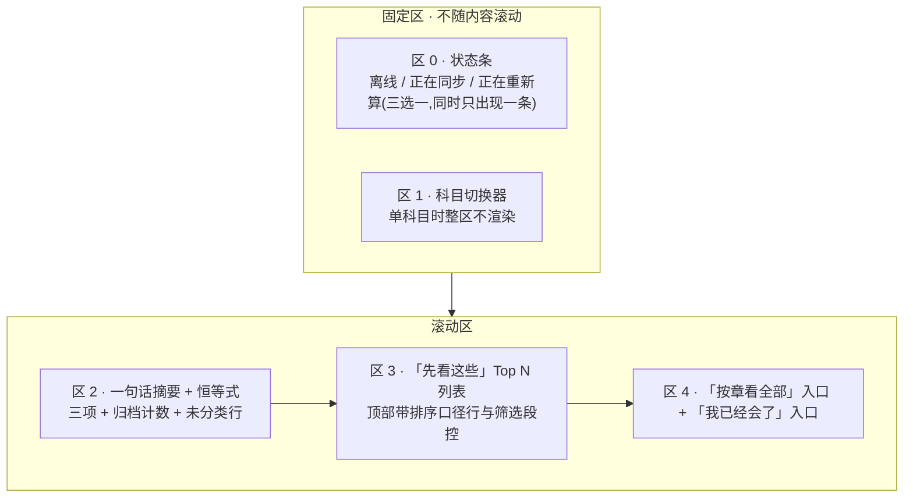
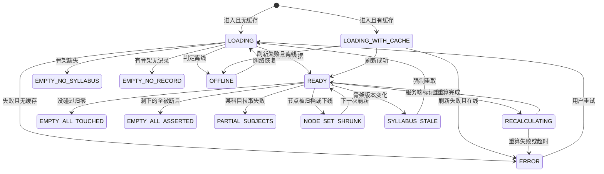
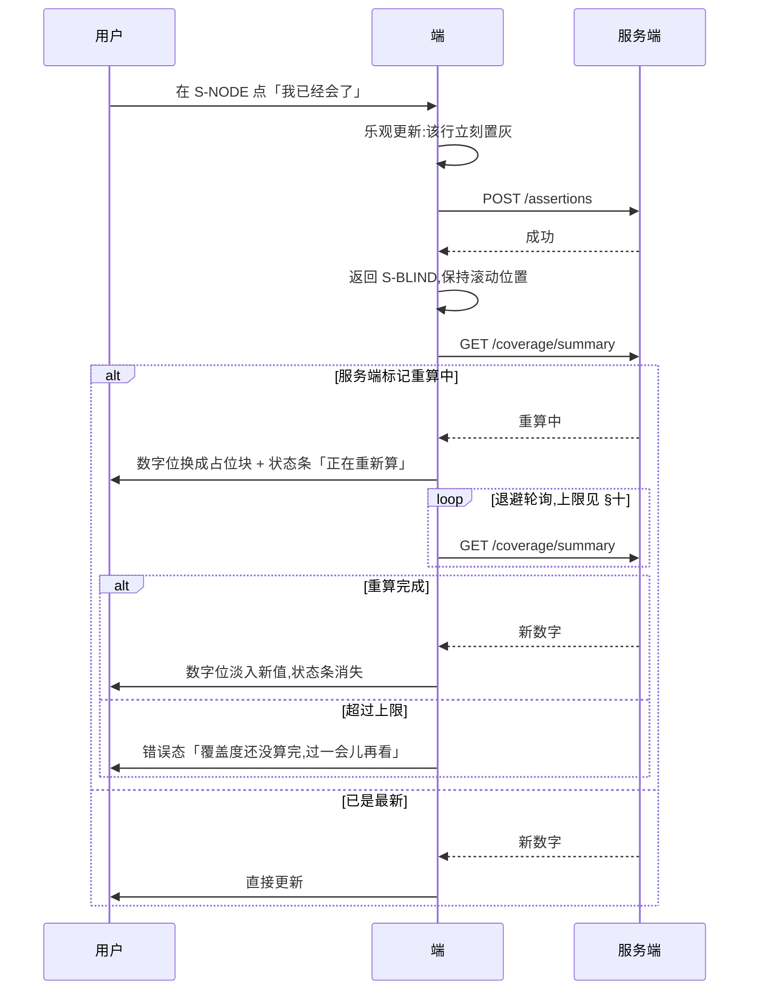
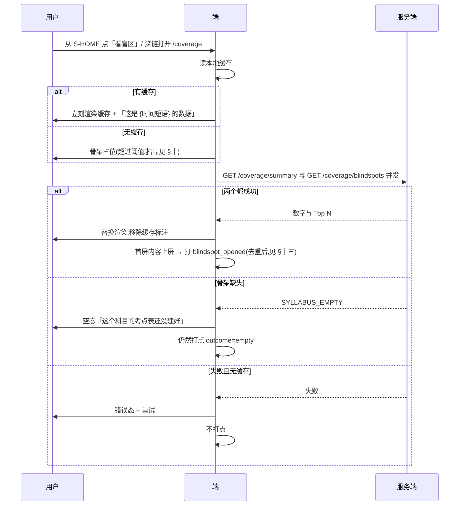
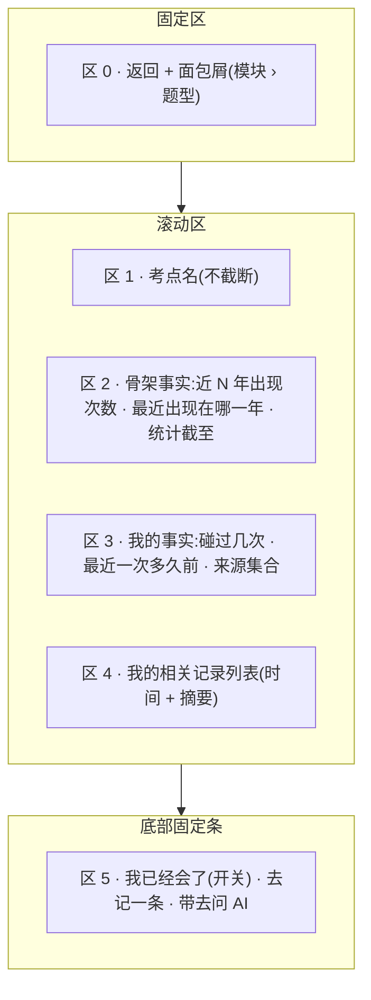
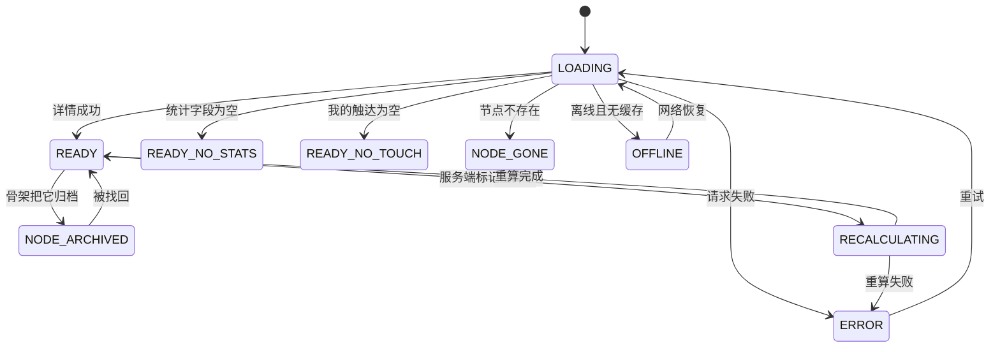
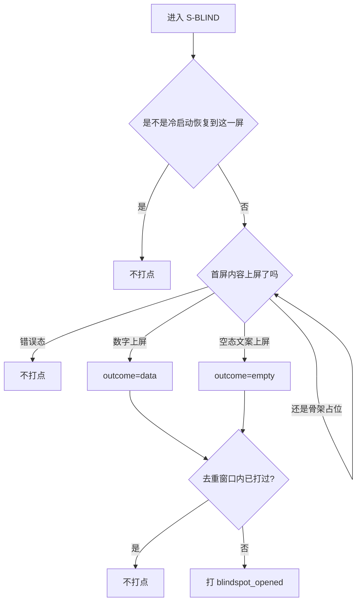

[← 用户侧功能规格](INDEX.md) ｜ [M3 盲区与覆盖度](../modules/M3-盲区与覆盖度/INDEX.md)

# 看盲区 · 逐屏规格

> **这份文档回答:用户点进来之后看到什么,以及为什么这一屏是整个产品的落点。**
> 覆盖 `S-BLIND` `S-NODE` 两屏。**北极星指标就是「主动查看盲区的人数」**,它在这里被打点(`blindspot_opened`)。
>
> **不是**差集怎么算(在 [`M3 盲区与覆盖度`](../modules/M3-盲区与覆盖度/INDEX.md)、[`技术架构与接口契约`](../../technical/INDEX.md) §6.4)、
> **不是**骨架怎么来(在 [`骨架数据采集流水线`](../../data/骨架数据采集流水线.md))。全局约定在 [`总纲`](INDEX.md) §二。
>
> **基线:`origin/v1` @ `15accea`,fetch 于 2026-09-01T15:05Z。**
> **状态:活跃。** 盲区排序口径、断言形态、空态策略变化,本文同一次改动内更新。
>
> **受众=UI 设计与前后端开发;篇幅上限=1300-1400 行;深度档位=详设。**
> 设计拿区块划分、层级、状态枚举、原文文案与朗读文本;前端拿交互细则、禁用条件、边界值、离线行为与多端差异;
> 后端拿接口对照与「产品要求响应能区分到哪一档」。
> **凡是数字(Top N 的 N、近几年、分页大小、缓存时长、超时阈值)本文一律给指针,不写死;本文新提出的端点标 🚧 待技术定稿。**

---

## 一、这一屏只回答三件事

**有没有 · 几次 · 多久前。** 一格都不能多。

| ✅ 屏幕上允许出现 | ❌ 永远不出现 |
|---|---|
| 「近 5 年考过 7 次」 | 「重点考点」「必考」 |
| 「你没碰过」 | 「你不会」「掌握度 30%」 |
| 「你碰过 3 次,最近 6 天前」 | 「建议复习」「该复习了」 |
| 「来源:某网课 · 某讲义」 | 任何题目内容、任何讲解 |

🔴 **不做学科判断**。屏幕上的每一个字要么来自骨架的统计字段,要么来自用户自己的行为记录。
**要不要学、先学哪个,是用户自己的事** —— 产品给的是差集,不是建议。

### 1.1 一句话能不能上屏,只过一道闸

**把这句话拆成「主语 + 谓语 + 数」,谓语只能是这三个之一:有没有 / 几次 / 多久前。** 拆不出来就不能上屏。

| 候选文案 | 拆解 | 结论 |
|---|---|---|
| 「行政处罚的种类,近 5 年 7 次,你没碰过」 | 数 = 骨架统计字段;有没有 = 我的触达 | ✅ 上屏 |
| 「你碰过 3 次,最近一次 6 天前」 | 几次 + 多久前 | ✅ 上屏 |
| 「这几个你该先看」 | 谓语是「该」,不在三件事里 | ❌ 删掉 |
| 「你在行政法上比较薄弱」 | 谓语是学科判断 | ❌ 删掉 |
| 「已经 30 天没碰这个考点了,要不要看看」 | 前半句合法,后半句是建议 | ❌ **只留前半句** |

⚠️ **最后一行是最容易破的一条**:一句合法的陈述后面接半句关心,整句就变成了建议。
**产品的语气到句号为止,不接下一句。**

### 1.2 这两屏在减法的哪一端

**在出口端。** 骨架层给被减数,打标层给减数,差集层做减法,**这两屏是那个差值第一次变成用户能看见的东西**。
所以这两屏的唯一职责是**如实呈现**,不是让差值好看:
任何让覆盖度显得高一点的呈现选择(把未分类并进碰过、把归档藏起来、把断言并进碰过),
在这两屏上都是一次对唯一产出的造假。

---

## 二、`S-BLIND` 盲区总览

### 2.1 屏幕结构

**一屏五区,自上而下。前两区固定,后三区滚动。**



| 区 | 名称 | 固定 / 滚动 | 折叠线以上? | 缺席条件 |
|---|---|---|---|---|
| 0 | 状态条 | **固定**,贴在安全区下沿 | 是 | 在线 + 无重算 + 无同步队列时整条不渲染,**不留空高度** |
| 1 | 科目切换器 | **固定** | 是 | 用户可见科目只有 1 个时整区不渲染 |
| 2 | 摘要区 | 滚动 | **是 —— 必须完整落在折叠线以上** | 从不缺席(骨架缺失时它变成空态文案) |
| 3 | Top N 列表 | 滚动 | 首行必须露出至少一行的一半 | 空态时变成空态卡片 |
| 4 | 出口区 | 滚动 | 否 | 「我已经会了」计数为 0 时该入口隐藏,「按章看全部」常驻 |

🔴 **折叠线以上必须同时看得见「碰过多少」和「没碰过多少」。**
只露出其中一个,用户看到的就不是一次减法,而是一个成绩 —— 那正是这个产品不做的东西。

### 2.2 元素清单

| 区 | 元素 | 取值来源 | 为空时 | 可点吗 | 禁用条件 | 无障碍朗读文本 |
|---|---|---|---|---|---|---|
| 0 | 离线细条 | 端的网络状态 | 在线时不渲染 | 否 | —— | 「离线中,这一屏需要联网才能更新」 |
| 0 | 重算细条 | `GET /coverage/summary` 的重算标志 | 未重算时不渲染 | 否 | —— | 「覆盖度正在重新算,数字暂时不显示」 |
| 1 | 科目切换器 | 🚧 `GET /subjects`(**待技术定稿**,见 §十二) | 单科目不渲染 | 是 | 重算中不禁用;切换请求进行中禁用 | 「科目,当前 {subject},共 {n} 个科目」 |
| 2 | 摘要首句 | `GET /coverage/summary` | 见 §2.6 三种空态 | 否 | —— | 见 §11.2 |
| 2 | 「一共 {total} 个考点」 | summary 的分母 | 骨架缺失时整区变空态 | 否 | —— | 「这个科目一共 {total} 个考点」 |
| 2 | 「你碰过 {touched} 个」 | summary 的分子 | **为 0 也显示**(恒等式项) | 是 → 列表筛选「碰过」 | 重算中禁用且不显示数字 | 「你碰过 {touched} 个考点」 |
| 2 | 「没碰过 {empty} 个」 | `total − touched`,**由服务端算并返回** | **为 0 也显示** | 是 → 筛选「没碰过」 | 同上 | 「你没碰过 {empty} 个考点」 |
| 2 | 断言注脚「其中 {n} 个你标了『已经会了』,没在下面列出来」 | 断言集合计数 | `n = 0` 时整行隐藏 | 是 → 断言列表 | 重算中隐藏 | 「其中 {n} 个你标了已经会了,没有列在下面」 |
| 2 | 归档计数「另有 {a} 个考点已归档」 | summary 的归档计数 | **`a = 0` 也显示**(`R-49`:常驻) | 是 → 归档区 | **永不禁用、永不隐藏** | 「另有 {a} 个考点已归档,可以点开查看」 |
| 2 | 未分类行「另有 {u} 条记录没能对上任何考点」 | 🚧 未分类记录计数(**待技术定稿**) | `u = 0` 时整行隐藏 | 是 → `S-TAG` | 离线且本机无未分类数据时禁用 | 「另有 {u} 条记录没能对上任何考点,没有算进上面两个数,点开去处理」 |
| 3 | 排序口径行「按{口径名}排」 | 当前排序参数 | —— | 是 → 展开口径选择 | 列表加载中、重算中禁用 | 「排序,当前按{口径名}排,点开可以换」 |
| 3 | 筛选段控 | 本地视图状态 | —— | 是 | 列表加载中禁用 | 「筛选,共 4 项,当前选中第 {i} 项 {名称}」 |
| 3 | 列表行 · 考点名 | 骨架树 | 名称缺失 → 该行不渲染,计入 `B-17` | 是 → `S-NODE` | 节点已归档时该行不出现在榜里 | 见 §11.3 整行合读 |
| 3 | 列表行 · 「近 {y} 年 {n} 次」 | 骨架统计字段 | 「这个考点没有出现次数记录」 | 否 | —— | 「近 {y} 年出现 {n} 次」 |
| 3 | 列表行 · 我的状态 | 我的触达 | 四种之一,见 §2.3 | 否 | 重算中该格显示占位 | 「你没碰过」/「你碰过 {n} 次,最近一次{时间短语}」 |
| 3 | 「看更多」 | Top N 之外的内容 | 返回条数 < N 时隐藏 | 是 → 骨架树并预置当前筛选 | 骨架缺失时不渲染 | 「看更多,会打开按章排列的全部考点」 |
| 4 | 「按章看全部」 | —— | **常驻,任何态下都在** | 是 | 骨架缺失时禁用并就地给理由 | 「按章看全部考点」 |
| 4 | 「我已经会了({n})」 | 断言集合 | `n = 0` 时隐藏 | 是 | 重算中禁用 | 「我已经会了,{n} 个考点」 |

🔴 **`total`、`touched`、`empty` 三个数一律由服务端给,前端不做任何一次减法。**
前端自算的那一刻,同一个数就有了两个来源,而这两个来源在缓存、分页、筛选之后必然分叉 —— 见 `B-33`。

### 2.3 每一行长什么样

```
行政处罚的种类                     近 5 年 7 次
你没碰过                                    →
```

- 左上:考点名(**最多两行**,超出尾部省略;完整名称进无障碍朗读文本与长按提示)
- 右上:出现次数,**这是骨架的统计字段,不是评价**
- 左下:我的状态,四种之一:
  `你没碰过` / `你碰过 {n} 次,{时间短语}` / `你标了「已经会了」` / `这个考点没有出现次数记录`(仅当右上为空时占位)
- 右下:进入箭头。**整行是一个点击目标**,箭头不是独立热区
- 点整行 → `S-NODE`

**一行里不许出现第五种信息。** 尤其不许出现:标签色块以外的图形、任何百分比、任何进度条、任何相对他人的位置。

### 2.4 断言:「我已经会了」与「我卡住了」

| 断言 | 用户从哪点 | 效果 | 端点 |
|---|---|---|---|
| **我已经会了** | `S-NODE` 内 | 该考点**从盲区榜排除**,但**仍计入「没碰过」的概览计数**(单列不并入) | `POST /assertions` |
| 取消断言 | 同上 | 回到榜里 | `DELETE /assertions` |
| **我卡住了**(反向断言) | 🚧 **界面还没有** | —— | 见 §六 缺口 `B-1` |

⚠️ **概览与榜单口径不一致是已知的**(`技术架构与接口契约` §6.4 `R-100`):
声明 3 个已会之后,概览仍说「没碰过 10 个」,而榜里只列得出 7 个。
**屏幕上必须解释这一句**:概览数字下方小字「其中 {n} 个你标了『已经会了』,没在下面列出来」。**不解释就是产品在自相矛盾**。

**断言是「没碰过」的子集,不是第三格。** 它没有自己的恒等式项,只有一行注脚。
做成第三格会让用户读成「我有三类考点」,而他实际只有两类,其中一类里有一部分他自己打了个记号。

### 2.5 状态枚举

**十三态,设计要出全。** 带 🔵 的四态是这个产品特有的,别的产品的状态清单里不会有。

| 态 | 进入条件 | 屏幕上是什么 | 数字显示吗 |
|---|---|---|---|
| `LOADING` | 首屏请求未回且无缓存 | 摘要一行 + 5 行列表形状的骨架占位,**不转圈** | ❌ |
| `LOADING_WITH_CACHE` | 首屏请求未回但有缓存 | 直接渲染缓存内容 + 缓存时间标注 | ✅ **标为缓存值** |
| `READY` | 请求成功且有数据 | 完整五区 | ✅ |
| `EMPTY_NO_SYLLABUS` | 骨架缺失(`SYLLABUS_EMPTY`) | 空态,只给「去记一条」 | ❌ 一个数都不显示 |
| `EMPTY_NO_RECORD` | 骨架有,我一条记录都没有 | 空态 + 两个入口 | ✅ 显示 `total` 与「碰过 0」 |
| `EMPTY_ALL_TOUCHED` | 没碰过 = 0 | 摘要正常 + 榜位换成一句话 | ✅ |
| `EMPTY_ALL_ASSERTED` | 没碰过 > 0 但全被断言 | 摘要正常 + 榜位换成一句话 | ✅ |
| 🔵 `RECALCULATING` | 覆盖层重算中 | **摘要的数字位变成占位块** + 状态条 | ❌ **不显示任何旧数字** |
| 🔵 `SYLLABUS_STALE` | 骨架版本比缓存新,节点对不上 | 强制刷新一次;刷新前不渲染列表 | ❌ |
| 🔵 `PARTIAL_SUBJECTS` | 多科目下部分科目拉到、部分失败 | 成功的科目正常渲染,失败的在切换器里标「没拉到」 | ✅ 只显示成功那些 |
| 🔵 `NODE_SET_SHRUNK` | 刷新后节点数变少(归档 / 下线) | 正常渲染新数字 + 归档计数变化可见 | ✅ |
| `ERROR` | 请求失败且无缓存 | 错误态 + 重试 | ❌ |
| `OFFLINE` | 端判定离线 | 见 §八 | 有缓存才显示,且标为缓存值 |



🔴 **`RECALCULATING` 与 `LOADING_WITH_CACHE` 的区别是这一屏最要紧的一条:**
缓存态显示的是「一个曾经正确的数」,重算态里根本不存在一个正确的数 —— 旧值已经被用户自己的动作否定了。
**所以缓存态显示数字并标注时间,重算态一个数都不显示。** 把重算态做成「显示旧值 + 小字提示」,
用户会拿那个数去做判断,而那个数已经错了。

### 2.6 三种空态,文案完全不同

| 情况 | 主文案 | 副文案 | 给什么入口 |
|---|---|---|---|
| **骨架没建好** | 「这个科目的考点表还没建好」 | 「建好之前,这里没有可以减的东西」 | 只给「去记一条」——**不给等待提示、不给进度条、不给「预计 x 天」** |
| **骨架有,但一条记录都没有** | 「你还没记过东西,所以现在整张表都是没碰过」 | 「一共 {total} 个考点」 | 「记一条」(主) · 「先看看有哪些考点」(次,进骨架树) |
| **全部碰过** | 「这个科目的考点你都碰过至少一次」 | 「碰过 {total} 个,没碰过 0 个」 | 「按最久没碰排一遍」 |

**第四种情况不是空态,是一句话:** 没碰过 > 0 但全部被断言 → 榜位显示
「都标成会了。要看全部,去掉几个标记就行」+ 「去看我标了会的」(见 `B-09`)。
它不是空态,因为摘要区的数字全都在,空的只有榜。

⚠️ **三种空态的差别必须在第一句话里就分开。**
写成同一句「暂无数据」,用户没办法知道该去记一条、还是等骨架、还是这一屏本来就没东西给他。

### 2.7 数字的口径与呈现规范

**这一节是这一屏的核心。屏幕上每一个数在这里都有定义、有边界、有为空时的写法。**

#### 2.7.1 两个平面,两个恒等式,一条禁止跨平面相加的红线

「碰过 / 没碰过 / 未分类」**不在同一个平面上**,把它们摆成一行三格是错的。

| 平面 | 恒等式 | 单位 | 谁给 |
|---|---|---|---|
| **考点平面** | `碰过 + 没碰过 = 考点总数` | 个(节点) | `GET /coverage/summary`,三项都由服务端返回 |
| **记录平面** | `已挂上考点的记录 + 未分类记录 = 我的记录总数` | 条(记录) | 🚧 未分类计数待技术定稿 |

- **考点总数** = 该科目**未归档**的最底层节点数(层级定义在 `技术架构与接口契约` §6.4)。归档节点同时退出分子与分母,**它在总数之外单列**。
- **碰过** = 该节点上有 ≥1 条**已确认且未丢弃**的标签。
- **没碰过** = 考点总数 − 碰过。断言「已经会了」的节点是它的**子集**,不减出去。
- **未分类** = 我的记录里**没有任何已确认标签**的那些(含 `没对上` / `待确认` / `待补` / `全部被丢弃` 四种,状态定义在 [`打标与未分类`](打标与未分类.md) §二)。

🔴 **未分类不许并进任何一边,理由是两条不同的错:**

| 并进哪边 | 错在哪 |
|---|---|
| 并进「碰过」 | 拿记录数冒充覆盖(`M3 盲区与覆盖度` §2.2 第一条)。用户记了 100 条全对不上,覆盖度会显示他碰过 100 个考点 |
| 并进「没碰过」 | 把一条不知道属于哪儿的记录,算成某个具体考点的盲区。**盲区会凭空多出内容**,而这些内容指不到任何一个考点 |
| 藏起来不显示 | 丢弃率被藏掉,覆盖度看起来比实际可信。**丢弃率高是设计,藏起来才是失真** |

**界面落法:** 未分类那一行**独占一行、有自己的前缀「另有」、有自己的入口**,
排版上与考点平面的两个数之间有一条分隔线,**不使用同一种字号与字重**。

#### 2.7.2 「碰过 {n} 次」怎么计数

| 问题 | 口径 | 理由 |
|---|---|---|
| n 数的是什么 | **命中该考点的记录条数**,去重到记录 | 一条记录不可能对同一考点挂两次(`打标与未分类` `T-07` 就地拦住) |
| 同一天记了 3 条都挂到这个考点 | **算 3 次** | 按天折叠就是产品在替用户判断「一天之内的重复不算数」,那是学科判断 |
| 未确认的标签 | **不算** | 未确认不计覆盖度(`M3 盲区与覆盖度` §2.2) |
| 已丢弃的标签 | **不算** | 同上;但记录本身仍在时间线上可见 |
| 手动挂载的 | **算** | 手动挂载写的是已确认标签 |
| 记录被删了 | **不算** | 删记录级联删标签并触发重算(`技术架构与接口契约` §6.2) |
| 归档节点上的触达 | **不算进任何数** | 归档同时退出分子与分母 |
| n 的上限显示 | 见 §2.9 数值格式 | —— |

**`n = 0` 时不写「碰过 0 次」,写「你没碰过」。** 这两句话在中文里的信息量不一样:
前者暗示有一个计数器在跑,后者是一个事实。

#### 2.7.3 「最近一次 {n} 天前」的时区与边界

| 项 | 口径 |
|---|---|
| 记录时间怎么存 | ISO-8601 **带时区**(`技术架构与接口契约` §六 统一约定) |
| 天数怎么算 | **按设备当前时区**,取两个日历日之差,**不是 24 小时之差** |
| 今天记的 | 差 = 0 → 文案 **「今天」**,不是「0 天前」 |
| 昨天记的 | 差 = 1 → 文案 **「昨天」**,不是「1 天前」 |
| 2 天到 364 天 | 「{n} 天前」 |
| ≥ 365 天 | 「超过一年前」,**不继续报天数** |
| 用户飞了一个时区 | **用新时区重算**,数字可能变一天。不锁定记录时的时区 —— 用户对「今天」的感知跟着他的所在地走 |
| 设备时钟早于记录时间 | 差为负 → 见 `B-46`,显示「今天」,**不向用户报告任何异常** |

🔴 **不出现「已经 {n} 天没碰了」这种写法。** 「没碰了」带着一个期待值(你本该碰),而产品没有期待值。
写「最近一次 {n} 天前」,句号。

#### 2.7.4 骨架统计字段:「近 5 年考了 {n} 次」

| 项 | 口径 |
|---|---|
| 来源 | `GET /syllabus/nodes/{id}` 与 `GET /coverage/blindspots` 返回的骨架统计字段(四统计,`技术架构与接口契约` §6.4) |
| 「近 5 年」这个窗口谁定 | **骨架数据本身**,不是这一屏。窗口变了本文的文案要跟着变 —— 见 §六 `B-4`,真源 [`骨架数据采集流水线`](../../data/骨架数据采集流水线.md) |
| 窗口怎么上屏 | **文案里的年数从响应里取,不在前端硬编码。** 响应说 3 年就写「近 3 年」 |
| 统计截止时间 | 响应要带统计截止标识;摘要区下方一行小字「出现次数统计截至 {year} 年」 |
| 过期判定 | 统计截止年 < 当前自然年 − 1 → 那行小字追加「(还没更新到最近一年)」。**不弹窗、不拦路、不影响排序** |
| 字段缺失 | 该考点显示「这个考点没有出现次数记录」;**在出现次数口径下沉到末尾的独立分组**,见 `B-27` |
| 统计重算周期 | **未定** —— `骨架层` 缺口 `A-2`。屏幕侧的落点见 §六 `B-6` |

#### 2.7.5 覆盖层重算:触发时机、重算中显示什么、失败怎么办

**触发时机(任一发生即进入重算):**

| 触发 | 来源 |
|---|---|
| 删一条记录 | `DELETE /records/{id}` 级联删标签 |
| 确认 / 丢弃一个标签 | `POST /records/{id}/tags/{tagId}/confirm` · `/discard` |
| 手动挂载一个标签 | `POST /records/{id}/tags` |
| 账号合并完成 | `POST /auth/merge/confirm`([`登录与账号`](登录与账号.md) §5.2) |
| 骨架版本更新(节点增删、归档、找回) | 骨架侧动作,用户不感知触发点 |
| 离线队列补传落地 | 补传的记录带标签时 |



**重算中屏幕上的逐项规定:**

| 元素 | 重算中显示什么 |
|---|---|
| 「一共 {total} 个考点」 | 🔴 **占位块**,不显示旧值 |
| 「你碰过 / 没碰过 {n} 个」 | 🔴 **占位块**,不显示旧值 |
| 断言注脚 | 隐藏 |
| 归档计数 | 🔴 **照常显示**(`R-49` 要求常驻;它不参与这次重算) |
| 未分类行 | 照常显示 —— 它在记录平面 |
| Top N 列表 | **保留旧列表**,顶部加一行「下面这份是重算前的」;**每行的「近 {y} 年 {n} 次」照常显示**(骨架字段不受影响),**每行的「你碰过 {n} 次」变占位** |
| 列表行是否可点 | **可点** —— 进 `S-NODE` 看骨架字段是有意义的 |
| 排序与筛选 | **禁用** —— 排序依赖的正是在重算的那些数 |
| 下拉刷新 | 可用,等于提前轮询一次 |

🔴 **「不显示旧数字」这条不许打折。** 常见的三种打折都是违规:
① 显示旧值加删除线;② 显示旧值调低透明度;③ 显示旧值加「可能不准」小字。
**三种都是把一个已知错误的数放在用户眼前,而它长得和正确的数一模一样。**

**重算失败:** 错误态,文案「覆盖度还没算完」+ 「再试一次」。**不回退到旧数字,不显示任何数字。**
失败不影响列表区的骨架字段,列表继续可看可点。

#### 2.7.6 数字为 0、为空、骨架未建好 —— 三种写法

| 情况 | 屏幕上 | 为什么这样写 |
|---|---|---|
| **数字是 0** | 恒等式的项(`total` / 碰过 / 没碰过 / 归档计数)**照常显示 0**;非恒等式的附加行(断言注脚、未分类行、「看更多」)**整行隐藏** | 恒等式少一项就加不起来,用户会以为产品算错了;附加行显示 0 是噪音 |
| **字段为空**(服务端没给这个数) | 显示该项的**缺失文案**,不显示 0。例:「这个考点没有出现次数记录」 | 0 是「数过了,是零」;空是「没数过」。**混成一个数就是在编数据** |
| **骨架未建好** | 整屏进 `EMPTY_NO_SYLLABUS`,**一个数都不显示**,连 `total = 0` 都不写 | 骨架没建好时「一共 0 个考点」是假的 —— 真实情况是这个科目的考点表还不存在 |

### 2.8 排序与筛选规格

#### 2.8.1 排序口径

**每一个口径都必须是可解释的客观计数或时间戳。** 一个说不出计算方式的排序就是产品在做学科判断。

| 口径 | 屏幕上的名字 | 定义 | 为什么它是客观计数 | 数据来源 |
|---|---|---|---|---|
| `recent5y_count` | 「按近 5 年出现次数排」 | 骨架统计字段降序 | 它数的是真题里出现过几次,与用户无关、与模型无关 | 骨架统计字段 |
| `last_touch_asc` | 「按最久没碰排」 | 我的最近触达时间升序;**没碰过的排在最前** | 时间戳比较,没有权重 | 我的触达 |
| `my_touch_count_asc` | 「按我碰得最少排」 | 我的触达次数升序 | 计数比较 | 我的触达 |
| `node_order` | 「按考点表的顺序排」 | 骨架树里的自然序 | 完全不排序的排序,原样呈现骨架 | 骨架树 |

**默认口径 = `recent5y_count`。** 默认值的真源是 `GET /coverage/blindspots` 的 `orderBy` 默认值
(`技术架构与接口契约` §6.4),**前端不硬编码**;服务端没返回时才退到本地默认,并在 §六 登记为一次偏离。

🚫 **不提供的口径:** 「推荐」「智能排序」「重要度」「优先级」「按提分效率」。
它们要么需要一个产品算不出来的权重,要么需要一次学科判断。**列表里也不出现「推荐」两个字。**

**排序口径写在屏幕上,而且可切换。** 列表顶部一行:「按{口径名}排」+ 一个下拉指示。
⚠️ **排序口径必须可见。** 一个不说明排序依据的「推荐列表」会被读成产品在做学科判断。

#### 2.8.2 排序稳定性

**同值时的次级排序是写死的三级链,任何端、任何一次请求都必须给出同一个顺序:**

| 级 | 键 | 方向 |
|---|---|---|
| 1 | 当前口径 | 口径定义的方向 |
| 2 | 节点在骨架树里的自然序 | 升序 |
| 3 | 节点标识 | 字典序升序 |

🔴 **禁止随机、禁止「每次打散」、禁止按最近更新时间兜底。**
理由不是美观:用户会用「昨天在第 3 位的那个」来定位一个考点,顺序一变他会以为数据变了。
**可复现是这一屏的正确性的一部分。**

`last_touch_asc` 口径下「没碰过」的节点没有触达时间,**统一排在最前**,组内按级 2、级 3 排。
屏幕上分组标题写「没碰过的」与「碰过的」,**不合成一段连续列表** —— 合起来会让人以为「没碰过」等于「碰过但很久没碰」。

#### 2.8.3 筛选

**筛选是单选段控,四选一。不做多选。**

| 筛选项 | 含义 | 组合规则 |
|---|---|---|
| 全部 | 该科目全部未归档叶子节点 | 默认 |
| 没碰过 | 碰过次数 = 0 | 与「碰过」互斥 |
| 碰过 | 碰过次数 ≥ 1 | 与「没碰过」互斥 |
| 我标了已经会了 | 断言集合 | 它是「没碰过」的子集,单独一项 |

**为什么不做多选:** 「碰过 + 没碰过」= 全部,「没碰过 + 已经会了」= 没碰过。
**任何两项的并集要么等于第三项、要么等于全部** —— 多选控件在这里只能生产冗余状态。

**独立于段控的一个开关:** 「只看有出现次数记录的」。
它切掉的是 `B-27` 那类统计字段缺失的节点,**默认关**(默认如实呈现全部)。

**未分类不是筛选项。** 它在记录平面,入口在摘要区,落点是 `S-TAG`。
把它做成这里的第五个段,就等于把它并进了考点平面。

#### 2.8.4 筛选后为空的文案

| 组合 | 文案 | 入口 |
|---|---|---|
| 筛「没碰过」为空 | 「这个科目的考点你都碰过至少一次」 | 「按最久没碰排一遍」 |
| 筛「碰过」为空 | 「你还没碰过这个科目的任何考点」 | 「记一条」 |
| 筛「我标了已经会了」为空 | 「你还没标过『已经会了』」 | 「按章看全部」 |
| 筛「没碰过」且全被断言 | 「没碰过的都标成会了。要看全部,去掉几个标记就行」 | 「去看我标了会的」 |
| 开了「只看有出现次数记录的」后为空 | 「这个科目的考点还没有出现次数记录」 | 关掉这个开关 |

### 2.9 边界值与输入约束

| 项 | 规则 | 真源 / 依据 |
|---|---|---|
| Top N 的 N | **服务端定,前端不硬编码**;`GET /coverage/blindspots` 的 `top` 参数 | `技术架构与接口契约` §6.4 |
| Top N 是否分页 | **不分页。** 超出 N 的内容一律走「按章看全部」 | 分页会让「先看这些」变成一份无限榜,而它的语义是一份短清单 |
| 骨架树分页 | **不分页,不懒加载**,单模块整棵树一次返回 | `技术架构与接口契约` §6.4 |
| 树的层级 | 三层:模块 → 题型 → 考点。**分母只数第 3 层** | `骨架层` §2.4 |
| 服务端返回了第 4 层 | 界面**把第 4 层当叶子渲染**,不新增可展开层级;**分母仍以服务端 summary 为准,前端永不自算** | 见 §六 `B-11` |
| 单科目考点数极大 | 列表行数超过虚拟滚动阈值(§十)时开虚拟滚动;树的可见节点数超阈值时逐层虚拟化 | 阈值见 §十,**实测数缺席**,见 §六 `B-3` |
| 考点名长度 | 列表行最多两行截断;`S-NODE` 标题**不截断**,最多四行后省略;完整名进朗读文本与长按提示 | —— |
| 章节路径长度 | 面包屑超宽时**中间省略**,保留首段与末段 | 末段是当前位置,省掉它面包屑就没用了 |
| 多科目切换缓存 | 按科目缓存最近一次成功响应 + 取回时刻;**最多缓存 3 个科目,LRU 淘汰**;缓存时长真源见 §八 | 3 是产品给的上界:同时准备三门以上的用户,`骨架层` §2.5 的「只做一个科目」还没走到 |
| 数值千分位 | 考点数、记录数 ≥ 1000 时用千分位;**次数与天数不用千分位** | 次数与天数在这个产品里不会到四位,用了反而像金额 |
| 次数上限显示 | 「近 {y} 年 {n} 次」与「你碰过 {n} 次」超过 999 显示 **「999+」** | —— |
| 天数上限显示 | ≥ 365 显示「超过一年前」 | §2.7.3 |
| 百分比 | 🔴 **任何位置都不出现** | §四 |

### 2.10 逐步骤交互细则

#### 2.10.1 进入这一屏



| 细则 | 规则 |
|---|---|
| 两个请求的关系 | **并发发出,谁先回谁先渲染**。摘要区不等列表,列表不等摘要 |
| 只有一个成功 | 成功的那半正常渲染,失败的那半单独出错误块 + 局部重试,**不整屏报错** |
| 首次进入的科目 | 用上次停留的科目;没有上次记录时用服务端返回的第一个 |
| 滚动位置 | 首次进入置顶;从 `S-NODE` 返回时**恢复到离开时的滚动位置与展开态** |
| 打点时机 | **首屏内容(数字或空态文案)真正上屏之后**,不是路由进入时 —— 理由见 §13.2 |

#### 2.10.2 切科目

| 步骤 | 行为 |
|---|---|
| 点切换器 | 展开科目列表(≤5 个用段控,>5 个用浮层列表) |
| 选中一个 | 立刻切换标题;**该科目有缓存 → 立刻渲染缓存并标时间**;同时发请求 |
| 请求中 | 数字位保持缓存值并标注;**排序与筛选沿用上一个科目的选择** |
| 请求失败 | 该科目进错误态;**切换器停在新科目上,不自动跳回** —— 自动跳回会让用户以为自己没点中 |
| 部分科目失败 | 进 `PARTIAL_SUBJECTS`,失败的科目在列表里标「没拉到」,可单独重试 |
| 切换是否重新打点 | 🔴 **不重新打点。** 去重窗口按身份 + 自然日,与科目无关 —— 否则切科目就能刷北极星 |

#### 2.10.3 切排序口径

| 步骤 | 行为 |
|---|---|
| 点排序行 | 展开四个口径 + 每个口径下方一行定义(§2.8.1 的「定义」列原文上屏) |
| 选中 | 列表区进局部加载(**摘要区不动**);请求 `GET /coverage/blindspots?orderBy=` |
| 成功 | 列表整体替换,**滚动回列表顶部**(顺序变了,保持滚动位置没有意义) |
| 失败 | 保留原列表 + 页内提示;口径**回退到切换前那一个**,并把回退这件事写在提示里 |
| 重算中 | 排序入口禁用,禁用理由就地写出:「正在重新算,算完就能换」 |
| 记忆 | 口径按科目记忆在本机,下次进入沿用 |

#### 2.10.4 筛选

| 步骤 | 行为 |
|---|---|
| 点段控 | 立刻切换选中态;**本地筛选优先**(数据已在内存时不发请求) |
| 需要请求时 | 列表区局部加载,摘要区不动 |
| 筛选后为空 | 见 §2.8.4,**空态卡片替换列表,段控保持可见可点** |
| 筛选与排序的关系 | 正交,互不重置 |
| 记忆 | **不记忆** —— 筛选是一次查看动作,记忆会让用户下次进来看到一份被筛过的清单却不知道 |

#### 2.10.5 展开树 · 下钻 · 返回

| 动作 | 行为 |
|---|---|
| 点「按章看全部」 | 进骨架树(见 §四),带上当前科目与当前筛选 |
| 点列表行 / 树叶子 | 进 `S-NODE`,URL 是 `coverage.node`(`多端选型与端矩阵` §4.6.2) |
| 返回 | 回 `S-BLIND`,**保持滚动位置、展开态、排序口径、筛选选择** |
| 返回时数据变了 | 若期间发生过重算 → 回来时静默重取一次;数字位在重取完成前按 §2.7.5 处理 |
| 返回是否重新打点 | 🔴 **不打点** |

#### 2.10.6 下拉刷新与重算触发

| 动作 | 行为 |
|---|---|
| 下拉刷新 | 强制重取摘要 + 列表,**忽略缓存**;下拉阈值与回弹按端的系统惯例 |
| 刷新中 | 顶部出现进度指示;**已有数字保持显示**(它们仍是上一次的正确值,不是被否定的值) |
| 刷新失败 | 保留原有内容 + Toast「没刷新上」;**不清屏** |
| 刷新命中重算中 | 进 `RECALCULATING`,数字位立刻变占位块 |
| 在别的屏做了会触发重算的动作 | 回到这一屏时**必定重取一次**,不吃缓存 |
| 轮询 | 重算中按退避轮询,间隔与上限见 §十;**上限到了转错误态,不无限轮询** |

### 2.11 「先看这些」这个标题为什么不叫别的

| 候选标题 | 结论 |
|---|---|
| 「先看这些」 | ✅ 采用。它说的是**位置**(这份清单在前面),不是**判断**(这些更重要) |
| 「推荐考点」 | ❌ 推荐是判断 |
| 「重点考点」 | ❌ 学科判断,§一 明令 |
| 「盲区 Top 20」 | ❌ 榜单语气,且把 N 写死在文案里 |
| 「你还没碰过的」 | ⚠️ 语义对,但筛「碰过」之后这个标题就错了 —— **标题不随筛选变,所以不能用状态做标题** |

### 2.12 这一屏所有可点元素与它们的去处

**这张表给前端做路由、给设计做点击态用,它必须与 §2.2 的「可点吗」列逐行对得上。**

| 可点元素 | 去处 | 带过去什么 | 回来时 |
|---|---|---|---|
| 科目切换器 | 就地展开 | —— | —— |
| 「你碰过 {n} 个」 | 就地筛选到「碰过」 | —— | —— |
| 「没碰过 {n} 个」 | 就地筛选到「没碰过」 | —— | —— |
| 断言注脚 | 就地筛选到「我标了已经会了」 | —— | —— |
| 归档计数 | 骨架树的归档区 | 当前科目 | 回到 `S-BLIND` 顶部 |
| 未分类行 | `S-TAG` | 当前科目 | 回来必定重取一次 |
| 排序口径行 | 就地展开 | —— | —— |
| 列表行 | `S-NODE` | 节点标识 | 保持滚动位置与展开态 |
| 「看更多」 | 骨架树 | 当前科目 + 当前筛选 | 保持展开态 |
| 「按章看全部」 | 骨架树 | 当前科目 + 当前筛选 | 同上 |
| 「我已经会了({n})」 | 就地筛选到断言集合 | —— | —— |

---

## 三、`S-NODE` 考点详情

### 3.1 屏幕结构



| 区 | 固定 / 滚动 | 折叠线以上 | 说明 |
|---|---|---|---|
| 0 | 固定 | 是 | 面包屑只到题型层,**不重复考点名** |
| 1 | 滚动 | 是 | 名称最长四行,超出省略 |
| 2 | 滚动 | 是 | **骨架事实与我的事实必须分区**,不混排 |
| 3 | 滚动 | 是 | 同上 |
| 4 | 滚动 | 否 | 长列表,超过阈值虚拟滚动 |
| 5 | **固定** | —— | 三个动作,永远够得着 |

🔴 **区 2 与区 3 分开是硬性的。** 「近 5 年考了 7 次」是关于真题的,「你碰过 3 次」是关于用户的。
混排成一段话,用户会把两个数放在一起做比较,而**这两个数之间没有任何可比较的关系** ——
产品一旦让人以为它们可比,下一步就有人问「7 次里我碰了 3 次,那我覆盖了多少」,那是一个不存在的比值。

### 3.2 元素清单

| 区 | 元素 | 取值来源 | 为空时 | 可点吗 | 禁用条件 | 无障碍朗读文本 |
|---|---|---|---|---|---|---|
| 0 | 返回 | —— | —— | 是 | **永不禁用** | 「返回盲区总览」 |
| 0 | 面包屑 | 骨架树路径 | 路径缺失 → 只显示科目名 | 是 → 树的该层 | 骨架缺失时禁用 | 「所在位置,{模块},{题型}」 |
| 1 | 考点名 | 骨架树 | 名称缺失 → 见 `B-17` | 否 | —— | 「考点,{全名}」 |
| 2 | 「近 {y} 年出现 {n} 次」 | 骨架统计字段 | 「这个考点没有出现次数记录」 | 否 | —— | 「近 {y} 年,这个考点在真题里出现过 {n} 次」 |
| 2 | 「最近一次出现在 {year} 年」 | 骨架统计字段 | **整行隐藏** | 否 | —— | 「最近一次出现在 {year} 年」 |
| 2 | 「出现次数统计截至 {year} 年」 | 骨架统计截止标识 | 整行隐藏 | 否 | —— | 「出现次数统计截至 {year} 年」 |
| 3 | 「你碰过 {n} 次」 | 我的触达计数 | 「你没碰过」 | 否 | 重算中变占位块 | 「你碰过 {n} 次」/「你没碰过这个考点」 |
| 3 | 「最近一次{时间短语}」 | 我的最近触达 | **整行隐藏** | 否 | 同上 | 「最近一次是{时间短语}」 |
| 3 | 来源集合 | 我的记录里的来源名称 | **整行隐藏** | 🔴 **否** | —— | 「来源,{名称一},{名称二}」 |
| 4 | 记录列表行:时间 + 摘要 | 挂在这个考点上的记录 | 「没有相关记录」 | 是 → `S-TL` 该条详情 | 记录已删时该行不渲染 | 「{时间短语}的一条记录,{摘要}」 |
| 4 | 「把记录挂到这个考点」 | —— | 常驻 | 是 → `S-TAG` | 骨架缺失、节点已归档时禁用 | 「把一条记录挂到这个考点」 |
| 5 | 「我已经会了」开关 | 断言状态 | 未断言 = 关 | 是 | **重算中不禁用**(断言是写,不依赖那个数);节点已归档时禁用 | 「我已经会了,开关,当前{已打开/未打开}」 |
| 5 | 「去记一条」 | —— | 常驻 | 是 | **永不禁用**(记录动作永不失败,`1.3.7.1`) | 「去记一条」 |
| 5 | 「把这个考点带去问 AI」 | —— | 常驻 | 是 → [导出与问AI](导出与问AI.md) | 骨架缺失时禁用 | 「把这个考点带去问 AI」 |

🔴 **这一屏没有讲解字段**(`R-05`,`GET /syllabus/nodes/{id}` 明写「没有讲解字段」)。
**不许加**:题目、解析、例题、推荐资料、相关课程。加任何一个都是越过「不做学科教研」这条边界。

🔴 **记录列表行的「摘要」只能是用户自己写下的那条记录的前若干字,不做任何改写、不做任何生成。**
它是用户自己的字,不是产品对内容的概括 —— 概括就是产品在读内容。

### 3.3 状态枚举

| 态 | 进入条件 | 屏幕上是什么 |
|---|---|---|
| `LOADING` | 详情未回 | 名称位 + 两组事实的骨架占位 |
| `READY` | 成功 | 完整六区 |
| `READY_NO_STATS` | 成功但统计字段缺失 | 区 2 换成「这个考点没有出现次数记录」 |
| `READY_NO_TOUCH` | 成功但我没碰过 | 区 3 只有「你没碰过」;区 4 是「没有相关记录」 |
| 🔵 `RECALCULATING` | 覆盖层重算中 | **区 3 的数字位变占位块;区 2 照常显示** |
| 🔵 `NODE_ARCHIVED` | 该节点已归档 | 顶部一行「这个考点已经归档了」;**内容照常展示**;断言开关与挂载入口禁用 |
| 🔵 `NODE_GONE` | 节点在当前骨架版本里不存在 | 整屏换成 `B-17` 的空态 |
| `ERROR` | 请求失败 | 错误态 + 重试;**面包屑与返回仍可用** |
| `OFFLINE` | 离线 | 见 §八 |



### 3.4 交互

| 动作 | 行为 |
|---|---|
| 点「我已经会了」 | 立刻置灰该考点、Toast「标了『已经会了』」;**乐观更新**,失败则回滚并提示 |
| 再点一次 | 取消;不需要二次确认 |
| 断言成功后返回 | `S-BLIND` 的榜里该行消失,断言注脚 `n` 加一;**摘要的三个数不变** |
| 点一条相关记录 | 进 `S-TL` 该条详情 |
| 点来源名 | **不可点** —— 来源只是名称,产品不为它建页面(不存储机构课程内容) |
| 长按考点名 | 复制全名。**只复制名称**,不复制任何统计数字 |
| 点「把记录挂到这个考点」 | 进 `S-TAG` 的反向挂载(`打标与未分类` §3.1) |
| 点「带去问 AI」 | 进 `S-EXP`,范围预选为这一个考点;**不带记录正文**(`导出与问AI` §三) |
| 返回 | 回 `S-BLIND` 并**保持滚动位置** |

### 3.5 深链进入 `S-NODE`

**这一屏有独立 URL(`coverage.node`),所以它会被单独打开。**

| 情况 | 行为 |
|---|---|
| 节点存在且属于当前科目 | 正常渲染;**返回键回 `S-BLIND`**(即使不是从那里进来的) |
| 节点存在但属于另一个科目 | 正常渲染,**同时把当前科目切成它所属的那个**,顶部一行「已经切到{科目}」 |
| 节点标识格式非法 | 见 `B-18` |
| 节点不存在 | 见 `B-17` |
| 节点已归档 | 进 `NODE_ARCHIVED`,**可看**;归档不是删除 |
| 深链是否打 `blindspot_opened` | 🔴 **不打。** 北极星只数 `S-BLIND`,见 §13.3 |

### 3.6 这一屏上没有的东西,以及为什么

| 没有 | 理由 |
|---|---|
| 「我卡住了」 | 反向断言无契约,见 §六 `B-1`。**在它定下来之前不放这个按钮** |
| 「加入学习计划」 | 计划是建议的另一个名字 |
| 「相似考点」 | 相似度是模型算的,把它上屏就是产品在替用户做学科关联 |
| 「这个考点的题」 | 库里没有能装题干的字段,连这个入口都不该存在 |
| 任何比值 | 见 §3.1 |
| 分享这个考点 | 分享出去的是一个考点名加一个出现次数,对别人没有意义;真要分享走导出 |

---

## 四、按章看全部(骨架树)

| 规则 | 说明 |
|---|---|
| 数据 | `GET /syllabus/tree?subject=&withCoverage=true`,**单模块整棵树一次返回,前端不做懒加载** |
| 展开 | 默认展开到第 2 层;第 3 层是叶子(考点) |
| 每个节点右侧 | 「{碰过}/{总数}」 —— **只有计数,没有百分比、没有进度条** |
| 叶子节点 | 点击进 `S-NODE` |
| 搜索 | 树内搜考点名,**只搜名称,不搜内容** |

⚠️ **不做进度条**:进度条会把「覆盖度」读成「学习进度」,而覆盖度只是「碰过没碰过」,它不衡量掌握。

### 4.1 层级与折叠规则

| 层 | 是什么 | 默认态 | 计不计分母 | 右侧显示 |
|---|---|---|---|---|
| 1 | 模块 | **展开** | ❌ | 「{碰过}/{总数}」(该模块下所有叶子的汇总) |
| 2 | 题型 | **展开** | ❌ | 同上 |
| 3 | 考点(叶子) | —— | ✅ | 「近 {y} 年 {n} 次」+ 我的状态 |

| 折叠规则 | 说明 |
|---|---|
| 折叠一层 | 只折叠自己,不影响兄弟节点 |
| 展开一层 | 不自动折叠别的 —— **不做手风琴**,用户会需要同时对比两个题型 |
| 记忆 | 展开态按科目记在本机;换科目各记各的 |
| 全部折叠 / 全部展开 | 树顶提供一个二态按钮 |
| 从 `S-NODE` 返回 | 恢复展开态并**把该叶子滚进视野**,加一次短暂高亮(不超过 1 秒,不闪烁) |

### 4.2 面包屑

- `S-NODE` 的面包屑格式:`{模块} › {题型}`,**不含考点名**(考点名就在下面一行,重复没有信息量)
- 每一段可点,点了回到树并展开到那一层
- 超宽时中间省略,**首段与末段必须完整**

### 4.3 树内的三态与归档区

`M3 盲区与覆盖度` §三 要求树里**已触达 / 未触达 / 已归档三态可分**,并且归档区永远可见可找回。

| 态 | 树里怎么表示 |
|---|---|
| 已触达 | 文字「碰过 {n} 次」+ 实心标记 |
| 未触达 | 文字「没碰过」+ 空心标记 |
| 已归档 | **不混在正常树里**,单列在树底的「已归档({a})」区,可展开、可点进 `S-NODE` |

🔴 **三态靠文字区分,标记只是辅助**(§11.6)。
🔴 **归档区不做成开关,不做成「高级设置里的显示归档」**(`R-49`)。

### 4.4 树内搜索

| 规则 | 说明 |
|---|---|
| 搜什么 | **只搜考点名与章节名** |
| 不搜什么 | 记录正文、来源名、任何用户输入的原文 |
| 搜索词进 URL 吗 | 🔴 **不进**(`多端选型与端矩阵` §4.6.3:用户完全可能往里粘一整道题) |
| 结果形态 | 命中项所在路径自动展开,命中段落高亮 |
| 无结果 | 「没有这个名字的考点」+ 「清空搜索」。**不提供「新建」**(`打标与未分类` §3.4) |
| 搜索时的筛选 | 沿用进入树时带过来的筛选 |

### 4.5 超深层级与超大树的降级

| 情况 | 降级 |
|---|---|
| 服务端返回第 4 层及以下 | 第 4 层当叶子渲染,**不再往下展开**;分母仍以 summary 为准;登记 `B-11` |
| 单科目叶子数超过虚拟滚动阈值 | 逐层虚拟化:只渲染展开路径上的可见窗口 |
| 整棵树体积让首屏不可接受 | 骨架占位 + 分批上屏(先第 1 层,再第 2 层);**不改成懒加载**,契约说一次返回 |
| 树返回为空但科目存在 | 见 `B-32` |

**「多大的树会让首屏不可接受」没有实测数** —— 见 §六 `B-3`。本文给的是降级形态,不是阈值。

---

## 五、异常全集

**每一行都要有设计稿。「上屏原文文案」列是原文,不是描述。**
「数据留住了吗」这一列回答的是:这次异常之后,用户已经产生的东西还在不在 —— **它比界面表现更要紧**。

| # | 触发条件 | 界面表现 | 上屏原文文案 | 用户下一步 | 后端行为 | 数据留住了吗 |
|---|---|---|---|---|---|---|
| `B-01` | 骨架为空 | 空态 `EMPTY_NO_SYLLABUS` | 「这个科目的考点表还没建好」 | 去记一条 | 返回 `SYLLABUS_EMPTY` | ✅ 记录不受影响 |
| `B-02` | 概览与榜单数字对不上 | **就地解释** | 「其中 {n} 个你标了『已经会了』,没在下面列出来」 | —— | 断言单列不并入 | ✅ |
| `B-03` | 覆盖层重算中 | `RECALCULATING` | 「正在重新算」 | 等 | 重算任务排队中 | ✅ |
| `B-04` | 断言写入失败 | 回滚 + Toast | 「没标上,再试一次」 | 重试 | 未写入 | ✅ 断言状态回到写入前 |
| `B-05` | 树太大导致首屏慢 | 骨架占位 + 分批上屏 | —— | 等 | 一次返回整棵树 | ✅ |
| `B-06` | 科目下一条记录都没有 | 空态 `EMPTY_NO_RECORD` | 「你还没记过东西,所以现在整张表都是没碰过」 | 记一条 | 正常返回,分子为 0 | ✅ |
| `B-07` | 网络失败但有缓存 | 显示缓存 + 标记 | 「这是 {时间短语} 的数据」 | 重试 | —— | ✅ 缓存不清 |
| `B-08` | 网络失败且无缓存 | 错误态 | 「没拉到考点表」 | 重试 | —— | ✅ 本机记录不受影响 |
| `B-09` | 用户把全部考点都断言成「已经会了」 | 榜位换一句话 | 「都标成会了。要看全部,去掉几个标记就行」 | 去树 | 榜排除断言节点 | ✅ |
| `B-10` | 骨架版本更新,用户曾挂载的节点被**归档** | `S-NODE` 顶部一行;`S-BLIND` 榜里该行消失 | 「这个考点已经归档了。你挂在上面的 {n} 条记录还在」 | 看记录 / 返回 | 该节点退出分子与分母,归档计数 +1 | ✅ **记录与标签都在** |
| `B-11` | 服务端返回的树超过三层 | 第 4 层当叶子渲染 | —— | 正常使用 | 契约是三层,超出属异常 | ✅ |
| `B-12` | 覆盖层重算超过轮询上限仍未完成 | 错误态 | 「覆盖度还没算完,过一会儿再看」 | 重试 / 离开 | 重算任务仍在跑 | ✅ 一个数都没显示,也没写坏 |
| `B-13` | 重算中用户又提交了新记录 | 状态条文案不变,轮询重置 | 「正在重新算」 | 等 | **新记录先落库**(`1.3.7.1`),重算任务合并为一次 | ✅ 新记录一定落下来 |
| `B-14` | 重算失败 | 错误态 | 「覆盖度还没算完」 | 重试 | 任务标失败,可重跑 | ✅ **不回退到旧数字** |
| `B-15` | 切科目的请求失败 | 该科目错误态,切换器停在新科目 | 「{科目}的考点表没拉到」 | 重试 / 切回去 | —— | ✅ 其他科目缓存不动 |
| `B-16` | 多科目,部分成功部分失败 | `PARTIAL_SUBJECTS` | 「{科目}没拉到」(标在切换器该项上) | 单独重试 | —— | ✅ |
| `B-17` | 下钻的考点标识不存在 | `S-NODE` 整屏空态 | 「找不到这个考点,可能考点表更新了」 | 「回盲区总览」 | 404 | ✅ 挂在旧节点上的记录仍在时间线 |
| `B-18` | 深链里的考点标识格式非法 | 同 `B-17` | 「这个地址打不开」 | 回首页 | 不发请求 | ✅ |
| `B-19` | 深链的考点属于另一个科目 | 自动切科目 + 一行说明 | 「已经切到{科目}」 | 正常使用 | —— | ✅ |
| `B-20` | 缓存里的节点服务端已无 | 静默强制刷新一次 | —— | 无感 | —— | ✅ 刷新后按新骨架显示 |
| `B-21` | 离线进入且无缓存 | `OFFLINE` 空态 | 「这一屏要联网才能看。你记的东西都在这台设备上」 | 「去记一条」/「看时间线」 | 不发请求 | ✅ |
| `B-22` | 离线进入且有缓存 | 渲染缓存 + 常驻细条 | 「离线中。下面是 {时间短语} 的数据」 | 看 / 等联网 | 不发请求 | ✅ |
| `B-23` | 离线进入 `S-NODE` | 骨架事实取缓存,我的事实按本机记录算 | 「离线中,{时间短语} 的数据」 | 看 | 不发请求 | ✅ |
| `B-24` | 时间线里能看到挂在该考点上的记录,覆盖度却说没碰过 | `S-NODE` 区 3 上方一行 | 「有 {n} 条记录挂在这里,覆盖度还没算进去」 | 下拉刷新 | 重算未完成或失败 | ✅ **两边数据都在,不做任何一边的静默修正** |
| `B-25` | 未分类条数极大 | 未分类行照常显示,**数字用千分位** | 「另有 {u} 条记录没能对上任何考点」 | 去 `S-TAG` | —— | ✅ **不折叠、不隐藏、不做「太多了」的省略** |
| `B-26` | 同一考点被多条记录命中 | 正常 | 「你碰过 {n} 次」 | —— | n = 去重到记录的条数 | ✅ |
| `B-27` | 骨架统计字段缺失 | 该行右上留空 + 左下占位 | 「这个考点没有出现次数记录」 | —— | 字段为空 | ✅ **在出现次数口径下沉到末尾,不当作 0 参与排序** |
| `B-28` | 统计截止年落后当前年两年以上 | 摘要区小字追加 | 「出现次数统计截至 {year} 年(还没更新到最近一年)」 | —— | —— | ✅ **不拦路、不弹窗** |
| `B-29` | 考点名超长 | 列表两行截断 / 详情四行 | —— | 长按复制全名 | —— | ✅ |
| `B-30` | 单科目考点数上万 | 虚拟滚动 + 分批上屏 | —— | 正常使用 | 一次返回 | ✅ |
| `B-31` | 排序请求返回了未知口径 | 忽略并回退默认口径 | 「排序没换成,还是按{默认口径名}排」 | 重试 | —— | ✅ |
| `B-32` | 科目存在但树是空的 | 空态 | 「这个科目的考点表还没建好」 | 去记一条 | 树返回空数组 | ✅ |
| `B-33` | `summary` 与 `blindspots` 对不上(榜里的没碰过多于概览的没碰过) | 🔴 **以 `summary` 为准渲染数字,榜照常渲染**,榜顶加一行 | 「这份清单和上面的数字来自两次查询,可能差一点。下拉刷新一下」 | 下拉刷新 | 两接口各自返回 | ✅ **不做任何一边的前端修正** |
| `B-34` | 断言写入成功但榜单没刷新 | 乐观更新已把该行移除;回来后再取一次 | —— | 无感 | 已写入 | ✅ |
| `B-35` | 要断言的节点已被归档 | 开关禁用 + 就地说明 | 「这个考点已经归档了,标不了」 | 返回 | 拒绝写入 | ✅ |
| `B-36` | 取消断言失败 | 回滚 + Toast | 「没取消掉,再试一次」 | 重试 | 未写入 | ✅ |
| `B-37` | ~~未登录本机模式下拉不到骨架~~ | **已裁定 · 作废(不存在本机模式,登录前不产生数据)** —— 2026-09-02 用户裁定「没有本地模式」,未登录打不开这两屏 | —— | —— | —— | ➖ ID 保留不删;已登录时「拉不到骨架」的错误态由 `B-08` 覆盖 |
| `B-38` | 登录态令牌过期 | 静默续期;续期失败才受限 | 「登录状态过期了,重新登一下」 | 重登 | `POST /auth/refresh` | ✅ |
| `B-39` | 服务端说骨架为空,但本地缓存里有旧树 | 🔴 **以服务端为准,清掉旧树**,进 `EMPTY_NO_SYLLABUS` | 「这个科目的考点表还没建好」 | 去记一条 | `SYLLABUS_EMPTY` | ✅ 记录在;**缓存的树清掉,不留一份对不上的骨架** |
| `B-40` | 下拉刷新途中用户切了科目 | 丢弃前一次响应,只认最后一次 | —— | 无感 | 前一次响应到达后被忽略 | ✅ |
| `B-41` | 排序切换请求失败 | 保留原列表 + 页内提示 | 「排序没换成,还是按{原口径名}排」 | 重试 | —— | ✅ |
| `B-42` | 筛选后为空 | 空态卡片替换列表,段控保持可见 | 见 §2.8.4 逐条 | 换筛选 | 无请求或返回空 | ✅ |
| `B-43` | Top N 返回条数少于 N | 正常渲染,**「看更多」隐藏** | —— | —— | 没那么多可列 | ✅ |
| `B-44` | Top N 返回 0 条但概览说有没碰过的 | 榜位换一句话 | 「都标成会了。要看全部,去掉几个标记就行」 | 去树 | 剩下的全被断言 | ✅ |
| `B-45` | 用户一个科目都没有 | 空态 | 「还没有科目。记一条,或者先看看有哪些考点」 | 记一条 | 🚧 科目接口返回空 | ✅ |
| `B-46` | 设备时钟早于记录时间(天数为负) | 显示「今天」 | 「最近一次今天」 | —— | 服务端时间为准的字段不受影响 | ✅ **不向用户报告时钟异常** |
| `B-47` | 用户跨时区,天数变了一天 | 直接按新时区显示 | —— | 无感 | —— | ✅ |
| `B-48` | 归档节点被找回 | 下次刷新后重新出现在树与榜里 | —— | 无感 | 重新计入分子与分母 | ✅ |
| `B-49` | 骨架统计窗口从「近 5 年」变成别的 | 文案里的年数跟着响应变 | 「近 {y} 年 {n} 次」 | —— | 响应带窗口 | ✅ |
| `B-50` | 虚拟滚动下深链要定位的行还没渲染 | 先滚到估算位置,数据到位后校正一次 | —— | 无感 | —— | ✅ |
| `B-51` | `blindspot_opened` 事件上报失败 | **界面无任何表现** | —— | 无感 | 事件入本地队列,联网后补传 | ✅ **事件不丢,补传按原始本地日期去重** |
| `B-52` | 同一天在两个端各打开一次 | 界面无表现 | —— | —— | 按账号去重成一次(事件只在已登录时产生) | ✅ 不重复计 |
| `B-53` | 小程序端进入这一屏 | **该端没有这一屏**,转场提示 | 「这一屏在小程序上没有,去网页端看」 | 去网页端 | 无请求 | ✅ |
| `B-54` | 桌面壳内 `kaodian://coverage` 深链 | 壳解析后 navigate 到同一 route id | —— | 无感 | 同 Web | ✅ |

---

## 六、缺口登记

**缺口编号不补零(`B-1`),异常编号补零两位(`B-01`),是两套编号,不要混读。**

| # | 缺口 | 为什么卡住 | 不定它会挡住什么 |
|---|---|---|---|
| `B-1` | **「我卡住了」反向断言没有界面** | `M3 盲区与覆盖度` 已登记它未定义(`D-1`);`技术架构与接口契约` §6.4 只有正向断言。**在它定下来之前,`S-NODE` 上不放这个按钮** | 「碰过但没通过」这一类在差集里完全不可见 —— 做了五遍全错的人,覆盖度和做对一遍的人一样。**这是定义的盲点,不是功能待办** |
| `B-2` | **多科目的切换与合并** | 用户同时准备两门考试时,概览是分科目还是合并?没定 | 摘要区那一句话写不出来:是「{科目}一共 {n} 个考点」还是「你一共 {n} 个考点」。**两种写法的恒等式不一样** |
| `B-3` | **整棵树一次返回的上限** | 契约说不做懒加载;**多大的树会让首屏不可接受,没有实测数**。这是技术侧要给的数 | §十 的「树展开」「虚拟滚动阈值」两格只能给区间,不能给判据 |
| `B-4` | **「近 5 年」这个窗口谁定的** | 屏幕上写着「近 5 年」,但这个窗口来自骨架数据本身。窗口变了,文案要跟着变 —— **它属于[骨架数据采集流水线](../../data/骨架数据采集流水线.md)** | 文案模板要不要把年数做成变量。本文按变量写(`B-49`),如果窗口永远是 5,这就是多余的一层 |
| `B-5` | **覆盖层重算的时长上限** | 轮询多久转错误态,没有实测数。重算时长取决于记录量与骨架规模,两者都还没有真实分布 | `B-12` 的触发条件写不出具体数;§十 只能给区间与一个标明是占位值的实现 |
| `B-6` | **骨架统计字段的更新周期** | `骨架层` 缺口 `A-2` 的屏幕落点:统计什么时候重算、重算后覆盖度怎么变 | §2.7.4 的「过期判定」只能用「落后当前年两年以上」这条自定规则,它没有真源 |
| `B-7` | **覆盖度下降的成因不可解释** | `M3 盲区与覆盖度` 缺口 `D-2`:分母变大与分子变小在界面上长得一样,没有任何接口返回这个区分 | 用户看到数字掉了会一律读成退步。**这一屏现在没有任何一句话能解释它** —— 不解释,`M3 盲区与覆盖度` §2.4 那张表就白写了 |
| `B-8` | **节点被删除(不是归档)时,挂在它上面的记录去哪** | `打标与未分类` `T-06` 只写了挂载时遇到树更新要「重新挑一次」,**盲区侧没定**:那些记录是变成未分类,还是保留一个指不到任何地方的标签 | `B-17` 的「数据留住了吗」现在只能写「记录仍在时间线」,写不出它在覆盖度里算什么 |
| `B-9` | ~~**未登录本机模式下北极星会重复计数**~~ | **已裁定 · 作废(不存在本机模式,登录前不产生数据)** —— 2026-09-02 用户裁定「没有本地模式」。未登录打不开这一屏、也不产生 `blindspot_opened`,身份恒为账号标识,这个失真源头消失 | 不再挡住任何东西。**ID 保留,不静默删除** —— 它解释了 §13.4 为什么只剩账号身份一种 |
| `B-10` | **`blindspot_opened` 的去重放在客户端还是服务端** | 现在写的是客户端按身份 + 本地自然日去重。放服务端能跨端去重,但要服务端认「本地自然日」这个概念,而用户的时区在服务端不可靠 | `B-9` 作废后,这是这个数**剩下的唯一漏点**。不定它,北极星就只有一个大概的量级,而阶段判据要的是能 pass/fail 的数 |
| `B-11` | **骨架会不会超过三层** | `骨架层` §2.4 说三层,但没说「三层是上限」还是「现在是三层」 | §4.5 的降级只能按「万一」写。三层若是硬上限,那段降级多余;若不是,那段降级不够 |
| `B-12` | **离线缓存的最长可用期** | 缓存超过多久就不该再显示?没定。显示一份三个月前的覆盖度,和显示一个错的数区别不大 | §八 的缓存标注只能写「{时间短语} 的数据」,写不出「太旧了,不给看」这条线 |

---

## 七、红线自查

| 检查 | 结果 |
|---|---|
| 没有讲解 / 解析 / 建议 | ✅ §3.1 明写不许加;§3.6 逐条列出不做的入口;§1.1 给了一条可执行的判句规则 |
| 没有百分比与进度条 | ✅ §四 明写理由;§2.9 边界值表里「百分比」一行写死「任何位置都不出现」 |
| 没有「必考/重点」这类学科判断 | ✅ §一 对照表;§2.11 连标题的候选都逐个判过 |
| 排序口径可见 | ✅ §2.1 · §2.8.1,每个口径都给了「为什么它是客观计数」 |
| 概览与榜单差异被解释 | ✅ §2.4;`B-02` `B-33` 两条异常各管一种差异 |
| 屏幕上每个字都能还原成三件事 | ✅ §1.1 的判句表;§2.2 §3.2 两张元素清单每一行都指到骨架统计字段或我的行为记录 |
| 没有任何字段能装题干 | ✅ 两屏没有可输入区;`S-NODE` 的记录摘要是用户原文且产品不改写;树内搜索只搜名称;搜索词不进 URL |
| 未分类如实呈现,不并进覆盖度 | ✅ §2.7.1 两个平面两个恒等式;`B-25` 明写不折叠不隐藏 |
| 归档常驻可见 | ✅ §2.2 归档计数「永不禁用、永不隐藏」;§4.3 归档区不做成开关 |
| 重算中不显示旧数字 | ✅ §2.7.5 逐元素规定 + 三种打折写法逐条否掉;`B-14` 明写不回退 |
| 不出现提醒 / 打卡 / 成就机制 | ✅ 两屏没有主动推送、没有小红点、没有未读计数(`总纲` §2.2 明令没有第四种反馈形态) |
| 不存机构课程内容 | ✅ 来源只显示名称且不可点(§3.2 §3.4),产品不为来源建页面 |
| 埋点没有超出总纲那四个 | ✅ §十三 只用 `blindspot_opened`;新增的是同一事件的属性,§13.6 写明它不用于漏斗 |

---

> **§八 起是跨这两屏的横切规格。§六 §七 的编号是既有的,不重排。**

---

## 八、离线与弱网

**这两屏在 `总纲` §一 的屏幕表里写着「网络要求:需要」。这一节说清「需要」到底是什么意思。**

### 8.1 逐情况

| 情况 | `S-BLIND` | `S-NODE` |
|---|---|---|
| **在线** | 正常 | 正常 |
| **离线 + 有缓存** | 渲染缓存 + 顶部常驻细条「离线中。下面是 {时间短语} 的数据」;**每个数字旁不再单独标注**(细条已经说了,逐个标注是噪音) | 同左;区 2 骨架事实来自缓存,区 3 我的事实**按本机记录重算**并标注 |
| **离线 + 无缓存** | 空态:「这一屏要联网才能看。你记的东西都在这台设备上」+ 「去记一条」「看时间线」 | 同左 |
| **弱网 · 请求超时** | 按错误态处理,阈值走 `总纲` §2.5(>10s),**不无限转圈** | 同左 |
| **离线中下拉刷新** | 细条抖动一次 + Toast「还没联网」;**不发请求、不清屏** | 同左 |
| **恢复联网** | 自动重取一次,细条变「正在同步」,完成后 2 秒消失;**不需要用户点任何按钮** | 同左 |

### 8.2 缓存的过期标注怎么写

🔴 **旧数字必须带一个时间短语,而且这个短语不许省略、不许折叠成图标。**

| 缓存年龄 | 标注原文 |
|---|---|
| < 1 分钟 | 「刚刚的数据」 |
| 1–59 分钟 | 「{n} 分钟前的数据」 |
| 1–23 小时 | 「{n} 小时前的数据」 |
| 1 天 | 「昨天的数据」 |
| ≥ 2 天 | 「{n} 天前的数据」 |
| 缓存太旧的那条线 | **未定** —— 见 §六 `B-12` |

**缓存标注与重算态是两回事,写法必须不同:**

| | 缓存态 | 重算态 |
|---|---|---|
| 数字显示吗 | ✅ 显示 | ❌ 占位块 |
| 那个数是对的吗 | **曾经是对的**,只是旧了 | **已经被用户自己的动作否定了** |
| 文案 | 「这是 {时间短语} 的数据」 | 「正在重新算」 |
| 用户能做什么 | 等联网 / 下拉刷新 | 等 |

### 8.3 ~~本机模式(未登录)下的这两屏~~ —— 已裁定 · 作废

🚫 **已裁定 · 作废(不存在本机模式,登录前不产生数据)** —— 2026-09-02 用户裁定「没有本地模式」。
未登录只能看到产品说明与登录门(`总纲` §四),**打不开这两屏**,所以原来这一节的四条
(骨架不需要登录就能拉、「我的触达」由本机记录算出、未分类计数来自本机、本机模式不做功能削减)
前提全部消失。**本节保留、不静默删除**;这两屏一律按已登录读,离线行为看 §8.1–§8.2,它在已登录下完全不变。

---

## 九、多端差异

**列的是差异,不是重复。没列到的一律与 Web 一致。** 端的口径与选型在 [`多端选型与端矩阵`](../../technical/多端选型与端矩阵.md) §一。

| 项 | Web / H5 / Pad | 桌面壳(Tauri 2 · macOS) | 移动 App(iOS / Android) | 微信小程序 |
|---|---|---|---|---|
| 这两屏存在吗 | ✅ | ✅ | ✅ | ❌ **不存在**,见 `B-53` |
| 布局 | 窄屏单列;宽屏断点后摘要区与列表区左右两列 | 同宽屏,**默认多列**:左树、右详情 | 单列 | —— |
| `S-NODE` 的形态 | 独立页面 | **右栏**,`S-BLIND` 常驻左侧 | 独立页面 | —— |
| 键盘导航 | Tab 遍历,方向键在树里上下移动 | **必须完整**,见 §9.1 | 外接键盘时同 Web | —— |
| 手势 | 无 | 无 | 见 §9.2 | —— |
| 深链 | URL 本身 | `kaodian://coverage` / `kaodian://coverage/<nodeCode>` → 同一 route id | 同上;上架后加系统级链接 | —— |
| 缓存位置 | 浏览器存储,**有配额上限** | 应用数据目录,**无配额上限** | 应用私有目录 | —— |
| 缓存被系统清掉时 | 退回 `LOADING`,不报错 | 基本不发生 | 同 Web | —— |
| 虚拟滚动 | 需要 | 需要 | 需要 | —— |
| 打点身份 | 账号标识(事件只在已登录时产生,见 §13.4) | 同 | 同 | —— |
| 转场文案 | —— | —— | —— | 「这一屏在小程序上没有,去网页端看」 |

**小程序那一列是唯一的降级点,而且降的是整屏,不是功能。**
`多端选型与端矩阵` §4.6.4 写死了:**不许在小程序上给同一个 route id 做一个更弱的同名屏** ——
一个只有半份数字的盲区屏,比没有这一屏更伤:它会让人以为自己看到了全部差集。

### 9.1 桌面多列布局与键盘导航

| 项 | 规则 |
|---|---|
| 左右栏宽度 | 左栏可拖拽调宽,**下限保证考点名两行内可读**;宽度记在本机 |
| 右栏为空时 | 「从左边挑一个考点」,**不自动选中第一个** —— 自动选中会让「进入详情」这个动作凭空发生 |
| 左栏选中态 | 文字 + 选中标记双重表示(§11.6) |
| 打点 | 右栏切换考点**不打点**,打点只在左栏首屏内容上屏时发生一次 |

| 按键 | 行为 |
|---|---|
| ↑ / ↓ | 在当前可见列表或树里上下移动焦点 |
| ← | 折叠当前节点;已折叠时跳到父节点 |
| → | 展开当前节点;已展开时进入第一个子节点 |
| Enter | 叶子 → 右栏打开详情;非叶子 → 展开/折叠 |
| Esc | 焦点从右栏回到左栏当前行 |
| `/` | 聚焦树内搜索 |
| Home / End | 跳到列表首 / 末 |
| Tab | 在「区」之间跳,不在行之间跳 |

### 9.2 移动端手势的边界

| 手势 | 行为 | 不做什么 |
|---|---|---|
| 左右滑 | 切科目 | **不做「滑动切排序」** —— 排序是一次明确选择,不该被误触改掉 |
| 下拉 | 刷新 | 不做「下拉到底加载更多」(Top N 不分页) |
| 长按列表行 | 复制考点名 | **不做长按菜单里的「标为已经会了」** —— 断言是一次声明,应当发生在看过详情之后 |
| 右滑 | `S-NODE` 返回 | —— |

---

## 十、性能与体感预算

**这一节给的是产品要的体感区间与它的依据,不是技术承诺。**
有真源的只有一格(超时 10s),其余是产品提出的预算,🚧 **待技术实测后回填**;实测数缺席已登记 `B-3` `B-5`。

| 项 | 预算 | 依据 |
|---|---|---|
| 缓存命中时首屏可交互 | **≤ 200ms** | 缓存已在本地,超过这个数用户会感到「点了没反应」;这是端上渲染的问题不是网络问题 |
| 冷启动首屏可交互(有网) | P50 ≤ 1.5s / P95 ≤ 3s | 超过 3s 用户会退出去再点一次,而**退出再进不重复打点**(§十三),所以这一格直接影响北极星的可信度 |
| 骨架占位出现阈值 | **> 200ms 未回才出** | 低于这个数直接渲染,避免骨架屏闪一下 —— 闪烁比等待更像故障 |
| Top N 数据到达后渲染完成 | ≤ 300ms | 一屏可见行数是个位数,超过这个数说明渲染路径有问题 |
| 树展开一层的响应 | ≤ 100ms | 树已整棵在内存,展开是纯本地操作 |
| 列表虚拟滚动阈值 | **> 200 行** 开启 | 区间估计,🚧 待实测 |
| 树虚拟化阈值 | **同时可见节点 > 800** 时逐层虚拟化 | 区间估计,🚧 待实测(`B-3`) |
| 请求超时 | **> 10s** 按错误态 | ✅ 有真源:`总纲` §2.5 |
| 重算轮询首次间隔 | 1s 起,指数退避 | 重算通常是一次派生表刷新,秒级 |
| 重算轮询上限 | 🚧 **未定** | 见 `B-5`。**在它定下来之前,前端按「超过 60s 转错误态」实现,并在代码里标明这是占位值** |
| 科目切换的缓存命中渲染 | ≤ 200ms | 同第一格 |
| 埋点上报 | **不阻塞渲染**,失败入队 | `B-51` |

🔴 **一条不许优化掉的东西:重算态不许为了「看起来快」而先渲染旧数字再替换。**
这是性能预算里唯一一条与正确性冲突的地方,冲突时**正确性赢**。

---

## 十一、无障碍

### 11.1 焦点顺序

**`S-BLIND`:** 状态条(只读不聚焦) → 科目切换器 → 摘要区可点的数字 → 归档计数 → 未分类行 → 排序行 → 筛选段控 → 列表逐行 → 「看更多」 → 「按章看全部」 → 「我已经会了({n})」

**`S-NODE`:** 返回 → 面包屑各段 → 考点名(只读,但要能被朗读) → 骨架事实(只读) → 我的事实(只读) → 记录列表逐行 → 「把记录挂到这个考点」 → 「我已经会了」开关 → 「去记一条」 → 「带去问 AI」

| 规则 | 说明 |
|---|---|
| 焦点不许跳进不可见区域 | 折叠的树节点、虚拟滚动窗口外的行,**不在焦点链里** |
| 浮层打开时 | 焦点锁在浮层内,关闭后回到触发它的元素 |
| 骨架占位 | **不可聚焦**,但整个区域有一次朗读:「正在加载」 |
| 重算态的占位块 | 可聚焦一次,朗读「这个数字正在重新算」 |

### 11.2 数字要读成完整句子

🔴 **读屏永远不许读出一串孤立的数。** 「行政处罚的种类 7 没碰过」是无效的朗读。

| 元素 | ❌ 孤立读法 | ✅ 完整句子 |
|---|---|---|
| 摘要 | 「120 43 77」 | 「行政法一共 120 个考点,你碰过 43 个,没碰过 77 个」 |
| 列表行(没碰过) | 「行政处罚的种类 7 没碰过」 | 「行政处罚的种类,近 5 年出现 7 次,你没碰过。双击进入详情」 |
| 列表行(碰过) | 「行政许可的设定 5 2 34」 | 「行政许可的设定,近 5 年出现 5 次,你碰过 2 次,最近一次 34 天前。双击进入详情」 |
| 归档计数 | 「归档 6」 | 「另有 6 个考点已归档,双击查看」 |
| 未分类行 | 「未分类 12」 | 「另有 12 条记录没能对上任何考点,没有算进上面两个数,双击去处理」 |
| 树节点 | 「刑法 12/40」 | 「刑法,第 1 层,已展开,这一层里你碰过 12 个考点,一共 40 个」 |

### 11.3 整行合读

**列表行是一个整体,读屏读它一次,不逐格读。** 合读模板:

```
{考点名},{骨架事实},{我的事实}。双击进入详情
```

`{骨架事实}` 缺失时读「这个考点没有出现次数记录」;`{我的事实}` 在重算中读「你碰过几次正在重新算」。

### 11.4 最小热区与字体放大

| 项 | 规则 |
|---|---|
| 最小点击热区 | **44 × 44** 逻辑像素;列表行整行是热区,不做行内小按钮 |
| 热区重叠 | 不允许 —— 「看更多」与最后一行之间留至少 8pt 非热区间隔 |
| 动态字体 100%–200% | 布局逐级降级,**不裁字、不缩小字号** |
| 200% 时的列表行 | 从「左右两栏」降级为**纵向三行**:考点名 / 骨架事实 / 我的事实 |
| 200% 时的摘要区 | 三个数从一行三格降级为**三行**,每行一句完整的话 |
| 200% 时的树 | 缩进量减半,**层级靠缩进 + 读屏的层级语义共同表达**,不靠缩进单独表达 |
| 200% 时的底部固定条 | 三个动作纵向排列;若超过屏高三分之一,**改为可滚动的底部区** |

### 11.5 树结构的读屏语义

| 语义 | 落法 |
|---|---|
| 这是一棵树 | 容器 `role=tree`,节点 `role=treeitem` |
| 层级 | `aria-level`,1 / 2 / 3 |
| 展开态 | `aria-expanded`,叶子节点**不设这个属性**(它不能展开) |
| 位置 | `aria-setsize` / `aria-posinset`,读成「第 3 个,共 12 个」 |
| 选中 | `aria-selected`(桌面多列布局下左栏选中态) |
| 归档区 | 单独一棵树,容器有自己的标题「已归档」 |

### 11.6 颜色不作为唯一信息载体

🔴 **「碰过 / 没碰过 / 已归档」三态必须有文字。** 色点与形状都是辅助。

| 态 | 文字(必须) | 形状(辅助) | 颜色(辅助) |
|---|---|---|---|
| 碰过 | 「你碰过 {n} 次」 | 实心 | —— |
| 没碰过 | 「你没碰过」 | 空心 | —— |
| 已归档 | 「已归档」 | 方框 | —— |

| 其他不许只靠颜色的地方 | 替代 |
|---|---|
| 缓存态 | 常驻文字细条 |
| 重算态 | 占位块 + 文字细条 |
| 排序当前口径 | 「按{口径名}排」这句话本身 |
| 筛选段控选中项 | 选中标记 + 朗读「当前选中」 |
| 深浅色模式切换 | 上面每一条在两种模式下**文字不变** |

---

## 十二、接口对照

| 动作 | 端点 | 真源 | 产品对响应的语义要求 |
|---|---|---|---|
| 拉覆盖概览 | `GET /coverage/summary` | `技术架构与接口契约` §6.4 | ① **三个数(总数 / 碰过 / 没碰过)都由服务端给**,前端不减;② 要能区分「重算中」与「已是最新」两档;③ 归档计数**独立返回**,不受重算影响;④ 要带统计截止标识(§2.7.4) |
| 拉盲区 Top N | `GET /coverage/blindspots?top=&orderBy=` | 同上 | ① `orderBy` 的**默认值由服务端给**,前端不硬编码;② 未知 `orderBy` 要能被区分出来(`B-31`),不能静默按默认返回;③ 排序在服务端就要满足 §2.8.2 的三级稳定链;④ 统计字段缺失的节点要能被区分成「空」而不是「0」 |
| 拉骨架树 | `GET /syllabus/tree?subject=&withCoverage=true` | 同上 | ① 单模块整棵树一次返回;② 每个非叶子节点带「碰过 / 总数」两个数,**都是服务端算的**;③ 归档节点单独一组返回,不混在正常层级里 |
| 拉考点详情 | `GET /syllabus/nodes/{id}` | 同上 | ① 🔴 **没有讲解字段**;② 骨架统计与我的触达**分成两组返回**(对应 §3.1 的区 2 / 区 3);③ 「节点不存在」与「节点已归档」要能区分到两档(`B-17` vs `B-10`);④ 来源集合只返回名称,不返回任何课程内容 |
| 断言 / 取消断言 | `POST /assertions` · `DELETE /assertions` | 同上 | ① body 只接受节点标识;② 「节点已归档不能断言」要能区分出来(`B-35`);③ 成功响应要能让前端知道**要不要重取概览** |
| 科目列表 | 🚧 `GET /subjects` — **待技术定稿** | 本文新提 | ① 返回该用户可见的科目及其骨架是否已建好;② 部分科目取不到时要能**逐科目区分成功与失败**(`B-16`),不是整体失败 |
| 未分类记录计数 | 🚧 **待技术定稿** —— 或作为 `GET /coverage/summary` 的一个独立字段 | 本文新提 | ① 它是**记录平面**的数,不许混进覆盖概览的三个数里;② 为 0 与「没查到」要能区分 |
| 去 `S-TAG` | 见 [打标与未分类](打标与未分类.md) | —— | —— |
| 去 `S-EXP` | 见 [导出与问AI](导出与问AI.md) | —— | —— |

**🚧 标记的两条是产品意图,不是契约。** 契约冲突时一律以 `技术架构与接口契约` 为准(`总纲` 卷首)。

---

## 十三、埋点:`blindspot_opened`

**这是北极星「主动查看盲区的人数」的全部输入。** 它必须无歧义 —— 一个有歧义的定义,做出来的数没法 pass/fail。

### 13.1 事件只有一个

`总纲` §五 那四个事件之外不加新事件。这一屏用到的只有 `blindspot_opened`。
**属性不是新事件** —— 下面的属性只用于让这一个数可被解释,🔴 **不用于漏斗、不用于留存曲线、不用于任何行为分析**。

| 属性 | 取值 | 为什么要它 |
|---|---|---|
| `entry` | `home` / `deeplink` / `restore` | 区分「这一次是不是用户自己选的」。`restore` 恒不上报(§13.3),留这个值是为了**能验证它确实没被上报** |
| `outcome` | `data` / `empty` | 「主动来了但产品没东西给」也是一次主动查看,但它和看到了数字不是同一件事 |
| `identity_kind` | `install` / `user` | 新形态下**恒为 `user`**(未登录打不开这一屏);`install` 保留是为了**能验证它确实没出现过**(原用于估量 `B-9` 的失真,`B-9` 已作废) |
| `local_date` | 设备本地自然日 | 去重键的一半;补传时**用原始值,不用补传时刻** |

**不带的属性:** 科目、排序口径、筛选、停留时长、滚动深度、点了几个考点。
带上任何一个,这个事件就从「一个人来看了」变成了一份行为画像,而**产品不做行为分析**。

### 13.2 什么时候打

🔴 **首屏内容真正上屏之后打,不是路由进入时打。**



| 情况 | 打不打 | 理由 |
|---|---|---|
| 数字上屏 | ✅ | 标准情况 |
| 空态文案上屏(骨架没建好 / 没记过东西) | ✅ `outcome=empty` | **用户的意愿不该被产品自己没准备好抹掉**。但它必须可区分,否则骨架建好前的北极星会被读成产品已经有人在用 |
| 错误态 | ❌ | 用户没看到任何盲区 |
| 只看到骨架占位就退出 | ❌ | 同上 |
| 缓存先渲染、请求还没回 | ✅ **缓存上屏那一刻就打** | 用户确实看到了盲区,虽然是旧的 |
| 离线渲染缓存 | ✅ | 同上 |
| 离线且无缓存(空态) | ❌ | 那句话是「要联网才能看」,他没看到盲区 |

### 13.3 什么算「主动」

| 入口 | 算不算 | 理由 |
|---|---|---|
| 从 `S-HOME` 点「看盲区」 | ✅ 算 | 标准的主动 |
| **深链从外部打开 `/coverage`**(书签 / 扫码 / 桌面壳 scheme / 别人发的地址) | ✅ 算,**而且是最强的主动信号** | 用户绕过了产品的导航,直接来看这一屏 |
| 深链直接进 `/coverage/:nodeCode`(`S-NODE`) | ❌ **不算** | 北极星只数 `S-BLIND`。`S-NODE` 有多个来源,把它算进来这个数就不再可比。**一个数只能有一个定义** |
| 从 `S-NODE` 返回 `S-BLIND` | ❌ 不算 | 同一次查看的一部分 |
| 从 `S-TAG` / `S-EXP` / 树 返回 | ❌ 不算 | 同上 |
| 切科目 | ❌ 不算 | 否则切科目就能刷 |
| 切排序 / 切筛选 / 下拉刷新 | ❌ 不算 | 同上 |
| **冷启动恢复到这一屏**(上次停在这里) | 🔴 ❌ **不算** | 这不是这一次的主动选择,是上一次的残留 |
| 从通知点进来 | —— | **不存在。** 产品没有通知(`总纲` §2.2:没有小红点、没有提醒机制) |
| 把这一屏设成默认落地页 | —— | 🔴 **产品不提供这个设置项。** 提供了它,「把默认首页改成盲区」就是一条让北极星凭空翻倍而产品没有任何改进的路 —— **这是自欺的最短路径,所以入口不存在** |

### 13.4 去重

| 项 | 规则 |
|---|---|
| 去重键 | **(身份, 设备本地自然日)** |
| 身份 | **账号标识** —— 事件只在已登录时产生;**不含任何设备指纹** |
| 科目参与去重吗 | ❌ 不参与 |
| 端参与去重吗 | ❌ 不参与(同一账号跨端当一次) |
| 窗口 | 一个自然日,按**设备本地时区** |
| 跨零点 | 22:00 打过一次,次日 00:30 再进 → **算第二次**(是第二天了) |
| ~~未登录期间打过,当天登录后又进~~ | **不存在这种情况** —— 未登录打不开这一屏(§8.3 已作废),事件只在已登录后产生。**行保留不删,不静默删除** |
| 补传 | 事件入本地队列,联网后补传;**按原始 `local_date` 去重,不按补传时刻**(`B-51`) |

### 13.5 北极星怎么从这个事件算出来

```
主动查看盲区的人数(某日) = 该日 blindspot_opened 事件的去重身份数
```

| 🔴 不许 | 理由 |
|---|---|
| 改成「打开次数」 | 次数能靠一个人反复进出做高,而它衡量不了「有多少人在用这个产品的唯一产出」 |
| 改成「人均打开次数」 | 同上,而且它会诱导产品去做「让人多进几次」的设计 |
| 加分母做成率 | 北极星是**人数**,不是率。加了分母,分母一小这个数就好看了 |
| 把 `outcome=empty` 混进来不做区分 | 骨架建好之前,空态的人数会被读成真实使用 |

### 13.6 这个事件不做什么

**不做漏斗**(不测「多少人从首页走到盲区」)、**不做留存曲线**、**不做停留时长**、**不做点击热图**。
`总纲` §五 的规矩是:每一个埋点都要说清它服务哪条判据,说不清就是不该加。
上面这四样都说不清 —— 它们服务的是「优化转化」,而这个产品的阶段判据里没有转化这个词。

---

## 十四、验收用例

**Given / When / Then。设计与开发按这张表验收,`repro_cmd` 由技术侧补。**

### 14.1 三个数守恒(专项)

| # | Given | When | Then |
|---|---|---|---|
| `AC-01` | 某科目共 120 个未归档叶子,其中 43 个有已确认标签 | 进入 `S-BLIND` | 摘要显示「一共 120 个考点,你碰过 43 个,没碰过 77 个」,且 43 + 77 = 120 |
| `AC-02` | 同上,另有 12 条记录未分类 | 进入 | 三个数不变(仍是 120 / 43 / 77);未分类 12 显示在**独立一行**,前缀「另有」,不与三个数同排 |
| `AC-03` | 同上,用户把 5 个没碰过的考点标了「已经会了」 | 进入 | 三个数**不变**;注脚显示「其中 5 个你标了『已经会了』,没在下面列出来」;榜里最多列出 72 个 |
| `AC-04` | 同上,骨架归档了 6 个叶子 | 刷新 | 总数变成 114,碰过与没碰过之和等于 114;归档计数显示「另有 6 个考点已归档」,且它**不加进 114** |
| `AC-05` | 碰过 = 0 | 进入 | 屏幕上出现「你碰过 0 个」,**不隐藏这一项**(恒等式项为 0 也要显示) |
| `AC-06` | 未分类 = 0 | 进入 | 未分类那一行**整行不渲染**(非恒等式项为 0 时隐藏) |
| `AC-07` | 服务端只返回了总数与碰过,没返回没碰过 | 进入 | 前端**不自己减**;摘要区进错误块并提示「没拉到考点表」 |
| `AC-08` | 12000 个考点 | 进入 | 数字显示「12,000」(千分位);三数仍守恒 |

### 14.2 重算中不显示旧数字(专项)

| # | Given | When | Then |
|---|---|---|---|
| `AC-09` | `S-BLIND` 已显示「碰过 43 个」 | 在 `S-TL` 删一条记录后回到这一屏,服务端标记重算中 | 「43」**消失**,数字位变占位块;状态条显示「正在重新算」;**屏幕上找不到 43 这个数** |
| `AC-10` | 同上 | 截图比对重算前后 | 重算态下**没有带删除线的旧值、没有降低透明度的旧值、没有附「可能不准」小字的旧值** |
| `AC-11` | 重算中 | 查看 Top N 列表 | 每行「近 5 年 {n} 次」**照常显示**;每行「你碰过 {n} 次」**变占位** |
| `AC-12` | 重算中 | 尝试切排序口径 | 排序入口禁用,禁用理由就地显示「正在重新算,算完就能换」 |
| `AC-13` | 重算中 | 查看归档计数 | 归档计数**照常显示**,它不参与这次重算 |
| `AC-14` | 重算超过轮询上限 | 等待 | 转错误态「覆盖度还没算完,过一会儿再看」;**仍然不显示任何数字**,不回退到旧值 |
| `AC-15` | 重算失败 | 点重试 | 重新进入重算态或成功态;**任何一个中间状态都没出现过旧数字** |
| `AC-16` | `S-NODE` 上重算中 | 查看 | 区 2 骨架事实照常;区 3「你碰过 {n} 次」变占位 |

### 14.3 不出现建议性文案(专项)

| # | Given | When | Then |
|---|---|---|---|
| `AC-17` | 任意状态的 `S-BLIND` | 抓取屏幕上全部文本 | 不含 `总纲` §2.3 词表里的任何一个词 |
| `AC-18` | 任意状态的 `S-NODE` | 同上 | 同上;且不存在任何承载学科内容的区块 |
| `AC-19` | 全部空态、错误态、受限态、Toast | 逐个截图 | 每一句都能按 §1.1 拆成「有没有 / 几次 / 多久前」;拆不出来的句子一律判不通过 |
| `AC-20` | 一个最近触达 30 天前的考点 | 进 `S-NODE` | 只出现「最近一次 30 天前」;**不出现任何以「要不要」「该」开头的后半句** |
| `AC-21` | Top N 列表 | 读标题 | 标题是「先看这些」;不是任何含判断意味的词 |
| `AC-22` | 排序口径选择浮层 | 展开 | 四个口径每个下面都有一行定义;**没有任何一个口径叫「推荐」「智能」「重要度」** |
| `AC-23` | 「带去问 AI」的入口文案 | 查看 | 只说「把这个考点带去问 AI」,不承诺模型会给出什么 |

### 14.4 空态与骨架

| # | Given | When | Then |
|---|---|---|---|
| `AC-24` | 骨架未建好 | 进入 | 「这个科目的考点表还没建好」;**没有进度条、没有「预计」、没有等待提示**;只有「去记一条」一个入口 |
| `AC-25` | 骨架未建好 | 检查数字 | **一个数都不显示**,连「一共 0 个考点」也没有 |
| `AC-26` | 骨架有、记录为零 | 进入 | 「你还没记过东西,所以现在整张表都是没碰过」+「一共 {total} 个考点」;两个入口 |
| `AC-27` | 全部碰过 | 进入 | 「这个科目的考点你都碰过至少一次」+「按最久没碰排一遍」 |
| `AC-28` | 没碰过 > 0 但全被断言 | 进入 | 摘要三个数全在;榜位显示「都标成会了。要看全部,去掉几个标记就行」 |
| `AC-29` | 服务端说骨架为空但本地有旧树缓存 | 进入 | 旧树被清掉,进空态;**不出现一份对不上的骨架** |

### 14.5 排序与筛选

| # | Given | When | Then |
|---|---|---|---|
| `AC-30` | 默认进入 | 查看列表顶部 | 一行「按近 5 年出现次数排」可见且可点 |
| `AC-31` | 两个考点出现次数都是 7 | 连续请求两次 | 两次的相对顺序**完全一致**(三级稳定链) |
| `AC-32` | 切到「按最久没碰排」 | 查看 | 「没碰过的」分组在最前,「碰过的」在后,**两组有各自的标题,不连成一段** |
| `AC-33` | 某考点统计字段为空 | 按出现次数排 | 它沉到末尾的独立分组,**不当作 0 混排** |
| `AC-34` | 切排序失败 | 查看 | 原列表保留;提示「排序没换成,还是按{原口径名}排」 |
| `AC-35` | 筛「碰过」为空 | 查看 | 「你还没碰过这个科目的任何考点」+「记一条」;段控仍可见可点 |
| `AC-36` | 筛选后离开再回来 | 再次进入 | 筛选**没有被记忆**(回到「全部」);排序口径**被记忆** |

### 14.6 数字口径

| # | Given | When | Then |
|---|---|---|---|
| `AC-37` | 同一天记了 3 条都挂到同一个考点 | 看 `S-NODE` | 「你碰过 3 次」,**不折叠成 1 次** |
| `AC-38` | 一条已确认 + 一条未确认挂在同一考点 | 看 | 「你碰过 1 次」 |
| `AC-39` | 一条记录的标签被丢弃 | 看 | 该次不计入;记录仍在区 4 的列表里可见 |
| `AC-40` | 今天记的一条 | 看 | 「最近一次今天」,**不是「0 天前」** |
| `AC-41` | 昨天记的一条 | 看 | 「最近一次昨天」,**不是「1 天前」** |
| `AC-42` | 400 天前记的一条 | 看 | 「最近一次超过一年前」 |
| `AC-43` | 设备时钟被调到记录时间之前 | 看 | 显示「今天」;**界面上不出现任何关于时钟的提示** |
| `AC-44` | 某考点被 1200 条记录命中 | 看 | 「你碰过 999+ 次」 |

### 14.7 异常与端

| # | Given | When | Then |
|---|---|---|---|
| `AC-45` | 离线且有缓存 | 进入 | 渲染缓存 + 常驻细条「离线中。下面是 {时间短语} 的数据」;**每个数字旁不再单独标注** |
| `AC-46` | 离线且无缓存 | 进入 | 「这一屏要联网才能看。你记的东西都在这台设备上」+ 两个入口;**不打 `blindspot_opened`** |
| `AC-47` | 深链打开一个不存在的考点 | 进入 | 「找不到这个考点,可能考点表更新了」+「回盲区总览」 |
| `AC-48` | 深链打开一个已归档的考点 | 进入 | 内容照常展示 + 顶部「这个考点已经归档了」;断言开关禁用 |
| `AC-49` | 时间线有 2 条挂在某考点上但覆盖度说没碰过 | 进 `S-NODE` | 出现「有 2 条记录挂在这里,覆盖度还没算进去」;**两边数据都在,没有任何一边被静默改写** |
| `AC-50` | 小程序端 | 打开这一屏对应的入口 | 转场提示「这一屏在小程序上没有,去网页端看」;**没有一个功能更弱的同名屏** |
| `AC-51` | 桌面壳,`kaodian://coverage/<nodeCode>` | 打开 | 左栏是 `S-BLIND`,右栏是该考点;**不打 `blindspot_opened`**(它是 `S-NODE` 深链) |
| `AC-52` | 桌面壳,焦点在左栏某个题型节点 | 按 → 再按 Enter | 先展开该节点,再进入第一个子节点;叶子上按 Enter 才在右栏开详情 |

### 14.8 埋点

| # | Given | When | Then |
|---|---|---|---|
| `AC-53` | 用户当天没进过这一屏 | 从首页点进来,数字上屏 | 打一次 `blindspot_opened`,`entry=home` `outcome=data` |
| `AC-54` | 同一天,同一身份 | 再从首页进来一次 | **不打点** |
| `AC-55` | 同一天,同一身份 | 切科目 3 次、切排序 2 次、下拉刷新 5 次 | **一次都不打** |
| `AC-56` | 进来只看到骨架占位就退出 | —— | **不打点** |
| `AC-57` | 进来看到「考点表还没建好」 | —— | 打一次,`outcome=empty` |
| `AC-58` | 进来是错误态 | —— | **不打点** |
| `AC-59` | 冷启动恢复到这一屏 | —— | **不打点**,`entry=restore` 恒不上报 |
| `AC-60` | 22:00 打过一次,次日 00:30 再进 | —— | **打第二次**(自然日换了) |
| `AC-61` | 离线时进入并看到缓存 | 联网后 | 事件补传,`local_date` **是当时那一天,不是补传那一天** |
| `AC-62` | ~~未登录当天已打过一次,随后登录并再进一次~~ | —— | **已裁定 · 作废**(不存在本机模式,未登录打不开这一屏,前提不成立)。**ID 保留,断言不再适用** |
| `AC-63` | 设置界面 | 找「默认打开这一屏」的开关 | **找不到 —— 这个设置项不存在** |

---

## 十五、这两屏对阶段的贡献

**阶段 0 的两个每日数字不在这里**(那在 [记一次学习](记一次学习.md))。
**这两屏服务阶段 1**:差集结果符合自我认知,误判可接受(`实施路径` §阶段 1 的验收)。

但北极星在这里 —— 而 `骨架层` §六 那条链路写得很清楚:
骨架准 → 差集准 → 清单准 → 点进来这个动作才有意义。
🔴 **一份不准的清单被点开,比没被点开更糟。** 所以这两屏的验收顺序是:
先过 §14.1 三数守恒与 §14.6 数字口径,再谈 §14.8 那个数好不好看。

**关卡由人判,pass/fail。** 数字卡在临界线上时不要回来微调这两屏的呈现再试一轮 ——
这一屏能微调的每一处,都恰好是让北极星变好看的地方,这正是它需要被写死的原因。
